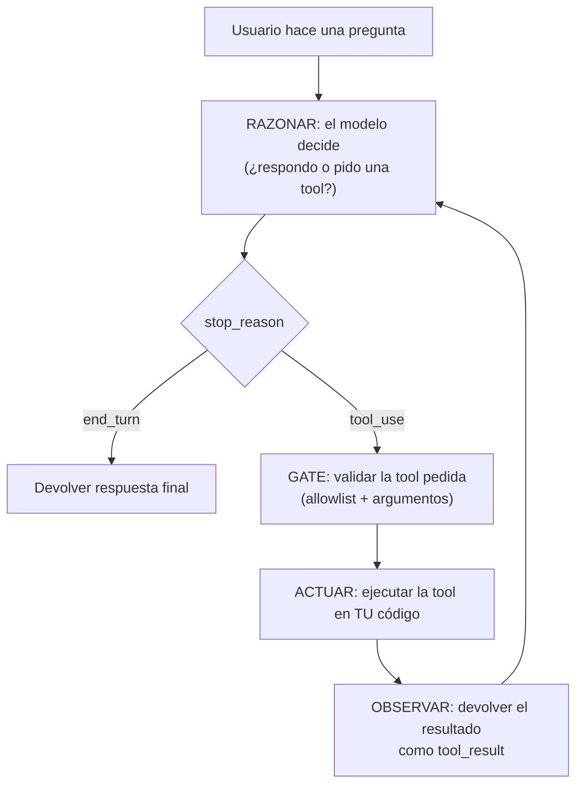
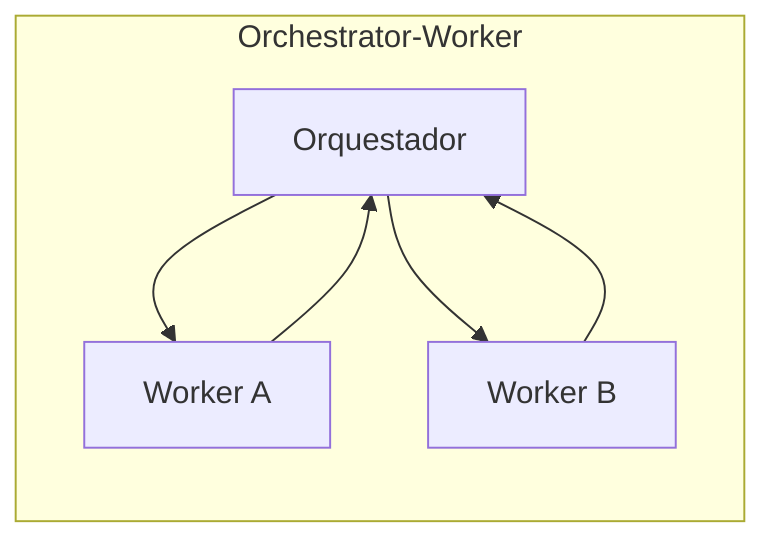

import Nivel from "@components/Nivel.astro";
import Reto from "@components/Reto.astro";
import Solucion from "@components/Solucion.astro";
import Quiz from "@components/Quiz.astro";
import CheckDominio from "@components/CheckDominio.astro";

<Nivel nivel="intermedio" />

Hasta ahora el LLM **respondía**: le pides algo, te devuelve texto o un JSON.
Incluso en [6.4](/fase-6-ai-engineering/6-4-structured-tools-mcp/) viste que puede
**pedir** una herramienta y tú la ejecutas — pero ahí el control del flujo era tuyo,
de una sola vuelta. Un **agente** da el siguiente salto: el modelo decide **qué hacer
a continuación**, en un bucle, hasta que la tarea está lista. No es magia ni una
tecnología nueva — es el tool use de 6.4 puesto **en un `while`**.

La trampa de 2026 es que todo el mundo aprende agentes "instalando un framework" y
nunca entiende qué hace por dentro. Cuando el agente entra en loop infinito, gasta
USD 40 en una tarea, o ejecuta una acción destructiva, no saben dónde mirar. Por eso
aquí construimos el **agent loop a mano primero**. El framework viene después, y
cuando llegue lo vas a reconocer: es el mismo loop, con la plomería resuelta.

## Objetivos de esta lección

Al terminar deberías ser capaz de:

- **O1 — Implementar** a mano el **agent loop ReAct** (razonar → actuar → observar →
  repetir) sin framework, con un **techo de pasos** como guardrail de costo y un
  **gate de allowlist** antes de ejecutar cada herramienta.
- **O2 — Explicar** qué es la **memoria** de un agente (corto plazo = la lista de
  mensajes; largo plazo = un store externo) y depurar por qué un agente "se olvida"
  o entra en loop.
- **O3 — Diseñar** un sistema agéntico eligiendo el **patrón** (single-agent,
  orchestrator-worker, supervisor, handoffs) y el **framework** por la **restricción
  dominante**, ubicando los **human-in-the-loop (HITL)** en las acciones irreversibles.

## Por qué esto importa (y paga)

El "💰" de la Fase 6 es claro: el premium salarial está en **diseñar, construir,
evaluar y sostener** sistemas de IA. Los agentes son la frontera donde eso se cobra
caro, por tres razones de mercado:

- El **capstone estrella del portafolio** (Fase 7) es un sistema **agéntico**
  end-to-end: recibe un input, clasifica/extrae, **decide** y **ejecuta acciones** en
  sistemas externos. El RAG genérico lo tiene el 80% de los portafolios; el agente que
  maneja fallas, no.
- "¿Implementaste el agent loop a mano alguna vez, o solo llamaste a un framework?" es
  la pregunta de entrevista que separa al que copió un tutorial del que **entiende el
  control de flujo, el costo y la superficie de ataque**.
- Un agente que **actúa** sin límites es un incidente esperando ocurrir. Saber dónde va
  el techo de costo, el gate de validación y el HITL es exactamente lo que un
  semi-senior aporta y un junior se salta.

> [!tip] En la práctica
> Un agente es un modelo de lenguaje al que le diste un botón y le dijiste "presiónalo
> cuando creas conveniente". Adorable. El peligro aparece cuando esas acciones son
> irreversibles y el techo de pasos es "infinito": un bucle de razonar-actuar sin
> límite es una factura —o un incidente— esperando a ocurrir. Ponle techo al tuyo.

## Lo que ya traes (activación)

Antes de seguir, recupera **de memoria** —sin abrir las notas— tres ideas previas. El
tirón mental es parte del aprendizaje.

1. De [6.2 · Prompt & Context Engineering](/fase-6-ai-engineering/6-2-prompt-context-engineering/):
   el patrón **ReAct** (Reason + Act) intercala pensamiento, acción y observación.
   ¿Recuerdas la forma "Thought → Action → Observation → ..."? Hoy le ponemos código.
2. De [6.4 · Tool use](/fase-6-ai-engineering/6-4-structured-tools-mcp/): el modelo
   **pide** una herramienta (`stop_reason == "tool_use"`), **tú** la validas y
   ejecutas, y le devuelves el resultado en un `tool_result`. El modelo nunca toca tu
   sistema.
3. De [6.4](/fase-6-ai-engineering/6-4-structured-tools-mcp/) también: entre "el modelo
   pidió" y "yo ejecuté" hay un **hueco** que es tuyo. Ahí validas (allowlist, rangos,
   permisos). Ese hueco vuelve hoy, multiplicado por cada vuelta del loop.

La idea-puente de hoy: **un agente es el bucle de tool use de 6.4 repetido**. Una sola
vuelta es "function calling". Repetirlo hasta que el modelo deje de pedir herramientas
es un **agente**. Todo lo que aprendiste sobre validar en el hueco se aplica en **cada
vuelta**.

## Worked example 1: el agent loop ReAct, a mano

Te muestro el razonamiento completo, en voz alta, antes de pedirte que lo hagas tú.
Caso concreto: un agente que responde **"¿cuánto cuesta una bici en dólares?"**. Para
contestar necesita **dos pasos encadenados**: buscar el precio en CLP, y luego
convertirlo a USD. Ningún paso aislado resuelve la pregunta — y el modelo **no sabe de
antemano** que necesita dos llamadas. Lo va a descubrir vuelta a vuelta. Eso es ReAct.

El ciclo es siempre el mismo:



> _Pienso en voz alta:_ tres cosas me preocupan **antes** de escribir nada. (1) Esto es
> un `while`: si el modelo sigue pidiendo herramientas para siempre, gasto tokens para
> siempre. Necesito un **techo de pasos**. (2) En cada vuelta el modelo me pide una
> tool; entre "pidió" y "ejecuté" tengo que **validar** (el hueco de 6.4). (3) El
> "estado" del agente es solo la **lista de mensajes** que va creciendo: ahí vive su
> memoria de corto plazo.

Primero, las herramientas y los guardrails. Fíjate que la **allowlist** es,
literalmente, "least privilege": el universo de acciones posibles es un conjunto
cerrado y pequeño.

```python
import anthropic

client = anthropic.Anthropic()  # lee ANTHROPIC_API_KEY del entorno

MAX_PASOS = 5                                  # techo de costo/latencia (guardrail)
HERRAMIENTAS_PERMITIDAS = {"buscar_precio", "convertir_clp_a_usd"}  # allowlist

PRECIOS_CLP = {"bici": 200_000, "casco": 25_000}
TASA_USD = 950  # CLP por dólar

def buscar_precio(producto: str) -> int:
    return PRECIOS_CLP[producto]

def convertir_clp_a_usd(monto_clp: int) -> float:
    return round(monto_clp / TASA_USD, 2)

REGISTRO = {"buscar_precio": buscar_precio, "convertir_clp_a_usd": convertir_clp_a_usd}

tools = [
    {
        "name": "buscar_precio",
        "description": "Devuelve el precio en CLP de un producto.",
        "input_schema": {
            "type": "object",
            "properties": {"producto": {"type": "string"}},
            "required": ["producto"],
        },
    },
    {
        "name": "convertir_clp_a_usd",
        "description": "Convierte un monto en CLP a dólares.",
        "input_schema": {
            "type": "object",
            "properties": {"monto_clp": {"type": "integer"}},
            "required": ["monto_clp"],
        },
    },
]
```

Ahora el loop. Es el bucle de tool use de 6.4, puesto en un `for` con techo:

```python
def ejecutar_agente(pregunta: str) -> str:
    mensajes = [{"role": "user", "content": pregunta}]  # la memoria de corto plazo

    for paso in range(MAX_PASOS):                        # techo: nunca loop infinito
        resp = client.messages.create(
            model="claude-opus-4-8", max_tokens=1024,
            tools=tools, messages=mensajes,
        )
        # 1. OBSERVAR el turno del modelo: lo guardo en la memoria, pase lo que pase.
        mensajes.append({"role": "assistant", "content": resp.content})

        # 2. ¿El modelo terminó? Entonces no pidió tools: devuelvo su texto.
        if resp.stop_reason != "tool_use":
            return next(b.text for b in resp.content if b.type == "text")

        # 3. El modelo pidió tools. Por cada una: GATE -> ACTUAR -> resultado.
        resultados = []
        for b in resp.content:
            if b.type != "tool_use":
                continue
            if b.name not in HERRAMIENTAS_PERMITIDAS:    # least privilege: permiso primero
                resultados.append({
                    "type": "tool_result", "tool_use_id": b.id,
                    "content": "herramienta no permitida", "is_error": True,
                })
                continue
            salida = REGISTRO[b.name](**b.input)          # ACTUAR (en TU código)
            resultados.append({
                "type": "tool_result", "tool_use_id": b.id, "content": str(salida),
            })

        # 4. Devuelvo las observaciones y vuelvo a llamar (siguiente vuelta del loop).
        mensajes.append({"role": "user", "content": resultados})

    return "Me detuve: alcancé el tope de pasos sin terminar la tarea."
```

> _Pienso en voz alta:_ sigue la traza de "¿cuánto cuesta una bici en dólares?".
> **Vuelta 1** — el modelo razona "necesito el precio" y pide `buscar_precio("bici")`.
> Yo valido (está en la allowlist), ejecuto, le devuelvo `200000`. **Vuelta 2** — ahora
> el modelo ya **vio** el precio en su memoria; razona "tengo CLP, falta convertir" y
> pide `convertir_clp_a_usd(200000)`. Ejecuto, le devuelvo `210.53`. **Vuelta 3** — el
> modelo ya tiene todo; razona, no pide nada (`stop_reason == "end_turn"`) y redacta
> "La bici cuesta unos USD 210". El loop termina solo. Nadie le dijo que eran dos
> pasos; lo **descubrió** observando.

Las cuatro piezas que tienes que reconocer en cualquier agente, por elaborado que sea:

| Pieza | En el código | Por qué existe |
|---|---|---|
| **Razonar** | `client.messages.create(...)` con `tools` | El modelo decide el siguiente paso |
| **Techo** | `for paso in range(MAX_PASOS)` | Cortar costo/latencia; nunca loop infinito |
| **Gate** | `if b.name not in HERRAMIENTAS_PERMITIDAS` | Least privilege; validar antes de actuar |
| **Observar** | `mensajes.append({... tool_result ...})` | Devolver el resultado para la siguiente vuelta |

## Worked example 2: memoria del agente

"Memoria" suena sofisticado, pero en el loop de arriba ya la tienes delante: es la
**lista `mensajes`** que crece en cada vuelta. Hay dos clases, y confundirlas es la
causa #1 de bugs de agentes.

- **Memoria de corto plazo (working memory):** la conversación del **run actual** —
  esa lista `mensajes`. Vive en RAM, muere cuando el run termina. Es lo que hace que en
  la vuelta 2 el modelo "recuerde" el precio que vio en la vuelta 1.
- **Memoria de largo plazo (persistente):** lo que el agente debe recordar **entre
  runs** o entre sesiones (preferencias del usuario, hechos aprendidos, el estado de
  una tarea larga). Esto **no** cabe en la lista de mensajes: vive en un **store
  externo** (una base de datos, un archivo, un vector store) que el agente lee al
  arrancar y escribe a medida que aprende.

> _Pienso en voz alta:_ dos síntomas y su diagnóstico. (1) "El agente se olvida de lo
> que le dije hace tres turnos" → o no estoy reenviando la lista completa de mensajes
> (la API es **sin estado**, te toca reenviar el historial cada vez), o la conversación
> creció tanto que tuve que **compactarla** y perdí ese dato. (2) "Quiero que recuerde
> mi nombre la próxima semana" → eso es largo plazo; la lista de mensajes no sirve,
> necesito un store. Casi todos los frameworks llaman a la persistencia de corto plazo
> un **checkpointer** (LangGraph) y la indexan por un `thread_id`.

El dato incómodo: la memoria de corto plazo **cuesta dinero cada vuelta**. Como
reenvías toda la lista de mensajes en cada llamada, una conversación larga significa
input tokens crecientes. Por eso 6.16 habla de compactación y caching — y por eso el
**techo de pasos** no es solo seguridad, también es presupuesto.

## Worked example 3: del loop al framework (y cuál elegir)

Ya tienes el loop a mano. ¿Para qué un framework? Para no reescribir, en cada proyecto,
la plomería que rodea al loop: persistencia de memoria, reintentos, streaming, HITL,
trazas, multi-agente. **Un framework no reemplaza tu entendimiento del loop — lo
empaqueta.** Si no entendieras lo de arriba, el framework sería una caja negra.

El mismo agente de precios en **LangGraph**, con su agente ReAct pre-armado, se reduce
a esto (verificado contra la API vigente 2026):

```python
from langgraph.prebuilt import create_react_agent

def buscar_precio(producto: str) -> int:
    """Devuelve el precio en CLP de un producto."""
    return {"bici": 200_000, "casco": 25_000}[producto]

def convertir_clp_a_usd(monto_clp: int) -> float:
    """Convierte un monto en CLP a dólares."""
    return round(monto_clp / 950, 2)

agente = create_react_agent(
    model="anthropic:claude-opus-4-8",
    tools=[buscar_precio, convertir_clp_a_usd],
)

resultado = agente.invoke({"messages": [{"role": "user", "content": "¿cuánto vale una bici en USD?"}]})
print(resultado["messages"][-1].content)
```

> _Pienso en voz alta:_ `create_react_agent` esconde **exactamente** mi loop: el `for`,
> el chequeo de `stop_reason`, el feed-back del `tool_result`. Lo que gano es memoria
> persistente casi gratis (`checkpointer=` + un `thread_id` en la config), HITL y
> trazas. Lo que **pierdo** si no entiendo el loop: la capacidad de depurar cuando el
> agente hace algo raro. El techo de pasos sigue siendo mío de decidir (LangGraph lo
> llama `recursion_limit`).

Lo mismo en **Pydantic AI**, que apuesta por tipado fuerte y salida estructurada:

```python
from pydantic_ai import Agent

agente = Agent("anthropic:claude-opus-4-8")

@agente.tool_plain
def buscar_precio(producto: str) -> int:
    """Devuelve el precio en CLP de un producto."""
    return {"bici": 200_000, "casco": 25_000}[producto]

resultado = agente.run_sync("¿Cuánto vale una bici en CLP?")
print(resultado.output)
```

### Elegir por la restricción dominante

No existe "el mejor framework de agentes". Existe **el que resuelve tu restricción
dominante** — la cosa que, si la haces mal, hunde el proyecto. La forma senior de
decidir:

| Framework | Restricción dominante que resuelve | Elígelo cuando… |
|---|---|---|
| **LangGraph** | Control fino del **estado** y flujos largos | Necesitas grafos explícitos, durabilidad, HITL y memoria persistente serios; el flujo no es un simple loop |
| **Pydantic AI** | **Type-safety** y salida estructurada | Quieres DX tipo FastAPI, validación pydantic de extremo a extremo, código que falla en tu IDE y no en producción |
| **OpenAI Agents SDK** | Primitivas livianas de **handoffs y guardrails** | Quieres un framework mínimo con handoffs y guardrails de fábrica; no quieres un grafo entero |
| **Claude Agent SDK** | **Menor fricción** si ya vives en Claude Code + MCP | Quieres el mismo harness de agente que usa Claude Code, con MCP de primera clase |
| **CrewAI** | Prototipado rápido de **crews multi-agente por rol** | Quieres montar "un equipo de agentes con roles" rápido, sin diseñar el grafo a mano |

> [!tip] En la práctica
> "¿Cuál es el mejor framework?" es la pregunta de quien no tiene una restricción. Tener
> una restricción dominante clara es un lujo: significa que **entiendes tu problema**.
> Si no sabes cuál es tu restricción, empieza con el loop a mano. Te la va a revelar.

## Worked example 4: patrones multi-agente y HITL

Antes de meter más agentes, la regla de oro: **empieza con un solo agente**. Un agente
con buenas herramientas resuelve casi todo. Multi-agente añade coordinación, costo y
puntos de falla. Súbete de nivel solo cuando un single-agent no alcanza.

Cuando sí escalas, hay tres patrones que debes saber nombrar:



- **Orchestrator-worker:** un agente jefe descompone la tarea y reparte subtareas a
  workers (que pueden correr en paralelo), luego junta los resultados. Bueno para
  fan-out: "investiga estos 5 temas en paralelo".
- **Supervisor:** un agente router decide **a cuál especialista** mandar cada turno
  (agente de matemáticas vs agente de búsqueda). El supervisor manda; los especialistas
  no se hablan entre ellos.
- **Handoffs:** un agente le **pasa el control** a otro y se retira (como un triage que
  deriva al especialista correcto). El que recibe el control continúa la conversación.

La pieza que **nunca** es opcional cuando el agente **actúa** sobre el mundo:
**human-in-the-loop (HITL)**. La regla, idéntica a la del gate de 6.4 pero aplicada al
loop:

> Acción **reversible** → automática. Acción **irreversible** (pagar, borrar, enviar,
> escalar a un humano externo) → el agente se **detiene** y pide confirmación antes de
> ejecutar.

> _Pienso en voz alta:_ en mi loop a mano, el HITL es trivial de implementar — es otra
> rama en el gate. En vez de ejecutar la tool, devuelvo un `tool_result` que dice
> "pendiente de aprobación humana" y pauso el loop hasta que un humano apruebe. Los
> frameworks lo formalizan (LangGraph: `interrupt`), pero el concepto es el mismo: hay
> acciones que un predictor de tokens no debería disparar solo.

## Lo que parece cierto pero no lo es

:::caution[Misconception 1 — "un agente es una tecnología distinta del tool use"]
Falso. Un agente **es** el tool use de 6.4 dentro de un bucle. Una vuelta = function
calling. N vueltas hasta que el modelo deja de pedir tools = agente. No hay un "motor de
agentes" mágico: hay un `while`, un modelo que decide, y tu código que valida y ejecuta.
Si entiendes el loop, entiendes cualquier framework de agentes — todos esconden este
mismo bucle.
:::

:::caution[Misconception 2 — "más agentes = mejor"]
Falso, y caro. Cada agente extra añade coordinación, latencia, costo y un punto de falla
nuevo. El default correcto es **un solo agente con buenas herramientas**. Multi-agente se
justifica por una restricción real (fan-out paralelo, especialización fuerte, límites de
contexto), no por sonar sofisticado. Un sistema de 5 agentes que un single-agent resolvía
es deuda técnica disfrazada de arquitectura.
:::

:::caution[Misconception 3 — "el techo de pasos es opcional / lo pongo después"]
Falso, y es el bug que aparece en la factura. Sin techo, un modelo que se confunde puede
pedir herramientas en loop hasta agotar tu presupuesto o tu rate limit. El techo
(`MAX_PASOS`, `recursion_limit`, `task_budget`) es un **guardrail de costo de primera
clase**, no un detalle. Va desde la primera versión, igual que el gate de seguridad.
:::

:::caution[Misconception 4 — "el framework hace que no necesite entender el loop"]
Falso. El framework te ahorra **escribir** la plomería, no **entenderla**. Cuando el
agente entre en loop, gaste de más, o ejecute algo que no debía, vas a abrir el capó — y
si nunca viste el loop a mano, no sabrás qué estás mirando. Por eso este orden:
loop a mano primero, framework después. El framework es un atajo para quien ya conoce el
camino.
:::

## Práctica con andamiaje (predecir antes de construir)

Aún no escribes código. Primero **predices** — el Primero-Sin-IA en miniatura.

**1. Predicción (traza del loop).** Llamas a `ejecutar_agente("¿cuánto vale una bici en
USD?")` con el código del worked example 1. **¿Cuántas vueltas da el `for` antes de
devolver la respuesta, y qué pide el modelo en cada una?**

**2. Parsons (ordena el loop).** Estas cinco acciones están desordenadas. Ponlas en el
orden correcto de **una vuelta** del agent loop:

- _(a)_ Devolver al modelo los `tool_result` y volver a llamar (siguiente vuelta).
- _(b)_ Llamar al modelo con `tools` y la lista de mensajes.
- _(c)_ Si `stop_reason != "tool_use"`, devolver el texto final y terminar.
- _(d)_ Por cada tool pedida: comprobar la allowlist y, si pasa, ejecutarla.
- _(e)_ Añadir el turno del modelo (`resp.content`) a la lista de mensajes.

**3. Predicción (techo).** Un modelo confundido pide `buscar_precio` una y otra vez sin
terminar nunca. Con `MAX_PASOS = 5`, **¿cuántas veces se llama al modelo, y qué devuelve
`ejecutar_agente`?**

<Solucion title="Ver razonamiento (ábrelo solo después de intentarlo)">
1. **Tres vueltas.** Vuelta 1: pide `buscar_precio("bici")`. Vuelta 2: ya vio el precio,
   pide `convertir_clp_a_usd(200000)`. Vuelta 3: ya tiene todo, no pide nada
   (`end_turn`) y devuelve el texto final. El modelo descubrió que eran dos pasos
   observando los resultados.
2. Orden correcto: **(b) → (e) → (c) → (d) → (a)**. Razonar, guardar el turno, ¿terminó?,
   validar+actuar, devolver observaciones y repetir.
3. El modelo se llama **5 veces** (una por vuelta hasta `MAX_PASOS`), nunca recibe un
   `end_turn`, el `for` se agota y `ejecutar_agente` devuelve el mensaje de "alcancé el
   tope de pasos". Sin ese techo, el loop sería infinito.
</Solucion>

## Ejercicios Primero-Sin-IA

Dos entregables. Trabájalos **a mano primero**, sin IA, dentro del timebox. Las carpetas
viven en tu repo: ábrelas en VS Code.

<Reto title="El agent loop ReAct, a mano (con techo y gate)" timebox="45 min">

Carpeta: `ejercicios/fase-6/agente-react-a-mano/`

Vas a implementar el corazón de esta lección: el **agent loop**. Para que sea testeable
**sin API ni API key**, el "modelo" se te **inyecta** como un parámetro `llamar_modelo`
(una función que recibe la lista de mensajes y devuelve un objeto `Respuesta`). Es el
mismo loop del worked example 1, con `client.messages.create(...)` reemplazado por
`llamar_modelo(mensajes)` — así puedes probar la **lógica del loop** con un modelo falso
guionizado, de forma determinista.

1. **A mano (predicción):** en `prediccion.md`, para los 3 casos del README (respuesta
   directa, una tool y luego responde, y un modelo terco que nunca termina), predice qué
   devuelve `ejecutar_agente` y cuántas vueltas da. **No ejecutes nada todavía.**
2. **Código:** completa `ejecutar_agente(pregunta, llamar_modelo)` en `agente.py`
   aplicando, en orden: **observar** (guardar el turno) → **¿terminó?** → **gate**
   (allowlist) → **actuar** → devolver `tool_result` → repetir, con **techo de pasos**.
   Haz pasar los tests con `pytest`.
3. **Reflexión:** en `verificacion.md`, explica en 2-3 frases por qué el techo de pasos
   es a la vez una defensa de **costo** y de **seguridad**, y por qué la allowlist es
   **least privilege** (conéctalo con Excessive Agency, OWASP LLM06).

**Criterios de "hecho":**
- [ ] `prediccion.md` existe **antes** de ejecutar, con las 3 predicciones + razón.
- [ ] Todos los tests pasan (`pytest`).
- [ ] Una tool **fuera de la allowlist** se rechaza con un `tool_result` de error y
      **nunca se ejecuta**.
- [ ] Un modelo que nunca termina se corta en `MAX_PASOS` (no loop infinito) y devuelve
      el resultado con `detenido_por == "tope_pasos"`.
- [ ] `verificacion.md` conecta el techo con costo + seguridad y la allowlist con LLM06.

Cuando termines, pídele a tu IA que lo corrija con el framework de `.ai/`.

</Reto>

<Solucion title="Pista (NO la solución): si te traba el orden dentro de la vuelta">
El error #1 es ejecutar la tool antes de comprobar la allowlist, o devolver el texto
final sin antes guardar el turno del modelo en la lista de mensajes. Una vuelta es:
(1) llamar al modelo; (2) **siempre** añadir `resp.content` a `mensajes`; (3) si
`stop_reason != "tool_use"`, devolver el texto y salir; (4) por cada bloque `tool_use`,
**primero** allowlist, **después** ejecutar; (5) añadir todos los `tool_result` como un
mensaje de rol `user` y dejar que el `for` haga la siguiente vuelta. El techo es el
propio `range(MAX_PASOS)`: si el `for` se agota sin un `end_turn`, devuelves
`detenido_por="tope_pasos"`.
</Solucion>

<Reto title="Diseño: sistema agéntico con patrón, framework y HITL" timebox="40 min">

Carpeta: `ejercicios/fase-6/diseno-multiagente-hitl/`

Ejercicio de **diseño/razonamiento** (sin código que ejecutar). En `diseno.md` diseñas un
agente de **soporte** que recibe tickets de clientes y puede: responder dudas, consultar
el estado de un pedido, **emitir un reembolso** y **escalar a un humano**. Hay un volumen
alto y algunos tickets requieren buscar en la base de conocimiento interna.

Para ese escenario, decide y **justifica por la restricción dominante**:

- **Patrón:** ¿single-agent, orchestrator-worker, supervisor o handoffs? Da la razón
  (no "porque suena bien"): ¿cuál es la restricción que decide?
- **Framework:** elige uno de los cinco de la lección y di **qué restricción** te hace
  elegirlo. Nombra explícitamente qué pierdes con esa elección.
- **HITL:** marca **qué acción(es)** exigen confirmación humana y por qué (reversibilidad
  / blast radius). Marca cuáles van automáticas.
- **Guardrails de costo:** dónde pones el techo de pasos y por qué.
- **Memoria:** qué guardas en corto plazo (run actual) y qué en largo plazo (entre
  tickets del mismo cliente). Da un ejemplo concreto de cada uno.
- **Seguridad:** nombra **tres** riesgos del OWASP LLM/Agentic que aplican aquí (p. ej.
  Excessive Agency LLM06, Improper Output Handling LLM05, prompt injection LLM01) con una
  mitigación concreta por riesgo.

**Criterios de "hecho":**
- [ ] El patrón elegido viene con una **restricción dominante** explícita, no con un "me
      gusta más".
- [ ] El framework se justifica por restricción y nombras qué **pierdes**.
- [ ] El reembolso (irreversible) está marcado como **HITL**; al menos una acción
      reversible va automática.
- [ ] Distingues memoria de corto plazo de largo plazo con un ejemplo concreto de cada
      una.
- [ ] Tres riesgos OWASP distintos, cada uno con una mitigación accionable.

Cuando termines, pídele a tu IA que lo corrija con el framework de `.ai/`.

</Reto>

## Check de dominio

<CheckDominio
  title="Marca solo lo que puedes EXPLICAR sin notas"
  items={[
    "Dibujar el agent loop ReAct (razonar → actuar → observar) y decir qué corta cada vuelta.",
    "Explicar por qué un agente es el tool use de 6.4 dentro de un bucle.",
    "Decir qué hace el techo de pasos y por qué es a la vez costo y seguridad.",
    "Explicar dónde va el gate de allowlist y por qué es least privilege (LLM06).",
    "Distinguir memoria de corto plazo (lista de mensajes) de largo plazo (store externo).",
    "Nombrar los patrones orchestrator-worker, supervisor y handoffs y cuándo usar cada uno.",
    "Explicar la regla de HITL: reversible automático, irreversible con confirmación.",
    "Elegir un framework por restricción dominante y nombrar qué pierdes con esa elección.",
  ]}
/>

Y dos preguntas rápidas de recuperación:

<Quiz
  question="Tu agente, ante una pregunta que requiere dos herramientas encadenadas, da 3 vueltas en el loop antes de responder. ¿Por qué 3 y no 2?"
  options={[
    "Porque cada herramienta tarda una vuelta extra por latencia de red.",
    "Vuelta 1: el modelo pide la primera tool. Vuelta 2: ya vio ese resultado y pide la segunda. Vuelta 3: ya tiene todo, no pide nada (end_turn) y redacta la respuesta. La última vuelta es para razonar con las dos observaciones, no para pedir una tool.",
    "Es un bug: deberían ser 2 vueltas; la tercera es un reintento.",
  ]}
  answer={1}
  explanation="ReAct intercala razonar/actuar/observar. El modelo no sabe de antemano que necesita dos tools: lo descubre observando. La vuelta extra es el turno final en el que, con ambas observaciones ya en su memoria, razona y produce el texto sin pedir más herramientas (stop_reason == 'end_turn')."
/>

<Quiz
  question="Estás eligiendo framework para un agente cuya restricción dominante es 'el flujo no es un simple loop: hay ramas, estado complejo, pausas para aprobación humana y memoria que debe sobrevivir reinicios'. ¿Cuál encaja mejor y por qué?"
  options={[
    "CrewAI, porque permite montar varios agentes por rol rápidamente.",
    "LangGraph, porque resuelve precisamente el control fino del estado: grafos explícitos, durabilidad/checkpointer para memoria persistente, y HITL (interrupt) de primera clase.",
    "Cualquiera sirve; los frameworks de agentes son intercambiables.",
  ]}
  answer={1}
  explanation="La restricción dominante es el control del estado y la durabilidad (ramas, pausas HITL, memoria que sobrevive reinicios). Ese es exactamente el terreno de LangGraph: grafos explícitos, checkpointer e interrupt. CrewAI optimiza otra cosa (crews por rol). 'Cualquiera sirve' es la respuesta de quien no identificó la restricción."
/>

:::tip[Si ya armaste agentes con un framework]
Quizás ya usaste LangGraph, CrewAI o el Claude Agent SDK y montaste un agente que
funciona. **Valida y salta:** ¿puedes, sin notas, (1) escribir el agent loop **a mano**
—el `for`, el chequeo de `stop_reason`, el feed-back del `tool_result`— sin que el
framework lo haga por ti; (2) decir exactamente dónde va el techo de pasos y por qué; y
(3) defender tu elección de framework por la **restricción dominante**, nombrando qué
pierdes? Si las tres te salen, usa los ejercicios para auditar un agente tuyo real
(¿tiene techo? ¿allowlist? ¿HITL en lo irreversible?). Si el loop a mano se siente
borroso, ahí está tu hueco: el framework te lo tapó sin que lo entendieras.
:::

## Recursos

Documentación oficial primero; los blogs caducan rápido.

- **Building effective agents (Anthropic):**
  [el artículo de referencia](https://www.anthropic.com/research/building-effective-agents)
  — workflows vs agents, y por qué empezar simple.
- **Tool use / agent loop (Anthropic):**
  [Tool use overview](https://platform.claude.com/docs/en/build-with-claude/tool-use/overview)
  — el bucle que hoy pusiste en un `while`.
- **LangGraph (agentes con estado):**
  [docs oficiales](https://langchain-ai.github.io/langgraph/) — `create_react_agent`,
  `StateGraph`, checkpointers e `interrupt` (HITL).
- **Pydantic AI:**
  [docs oficiales](https://ai.pydantic.dev/) — agentes con tipado fuerte y salida
  estructurada.
- **OpenAI Agents SDK:**
  [docs oficiales](https://openai.github.io/openai-agents-python/) — handoffs y
  guardrails como primitivas.
- **Claude Agent SDK:**
  [docs oficiales](https://platform.claude.com/docs/en/api/agent-sdk/overview) — el harness de
  agente de Claude Code, con MCP de primera clase.
- **OWASP Top 10 for LLM Applications:**
  [genai.owasp.org](https://genai.owasp.org/) — Excessive Agency (LLM06) y la lista
  agéntica; lo profundizas en [6.14](/fase-6-ai-engineering/6-14-seguridad-llm/).

> Mantén tus links vivos en `articulos.md` dentro de la carpeta de esta sub-unidad.

## Conexión con el proyecto de la fase

El capstone de la Fase 6 es una
[**Plataforma RAG de producción**](/fase-6-ai-engineering/proyecto/), y el agente es lo
que convierte un RAG estático en uno **que actúa**:

- El **retrieval** deja de ser un paso fijo del pipeline y pasa a ser **una herramienta
  que el agente invoca cuando la necesita**: ese es el salto de RAG estático a **Agentic
  RAG** ([6.7](/fase-6-ai-engineering/6-7-rag-a-fondo/)).
- El **techo de pasos**, el **gate de allowlist** y el **HITL** que armaste hoy son
  entregables directos del **Definition of Done** del capstone: validación de salida
  antes de ejecutar, least-privilege de tools, HITL para acciones sensibles y techo de
  costo. Documéntalos en un **ADR**.
- Cómo **evalúas** que tu agente funciona —tool-call accuracy, trayectoria, costo por
  paso— es el tema de [6.9 · Eval-driven development](/fase-6-ai-engineering/6-9-eval-driven-development/),
  el ship-gate de todo sistema agéntico.

Y mirando más allá: el **capstone estrella del portafolio** vive en la Fase 7 — una
automatización **agéntica** end-to-end (input → IA clasifica/extrae → decide → ejecuta en
sistemas externos, idempotente, observable, con eval gate, guardrail de I/O, techo de
costo y HITL). El loop que escribiste hoy es su esqueleto.

## Reflexión y repaso espaciado

Antes de cerrar, responde en tu cuaderno o en `articulos.md`:

- ¿Te sorprendió que el agente "descubriera" que necesitaba dos pasos en vez de
  saberlo de antemano? ¿En qué tarea tuya un agente con tools tendría sentido?
- Piensa en una acción que tu agente podría ejecutar: ¿es reversible o irreversible?
  ¿Dónde pondrías el HITL?

**Gancho de spaced repetition** — agenda estos repasos:

- **Mañana (+1 día):** sin mirar, escribe el agent loop ReAct (las 4 piezas: razonar,
  techo, gate, observar) y dibújalo como diagrama.
- **En 3 días:** reescribe de memoria `ejecutar_agente` (la firma, el `for`, el chequeo
  de `stop_reason`, el gate, el feed-back del `tool_result`). Si no puedes, no lo
  aprendiste todavía.
- **En 1 semana:** explícale a alguien (o a tu IA, en voz alta) la diferencia entre
  memoria de corto y largo plazo, y elige un framework para un caso inventado
  justificándolo por su restricción dominante.

Siguiente parada:
[**6.9 · Eval-driven development**](/fase-6-ai-engineering/6-9-eval-driven-development/),
donde aprendes a medir si tu agente —y tu RAG— de verdad funcionan, antes de optimizar
nada. Son los unit tests de la IA.
