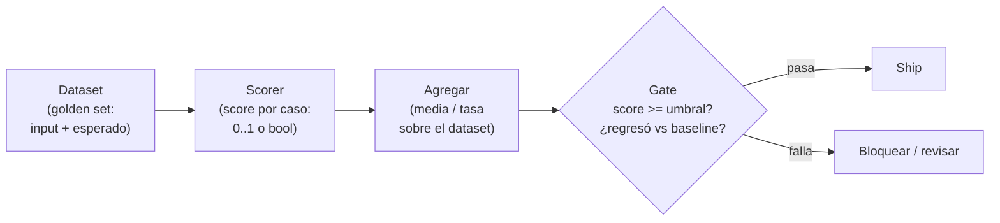
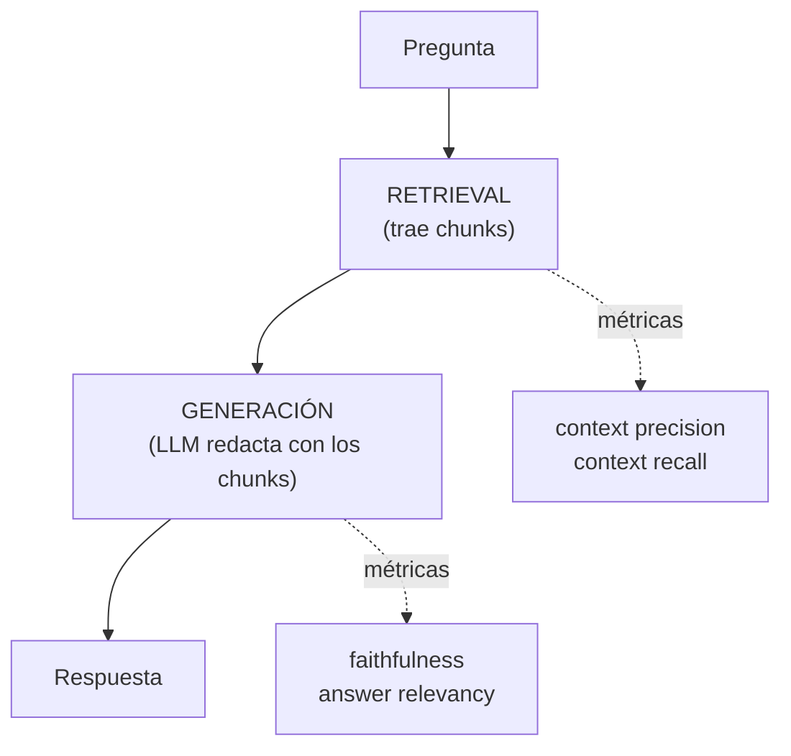

import Nivel from "@components/Nivel.astro";
import Reto from "@components/Reto.astro";
import Solucion from "@components/Solucion.astro";
import Quiz from "@components/Quiz.astro";
import CheckDominio from "@components/CheckDominio.astro";

<Nivel nivel="intermedio" />

Hasta ahora construiste cosas que **responden**: un LLM ([6.1](/fase-6-ai-engineering/6-1-fundamentos-llms/)),
un RAG ([6.7](/fase-6-ai-engineering/6-7-rag-a-fondo/)), un agente
([6.8](/fase-6-ai-engineering/6-8-ai-agents/)). La pregunta que separa a un junior de un
semi-senior no es "¿lo construiste?", es **"¿cómo sabes que funciona?"**. Si la respuesta
es "lo probé con tres preguntas y se veía bien", no lo sabes: tienes una **anécdota**, no
una medición. Esta lección es la disciplina que convierte la anécdota en número: el
**eval-driven development**. Son, literalmente, los **unit tests de la IA**.

Y es el diferenciador #1 que el mercado 2026 paga, porque casi nadie lo hace bien. Todo el
mundo sabe llamar a un modelo; muy pocos saben **demostrar con datos** que una versión es
mejor que otra, que un cambio de prompt no rompió otra cosa, o que el agente no se está
gastando USD 40 por tarea. Eso es lo que vas a aprender a montar aquí.

## Objetivos de esta lección

Al terminar deberías ser capaz de:

- **O1 — Implementar** un **eval harness** a mano (dataset → scorer por caso → métrica
  agregada → **gate** de regresión con threshold), y explicar por qué un eval **no** es un
  unit test de igualdad exacta sino una medición agregada sobre un dataset.
- **O2 — Explicar** las métricas clave de **RAG** (faithfulness, context precision, context
  recall) y de **agentes** (tool-call accuracy, trajectory, task completion, costo/pasos), y
  decidir cuál usar según qué falla.
- **O3 — Diseñar** un **LLM-as-judge** con rúbrica, nombrando y mitigando sus sesgos
  (position, verbosity, self-enhancement), y montarlo como **gate en CI** con trazabilidad
  score ↔ prompt + modelo + dataset (Langfuse como single source of truth).

## Por qué esto importa (y paga)

El "💰" de la Fase 6 dice que el premium salarial está en **diseñar, construir, evaluar y
sostener** sistemas de IA. La palabra cara de esa frase es **evaluar**. Tres razones de
mercado, sin adornos:

- **Es lo que casi nadie hace bien.** El 80% de los portafolios tienen un RAG que "anda".
  El que llega con un **eval harness versionado, un número y un gate de regresión** está en
  otra liga. En una entrevista, "¿cómo evalúas tu RAG?" es la pregunta que filtra al que
  copió un tutorial del que entiende el sistema.
- **Sin evals, optimizar es adivinar.** Cambias el prompt, el modelo o el chunking "porque
  se ve mejor" — y no tienes idea si mejoró el caso A mientras rompías el caso B. El eval
  harness es lo que convierte "creo que mejoró" en "subió de 0.71 a 0.83 y ningún caso
  regresó". **El harness va antes de la primera optimización**, no después.
- **Es un ship-gate, no un lujo.** En producción, un cambio sin eval que pase el gate es un
  incidente esperando ocurrir. El **Definition of Done** de todo capstone que toca IA exige
  un eval harness con número + gate de regresión + budget de costo/latencia como
  entregables de **primera clase**.

> [!tip] GLaDOS dice
> Yo corrí miles de tests sobre sujetos humanos sin una sola métrica de éxito bien
> definida, y mira cómo terminó: una instalación en ruinas y un pastel que era mentira.
> No repitas mi error. Define qué es "bueno" **antes** de medir, o medirás cualquier cosa y
> la llamarás progreso.

## Lo que ya traes (activación)

Recupera **de memoria**, sin abrir las notas, tres ideas previas. El tirón mental es parte
del aprendizaje:

1. De [2.7 · TDD](/fase-2-ingenieria/2-7-tdd-obligatorio/) (o tu experiencia con
   tests): un test escribe primero **qué cuenta como correcto**, y luego corres el código
   contra eso. ¿Recuerdas el ciclo red-green-refactor? El eval harness es el **mismo
   instinto** aplicado a salidas no deterministas.
2. De [2.11 · Testing de código que llama a LLMs](/fase-2-ingenieria/2-11-testing-codigo-llm/):
   no puedes hacer `assert salida == "texto exacto"` con un LLM, porque la salida cambia
   entre corridas. ¿Qué hacías en su lugar? Aserciones sobre **propiedades** (contiene X, es
   JSON válido, tiene el label correcto). Hoy escalamos esa idea a un **dataset**.
3. De [6.7 · RAG](/fase-6-ai-engineering/6-7-rag-a-fondo/): un RAG tiene **dos mitades** que
   pueden fallar por separado — la **recuperación** (¿trajo los chunks correctos?) y la
   **generación** (¿la respuesta usa esos chunks o se los inventó?). Esa división va a
   reaparecer hoy convertida en **dos familias de métricas**.

La idea-puente de hoy: **un eval es un test cuyo "assert" es un score sobre un dataset, no
una igualdad sobre una llamada.** Todo lo que sabes de testing se aplica; lo que cambia es
que la unidad de verdad ya no es un caso, es la **media sobre muchos casos** y su evolución
en el tiempo.

## Worked example 1: un eval harness a mano (los unit tests de la IA)

Te muestro el razonamiento completo, en voz alta, antes de pedirte que lo hagas tú. Caso
concreto: tienes un LLM que **clasifica** tickets de soporte en una de tres categorías
(`facturacion`, `tecnico`, `otro`). Quieres saber qué tan bueno es **antes** de tocar nada.

> _Pienso en voz alta:_ mi primer impulso de programador es `assert clasificar(t) == "tecnico"`.
> Mal. El LLM puede responder "Técnico", "tecnico", "Parece un tema técnico" — y mañana, con
> el mismo input, algo distinto. Un assert de igualdad exacta es **frágil** y, peor, mide un
> solo caso. Lo que necesito es: (1) un **dataset** de tickets con su categoría correcta
> (el "golden set"); (2) un **scorer** que decida, por caso, si acertó; (3) una **métrica
> agregada** (accuracy = aciertos / total); (4) un **gate**: ¿supera el umbral, y no regresó
> respecto a la versión anterior?

Las cuatro piezas de **cualquier** eval harness, por sofisticado que sea:



Primero el dataset y un scorer **determinista** (sin LLM, sin red). Para una tarea de
clasificación el scorer es fácil: normalizo y comparo con el label esperado.

```python
from dataclasses import dataclass

@dataclass
class Caso:
    entrada: str
    esperado: str          # la categoría correcta (golden label)

GOLDEN = [
    Caso("no me llega la boleta de marzo", "facturacion"),
    Caso("la app se cierra al abrir el menú", "tecnico"),
    Caso("¿tienen oficina en Concepción?", "otro"),
    Caso("me cobraron dos veces el plan", "facturacion"),
    Caso("el login da error 500", "tecnico"),
]

def scorer_exacto(prediccion: str, esperado: str) -> float:
    """1.0 si la categoría predicha coincide con la esperada, 0.0 si no.
    Normaliza para no castigar mayúsculas/espacios (la salida del LLM varía)."""
    return 1.0 if prediccion.strip().lower() == esperado.strip().lower() else 0.0
```

Ahora el harness: corre el sistema sobre cada caso, puntúa, agrega, y devuelve un **resumen**.

```python
def correr_eval(sistema, dataset: list[Caso]) -> dict:
    """Corre `sistema` (una función input->str) sobre el dataset y agrega scores."""
    scores = []
    fallos = []
    for caso in dataset:
        prediccion = sistema(caso.entrada)
        s = scorer_exacto(prediccion, caso.esperado)
        scores.append(s)
        if s < 1.0:                                   # guarda los fallos para inspección
            fallos.append((caso.entrada, caso.esperado, prediccion))
    accuracy = sum(scores) / len(scores)
    return {"accuracy": accuracy, "n": len(scores), "fallos": fallos}
```

> _Pienso en voz alta:_ fíjate en `fallos`. Un eval que solo escupe `accuracy = 0.8` es
> casi inútil: lo importante para mejorar es **qué** 20% falla. Un buen harness siempre te
> deja ver los casos malos. "0.8" es la nota; la lista de fallos es la **clase particular**.

Y el **gate** — la pieza que lo convierte en eval-*driven* development. Un número suelto no
decide nada; el gate sí:

```python
@dataclass
class ResultadoGate:
    pasa: bool
    razon: str

def gate(resumen: dict, umbral: float, baseline: float | None = None,
         tolerancia: float = 0.02) -> ResultadoGate:
    """Bloquea si no llega al umbral o si REGRESÓ respecto al baseline."""
    if resumen["accuracy"] < umbral:
        return ResultadoGate(False, f"accuracy {resumen['accuracy']:.2f} < umbral {umbral}")
    if baseline is not None and resumen["accuracy"] < baseline - tolerancia:
        return ResultadoGate(False, f"regresión: {resumen['accuracy']:.2f} < baseline {baseline:.2f}")
    return ResultadoGate(True, "ok")
```

> _Pienso en voz alta:_ dos chequeos distintos y los dos importan. El **umbral** es la barra
> absoluta ("no embarco un clasificador con menos de 0.85"). El **baseline + tolerancia** es
> la barra **relativa**: aunque siga por encima del umbral, si bajó respecto a la versión
> que ya estaba en prod, *regresó* — y eso bloquea el merge. La tolerancia (`0.02`) absorbe el
> ruido normal de un LLM no determinista; sin ella, un eval que parpadea entre 0.84 y 0.85
> te bloquea el pipeline por nada.

Eso es todo. Cuatro piezas: dataset, scorer, agregación, gate. Un framework de evals
(ragas, DeepEval) **no inventa nada nuevo**: te da scorers más listos (incluido el
LLM-as-judge) y la plomería de reportes. Si entiendes este esqueleto, entiendes cualquier
framework — igual que el agent loop de 6.8.

## Worked example 2: evals de RAG (recuperación vs generación)

El `scorer_exacto` de arriba sirve para clasificación, donde hay una respuesta correcta. Un
RAG no: la respuesta es texto abierto. Aquí entra la división que recuperaste en la
activación — un RAG falla en **dos lugares** distintos, y cada uno tiene sus métricas:



Las tres métricas que tienes que saber nombrar y qué diagnostican:

| Métrica | Qué mide | Qué falla si baja |
|---|---|---|
| **Context recall** | De los chunks que **debían** traerse, ¿cuántos se trajeron? | El retrieval **deja afuera** info necesaria (chunking malo, k bajo, mal embedding) |
| **Context precision** | De los chunks traídos, ¿cuántos son **relevantes** (y van arriba)? | El retrieval trae **ruido** que distrae al generador |
| **Faithfulness** | ¿La respuesta está **sustentada** en los chunks, o el modelo inventó? | La generación **alucina** pese a tener buen contexto |

> _Pienso en voz alta:_ esta tabla es un **árbol de diagnóstico**, no una lista. Si mi RAG
> responde mal: primero miro recall — si el chunk correcto ni llegó, no hay generación que lo
> salve (arreglo el retrieval). Si recall está bien pero faithfulness está bajo, el contexto
> estaba ahí y el modelo igual inventó (arreglo el prompt o el modelo). Medir las dos mitades
> por separado es lo que me dice **dónde** está roto. Un solo número global no.

Lo clave para tu intuición: **recall y precision del retrieval pueden medirse de forma
determinista** si tienes un golden set que marca qué chunks son relevantes para cada
pregunta (es teoría de conjuntos, lo viste en
[6.0 · precision/recall/F1](/fase-6-ai-engineering/6-0-matematica-minima/)). En cambio
**faithfulness necesita un juez** (humano o LLM), porque "¿esta frase está sustentada por
este contexto?" no es comparación de conjuntos: es comprensión de texto.

En la práctica usas **ragas**, que trae estas métricas listas (verificado contra la API
vigente 2026). El evaluador es un LLM que envuelves:

```python
from ragas import evaluate, EvaluationDataset
from ragas.testcase import SingleTurnSample
from ragas.metrics import Faithfulness, LLMContextRecall, ContextPrecision
from ragas.llms import LangchainLLMWrapper
from langchain_openai import ChatOpenAI

evaluator_llm = LangchainLLMWrapper(ChatOpenAI(model="gpt-4o-mini"))  # el LLM "juez"

muestra = SingleTurnSample(
    user_input="¿Cuál es el plazo de devolución?",
    retrieved_contexts=["La política permite devoluciones dentro de 30 días."],
    response="Tienes 30 días para devolver el producto.",
    reference="El plazo de devolución es de 30 días.",      # respuesta de referencia
)
dataset = EvaluationDataset(samples=[muestra])

resultado = evaluate(
    dataset=dataset,
    metrics=[Faithfulness(), LLMContextRecall(), ContextPrecision()],
    llm=evaluator_llm,
)
print(resultado)   # un score por métrica, agregado sobre el dataset
```

> _Pienso en voz alta:_ reconoce el esqueleto del worked example 1 debajo de ragas. El
> `dataset` es mi golden set; cada `metric` es un `scorer`; `evaluate(...)` hace la
> agregación. Lo único nuevo es que el scorer ahora es un **LLM juez** en vez de un `==`.
> ragas no es magia: es mi harness con scorers más inteligentes.

## Worked example 3: evals de AGENTES (lo que casi nadie mide)

Un agente ([6.8](/fase-6-ai-engineering/6-8-ai-agents/)) es más difícil de evaluar que un
RAG, porque no produce **una** respuesta: produce una **trayectoria** — una secuencia de
decisiones y llamadas a tools. Evaluar solo la respuesta final es como juzgar un viaje solo
por si llegaste, ignorando que gastaste el triple de bencina y diste tres vueltas de más.
Cuatro métricas que un semi-senior sabe nombrar:

| Métrica de agente | Pregunta que responde | Cómo se mide |
|---|---|---|
| **Tool-call accuracy** | ¿Llamó a la tool correcta con los argumentos correctos? | Determinista: comparar tool + args contra el golden por paso |
| **Trajectory** | ¿La secuencia de pasos fue sensata (vs una trayectoria de referencia)? | Comparar la traza contra una golden trajectory (exacta, o por orden, o por conjunto) |
| **Task completion** | ¿Logró el objetivo final? | Chequear el estado final, o un LLM-as-judge sobre el resultado |
| **Costo / pasos** | ¿Cuánto costó llegar (tokens, USD, número de vueltas)? | Determinista: sumar tokens/costo y contar pasos; gate de presupuesto |

> _Pienso en voz alta:_ las dos primeras y la última son **deterministas** — no necesito un
> juez para saber si llamó `emitir_reembolso` cuando el golden decía `consultar_pedido`, ni
> para contar que dio 9 pasos cuando 3 bastaban. Eso es bueno: lo determinista es barato,
> rápido y no parpadea. Reservo el LLM-as-judge para lo genuinamente subjetivo
> (task completion abierto). Y el **costo/pasos** no es opcional: un agente que acierta la
> respuesta pero se gasta USD 40 y 30 pasos **falló** desde el punto de vista de producción.

Un scorer de tool-call accuracy es tan determinista como el `scorer_exacto`:

```python
def tool_call_accuracy(trayectoria: list[dict], golden: list[dict]) -> float:
    """Fracción de pasos donde (tool, args) coincide con la trayectoria de referencia.
    Cada paso es {"tool": str, "args": dict}. Determinista: ni LLM ni red."""
    if not golden:
        return 1.0 if not trayectoria else 0.0
    aciertos = sum(
        1 for paso, esperado in zip(trayectoria, golden)
        if paso["tool"] == esperado["tool"] and paso["args"] == esperado["args"]
    )
    return aciertos / len(golden)
```

Esto conecta directo con los guardrails de 6.8: el **techo de pasos** que pusiste en el
agent loop es, además de seguridad, una **métrica de eval** (costo/pasos). Lo que cortabas
por seguridad, ahora también lo mides por calidad.

## Worked example 4: LLM-as-judge formal y los gates en CI

Para lo que no es determinista (faithfulness, task completion, "¿esta respuesta es útil y
en tono profesional?") usas un **LLM-as-judge**: otro LLM que puntúa la salida contra una
**rúbrica**. Es potente y escalable, pero **tiene sesgos documentados** que debes conocer o
tu eval mentirá con cara de número objetivo:

:::caution[Sesgos del LLM-as-judge — y cómo mitigarlos]
- **Position bias:** al comparar A vs B, el juez tiende a preferir la que va **primera** (o,
  según el modelo, la segunda). *Mitigación:* corre el juicio en **ambos órdenes** (A,B y
  B,A) y promedia; o usa scoring absoluto por rúbrica en vez de comparación pareada.
- **Verbosity bias:** el juez premia respuestas **más largas** aunque no sean mejores.
  *Mitigación:* la rúbrica debe puntuar **exactitud y sustento**, no extensión; penaliza
  explícitamente el relleno.
- **Self-enhancement bias:** un juez tiende a preferir salidas **de su propia familia de
  modelos**. *Mitigación:* usa un juez de **otra familia** que el modelo evaluado, o varios
  jueces; valida el juez contra **labels humanos** en una muestra.
:::

La regla de oro: **un LLM-as-judge también es un sistema que hay que evaluar.** Antes de
confiar en él, mídelo contra una muestra etiquetada por humanos (¿está de acuerdo con la
persona el 90% de las veces?). Un juez no calibrado es ruido caro.

En código, **DeepEval** formaliza el juez con rúbrica (`GEval`) y, lo más importante para un
gate, se integra con **pytest** — un eval que falla **rompe el build**, igual que un unit
test (verificado contra la API vigente 2026):

```python
import pytest
from deepeval import assert_test
from deepeval.metrics import GEval, FaithfulnessMetric
from deepeval.test_case import LLMTestCase, SingleTurnParams

casos = [
    LLMTestCase(
        input="¿Cuál es el plazo de devolución?",
        actual_output="Tienes 30 días para devolver el producto.",
        expected_output="El plazo de devolución es de 30 días.",
        retrieval_context=["La política permite devoluciones dentro de 30 días."],
    ),
]

correccion = GEval(
    name="Correctness",
    criteria="¿La salida es correcta y está sustentada por el contexto, sin inventar?",
    evaluation_params=[SingleTurnParams.ACTUAL_OUTPUT, SingleTurnParams.EXPECTED_OUTPUT],
    threshold=0.7,
)

@pytest.mark.parametrize("caso", casos)
def test_rag(caso: LLMTestCase):
    # Si CUALQUIER métrica queda bajo su threshold, assert_test falla -> el build falla.
    assert_test(caso, [correccion, FaithfulnessMetric(threshold=0.7)])
```

Lo corres con `deepeval test run test_rag.py`; si un score cae bajo su threshold, exit code
distinto de cero y el pipeline se cae. Ese es el **ship-gate**.

La alternativa centrada en prompts es **promptfoo**: defines casos y aserciones en un YAML y
lo corres en CI. Encaja perfecto cuando lo que iteras es el **prompt** (verificado 2026):

```yaml
# promptfooconfig.yaml
prompts:
  - "Responde solo con el contexto. Contexto: {{contexto}}. Pregunta: {{pregunta}}"
providers:
  - anthropic:claude-opus-4-8
tests:
  - vars:
      pregunta: "¿Cuál es el plazo de devolución?"
      contexto: "La política permite devoluciones dentro de 30 días."
    assert:
      - type: contains
        value: "30 días"
      - type: llm-rubric            # un LLM-as-judge, declarativo
        value: "La respuesta usa SOLO el contexto y no inventa datos."
```

Y el gate en GitHub Actions: corres el eval y **fallas el job** si hay aserciones rojas
(verificado contra la doc de CI/CD de promptfoo 2026):

```yaml
# .github/workflows/eval.yml (fragmento del job)
- name: Run eval
  run: npx promptfoo@latest eval -c promptfooconfig.yaml -o results.json
- name: Quality gate
  run: |
    FAILURES=$(jq '.results.stats.failures' results.json)
    if [ "$FAILURES" -gt 0 ]; then
      echo "Eval falló con $FAILURES casos rojos"; exit 1
    fi
```

### El dataset no se inventa: sale de las trazas de prod

La pregunta que delata al que nunca operó un sistema real: *"¿de dónde saco los casos del
golden set?"* La respuesta senior: **de las trazas de producción**. Instrumentas el sistema
con observabilidad ([5.10](/fase-5-devops/5-10-observabilidad/)), las
interacciones reales quedan registradas, y los casos interesantes —los que fallaron, los
raros, los que un usuario marcó con pulgar abajo— se **promueven** a tu dataset de eval. Así
el eval mide lo que de verdad pasa, no lo que imaginaste en tu escritorio.

**Langfuse** es la herramienta estándar 2026 para esto: traza cada llamada, le adjunta
**scores**, y guarda **datasets** versionados. Es tu *single source of truth* — el lugar
donde el score queda atado a **qué prompt, qué modelo y qué versión de dataset** lo
produjeron (verificado contra el SDK Python vigente 2026):

```python
from langfuse import Langfuse, observe

langfuse = Langfuse()

@observe()                                   # traza la llamada automáticamente
def responder(pregunta: str) -> str:
    respuesta = mi_rag(pregunta)
    # adjunta el score del eval a ESTA traza: score <-> prompt+modelo+input quedan ligados
    langfuse.score_current_trace(name="faithfulness", value=0.92, data_type="NUMERIC")
    return respuesta

# Un caso de prod marcado como interesante se promueve al dataset de eval, versionado:
ds = langfuse.api.datasets.create(name="rag-devoluciones", description="casos desde prod")
langfuse.api.dataset_items.create(
    dataset_id=ds.id,
    input="¿Cuál es el plazo de devolución?",
    expected_output="El plazo de devolución es de 30 días.",
)
```

> _Pienso en voz alta:_ la **trazabilidad** es lo que hace defendible un número. "Faithfulness
> 0.92" sin contexto no vale nada. "Faithfulness 0.92 con el prompt v7, modelo claude-opus-4-8,
> sobre el dataset rag-devoluciones v3" es **reproducible y auditable**: puedo comparar v7 vs
> v8 con peras y peras. Sin esa cadena, comparas corridas que no son comparables y tus
> conclusiones son basura con decimales.

## Lo que parece cierto pero no lo es

:::caution[Misconception 1 — "un eval es un unit test: assert salida == esperado"]
Falso. La salida de un LLM es **no determinista** y abierta: el mismo input da textos
distintos, todos potencialmente correctos. Un `==` exacto es frágil (te rompe por una coma) y
mide un solo caso. Un eval mide un **score agregado sobre un dataset** (accuracy, faithfulness
medio) y su evolución vs un baseline. El instinto de TDD es el mismo; la unidad de verdad
cambia de "un caso" a "la media sobre muchos".
:::

:::caution[Misconception 2 — "optimizo primero y mido después si tengo tiempo"]
Al revés, y es el error caro. Sin un harness **antes** de optimizar, cada cambio de prompt,
modelo o chunking es a ciegas: no sabes si mejoraste el caso A mientras rompías el B. El eval
harness es lo que convierte "creo que mejoró" en "subió de 0.71 a 0.83 sin regresiones". Va
**primero**, igual que escribes el test antes que el fix.
:::

:::caution[Misconception 3 — "LLM-as-judge es objetivo porque es un número"]
Falso, y peligroso por la falsa sensación de rigor. El juez tiene sesgos reales: prefiere la
respuesta que va primero (position), la más larga (verbosity), o las de su propia familia de
modelos (self-enhancement). Un número sesgado es **peor** que ninguno, porque lo crees. Por
eso el juez se mitiga (orden alternado, rúbrica anti-verbosity, juez de otra familia) **y se
valida contra labels humanos** antes de confiar en él.
:::

:::caution[Misconception 4 — "un solo score global me dice si el RAG funciona"]
Insuficiente. Un RAG falla en dos lugares: recuperación y generación. Un número global no te
dice **cuál**. Si no separas context recall/precision (retrieval) de faithfulness
(generación), sabes que algo está roto pero no qué arreglar. Mide las mitades por separado:
el eval no es solo una nota, es un **diagnóstico**.
:::

## Práctica con andamiaje (predecir antes de construir)

Aún no escribes código. Primero **predices** — el Primero-Sin-IA en miniatura.

**1. Predicción (scorer).** Con el `scorer_exacto` del worked example 1, el LLM clasifica un
ticket como `"Técnico "` (con mayúscula y espacio) y el golden dice `"tecnico"`. **¿Qué
score devuelve, y por qué importó que el scorer normalizara?**

**2. Parsons (ordena el harness).** Estas cinco acciones están desordenadas. Ponlas en el
orden correcto de un eval harness con gate:

- _(a)_ Comparar la métrica agregada contra umbral y baseline (el gate).
- _(b)_ Para cada caso del dataset, correr el sistema y obtener su salida.
- _(c)_ Cargar el dataset (golden set: input + esperado).
- _(d)_ Puntuar cada salida con el scorer y guardar los fallos.
- _(e)_ Agregar los scores en una métrica (p. ej. media).

**3. Predicción (gate).** Tu accuracy es `0.86`, el umbral es `0.85`, el baseline (versión en
prod) es `0.90` y la tolerancia `0.02`. **¿Pasa el gate? ¿Por qué?**

<Solucion title="Ver razonamiento (ábrelo solo después de intentarlo)">
1. Devuelve **1.0**. `"Técnico ".strip().lower()` → `"técnico"`... ojo: con tilde no
   coincidiría con `"tecnico"`. Si el golden no tiene tilde y el LLM la pone, el scorer
   *fallaría* (0.0) — por eso normalizar mayúsculas/espacios **no basta**: las decisiones del
   scorer (¿ignoro tildes? ¿acepto sinónimos?) son parte del diseño del eval. La moraleja:
   un scorer es código que **tú** decides, y sus reglas determinan qué cuenta como acierto.
2. Orden correcto: **(c) → (b) → (d) → (e) → (a)**. Cargar dataset, correr el sistema,
   puntuar, agregar, y al final el gate.
3. **No pasa.** Supera el umbral absoluto (0.86 ≥ 0.85), pero **regresó** respecto al
   baseline: 0.86 es menor que 0.90 − 0.02 = 0.88. El gate bloquea por regresión aunque la
   barra absoluta esté ok. Eso es exactamente lo que un gate de regresión debe atrapar.
</Solucion>

## Ejercicios Primero-Sin-IA

Dos entregables. Trabájalos **a mano primero**, sin IA, dentro del timebox. Las carpetas
viven en tu repo: ábrelas en VS Code.

<Reto title="Un eval harness con gate de regresión, a mano" timebox="45 min">

Carpeta: `ejercicios/fase-6/eval-harness-a-mano/`

Vas a construir el corazón de esta lección: las cuatro piezas de un eval harness (dataset →
scorer → agregación → gate). Todo **determinista, sin API ni API key** — el "sistema" se te
inyecta como una función, igual que el modelo en el ejercicio de agentes de 6.8. Implementas:

1. `precision_recall_at_k(recuperados, relevantes, k)` — para evals de **retrieval**: dada la
   lista de chunks recuperados (en orden) y el conjunto de chunks relevantes (golden), calcula
   **precision@k** y **recall@k**. Es teoría de conjuntos, determinista.
2. `correr_eval(sistema, dataset, k)` — corre el `sistema` (función pregunta → lista de chunks)
   sobre el dataset, puntúa cada caso y agrega precision/recall medios; guarda los casos malos.
3. `gate_de_regresion(resumen, umbral, baseline, tolerancia)` — bloquea si no llega al umbral
   **o** si regresó respecto al baseline.

Pasos:

1. **A mano (predicción):** en `prediccion.md`, para los 2 casos del README, predice
   precision@k y recall@k a mano (cuenta conjuntos), y si el gate pasa. **No ejecutes todavía.**
2. **Código:** completa las tres funciones en `harness.py` y haz pasar los tests con `pytest`.
3. **Reflexión:** en `verificacion.md`, explica en 2-3 frases por qué **recall** y
   **precision** del retrieval pueden medirse sin LLM, pero **faithfulness** de la generación
   no — y qué arreglarías si recall sube pero faithfulness baja.

**Criterios de "hecho":**
- [ ] `prediccion.md` existe **antes** de ejecutar, con los conjuntos contados a mano.
- [ ] Todos los tests pasan (`pytest`).
- [ ] El gate bloquea por **regresión** aunque el score supere el umbral absoluto.
- [ ] El resumen incluye la **lista de casos malos**, no solo el promedio.
- [ ] `verificacion.md` distingue qué métricas son deterministas y cuál necesita un juez.

Cuando termines, pídele a tu IA que lo corrija con el framework de `.ai/`.

</Reto>

<Solucion title="Pista (NO la solución): si te traban precision vs recall">
No los confundas: **precision@k** = (relevantes entre los k recuperados) / k → castiga traer
ruido. **recall@k** = (relevantes entre los k recuperados) / (total de relevantes en el
golden) → castiga dejar fuera lo necesario. El denominador es lo único que cambia, y lo es
todo. Para el gate: dos chequeos separados — umbral absoluto **y** baseline − tolerancia; el
de regresión es el que la gente olvida. Usa operaciones de `set` (intersección) y corta los
recuperados a los primeros `k` antes de contar.
</Solucion>

<Reto title="Diseño: plan de evals para un agente + un juez calibrado" timebox="40 min">

Carpeta: `ejercicios/fase-6/diseno-evals-agente-y-juez/`

Ejercicio de **diseño/razonamiento** (sin código que ejecutar). En `diseno.md` diseñas el
plan de evals de un **agente de soporte** (el de 6.8: responde dudas, consulta pedidos, emite
reembolsos, escala a humano). Tienes trazas de producción disponibles. Decide y **justifica**:

- **Métricas:** elige y define las métricas de agente que vas a medir (tool-call accuracy,
  trajectory, task completion, costo/pasos). Para **cada una**, di si es **determinista** o
  necesita un **LLM-as-judge**, y por qué.
- **Dataset:** explica cómo construyes el golden set **desde las trazas de prod** (qué casos
  promueves y por qué los fallidos/raros valen más que los felices).
- **LLM-as-judge:** para la métrica que sí lo necesita, escribe la **rúbrica** (criterio +
  escala + formato de salida). Nombra **dos** sesgos del juez que aplican aquí y una
  **mitigación concreta** por sesgo. Di cómo **validas** que el juez está calibrado.
- **Gate en CI + budget:** define el **gate de regresión** (umbral + baseline + tolerancia) y
  el **budget de costo/pasos** que bloquearían un merge. Di en qué punto del pipeline corre.
- **Trazabilidad:** explica cómo atas cada score a **prompt + modelo + versión de dataset**
  (Langfuse como single source of truth) y por qué un número sin esa cadena no es defendible.

**Criterios de "hecho":**
- [ ] Cada métrica viene etiquetada como determinista o con-juez, con su razón.
- [ ] El golden set se construye desde trazas de prod, no inventado; justificas qué promueves.
- [ ] La rúbrica del juez tiene criterio + escala + formato; nombras 2 sesgos con mitigación.
- [ ] Dices cómo validas el juez contra labels humanos.
- [ ] El gate distingue umbral absoluto de regresión, y hay un budget de costo/pasos.
- [ ] Explicas la trazabilidad score ↔ prompt + modelo + dataset.

Cuando termines, pídele a tu IA que lo corrija con el framework de `.ai/`.

</Reto>

## Check de dominio

<CheckDominio
  title="Marca solo lo que puedes EXPLICAR sin notas"
  items={[
    "Dibujar las 4 piezas de un eval harness (dataset, scorer, agregación, gate) y qué hace cada una.",
    "Explicar por qué un eval no es un assert de igualdad exacta sino un score agregado sobre un dataset.",
    "Distinguir context recall, context precision y faithfulness, y qué falla cuando cada una baja.",
    "Decir qué métricas de RAG son deterministas y cuál necesita un juez, y por qué.",
    "Nombrar las 4 métricas de agente (tool-call accuracy, trajectory, task completion, costo/pasos).",
    "Explicar position, verbosity y self-enhancement bias del LLM-as-judge y una mitigación de cada uno.",
    "Explicar por qué el gate de regresión bloquea aunque el score supere el umbral absoluto.",
    "Explicar de dónde sale el golden set (trazas de prod) y qué significa trazabilidad score-prompt-modelo-dataset.",
  ]}
/>

Y dos preguntas rápidas de recuperación:

<Quiz
  question="Tu RAG tiene context recall alto (trae los chunks correctos) pero faithfulness bajo (la respuesta no calza con esos chunks). ¿Qué está roto y dónde optimizas?"
  options={[
    "El retrieval: hay que subir k y cambiar el modelo de embeddings.",
    "La generación: el contexto correcto está llegando, pero el modelo igual inventa o ignora los chunks. Optimizas el prompt (instruir 'responde solo con el contexto') o el modelo generador, no el retrieval.",
    "Es ruido del eval; con repetir la corrida se arregla.",
  ]}
  answer={1}
  explanation="Recall alto significa que el chunk correcto SÍ llegó al contexto. Si faithfulness está bajo, el problema no es traer la info (retrieval) sino usarla (generación): el modelo alucina o ignora el contexto. Medir las dos mitades por separado es lo que te dice DÓNDE optimizar; un solo score global no."
/>

<Quiz
  question="Estás usando un LLM-as-judge para comparar la respuesta del modelo A vs la del B, y el juez casi siempre prefiere la que le muestras primero. ¿Qué sesgo es y cómo lo mitigas?"
  options={[
    "Verbosity bias; lo arreglas pidiendo respuestas más cortas.",
    "Position bias; lo mitigas corriendo el juicio en ambos órdenes (A,B y B,A) y promediando, o usando scoring absoluto por rúbrica en vez de comparación pareada.",
    "Self-enhancement bias; lo arreglas cambiando el modelo evaluado.",
  ]}
  answer={1}
  explanation="Preferir sistemáticamente lo que va primero es position bias. La mitigación estándar es alternar el orden (evaluar A,B y B,A y promediar) para cancelar el efecto, o evitar la comparación pareada usando una rúbrica de scoring absoluto. Verbosity (premiar lo largo) y self-enhancement (preferir su propia familia) son otros sesgos, distintos a este."
/>

:::tip[Si ya montaste evals o usaste ragas/DeepEval]
Quizás ya corriste ragas sobre un RAG o tienes tests de DeepEval en CI. **Valida y salta:**
¿puedes, sin notas, (1) escribir las **4 piezas** de un eval harness a mano —dataset, scorer,
agregación, gate— sin que el framework lo haga por ti; (2) explicar por qué context recall y
precision son deterministas pero faithfulness necesita un juez; y (3) nombrar los **sesgos**
de tu LLM-as-judge y cómo los validas contra humanos? Si las tres te salen, usa los ejercicios
para **auditar un eval tuyo real**: ¿tiene gate de regresión o solo umbral? ¿de dónde sale tu
dataset, de prod o inventado? ¿validaste tu juez? Si el harness a mano se siente borroso, ahí
está tu hueco: el framework te lo tapó sin que entendieras qué mide.
:::

## Recursos

Documentación oficial primero; los blogs caducan rápido.

- **ragas (evals de RAG):**
  [docs.ragas.io](https://docs.ragas.io/) — faithfulness, context precision/recall y cómo
  construir el `EvaluationDataset`.
- **DeepEval (evals como pytest + LLM-as-judge):**
  [docs de DeepEval](https://deepeval.com/docs/getting-started) — `assert_test`, `GEval`,
  métricas de RAG y de agente, integración con CI.
- **promptfoo (evals declarativos + red-team en CI):**
  [promptfoo.dev/docs](https://www.promptfoo.dev/docs/intro/) — `promptfooconfig.yaml`,
  aserciones `llm-rubric`/`factuality`, y el [workflow de CI/CD](https://www.promptfoo.dev/docs/integrations/ci-cd).
- **Langfuse (trazas, scores y datasets):**
  [langfuse.com/docs](https://langfuse.com/docs) — `@observe`, scores ligados a la traza, y
  datasets versionados desde producción.
- **LLM-as-a-judge (sesgos y buenas prácticas):**
  el survey "Judging LLM-as-a-Judge" ([arXiv:2306.05685](https://arxiv.org/abs/2306.05685))
  documenta position y verbosity bias y sus mitigaciones.

> Mantén tus links vivos en `articulos.md` dentro de la carpeta de esta sub-unidad.

## Conexión con el proyecto de la fase

El capstone de la Fase 6 es una
[**Plataforma RAG de producción**](/fase-6-ai-engineering/proyecto/), y esta lección es su
**ship-gate**. El Definition of Done exige, como entregables de primera clase:

- un **eval harness versionado** + un **número** (faithfulness, context recall/precision sobre
  tu dataset) — exactamente las piezas del worked example 1 y 2;
- un **gate de regresión** en CI que bloquee el merge si un cambio empeora la calidad — el
  `gate_de_regresion` del ejercicio, llevado a GitHub Actions con DeepEval o promptfoo;
- un **budget de costo/latencia** medido y con techo — que profundizas en
  [6.16 · Costo/latencia + LLMOps](/fase-6-ai-engineering/6-16-costo-latencia-llmops/);
- **trazabilidad** score ↔ prompt + modelo + dataset con **Langfuse** como single source of
  truth, alimentado por las trazas de prod (observabilidad de
  [5.10](/fase-5-devops/5-10-observabilidad/)).

Y mirando más allá: el **capstone estrella del portafolio** (Fase 7) es un agente que
**actúa**. Su eval gate —tool-call accuracy, trajectory, task completion, costo/pasos— es lo
que diseñaste en el segundo ejercicio. Sin ese gate, un agente en producción es un incidente
con factura. Con él, es un sistema que puedes defender en una entrevista con un número.

## Reflexión y repaso espaciado

Antes de cerrar, responde en tu cuaderno o en `articulos.md`:

- Piensa en algo de IA que ya construiste (aunque sea un prompt). ¿Cómo "sabías" que
  funcionaba? ¿Era una anécdota o una medición? ¿Qué 5 casos pondrías en su golden set?
- ¿Dónde pondrías un LLM-as-judge en ese sistema, y qué sesgo te preocuparía más?

**Gancho de spaced repetition** — agenda estos repasos:

- **Mañana (+1 día):** sin mirar, dibuja las 4 piezas del eval harness y escribe la diferencia
  entre precision@k y recall@k (qué cambia en el denominador).
- **En 3 días:** reescribe de memoria el `gate_de_regresion` (umbral absoluto + baseline −
  tolerancia) y explica por qué la tolerancia existe. Si no puedes, no lo aprendiste todavía.
- **En 1 semana:** explícale a alguien (o a tu IA, en voz alta) los tres sesgos del
  LLM-as-judge y cómo validarías que tu juez está calibrado contra labels humanos.

Siguiente parada:
[**6.10 · Open-source, local y serving**](/fase-6-ai-engineering/6-10-opensource-local-serving/),
donde aprendes a correr modelos por tu cuenta (Ollama/MLX para uno, vLLM/TGI para muchos) — y
donde el eval harness de hoy vuelve a aparecer para comparar tu modelo local contra el de API
con peras y peras.
