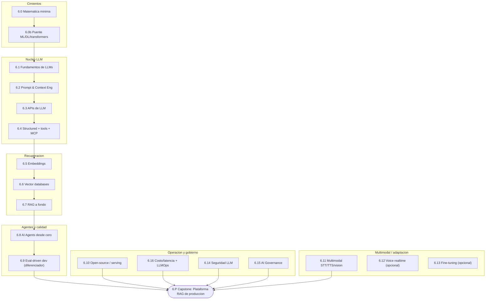
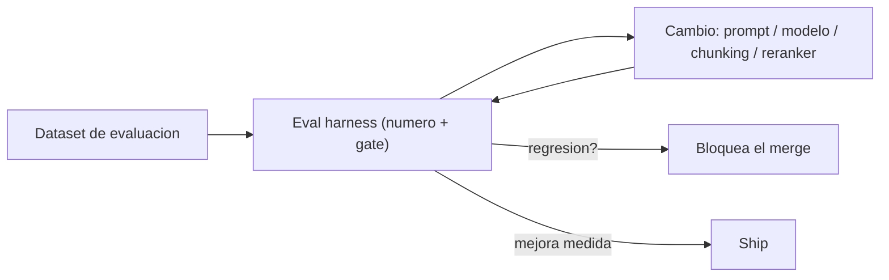

import Reto from "@components/Reto.astro";
import Solucion from "@components/Solucion.astro";
import CheckDominio from "@components/CheckDominio.astro";
import Nivel from "@components/Nivel.astro";

<Nivel nivel="avanzado" />

Esta es **tu fase**: la especialización. Aquí dejas de "saber usar un chatbot"
y pasas a **diseñar, construir, evaluar y sostener** sistemas de IA en
producción. El arco va de lo más básico —un poco de matemática y la intuición
de cómo funciona un modelo— hasta un capstone serio: una **plataforma RAG de
producción** con recuperación, *reranking*, generación en *streaming*,
**eval harness** versionado, observabilidad y un **budget de costo/latencia**.

No es una fase de "descubrir" la IA. Es donde le pones **nombre, rigor y
ingeniería** a lo que el mercado paga premium.

## Objetivos de la fase

Al cerrar la Fase 6 sabrás **hacer** esto (no solo "haber oído de ello"):

- **Explicar** qué es un LLM, un embedding y la *attention* con intuición
  defendible —sin demostraciones, pero sin recitar de memoria.
- **Construir** una aplicación RAG completa: ingest → *chunking* → embeddings →
  vector DB → *retrieval* con *reranking* → generación con *streaming*.
- **Diseñar** un *agent loop* a mano (ReAct) antes de tocar un framework, y
  **elegir** el framework por la restricción dominante, no por moda.
- **Medir** la calidad con un **eval harness** (el diferenciador senior) y
  **defender** los trade-offs de costo, latencia y calidad con números.
- **Asegurar** cada feature contra OWASP LLM/Agentic y **gobernar** el sistema
  (model cards, audit logging, EU AI Act).

:::tip[Por qué importa (relevancia de mercado)]
Es tu **mayor diferenciador** y donde está el premium: el perfil Python + IA
paga por encima del promedio, y pocos candidatos tienen producción real. Pero
ojo con la honestidad de mercado: lo que **separa** a un semi-senior de "alguien
que llama a una API" es el **eval-driven development** (6.9) —medir la calidad de
la IA como mides los unit tests de tu código— y el manejo de **fallas, costo y
seguridad** en producción. Casi nadie lo hace bien. Esa es tu palanca de sueldo.
:::

## ¿Para quién es esta fase? (y qué necesitas antes)

Está escrita para **cero real** en AI Engineering: cada concepto se enseña desde
la intuición, con un ejemplo resuelto antes de pedirte que lo hagas tú. Pero la
Fase 6 **se apoya en las fases anteriores**. Antes de entrar conviene que tengas:

- **Python con pydantic** (validación de datos) — [Fase 1](/fase-1-lenguajes/).
- **Un backend con FastAPI** donde montar tus endpoints de IA — [Fase 3](/fase-3-backend/).
- **UI con *streaming* de respuestas** (token por token) — [Fase 4](/fase-4-frontend/).
- **Deploy + observabilidad** (logs, métricas, trazas) — [Fase 5](/fase-5-devops/).

:::tip[Si ya lo tocaste]
Si vienes con experiencia (ya hiciste RAG, usaste Azure OpenAI, montaste un
agente en n8n), **no saltes en seco: valida**. Haz el diagnóstico del final de
esta página y resuelve un ejercicio Primero-Sin-IA de las sub-unidades que crees
dominar. Si lo cierras sin notas y sin IA en el timebox, marca la casilla y
avanza. Si te trabas —por ejemplo, sabes *usar* RAG pero no sabes *diagnosticar*
por qué el recall cae, o usas evals "de ojo" sin un harness— ahí está tu trabajo
real. La experiencia previa es un **atajo de validación**, nunca un permiso para
saltar a ciegas.
:::

## Mapa de la fase

La Fase 6 son **18 sub-unidades** de contenido más el capstone. No es una lista
plana: es un arco con dependencias. Primero los cimientos, luego el núcleo de
LLMs, después recuperación y agentes, y el **eval-driven** como columna de
calidad que atraviesa todo.

| # | Sub-unidad | Qué construyes / entiendes ahí |
|---|---|---|
| 6.0 | [Matemática mínima para IA](/fase-6-ai-engineering/6-0-matematica-minima/) | Vectores, producto punto, **similitud coseno**, probabilidad, precision/recall/F1 (intuición, no demostraciones). |
| 6.0b | [Puente ML/DL/transformers](/fase-6-ai-engineering/6-0b-puente-ml-dl/) | Modelo, entrenar vs inferir, overfitting, train/test split, **attention** intuitivo, de dónde salen los embeddings. |
| 6.1 | [Fundamentos de LLMs](/fase-6-ai-engineering/6-1-fundamentos-llms/) | Tokens, context window, *sampling* (temp/top-p), alucinaciones, panorama de modelos (incl. Claude). |
| 6.2 | [Prompt & Context Engineering](/fase-6-ai-engineering/6-2-prompt-context-engineering/) | Roles, few-shot, CoT, ReAct; gestión de ventana/memoria, *token budgeting*, *context rot*, contenido no confiable. |
| 6.3 | [APIs de LLM](/fase-6-ai-engineering/6-3-apis-llm/) | OpenAI/Azure y Anthropic; tokens/costos, *rate limits*, reintentos, *streaming*. |
| 6.4 | [Structured outputs, tools + MCP](/fase-6-ai-engineering/6-4-structured-tools-mcp/) | JSON mode, *function calling*, validación pydantic/zod, servidores **MCP** y su superficie de ataque. |
| 6.5 | [Embeddings y búsqueda semántica](/fase-6-ai-engineering/6-5-embeddings-busqueda-semantica/) | Coseno aplicado, casos de uso, modelos de embeddings, estrategias de *chunking*. |
| 6.6 | [Vector databases](/fase-6-ai-engineering/6-6-vector-databases/) | pgvector/Qdrant/Chroma/Azure AI Search; criterios de elección; *embedding weaknesses*. |
| 6.7 | [RAG a fondo](/fase-6-ai-engineering/6-7-rag-a-fondo/) | Arquitectura completa, *hybrid search*, **reranking**, *metadata filtering*; Contextual Retrieval, GraphRAG; diagnóstico de fallas. |
| 6.8 | [AI Agents desde cero](/fase-6-ai-engineering/6-8-ai-agents/) | El *agent loop* a mano (ReAct) **primero**; *landscape* de frameworks y elección por restricción; memoria; HITL. |
| 6.9 | [Eval-driven development ★](/fase-6-ai-engineering/6-9-eval-driven-development/) | Evals de RAG (ragas) + evals de **agentes**; LLM-as-judge formal; gates en CI; trazabilidad con Langfuse. **El diferenciador senior.** |
| 6.10 | [Open-source, local y serving](/fase-6-ai-engineering/6-10-opensource-local-serving/) | Ollama/MLX (single) + **vLLM/TGI** (multi-usuario), KV cache, batching, cuantización, trade-offs. |
| 6.11 | [Multimodal: STT/TTS/vision/OCR-IDP](/fase-6-ai-engineering/6-11-multimodal/) | Whisper, *text-to-speech*, *vision*, OCR/IDP (Document Intelligence aplica aquí). |
| 6.12 | [Voice/multimodal realtime](/fase-6-ai-engineering/6-12-voice-realtime/) 🔵 | *Voice agents* (Pipecat/LiveKit/Realtime), S2S vs *turn-based*, latencia/costo, *barge-in*. **Profundización.** |
| 6.13 | [Fine-tuning en sistema híbrido](/fase-6-ai-engineering/6-13-fine-tuning/) 🔵 | Cuándo FT gana; LoRA/QLoRA mínimo práctico; híbrido RAG+FT (no dicotomía). **Profundización.** |
| 6.14 | [Seguridad LLM: OWASP LLM + Agentic](/fase-6-ai-engineering/6-14-seguridad-llm/) | *Prompt injection*, Improper Output Handling, Excessive Agency, guardrails, defense in depth. |
| 6.15 | [AI Governance / EU AI Act](/fase-6-ai-engineering/6-15-ai-governance/) | Tiers de riesgo, transparencia, model/data cards, audit logging; *enforcement* y alcance extraterritorial. |
| 6.16 | [Costo/latencia + LLMOps](/fase-6-ai-engineering/6-16-costo-latencia-llmops/) | Prompt + *semantic caching*, ruteo de modelos, USD/request en vivo, fallbacks, versionado, arquitectura escalable. |
| 6.P | [🛠️ Capstone — Plataforma RAG de producción](/fase-6-ai-engineering/proyecto/) | El proyecto estrella de tu CV. Reúne todo: ingest → vector DB → retrieval+reranking → streaming → **evals + gate de regresión** → Langfuse → **budget costo/latencia** → CI/CD. |

> 🔵 = **opcional / profundización**. Las sub-unidades 6.12 y 6.13 no son ruta
> crítica: puedes diferirlas sin romper el arco. Son la columna ancha que
> retomas según el rol objetivo (voz es un nicho de alta demanda; fine-tuning,
> un acelerador a escala). El resto son ruta crítica.

## El hilo que define la fase: eval-driven

Si te llevas **una** idea de la Fase 6, que sea esta: **los evals son los unit
tests de la IA**. Un modelo no "compila bien o mal": da respuestas que hay que
**medir**. Quien optimiza un prompt o un *retriever* "a ojo" no es ingeniero de
IA; es alguien adivinando. El flujo correcto es:

Por eso **6.9 es el diferenciador senior** y por eso el Definition of Done de
abajo exige un eval harness versionado **como entregable de primera clase**, no
como un extra. Lo mismo aplica al **budget de costo/latencia** y a la
**seguridad LLM**: son *gates* del capstone, no adornos.

:::caution[Misconception común]
"Si la demo funciona en tres ejemplos que probé a mano, está listo." Está mal:
la IA es no determinista y degrada en silencio. Tres ejemplos no son una
medición — son sesgo de confirmación. Sin un dataset y un número, no sabes si tu
"mejora" mejoró o empeoró. Confiar en la salida del LLM sin validarla es **el
error #1** que esta fase te enseña a no cometer.
:::

## Checklist de avance

Marca una sub-unidad como completa **solo** cuando cumplas las tres condiciones
(criterio del roadmap): (a) entiendes el concepto **sin notas**, (b) hiciste el
ejercicio **sin IA**, y (c) lo **aplicaste** en el capstone.

- [ ] 6.0 — Matemática mínima para IA
- [ ] 6.0b — Puente ML/DL/transformers
- [ ] 6.1 — Fundamentos de LLMs
- [ ] 6.2 — Prompt & Context Engineering
- [ ] 6.3 — APIs de LLM
- [ ] 6.4 — Structured outputs, function calling, tool use + MCP
- [ ] 6.5 — Embeddings y búsqueda semántica
- [ ] 6.6 — Vector databases
- [ ] 6.7 — RAG a fondo
- [ ] 6.8 — AI Agents desde cero
- [ ] 6.9 — Eval-driven development ★
- [ ] 6.10 — Open-source, local y serving
- [ ] 6.11 — Multimodal: STT/TTS/vision/OCR-IDP
- [ ] 6.14 — Seguridad LLM: OWASP LLM + Agentic
- [ ] 6.15 — AI Governance / EU AI Act
- [ ] 6.16 — Costo/latencia + LLMOps
- [ ] 6.12 — Voice realtime *(opcional)*
- [ ] 6.13 — Fine-tuning *(opcional)*
- [ ] 6.P — Capstone: Plataforma RAG de producción (cumple el Definition of Done de abajo)
- [ ] `RETROSPECTIVA.md` de la fase escrita (qué aprendí, qué me costó, qué proyecto lo demuestra)

<CheckDominio
  title="Antes de dar la Fase 6 por cerrada, ¿puedes…?"
  items={[
    "Explicar qué es un embedding y por qué la similitud coseno mide 'parecido' de significado, sin notas",
    "Describir el agent loop (ReAct) a mano: observación, razonamiento, acción, repetir, sin dibujar un framework",
    "Justificar por qué un eval harness con un número bate a 'probé tres ejemplos y funcionó'",
    "Nombrar dos riesgos de OWASP LLM (p. ej. prompt injection y excessive agency) y una mitigación de cada uno",
    "Defender un trade-off de costo/latencia/calidad de tu RAG con datos, no con intuición",
  ]}
/>

## Definition of Done (la vara del capstone)

Todos los capstones del curso comparten **un único** Definition of Done. En la
Fase 6 aplica **completo** —es la primera fase donde se activan todos los gates
de IA. Tu Plataforma RAG está **terminada** solo si cumple **todo**:

:::caution[Lo que aplica al Capstone F6 (Plataforma RAG de producción)]
1. **Spec** inicial + **ADRs** de las decisiones clave (modelo, chunking, vector DB, reranker).
2. **Tests verdes** + lint en CI; calidad por aserciones reales (no % de cobertura).
3. **Seguridad aplicada:** OWASP web (hay endpoint) + **OWASP LLM/Agentic**; secret-scanning + dependency-scanning en el pipeline.
4. **Observabilidad instrumentada:** structured logs + correlation IDs + **trazas del call-chain del LLM** con tokens/latencia/costo por paso (Langfuse).
5. **Eval harness versionado** + número + **gate de regresión** + **budget de costo/latencia** como entregables de primera clase. *(Gate central de esta fase.)*
6. **(Si añades un agente que ejecuta acciones)** validación de salida antes de ejecutar + *least-privilege* de tools + HITL para acciones sensibles + techo de costo.
7. **a11y mínima (WCAG 2.2)** en la UI; estados completos (empty/loading/error/success).
8. **Demo en vivo que CORRE** + **README en inglés** + **write-up público de trade-offs** (qué elegí, qué medí, qué falló).
9. **Conventional Commits** en todo el historial.
:::

:::note[Nota de portafolio (honesta)]
El RAG-sobre-tus-docs es el capstone **clásico** de IA — y por eso el 80% de los
portafolios se parecen. Es valioso y lo construyes aquí, pero el proyecto que de
verdad te diferencia es el **agéntico end-to-end con manejo de fallas** de la
[Fase 7](/fase-7-automatizacion/). Plan recomendado: haz el RAG sólido en F6 y
reserva tu **estrella** para el sistema agéntico de F7. Lo decides explícitamente
en el ejercicio de abajo.
:::

## Conexión con el capstone

Cada sub-unidad es una pieza de la **Plataforma RAG**: 6.0–6.1 te dan la
intuición; 6.2–6.4 te dan el control del modelo y las herramientas; 6.5–6.7 son
el corazón de la recuperación; 6.8 añade el agente que orquesta; **6.9 es cómo
sabes que funciona**; 6.10 y 6.16 son cómo la sirves a costo razonable; 6.14 y
6.15 son cómo no te explota en producción ni te multan. No estudias temas
sueltos: ensamblas, pieza a pieza, el proyecto estrella de tu CV.

## Ejercicio de entrada: diagnóstico, plan y decisión de portafolio

Antes de la primera lección, orientarte. Como en toda portada, este ejercicio no
se corrige "bien o mal": se corrige por **honestidad, concreción y un trade-off
defendible**. Es tu *placement* y tu contrato para una fase larga y densa.

<Reto title="Diagnóstico de Fase 6 + decisión de capstone" timebox="40 min">

Sin IA, deja **tres archivos markdown** en `ejercicios/fase-6/fase-6-index/`:

1. **`diagnostico.md`** — dos tablas:
   - **Prerrequisitos:** Python+pydantic, FastAPI, UI con *streaming*,
     deploy+observabilidad. Para cada uno: `listo` · `a medias` · `me falta`, y
     una línea de por qué. (Si algo te falta, anota a qué fase volver.)
   - **Las 18 sub-unidades** (6.0 a 6.16, incluidas 6.12/6.13): tu nivel honesto
     `nuevo` · `lo reconozco` · `lo sé hacer sin notas`. La prueba para "lo sé
     hacer": ¿podrías, ahora, resolver un ejercicio del tema sin notas ni IA?
2. **`plan-fase-6.md`** — bloques semanales **concretos** (día/hora/duración),
   tu **ritual de repaso** (cuándo reescribes de memoria), y **qué difieres**:
   marca explícitamente si dejas 6.12 y/o 6.13 para después y por qué.
3. **`decision-capstone.md`** — decide tu **estrella de portafolio**: ¿RAG (F6) o
   agéntico (F7)? Escribe **un trade-off defendible** (saturación del mercado,
   tu nicho, complejidad, tiempo) y nombra **tres puntos del Definition of Done**
   que más te van a costar (p. ej. eval harness con gate, budget de costo, OWASP LLM).

**Hecho significa:** los prerrequisitos están autoevaluados con un plan de
remediación si falta alguno; las 18 sub-unidades tienen nivel defendible (no todo
en "lo sé hacer"); el plan tiene bloques reales y dice qué difieres; la decisión
de capstone trae **un trade-off**, no solo una preferencia.

</Reto>

<Solucion title="Pista (ábrela solo si te trabas, no es la solución)">

No optimices por "parecer avanzado": optimiza por honestidad. Si nunca montaste
un eval harness, 6.9 es `nuevo` —y probablemente es donde más valor vas a
extraer, así que dale tiempo en el plan. Para la decisión de capstone, recuerda
el matiz honesto: el RAG genérico es el camino saturado; el agéntico con manejo
de fallas es el menos copiado. No hay respuesta única: hay una **defendible** y
una que solo es "lo que me suena bonito". La diferencia es si nombras el
trade-off.

</Solucion>

### Cómo pedir la corrección

Cuando termines, pídele a tu IA:

> "Corrige `ejercicios/fase-6/fase-6-index/` usando el framework de `.ai/`. Sigue
> `INSTRUCCIONES-CORRECTOR.md`."

El corrector revisa la **honestidad** de tu autoevaluación, el **realismo** de tu
plan y si tu decisión de capstone trae un **trade-off**, no si "acertaste". No
existe una respuesta única correcta.

## Recursos

Prefiere siempre **documentación oficial** sobre tutoriales sueltos. Mantén una
lista viva en `articulos.md` dentro de cada sub-unidad.

- [Anthropic — documentación de Claude](https://platform.claude.com/docs/) — API, tool use, MCP, prompting (la usarás desde 6.3).
- [OpenAI — API reference](https://platform.openai.com/docs/) — Chat Completions, structured outputs, embeddings.
- [ragas — evaluación de RAG](https://docs.ragas.io/) — métricas de fidelidad y relevancia (para 6.9).
- [Langfuse — observabilidad de LLM](https://langfuse.com/docs) — trazas, datasets, *single source of truth* de evals.
- [pgvector](https://github.com/pgvector/pgvector) — vector search en Postgres (encaja con tu stack; para 6.6).
- [LangGraph — orquestación de agentes](https://langchain-ai.github.io/langgraph/) — agentes con estado (para 6.8, después del loop a mano).
- [OWASP Top 10 for LLM Applications](https://genai.owasp.org/) — la base de 6.14.
- [EU AI Act — texto oficial](https://artificialintelligenceact.eu/) — tiers de riesgo y transparencia (para 6.15).

## Reflexión + repaso

:::note[Para tu RETROSPECTIVA.md]
¿Cuántas de las cosas que "ya sabías hacer" de IA resultaron ser "las reconocía
pero no las sabía defender"? Escribe dos. Esa brecha entre *usar* y *entender* es
exactamente el salto que el mercado paga en esta fase.
:::

**Gancho de repaso:** vuelve a esta portada al cerrar **cada** sub-unidad y marca
su casilla. Al terminar 6.9 (eval-driven), reescribe **de memoria** —sin abrir
esta página— el flujo eval-driven (dataset → harness → cambio → gate) y los cinco
gates del Definition of Done de IA. Si te falta alguno, ahí tienes tu próximo
repaso.
