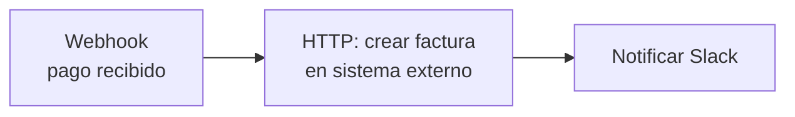
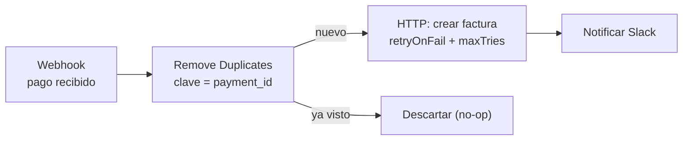
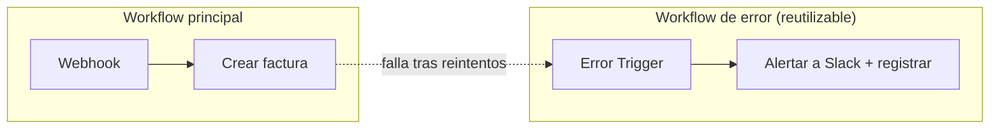
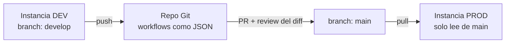
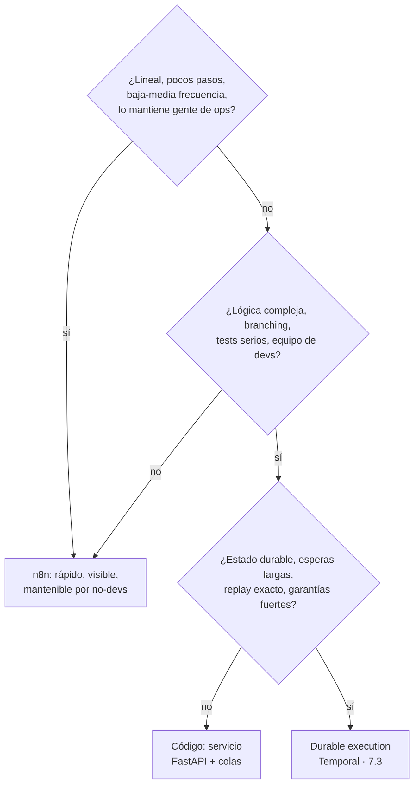
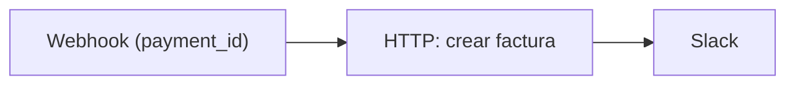

import Reto from "@components/Reto.astro";
import Solucion from "@components/Solucion.astro";
import Quiz from "@components/Quiz.astro";
import CheckDominio from "@components/CheckDominio.astro";
import Nivel from "@components/Nivel.astro";

<Nivel nivel="intermedio" />

Esta es la primera lección de tu **otro pilar**: la automatización. Y empieza con una incomodidad. Casi todo el mundo que "sabe n8n" sabe lo mismo: arrastrar nodos hasta que el flujo corre **una vez** en la demo. Eso no es ingeniería de automatización; es una maqueta. Un workflow que corre una vez y un workflow en el que tu empresa confía para emitir facturas reales son dos objetos distintos. La diferencia —idempotencia, reintentos, manejo de errores, versionado, separación dev/prod, testing, y saber **cuándo n8n ya no es la herramienta correcta**— es exactamente lo que esta lección te enseña. No vas a aprender a usar n8n: vas a aprender a **pensar un workflow como software de producción**.

:::tip[Si ya tocaste n8n (o Make, Zapier, Power Automate)]
Tienes la intuición de "arrastrar un trigger, conectar nodos, ver verde". Bien: esa parte ya la traes. La trampa del que "ya lo usa" es haber construido **siempre el happy path** —el flujo que asume que el webhook llega una sola vez, que la API externa nunca devuelve 503, que nadie edita el flujo en producción un viernes. Si nunca configuraste un **error workflow**, nunca pensaste qué pasa cuando el mismo evento llega **dos veces**, o editas los flujos directo en la instancia de producción sin Git de por medio, esta lección es para ti igual que para el que parte de cero. Salta al ejercicio 1 (sección 7): te da un workflow frágil y te pide endurecerlo. Si lo cierras sin notas y puedes defender **por qué reintentar sin idempotencia duplica facturas**, valida con el check de dominio (sección 8) y avanza. Si te trabas, quédate: el "ya lo sé" era el happy path.
:::

## 1. Qué vas a saber hacer

Al terminar, sin IA y sin notas, podrás:

- **O1 — Implementar un workflow confiable**: hacerlo **idempotente** (que reejecutarlo o recibir el mismo evento dos veces no duplique efectos), con **reintentos** ante fallos transitorios y un **error workflow** que avise cuando algo falla de verdad —y explicar por qué "corrió una vez" no es "corre confiable".
- **O2 — Tratar el workflow como software**: ponerlo bajo **version control con Git**, separar entornos **dev/prod** con un patrón push-pull, y diseñar un plan de **testing** —en vez de editar a ciegas en producción.
- **O3 — Aplicar un criterio de salida defendible**: ante un caso concreto, decidir si el flujo **se queda en n8n** o se **gradúa a código / durable execution** ([Temporal, 7.3](/fase-7-automatizacion/7-3-durable-execution-temporal/)), justificando con los **límites reales** del low-code y no con gusto personal.

## 2. Por qué importa (el dinero está aquí)

> 💰 **Por qué importa:** la automatización es **la otra mitad de tu título** ("AI/Automation Engineer"), y combinada con IA te pone en un nicho con poca competencia y alta demanda corporativa en LATAM. n8n es la lingua franca de la automatización en PyMEs, startups y equipos de operaciones en 2026: aparece en avisos, en consultorías y en todo flujo interno que "alguien armó". Pero acá está la grieta de mercado: el 90% de quienes ponen "n8n" en el CV entregan **flujos frágiles de happy path**. El semi-senior que cobra el premium entrega workflows **idempotentes, versionados, observables**, y —esto es lo más raro y más valioso— **sabe argumentar cuándo NO usar n8n**. Decir "automatizo procesos" te pone en la fila con todos; decir "diseño automatizaciones confiables y sé exactamente dónde el low-code deja de rendir y hay que ir a código o a Temporal" te saca de la fila.

Tres razones lo vuelven una bisagra de carrera:

1. **El happy path miente.** En una demo, un webhook llega una vez y la API responde 200. En producción, el webhook llega **dos veces** (los proveedores reintentan), la API devuelve **503** a las 3 AM, y el disco se llena. Un flujo que no contempla eso no está "casi listo": está roto y todavía no te enteras. El trabajo de ingeniería empieza donde termina el happy path.
2. **"Low-code" no significa "sin disciplina".** Que arrastres nodos en vez de escribir Python no te exime de versionar, testear y separar entornos. El equipo que edita workflows directo en producción es el mismo que un día borra el nodo equivocado y deja a la empresa sin facturación, sin forma de volver atrás. Git, dev/prod y testing **no son opcionales porque sea low-code**.
3. **Saber salir es seniority.** La señal de un ingeniero junior es "todo lo resuelvo con mi herramienta favorita". La de un semi-senior es "elijo la herramienta por la restricción dominante, y reconozco cuándo la actual ya no alcanza". n8n es excelente para muchísimo —y un mal lugar para lógica compleja con estado durable. Tener un **criterio de salida** escrito te ahorra meses de pelear contra la herramienta equivocada.

## 3. Lo que ya traes (actívalo)

Esta lección ensambla hilos que ya tienes de fases anteriores. Recupéralos antes de seguir:

- De [`3.14` Idempotencia y resiliencia](/fase-3-backend/3-14-idempotencia-resiliencia/): reintentos con backoff, timeouts, y la idea de **idempotency key**. En n8n vas a aplicar exactamente esos conceptos, pero configurándolos en nodos en vez de escribiéndolos en código. **El concepto es el mismo; cambia la superficie.**
- De [`5.3` CI/CD](/fase-5-devops/5-3-cicd-github-actions/) y [`2.13` Spec-driven + ADRs](/fase-2-ingenieria/2-13-colaboracion-spec-driven-adrs/): version control, PRs, y decidir con ADRs. Tus **workflows también son código** —se versionan en Git y las decisiones (incluida "graduar a código") se documentan.
- De [`5.10` Observabilidad](/fase-5-devops/5-10-observabilidad/): logs, trazas, "cuando algo falla a las 3 AM, poder verlo". El **error workflow** de n8n es la versión de automatización de ese mismo principio.
- De [`2.7` TDD](/fase-2-ingenieria/2-7-tdd-obligatorio/): probar antes de confiar. Un workflow también se prueba —con datos fijados (pin data) y con el feature de **evaluations** de n8n— antes de activarlo en producción.

Antes de seguir, responde de memoria:

<Quiz
  question="Un proveedor de pagos te manda un webhook cada vez que alguien paga. Por diseño (entrega 'at-least-once'), a veces manda el MISMO evento dos veces. Tu workflow crea una factura por cada webhook. ¿Cuál es el riesgo y cuál es la idea que lo resuelve?"
  options={[
    "No hay riesgo real: dos webhooks iguales crean la misma factura, que se sobrescribe sola",
    "Riesgo: dos facturas para un solo pago (efecto duplicado). La idea que lo resuelve es la IDEMPOTENCIA: usar una clave del evento (idempotency key) para detectar y descartar el repetido antes de crear la factura",
    "Riesgo: el segundo webhook llega más lento; se resuelve subiendo el timeout del nodo HTTP",
  ]}
  answer={1}
  explanation="La entrega at-least-once (que viste en 3.14 y profundizas en 7.2) garantiza que el evento llega, pero NO que llega una sola vez. Si tu workflow tiene un efecto secundario (crear factura, cobrar, enviar correo), debe ser idempotente: la misma entrada procesada dos veces produce el mismo resultado que procesarla una vez. Subir el timeout no tiene nada que ver."
/>

## 4. Ejemplo resuelto, pensado en voz alta

Te voy a tomar un workflow real y frágil, y lo voy a endurecer paso a paso **razonando cada decisión como me oirías al lado tuyo**. No lo leas como una receta para copiar: léelo como un proceso de "qué se rompe y cómo lo blindo".

### 4.1 El modelo mental mínimo de n8n (desde cero)

Tres palabras y entiendes el 80%:

- **Workflow:** un grafo de nodos. Es **un archivo JSON** (lo importante: es *datos versionables*, no magia visual).
- **Nodo:** una caja que hace una cosa —escuchar un webhook, llamar una API, transformar datos, decidir. Hay un **trigger** (cómo arranca: un webhook, un cron, un evento) y luego nodos de **acción**.
- **Execution (ejecución):** **una** corrida del workflow de principio a fin, con sus datos. Cada execution puede terminar en *success* o *error*. n8n guarda un log de cada una.

Los datos viajan entre nodos como **items** (una lista de objetos JSON). Eso es todo lo que necesitas para esta lección.

### 4.2 El workflow frágil (el que casi todos entregan)

El caso: un proveedor de pagos manda un **webhook** cuando alguien paga. El flujo crea una factura en un sistema externo (una llamada HTTP) y avisa por Slack.



Razono qué tiene de malo, en voz alta: *"Esto **corre** en la demo, y por eso engaña. Pero pensemos en producción. (1) El proveedor entrega **at-least-once**: tarde o temprano manda el mismo pago dos veces, y este flujo crea **dos facturas** para un solo pago. (2) La API de facturación a veces devuelve **503** por un pico de carga; este flujo, ante un 503, simplemente falla y **pierde** la factura. (3) Cuando falla, nadie se entera: el flujo muere en silencio y el cliente reclama tres días después. Tres agujeros, y ninguno se ve en la demo. Mi trabajo ahora es taparlos uno por uno."*

### 4.3 Agujero 1 — reintentos para fallos transitorios

Un 503, un timeout de red, un rate limit momentáneo: son **transitorios**. Reintentar resuelve la mayoría. n8n lo configura **por nodo**, sin escribir código. Razono: *"Activo `retryOnFail` en el nodo HTTP. `maxTries` lo dejo en 3 (entre 2 y 5 es el rango sano: suficiente para sobrevivir un bache, no tanto que tape un problema real). Y `waitBetweenTries` lo subo a 5000 ms para no martillar la API que justo está sobrecargada —reintentar agresivo empeora el incendio."*

```json
{
  "name": "Crear factura",
  "type": "n8n-nodes-base.httpRequest",
  "retryOnFail": true,
  "maxTries": 3,
  "waitBetweenTries": 5000,
  "onError": "stopWorkflow"
}
```

> El campo `onError` decide qué pasa **cuando se agotan los reintentos**: `stopWorkflow` (la ejecución falla y dispara el error workflow), `continueRegularOutput` (sigue como si nada — peligroso si hay efectos secundarios) o `continueErrorOutput` (manda el item a una salida de error separada, para tratarlo aparte). Por defecto detiene; lo dejamos explícito.

:::caution[Pero reintentar NO basta — y de hecho empeora un agujero]
Si solo activo reintentos y nada más, **agravo el problema de los duplicados**: ahora, ante un timeout en el que la factura **sí se creó** pero la respuesta se perdió, el reintento crea una **segunda** factura. Reintentar sin idempotencia es duplicar con más confianza. Por eso el siguiente agujero es el que de verdad importa.
:::

### 4.4 Agujero 2 — idempotencia (el corazón de la confiabilidad)

**Idempotente** = procesar el mismo evento dos veces produce el mismo resultado que procesarlo una vez. Es el concepto de [3.14](/fase-3-backend/3-14-idempotencia-resiliencia/) aplicado al workflow. La idea: cada pago trae una **clave única** (un `payment_id`); antes de crear la factura, pregunto "¿ya procesé este `payment_id`?". Si sí, descarto; si no, sigo.

n8n trae esto de fábrica con el nodo **Remove Duplicates**, operación **"Remove Items Processed in Previous Executions"**: recuerda, **entre ejecuciones**, qué claves ya vio, y filtra las repetidas. Lo pongo **antes** del nodo que tiene el efecto secundario:



Razono el orden, que es lo que la gente invierte: *"El nodo de dedup va **antes** del efecto secundario, nunca después. Si lo pongo después de crear la factura, ya creé la factura duplicada: deduplicar el aviso de Slack no me devuelve la plata. La regla es: **la barrera de idempotencia protege la acción peligrosa, así que va corriente arriba de ella**. La clave de dedup tiene que ser algo estable y único del evento (`payment_id`), no la hora de llegada ni un id que n8n genere en cada corrida —si la clave cambia entre intentos, no deduplica nada."*

### 4.5 Agujero 3 — error workflow (que no falle en silencio)

Aun con reintentos e idempotencia, algo puede fallar de verdad (la API caída una hora, credenciales vencidas). Cuando eso pasa, **quiero enterarme**, no que el cliente me avise. n8n permite asociar a cada workflow un **error workflow**: un flujo aparte que arranca con un nodo **Error Trigger** y corre **automáticamente cuando la ejecución principal falla**. Recibe los detalles del error (qué nodo, qué mensaje, qué execution) y hace algo útil: avisar a Slack/PagerDuty, registrar en una tabla, abrir un ticket.



Razono: *"El error workflow es la **observabilidad** de [5.10](/fase-5-devops/5-10-observabilidad/) traída a la automatización: el equivalente a 'cuando algo falla a las 3 AM, poder verlo'. Y es **reutilizable**: escribo uno bueno (con el id de la execution para poder abrirla y depurar) y lo asocio a **todos** mis workflows en Workflow Settings. Un buen error workflow incluye el link a la execution fallida —si solo dice 'algo falló', no sirve para depurar."*

```json
{
  "settings": {
    "errorWorkflow": "id-del-workflow-de-error",
    "executionOrder": "v1"
  }
}
```

### 4.6 De "edito en producción" a workflow versionado (dev/prod con Git)

Ya tengo un flujo confiable. Falta tratarlo como software. Razono el problema: *"Si edito directo en la instancia de producción, no tengo historial, no tengo review, y un cambio malo no tiene 'deshacer'. Es exactamente el antipatrón que matamos con CI/CD en [5.3](/fase-5-devops/5-3-cicd-github-actions/), pero en automatización."*

Dos niveles, según con qué cuentes:

**Nivel base (cualquier instancia, gratis):** los workflows son JSON, así que los exporto a un repo Git con la CLI y los versiono como cualquier código:

```bash
# Exportar TODOS los workflows, uno por archivo, a una carpeta del repo
n8n export:workflow --all --separate --output=workflows/

# Restaurar / importar en otra instancia (p. ej. levantar prod desde el repo)
n8n import:workflow --separate --input=workflows/
```

*"Con esto ya tengo diff, historial y PRs sobre mis flujos. El proceso: edito en una instancia **dev**, exporto, hago commit + PR, reviso el **diff del JSON** (sí, se revisa), y solo entonces importo a **prod**."*

**Nivel enterprise (feature Source Control & Environments):** n8n liga cada instancia a un **branch** de Git y mueve workflows entre entornos con un patrón **push-pull**: la instancia dev pushea a su branch, se hace PR a `main`, y la instancia prod **pullea** de `main`. Mismo modelo mental de [5.3](/fase-5-devops/5-3-cicd-github-actions/), nativo en n8n.



> **Testing:** antes de activar, n8n te deja **fijar datos** de entrada en un nodo (*pin data*) para correr el flujo con un caso conocido y repetible, y —para flujos con IA— tiene un módulo de **evaluations** (un dataset de casos + métricas) que corre con un límite de concurrencia aparte de producción. Es el puente directo a los **evals** que viste como hilo transversal en F6: un workflow con IA se testea con un dataset, no "a ojo". (Más sobre testing serio de agentes en [7.7](/fase-7-automatizacion/7-7-agentes-automatizacion-ia/).)

### 4.7 El criterio de salida — cuándo n8n deja de ser la respuesta

Acá está la parte que casi nadie enseña, y la que más te diferencia. n8n es **excelente** para flujos lineales, de pocos pasos, donde la **visibilidad** y que un no-dev pueda mantenerlos vale oro. Pero tiene **límites reales**, y pelear contra ellos cuesta más que graduarse a tiempo:

| Síntoma de que te quedaste de más en n8n | Hacia dónde graduar |
|---|---|
| Lógica con muchas ramas, condiciones anidadas, código JS embutido en nodos "Function" que ya nadie entiende | **Código** (un servicio FastAPI + colas, F3) |
| Necesitas tests unitarios serios, type-checking, code review línea a línea | **Código** (testeable de verdad, [2.7](/fase-2-ingenieria/2-7-tdd-obligatorio/)) |
| Esperas largas (días), pausas, reanudar exactamente donde quedó tras un crash, **replay determinista**, garantías fuertes de ejecución, sagas | **Durable execution / Temporal** ([7.3](/fase-7-automatizacion/7-3-durable-execution-temporal/)) |
| Volumen alto y sostenido, latencia que importa, necesitas escalar horizontal con control fino | **Código** + infra (o n8n en *queue mode*, hasta cierto punto) |

Razono el criterio como árbol de decisión:



*"La decisión de graduar **se documenta en un ADR** ([2.13](/fase-2-ingenieria/2-13-colaboracion-spec-driven-adrs/)): 'elegí mover el flujo X a código porque la lógica de branching superó lo mantenible en nodos, y aquí está el trade-off'. No es 'me aburrí de n8n': es una decisión de ingeniería con razón escrita. Y ojo —graduar no es todo o nada: un patrón maduro es n8n como **orquestador delgado** que dispara un servicio en código para la parte compleja. Lo mejor de ambos."*

## 5. Errores que vas a tener (y por qué)

:::caution[Podrías pensar que "corrió en la demo" significa "está listo"]
La demo es el happy path con viento a favor: un evento, una respuesta 200, nadie tocando nada. Producción es entrega at-least-once (eventos repetidos), APIs que devuelven 503, credenciales que vencen y compañeros que editan. Un workflow "terminado" contempla el camino infeliz: ¿qué pasa si este evento llega dos veces? ¿si la API falla? ¿si nadie mira los logs? Si no tienes respuesta a las tres, no terminaste: hiciste una maqueta.
:::

:::caution[Podrías pensar que activar reintentos hace el flujo confiable]
Reintentar resuelve fallos **transitorios**, pero **sin idempotencia los empeora**: si la factura se creó pero la respuesta se perdió en un timeout, el reintento crea una segunda factura. Reintentos e idempotencia van juntos o no van: primero la barrera de dedup (corriente arriba del efecto secundario), después los reintentos. El orden importa: dedup protege la acción peligrosa, así que va **antes** de ella, nunca después.
:::

:::caution[Podrías pensar que como es low-code, no hace falta Git ni dev/prod]
Que arrastres nodos no cambia que estás operando software del que depende la empresa. Editar en producción sin historial es jugar a la ruleta: un día borras el nodo equivocado y no hay "deshacer", ni diff, ni review. Tus workflows son JSON: van a Git, pasan por PR, y prod **lee** de una rama revisada. "Low-code" describe cómo construyes, no te exime de cómo **operas**.
:::

:::caution[Podrías pensar que n8n sirve para todo si te esfuerzas lo suficiente]
n8n es genial hasta un punto, y horrible pasado ese punto. Cuando te descubres escribiendo 200 líneas de JavaScript dentro de un nodo "Function", anidando ocho ramas, o peleando para que un flujo "espere tres días y reanude exactamente donde quedó tras un reinicio", la herramienta te está gritando que te gradúes. Insistir es más caro que migrar. El semi-senior reconoce el límite **antes** de que el flujo se vuelva una bola de barro ingobernable.
:::

:::caution[Podrías pensar que el error workflow es un extra opcional]
Un flujo sin error workflow falla **en silencio**: la ejecución muere, nadie se entera, y el problema lo descubre el cliente. El error workflow es la diferencia entre "lo vi y lo arreglé en 10 minutos" y "perdimos facturas tres días". Es la observabilidad de [5.10](/fase-5-devops/5-10-observabilidad/) en versión automatización, y es parte del Definition of Done, no un nice-to-have. Eso sí: que incluya el id de la execution fallida, o no sirve para depurar.
:::

## 6. Práctica con andamiaje (que se desvanece)

Tres pasos, de más apoyo a menos. Hazlos **a mano primero**: acá "ejecutar" es leer la config y predecir qué haría n8n en producción.

### 6.1 PREDICT — ¿qué hace este flujo cuando el webhook llega dos veces?

Un proveedor manda el mismo evento de pago **dos veces** (entrega at-least-once). Este es el flujo y la config del nodo HTTP. **Sin correr nada**, responde abajo.



```json
{ "name": "Crear factura", "type": "n8n-nodes-base.httpRequest",
  "retryOnFail": true, "maxTries": 3, "waitBetweenTries": 5000 }
```

1. ¿Cuántas facturas se crean tras los dos webhooks?
2. ¿Los reintentos ayudan con ese problema?
3. ¿Qué nodo, y en qué posición, lo arreglaría?

<Solucion title="Ver la respuesta (solo después de predecir)">
1. **Dos facturas** (una por webhook). El flujo no tiene barrera de idempotencia: cada ejecución crea su factura.
2. **No.** Los reintentos solo cubren fallos transitorios de *una* ejecución; no tienen idea de que *otra* ejecución ya creó la factura. Es más: si el primer webhook tuvo un timeout tras crear la factura, su reintento crea una segunda — los reintentos **agravan** el duplicado sin idempotencia.
3. Un nodo **Remove Duplicates** con operación "Remove Items Processed in Previous Executions", con clave = `payment_id`, **antes** del nodo "Crear factura" (corriente arriba del efecto secundario). Así el segundo webhook se descarta antes de tocar la API.

El error de fondo: confundir "tolera fallos transitorios" (reintentos) con "no duplica efectos" (idempotencia). Son problemas distintos y necesitan soluciones distintas.
</Solucion>

### 6.2 Parsons — ordena el endurecimiento de un workflow frágil

Tienes un flujo de happy path y estas cinco acciones de endurecimiento, **desordenadas**. Reescríbelas en el orden en que las aplicarías, y di **dónde** va cada nodo nuevo:

```text
A. Activar retryOnFail (maxTries 3, waitBetweenTries 5000) en el nodo de efecto secundario
B. Exportar a Git, abrir PR, revisar el diff antes de importar a prod
C. Insertar un nodo Remove Duplicates (clave estable) ANTES del efecto secundario
D. Asociar un error workflow (Error Trigger) en Workflow Settings
E. Identificar la clave de idempotencia estable del evento (p. ej. payment_id)
```

<Solucion title="Ver el orden correcto">
Orden razonable: **E → C → A → D → B**.

1. **E** — primero identificas la **clave estable**; sin ella, no puedes deduplicar bien (este paso es de diseño, no de nodos).
2. **C** — insertas la barrera de idempotencia **antes** del efecto secundario (la protege corriente arriba).
3. **A** — activas reintentos en el nodo peligroso (ya protegido por la barrera, así que un reintento no duplica).
4. **D** — asocias el error workflow para enterarte de los fallos que ni dedup ni reintentos cubren.
5. **B** — recién con el flujo confiable, lo pones bajo Git y lo promueves a prod por PR.

La lógica: **idempotencia antes que reintentos** (si no, los reintentos duplican); **confiabilidad antes que promoción** (no versionas a prod algo que todavía falla en silencio). C y A no se pueden invertir sin reintroducir el duplicado.
</Solucion>

### 6.3 MODIFY — este flujo tiene tres problemas; identifícalos y corrígelos

Este workflow corre, pero tiene **tres problemas reales**. Encuéntralos y di cómo los arreglas (a mano, sin IA):

```json
{
  "name": "Procesar pago",
  "nodes": [
    { "name": "Webhook", "type": "n8n-nodes-base.webhook" },
    { "name": "Crear factura", "type": "n8n-nodes-base.httpRequest",
      "retryOnFail": false },
    { "name": "Dedup", "type": "n8n-nodes-base.removeDuplicates" },
    { "name": "Slack", "type": "n8n-nodes-base.slack" }
  ],
  "connections": {
    "Webhook":        { "main": [[{ "node": "Crear factura" }]] },
    "Crear factura":  { "main": [[{ "node": "Dedup" }]] },
    "Dedup":          { "main": [[{ "node": "Slack" }]] }
  },
  "settings": { "executionOrder": "v1" }
}
```

<Solucion title="Ver los tres problemas y el arreglo">
1. **El Dedup está DESPUÉS de "Crear factura"** (Webhook → Crear factura → Dedup → Slack). Inútil: la factura duplicada ya se creó; deduplicar el Slack no la borra. Arreglo: reordenar a **Webhook → Dedup → Crear factura → Slack** (la barrera corriente arriba del efecto secundario).
2. **`retryOnFail: false`** en el nodo HTTP: cualquier 503/timeout transitorio mata la ejecución y pierde la factura. Arreglo: `retryOnFail: true`, `maxTries: 3`, `waitBetweenTries: 5000`.
3. **Falta `errorWorkflow` en `settings`**: si algo falla de verdad, muere en silencio. Arreglo: asociar un error workflow (`settings.errorWorkflow`) que alerte con el id de la execution.

Bonus si lo notaste: el Dedup no muestra su **clave**; debe deduplicar por una clave estable del evento (`payment_id`), no por el item completo ni por algo que cambie entre intentos.

El patrón de los tres: **dedup antes del efecto secundario, reintentos en la acción peligrosa, error workflow para lo que se escapa.** Es el esqueleto de confiabilidad de cualquier automatización seria.
</Solucion>

## 7. Ejercicios Primero-Sin-IA

Ahora sin andamiaje. Resuélvelos **a mano, sin IA** dentro del timebox. El primero se autocorrige con un test estructural que parsea tu JSON; el segundo se corrige por la **calidad de tu razonamiento** sobre los trade-offs —justo lo que ninguna IA decide por ti.

<Reto title="Endurece un workflow frágil de n8n" timebox="40–45 min">

En la carpeta del ejercicio hay un `workflow.json` (export simplificado de n8n) que implementa el happy path Webhook → Crear factura → Slack, **sin** ninguna protección. También hay un `test_workflow.py` que **parsea tu JSON y verifica que tenga la forma confiable** (corre en tu máquina con `pytest`; no necesitas una instancia de n8n).

Tu trabajo: editar `workflow.json` para que el flujo sea confiable. Concretamente:

1. **Idempotencia:** inserta un nodo `n8n-nodes-base.removeDuplicates` **entre** el Webhook y "Crear factura" (reconecta `connections`), para que el Webhook fluya **primero** al dedup.
2. **Reintentos:** en el nodo "Crear factura", pon `retryOnFail: true`, `maxTries` entre 2 y 5, y `waitBetweenTries` mayor que 0.
3. **Error workflow:** declara `settings.errorWorkflow` con un id no vacío.
4. **`hardening.md`:** en 5–8 líneas, explica **por qué el dedup va antes del efecto secundario** y **por qué reintentar sin idempotencia es peligroso**.

Entregable: `workflow.json` modificado + `hardening.md`, en la carpeta del ejercicio. Corre `uv run pytest test_workflow.py` (o `pytest test_workflow.py`) hasta verde.

**Hecho significa:**
- [ ] `test_workflow.py` pasa: existe el dedup, el Webhook conecta primero al dedup, "Crear factura" tiene reintentos y `settings.errorWorkflow` está.
- [ ] El dedup está **corriente arriba** del efecto secundario (no después).
- [ ] `hardening.md` explica el **orden** (dedup antes) y el **riesgo de reintentar sin idempotencia**.
- [ ] Puedes **explicar sin notas** la diferencia entre tolerar fallos transitorios (reintentos) y no duplicar efectos (idempotencia).

Enunciado completo y starter: `ejercicios/fase-7/endurecer-workflow-n8n/` (carpeta del repo).

<Solucion title="Pista (ábrela solo si superaste el timebox)">
Lee `test_workflow.py` como tu **spec**: cada función nombra una propiedad que tu JSON debe cumplir y el mensaje del assert te dice qué falta. Para reconectar `connections`: hoy el Webhook apunta a "Crear factura"; tienes que hacer que el Webhook apunte al **nodo de dedup**, y el dedup apunte a "Crear factura". El formato de una conexión en n8n es `"NodoOrigen": { "main": [[ { "node": "NodoDestino" } ]] }`. La clave de dedup debe ser algo estable del evento (un `payment_id`), no el item entero. Pista, no solución.
</Solucion>

</Reto>

<Reto title="Criterio de salida: ¿n8n, código o Temporal?" timebox="35–40 min">

Te dan **cuatro** escenarios de automatización (en el README del ejercicio). Para cada uno decides la herramienta y lo justificas. Sin IA, a mano.

1. **`decision.md`** — una tabla con los 4 escenarios y, por fila: tu elección (**n8n** · **código** · **Temporal**), la **restricción dominante** que la determina, y **una señal concreta** que cambiaría tu decisión.
2. **Un ADR corto** (en el mismo archivo) para el escenario que elijas **graduar de n8n a otra cosa**: contexto, decisión, alternativas consideradas, y el trade-off que aceptas (qué ganas, qué pierdes). Usa el formato de ADR de [2.13](/fase-2-ingenieria/2-13-colaboracion-spec-driven-adrs/).

Entregable: `decision.md`. Lo corrige tu IA con la rúbrica: no hay una única respuesta correcta, se evalúa que tu razonamiento sea **defendible**.

**Hecho significa:**
- [ ] Las 4 filas tienen una elección **justificada por una restricción**, no por gusto.
- [ ] Al menos un escenario identifica el **límite real** del low-code que obliga a graduar.
- [ ] El escenario que pide **estado durable / esperas largas / replay** va a **Temporal**, no a n8n ni a un script suelto.
- [ ] El ADR nombra un trade-off honesto (graduar también **cuesta**: menos visibilidad para ops, más infra).

Enunciado completo y material: `ejercicios/fase-7/criterio-de-salida-n8n/` (carpeta del repo).

<Solucion title="Pista (ábrela solo si superaste el timebox)">
La pregunta guía no es "¿cuál me gusta?", sino "¿cuál es la **restricción dominante**?". Lineal + lo mantiene ops + baja frecuencia → n8n. Lógica compleja + tests + equipo de devs → código. Esperas de días + reanudar exacto tras crash + garantías fuertes → Temporal (ese "reanudar exactamente donde quedó" es la firma de durable execution, 7.3). Cuidado con el sesgo de "código siempre es mejor": a veces n8n es la respuesta correcta justamente porque un no-dev tiene que mantenerlo. Y recuerda el patrón híbrido: n8n delgado que dispara un servicio en código. Pista, no solución.
</Solucion>

</Reto>

## 8. Check de dominio

Sin mirar la lección, en voz alta o por escrito:

<CheckDominio
  items={[
    "Explicar la diferencia entre tolerar fallos transitorios (reintentos) y no duplicar efectos (idempotencia), y por qué van juntos.",
    "Decir por qué la barrera de idempotencia (dedup) va ANTES del nodo con efecto secundario, no después.",
    "Explicar qué es un error workflow, con qué nodo arranca (Error Trigger) y por qué un flujo sin él es peligroso.",
    "Describir cómo pones tus workflows bajo Git (export/import por CLI o Source Control) y por qué prod debe leer de una rama revisada, no editarse en vivo.",
    "Nombrar al menos dos límites reales de n8n que obligan a graduar a código o a Temporal.",
    "Aplicar el criterio de salida a un caso nuevo: dado un flujo, decir si se queda en n8n, va a código o va a durable execution, con la restricción que lo decide.",
    "Explicar por qué reintentar agresivo (sin espera) puede empeorar un incidente en la API de destino.",
  ]}
/>

Si marcaste menos de cinco, vuelve a la sección correspondiente **antes** de avanzar. No es un examen: es honestidad contigo.

<Quiz
  question="Tu workflow tiene reintentos activados (maxTries 3) en el nodo que crea facturas, pero NO tiene barrera de idempotencia. Un webhook sufre un timeout JUSTO después de que la factura se creó (la respuesta se perdió). ¿Qué pasa?"
  options={[
    "Nada malo: el reintento detecta que la factura ya existe y no la duplica",
    "El reintento vuelve a llamar a la API y crea una SEGUNDA factura, porque el reintento no sabe que la primera llamada ya tuvo efecto. Los reintentos sin idempotencia duplican",
    "El workflow falla y dispara el error workflow, sin crear ninguna factura",
  ]}
  answer={1}
  explanation="Un reintento solo sabe 'la llamada anterior no me devolvió 200', no 'la llamada anterior ya creó la factura'. Sin una idempotency key que la API (o tu dedup) respete, el reintento crea un duplicado. Por eso idempotencia y reintentos van juntos: primero la barrera de dedup corriente arriba, después los reintentos. Activar reintentos solos agrava el problema que creías resolver."
/>

<Quiz
  question="Un cliente te pide automatizar un proceso que: espera la aprobación de un humano que puede tardar 5 días, debe reanudar EXACTAMENTE donde quedó si el servidor se reinicia, y necesita garantías fuertes de que cada paso se ejecuta una sola vez. ¿Cuál es la mejor elección y por qué?"
  options={[
    "n8n: con un nodo Wait y reintentos cubre la espera y la reanudación",
    "Un script de Python con un cron: simple y suficiente para esperas largas",
    "Durable execution (Temporal, 7.3): esperas largas, reanudación exacta tras crash y garantías de ejecución son justo lo que el durable execution resuelve y lo que n8n NO garantiza bien",
  ]}
  answer={2}
  explanation="La firma del problema —esperar días, reanudar exactamente donde quedó tras un crash, garantías fuertes de ejecución y replay determinista— es exactamente el dominio de durable execution / Temporal (7.3). n8n puede esperar con un nodo Wait, pero no te da replay determinista ni la durabilidad de estado que el caso exige. Reconocer ese límite y graduar a tiempo es el criterio de salida en acción."
/>

## 9. Recursos (documentación oficial primero)

- **n8n — documentación oficial:** [docs.n8n.io](https://docs.n8n.io/) — la referencia completa.
- **Manejar errores con elegancia (error workflows + Error Trigger):** [docs.n8n.io/.../handle-errors-gracefully](https://docs.n8n.io/flow-logic/error-handling/) y el nodo [Error Trigger](https://docs.n8n.io/integrations/builtin/core-nodes/n8n-nodes-base.errortrigger/).
- **Reintentos y settings de nodo (retryOnFail, maxTries, onError):** [docs.n8n.io — node settings](https://docs.n8n.io/workflows/sharing/) (busca "Settings" en cualquier nodo) y la referencia de error handling.
- **Idempotencia / deduplicación entre ejecuciones (Remove Duplicates):** [docs.n8n.io — Remove Duplicates](https://docs.n8n.io/integrations/builtin/core-nodes/n8n-nodes-base.removeduplicates/).
- **Source control y entornos (Git):** [docs.n8n.io/source-control-environments](https://docs.n8n.io/source-control-environments/).
- **CLI (export/import de workflows):** [docs.n8n.io — use the command line](https://docs.n8n.io/hosting/cli-commands/).
- **Queue mode (escalar con workers + Redis):** [docs.n8n.io — queue mode](https://docs.n8n.io/hosting/scaling/queue-mode/).
- **Temporal (para cuando te gradúas):** [docs.temporal.io](https://docs.temporal.io/) — durable execution, lo verás a fondo en [7.3](/fase-7-automatizacion/7-3-durable-execution-temporal/).

## 10. Conexión con el capstone de la fase

El **[Capstone F7 — Automatización end-to-end agéntica](/fase-7-automatizacion/proyecto/)** es la **estrella de tu portafolio**, y su Definition of Done exige justo lo de esta lección: que sea **idempotente**, con **manejo de errores** (DLQ, error workflow), **observable** y **versionado**. Lo que armaste aquí es la **columna de confiabilidad** sobre la que ese capstone se sostiene:

- La **idempotencia + reintentos + error workflow** son requisitos directos del DoD del capstone: un agente que ejecuta acciones en sistemas externos **no puede** duplicar efectos ni fallar en silencio.
- El **version control + dev/prod** es cómo vas a operar ese sistema sin romperlo en vivo —y la historia de "lo versioné y promoví por PR" es material de entrevista.
- El **criterio de salida** decide la arquitectura del capstone: qué partes viven en n8n (orquestación visible) y cuáles se gradúan a código o a Temporal ([7.3](/fase-7-automatizacion/7-3-durable-execution-temporal/)) por sus restricciones. Esa decisión, documentada en un ADR, **es** parte de la nota.

Y conecta hacia adelante: la **confiabilidad de integración** (idempotency keys, DLQ, HMAC) se profundiza en [7.2](/fase-7-automatizacion/7-2-integracion-confiabilidad/), y los **agentes de automatización con IA** —con eval gate y guardrails— en [7.7](/fase-7-automatizacion/7-7-agentes-automatizacion-ia/).

## 11. Reflexión y repaso espaciado

Cierra escribiendo dos o tres frases respondiendo: **en el ejercicio 1, ¿en qué momento entendiste que el dedup tenía que ir antes del nodo que crea la factura, y no después?** Ese es el malentendido que separa a quien "arrastra nodos" de quien diseña confiabilidad: la barrera de idempotencia protege el efecto secundario, así que va corriente arriba. Nombrar cuándo te cayó la ficha es medir lo que aprendiste.

Gancho de **spaced repetition**:

- **Mañana:** reescribe **de memoria** (sin abrir esta página) los **tres agujeros** del workflow frágil (duplicados, fallos transitorios, fallo silencioso) y con qué se tapa cada uno. Si te falta alguno, vuelve a la sección 4.
- **En 3 días:** explica en voz alta, a alguien o a la cámara, **por qué reintentar sin idempotencia duplica facturas**. Si dudas, repasa 4.3–4.4.
- **En 1 semana:** toma un flujo tuyo (de tu trabajo o un caso inventado) y aplícale el **criterio de salida** de la sección 4.7: ¿se queda en n8n, va a código o a Temporal? Escribe el ADR. La segunda vez deberías decidirlo en menos de 10 minutos.
