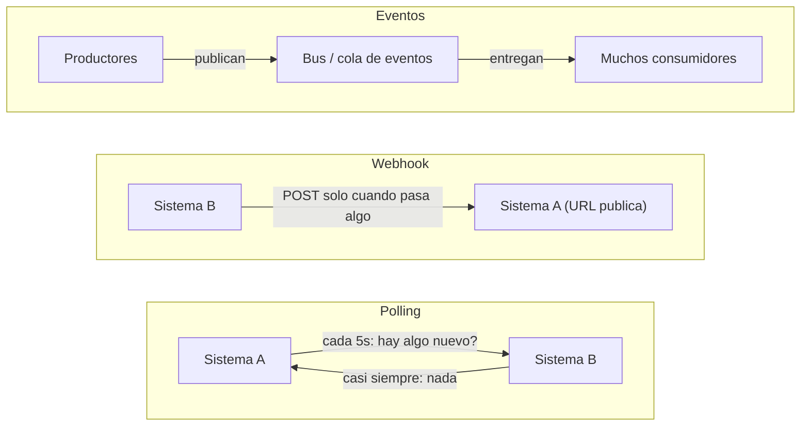
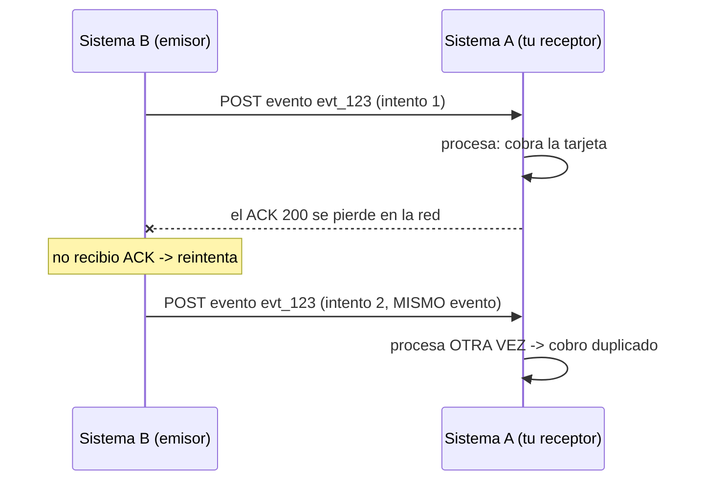
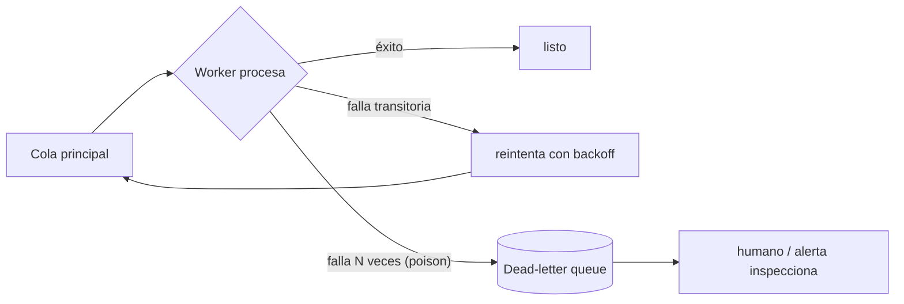
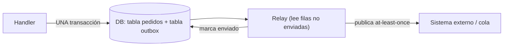

import Reto from "@components/Reto.astro";
import Solucion from "@components/Solucion.astro";
import Quiz from "@components/Quiz.astro";
import CheckDominio from "@components/CheckDominio.astro";
import Nivel from "@components/Nivel.astro";

<Nivel nivel="avanzado" />

Una automatización casi nunca vive sola: recibe un pago de Stripe, un ticket de Zendesk, un lead de un formulario, y tiene que reflejarlo en tu base de datos, en tu CRM y en tu Slack. El 90% del trabajo de un Automation Engineer es **hacer que dos sistemas que se hablan por una red poco confiable terminen de acuerdo** — sin perder eventos, sin duplicarlos, y sin que un atacante pueda inyectar uno falso. Esta lección te enseña, desde cero, las piezas concretas con las que se construye esa confiabilidad: cómo se entera un sistema de lo que pasa en otro (polling, webhooks, eventos), por qué la red **siempre** entrega de más o de menos, y los patrones que convierten "a veces funciona" en "no pierde ni duplica datos aunque algo se caiga a las 3 AM".

:::tip[Si ya integraste APIs (n8n, Zendesk, HubSpot, webhooks de Stripe)]
¿Ya conectaste sistemas con webhooks o leíste APIs de terceros? Tienes la intuición de "un sistema le avisa a otro". La trampa del que "ya lo hizo" es haber conectado todo por el **camino feliz**: configuraste el webhook, llegó el evento, funcionó la demo — y nunca te preguntaste qué pasa cuando el ACK se pierde y el emisor reintenta (¿cobras dos veces?), cuando un evento llega corrupto y bloquea la cola, cuando alguien descubre tu URL pública y postea un evento falso, o cuando tu consumidor estuvo caído 10 minutos (¿esos eventos se perdieron para siempre?). Salta directo a los **ejercicios Primero-Sin-IA** (sección 7): el primero te hace verificar una firma HMAC con anti-replay a mano; el segundo, construir un procesador idempotente con dead-letter queue. Si los cierras sin notas y puedes explicar **por qué at-least-once obliga a la idempotencia**, valida con el check de dominio (sección 8). Si te descubres pensando "los webhooks de Stripe nunca llegan dos veces", quédate: la sección 4 te va a doler un poco.
:::

## 1. Qué vas a saber hacer

Al terminar, sin IA y sin notas, podrás:

- **O1 — Diseñar una integración entre dos sistemas eligiendo con criterio** entre **polling, webhooks y arquitectura event-driven**, justificando el trade-off de latencia, costo y acoplamiento de cada uno.
- **O2 — Implementar la confiabilidad de una entrega at-least-once**: verificar una **firma HMAC con anti-replay** sobre el body crudo, **deduplicar con idempotency keys**, y enrutar los mensajes venenosos a una **DLQ** — explicando por qué "exactly-once delivery" es un mito y qué se hace en su lugar.
- **O3 — Explicar y aplicar el patrón outbox y la reconciliación** para resolver el problema del *dual-write*, y justificar por qué un sistema serio combina entrega en tiempo real (rápida pero falible) con reconciliación periódica (lenta pero correcta).

## 2. Por qué importa (el dinero está aquí)

> 💰 **Por qué importa:** "Automation Engineer" es la mitad de tu título, y la integración confiable es su **skill examinable más concreto**. Cualquiera arma un workflow que funciona en la demo; lo que el mercado paga —y lo que separa a un semi-senior de un junior con n8n— es saber qué pasa cuando la red falla. En una entrevista, "configuré un webhook" no mueve la aguja; "verifiqué la firma HMAC sobre el body crudo, dedupliqué por idempotency key porque la entrega es at-least-once, y mandé los poison messages a una DLQ" es una frase que te sube de banda. Es además el corazón del **capstone estrella de tu portafolio** (el agéntico de F7): un agente que ejecuta acciones en sistemas externos **sin** estas piezas duplica cobros, pierde pedidos y se deja inyectar eventos falsos. La confiabilidad no es un extra: es lo que vuelve tu automatización digna de producción.

Tres razones lo vuelven una bisagra de carrera:

1. **La red es un mentiroso.** Entre dos servicios hay timeouts, paquetes perdidos, reintentos y reordenamientos. Un ingeniero junior asume que "si mandé el evento, llegó una vez". Un semi-senior **diseña para que la mentira no corrompa los datos**. Esa diferencia de mentalidad es exactamente lo que se evalúa.
2. **Un webhook es una puerta abierta a internet.** Es una URL pública que ejecuta lógica de negocio (cobrar, crear, borrar). Sin verificación de firma, cualquiera que la descubra puede dispararla. La seguridad de integración es OWASP aplicado al mundo real, no teoría.
3. **Es el esqueleto de todo lo que viene en esta fase.** La graduación de n8n a código ([7.1](/fase-7-automatizacion/7-1-n8n-arquitectura/)), la ejecución durable con Temporal ([7.3](/fase-7-automatizacion/7-3-durable-execution-temporal/)) y los agentes de automatización ([7.7](/fase-7-automatizacion/7-7-agentes-automatizacion-ia/)) **dan por sentado** que sabes entregar de forma confiable. Aprenderlo bien aquí paga intereses en cada lección siguiente.

## 3. Lo que ya traes (actívalo)

Esta lección ensambla hilos que ya tienes. Recupéralos **de memoria** antes de seguir:

- De [`3.14` Idempotencia y resiliencia](/fase-3-backend/3-14-idempotencia-resiliencia/): una operación **idempotente** da el mismo resultado se aplique una o N veces; los **reintentos con backoff** reenvían lo que falló. Aquí descubres *por qué* esos reintentos te obligan a la idempotencia: sin ella, cada reintento es un cobro duplicado.
- De [`3.16` Colas y procesamiento async](/fase-3-backend/3-16-colas-async/): una **cola** desacopla "recibí el trabajo" de "lo terminé". Aquí le sumamos qué pasa cuando un mensaje **nunca** se procesa bien: la **dead-letter queue**.
- De [`3.12` Autenticación y OAuth2](/fase-3-backend/3-12-auth-oauth2/): JWT, scopes y el flujo **client credentials** vs. **authorization code + PKCE**. Aquí los usas para el caso real: un sistema llamando a la API de otro.
- De [`3.13` OWASP Top 10](/fase-3-backend/3-13-owasp-top10-web/): broken access control, secrets management. Un webhook sin firma es *broken authentication* de manual.

Antes de seguir, responde de memoria:

<Quiz
  question="En la 3.14 viste que reintentar una petición fallida (con backoff) hace tu sistema resiliente. Pero hay un costado peligroso. ¿Cuál?"
  options={[
    "Ninguno: reintentar siempre es seguro mientras uses backoff con jitter",
    "Si la petición original SÍ se ejecutó pero el ACK se perdió, el reintento la ejecuta otra vez; si la operación no es idempotente (p. ej. cobrar una tarjeta), produce un efecto duplicado",
    "El único riesgo es saturar al servidor destino con demasiados reintentos seguidos",
  ]}
  answer={1}
  explanation="El reintento no sabe si el original falló de verdad o solo se perdió la confirmación. Reenvía por las dudas. Si la operación no es idempotente, ese 'por las dudas' es un cobro, un email o un pedido duplicado. Por eso reintentos (resiliencia) e idempotencia (corrección) son dos caras de la misma moneda: no puedes tener lo uno sin lo otro en una integración seria."
/>

## 4. Ejemplo resuelto, pensado en voz alta

Te voy a construir, de cero, el receptor de webhooks de un sistema de pagos —razonando cada decisión como me oirías al lado tuyo. No lo leas como código para copiar: léelo como un proceso de decisiones sobre **una red que no es confiable**.

### 4.1 Primero: ¿cómo se entera un sistema de lo que pasa en otro?

Hay tres formas, y elegir mal cuesta latencia o plata. Razono el mapa:



- *"**Polling**: A le pregunta a B una y otra vez '¿hay algo nuevo?'. Es como revisar el buzón cada cinco minutos: simple de construir (A controla el ritmo), pero **caro y lento**. El 99% de las veces la respuesta es 'nada', y aun así pagaste la petición; y si algo pasa justo después de preguntar, te enteras hasta el próximo ciclo. Sirve cuando B no puede avisarte (una API vieja sin webhooks) o cuando el batch periódico está bien."*
- *"**Webhook**: le das a B una URL tuya y B te hace un `POST` **cuando** pasa algo. Es el cartero tocando el timbre en vez de tú bajando a mirar. **Eficiente y de baja latencia**, pero te obliga a exponer un endpoint público —y ahí entran la firma y el anti-replay— y a tragarte la entrega cuando tu servidor está caído."*
- *"**Eventos (event-driven)**: los productores publican a un **bus** (Kafka, una cola) y los consumidores reaccionan. Desacopla N productores de M consumidores: añadir un cuarto consumidor no toca a nadie. Es la arquitectura de sistemas grandes, a costa de más infraestructura y de razonar sobre orden y entrega."*

> **Regla de elección:** webhook si el otro sistema lo ofrece y necesitas baja latencia; polling si no hay webhook o un batch periódico basta; bus de eventos cuando hay **muchos** consumidores del mismo hecho. La mayoría de tus integraciones empiezan en webhook.

### 4.2 La verdad incómoda: la entrega es "at-least-once"

Aquí está el concepto que lo cambia todo. Razono fuerte: *"Cuando B te manda un webhook, espera un `ACK` (un `200 OK`) para saber que llegó. ¿Qué pasa si **tu servidor procesó el evento pero el ACK se perdió en la red**? B no sabe distinguir 'no llegó' de 'llegó pero no me avisaste'. Así que, por las dudas, **reintenta**. Resultado: procesaste el mismo evento dos veces."*



*"Esto no es un caso raro: es la garantía **at-least-once** (al menos una vez), y es la que ofrecen Stripe, las colas de mensajes y casi todo. Hay tres modelos teóricos:"*

| Garantía | Qué significa | Problema |
|---|---|---|
| **at-most-once** | se entrega 0 o 1 veces | puede **perder** mensajes (inaceptable para un pago) |
| **at-least-once** | se entrega 1 o más veces | puede **duplicar** (lo que casi todos ofrecen) |
| **exactly-once** | exactamente 1 vez | **prácticamente imposible** de garantizar en la entrega por la red |

*"La salida de la industria no es perseguir 'exactly-once delivery' (un mito en sistemas distribuidos), sino aceptar at-least-once en la **entrega** y volver el **procesamiento idempotente**. A eso se le llama 'effectively-once': te entregan de más, pero tú actúas una sola vez. La idempotencia no es un lujo: es la pieza que vuelve usable un canal que duplica."*

### 4.3 La pieza #1: idempotency keys (deduplicar)

*"Necesito una forma de reconocer 'este evento ya lo procesé'. La pieza es la **idempotency key**: un identificador único por **operación lógica**. Stripe lo manda en cada webhook como el `id` del evento (`evt_123`) y, para peticiones que tú inicias, como una cabecera `Idempotency-Key`. Mi receptor guarda los ids ya procesados; si llega uno repetido, **devuelvo el resultado guardado sin volver a ejecutar el efecto**."*

```python
# Pseudocódigo del corazón de la idempotencia (lo implementarás en el ejercicio 2)
procesados: dict[str, dict] = {}   # en producción: una tabla con UNIQUE en la key

def manejar(evento: dict) -> dict:
    key = evento["id"]
    if key in procesados:                 # ya lo vimos
        return procesados[key]            # devuelve lo de antes, NO re-ejecuta el cobro
    resultado = cobrar(evento)            # el efecto real, una sola vez
    procesados[key] = resultado           # recuerda que ya está hecho
    return resultado
```

*"Dos sutilezas que separan al que entiende del que copió: (1) la dedup tiene que ser **atómica** —dos reintentos concurrentes con la misma key no deben colarse ambos; en una DB eso es una constraint `UNIQUE` sobre la key o un `INSERT ... ON CONFLICT`, no un `if key in dict` con una carrera en medio. (2) Guardo el **resultado**, no solo la key: si el duplicado llega, le devuelvo la misma respuesta que la primera vez, para que el emisor quede conforme."*

### 4.4 La pieza #2: firma HMAC + anti-replay (que el evento sea legítimo)

*"Mi endpoint es una URL pública. Si no verifico nada, cualquiera que adivine `/webhooks/pagos` puede postear `{evento: pago_confirmado, monto: 1000000}` y mi sistema le cree. Necesito dos garantías: que el evento **viene de B** y que **nadie lo manipuló en el camino**. La herramienta es el **HMAC**."*

*"Funciona así: B y yo compartimos un **secreto** (un `whsec_...` que B me dio al registrar el webhook, y que guardo en el entorno, **nunca** en el código). B calcula `HMAC-SHA256(secreto, payload)` y me manda ese hash en una cabecera. Yo recalculo el HMAC sobre lo que recibí con el **mismo** secreto: si coincide, el mensaje es auténtico e íntegro. Un atacante sin el secreto no puede producir una firma válida."*

```python
import hashlib
import hmac
import time

TOLERANCIA_SEG = 300  # 5 minutos

def verificar_firma(payload: bytes, header_firma: str, secreto: str, ahora: int) -> bool:
    # La cabecera viene como:  t=1718900000,v1=5257a86920...
    partes = dict(p.split("=", 1) for p in header_firma.split(","))
    t = int(partes["t"])
    firma_recibida = partes["v1"]

    # (1) recomputo el HMAC sobre "<t>.<payload>" con el secreto compartido
    base = f"{t}.".encode() + payload
    esperada = hmac.new(secreto.encode(), base, hashlib.sha256).hexdigest()

    # (2) comparación en TIEMPO CONSTANTE (no '==': eso filtra info por timing)
    if not hmac.compare_digest(esperada, firma_recibida):
        return False

    # (3) anti-replay: rechazo si la firma (válida) es vieja
    return abs(ahora - t) <= TOLERANCIA_SEG
```

Razono las tres líneas que la gente arruina:

- *"**Firmo sobre `t.payload`, no solo el payload.** Incluir el timestamp `t` dentro de lo firmado es lo que habilita el **anti-replay**. Sin esto, un atacante que **capture** un webhook legítimo (con su firma válida) puede **reenviarlo** mil veces —un replay attack— y cada copia pasaría la verificación. Al firmar el timestamp y rechazar lo más viejo que cinco minutos, una captura caduca enseguida."*
- *"**`hmac.compare_digest`, nunca `==`.** Comparar strings con `==` se detiene en el primer carácter distinto: el tiempo que tarda **filtra** cuántos caracteres acertó el atacante, y con suficientes intentos reconstruye la firma (timing attack). `compare_digest` compara en tiempo constante. Es una línea, y es la diferencia entre seguro e inseguro."*
- *"**Verifico sobre el body CRUDO (`bytes`), no sobre el JSON parseado.** Si parseo el JSON y lo vuelvo a serializar para firmar, los bytes cambian (espacios, orden de claves) y la firma **nunca** coincide. Este es el bug #1 de quien implementa verificación de webhooks. Lee los bytes tal como llegaron."*

### 4.5 Ensamblando el receptor (FastAPI)

Junto las piezas en un endpoint real. Verifico firma, deduplico, **encolo** y respondo rápido:

```python
import json
import os
import time

from fastapi import FastAPI, Request, HTTPException

app = FastAPI()
WEBHOOK_SECRET = os.environ["WEBHOOK_SECRET"]   # del entorno, jamás hardcodeado (3.13)

@app.post("/webhooks/pagos")
async def recibir_webhook(request: Request):
    payload = await request.body()              # bytes CRUDOS, sin re-serializar (4.4)
    firma = request.headers.get("X-Firma", "")

    if not verificar_firma(payload, firma, WEBHOOK_SECRET, int(time.time())):
        raise HTTPException(status_code=400, detail="firma invalida")   # rechazo legítimo

    evento = json.loads(payload)

    if ya_procesado(evento["id"]):              # idempotencia (4.3)
        return {"status": "duplicado-ignorado"} # ACK 200: el emisor deja de reintentar

    encolar(evento)                             # el trabajo pesado va async -> a una cola
    return {"status": "encolado"}               # responde RÁPIDO: solo confirma recepción
```

*"Una decisión de diseño clave: **el handler de webhook no hace el trabajo pesado**. Verifica, deduplica, **encola** y devuelve `200` enseguida. ¿Por qué? Porque B tiene un timeout (Stripe corta a los pocos segundos): si me pongo a llamar tres APIs dentro del handler y tardo, B cree que falló y reintenta —más duplicados, más carga. El patrón correcto es **recibir rápido, procesar después** (la cola de la [3.16](/fase-3-backend/3-16-colas-async/)). El procesamiento async es donde entran los reintentos y la DLQ."*

### 4.6 La pieza #3: DLQ y poison messages (cuando algo nunca se procesa)

*"En la cola, un mensaje puede fallar por algo transitorio (la API destino estaba caída) —ahí el reintento con backoff lo arregla. Pero otro puede fallar **siempre**: viene malformado, referencia un cliente que ya no existe, o destapa un bug. A eso se le llama **poison message** (mensaje venenoso). Si lo reintento infinito, **bloqueo la cola** detrás de él y quemo CPU y plata para siempre."*

*"La solución es la **dead-letter queue (DLQ)**: tras N intentos fallidos (`maxReceiveCount`), el mensaje se mueve a una cola lateral. La cola principal sigue fluyendo; el veneno queda apartado para que un humano (o un job) lo inspeccione. La DLQ es el 'cuarto de las cosas rotas': no las arregla, pero **evita que rompan todo lo demás**."*



### 4.7 La pieza #4: el problema del dual-write y el patrón outbox

*"Ahora un problema más sutil, el que tumba integraciones 'que funcionaban'. Mi handler tiene que hacer **dos** cosas: (1) guardar el pedido en mi DB y (2) publicar un evento `pedido_creado` a otro sistema. Si las hago por separado y **me caigo entre las dos**, quedo inconsistente: o guardé el pedido pero el evento se perdió (el otro sistema nunca se entera), o publiqué el evento pero la transacción se revirtió (el otro sistema cree en un pedido que no existe). Esto se llama el problema del **dual-write**, y no se arregla con reintentos."*

*"El **patrón outbox** lo resuelve con una idea elegante: escribo el evento en una tabla `outbox` **dentro de la misma transacción** que el cambio de negocio. O se guardan ambos, o ninguno —la DB me da esa atomicidad gratis. Luego, un proceso aparte (el *relay*) lee la outbox y publica los eventos at-least-once, marcándolos como enviados. La atomicidad la garantiza la transacción; la entrega, el relay. Los consumidores, claro, deben ser **idempotentes** (porque el relay entrega at-least-once)."*



### 4.8 La red de seguridad: replay y reconciliación

*"Hagas lo que hagas, **algún** evento se perderá: una outbox con un bug, un webhook que B nunca reintentó, una cola purgada por error. Por eso los sistemas serios no confían solo en el tiempo real. Dos herramientas:"*

- *"**Replay**: como guardé los eventos (en la outbox, en un log), puedo **reprocesarlos**. ¿Un consumidor estuvo caído una hora? Le reenvío los eventos de esa hora. ¿Arreglé un bug? Reproceso los eventos que llegaron mientras estaba roto. El replay solo es seguro si los consumidores son idempotentes —de nuevo la misma pieza."*
- *"**Reconciliación**: un job periódico que **compara el estado de los dos sistemas** y repara la diferencia. 'Todos los pedidos pagados en Stripe deben existir en mi DB': el reconciliador lista ambos, detecta los que faltan y los crea. Es lento y aburrido, pero es la **verdad**. El lema: **confía en los eventos para la velocidad, reconcilia para la corrección.**"*

> **Regla mental:** entrega en tiempo real (webhooks/eventos) = rápida pero falible. Reconciliación periódica = lenta pero correcta. Un sistema de producción usa **las dos**: la primera para que se sienta instantáneo, la segunda para que ningún dato se pierda de forma permanente.

### 4.9 OAuth2 entre sistemas (machine-to-machine)

*"Última pieza: para publicar en la API de otro sistema, necesito autenticarme. Cuando es **mi servicio hablándole a otro servicio** (sin un usuario humano de por medio), el flujo correcto es **client credentials**: tengo un `client_id` y un `client_secret`, se los presento al *authorization server* del otro sistema, me devuelve un **access token** de corta vida, y lo mando como `Authorization: Bearer <token>` en cada llamada."*

*"Cuando actúo **en nombre de un usuario** (su Google Drive, su GitHub), el flujo es **authorization code + PKCE** —el de la [3.12](/fase-3-backend/3-12-auth-oauth2/), donde el usuario consiente. La regla: client credentials para máquina-a-máquina, authorization code para usuario-de-por-medio. Y el token **expira**: cacheo el token, y cuando una llamada me devuelve `401`, pido uno nuevo y reintento. Nunca hardcodeo el `client_secret` (gitleaks lo cazaría, [3.13](/fase-3-backend/3-13-owasp-top10-web/))."*

## 5. Errores que vas a tener (y por qué)

:::caution[Podrías pensar que "los webhooks de Stripe nunca llegan dos veces"]
Llegan. La garantía es **at-least-once**: si tu `200` se demora o se pierde, Stripe (y cualquier emisor serio) **reintenta el mismo evento**. Asumir entrega única es la causa #1 de cobros, emails y pedidos duplicados en producción. La defensa no es "configurar bien el webhook": es **deduplicar por el id del evento** del lado tuyo. Diseña siempre como si cada evento pudiera llegar varias veces, porque va a pasar.
:::

:::caution[Podrías pensar que verificar la firma sobre el JSON parseado es equivalente]
No lo es, y rompe en silencio. Si haces `evento = await request.json()` y luego firmas `json.dumps(evento)`, los bytes que firmas **no son** los que mandó el emisor (cambia el orden de claves, los espacios, el escape de unicode). El HMAC depende de **cada byte**. Hay que verificar sobre el **body crudo** (`await request.body()` → `bytes`) tal como llegó, *antes* de parsear. Quien parsea primero y firma después pasa horas preguntándose por qué "la firma siempre falla".
:::

:::caution[Podrías pensar que comparar la firma con `==` está bien]
`firma_recibida == esperada` es una bomba de timing. La comparación de strings se detiene en el primer carácter distinto, así que el **tiempo** que tarda revela cuántos caracteres iniciales acertó un atacante. Con suficientes mediciones, reconstruye la firma byte a byte sin conocer el secreto. Usa siempre `hmac.compare_digest`, que compara en tiempo constante. Es una línea; ignorarla convierte tu verificación en teatro.
:::

:::caution[Podrías pensar que "exactly-once delivery" es la meta y se puede lograr]
No se puede garantizar en la entrega por una red poco confiable (es un resultado conocido de los sistemas distribuidos, emparentado con el problema de los dos generales). Perseguirlo es perder el tiempo. Lo que **sí** se logra es **effectively-once processing**: aceptas que la entrega es at-least-once (te llega de más) y haces el procesamiento idempotente (actúas una sola vez). Si en una entrevista dices "garantizo exactly-once con tal cola", el entrevistador sabrá que no entendiste el problema; la respuesta senior es "at-least-once + idempotencia".
:::

:::caution[Podrías pensar que reintentar para siempre es "más robusto"]
Reintentar infinito un **poison message** (uno que falla siempre, no por algo transitorio) bloquea la cola detrás de él, quema CPU y dinero, y nunca tiene éxito. Robusto no es "no rendirse nunca": es **distinguir** una falla transitoria (reintenta con backoff) de una permanente (manda a la DLQ tras N intentos y sigue con el resto). Una cola sin DLQ es una cola que un solo mensaje malo puede paralizar.
:::

## 6. Práctica con andamiaje (que se desvanece)

Tres pasos, de más apoyo a menos. Hazlos **a mano primero**: en integración, "ejecutar" es leer el flujo y predecir qué pasa cuando la red falla.

### 6.1 PREDICT — ¿cuántas veces se cobra la tarjeta?

Un emisor manda el evento `evt_777` (un cobro). Tu handler **no** deduplica. La secuencia real fue: intento 1 → tu servidor cobra y empieza a responder, pero el ACK se pierde; el emisor reintenta → intento 2 → cobras de nuevo, ACK llega OK. Predice **sin ejecutar**:

1. ¿Cuántas veces se ejecutó el cobro?
2. Si tu handler **sí** dedujera por `evt_777`, ¿cuántas veces se cobraría?
3. ¿Qué le devuelves al emisor en el intento 2 (con dedup) para que deje de reintentar?

<Solucion title="Ver la respuesta (solo después de predecir)">
1. **Dos veces.** Sin dedup, el reintento es indistinguible de un evento nuevo: el cobro corre en el intento 1 y otra vez en el 2. Cobro duplicado.
2. **Una vez.** En el intento 2, tu handler ve que `evt_777` ya está en los procesados y **no** vuelve a cobrar.
3. Un **`200 OK`** (idealmente con el resultado guardado del intento 1, p. ej. `{"status": "duplicado-ignorado"}`). El emisor reintenta porque no recibió ACK; en cuanto le confirmas, para. Devolver un `4xx`/`5xx` aquí sería un error: lo haría reintentar más.

La moraleja: at-least-once + dedup por idempotency key = effectively-once. El número que importa (cobros) baja de 2 a 1 con una sola pieza.
</Solucion>

### 6.2 PREDICT — ¿esta verificación de firma es segura?

Lee esta función **sin correrla** y encuentra los **tres** problemas de seguridad:

```python
def verificar(payload_json: dict, firma_recibida: str, secreto: str) -> bool:
    cuerpo = json.dumps(payload_json)                      # (a)
    esperada = hmac.new(secreto.encode(), cuerpo.encode(), hashlib.sha256).hexdigest()
    return esperada == firma_recibida                      # (b)
    # (c) ...
```

<Solucion title="Ver los tres problemas">
- **(a) Firma sobre JSON re-serializado, no sobre el body crudo.** `json.dumps` de un dict ya parseado produce bytes distintos a los que mandó el emisor (orden de claves, espacios). La firma jamás coincidirá con un emisor real. Hay que recibir y firmar `bytes` crudos.
- **(b) Comparación con `==`.** Vulnerable a timing attack. Debe ser `hmac.compare_digest(esperada, firma_recibida)`.
- **(c) No hay anti-replay.** No se incluye ni verifica un timestamp, así que una captura de un webhook legítimo se puede reenviar indefinidamente y pasará. Falta firmar `t.payload` y rechazar lo más viejo que la tolerancia.

Tres líneas, tres agujeros. Es exactamente el "verificador de tutorial" que parece funcionar en la demo y deja la puerta abierta en producción.
</Solucion>

### 6.3 MODIFY — arregla este worker de cola

Este worker procesa mensajes de una cola, pero tiene **dos problemas** que lo vuelven peligroso en producción. Identifícalos y describe el arreglo (a mano, sin IA):

```python
def worker(cola):
    while True:
        msg = cola.recibir()
        try:
            llamar_api_externa(msg)        # puede fallar
        except Exception:
            cola.devolver(msg)             # lo vuelve a poner en la cola
        # no hay marca de "procesado"; no hay límite de reintentos
```

<Solucion title="Ver los dos problemas y el arreglo">
1. **Sin límite de reintentos → poison message infinito.** Si `msg` está malformado y `llamar_api_externa` falla **siempre**, este bucle lo reintenta para siempre, bloqueando la cola y quemando recursos. Arreglo: llevar un contador de intentos por mensaje (`maxReceiveCount`) y, al superarlo, **mover a la DLQ** en vez de devolverlo: `if msg.intentos >= MAX: dlq.enviar(msg) else: cola.devolver(msg)`.
2. **Sin idempotencia → al devolver y reprocesar, el efecto se duplica.** Si `llamar_api_externa` **sí** se ejecutó pero falló *después* (al confirmar), devolver el mensaje lo reejecuta. Arreglo: deduplicar por el id del mensaje antes de llamar a la API (registrar "ya procesado" de forma atómica), o usar una idempotency key contra la API externa.

Faltaría además un backoff entre reintentos (3.14) para no martillar la API caída. El patrón completo: **dedup + backoff + DLQ tras N intentos.**
</Solucion>

## 7. Ejercicios Primero-Sin-IA

Ahora sin andamiaje. Resuélvelos **a mano, sin IA** dentro del timebox. Ambos se autocorrigen con `pytest` (corre en tu máquina, sin servicios externos); la **comprensión** la corrige tu IA con la rúbrica —justo lo que ninguna IA tiene por ti.

<Reto title="Verifica un webhook firmado (HMAC + anti-replay)" timebox="40 min">

Implementa la verificación de firma de un webhook estilo Stripe. En la carpeta del ejercicio hay un starter (`verificador.py`) con el contrato y un test (`test_verificador.py`) que construye firmas válidas e inválidas y verifica tu lógica caso por caso. No necesitas red ni cuenta de pagos.

Tu trabajo: implementar `verificar_webhook(payload, header_firma, secreto, ahora, tolerancia_seg=300)` que devuelva **exactamente** uno de estos strings:

- `"VALIDO"` — firma correcta y dentro de la ventana de tiempo.
- `"FIRMA_INVALIDA"` — el HMAC no coincide (payload manipulado o secreto equivocado).
- `"EXPIRADO"` — la firma es válida pero el timestamp es más viejo que la tolerancia (replay).
- `"MALFORMADO"` — la cabecera no se puede parsear (faltan `t` o `v1`).

Reglas que el test exige:
1. Verifica sobre el **body crudo en `bytes`**, firmando `f"{t}.".encode() + payload`.
2. Usa `hmac.compare_digest` (tiempo constante), nunca `==`.
3. Verifica la **firma antes** que la frescura: solo confías en el `t` si la firma es auténtica.

**Hecho significa:**
- [ ] `uv run pytest` (o `pytest`) pasa en verde, los cuatro estados cubiertos.
- [ ] La comparación de firmas usa `hmac.compare_digest`.
- [ ] La verificación opera sobre `bytes`, no sobre un dict ni un string re-serializado.
- [ ] Puedes **explicar sin notas** por qué se firma `t.payload` y no solo `payload` (anti-replay).
- [ ] Puedes decir qué ataque concreto previene `compare_digest` y por qué `==` no sirve.

Enunciado completo y starter: `ejercicios/fase-7/verificar-webhook-firmado/` (carpeta del repo).

<Solucion title="Pista (ábrela solo si superaste el timebox)">
Parsea la cabecera con un `dict(p.split("=", 1) for p in header.split(","))`, envuelto en un `try/except` que devuelva `"MALFORMADO"` si falta `t` o `v1` o si `int(t)` revienta. El orden de chequeos importa: primero `MALFORMADO` (no se puede parsear), luego recomputa el HMAC y compara con `compare_digest` → si no coincide, `"FIRMA_INVALIDA"`; recién entonces compara `abs(ahora - t)` con la tolerancia → `"EXPIRADO"` o `"VALIDO"`. Verificar la firma antes que la frescura evita confiar en un `t` que un atacante pudo inventar. Lee el test: te dice exactamente cómo se construye una firma válida (es tu "spec"). Pista, no solución.
</Solucion>

</Reto>

<Reto title="Procesador idempotente con dead-letter queue" timebox="45 min">

Construye el procesador que vuelve seguro un canal at-least-once. En la carpeta hay un starter (`procesador.py`) con el contrato y un test (`test_procesador.py`). Sin red: el "efecto" es una función que tú controlas en los tests.

1. **`procesador.py`** — implementa la clase `ProcesadorIdempotente(max_intentos=3)` con un método `procesar(evento, efecto)` donde `evento` es un dict con `"id"` y `efecto` es un callable `efecto(evento)` que puede tener éxito o lanzar excepción. Reglas:
   - Evento **nuevo**: llama a `efecto` **una** vez. Si tiene éxito, guarda el resultado y devuelve `{"status": "procesado", "resultado": ...}`.
   - Evento cuyo `id` **ya se procesó con éxito**: **no** vuelve a llamar a `efecto`; devuelve `{"status": "duplicado", "resultado": <el guardado>}`.
   - Si `efecto` lanza excepción: cuenta el intento. Mientras los intentos sean menores que `max_intentos`, devuelve `{"status": "reintentable"}` (sin marcar como completado). Al llegar a `max_intentos`, mueve el evento a la **DLQ** y devuelve `{"status": "dlq"}`.
   - Expón la DLQ como una lista accesible (`procesador.dlq`).
2. **`write-up.md`** — responde, en prosa breve y defendible (sin IA):
   - (a) ¿Por qué un evento que falla y luego tiene éxito **no** debe contar como "duplicado" en el intento exitoso?
   - (b) Explica el problema del **dual-write** y cómo el **patrón outbox** lo resuelve. ¿Por qué los consumidores del outbox deben ser idempotentes?
   - (c) ¿Qué aporta la **reconciliación** que la entrega en tiempo real (webhooks/eventos) no puede garantizar por sí sola?

**Hecho significa:**
- [ ] `uv run pytest` pasa: dedup (el efecto corre una sola vez en duplicados), poison → DLQ tras `max_intentos`, eventos distintos procesados por separado.
- [ ] Un evento que falla y luego se reintenta con éxito se procesa de verdad (no se marca como duplicado por el intento fallido previo).
- [ ] El `write-up.md` distingue **entrega at-least-once** de **procesamiento idempotente**.
- [ ] El write-up nombra el **dual-write** y explica el **outbox** con la idea de la transacción única.
- [ ] Puedes explicar sin notas por qué reconciliar es la "verdad" y la entrega en vivo es "la velocidad".

Enunciado completo y material: `ejercicios/fase-7/procesador-idempotente-dlq/` (carpeta del repo).

<Solucion title="Pista (ábrela solo si superaste el timebox)">
Lleva dos estructuras: un dict `completados: {id: resultado}` (solo entran los **éxitos**) y un dict `intentos: {id: int}`. En `procesar`: si el id está en `completados`, devuelve `duplicado` sin tocar `efecto`. Si no, llama a `efecto` dentro de `try`: en éxito, guarda en `completados` y devuelve `procesado`; en excepción, incrementa `intentos[id]` y compara con `max_intentos` para decidir `reintentable` vs `dlq`. La clave del punto (a): marca como completado **solo** en la rama de éxito, así un fallo previo no convierte el éxito posterior en "duplicado". Para el write-up, el outbox vive en la sección 4.7 y la reconciliación en 4.8; explícalo con tus palabras, no las copies. Pista, no solución.
</Solucion>

</Reto>

## 8. Check de dominio

Sin mirar la lección, en voz alta o por escrito:

<CheckDominio
  items={[
    "Explicar cuándo elegirías polling, webhook o un bus de eventos, con el trade-off de cada uno (latencia, costo, acoplamiento).",
    "Explicar qué significa entrega at-least-once y por qué exactly-once delivery es un mito en sistemas distribuidos.",
    "Explicar por qué at-least-once obliga a la idempotencia, y cómo una idempotency key deduplica.",
    "Describir los tres pasos de verificar un webhook con HMAC + anti-replay (firmar t.payload, compare_digest, rechazar lo viejo) y por qué se hace sobre el body crudo.",
    "Explicar qué es un poison message y qué hace una DLQ con él.",
    "Explicar el problema del dual-write y cómo el patrón outbox lo resuelve con una sola transacción.",
    "Explicar la diferencia entre replay y reconciliación, y por qué un sistema serio usa entrega en vivo Y reconciliación periódica.",
    "Decir cuándo usar OAuth2 client credentials vs. authorization code + PKCE entre sistemas.",
  ]}
/>

Si marcaste menos de seis, vuelve a la sección correspondiente **antes** de avanzar. No es un examen: es honestidad contigo.

<Quiz
  question="Tu webhook de pagos verifica la firma HMAC correctamente y funciona en la demo. En producción, algunos clientes aparecen cobrados dos veces. ¿Cuál es la causa más probable?"
  options={[
    "El secreto HMAC se filtró y un atacante está reenviando eventos",
    "El emisor entrega at-least-once: cuando tu ACK se demora o se pierde, reintenta el mismo evento, y tu handler no deduplica por el id del evento antes de cobrar",
    "FastAPI procesa cada request dos veces por defecto cuando hay alta concurrencia",
  ]}
  answer={1}
  explanation="La firma garantiza autenticidad e integridad, no unicidad. La entrega es at-least-once: ante un ACK perdido o lento, el emisor reintenta el MISMO evento. Sin deduplicación por idempotency key (el id del evento), cada reintento es un cobro nuevo. La firma y la idempotencia resuelven problemas distintos; necesitas ambas."
/>

<Quiz
  question="Vas a verificar la firma de un webhook. ¿Cuál de estas implementaciones es correcta y segura?"
  options={[
    "Parsear el JSON, re-serializarlo con json.dumps, calcular el HMAC y comparar con ==",
    "Calcular el HMAC sobre el body crudo en bytes firmando 't.payload', comparar con hmac.compare_digest y rechazar si el timestamp es más viejo que la tolerancia",
    "Comparar el id del evento contra una lista blanca de ids permitidos",
  ]}
  answer={1}
  explanation="Sobre el body CRUDO (re-serializar cambia los bytes y rompe el HMAC), firmando t.payload para habilitar el anti-replay, comparando en tiempo constante con compare_digest (== filtra por timing), y rechazando lo viejo (replay). La opción 1 acumula los tres errores clásicos; la 3 no verifica autenticidad en absoluto."
/>

## 9. Recursos (documentación oficial primero)

- **Stripe — Webhooks y verificación de firma:** [docs.stripe.com/webhooks](https://docs.stripe.com/webhooks) y [verificar firmas](https://docs.stripe.com/webhooks#verify-manually) — el esquema `t=...,v1=...`, la ventana de tolerancia y la dedup por `event.id`, explicados por la implementación de referencia de la industria.
- **Python `hmac` (stdlib):** [docs.python.org/3/library/hmac.html](https://docs.python.org/3/library/hmac.html) — `hmac.new`, `hmac.compare_digest` y por qué la comparación en tiempo constante importa.
- **FastAPI — Request directo (body crudo):** [fastapi.tiangolo.com/.../using-request-directly](https://fastapi.tiangolo.com/advanced/using-request-directly/) — leer `await request.body()` y las cabeceras en un endpoint.
- **AWS — Dead-letter queues (SQS):** [docs.aws.amazon.com/.../sqs-dead-letter-queues](https://docs.aws.amazon.com/AWSSimpleQueueService/latest/SQSDeveloperGuide/sqs-dead-letter-queues.html) — `maxReceiveCount`, poison messages y el patrón DLQ en una cola real.
- **microservices.io — Transactional Outbox:** [microservices.io/patterns/data/transactional-outbox.html](https://microservices.io/patterns/data/transactional-outbox.html) — el patrón outbox y el problema del dual-write, con diagramas.
- **OAuth 2.0 — Client Credentials Grant (RFC 6749 §4.4):** [datatracker.ietf.org/doc/html/rfc6749#section-4.4](https://datatracker.ietf.org/doc/html/rfc6749#section-4.4) — el flujo machine-to-machine, en la fuente.
- **Idempotency-Key Header (IETF draft):** [datatracker.ietf.org/doc/draft-ietf-httpapi-idempotency-key-header](https://datatracker.ietf.org/doc/draft-ietf-httpapi-idempotency-key-header/) — el estándar emergente para deduplicar peticiones HTTP.

## 10. Conexión con el capstone de la fase

El **[Capstone F7 — Automatización end-to-end agéntica](/fase-7-automatizacion/proyecto/)** recibe un input (email/documento/ticket), lo procesa con IA y **ejecuta acciones en sistemas externos**. Toda esta lección es su columna de confiabilidad:

- El **receptor de entrada** del capstone (4.5) verifica firma HMAC + anti-replay (4.4): nadie inyecta un ticket falso que dispare una acción real.
- El **procesamiento idempotente** (4.3) y la **DLQ** (4.6) garantizan que un reintento del input no ejecute dos veces la acción del agente, y que un input venenoso no paralice el flujo. Esto es, literalmente, el punto 6 del *Definition of Done* (validación + techo de costo + manejo de fallas) aplicado a la entrada.
- El **outbox + reconciliación** (4.7–4.8) sostienen el "no pierde datos" que distingue tu capstone del 90% de los portafolios: la historia de "se cayó el consumidor, reconcilié y nada se perdió" es exactamente la narrativa semi-senior que buscas (T0.4).
- El **OAuth2 client credentials** (4.9) es cómo el agente se autentica contra las APIs en las que actúa.

Y conecta hacia adelante: cuando una integración por webhook/cola se vuelve demasiado frágil para coordinar muchos pasos con estado, se gradúa a **ejecución durable** ([7.3 Temporal](/fase-7-automatizacion/7-3-durable-execution-temporal/)), que internaliza reintentos, replay determinista e idempotencia. Lo que aquí construyes a mano, Temporal te lo da como primitiva —pero solo lo usarás bien si entendiste **por qué** existe.

## 11. Reflexión y repaso espaciado

Cierra escribiendo dos o tres frases respondiendo: **en el ejercicio 1, ¿en qué momento entendiste por qué se firma `t.payload` y no solo el `payload`?** Ese es el salto entre "verifico una firma" y "entiendo el ataque que estoy previniendo": el anti-replay no protege la integridad (eso lo hace el HMAC), protege contra la **reutilización** de un mensaje legítimo capturado. Nombrar cuándo te cayó la ficha es medir lo que aprendiste.

Gancho de **spaced repetition**:

- **Mañana:** reescribe **de memoria** (sin abrir esta página) la tabla de las tres garantías de entrega (at-most/at-least/exactly-once) y, en una frase, qué se hace en la práctica en vez de exactly-once. Si te falta la palabra "idempotencia", vuelve a la sección 4.2.
- **En 3 días:** explica en voz alta, a alguien (o a la cámara), la diferencia entre replay y reconciliación, y por qué un sistema serio usa las dos. Si dudas, repasa la sección 4.8.
- **En 1 semana:** toma una integración real tuya (un webhook de Stripe, un nodo HTTP de n8n) y audítala con esta checklist: ¿verifica firma? ¿anti-replay? ¿deduplica? ¿tiene DLQ? ¿reconcilia? Anota qué le falta. Casi siempre falta más de lo que crees —y ese diagnóstico es, en sí mismo, una historia de portafolio.
