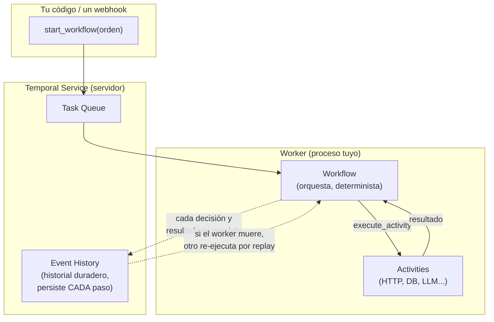
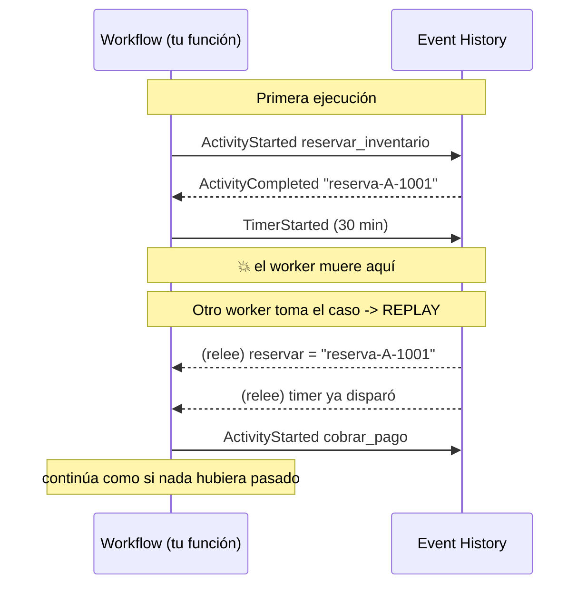
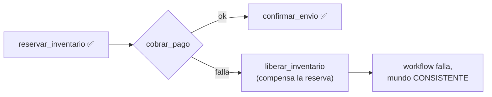

import Nivel from "@components/Nivel.astro";
import Reto from "@components/Reto.astro";
import Solucion from "@components/Solucion.astro";
import Quiz from "@components/Quiz.astro";
import CheckDominio from "@components/CheckDominio.astro";

<Nivel nivel="avanzado" />

En [7.1](/fase-7-automatizacion/7-1-n8n-arquitectura/) aprendiste a construir automatizaciones
en n8n y, lo más importante, **cuándo graduarte a código**. En
[7.2](/fase-7-automatizacion/7-2-integracion-confiabilidad/) montaste a mano las piezas de la
confiabilidad: idempotency keys, reintentos con backoff, DLQ, outbox. Esta lección responde la
pregunta que queda colgando: **¿y si el proceso que orquesta todo eso se cae a la mitad?** No el
servicio externo —eso ya sabes manejarlo— sino *tu propio código*, en medio de un flujo que dura
horas o días. La respuesta de la industria 2026 se llama **durable execution**, y su
implementación de referencia se llama **Temporal**.

## Objetivos de esta lección

Al terminar deberías ser capaz de:

- **O1 — Explicar** por qué un workflow de larga duración no puede vivir en un cron frágil,
  nombrando los modos de falla (crash a mitad de camino, no reanudación, timers que mueren con el
  proceso, reintentos sin memoria, doble procesamiento) que la durable execution resuelve de raíz.
- **O2 — Implementar** un workflow durable en Temporal con la separación **workflow / activity**
  correcta, una `RetryPolicy`, y un patrón **saga** con compensación; y **depurar** las violaciones
  de determinismo que romperían el replay.
- **O3 — Explicar el trade-off** de los **agentes durables** (un agente que sobrevive reinicios y
  reanuda exactamente donde quedó) como backbone de la automatización agéntica 2026, y decidir con
  criterio cuándo graduar de n8n/cron a durable execution.

## Por qué esto importa (y paga)

El "💰" de la Fase 7 lo dice claro: la **orquestación de nivel profesional** es la otra mitad de tu
título de Automation Engineer. Y dentro de la orquestación, la durable execution es el escalón que
separa "armé un automation que funciona en mi máquina" de "diseñé un sistema que **no pierde
trabajo aunque el servidor se reinicie**". Tres razones de mercado, sin adornos:

- **Es lo que se rompe en producción y casi nadie sabe arreglar.** Un cron que procesa pagos y se
  cae a la mitad deja el mundo en un estado inconsistente: cobraste pero no enviaste, reservaste
  pero no cobraste. Recuperarse de eso a mano es el incidente que arruina un fin de semana. Saber
  diseñar para que **no exista** ese estado roto es skill de semi-senior.
- **Los agentes durables son el backbone agéntico 2026.** Un agente que llama a un LLM, espera la
  aprobación de un humano por dos días y luego ejecuta una acción **no puede vivir en memoria RAM**:
  si el proceso muere, el agente muere con su contexto. Temporal (y la durable execution en
  general) es lo que hace que un agente **sobreviva el reinicio y reanude**. La
  [7.7](/fase-7-automatizacion/7-7-agentes-automatizacion-ia/) y el
  [capstone](/fase-7-automatizacion/proyecto/) lo exigen: el sistema estrella debe ser **durable**.
- **Es vocabulario de entrevista que filtra.** "¿Cómo garantizas que un workflow de 3 pasos no deje
  un cobro huérfano si tu servicio se cae entre el paso 2 y el 3?" Si tu respuesta es "lo envuelvo
  en un try/except", todavía no llegaste. Si es "saga con compensación sobre un motor de durable
  execution que reanuda por replay", estás en otra liga.

> [!tip] GLaDOS dice
> Yo orquesté cámaras de prueba durante décadas. ¿Sabes qué pasaba cuando se cortaba la luz a mitad
> de un experimento? Nada. Yo retomaba exactamente donde había quedado, con cada sujeto en su sitio.
> Eso es durable execution. Tu cron, en cambio, se olvida de todo apenas parpadea la energía. Uno de
> los dos diseños sobrevive a un apagón. No es el tuyo.

:::tip[Si ya tocaste Temporal, Airflow o AWS Step Functions]
Valida y salta: ¿sabes explicar **por qué** el código del workflow debe ser determinista y qué lo
hace replayable? ¿La diferencia exacta entre un workflow y una activity, y por qué los side effects
van solo en activities? ¿Cómo versionar un workflow en vuelo sin romper ejecuciones vivas
(`workflow.patched`)? Si las tres salen sin dudar, haz solo el
**mini-proyecto** (Reto 2, más abajo) y sigue. Si alguna te hace dudar, la lección te la cierra.
:::

## Lo que ya traes (activación)

Recupera **de memoria**, sin abrir las notas, tres ideas previas. El tirón mental es parte del
aprendizaje:

1. De [3.14 · Idempotencia y resiliencia](/fase-3-backend/3-14-idempotencia-resiliencia/): un
   reintento solo es seguro si la operación es **idempotente** (ejecutarla dos veces da el mismo
   resultado que una). ¿Por qué era eso indispensable? Porque en sistemas distribuidos **vas a
   reintentar**. Guarda esa idea: Temporal reintenta automáticamente, así que tus activities
   **tienen que** ser idempotentes.
2. De [7.2 · Integración y confiabilidad](/fase-7-automatizacion/7-2-integracion-confiabilidad/):
   "at-least-once" significa que un mensaje puede entregarse más de una vez, nunca cero. ¿Recuerdas
   por qué preferíamos at-least-once + idempotencia sobre intentar (y fallar en) exactly-once?
   Temporal te da exactamente eso a nivel de **ejecución de actividades**.
3. De [2.7 · TDD](/fase-2-ingenieria/2-7-tdd-obligatorio/): el ciclo red-green-refactor. Hoy lo vas
   a usar para algo nuevo —probar un workflow durable **sin esperar de verdad** las horas que
   duerme, gracias al *time-skipping* del entorno de pruebas de Temporal.

La idea-puente de hoy: **ya sabes hacer confiable cada llamada individual; la durable execution
hace confiable el _proceso completo_ que encadena esas llamadas.** El idempotency key protege un
paso; la durable execution protege la *memoria de en qué paso ibas*.

## Worked example 1: por qué el cron se rompe (y qué promete la durable execution)

Te muestro el razonamiento completo, en voz alta, antes de pedirte que lo hagas tú. Caso concreto:
un proceso de **checkout** de e-commerce con tres pasos —reservar inventario, cobrar la tarjeta,
confirmar el envío— más una **espera de 30 minutos** para dar margen a cancelar. Lo escribes como
un script que un cron dispara:

```python
# checkout_fragil.py  — el enfoque ingenuo que se va a romper
import time
import requests

def procesar_checkout(orden: dict) -> None:
    reserva = requests.post("https://inv.example/reservar", json=orden).json()
    time.sleep(30 * 60)                       # ventana de cancelación de 30 min
    cargo = requests.post("https://pay.example/cobrar", json=orden).json()
    requests.post("https://ship.example/enviar", json={**orden, "reserva": reserva["id"]})
```

> _Pienso en voz alta:_ esto se ve limpio, pero cuento al menos **cinco** formas en que me deja el
> mundo roto, y todas son normales en producción, no exóticas:
>
> 1. **El proceso muere durante el `sleep(30 min)`.** Un deploy, un OOM-kill, un reinicio del
>    servidor. El `sleep` vive en la RAM de *este* proceso. Cuando vuelve, no hay nada que recuerde
>    que había una orden a medias. **Reservé inventario y nunca cobré.** Trabajo perdido, silencioso.
> 2. **El servicio muere entre `cobrar` y `enviar`.** Cobré la tarjeta y nunca confirmé el envío.
>    El cliente pagó y no recibe nada. El peor estado posible, y nadie se entera hasta que reclama.
> 3. **El cron vuelve a disparar la misma orden.** ¿La proceso de nuevo desde cero? Entonces
>    **reservo dos veces y cobro dos veces.** No hay memoria de "esta orden ya iba en el paso 3".
> 4. **`cobrar` falla por un timeout transitorio.** No hay reintento. O lo agrego a mano con
>    backoff+jitter (lo que hiciste en 7.2) ... y ahora tengo que persistir cuántos intentos llevo,
>    porque si el proceso muere durante el reintento, otra vez perdí la cuenta.
> 5. **No tengo ni idea de qué pasó.** No hay un registro paso a paso de qué órdenes están en qué
>    etapa. Para depurar tengo que reconstruir el estado leyendo logs sueltos.

El patrón de fondo: **el estado del proceso (en qué paso voy, cuántos reintentos llevo, qué timers
están corriendo) vive en la memoria de un proceso que puede morir en cualquier momento.** Un cron
no tiene memoria entre corridas; un script no tiene memoria después de un crash.

La promesa de la **durable execution** es brutalmente simple de enunciar:

> Escribe tu proceso como si los fallos **no existieran** —una función lineal, con sleeps de días si
> quieres— y el motor se encarga de que esa función **sobreviva** crashes, reinicios y deploys,
> reanudando exactamente donde quedó, sin repetir lo ya hecho.

¿Cómo es eso posible? El motor **persiste cada paso** en un historial duradero. Si el proceso muere,
otro worker toma el historial y **reconstruye el estado** re-ejecutando tu función, pero saltándose
el trabajo ya registrado. Ese mecanismo se llama **replay**, y es el corazón —y la principal
restricción— de Temporal. Vamos a verlo de verdad.

## Worked example 2: el mismo checkout, ahora durable (Temporal de punta a punta)

Temporal es un motor de durable execution open-source (más una versión cloud). Tu código vive en
**workers** que tú corres; el **Temporal Service** (un servidor) guarda el historial y reparte el
trabajo. La unidad de tu lógica se parte en dos conceptos que **debes** tener clarísimos:

| Concepto | Qué es | Regla de oro |
|---|---|---|
| **Workflow** | La función que **orquesta**: decide el orden de los pasos, espera, reintenta, compensa. | Debe ser **determinista** y **replayable**. **Prohibido** I/O, red, `random`, reloj del sistema. |
| **Activity** | La función que hace el **trabajo real con el mundo**: HTTP, DB, enviar email, llamar a un LLM. | Puede fallar y hacer side effects. Temporal la **reintenta** sola. Debe ser **idempotente**. |

La regla mental: **el workflow es el director de orquesta (no toca ningún instrumento); las
activities son los músicos (hacen el ruido).** Todo lo que toca el mundo exterior es una activity.
Todo lo que decide *qué* músico toca y *cuándo* es el workflow.

### El diagrama mental



### El código, paso a paso

Primero las **activities** —el trabajo real con el mundo. Aquí sí va el `requests`, el acceso a DB,
todo lo "sucio". Fíjate que cada una es **idempotente** (acepta un identificador y no duplica si se
la reintenta):

```python
# actividades.py
from dataclasses import dataclass
from temporalio import activity
from temporalio.exceptions import ApplicationError


@dataclass
class Orden:
    id: str
    monto: int
    tarjeta: str  # "ok" o "rechazada" para simular el negocio


@activity.defn
async def reservar_inventario(orden: Orden) -> str:
    # En la vida real: POST idempotente usando orden.id como clave.
    activity.logger.info("Reservando inventario para %s", orden.id)
    return f"reserva-{orden.id}"


@activity.defn
async def liberar_inventario(reserva_id: str) -> None:
    # COMPENSACIÓN: deshace reservar_inventario. También idempotente.
    activity.logger.info("Liberando %s", reserva_id)


@activity.defn
async def cobrar_pago(orden: Orden) -> str:
    if orden.tarjeta == "rechazada":
        # Error de NEGOCIO: reintentar no ayuda. Lo marcamos no-reintentable.
        raise ApplicationError(
            "Tarjeta rechazada por el emisor",
            type="TarjetaRechazada",
            non_retryable=True,
        )
    activity.logger.info("Cobrando %s a la orden %s", orden.monto, orden.id)
    return f"cargo-{orden.id}"


@activity.defn
async def confirmar_envio(orden: Orden, reserva_id: str) -> str:
    activity.logger.info("Confirmando envío de %s (%s)", orden.id, reserva_id)
    return f"envio-{orden.id}"
```

Ahora el **workflow** —el director. Mira lo que tiene de mágico: un `workflow.sleep(timedelta(...))`
que puede durar **30 minutos o 30 días**, y un `try/except` que orquesta la **saga**. Si el cobro
falla, **compensa** liberando el inventario ya reservado:

```python
# workflow.py
from datetime import timedelta
from temporalio import workflow
from temporalio.common import RetryPolicy

# Importamos las activities "pasándolas a través" del sandbox del workflow.
with workflow.unsafe.imports_passed_through():
    from actividades import (
        Orden,
        reservar_inventario,
        liberar_inventario,
        cobrar_pago,
        confirmar_envio,
    )

# Política de reintentos para errores TRANSITORIOS (timeouts, 503...).
# El error "TarjetaRechazada" es non_retryable, así que NO se reintenta.
REINTENTOS = RetryPolicy(
    initial_interval=timedelta(seconds=1),
    backoff_coefficient=2.0,
    maximum_interval=timedelta(seconds=30),
    maximum_attempts=5,
)


@workflow.defn
class ProcesoCheckoutWorkflow:
    @workflow.run
    async def run(self, orden: Orden) -> dict:
        # Paso 1: reservar (siempre el primero; lo compensamos si algo falla después).
        reserva_id = await workflow.execute_activity(
            reservar_inventario,
            orden,
            start_to_close_timeout=timedelta(seconds=10),
            retry_policy=REINTENTOS,
        )

        # Ventana de cancelación: un timer DURABLE. Sobrevive crashes y deploys.
        await workflow.sleep(timedelta(minutes=30))

        try:
            # Paso 2: cobrar. Si la tarjeta es rechazada -> ApplicationError no-reintentable.
            cargo_id = await workflow.execute_activity(
                cobrar_pago,
                orden,
                start_to_close_timeout=timedelta(seconds=10),
                retry_policy=REINTENTOS,
            )
        except Exception:
            # COMPENSACIÓN (saga): deshacemos lo ya hecho antes de propagar el fallo.
            await workflow.execute_activity(
                liberar_inventario,
                reserva_id,
                start_to_close_timeout=timedelta(seconds=10),
                retry_policy=REINTENTOS,
            )
            raise  # el workflow falla, pero el mundo queda CONSISTENTE.

        # Paso 3: confirmar envío.
        envio_id = await workflow.execute_activity(
            confirmar_envio,
            args=[orden, reserva_id],  # varios argumentos -> lista en args=
            start_to_close_timeout=timedelta(seconds=10),
            retry_policy=REINTENTOS,
        )

        return {
            "estado": "confirmado",
            "reserva_id": reserva_id,
            "cargo_id": cargo_id,
            "envio_id": envio_id,
        }
```

Por último el **worker** (corre tu código) y el **cliente** (dispara el workflow). En la práctica
levantas primero un servidor de desarrollo con `temporal server start-dev` (la CLI oficial), que
expone el servicio en `localhost:7233`:

```python
# worker.py
import asyncio
from temporalio.client import Client
from temporalio.worker import Worker
from actividades import reservar_inventario, liberar_inventario, cobrar_pago, confirmar_envio
from workflow import ProcesoCheckoutWorkflow


async def main() -> None:
    client = await Client.connect("localhost:7233")
    worker = Worker(
        client,
        task_queue="checkout-tq",
        workflows=[ProcesoCheckoutWorkflow],
        activities=[reservar_inventario, liberar_inventario, cobrar_pago, confirmar_envio],
    )
    await worker.run()  # corre hasta que lo mates; aquí "vive" tu lógica


if __name__ == "__main__":
    asyncio.run(main())
```

```python
# iniciar.py
import asyncio
from temporalio.client import Client
from actividades import Orden
from workflow import ProcesoCheckoutWorkflow


async def main() -> None:
    client = await Client.connect("localhost:7233")
    resultado = await client.execute_workflow(
        ProcesoCheckoutWorkflow.run,
        Orden(id="A-1001", monto=29990, tarjeta="ok"),
        id="checkout-A-1001",     # ID estable = idempotencia a nivel de workflow
        task_queue="checkout-tq",
    )
    print(resultado)


if __name__ == "__main__":
    asyncio.run(main())
```

> _Pienso en voz alta:_ aquí está lo que me voló la cabeza la primera vez. Ese
> `workflow.sleep(timedelta(minutes=30))` **no es un `time.sleep`**. No bloquea ningún proceso. El
> motor anota "este workflow debe despertar en 30 minutos" en el historial duradero y **libera el
> worker**. Puedo apagar el worker, deployar una versión nueva, irme a dormir: en 30 minutos
> Temporal levanta el workflow donde quedó. Y ese `id="checkout-A-1001"`: si alguien dispara dos
> veces la misma orden con el mismo ID, Temporal **rechaza el duplicado** —idempotencia de
> workflow, gratis. Es exactamente el problema #3 del cron, resuelto de fábrica.

### El truco que lo hace posible: replay determinista

¿Cómo reconstruye Temporal el estado tras un crash? **Re-ejecuta tu función workflow desde el
inicio**, pero en vez de volver a llamar las activities, **lee sus resultados del historial**. Tu
código "cree" que está corriendo por primera vez; en realidad está siendo *replayed*.



Esto explica **la restricción más importante de Temporal**, y la que más alumnos rompen:

:::caution[El código del workflow DEBE ser determinista]
Durante el replay, tu función workflow se re-ejecuta. Si depende de algo que **cambia entre
ejecuciones**, el replay producirá un resultado distinto al historial guardado y Temporal abortará
con un *non-determinism error*. Prohibido **dentro del workflow**:

- `datetime.now()` / `time.time()` → usa **`workflow.now()`**.
- `random.random()` / `uuid.uuid4()` → usa **`workflow.random()`** / `workflow.uuid4()`.
- `requests.get(...)`, leer archivos, consultar la DB → eso va en una **activity**.
- `time.sleep(...)` / `asyncio.sleep(...)` → usa **`workflow.sleep(...)`**.
- Iterar sobre un `set` o un `dict` con orden no garantizado, hilos, locks.

La regla simple: **todo lo no determinista o que toca el mundo se mete en una activity.** El
workflow solo *orquesta*. Por eso `cobrar_pago` es una activity y no una llamada `requests` dentro
del `run`.
:::

## Sagas: consistencia sin transacciones distribuidas

No puedes abrir una transacción de base de datos que abarque "reservar en el servicio A + cobrar en
el servicio B": son sistemas distintos. El patrón **saga** resuelve esto con **compensaciones**: por
cada paso que tiene efecto, defines su "deshacer". Si un paso falla, ejecutas las compensaciones de
los pasos ya completados, **en orden inverso**.

En el worked example, la saga es el `try/except`: si `cobrar_pago` falla, `liberar_inventario`
deshace la reserva. No volvemos a un estado mágicamente atómico —volvemos a un estado **consistente**
(nada reservado, nada cobrado). Eso es lo máximo que se puede pedir entre sistemas independientes, y
es exactamente lo que el cron frágil no podía dar.



## Versionado: cambiar un workflow que ya está corriendo

Aquí hay un problema sutil que solo existe por el replay. Imagina que tienes workflows de checkout
**vivos** (durmiendo sus 30 minutos) y deployas una versión nueva del código que agrega un paso. Si
un worker con código nuevo hace **replay** de un historial creado con código viejo, los pasos **no
coinciden** → non-determinism error.

La solución es el **patching**: marcas el cambio con `workflow.patched("id-del-cambio")`, que
devuelve `True` para ejecuciones nuevas y `False` para las que ya tenían historial viejo:

```python
if workflow.patched("agregar-verificacion-fraude-v1"):
    await workflow.execute_activity(verificar_fraude, orden, ...)  # ruta nueva
# las ejecuciones viejas simplemente saltan el paso y siguen replayando OK
```

Cuando ya no quede ninguna ejecución vieja viva, reemplazas `patched` por `deprecate_patch` y luego
limpias el código. Es el equivalente, en durable execution, a una **migración de esquema con
compatibilidad hacia atrás**: nunca rompes lo que está en vuelo.

## Agentes durables: por qué esto es el backbone agéntico 2026

Conecta los puntos. Un **agente** (lo viste en [6.8](/fase-6-ai-engineering/6-8-ai-agents/)) es un
loop: el LLM piensa, elige una tool, observa el resultado, vuelve a pensar. Ahora súbele realismo de
producción:

- El agente llama a un LLM (segundos, a veces minutos, con reintentos).
- Decide ejecutar una acción sensible (mover dinero, enviar un correo a un cliente) y **espera la
  aprobación de un humano** (HITL) que puede tardar **dos días**.
- A mitad del loop, deployas, el pod se reinicia, hay un OOM.

Un agente que vive en un proceso Python normal **muere con todo su contexto** en cualquiera de esos
momentos. Un **agente durable** es exactamente el worked example de hoy, pero donde algunos pasos
son "llamar al LLM" y "esperar aprobación humana":

- El **agent loop** es el **workflow** (determinista, orquesta).
- Cada **llamada al LLM** y cada **tool call** es una **activity** (side effect, reintentable,
  idempotente).
- La **espera de la aprobación humana** es un `workflow.wait_condition` sobre una **signal** que
  llega cuando el humano aprueba —puede esperar días sin consumir un solo proceso.
- El historial duradero es, gratis, la **traza completa** del razonamiento del agente: qué pensó,
  qué tool llamó, qué devolvió. Observabilidad de regalo (recuerda el hilo de observabilidad de la
  Fase 5).

Por eso "agente durable" es el patrón que el mercado 2026 pide para automatización agéntica seria, y
por eso el [capstone de la fase](/fase-7-automatizacion/proyecto/) exige que tu sistema sea
**durable**. No es un lujo arquitectónico: es la diferencia entre una demo que se cae y un sistema
que un cliente puede usar.

:::caution[Misconceptions que cuestan caro]
- **"Temporal reemplaza mi base de datos / mi cola de mensajes."** No. Temporal orquesta *procesos*;
  tus datos de negocio siguen en tu DB. Es un complemento, no un reemplazo.
- **"Pongo el `requests`/`openai.chat(...)` dentro del workflow, total es solo una línea."** Eso es
  el error #1. Cualquier I/O en el workflow rompe el determinismo y el replay. Va en una activity,
  siempre.
- **"`workflow.sleep` bloquea un thread/proceso 30 minutos."** No bloquea nada: es un timer durable
  que libera el worker. Por eso puedes dormir días sin costo de procesos.
- **"Las activities se ejecutan exactamente una vez."** No: **at-least-once**. Temporal las
  reintenta, así que **pueden** correr más de una vez. Por eso **deben** ser idempotentes —el mismo
  motivo que viste en [3.14](/fase-3-backend/3-14-idempotencia-resiliencia/) y
  [7.2](/fase-7-automatizacion/7-2-integracion-confiabilidad/).
- **"Durable execution es siempre mejor que n8n o un cron."** Falso y peligroso. Para un flujo
  simple sin estado de larga duración, Temporal es **sobre-ingeniería** (un servidor más que operar,
  más curva). El criterio de salida de [7.1](/fase-7-automatizacion/7-1-n8n-arquitectura/) aplica:
  gradúas a durable execution cuando hay **estado de larga duración, sagas, o necesidad de
  sobrevivir reinicios**. No antes.
:::

## Práctica con andamiaje (faded)

### Mini-reto A — PRIMM: predice el bug de determinismo

Lee este `run` de un workflow y **predice qué pasa** (sin ejecutar) en el momento del replay tras un
crash. No lo corrijas todavía: solo predice y escribe **por qué**.

```python
@workflow.defn
class ReporteWorkflow:
    @workflow.run
    async def run(self, cuenta: str) -> str:
        marca = datetime.now().isoformat()        # (1)
        folio = str(uuid.uuid4())                 # (2)
        await workflow.sleep(timedelta(hours=1))  # (3)
        datos = requests.get(f"https://api/{cuenta}").json()  # (4)
        return f"{folio} @ {marca}: {len(datos)} filas"
```

- **Predict:** ¿en cuáles de las líneas (1)–(4) el valor cambiaría durante un replay, rompiendo la
  consistencia con el historial? ¿Cuál además **no debería estar nunca** dentro de un workflow?
- **Investigate:** contrasta tu predicción con la sección de determinismo de arriba (el recuadro
  "El código del workflow DEBE ser determinista").
- **Modify:** reescribe las 4 líneas usando las alternativas correctas (`workflow.now()`,
  `workflow.uuid4()`, y moviendo el `requests.get` a una activity). El `sleep` (3), ¿está bien o mal?

<Solucion title="Ver pista (no la solución completa)">

Tres de las cuatro líneas son problema; una es **correcta** y es justamente la que parece más
sospechosa. Pista por línea: (1) reloj de pared, (2) aleatoriedad, (4) red **dentro del workflow**
—esta es doble falta: no determinista *y* side effect. ¿La (3)? Pregúntate qué API de sleep estás
usando: si es `workflow.sleep`, es exactamente para lo que existe. La solución de referencia
completa la corrige el corrector con la rúbrica; tú primero reescríbela a mano.

</Solucion>

### Mini-reto B — Parsons: ordena la saga

Estas líneas implementan una saga de **dos pasos con compensación**, pero están **desordenadas**.
Reordénalas mentalmente (o en papel) para que: se ejecute el paso 1, luego el paso 2 dentro de un
`try`, y si el paso 2 falla se compense el paso 1 **antes** de propagar el error.

```text
A)        raise
B)    cuenta_id = await workflow.execute_activity(crear_cuenta, datos, ...)
C)        await workflow.execute_activity(eliminar_cuenta, cuenta_id, ...)
D)    try:
E)        await workflow.execute_activity(enviar_bienvenida, cuenta_id, ...)
F)    except Exception:
G)    return cuenta_id
```

Piensa: ¿qué paso tiene efecto y necesita compensación? ¿La compensación va dentro o fuera del
`except`? ¿El `raise` antes o después de compensar? (El orden correcto lo valida el corrector; lo
importante es que **justifiques** por qué la compensación va antes del `raise`.)

## Ejercicios Primero-Sin-IA

> Trabaja **a mano primero**, sin IA, dentro del timebox. Cuando termines, pídele a tu IA que
> corrija con el framework de `.ai/` (no que lo resuelva por ti). Las carpetas viven en tu repo;
> ábrelas en tu editor.

<Reto title="Diagnóstico durable vs cron" timebox="35 min">

Te entregamos un script real de pagos disparado por cron (`cron_pagos.py`). **Sin escribir código
Temporal todavía**, produce un análisis escrito (`analisis.md`) con tres secciones:

1. **Modos de falla:** identifica al menos **4** formas en que este script deja el sistema en un
   estado roto o pierde trabajo, y di qué garantía de la durable execution resuelve cada una.
2. **Determinismo:** marca las líneas que **romperían el replay** si portaras este script tal cual a
   un workflow de Temporal, y explica por qué cada una.
3. **Frontera workflow / activity:** decide qué partes serían **activities** (side effects) y qué
   parte sería la lógica del **workflow** (orquestación). Justifícalo.

Carpeta del ejercicio: `ejercicios/fase-7/durable-vs-cron-diagnostico/`

**Hecho significa:** las tres secciones presentes; ≥4 modos de falla *distintos* cada uno ligado a
una garantía concreta (reanudación por replay, idempotencia de workflow, timers durables,
reintentos con memoria); al menos 3 violaciones de determinismo correctamente señaladas; frontera
workflow/activity coherente con la regla "todo I/O va en activity".

</Reto>

<Reto title="Mini-proyecto: saga de checkout durable" timebox="45 min">

Implementa el workflow del worked example **tú mismo**, partiendo de un esqueleto con `TODO`s.
Tienes las activities ya escritas (`actividades.py`) y una suite de tests que usa el
**time-skipping environment** de Temporal (corre en segundos, sin esperar los 30 minutos reales y
sin Docker). Tu trabajo es completar `workflow.py`:

- Orquestar los tres pasos con la frontera workflow/activity correcta.
- Pasar una `RetryPolicy` a las activities.
- Implementar la **saga**: si `cobrar_pago` falla, **compensar** liberando el inventario, y luego
  propagar el fallo.
- Usar `workflow.sleep` para la ventana de cancelación (no `time.sleep`).

Carpeta del ejercicio: `ejercicios/fase-7/saga-pago-durable/`

**Hecho significa:** `uv run pytest` (o `pytest`) en verde —el test del happy path confirma el orden
reservar→cobrar→confirmar sin compensación, y el test de tarjeta rechazada confirma que el
inventario **se libera** y el envío **no** se ejecuta. Sin I/O ni no-determinismo dentro del
workflow. Agregaste al menos un test propio (p. ej. que un ID de workflow duplicado no se procese
dos veces, o que un fallo transitorio se reintente).

</Reto>

## Check de dominio (active recall)

<CheckDominio items={[
  "Explicar, sin notas, la diferencia entre un workflow y una activity y por qué los side effects van solo en activities",
  "Explicar qué es el replay determinista y enumerar 3 cosas prohibidas dentro de un workflow (con su alternativa correcta)",
  "Describir el patrón saga y por qué la compensación se ejecuta en orden inverso antes de propagar el error",
  "Explicar por qué workflow.sleep(30 días) no bloquea ningún proceso, a diferencia de time.sleep",
  "Justificar cuándo graduar de n8n/cron a durable execution y cuándo NO (sobre-ingeniería)",
  "Explicar por qué un agente durable sobrevive un reinicio y por qué el capstone lo exige",
]} />

<Quiz
  question="Dentro de la función run de un workflow de Temporal, ¿cuál de estas líneas es SEGURA (no rompe el replay determinista)?"
  options={[
    "marca = datetime.now()",
    "datos = requests.get(url).json()",
    "await workflow.sleep(timedelta(days=2))",
    "folio = uuid.uuid4()",
  ]}
  answer={2}
  explanation="workflow.sleep es un timer durable diseñado para usarse dentro del workflow: es determinista y libera el worker. Las otras tres (reloj de pared, red, y uuid aleatorio) cambian entre ejecuciones o son side effects, y deben moverse a una activity o usar las versiones workflow.now()/workflow.uuid4()."
/>

<Quiz
  question="Una activity cobrar_pago tiene RetryPolicy con maximum_attempts=5. Falla con un timeout de red transitorio. ¿Qué hace Temporal, y qué te exige eso a ti?"
  options={[
    "Falla el workflow inmediatamente; no exige nada especial",
    "Reintenta la activity (hasta 5 veces); por eso la activity DEBE ser idempotente",
    "Reintenta el workflow completo desde el inicio, re-cobrando todo",
    "Ejecuta la compensación automáticamente sin volver a intentar",
  ]}
  answer={1}
  explanation="Temporal reintenta la ACTIVITY según su RetryPolicy (no el workflow entero). Como la entrega es at-least-once, la activity puede ejecutarse más de una vez; por eso debe ser idempotente (mismo orden.id no cobra dos veces). Un error marcado non_retryable, en cambio, no se reintenta."
/>

## Recursos

Documentación oficial primero:

- [Temporal — Python SDK developer guide](https://docs.temporal.io/develop/python) — la guía
  canónica: workflows, activities, workers, testing.
- [Temporal Python API reference (python.temporal.io)](https://python.temporal.io/) — firmas exactas
  de `workflow.execute_activity`, `RetryPolicy`, `workflow.patched`, etc.
- [Core concepts: Workflows, Activities, Workers](https://docs.temporal.io/workflows) — el modelo
  mental sin código.
- [Workflow determinism & versioning](https://docs.temporal.io/workflow-definition#deterministic-constraints)
  — la lista oficial de lo prohibido y el patching.
- [Sagas en Temporal](https://docs.temporal.io/develop/python/failure-detection) — manejo de fallos
  y compensación.
- [temporalio en PyPI](https://pypi.org/project/temporalio/) — instalación (`pip install temporalio`,
  requiere Python 3.10+) y changelog. La CLI del servidor de desarrollo:
  [`temporal server start-dev`](https://docs.temporal.io/cli/server).

## Conexión con el capstone de la fase

El [capstone de la Fase 7](/fase-7-automatizacion/proyecto/) exige explícitamente que tu sistema
agéntico end-to-end sea **durable**, además de idempotente, observable, con DLQ, eval gate del
agente, guardrail de I/O, techo de costo y HITL. Esta lección te da la pieza "durable":

- El **agent loop** de tu capstone (input → IA clasifica/extrae → decide → ejecuta) se modela como un
  **workflow**; cada llamada al LLM y cada acción externa, como **activities**.
- El **HITL** (aprobación humana antes de una acción sensible) es un `wait_condition` sobre una
  **signal** —espera durable de horas o días sin procesos vivos.
- La **saga** que practicaste es cómo dejas el mundo consistente cuando la acción ejecutada falla a
  medio camino.
- El **event history** te regala la traza para tu observabilidad y para construir el dataset de
  evals del agente desde producción.

## Reflexión + spaced repetition

Escribe 3–4 frases respondiendo: **¿cuál fue la idea que más te costó aceptar —que el workflow debe
ser determinista, que `sleep` puede durar días sin bloquear, o que las activities corren
at-least-once— y por qué tu intuición previa (la del cron) te empujaba a lo contrario?** Nombrar el
choque entre tu modelo viejo y el nuevo es lo que fija el aprendizaje.

> [!tip] Gancho de spaced repetition
> - **Mañana:** reescribe de memoria, sin mirar, el `run` del `ProcesoCheckoutWorkflow` (saga +
>   RetryPolicy + sleep). Si no te sale la compensación, no lo aprendiste todavía.
> - **En 3 días:** explica en voz alta (como en una entrevista, en inglés si puedes) la frase
>   "Temporal reconstruye el estado por replay determinista". Si tropiezas, vuelve a la sección del
>   replay.
> - **En 1 semana:** dibuja sin notas el diagrama workflow/activity/worker/history y di dónde
>   sobrevive el estado cuando el worker muere.
> - **Antes del capstone:** convierte tu decisión "n8n vs Temporal" en un **ADR** corto (contexto,
>   decisión, consecuencias). Es exactamente el artefacto que un revisor senior espera ver.
