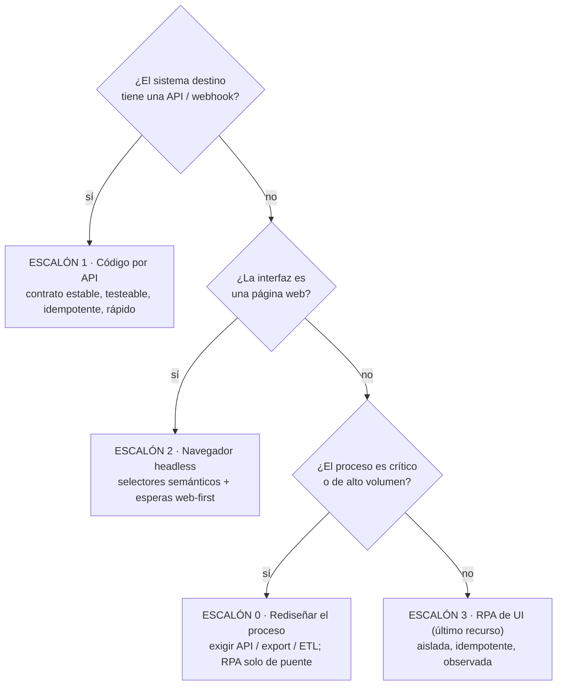
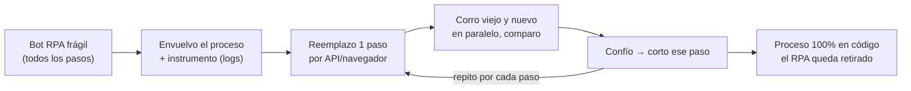
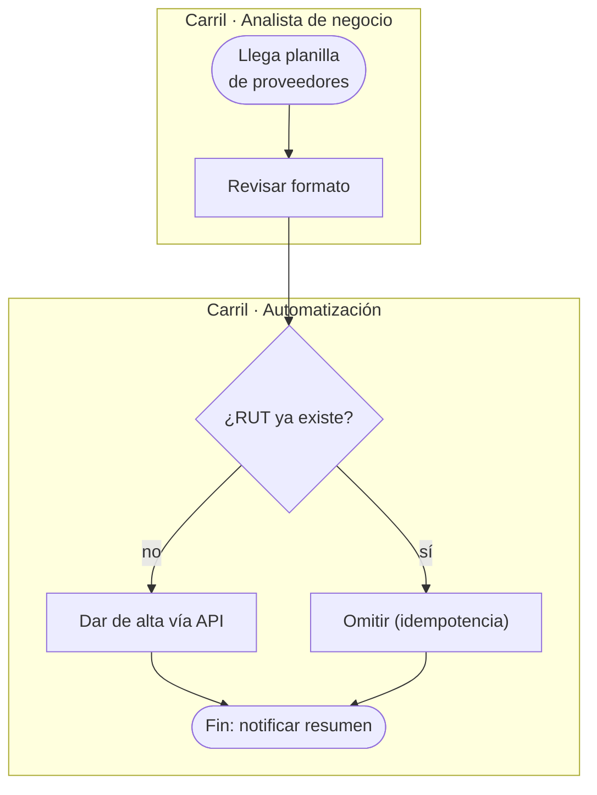

import Nivel from "@components/Nivel.astro";
import Reto from "@components/Reto.astro";
import Solucion from "@components/Solucion.astro";
import Quiz from "@components/Quiz.astro";
import CheckDominio from "@components/CheckDominio.astro";

<Nivel nivel="profundización" />

:::note[Lección opcional / profundización]
Esta sub-unidad **no está en la ruta crítica**. RPA (Robotic Process Automation) es enorme en el
mercado corporativo, así que vale la pena entenderlo —pero el aprendizaje central aquí es de
**criterio**, no de una herramienta nueva. Si vas con el tiempo justo, léela en diagonal, haz el
ejercicio de decisión (`decisor-codigo-vs-rpa`) y sigue. Volverás cuando un trabajo te ponga frente
a un "bot" que se rompe cada semana.
:::

Vienes de [7.1](/fase-7-automatizacion/7-1-n8n-arquitectura/), donde aprendiste el **criterio de
salida** del low-code (cuándo graduar n8n a código), y de
[7.2](/fase-7-automatizacion/7-2-integracion-confiabilidad/) y
[7.3](/fase-7-automatizacion/7-3-durable-execution-temporal/), donde montaste integraciones
confiables y durables. Esta lección agrega una tercera familia de herramientas que vas a encontrar
en empresas grandes: la **RPA**, la automatización que opera la **interfaz de usuario** de otro
programa como si fuera un humano moviendo el mouse. Y, más importante, te da el criterio para
**migrar de RPA a código** cuando esa frágil torre de clics se vuelve insostenible.

## Objetivos de esta lección

Al terminar deberías ser capaz de:

- **O1 — Explicar el trade-off** entre **código**, **low-code** y **RPA** (automatización de UI), y
  **elegir** el enfoque correcto para un caso según la **restricción dominante** (¿existe una API?,
  ¿la UI es web?, ¿cuán crítico y de qué volumen es el proceso?).
- **O2 — Diseñar la migración** de un bot RPA frágil a código mantenible aplicando la **escalera de
  integración** (API → navegador con selectores semánticos → RPA de UI como último recurso) y el
  patrón **Strangler Fig**, con tests y observabilidad.
- **O3 — Leer y producir** un diagrama **BPMN mínimo** como vocabulario para comunicar un proceso a
  personas no técnicas, reconociendo su **bajo retorno técnico** (no sobre-invertir en notación).

## Por qué esto importa (y paga)

El "💰" de la Fase 7 lo enmarca: la automatización es la otra mitad de tu título de **Automation
Engineer**, y combinarla con criterio de ingeniería es lo que te separa del que solo "arma bots".
Tres razones de mercado, sin adornos:

- **RPA es una industria gigante... de deuda técnica.** Herramientas como UiPath, Microsoft Power
  Automate Desktop o Automation Anywhere mueven miles de millones. Muchas empresas tienen decenas de
  "bots" que clickean pantallas de sistemas viejos (SAP, portales bancarios, ERPs sin API). El
  problema: se rompen apenas cambia un botón de lugar. El ingeniero que **sabe cuándo NO usar RPA y
  cómo migrarlo a código** es escaso y caro. El que solo sabe grabar clics es reemplazable.
- **"Migración de procesos legados" aparece literal en las ofertas.** Y debajo de esa frase suele
  haber un RPA frágil que nadie quiere tocar. Saber diagnosticar por qué se rompe y proponer la
  escalera de integración es una conversación de entrevista que pocos juniors pueden sostener.
- **BPMN/UML salen en descripciones de cargo, pero su ROI técnico es bajo.** Te conviene
  **reconocer** un diagrama BPMN y poder dibujar uno simple para alinearte con analistas de negocio
  —no estudiarlo a fondo. Saber exactamente cuánto invertir (poco) también es criterio.

> [!tip] En la práctica
> Un bot que clickea coordenadas de pantalla es como alguien que memorizó *dónde* está
> el botón en vez de *qué* hace. Mueve el botón dos píxeles y se lanza al vacío con total confianza.
> Encantador. Y carísimo de mantener. Prefiere siempre integraciones que entiendan el contrato, no la posición.

:::tip[Si ya migraste un RPA o usaste UiPath/Power Automate/Selenium]
Valida y salta: ¿puedes ordenar de memoria la **escalera de integración** y decir por qué la RPA de
UI es siempre el escalón más bajo? ¿Distingues "automatizar un navegador con selectores semánticos"
(robusto) de "RPA por coordenadas/imágenes" (frágil)? ¿Sabes qué es el patrón **Strangler Fig** y por
qué se migra por pasos y no de golpe? Si las tres salen sin dudar, haz solo el **ejercicio de
decisión** (`decisor-codigo-vs-rpa`) y sigue. Si alguna te hace dudar, la lección te la cierra.
:::

## Lo que ya traes (activación)

Recupera **de memoria**, sin abrir las notas, tres ideas previas:

1. De [7.1 · criterio de salida](/fase-7-automatizacion/7-1-n8n-arquitectura/): el low-code (n8n) se
   gradúa a código cuando la **lógica compleja, la testabilidad o el estado** lo exigen. Hoy vas a
   ver que la RPA de UI es un caso **aún más extremo**: nace ya como deuda, porque opera la interfaz
   en vez del contrato.
2. De [7.2 · integración y confiabilidad](/fase-7-automatizacion/7-2-integracion-confiabilidad/):
   integrar por **API/webhook** te da un **contrato estable** (un formato acordado que no cambia
   porque alguien movió un botón). Guarda esa idea: el escalón más alto de hoy es justamente "¿hay
   API?".
3. De la Fase 3 (diseño de APIs y OWASP web): un endpoint tiene un contrato versionado; y un bot que
   navega URLs arbitrarias puede caer en **SSRF**. Hoy ese hilo de seguridad reaparece: un bot con
   las credenciales de un humano y permiso para clickear cualquier cosa es una superficie de ataque.

La idea-puente de hoy: **una interfaz de usuario es un contrato pésimo.** Cambia seguido, no avisa, y
no fue diseñada para que la consuma un programa. Una API es un contrato bueno: explícito, versionado,
testeable. Toda esta lección es una consecuencia de esa sola frase.

## Primero, el vocabulario (desde cero)

Tres familias de herramientas que se confunden todo el tiempo:

| Familia | Qué es | Cómo "habla" con el otro sistema | Ejemplos |
|---|---|---|---|
| **Código** | Tú escribes un programa que llama a una **API** o una base de datos. | Por el **contrato** (HTTP/JSON, SQL, SDK). | Python + httpx, un servicio FastAPI. |
| **Low-code** | Conectas nodos en una herramienta visual; cada nodo ya sabe hablar con un servicio. | Casi siempre por **API** (los nodos envuelven APIs). | n8n, Make, Zapier, Power Automate (cloud). |
| **RPA** | Un "robot" que **opera la interfaz** de otro programa: mueve el mouse, escribe, lee la pantalla. | Por la **UI** (clics, teclas, lectura de píxeles o del árbol de accesibilidad). | UiPath, Power Automate **Desktop**, Automation Anywhere. |

La diferencia que importa: **código y low-code hablan por el contrato; la RPA habla por la UI.** Por
eso la RPA es el último recurso —se usa cuando el sistema destino **no tiene API ni forma de
integrarse**, típicamente un programa de escritorio viejo o un portal que nadie va a modernizar.

:::caution[Confusión clásica: RPA no es lo mismo que automatizar un navegador]
- **RPA por coordenadas/imágenes** (clickear el píxel (820, 410), buscar una captura del botón en
  pantalla): **frágil**. Cambia la resolución, el tema, el idioma o la posición y se rompe.
- **Automatizar un navegador con selectores semánticos** (Playwright/Selenium: "el botón cuyo nombre
  accesible es *Guardar*"): **mucho más robusto**, porque apunta al *significado* del elemento, no a
  su posición. Sigue siendo más frágil que una API, pero es un escalón intermedio digno.

Cuando la gente dice "RPA es frágil" suele referirse al primer caso. No metas a Playwright en el
mismo saco.
:::

## Worked example 1: un bot RPA frágil (y por qué se va a romper)

Te muestro el razonamiento completo, en voz alta. Caso concreto, contado desde cero: una empresa
recibe cada noche una planilla con proveedores nuevos y debe **darlos de alta uno por uno en un
portal web que no tiene API**. Alguien "grabó" un bot que abre el navegador y clickea por
coordenadas y esperas fijas:

```python
# bot_legado.py  —  NO lo ejecutes; léelo. Es el enfoque que se va a romper.
import time
import pyautogui  # mueve el mouse y teclea a nivel de sistema operativo

def dar_de_alta(proveedor: dict) -> None:
    pyautogui.click(820, 410)          # (1) "botón Nuevo proveedor" (posición fija)
    time.sleep(3)                      # (2) esperar a que cargue el formulario
    pyautogui.typewrite(proveedor["rut"])
    pyautogui.press("tab")
    pyautogui.typewrite(proveedor["nombre"])
    pyautogui.click(960, 720)          # (3) "botón Guardar" (otra posición fija)
    time.sleep(2)
    # ¿se guardó? ¿salió un error? El bot no tiene forma de saberlo.
```

> _Pienso en voz alta:_ se ve "funcional" en la demo. Pero cuento al menos **cinco** formas en que
> esto se rompe en producción, y todas son rutinarias, no exóticas:
>
> 1. **El botón se mueve.** Un rediseño del portal, una pantalla con otra resolución, una barra de
>    notificación que empuja todo 30 píxeles abajo → el click (1) cae en el vacío o en otro botón. El
>    bot **no se entera**: sigue tecleando en quién sabe dónde.
> 2. **El `sleep(3)` es una apuesta.** Si la red va lenta y el formulario tarda 4 segundos, el bot
>    teclea **antes** de que exista el campo. Si va rápido, perdiste 3 segundos por iteración (con
>    10.000 proveedores, eso son horas).
> 3. **No hay detección de error.** Si el RUT ya existía y el portal muestra "proveedor duplicado",
>    el bot clickea "Guardar" igual y sigue como si nada. **Falla silenciosa**: lo peor.
> 4. **No es idempotente.** Si el proceso se cae a la mitad y alguien lo re-lanza desde el inicio,
>    da de alta dos veces a los que ya entraron. (Es el mismo problema de
>    [7.2](/fase-7-automatizacion/7-2-integracion-confiabilidad/): sin idempotencia, reintentar
>    duplica.)
> 5. **Es ciego para operaciones.** No hay logs, ni trazas, ni captura del error. Cuando algo falle
>    (y va a fallar), nadie sabrá en qué proveedor ni por qué.

El patrón de fondo: **el bot apunta a la *posición* de las cosas, no a su *significado*.** Y opera un
contrato (la UI) que cambia sin avisar. Cada una de esas cinco fallas es una consecuencia directa de
eso.

## Worked example 2: la escalera de integración (cómo migrar)

Antes de tocar una línea de migración, la pregunta de oro, en este orden estricto. Es una **escalera**:
sube siempre al escalón más alto posible.



La regla mental: **cada escalón más bajo es más frágil y más caro de mantener.** Solo bajas cuando el
de arriba no existe para ese sistema.

### Escalón 1 — ¿Hay API? Úsala (código)

Si el portal de proveedores tuviera una API, todo el bot anterior colapsa a unas pocas líneas
robustas. Sin mouse, sin pantalla, sin `sleep`:

```python
# alta_por_api.py  —  el escalón más alto: hablar por el contrato.
import httpx

def dar_de_alta(proveedor: dict) -> str:
    # Idempotencia: el RUT es la clave natural; el servidor no duplica.
    resp = httpx.put(
        f"https://portal.example/api/proveedores/{proveedor['rut']}",
        json={"nombre": proveedor["nombre"]},
        headers={"Authorization": "Bearer <token-de-servicio>"},
        timeout=10,
    )
    resp.raise_for_status()        # un error HTTP es VISIBLE, no silencioso
    return resp.json()["id"]
```

> _Pienso en voz alta:_ fíjate cuántos de los cinco problemas del bot frágil desaparecen **gratis**.
> No hay posición que se mueva (1). No hay `sleep` adivinado: `httpx` espera la respuesta real (2). Un
> error sale como excepción HTTP, no en silencio (3). Uso `PUT` con el RUT como clave → idempotente
> (4). Y puedo loggear cada llamada con su status (5). Mismo problema de negocio, una clase de
> fragilidad completa eliminada. Por eso la API es siempre el escalón más alto.

### Escalón 2 — ¿No hay API pero es web? Navegador con selectores semánticos

Muchos portales viejos no tienen API, pero **sí son una web**. Entonces no clickeas coordenadas:
automatizas el navegador apuntando al **significado** de cada elemento (su rol y su nombre
accesible). La herramienta estándar 2026 en Python es **Playwright**. Misma alta, versión robusta:

```python
# alta_por_navegador.py
from playwright.sync_api import sync_playwright, expect

def dar_de_alta(proveedor: dict) -> None:
    with sync_playwright() as p:
        browser = p.chromium.launch(headless=True)
        page = browser.new_page()
        try:
            page.goto("https://portal.example/proveedores")
            # Selectores SEMÁNTICOS: "el botón llamado Nuevo proveedor", no un píxel.
            page.get_by_role("button", name="Nuevo proveedor").click()
            # Esperas WEB-FIRST: Playwright espera solo a que el campo exista. Sin sleep fijo.
            page.get_by_label("RUT").fill(proveedor["rut"])
            page.get_by_label("Nombre").fill(proveedor["nombre"])
            page.get_by_role("button", name="Guardar").click()
            # Verificación EXPLÍCITA del resultado: si no aparece, el test falla (no silencio).
            expect(page.get_by_text("Proveedor guardado")).to_be_visible()
        finally:
            browser.close()
```

> _Pienso en voz alta:_ esto sigue siendo más frágil que una API (dependo de que el texto "Guardar"
> exista), pero es **otra liga** que el bot por coordenadas. `get_by_role("button", name="Guardar")`
> sobrevive a que el botón cambie de lugar, de color o de tamaño: solo se rompe si cambian su
> *nombre*. Y `expect(...).to_be_visible()` convierte "espero y rezo" en "verifico el resultado o
> fallo ruidosamente". Las esperas web-first matan el `sleep` adivinado.

Para que no se degrade con el tiempo, encapsula la página en un **Page Object** (un objeto que esconde
los selectores detrás de métodos con nombre de negocio). Si el portal cambia, tocas **un solo lugar**:

```python
# pagina_proveedores.py  —  Page Object: el negocio arriba, los selectores escondidos.
class PaginaProveedores:
    def __init__(self, page):
        self.page = page

    def crear(self, rut: str, nombre: str) -> None:
        self.page.get_by_role("button", name="Nuevo proveedor").click()
        self.page.get_by_label("RUT").fill(rut)
        self.page.get_by_label("Nombre").fill(nombre)
        self.page.get_by_role("button", name="Guardar").click()
```

### Escalón 3 — ¿Ni API ni web? RPA de UI, como último recurso

Solo cuando el destino es una **app de escritorio legacy** sin API ni versión web (un ERP de los 90,
un terminal propietario) la RPA de UI se justifica. Y aun así, con disciplina de ingeniería:

- **Superficie mínima:** automatiza el menor número de pasos posible; todo lo demás, por API/DB.
- **Idempotencia y reanudación:** registra qué filas ya procesaste para no duplicar tras un crash
  (la idea de [7.2](/fase-7-automatizacion/7-2-integracion-confiabilidad/) y la durabilidad de
  [7.3](/fase-7-automatizacion/7-3-durable-execution-temporal/)).
- **Observabilidad:** logs estructurados + **captura de pantalla al fallar** (tu única traza cuando
  operas una UI). Sin esto, depurar es imposible.
- **Aislamiento y seguridad:** el bot corre con credenciales propias de **mínimo privilegio**, en una
  máquina aislada. Un bot con la sesión de un humano y permiso para clickear cualquier cosa es una
  bomba (recuerda el hilo OWASP de la Fase 3: confused deputy, acciones no validadas).

### El "cómo": migrar por pasos con Strangler Fig

No reescribas el bot entero de un día para otro: es arriesgado y nadie te firma ese cambio. El patrón
**Strangler Fig** (la "higuera estranguladora", de Martin Fowler) migra **paso a paso**: envuelves el
proceso viejo, reemplazas **una pieza** por la versión nueva, corres ambas en paralelo para comparar,
y cuando confías, cortas. La higuera crece alrededor del árbol viejo hasta reemplazarlo, sin talarlo
de golpe.



Aplicado a nuestro caso: primero instrumentas el bot (mides cuánto tarda, dónde falla). Luego
descubres que la **lectura** de la planilla y la **validación de RUT** pueden salir del bot a código
puro hoy mismo. Después negocias una API para el alta (o migras a Playwright el paso web). Cada corte
es pequeño, reversible y medible. Eso es lo que un revisor senior espera ver: no un "big bang
rewrite", sino una migración con red de seguridad.

## BPMN y UML: el mínimo indispensable (y por qué no más)

En empresas con analistas de negocio te vas a topar con **BPMN** (Business Process Model and
Notation): un estándar para dibujar procesos. Para un ingeniero, su valor es **vocabulario
compartido** para alinearse con gente no técnica —no una herramienta de diseño de software. Lo
mínimo que conviene reconocer:

| Símbolo BPMN | Significa | Equivalente mental |
|---|---|---|
| **Pool / Lane** | Quién hace qué (un actor o sistema por carril). | Responsable de cada paso. |
| **Task** (rectángulo) | Una actividad. | Un paso del proceso. |
| **Gateway** (rombo) | Una decisión / bifurcación. | Un `if`. |
| **Event** (círculo) | Inicio, fin, o algo que ocurre (mensaje, temporizador). | Trigger / fin. |

Un proceso BPMN simple se puede aproximar con un diagrama de carriles. Esto basta para una reunión:



:::caution[Misconceptions que cuestan caro]
- **"La RPA es más rápida de implementar, así que conviene."** A corto plazo sí; a mediano es deuda
  cara: se rompe seguido y nadie quiere mantenerla. La velocidad inicial te la cobran con intereses.
- **"Si ya sé clickear la pantalla, da igual que haya API."** No. Si hay API, usarla cuesta menos
  *en total* (menos mantención, menos fallas silenciosas). Bajar de escalón sin necesidad es un
  anti-patrón.
- **"Automatizar un navegador con Playwright es RPA frágil."** No: con selectores semánticos es el
  escalón 2, mucho más robusto que clickear coordenadas. No los metas en el mismo saco.
- **"Hay que dominar BPMN/UML a fondo."** No. Su retorno técnico es bajo: te basta reconocerlos y
  dibujar uno simple para comunicarte. Invertir semanas en notación es tiempo robado a ingeniería.
- **"Migrar todo de golpe es más limpio."** Es la forma más rápida de romper producción sin red. El
  Strangler Fig (paso a paso, en paralelo, reversible) es la migración profesional.
:::

## Práctica con andamiaje (faded)

### Mini-reto A — Predice el escalón

Para cada caso, **predice** (sin mirar la solución) qué escalón de la escalera elegirías y la
**restricción dominante** que lo decide. Escríbelo en una línea por caso, *antes* de abrir la pista.

1. El CRM destino expone una API REST documentada con OpenAPI.
2. Hay que sacar datos de un portal bancario web sin API, una vez al día, no crítico.
3. Un ERP de escritorio de 1998, sin API ni web, proceso de facturación **crítico**, miles de
   registros al día.
4. Un portal web sin API, pero el equipo lo rediseña cada dos semanas.

<Solucion title="Ver pista (no la solución completa)">

Recorre la escalera de arriba hacia abajo en cada caso. Caso 1: ¿qué escalón corona la escalera?
Caso 2: no hay API pero *sí* es web y no es crítico → ¿cuál escalón intermedio? Caso 3: ojo, "ni API
ni web" te empuja al escalón 3... pero "crítico + alto volumen" debería encender una alarma sobre si
la UI-automation es base aceptable. Caso 4: es web (escalón 2), pero la frecuencia de cambio de la UI
te dice algo sobre el **costo de mantención** —¿lo aceptas en silencio o lo nombras? Justifica cada
elección con la restricción que manda, no con la herramienta que prefieres.

</Solucion>

### Mini-reto B — Caza la fragilidad

Mira estas dos líneas. Una es frágil (RPA por posición) y la otra robusta (selector semántico).
**Explica en voz alta** qué cambio del portal rompería cada una:

```python
# Línea A
pyautogui.click(960, 720)
# Línea B
page.get_by_role("button", name="Guardar").click()
```

Piensa: ¿la línea A se rompe si cambia el color del botón? ¿Y si cambia la resolución de pantalla? ¿La
línea B se rompe con un cambio de posición? ¿Con qué cambio sí se rompe la B? (Si puedes nombrar
exactamente el cambio que rompe cada una, entendiste la diferencia entre apuntar a la *posición* y
apuntar al *significado*.)

## Ejercicios Primero-Sin-IA

> Trabaja **a mano primero**, sin IA, dentro del timebox. Cuando termines, pídele a tu IA que
> corrija con el framework de `.ai/` (no que lo resuelva por ti). Las carpetas viven en tu repo;
> ábrelas en tu editor.

<Reto title="Decisor: ¿código, navegador o RPA?" timebox="35 min">

Implementa una función **pura** `recomendar_automatizacion(caso)` que codifique la escalera de
integración. Recibe un `Caso` (con `tiene_api`, `es_web`, `volumen_alto`, `critico`,
`ui_cambia_seguido`) y devuelve una `Recomendacion` con `estrategia` y `motivo`. Los tipos y los
tests ya están dados; tú completas la lógica de decisión.

La gracia es que la **escalera** queda escrita como código testeable: hablar de criterio está bien,
pero codificarlo te obliga a hacerlo preciso. Maneja el caso resbaloso "ni API ni web pero crítico o
de alto volumen": ahí la RPA de UI **no** es base aceptable.

Carpeta del ejercicio: `ejercicios/fase-7/decisor-codigo-vs-rpa/`

**Hecho significa:** `uv run pytest` (o `pytest`) en verde; la función es **pura** (sin I/O, sin
estado global); cubre los cuatro destinos (`api`, `navegador`, `rpa-ui`, `rediseñar-proceso`) con la
restricción dominante correcta; el `motivo` explica *por qué*, no solo *qué*. Agregaste al menos un
test propio (p. ej. que `tiene_api=True` gane sobre cualquier otra combinación de flags).

</Reto>

<Reto title="Plan de migración de un RPA frágil" timebox="45 min">

Te entregamos `bot_legado.py`: el bot por coordenadas del worked example, un poco más completo.
**Sin escribir el código nuevo todavía**, produce un documento `migracion.md` con cuatro secciones:

1. **Diagnóstico:** ≥4 modos de falla del bot, cada uno ligado a su causa (posición vs significado,
   `sleep` adivinado, falla silenciosa, no idempotente, ciego para operaciones).
2. **Escalera por paso:** clasifica **cada paso** del bot en su escalón (API / navegador / RPA-UI /
   rediseñar) y justifica con la restricción dominante.
3. **Plan Strangler Fig:** el orden en que migrarías los pasos (qué cortas primero y por qué), cómo
   corres viejo y nuevo en paralelo, y qué medirías para confiar antes de cada corte.
4. **ADR + BPMN mínimo:** un ADR corto (contexto, decisión, alternativas, trade-off honesto: migrar
   también cuesta) y un diagrama BPMN/carriles mínimo (Mermaid) del proceso objetivo.

Carpeta del ejercicio: `ejercicios/fase-7/escalera-migracion-rpa/`

**Hecho significa:** las 4 secciones presentes; el diagnóstico ancla cada falla a una línea/paso
concreto; la escalera no baja de escalón sin justificarlo; el plan es **incremental y reversible** (no
big-bang); el ADR nombra al menos un trade-off real de migrar; el BPMN comunica el proceso a alguien
no técnico.

</Reto>

## Check de dominio (active recall)

<CheckDominio items={[
  "Explicar, sin notas, la escalera de integración (API > navegador semántico > RPA de UI) y por qué cada escalón más bajo es más frágil",
  "Explicar la diferencia entre RPA por coordenadas/imágenes y automatizar un navegador con selectores semánticos",
  "Decidir, ante un caso, qué enfoque usar nombrando la restricción dominante (¿hay API?, ¿es web?, ¿crítico/volumen?)",
  "Describir el patrón Strangler Fig y por qué se migra por pasos en vez de reescribir de golpe",
  "Decir qué es BPMN y por qué su retorno técnico es bajo (vocabulario, no herramienta de diseño)",
  "Nombrar la única frase de la que se deriva toda la lección: una UI es un contrato pésimo, una API es un buen contrato",
]} />

<Quiz
  question="Un portal web sin API expone los datos que necesitas. El proceso corre una vez al día y no es crítico. ¿Qué escalón de la escalera de integración es el correcto?"
  options={[
    "RPA por coordenadas: clickear los botones en su posición",
    "Navegador headless con selectores semánticos (rol + nombre accesible)",
    "Exigir que rediseñen el portal antes de automatizar nada",
    "Da igual: todos los enfoques son equivalentes para una web",
  ]}
  answer={1}
  explanation="No hay API (descarta el escalón 1), pero es web y el proceso es de bajo riesgo: el escalón 2, navegador headless con selectores semánticos (get_by_role/get_by_label) y esperas web-first, es robusto y proporcionado. La RPA por coordenadas es innecesariamente frágil cuando puedes apuntar al significado del elemento."
/>

<Quiz
  question="¿Por qué `page.get_by_role('button', name='Guardar')` es más robusto que `pyautogui.click(960, 720)`?"
  options={[
    "Porque Playwright es más rápido que pyautogui",
    "Porque apunta al SIGNIFICADO del elemento (su rol y nombre), no a su posición en pantalla",
    "Porque pyautogui no funciona en Linux",
    "Porque get_by_role no necesita que el navegador esté abierto",
  ]}
  answer={1}
  explanation="El selector semántico sobrevive a cambios de posición, color, tamaño o resolución: solo se rompe si cambia el NOMBRE del botón. El click por coordenadas se rompe con cualquier desplazamiento de la UI. Es la diferencia entre apuntar al significado y apuntar al píxel."
/>

## Recursos

Documentación oficial primero:

- [Playwright for Python — Locators](https://playwright.dev/python/docs/locators) — `get_by_role`,
  `get_by_label`, `get_by_text`: la base de los selectores semánticos y por qué se prefieren.
- [Playwright for Python — Auto-waiting](https://playwright.dev/python/docs/actionability) — por qué
  no necesitas `sleep` fijos.
- [Playwright for Python — Page Object Models](https://playwright.dev/python/docs/pom) — encapsular
  selectores detrás de métodos de negocio.
- [Martin Fowler — Strangler Fig Application](https://martinfowler.com/bliki/StranglerFigApplication.html)
  — el patrón de migración incremental, de la fuente original.
- [OMG — BPMN 2.0 (especificación oficial)](https://www.omg.org/spec/BPMN/2.0/) — el estándar; léelo
  como referencia, no de cabo a rabo.
- [Microsoft Learn — Power Automate Desktop (RPA)](https://learn.microsoft.com/power-automate/desktop-flows/introduction)
  y [UiPath Documentation](https://docs.uipath.com/) — para reconocer el ecosistema RPA del mercado.

## Conexión con el capstone de la fase

El [capstone de la Fase 7](/fase-7-automatizacion/proyecto/) exige un sistema agéntico que **ejecute
acciones en sistemas externos**. Esta lección te da el criterio para que esa ejecución no se construya
sobre arena:

- Cuando tu agente deba "actuar" sobre un sistema, aplicas la **escalera**: API primero; navegador
  semántico si no hay API; RPA de UI solo como último recurso aislado.
- Si tu demo integra algún sistema sin API, lo haces con un **navegador headless robusto** (no clics
  por coordenadas), envuelto en un Page Object y con captura de pantalla al fallar para tu
  observabilidad.
- El **ADR** de "por qué elegí esta forma de integrar" es exactamente el artefacto de decisión que el
  Definition of Done de la fase espera, y la conversación que un revisor senior valora.

## Reflexión + spaced repetition

Escribe 3–4 frases respondiendo: **¿en qué caso de tu experiencia (o de un trabajo que te imagines)
habrías alcanzado por la RPA por reflejo, y qué escalón más alto existía que no estabas viendo?**
Nombrar el sesgo "uso la herramienta que ya sé" es lo que te entrena a subir la escalera.

> [!tip] Gancho de spaced repetition
> - **Mañana:** dibuja de memoria, sin mirar, la escalera de integración con sus cuatro escalones y la
>   pregunta que decide cada bajada.
> - **En 3 días:** explica en voz alta (como en entrevista, en inglés si puedes) por qué un selector
>   semántico es más robusto que un click por coordenadas. Si tropiezas, vuelve al worked example 2.
> - **En 1 semana:** toma cualquier automatización que conozcas y clasifícala en la escalera; si está
>   en un escalón bajo, ¿hay uno más alto disponible?
> - **Antes del capstone:** convierte tu decisión de integración en un **ADR** corto. Es el artefacto
>   que separa "lo hice porque sí" de "lo decidí con criterio".
