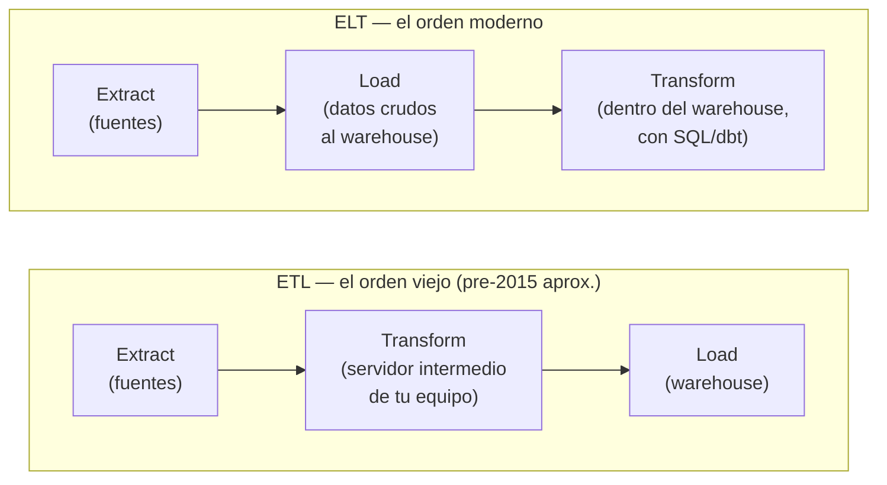
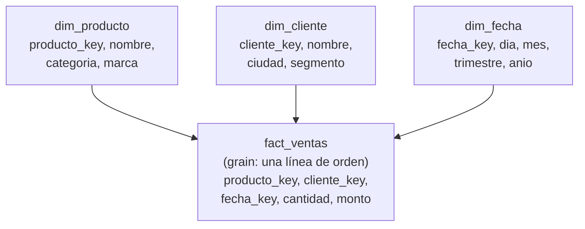

import Nivel from "@components/Nivel.astro";
import Reto from "@components/Reto.astro";
import Solucion from "@components/Solucion.astro";
import Quiz from "@components/Quiz.astro";
import CheckDominio from "@components/CheckDominio.astro";

<Nivel nivel="intermedio" />

Esta es la puerta de entrada al **data engineering**, el sub-track más grande de la Fase 7 y, según
la revisión del currículo, **el gap individual más grande de todo el roadmap**. No asume que hayas
tocado un warehouse antes: empezamos desde la pregunta de fondo —*¿por qué los datos para reportes y
para IA no viven donde vive tu aplicación?*— y construimos hacia arriba. Lo que aprendas aquí es la
base de las tres lecciones siguientes: [dbt](/fase-7-automatizacion/7-5b-dbt/),
[orquestación](/fase-7-automatizacion/7-5c-orquestador/) y
[data contracts + calidad](/fase-7-automatizacion/7-5d-data-contracts-quality/).

## Objetivos de esta lección

Al terminar deberías ser capaz de:

- **O1 — Explicar el trade-off** entre ETL y ELT y por qué la industria migró a ELT, nombrando la
  causa económica concreta (el compute del warehouse se volvió barato y elástico, así que conviene
  **cargar primero y transformar después, dentro del warehouse**).
- **O2 — Diseñar** un **star schema** (una tabla de hechos + sus dimensiones) a partir de un esquema
  transaccional normalizado, **declarando el grain** de la tabla de hechos y justificando la
  desnormalización.
- **O3 — Clasificar** transformaciones en la **arquitectura medallion** (bronze / silver / gold) y
  **explicar** por qué los datos analíticos viven en un sistema separado de los transaccionales
  (OLTP vs OLAP).

## Por qué esto importa (y paga)

El "💰" de la Fase 7 es directo: la automatización y la orquestación de datos son **la otra mitad de
tu título** de Automation/Data Engineer, y combinadas con IA te ponen en un nicho con poca
competencia en LATAM. Dentro de esa mitad, el data engineering es lo que más escasea y lo que más se
malentiende. Tres razones de mercado, sin adornos:

- **Todo equipo con datos necesita esto, y casi nadie lo hace bien.** Los reportes que la gerencia
  mira, los dashboards, y —cada vez más— **el contexto que alimenta tus sistemas de IA** salen de un
  warehouse modelado. Un RAG que responde "¿cuánto vendimos el mes pasado por categoría?" no consulta
  tu base de producción: consulta una **tabla de hechos**. El ingest de RAG **es** data engineering.
- **Es el cuello de botella silencioso de los proyectos de IA.** "Garbage in, garbage out" no es un
  cliché: si tus datos están duplicados, sin versionar y sin un grain claro, ningún modelo te salva.
  Saber modelar para analítica es lo que separa "conecté una API a un LLM" de "construí la base de
  datos sobre la que el negocio decide".
- **Es vocabulario de entrevista que filtra de inmediato.** "¿Diferencia entre ETL y ELT y por qué
  cambió la industria?" "¿Qué es el grain de una tabla de hechos?" "¿Cómo evitas el doble conteo al
  unir un hecho con varias dimensiones?" Si titubeas, te descartan. Si respondes con criterio,
  demuestras que entiendes el *por qué*, no solo la herramienta de moda.

> [!tip] En la práctica
> Hay una regla de oro al trabajar con datos a escala: nunca corras tus analíticas pesadas sobre la
> misma base de datos que atiende las operaciones en tiempo real.
> Una cosa es operar; otra es analizar. Mezclarlas es cómo se te cae el sistema entero
> mientras alguien lanza un `GROUP BY`. Tú llámalo "separar OLTP de OLAP". También se llama sentido común.

:::tip[Si ya tocaste Fabric, Spark, BigQuery o un warehouse]
Valida y salta: ¿sabes explicar **por qué** ELT le ganó a ETL en términos de **costo de compute**, no
solo "porque sí"? ¿Puedes declarar el **grain** de una tabla de hechos en una frase y defender por
qué un star schema se **desnormaliza** a propósito (contra todo lo que aprendiste de normalización en
[F3](/fase-3-backend/3-1-sql-modelado-relacional/))? ¿Sabes por qué la capa **silver** y la **gold**
no son lo mismo? Si las tres salen sin dudar, haz solo el **Reto 2** (modelado) y sigue a
[7.5b](/fase-7-automatizacion/7-5b-dbt/). Si alguna te hace dudar, esta lección te la cierra.
:::

## Lo que ya traes (activación)

Recupera **de memoria**, sin abrir las notas, tres ideas previas. El tirón mental es parte del
aprendizaje:

1. De [3.1 · SQL y modelado relacional](/fase-3-backend/3-1-sql-modelado-relacional/): la
   **normalización** (3NF) busca eliminar redundancia para que un dato viva en **un solo lugar** y no
   haya anomalías al actualizar. ¿Por qué era eso bueno para una app que **escribe** mucho? Guarda esa
   idea: hoy vas a aprender que para **leer y analizar** mucho, a veces conviene lo **contrario**.
2. De [3.3 · PostgreSQL a fondo](/fase-3-backend/3-3-postgresql-a-fondo/): una base transaccional
   (OLTP) está optimizada para muchas escrituras pequeñas y concurrentes —crear una orden, cobrar,
   actualizar stock— con transacciones ACID. ¿Recuerdas el problema N+1 y los índices? Esa base
   **odia** que le corras un `SELECT` que escanea 50 millones de filas para un reporte.
3. De [7.2 · Integración y confiabilidad](/fase-7-automatizacion/7-2-integracion-confiabilidad/) y
   [7.3 · durable execution](/fase-7-automatizacion/7-3-durable-execution-temporal/): ya sabes mover
   datos entre sistemas de forma confiable (idempotencia, reintentos, DLQ). Eso es **transporte**. Hoy
   aprendes qué hacer con los datos **una vez que llegaron**: cómo modelarlos para que el negocio y la
   IA los usen.

La idea-puente de hoy: **la base de datos de tu aplicación (OLTP) y la base de datos para analizar
(OLAP/warehouse) son dos sistemas distintos, con diseños opuestos, conectados por un pipeline.** El
pipeline carga los datos crudos; el modelado los transforma en algo que responde preguntas de negocio
rápido. ELT es *cómo* los mueves y transformas; el star schema y la medallion son *cómo* los
organizas al llegar.

## OLTP vs OLAP: dos mundos, diseños opuestos

Antes de modelar nada, fija esta distinción —es el cimiento de toda la lección y una pregunta de
entrevista clásica:

| | **OLTP** (transaccional) | **OLAP** (analítico) |
|---|---|---|
| Para qué | Operar la app: crear, leer, actualizar registros | Analizar: agregar, comparar, reportar |
| Patrón de acceso | Muchas escrituras pequeñas; lecturas por clave | Pocas escrituras; lecturas que escanean millones de filas |
| Pregunta típica | "Dame la orden 8842" | "Ingresos por categoría por mes, últimos 2 años" |
| Diseño de tablas | **Normalizado** (3NF), sin redundancia | **Desnormalizado** (star schema), redundancia a propósito |
| Ejemplo | PostgreSQL, MySQL de tu API | Snowflake, BigQuery, Databricks, DuckDB |
| Lo que NO quieres | Reportes pesados que bloqueen la operación | Hacer `UPDATE` fila por fila como si fuera una app |

> _Pienso en voz alta:_ la tentación del principiante es "tengo PostgreSQL, le corro mis reportes
> ahí mismo y listo". Funciona con 1.000 órdenes. A los 50 millones, ese `GROUP BY` con tres `JOIN`
> tarda minutos, bloquea recursos y degrada a los clientes reales que están intentando comprar. Por
> eso existe un sistema separado: copias los datos a un **warehouse** optimizado para escanear, y ahí
> analizas sin tocar producción. La pregunta "¿por qué no analizo sobre mi base de la app?" tiene una
> respuesta de una línea: **porque los dos diseños son opuestos y se estorban**.

## ETL vs ELT: por qué la industria cambió de orden

ETL y ELT son las **tres mismas operaciones** —Extract (sacar de la fuente), Load (cargar al
destino), Transform (limpiar y reformar)— en **distinto orden**. El cambio de orden no es cosmético:
refleja un cambio económico en la industria.



**ETL (Extract → Transform → Load):** nació cuando el almacenamiento y el cómputo eran **caros**.
Como el warehouse cobraba carísimo por cada GB y cada CPU, no podías darte el lujo de cargar datos
crudos "por si acaso": transformabas **antes**, en un servidor intermedio que tu equipo administraba,
y solo cargabas el resultado final, ya limpio y agregado. Costoso de operar, rígido (si querías una
métrica nueva, re-procesabas todo el pipeline), y la transformación vivía en código difícil de
auditar.

**ELT (Extract → Load → Transform):** la nube cambió la ecuación. El **storage se volvió casi
gratis** y el **compute del warehouse se volvió elástico y barato** (pagas por segundo de query, y
escala solo). Eso da vuelta el incentivo: **carga primero los datos crudos tal cual**, y transforma
**después, dentro del warehouse**, con SQL. Beneficios concretos:

- **Guardas el crudo.** Si mañana necesitas una métrica nueva, ya tienes los datos originales: solo
  escribes una transformación nueva. No re-extraes nada.
- **Transformas con SQL versionado en Git** (esto es exactamente lo que hace [dbt](/fase-7-automatizacion/7-5b-dbt/),
  la próxima lección): legible, testeable, auditable.
- **Separas el transporte de la lógica.** Herramientas de EL (Fivetran, Airbyte) solo mueven bytes;
  la transformación es tu SQL. Cada parte hace una cosa.

:::note[El hilo de costo/latencia, aquí también]
"Compute barato" no significa "gratis". ELT mueve el costo al warehouse: una transformación mal
escrita que escanea toda la tabla cada hora **te llega en la factura**. El criterio de ingeniería
sigue siendo el mismo de siempre —no proceses lo que no cambió, materializa lo que se consulta
seguido, particiona por fecha. Lo verás como decisión real en [7.5b](/fase-7-automatizacion/7-5b-dbt/)
y [7.5c](/fase-7-automatizacion/7-5c-orquestador/).
:::

## Worked example: de un esquema transaccional a un star schema

Te muestro el razonamiento completo, en voz alta, antes de pedirte que lo hagas tú. Caso: una tienda
online. En producción (OLTP), el esquema está **normalizado** (3NF), como aprendiste en F3:

```sql
-- OLTP normalizado: cada dato vive en un solo lugar, optimizado para ESCRIBIR.
clientes(cliente_id PK, nombre, email, ciudad, fecha_registro)
categorias(categoria_id PK, nombre)
productos(producto_id PK, nombre, categoria_id FK, precio)
ordenes(orden_id PK, cliente_id FK, fecha, estado, costo_envio)
orden_lineas(linea_id PK, orden_id FK, producto_id FK, cantidad, precio_unitario)
```

Quiero responder, rápido y sobre millones de filas: *ingresos por categoría, por ciudad del cliente,
por mes*. Si lo hago sobre el OLTP, necesito unir 5 tablas en cada query analítica. Lento y frágil.
La solución es modelar un **star schema**: una tabla de **hechos** en el centro, rodeada de
**dimensiones**.

> _Pienso en voz alta, paso a paso:_
>
> **Paso 1 — ¿Qué evento de negocio estoy midiendo?** Una **venta**. ¿A qué nivel de detalle? Cada
> fila de `orden_lineas` es "este producto, en esta cantidad, en esta orden". Ese es mi nivel de
> detalle. Esa decisión tiene nombre y es la **más importante de todo el diseño**: el **grain**.
>
> **Paso 2 — Declaro el grain en una frase:** *"una fila de `fact_ventas` = una línea de producto de
> una orden"*. Todo lo demás se deriva de esto. El grain es un contrato: si lo violo (mezclo filas a
> nivel de orden con filas a nivel de línea), todo lo que calcule encima estará mal.
>
> **Paso 3 — La tabla de hechos guarda *medidas* (números que se suman) + *claves* a las
> dimensiones.** Las medidas aquí: `cantidad` y `monto = cantidad * precio_unitario`. Las claves:
> hacia qué producto, qué cliente, qué fecha apunta cada línea.
>
> **Paso 4 — Las dimensiones guardan el *contexto* (los "por qué/quién/cuándo/qué" del análisis).**
> `dim_producto` (incluye la categoría —¡desnormalizada adentro!), `dim_cliente` (incluye la ciudad),
> `dim_fecha` (día, mes, trimestre, año). Por esas columnas voy a **filtrar y agrupar**.
>
> **Paso 5 — Desnormalizo a propósito.** En el OLTP, la categoría vive en su propia tabla
> `categorias` (para no repetirla). En `dim_producto` la **copio dentro**, repitiéndola en cada fila.
> ¿No es eso lo que F3 me dijo que NO hiciera? Sí —y es correcto **aquí**: en analítica, un `JOIN`
> menos por query, sobre millones de filas, vale más que el espacio ahorrado. La dimensión se escribe
> pocas veces y se lee muchísimo. **El objetivo cambió: de evitar anomalías de escritura a minimizar
> joins de lectura.**

El resultado, un star schema (se llama "estrella" porque la tabla de hechos en el centro irradia
hacia las dimensiones):



Ahora *"ingresos por categoría por mes"* es una sola query directa: `fact_ventas` unida a
`dim_producto` y `dim_fecha`, `SUM(monto)`, `GROUP BY categoria, mes`. Una estrella, dos joins, rápida
sobre millones de filas.

```sql
-- Sobre el star schema: legible y rápida.
SELECT p.categoria, f_fecha.mes, SUM(v.monto) AS ingresos
FROM fact_ventas v
JOIN dim_producto p   ON p.producto_key = v.producto_key
JOIN dim_fecha f_fecha ON f_fecha.fecha_key = v.fecha_key
GROUP BY p.categoria, f_fecha.mes;
```

## La arquitectura medallion: bronze → silver → gold

El star schema es el **destino** (la capa de consumo). ¿Cómo llegan los datos crudos hasta ahí sin
que el pipeline sea una caja negra? La respuesta estándar de la industria es la **arquitectura
medallion**: organizar las transformaciones en tres capas de **calidad creciente**, cada una una
tabla (o conjunto de tablas) que se construye sobre la anterior.

```mermaid
flowchart LR
    SRC["Fuentes<br/>(API, archivos, OLTP)"] -->|Extract + Load| B
    B["🥉 BRONZE<br/>crudo, tal cual llegó<br/>(append, sin tocar)"] -->|limpiar, tipar,<br/>deduplicar| S
    S["🥈 SILVER<br/>limpio, validado,<br/>integrado"] -->|agregar, modelar<br/>(star schema)| G
    G["🥇 GOLD<br/>listo para negocio/IA<br/>(hechos + dimensiones)"] --> BI["Dashboards, reportes,<br/>contexto para RAG"]
```

- **🥉 Bronze (crudo):** los datos **tal cual llegaron** de la fuente, sin limpiar. Se cargan en modo
  *append* (se agregan, no se sobre-escriben). ¿Por qué guardar la basura? Porque es tu **fuente de
  verdad reproducible**: si una transformación tenía un bug, re-corres desde bronze sin volver a
  extraer de la fuente (que quizá ya cambió). Es el "guarda el crudo" del ELT, hecho capa.
- **🥈 Silver (limpio y validado):** aquí limpias —tipos correctos, fechas parseadas,
  **deduplicación**, nulos manejados— e **integras** fuentes (juntas clientes de la web con clientes
  del punto de venta). Es la capa "una sola versión confiable del dato". Todavía es bastante detallada
  (cercana al grain de origen), pero ya es **confiable**.
- **🥇 Gold (listo para consumo):** aquí vive tu **star schema** y las tablas agregadas que el negocio
  y la IA consultan directo. `fact_ventas`, `dim_producto`, y tablas resumen como "ingresos diarios
  por categoría". Optimizada para responder preguntas, no para guardar detalle.

La idea de fondo: **la calidad del dato sube capa a capa, y cada capa tiene un dueño y un contrato
claros.** Cuando un número sale mal en un dashboard, sabes dónde mirar: ¿el crudo ya venía mal
(bronze)? ¿se rompió al limpiar (silver)? ¿está mal la agregación (gold)? Eso es **observabilidad de
datos** de regalo, y conecta directo con los [data contracts de 7.5d](/fase-7-automatizacion/7-5d-data-contracts-quality/).

:::caution[Misconceptions que cuestan caro]
- **"ELT es siempre mejor que ETL."** Falso como dogma. ELT ganó **porque el compute del warehouse se
  abarató**; si tienes una restricción de privacidad que te obliga a anonimizar **antes** de cargar
  (datos médicos, PII regulada), o un volumen que no justifica un warehouse, ETL sigue siendo válido.
  Lo correcto: ELT es el **default moderno**, no una ley.
- **"El star schema es solo el OLTP con otros nombres."** No. La diferencia es deliberada: el OLTP
  está **normalizado** (evita redundancia para escribir seguro); el star schema está
  **desnormalizado** (acepta redundancia para leer rápido). Confundirlos es no haber entendido el
  *por qué* de ninguno de los dos.
- **"Sin declarar el grain igual funciona."** Es el error #1 de modelado analítico. Si no sabes en una
  frase qué representa **una fila** de tu tabla de hechos, tarde o temprano mezclas niveles de detalle
  y produces **doble conteo** (lo practicas en el Reto 2). El grain primero, siempre.
- **"Bronze, silver y gold son tres bases de datos distintas."** No: son tres **capas de tablas**
  (a menudo en el mismo warehouse, en esquemas distintos). Lo que cambia entre ellas es la **calidad y
  el propósito**, no necesariamente el motor.
- **"Más normalizado siempre es mejor (lo aprendí en F3)."** Depende del objetivo. Para **escribir**
  (OLTP), sí. Para **leer y agregar** (OLAP), la desnormalización del star schema gana. El mismo
  principio aplicado al objetivo equivocado se vuelve un anti-patrón.
:::

## Práctica con andamiaje (faded)

### Mini-reto A — Predice: ¿ETL o ELT?

Para cada escenario, **predice** (sin buscar) si conviene ETL o ELT y **por qué en una frase**. Luego
contrasta con la sección de arriba.

1. Startup con un warehouse en la nube (BigQuery), quiere iterar rápido en métricas nuevas cada
   semana.
2. Hospital que, por regulación, debe **anonimizar** datos de pacientes **antes** de que salgan de la
   red interna.
3. Equipo que ya carga datos crudos y escribe sus transformaciones como SQL versionado en Git.

<Solucion title="Ver pista (no la respuesta completa)">

Pregúntate en cada caso: *¿dónde y cuándo conviene transformar?* (1) Iterar rápido + warehouse barato
apunta a cargar crudo y transformar después. (2) "Antes de que salgan de la red" te fuerza a
transformar **antes** de cargar —fíjate qué letra va primero. (3) "SQL versionado sobre datos ya
cargados" describe la T al final. La justificación importa más que la sigla: nombra la **causa**
(costo de compute, restricción de privacidad, auditabilidad).

</Solucion>

### Mini-reto B — Parsons: ordena el flujo medallion

Estas etapas de un pipeline están **desordenadas**. Reordénalas (en papel) en el flujo medallion
correcto, y di **en qué capa** cae cada una (bronze / silver / gold):

```text
A) Construir fact_ventas + dim_producto (star schema) para el dashboard
B) Cargar el JSON crudo de la API de órdenes, tal cual, en modo append
C) Deduplicar órdenes repetidas y parsear las fechas a tipo date
D) Extraer las órdenes desde la API de la tienda
E) Agregar "ingresos diarios por categoría" como tabla resumen
```

Pista: una etapa es **previa** a la primera capa (no es bronze todavía: es el transporte). Dos caen en
gold. El orden de calidad es crudo → limpio → consumo. (El orden y la clasificación correctos los
valida el corrector; lo importante es que **justifiques** por qué C va antes que A.)

## Ejercicios Primero-Sin-IA

> Trabaja **a mano primero**, sin IA, dentro del timebox. Cuando termines, pídele a tu IA que corrija
> con el framework de `.ai/` (no que lo resuelva por ti). Las carpetas viven en tu repo; ábrelas en tu
> editor.

<Reto title="Diseñar un star schema + clasificar en capas medallion" timebox="40 min">

Te entregamos un esquema transaccional (OLTP) normalizado de una **plataforma de cursos online** y
una lista de transformaciones. **Sin escribir código todavía**, produce un documento de diseño
(`diseno.md`) con tres secciones:

1. **Star schema:** diseña la tabla de hechos `fact_inscripciones` y sus dimensiones. **Declara el
   grain en una sola frase.** Para la tabla de hechos lista sus *medidas* (números que se suman) y sus
   *claves* a dimensiones; para cada dimensión, sus atributos (incluyendo los que **desnormalizas**
   desde otras tablas) y explica **por qué** los desnormalizas.
2. **Medallion:** clasifica cada transformación de la lista dada en **bronze / silver / gold** y
   justifica cada una en media línea.
3. **ELT vs ETL:** decide el enfoque para este caso y **justifica con la causa** (costo de compute,
   privacidad, auditabilidad), no con la sigla.

Carpeta del ejercicio: `ejercicios/fase-7/star-schema-medallion-diseno/`

**Hecho significa:** las tres secciones presentes; el **grain** declarado en una frase inequívoca; la
tabla de hechos separa medidas de claves; al menos una desnormalización explícita y justificada; cada
transformación clasificada en una capa con razón; la decisión ELT/ETL justificada por su **causa**, no
por moda.

</Reto>

<Reto title="Construir la capa gold sin doble conteo" timebox="40 min">

Implementa, en Python puro (sin pandas, sin IA), las transformaciones de la **capa gold** sobre un
star schema ya en silver. El corazón del ejercicio es el bug #1 del modelado analítico: el **fan-out /
doble conteo** cuando unes una tabla de hechos a nivel de *línea* con un dato que vive a nivel de
*orden* (como el costo de envío).

Completa dos funciones en `transformaciones.py`:

- `ingresos_por_categoria(lineas, productos)` — agregación limpia a nivel de línea, uniendo el hecho a
  la dimensión producto.
- `valor_total_por_cliente(lineas, ordenes)` — la trampa: el envío vive **una vez por orden**, no por
  línea. Si lo sumas tras unir líneas con órdenes, lo **inflas** por la cantidad de líneas.

Carpeta del ejercicio: `ejercicios/fase-7/capa-gold-sin-doble-conteo/`

**Hecho significa:** `uv run pytest` (o `pytest`) en verde —incluido el test que detecta el doble
conteo del envío en una orden con varias líneas. Tu solución agrega cada grain por separado antes de
combinarlos. Agregaste al menos un test propio (sugerencia: un cliente con dos órdenes, o una
categoría sin ventas).

</Reto>

## Check de dominio (active recall)

<CheckDominio items={[
  "Explicar, sin notas, la diferencia entre OLTP y OLAP y por qué no se analiza sobre la base de datos de la aplicación",
  "Explicar el trade-off ETL vs ELT nombrando la causa económica concreta (compute barato y elástico en el warehouse)",
  "Declarar en una sola frase qué es el grain de una tabla de hechos y por qué es la decisión más importante del modelado",
  "Justificar por qué un star schema se desnormaliza a propósito, en contra del principio de normalización de F3",
  "Describir las tres capas de la arquitectura medallion (bronze/silver/gold) y qué calidad/propósito tiene cada una",
  "Explicar por qué el doble conteo aparece al unir un hecho a nivel de línea con un dato a nivel de orden",
]} />

<Quiz
  question="¿Cuál es la razón PRINCIPAL por la que la industria migró de ETL a ELT?"
  options={[
    "ELT usa menos almacenamiento que ETL",
    "El compute del warehouse se volvió barato y elástico, así que conviene cargar crudo y transformar después dentro del warehouse",
    "SQL es más fácil que Python y la T en ELT siempre se hace en SQL",
    "ETL no permite usar la nube y ELT sí",
  ]}
  answer={1}
  explanation="El cambio de orden refleja un cambio económico: con storage casi gratis y compute elástico/barato en el warehouse, conviene cargar los datos crudos primero (los guardas para métricas futuras) y transformar después, dentro del warehouse, con SQL versionado. No es por almacenamiento (ELT suele guardar MÁS, el crudo incluido), ni porque ETL prohíba la nube."
/>

<Quiz
  question="Una tabla fact_ventas tiene grain 'una línea de producto de una orden'. Cada orden tiene un costo_envio único (a nivel de orden). Unes fact_ventas con la tabla de órdenes y haces SUM(costo_envio) por cliente. ¿Qué pasa?"
  options={[
    "Da el envío correcto por cliente",
    "Infla el envío: lo cuenta una vez por CADA línea de la orden, no una vez por orden (fan-out)",
    "Da cero porque el envío no está en la tabla de hechos",
    "Da error de SQL por mezclar grains",
  ]}
  answer={1}
  explanation="Es el fan-out / doble conteo clásico. El envío vive a grain de ORDEN; al unirlo con un hecho a grain de LÍNEA, una orden con 3 líneas produce 3 filas, y SUM(costo_envio) cuenta el envío 3 veces. La solución: agregar el envío a su propio grain (orden, una vez) y luego combinar con la agregación de líneas. SQL no da error: te entrega un número que parece válido pero está inflado — el peor tipo de bug."
/>

## Recursos

Documentación oficial primero:

- [Databricks — What is the medallion lakehouse architecture?](https://docs.databricks.com/aws/en/lakehouse/medallion)
  — la fuente canónica de bronze/silver/gold.
- [Databricks — Data warehousing concepts (OLTP vs OLAP, star schema)](https://docs.databricks.com/gcp/en/sql/get-started/data-warehousing-concepts)
  — el modelo mental sin atarse a un motor.
- [Kimball Group — Dimensional Modeling Techniques](https://www.kimballgroup.com/data-warehouse-business-intelligence-resources/kimball-techniques/dimensional-modeling-techniques/)
  — el origen del star schema (hechos, dimensiones, grain). El "por qué" de toda esta lección.
- [dbt — Add sources to your DAG](https://docs.getdbt.com/docs/build/sources) — cómo se declara la
  capa de origen en la herramienta que verás en [7.5b](/fase-7-automatizacion/7-5b-dbt/).
- [Fivetran — ETL vs ELT](https://www.fivetran.com/blog/etl-vs-elt) — comparación práctica desde una
  herramienta de EL real.
- [DuckDB — Documentation](https://duckdb.org/docs/) — un warehouse analítico que corre en tu laptop,
  ideal para practicar SQL OLAP sin montar infraestructura.

## Conexión con el capstone de la fase

El [capstone de la Fase 7](/fase-7-automatizacion/proyecto/) es un sistema agéntico end-to-end, y su
agente necesita **contexto de datos confiable** para decidir bien. Esta lección es el cimiento de ese
contexto:

- El **star schema** y la separación OLTP/OLAP que diseñaste aquí son cómo organizas los datos que tu
  agente consultará (o que un RAG le servirá): "¿cuánto debe este cliente?", "¿cuál es el histórico de
  esta categoría?" salen de una **tabla de hechos**, no de la base de producción.
- La **arquitectura medallion** es el esqueleto del pipeline que alimenta todo: bronze (lo que llega
  del input), silver (limpio y validado contra el [data contract de 7.5d](/fase-7-automatizacion/7-5d-data-contracts-quality/)),
  gold (lo que el agente y los dashboards consumen).
- El criterio **ELT vs ETL** y el **grain** son decisiones que registrarás como **ADR** en tu
  capstone: por qué cargas crudo primero, cuál es el grain de tu hecho. Es exactamente el artefacto que
  un revisor senior espera ver.
- En [7.5b](/fase-7-automatizacion/7-5b-dbt/) materializarás este modelo con dbt; en
  [7.5c](/fase-7-automatizacion/7-5c-orquestador/) lo orquestarás; en
  [7.5d](/fase-7-automatizacion/7-5d-data-contracts-quality/) le pondrás contratos y calidad.

## Reflexión + spaced repetition

Escribe 3–4 frases respondiendo: **¿cuál idea chocó más con lo que aprendiste en F3 —que a veces
conviene desnormalizar a propósito, o que no analizas sobre tu base de producción— y por qué tu
intuición previa (la del OLTP normalizado) te empujaba a lo contrario?** Nombrar el choque entre tu
modelo viejo y el nuevo es lo que fija el aprendizaje.

> [!tip] Gancho de spaced repetition
> - **Mañana:** dibuja de memoria, sin mirar, un star schema con su tabla de hechos y tres
>   dimensiones, y escribe el **grain** en una frase. Si no te sale el grain, no lo aprendiste todavía.
> - **En 3 días:** explica en voz alta (como en una entrevista, en inglés si puedes) "why the industry
>   moved from ETL to ELT" en menos de 30 segundos, nombrando la causa económica. Si tropiezas, vuelve
>   a la sección de ETL vs ELT.
> - **En 1 semana:** clasifica 5 transformaciones de un pipeline real (el tuyo o uno de ejemplo) en
>   bronze/silver/gold, sin notas. Si dudas entre silver y gold, repasa el criterio de "calidad vs
>   listo-para-consumo".
> - **Antes del capstone:** convierte tu decisión "ELT vs ETL + grain de tu hecho" en un **ADR** corto
>   (contexto, decisión, consecuencias). Es el artefacto que separa al que diseña del que improvisa.
