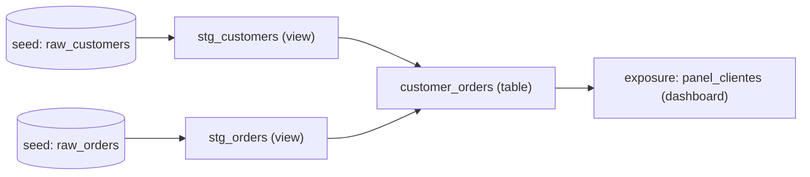

import Reto from "@components/Reto.astro";
import Solucion from "@components/Solucion.astro";
import Quiz from "@components/Quiz.astro";
import CheckDominio from "@components/CheckDominio.astro";
import Nivel from "@components/Nivel.astro";

<Nivel nivel="intermedio" />

En la lección anterior aprendiste *qué* es ELT y por qué el warehouse moderno carga primero y transforma después ([7.5a](/fase-7-automatizacion/7-5a-elt-modelado-analitico/)). Esta lección es el **cómo**: la herramienta con la que hoy se escribe esa "T" (Transform) en casi cualquier equipo de datos serio. Se llama **dbt** (data build tool), y la idea de fondo es desconcertantemente simple y profundamente poderosa: **transformar datos no debería ser distinto de escribir software**. Mismo Git, mismos tests, mismo CI, mismas revisiones de código, misma documentación versionada. dbt es lo que hizo que eso fuera posible para gente que escribe SQL, no Scala.

No vas a "ver dbt por encima". Vas a construir un mini-warehouse, escribir modelos que dependen unos de otros, dejar que dbt arme el grafo de dependencias por ti, ponerle tests a tus datos, y generar la documentación con su diagrama de linaje. Al final tendrás un proyecto dbt que corre de verdad en tu máquina, sin pagar un solo dólar de cloud.

:::tip[Si ya tocaste dbt (o PySpark/Fabric/SQL de transformación)]
Quizás ya escribiste SQL de transformación —vistas encadenadas, notebooks de PySpark, un pipeline en Fabric— y la intuición de "tabla cruda → tabla limpia → tabla de negocio" ya la traes. Bien: esa parte está. La trampa del que "ya transforma datos" es haberlo hecho **sin las prácticas de software**: SQL pegado en un scheduler sin tests, sin Git, sin saber qué consume qué cuando algo cambia. La pregunta que separa al que "sabe SQL" del que "hace data engineering de verdad" es: *cuando borras una columna de una tabla, ¿sabes en menos de un minuto qué dashboards se rompen?* Si la respuesta es "abro cada query a ver", esta lección es para ti igual que para quien parte de cero. Salta al ejercicio (sección 7): construye el mini-warehouse, escribe los tests y genera el linaje. Si puedes defender **por qué `ref()` no es un `JOIN` más sofisticado sino lo que construye el DAG**, valida con el check de dominio (sección 8) y avanza.
:::

## 1. Qué vas a saber hacer

Al terminar, sin IA y sin notas, podrás:

- **O1 — Construir un proyecto dbt en capas**: escribir modelos SQL que se referencian con `ref()`, dejar que dbt derive el **DAG de dependencias** y lo ejecute en el orden correcto, y explicar **por qué `ref()` —y no un nombre de tabla escrito a mano— es lo que hace todo esto posible** (versionado, orden automático, linaje).
- **O2 — Poner tests a los datos como pones tests al código**: declarar tests genéricos (`unique`, `not_null`, `relationships`, `accepted_values`) en YAML, correr `dbt build`, y explicar el modelo mental ("un test es una query que cuenta filas que no deberían existir; cero filas = verde").
- **O3 — Documentar el contrato y el linaje**: declarar `sources` (de dónde vienen los datos crudos), `exposures` (qué consume tus tablas aguas abajo) y `snapshots` (cómo capturar cambios históricos), generar la documentación con su grafo de linaje, y argumentar **qué problema de organización resuelve cada uno**.

## 2. Por qué importa (el dinero está aquí)

> 💰 **Por qué importa:** el **Data Engineering es el gap individual más grande** del perfil que estás construyendo, y dentro de él dbt es la pieza más examinada. En 2026, "dbt" aparece en la descripción de prácticamente toda vacante de Analytics Engineer y Data Engineer, y en muchas de AI Engineer (porque el *ingest* de un RAG **es** data engineering: datos versionados, testeados, con linaje). Pero acá está la grieta de mercado: una enorme cantidad de gente pone "dbt" en el CV y solo sabe correr `dbt run` sobre modelos que alguien más escribió. El semi-senior que cobra el premium entiende **el DAG**, escribe **tests que atrapan datos malos antes que el negocio los vea**, y puede mostrar el **linaje** de una métrica de punta a punta. Decir "transformo datos con SQL" te pone en la fila; decir "modelo en capas con dbt, testeo invariantes de negocio en CI y mi linaje documenta qué dashboard depende de qué fuente" te saca de la fila.

Tres razones lo vuelven una bisagra de carrera:

1. **dbt trajo ingeniería de software a los datos, y eso cambió el oficio.** Antes, la transformación de datos era SQL suelto pegado en un scheduler: sin tests, sin control de versiones, sin forma de saber qué dependía de qué. Cuando algo se rompía, te enterabas porque un ejecutivo veía un número absurdo en un dashboard. dbt tomó las prácticas que ya usabas para código —Git, tests automáticos, CI, code review, modularidad, documentación— y las hizo naturales para SQL. Esa es **toda** la tesis de la herramienta, y entenderla vale más que memorizar su sintaxis.
2. **El linaje es la diferencia entre cambiar con miedo y cambiar con confianza.** En un warehouse real hay cientos de tablas encadenadas. Sin un grafo de dependencias, modificar una tabla de bajo nivel es ruleta rusa: no sabes qué se rompe arriba. dbt construye ese grafo **automáticamente** a partir de tus `ref()`, y te deja preguntarle "¿qué depende de esto?" antes de tocar nada. Esa capacidad —impact analysis— es exactamente lo que un entrevistador quiere oírte explicar.
3. **Los tests de datos atrapan el problema donde es barato.** Un `customer_id` duplicado o un `status` con un valor inesperado puede inflar una métrica de ingresos sin que nadie lo note por semanas. dbt te deja afirmar "esta columna es única y nunca nula" en una línea de YAML, y lo verifica en cada corrida. Es el mismo instinto del TDD que practicaste en Fase 2, aplicado a la *forma* de los datos en vez de a la *lógica* del código.

## 3. Lo que ya traes (actívalo)

Esta lección ensambla hilos que ya tienes. Recupéralos antes de seguir:

- **De ELT y modelado analítico ([7.5a](/fase-7-automatizacion/7-5a-elt-modelado-analitico/)):** la arquitectura medallion (bronze → silver → gold) y el star schema. dbt es la herramienta con la que materializas exactamente esas capas: staging (limpieza) → intermediate → marts (negocio). El concepto ya lo viste; ahora le pones manos.
- **De TDD (Fase 2):** "no confíes, verifica". Un test de dbt es la versión de datos del test unitario: una aserción que falla ruidosamente cuando una suposición deja de cumplirse. Si interiorizaste red-green-refactor, los tests de dbt te van a resultar familiares en el espíritu.
- **De SQL y modelado relacional (Fase 3):** `JOIN`, claves primarias y foráneas, integridad referencial. Los tests `relationships` de dbt **son** integridad referencial declarada, pero verificada por query en vez de impuesta por el motor.
- **De Git, CI/CD y ADRs (Fases 0, 2, 5):** versionar, revisar en PRs, correr checks automáticos. Todo un proyecto dbt vive en Git; sus tests corren en CI igual que los de tu código.

Antes de seguir, responde de memoria:

<Quiz
  question="En un warehouse, la tabla `marts.ingresos_mensuales` se calcula a partir de `staging.pedidos`, que a su vez se limpia desde la tabla cruda `raw.orders`. Tu compañero quiere borrar una columna de `raw.orders`. ¿Qué capacidad necesita para hacerlo sin romper nada por accidente?"
  options={[
    "Correr la query de ingresos a ver si todavía da un número; si da, está bien",
    "Un grafo de dependencias (DAG) que le diga, ANTES de tocar nada, qué modelos y consumidores dependen aguas abajo de esa columna (análisis de impacto / linaje)",
    "Hacer un backup de la tabla cruda antes de borrar la columna",
  ]}
  answer={1}
  explanation="El backup te protege de perder datos, pero no te dice qué se rompe. Correr una query a ciegas solo prueba UN camino y de pura suerte. Lo que necesitas es el linaje: el grafo que mapea qué depende de qué. dbt lo construye automáticamente a partir de tus ref() y source(), y es justo lo que hace que cambiar un warehouse grande sea seguro en vez de aterrador."
/>

## 4. Ejemplo resuelto, pensado en voz alta

Te voy a construir un mini-warehouse desde cero, **razonando cada decisión como me oirías al lado tuyo**. No lo leas como receta para copiar: léelo como "qué decido y por qué" en cada paso.

### 4.1 El modelo mental mínimo de dbt (desde cero)

dbt **no es una base de datos** y **no almacena tus datos**. Es un **compilador y orquestador de SQL**. Tú escribes archivos `.sql` con `SELECT`s; dbt los convierte en `CREATE TABLE` / `CREATE VIEW`, los ejecuta **en tu warehouse** (Postgres, Snowflake, BigQuery, DuckDB...) en el orden correcto, y le pega encima tests y documentación. Eso es todo. Cinco palabras y entiendes el 80%:

- **Modelo (model):** un archivo `.sql` que contiene **un solo `SELECT`**. dbt lo materializa como una **vista** o una **tabla** en tu warehouse. El nombre del archivo (`stg_orders.sql`) es el nombre del objeto resultante. No escribes `CREATE TABLE`: escribes el `SELECT`, dbt envuelve el resto.
- **`ref()`:** la función estrella. En vez de escribir el nombre de otra tabla a mano, escribes `` `{{ ref('stg_orders') }}` ``. dbt lo reemplaza por el nombre real **y** —esto es lo importante— registra que este modelo **depende** de `stg_orders`. Esa dependencia es lo que construye el DAG.
- **`source()`:** como `ref()`, pero para las tablas **crudas** que dbt **no** creó (las que dejó ahí tu proceso de carga EL). Declaras tus fuentes una vez en YAML y luego las referencias con `` `{{ source('raw', 'orders') }}` ``.
- **DAG (grafo dirigido acíclico):** dbt lee todos tus `ref()` y `source()` y arma el grafo de "quién depende de quién". Con eso sabe el orden de ejecución (primero staging, luego marts) **sin que se lo digas**, y puede correr en paralelo lo que no depende entre sí.
- **Test:** una afirmación sobre tus datos (p. ej. "`customer_id` es único"). dbt la compila a una **query que selecciona las filas que violan la regla**. Si esa query devuelve **cero filas**, el test pasa (verde). Si devuelve filas, falla y te muestra cuántas.

> **La idea de un solo golpe:** un test de dbt no es magia. Es literalmente *"escribe una query que encuentre los datos malos; si encuentra algo, falla"*. `unique` compila a algo como `select customer_id from clientes group by customer_id having count(*) > 1`. Cero filas = nadie duplicado = verde. Esa transparencia es la razón por la que se confía en dbt.

### 4.2 Por qué `ref()` lo cambia todo (el momento "ajá")

Esta es la decisión de diseño más importante de dbt, y donde casi todo principiante pasa de largo. Imagina dos formas de escribir el mismo `JOIN` en tu modelo de marts:

```sql
-- ❌ Forma ingenua: nombre de tabla escrito a mano
select * from analytics.staging.stg_orders

-- ✅ Forma dbt: referencia simbólica
select * from {{ ref('stg_orders') }}
```

Hacen lo mismo *al ejecutarse*. Pero la segunda le da a dbt tres superpoderes que la primera no:

1. **Orden automático.** dbt sabe que este modelo depende de `stg_orders`, así que lo construye **después**. Nunca más ordenas pipelines a mano.
2. **Portabilidad de entornos.** En tu rama de desarrollo, `` `{{ ref('stg_orders') }}` `` apunta a *tu* schema personal; en producción, al schema de producción. El **mismo código** sirve en dev y prod —resuelve solo. (Esto es exactamente la separación dev/prod que viste en n8n en [7.1](/fase-7-automatizacion/7-1-n8n-arquitectura/), pero gratis.)
3. **Linaje.** Como dbt conoce cada dependencia, puede dibujar el grafo completo y responder "¿qué se rompe si toco esto?".

> **Piénsalo así:** `ref()` es a las tablas lo que `import` es a los módulos de Python. No escribes la ruta absoluta del archivo en disco; escribes el nombre lógico y dejas que el sistema resuelva la ubicación real y registre la dependencia. Quitar `ref()` y escribir nombres a mano es como reemplazar todos tus `import` por copiar-pegar el código de la otra librería: funciona hoy, y mañana nadie sabe qué depende de qué.

### 4.3 Anatomía de un proyecto (qué archivos hay y para qué)

Vamos a usar **DuckDB** como warehouse: es una base de datos analítica que vive en **un solo archivo local**, es gratis, no necesita servidor ni cloud, y el adaptador `dbt-duckdb` la conecta con dbt en dos líneas. Perfecto para aprender (y, cada vez más, para prod pequeño). Para instalarlo en tu máquina (tú, no yo): `pip install dbt-duckdb` o `uv add dbt-duckdb`.

Un proyecto dbt mínimo:

```text
mini_warehouse/
├── dbt_project.yml        # config del proyecto (nombre, paths, materializaciones)
├── profiles.yml           # conexión al warehouse (aquí: DuckDB local)
├── seeds/                 # CSVs que dbt carga como tablas (datos de ejemplo)
│   ├── raw_customers.csv
│   └── raw_orders.csv
├── models/
│   ├── staging/
│   │   ├── stg_customers.sql
│   │   └── stg_orders.sql
│   ├── marts/
│   │   └── customer_orders.sql
│   └── schema.yml         # tests + descripciones de los modelos
└── snapshots/
    └── customers_snapshot.yml
```

El `dbt_project.yml` declara las convenciones:

```yaml
name: 'mini_warehouse'
version: '1.0.0'
profile: 'mini_warehouse'

model-paths: ["models"]
seed-paths: ["seeds"]
snapshot-paths: ["snapshots"]

# Materialización por defecto, por carpeta: staging como vistas (baratas),
# marts como tablas (rápidas de consultar para dashboards).
models:
  mini_warehouse:
    staging:
      +materialized: view
    marts:
      +materialized: table
```

El `profiles.yml` dice **a qué warehouse** conectarse. Con DuckDB es trivial:

```yaml
mini_warehouse:
  target: dev
  outputs:
    dev:
      type: duckdb
      path: dev.duckdb     # el warehouse entero es ESTE archivo
      threads: 4
```

> **Nota sobre `materialized`:** una **vista** (`view`) no almacena datos, recalcula al consultarse —barata de construir, ideal para staging. Una **tabla** (`table`) materializa el resultado —cara de construir, rápida de leer, ideal para marts que alimentan dashboards. Existen también `incremental` (solo procesa filas nuevas; clave a escala) y `ephemeral` (se inyecta como CTE, no crea objeto). Por ahora: staging = view, marts = table.

### 4.4 Paso a paso: del CSV crudo al mart de negocio

Tengo dos CSVs crudos en `seeds/` (clientes y pedidos). **Pienso en capas**, igual que el medallion de 7.5a:

**Paso 1 — staging: una vista por tabla cruda, que limpia y renombra.** La regla de oro del staging: *una fuente cruda, un modelo de staging, sin lógica de negocio* — solo renombrar, castear tipos y descartar basura. Empiezo por `models/staging/stg_orders.sql`:

```sql
with source as (
    select * from {{ ref('raw_orders') }}
)

select
    order_id,
    customer_id,
    cast(order_date as date) as order_date,
    status
from source
```

*Razono en voz alta:* uso `` `{{ ref('raw_orders') }}` `` (los seeds también se referencian con `ref()`, porque dbt los crea). El CTE `source` es una convención: deja claro de dónde sale todo. Casteo `order_date` a `date` —en el CSV viene como texto, y quiero que aguas arriba sea una fecha de verdad. No hago ningún `JOIN` ni agregación: eso es trabajo de marts, no de staging. Análogamente escribo `stg_customers.sql`.

**Paso 2 — marts: la tabla de negocio, que junta y agrega.** `models/marts/customer_orders.sql`: quiero una fila por cliente con cuántos pedidos hizo y sus fechas:

```sql
with orders as (
    select * from {{ ref('stg_orders') }}
),

customers as (
    select * from {{ ref('stg_customers') }}
),

order_stats as (
    select
        customer_id,
        count(*) as number_of_orders,
        min(order_date) as first_order_date,
        max(order_date) as most_recent_order_date
    from orders
    group by customer_id
)

select
    c.customer_id,
    c.first_name,
    c.last_name,
    coalesce(s.number_of_orders, 0) as number_of_orders,
    s.first_order_date,
    s.most_recent_order_date
from customers c
left join order_stats s on c.customer_id = s.customer_id
```

*Razono:* uso `` `{{ ref('stg_orders') }}` `` y `` `{{ ref('stg_customers') }}` ``, **no** los seeds crudos. ¿Por qué? Porque staging ya limpió tipos y nombres; si refiero el crudo, duplico esa limpieza y rompo la cadena. El `left join` (no `inner`) es deliberado: quiero **todos** los clientes, incluso los que aún no compraron, con `number_of_orders = 0` vía `coalesce`. Esa es una decisión de negocio, y la dejo explícita.

**Paso 3 — dejar que dbt arme el grafo y lo corra.** No le digo el orden a nadie. Solo corro:

```bash
dbt build --profiles-dir .
```

dbt lee mis `ref()`, deduce el DAG, y construye **en orden**: primero los seeds, luego los dos staging (en paralelo, no dependen entre sí), luego `customer_orders`, y al final corre los tests. La salida se ve así (resumida):

```text
1 of 6 START seed raw_customers ......... [OK]
2 of 6 START seed raw_orders ............ [OK]
3 of 6 START view stg_customers ......... [OK]
4 of 6 START view stg_orders ............ [OK]
5 of 6 START table customer_orders ...... [OK]
6 of 6 START test unique_customer_orders. [PASS]
```

El DAG que dbt dedujo —**sin que yo lo escribiera**— es este:



### 4.5 Paso a paso: ponerle tests a los datos

Ahora la parte que separa "transformo datos" de "hago data engineering". Creo `models/schema.yml` y declaro **invariantes** que mis datos deben cumplir siempre:

```yaml
version: 2

models:
  - name: stg_customers
    description: "Clientes, una fila por cliente."
    columns:
      - name: customer_id
        description: "Clave primaria del cliente."
        data_tests:
          - unique
          - not_null

  - name: stg_orders
    description: "Pedidos, una fila por pedido."
    columns:
      - name: order_id
        data_tests:
          - unique
          - not_null
      - name: customer_id
        description: "FK al cliente que hizo el pedido."
        data_tests:
          - not_null
          - relationships:
              to: ref('stg_customers')
              field: customer_id
      - name: status
        data_tests:
          - accepted_values:
              values: ['placed', 'shipped', 'completed', 'returned']

  - name: customer_orders
    description: "Un cliente por fila, con métricas de sus pedidos."
    columns:
      - name: customer_id
        data_tests:
          - unique
          - not_null
```

*Razono cada test:*

- **`unique` + `not_null` en las claves primarias.** Si `order_id` se duplica, algo está mal en mi lógica o en los datos crudos, y lo quiero saber **ya**, no cuando un reporte cuente pedidos de más.
- **`relationships`** en `stg_orders.customer_id` apuntando a `stg_customers.customer_id`: es **integridad referencial declarada**. Afirma "todo pedido pertenece a un cliente que existe". Si aparece un pedido huérfano (un `customer_id` que no está en clientes), falla. Esto es lo que en Fase 3 imponía la FK del motor; aquí lo verifico por query, lo que sirve incluso en warehouses que no imponen FKs.
- **`accepted_values`** en `status`: afirma que la columna solo toma valores de mi lista. Si mañana el sistema fuente empieza a mandar `'cancelled'` y mi lógica no lo contempla, el test se pone rojo y me entero antes que el negocio.

Los cuatro tests genéricos que debes conocer de memoria:

| Test | Afirma que... | Equivale a (mentalmente) |
|---|---|---|
| `unique` | la columna no tiene valores repetidos | `... group by col having count(*) > 1` |
| `not_null` | la columna no tiene nulos | `... where col is null` |
| `relationships` | cada valor existe en otra tabla (FK) | `... where col not in (select fk from otra)` |
| `accepted_values` | la columna solo toma valores de una lista | `... where col not in ('a','b','c')` |

En todos, **el test pasa si la query devuelve cero filas**. Esa es la única regla.

:::note[Sintaxis: `data_tests` y la nube de versiones]
La clave correcta hoy es **`data_tests`** (dbt la renombró desde `tests` en la versión 1.8; verás `tests` en proyectos viejos y sigue funcionando como alias, pero usa `data_tests` en código nuevo). Otro matiz: en dbt 1.10.5+ y en la línea v2, los argumentos de `accepted_values`/`relationships` van anidados bajo `arguments:` (`relationships:\n    arguments:\n      to: ...`). La forma de arriba —`to:`/`field:`/`values:` directos bajo el test— funciona en toda la línea 1.x estable que instalarás con `pip install dbt-duckdb` hoy, y es la que verás en la mayoría de tutoriales. Si tu versión te pide `arguments:`, solo anida un nivel más; el significado es idéntico.
:::

### 4.6 Sources, snapshots y exposures: documentar el contrato completo

Con modelos + tests ya tienes el 70% del valor. El 30% restante —y lo que un entrevistador asocia con seniority— es **documentar los bordes** del pipeline.

**`sources`: de dónde vienen los datos crudos.** En vez de `` `{{ ref('raw_orders') }}` `` (un seed, que dbt creó), en producción las tablas crudas las deja tu proceso de carga (Airbyte, Fivetran, un script — la "E-L" de 7.5a). Las declaras una vez en YAML y dbt las trata como nodos de origen del DAG, con la ventaja de poder chequear su **frescura** (`freshness`):

```yaml
version: 2

sources:
  - name: raw
    description: "Tablas crudas cargadas por el pipeline de extracción (EL)."
    schema: main
    tables:
      - name: orders
        description: "Pedidos tal como llegan del sistema fuente."
        config:
          loaded_at_field: _loaded_at
          freshness:
            warn_after: {count: 12, period: hour}
            error_after: {count: 24, period: hour}
```

Con esto, `dbt source freshness` te avisa si los datos crudos llevan más de 12 horas sin actualizarse (warning) o más de 24 (error) — observabilidad de datos, el hilo que profundizas en [7.5d](/fase-7-automatizacion/7-5d-data-contracts-quality/). Y en tu staging escribes `` `{{ source('raw', 'orders') }}` `` en vez del nombre crudo a mano.

> **Por qué importa el contraste `ref()` vs `source()`:** ambos construyen el DAG, pero marcan **propiedad**. `source()` = "esto entra al sistema y NO lo controlo yo (otro equipo / herramienta lo carga)". `ref()` = "esto lo construí yo con dbt". El borde entre ambos es exactamente dónde poner los tests de **calidad de entrada** (¿llegó completo? ¿a tiempo?) frente a los de **lógica de transformación** (¿mi `JOIN` no duplicó filas?).

**`snapshots`: capturar la historia de algo que cambia.** Tu tabla cruda de clientes se *sobrescribe*: si un cliente cambia de plan de `free` a `pro`, pierdes que alguna vez fue `free`. Un snapshot resuelve esto materializando una tabla **slowly changing dimension (SCD type 2)**: cada vez que corres, compara y, si algo cambió, cierra la fila vieja (con `dbt_valid_to`) y abre una nueva. Hoy se declaran en YAML:

```yaml
snapshots:
  - name: customers_snapshot
    relation: ref('stg_customers')
    config:
      unique_key: customer_id
      strategy: check
      check_cols: ['first_name', 'last_name']
```

`strategy: check` compara las columnas que listas y crea una versión nueva si alguna cambió. (La otra estrategia, `timestamp`, usa una columna `updated_at` para detectar el cambio — más eficiente cuando existe.) Esto es lo que te permite responder "¿cuántos clientes eran `free` hace 6 meses?", una pregunta imposible si solo sobrescribes.

**`exposures`: qué consume tus datos aguas abajo.** El linaje de dbt termina, por defecto, en tu última tabla. Pero esa tabla alimenta un dashboard, un modelo de ML o una app — y eso **no** vive en dbt. Un `exposure` lo declara, para que aparezca en el grafo de linaje y sepas qué se rompe arriba:

```yaml
version: 2

exposures:
  - name: panel_clientes
    label: "Panel de retención de clientes"
    type: dashboard
    maturity: high
    url: https://bi.example.com/clientes
    description: "Dashboard de retención para el equipo comercial."
    depends_on:
      - ref('customer_orders')
    owner:
      name: Equipo de Datos
      email: datos@example.com
```

Ahora, antes de borrar una columna de `customer_orders`, `dbt ls --select +exposure:panel_clientes` te dice **exactamente** qué dashboard depende de ella. Ese es el análisis de impacto del que hablaba el quiz de la sección 3.

### 4.7 Docs y lineage: el mapa vivo del warehouse

Toda esa metadata (descripciones, tests, sources, exposures) dbt la compila en un sitio de documentación navegable, **con el grafo de linaje interactivo**:

```bash
dbt docs generate    # construye el catálogo a partir de tu proyecto + warehouse
dbt docs serve       # lo sirve en http://localhost:8080
```

Ahí ves cada modelo, su SQL compilado, sus columnas con descripción, sus tests, y —lo más valioso— el **grafo** clicable: seleccionas `customer_orders` y ves todo lo que la alimenta (aguas abajo) y todo lo que ella alimenta (aguas arriba, incluido el exposure). Documentación que **no se desactualiza** porque se genera del código real. Esa es la última pieza de la tesis "ingeniería de software para datos": el código *es* la documentación.

## 5. Errores y malentendidos frecuentes

:::caution[Podrías pensar... pero está mal]
**"dbt es una base de datos / dbt guarda mis datos."**
No. dbt no almacena nada; es un **compilador y orquestador de SQL** que corre *sobre* tu warehouse (DuckDB, Postgres, Snowflake...). Si borras el proyecto dbt, tus tablas siguen en el warehouse. dbt es el "cómo se construyen", no el "dónde viven".
:::

:::caution[Podrías pensar... pero está mal]
**"`ref()` es solo una forma elegante de escribir el nombre de la tabla."**
Es el corazón de dbt, no azúcar sintáctico. `ref()` (1) construye el DAG y por tanto el orden de ejecución, (2) hace el código portable entre dev y prod, y (3) genera el linaje. Escribir nombres de tabla a mano te quita las tres cosas. Si en una entrevista solo dices "ref apunta a otra tabla", suenas a usuario; si dices "ref es lo que le da a dbt el grafo de dependencias", suenas a ingeniero.
:::

:::caution[Podrías pensar... pero está mal]
**"Un test de dbt verde significa que mis datos están bien."**
Significa que los datos cumplen **las reglas que tú declaraste**. Si no escribiste un test para una regla, dbt no la verifica. Verde = "ninguna de mis aserciones falló", no "los datos son perfectos". Como en TDD: la cobertura de tests es tan buena como las aserciones que escribiste — perseguir "muchos tests" sin pensar qué invariante protege cada uno es el mismo antipatrón que perseguir % de coverage.
:::

:::caution[Podrías pensar... pero está mal]
**"Pongo toda la lógica de negocio en los modelos de staging para tener menos archivos."**
Staging debe ser aburrido: una fuente, renombrar, castear, nada más. La lógica de negocio (joins, agregaciones, reglas) va en intermediate/marts. Si mezclas, pierdes reutilización (cada mart vuelve a limpiar lo mismo) y el linaje deja de contar una historia clara. Pocas tablas no es la meta; **claridad del DAG** sí lo es.
:::

:::caution[Podrías pensar... pero está mal]
**"`dbt run` es el comando principal."**
`dbt run` solo construye modelos; **no corre tests, ni seeds, ni snapshots**. El comando que quieres por defecto es **`dbt build`**: ejecuta seeds, modelos, snapshots y tests **en orden del DAG**, y si un test falla, *detiene* lo que dependía de esos datos malos. `run` y `test` por separado te dejan publicar datos que no pasaron sus tests. Usa `build`.
:::

## 6. Práctica con andamiaje (que se desvanece)

Antes del ejercicio grande, dos micro-prácticas. Como dbt es **nuevo** para ti, vamos de menos a más: primero predecir, luego reordenar, luego construir.

### 6.1 Predict (sin ejecutar)

Lee este `schema.yml` y los datos. **Predice qué test falla y por qué**, antes de leer la respuesta.

```yaml
version: 2
models:
  - name: stg_orders
    columns:
      - name: order_id
        data_tests:
          - unique
          - not_null
      - name: status
        data_tests:
          - accepted_values:
              values: ['placed', 'shipped', 'completed']
```

```text
Datos de stg_orders:
order_id | status
1        | placed
2        | shipped
2        | cancelled
```

<Solucion title="Ver qué tests fallan (ábrelo solo tras predecir)">

Fallan **dos** tests:

1. **`unique` en `order_id`**: el valor `2` aparece dos veces → la query `select order_id ... group by order_id having count(*) > 1` devuelve 1 fila → rojo.
2. **`accepted_values` en `status`**: `'cancelled'` no está en `['placed', 'shipped', 'completed']` → devuelve 1 fila → rojo.

`not_null` en `order_id` **pasa** (no hay nulos). Lección: un solo dato malo puede disparar varios tests, y eso es bueno — cada uno te señala una suposición distinta que se rompió.

</Solucion>

### 6.2 Parsons (reordenar)

Estas son las líneas de un modelo de marts `revenue_by_customer`, **desordenadas**. Reordénalas mentalmente para que sea SQL válido y respete la convención (CTEs de fuentes arriba, `SELECT` final abajo). Escríbelo en papel antes de mirar.

```text
A)     from payments group by order_id
B) with payments as ( select * from {{ ref('stg_payments') }} ),
C)     sum(amount) as total_revenue
D) select customer_id, sum(amount_per_order) as revenue
E) orders as ( select * from {{ ref('stg_orders') }} )
F) from orders o join order_totals t on o.order_id = t.order_id
G) , order_totals as ( select order_id, sum(amount) as amount_per_order
```

<Solucion title="Ver el orden correcto (ábrelo solo tras intentarlo)">

Orden: **B → E → G → A → D → F**. Reconstruido:

```sql
with payments as ( select * from {{ ref('stg_payments') }} ),
orders as ( select * from {{ ref('stg_orders') }} ),
order_totals as ( select order_id, sum(amount) as amount_per_order
    from payments group by order_id )

select customer_id, sum(amount_per_order) as revenue
from orders o join order_totals t on o.order_id = t.order_id
group by customer_id
```

La línea C (`sum(amount) as total_revenue`) es un **distractor**: no encaja en ningún CTE de este modelo. Parte del ejercicio es notar que no todas las piezas que te dan pertenecen a la solución — igual que en un PR real, a veces sobra código.

</Solucion>

## 7. Ejercicio Primero-Sin-IA

Ahora lo construyes tú, a mano, sin que una IA te escriba el SQL. La carpeta `ejercicios/fase-7/dbt/` de tu repo trae el esqueleto (proyecto configurado, seeds cargados, modelos vacíos con TODOs). Tu trabajo es completar los modelos, escribir los tests y dejar `dbt build` en verde.

<Reto title="Mini-warehouse con dbt: modelos en capas, tests y linaje" timebox="40 min">

**Contexto.** Tienes tres CSVs crudos (`raw_customers`, `raw_orders`, `raw_payments`) ya cargados como seeds. Debes transformarlos en un warehouse en capas y dejarlo testeado.

**Parte obligatoria (nivel "competente"):**

1. **Staging** (`models/staging/`): completa `stg_customers.sql`, `stg_orders.sql` y `stg_payments.sql`. Cada uno: un `SELECT` desde el seed vía `ref()`, renombrando/casteando lo que haga falta. **Sin joins ni agregaciones.**
2. **Mart** (`models/marts/customer_orders.sql`): una fila por cliente, con `number_of_orders`, `total_amount` (suma de pagos de sus pedidos), `first_order_date` y `most_recent_order_date`. Refiere **los staging con `ref()`**, no los seeds. Decide y justifica `inner` vs `left join`.
3. **Tests** (`models/schema.yml`): declara, como mínimo — `unique` + `not_null` en cada clave primaria; un `relationships` que verifique que todo pedido pertenece a un cliente existente; un `accepted_values` sobre `status`.
4. Deja **`dbt build --profiles-dir .` en verde** (todos los modelos y todos los tests).

**Parte de profundización (nivel "excelente" — aplica los hilos transversales):**

5. Declara un **`source`** (en `models/_sources.yml`) para las tablas crudas, con un bloque `freshness`. Aunque en este proyecto uses seeds, escribe la fuente como si la cargara un pipeline externo.
6. Escribe un **test singular** (un `.sql` en `tests/`) que atrape una regla de negocio que los genéricos no cubren — por ejemplo: "ningún pago tiene monto negativo".
7. Declara un **`exposure`** (en `models/_exposures.yml`) para un dashboard que consuma `customer_orders`.
8. Corre `dbt docs generate` y describe en `WRITEUP.md` (3–6 líneas): tu grafo de linaje, **por qué** elegiste `left`/`inner` join, y qué test atrapó (o atraparía) un dato malo.

**Criterios de "hecho" (Definition of Done del ejercicio):**

- [ ] `dbt build --profiles-dir .` termina en verde, con seeds + 4 modelos + tests.
- [ ] Todos los modelos usan `ref()` (cero nombres de tabla escritos a mano).
- [ ] Staging no contiene joins ni agregaciones; la lógica vive en el mart.
- [ ] Hay al menos: 2× `unique`, 2× `not_null`, 1× `relationships`, 1× `accepted_values`.
- [ ] Puedes **explicar sin notas** por qué `ref()` construye el DAG y qué hace `dbt build` que `dbt run` no hace.

**Primero-Sin-IA:** resuélvelo solo, a mano (timebox arriba). Está bien que sea lento. Solo después consulta la [documentación oficial de dbt](https://docs.getdbt.com/docs/build/models). **Solo al final**, usa IA para *revisar y explicar* tu solución — nunca para generarla. Mañana, reescribe el mart y el `schema.yml` de memoria: si no puedes, no lo aprendiste todavía.

</Reto>

<Solucion title="Pista inline (ábrela solo si superaste el timebox)">

No es la solución de referencia — es una pista para destrabarte:

- **Staging:** copia el patrón `with source as ( select * from {{ ref('raw_X') }} ) select ... from source`. La única "lógica" permitida es renombrar columnas y `cast(... as date)` / `cast(... as decimal)`.
- **El mart necesita pagos por pedido primero.** Piensa en dos pasos: (a) un CTE que sume pagos agrupando por `order_id`; (b) unir eso a pedidos para tener el monto por pedido, y luego agrupar por `customer_id`. Son dos agregaciones encadenadas, no una.
- **`left` vs `inner`:** ¿quieres clientes que aún no han comprado en tu tabla final? Si sí → `left join` + `coalesce(..., 0)`. Esa es una decisión de negocio; defiéndela en el WRITEUP.
- Si un test `relationships` falla, no "arregles el test": mira **qué fila** de datos lo viola. El test está haciendo su trabajo.

Revisa la sección 4 de esta lección antes de mirar nada más.

</Solucion>

## 8. Check de dominio (active recall)

Cierra la lección y responde **sin volver atrás**. Si no puedes explicar uno, vuelve a su sección.

<CheckDominio items={[
  "Explicar, sin notas, qué es dbt y qué NO es (no es una base de datos; es un compilador/orquestador de SQL sobre tu warehouse).",
  "Explicar por qué ref() —y no escribir el nombre de la tabla— es lo que construye el DAG, da portabilidad dev/prod y genera el linaje.",
  "Predecir qué tests fallan dado un schema.yml y unos datos, y traducir cada test genérico a la query que ejecuta por debajo (cero filas = verde).",
  "Distinguir source() de ref() y decir qué marca cada uno (datos que no controlo vs datos que construyo yo).",
  "Explicar la diferencia entre dbt run y dbt build, y por qué build es el comando por defecto.",
  "Decir qué problema resuelve cada uno de: sources (freshness), snapshots (historia/SCD2), exposures (linaje aguas abajo / análisis de impacto).",
]} />

<Quiz
  question="Corres `dbt build` y un test `unique` sobre `customer_orders.customer_id` falla con '3 filas'. ¿Qué te dice eso y qué haces?"
  options={[
    "Que el test está mal configurado; lo quito para que el build pase",
    "Que 3 clientes aparecen duplicados en el mart: probablemente mi JOIN multiplicó filas (p. ej. un cliente con varios pedidos sin agrupar). Reviso la lógica del modelo, no el test",
    "Que faltan 3 filas en la tabla; agrego datos hasta que el test pase",
  ]}
  answer={1}
  explanation="Un test rojo es una señal, no un estorbo. 'unique con 3 filas' significa que la query 'group by customer_id having count(*) > 1' encontró 3 customer_id repetidos. La causa típica: un JOIN con la tabla de pedidos que multiplicó filas porque olvidaste agregar primero. Se arregla la lógica del modelo (agregar a nivel cliente), nunca borrando el test. Borrar el test para 'pasar' es exactamente el antipatrón que dbt vino a matar."
/>

## 9. Recursos (oficial primero)

- [dbt — Build your models](https://docs.getdbt.com/docs/build/models) · modelos, materializaciones, `ref()`.
- [dbt — Data tests](https://docs.getdbt.com/docs/build/data-tests) · tests genéricos y singulares.
- [dbt — Sources](https://docs.getdbt.com/docs/build/sources) · `source()` y `freshness`.
- [dbt — Snapshots](https://docs.getdbt.com/docs/build/snapshots) · SCD type 2 en YAML.
- [dbt — Exposures](https://docs.getdbt.com/docs/build/exposures) · documentar consumidores aguas abajo.
- [dbt — About documentation & lineage](https://docs.getdbt.com/docs/build/documentation) · `dbt docs generate`.
- [dbt-duckdb (adaptador)](https://github.com/duckdb/dbt-duckdb) · warehouse local gratis para practicar.

:::note[dbt en 2026: hacia dónde va]
La línea estable que instalarás hoy es **dbt Core 1.x** (open source, Apache 2.0), y es lo que se usa en la enorme mayoría de equipos. En 2025–2026 dbt Labs presentó el **dbt Fusion engine** (un motor reescrito en Rust, más rápido, con comprensión nativa de SQL) y, sobre esa base, **dbt Core v2.0** (anunciado en 2026, también open source). Los conceptos de esta lección —modelos, `ref()`, tests, sources, DAG, linaje— **no cambian**: son el modelo mental de dbt y siguen idénticos en v2/Fusion. Lo que cambia es el motor por debajo (velocidad) y herramientas como la extensión oficial de VS Code. Aprende los conceptos en 1.x; migrar a Fusion es cambiar el ejecutor, no el modelo mental.
:::

## 10. Conexión con el capstone de la fase

El [capstone de la Fase 7](/fase-7-automatizacion/proyecto/) es una automatización end-to-end agéntica: entra un documento/evento, la IA clasifica y extrae, se decide y se ejecuta en sistemas externos. dbt es la **capa de datos confiable** de ese sistema:

- Cuando tu agente extrae datos estructurados, esos datos **aterrizan en un warehouse** y dbt los modela en capas testeadas — no quedan como JSON suelto.
- Los **tests de dbt** son parte del *eval gate* del pipeline: si los datos extraídos violan una invariante (`accepted_values`, `not_null`), el build se pone rojo antes de que un dato malo contamine una decisión aguas arriba. Es la misma lógica del *ship-gate* que aplicarás a los evals de IA en [7.7](/fase-7-automatizacion/7-7-agentes-automatizacion-ia/).
- El **linaje** documenta de punta a punta: fuente → modelo → exposure (el dashboard o la app que ve tu pareja en HomeHub). Eso es lo que distingue tu capstone "estrella" de un script que "funciona en mi máquina".

Lo siguiente, [7.5c](/fase-7-automatizacion/7-5c-orquestador/), es **quién dispara `dbt build`** de forma confiable y programada (un orquestador como Dagster o Airflow), y [7.5d](/fase-7-automatizacion/7-5d-data-contracts-quality/) profundiza la **calidad y los contratos de datos** que aquí solo asomaste con `freshness` y tests.

## 11. Reflexión + spaced repetition

Escribe 4–6 líneas en tu `RETROSPECTIVA.md`:

- ¿Cuál fue tu momento "ajá" con `ref()` y el DAG? Si todavía no lo tuviste, ¿qué parte sigue difusa?
- Antes de esta lección, ¿cómo habrías sabido qué se rompe al cambiar una tabla? ¿Y ahora?
- ¿Qué test escribiste que atrapó (o habría atrapado) un dato malo real? Si ninguno, ¿qué invariante de tus datos aún no estás protegiendo?

**Gancho de repaso espaciado:**

- **Mañana (24 h):** reescribe de memoria el `customer_orders.sql` y su `schema.yml` completo, sin mirar. Corre `dbt build`. Si no compila a la primera, marca dónde fallaste — ahí está el hueco real.
- **En 7 días:** toma el proyecto y **rompe algo a propósito** (duplica un `order_id` en el seed, mete un `status` inválido). Corre `dbt build` y verifica que el test correcto se pone rojo y te dice cuántas filas. Esa es la prueba de que entendiste el modelo mental, no la sintaxis.
- **Interleaving:** la próxima vez que toques un endpoint (Fase 3) o un workflow de n8n (7.1), pregúntate: "¿dónde está mi test que afirma que los datos que produzco son válidos?". El instinto de testear la *forma* de los datos, no solo la lógica, es lo que se queda.
