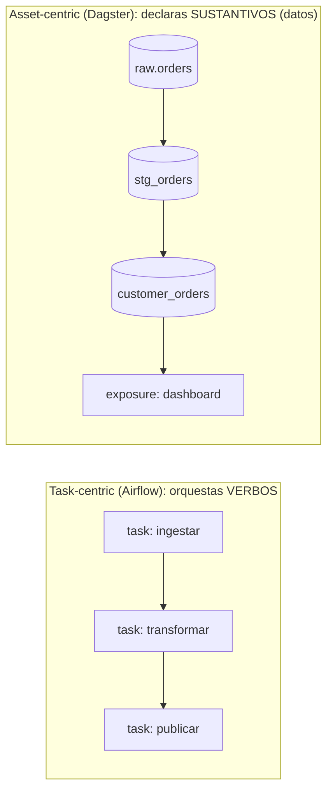
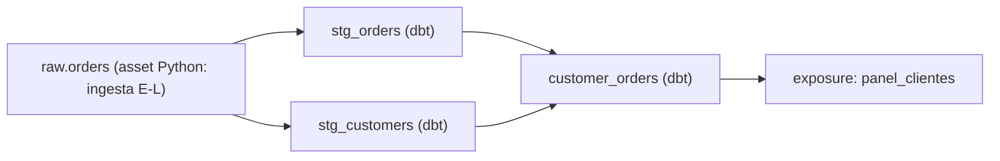

import Reto from "@components/Reto.astro";
import Solucion from "@components/Solucion.astro";
import Quiz from "@components/Quiz.astro";
import CheckDominio from "@components/CheckDominio.astro";
import Nivel from "@components/Nivel.astro";

<Nivel nivel="intermedio" />

En [7.5b](/fase-7-automatizacion/7-5b-dbt/) construiste un mini-warehouse con dbt: modelos en capas, tests, linaje. Pero dejaste una pregunta colgando: **¿quién corre `dbt build`, cuándo, y qué pasa si falla a las 3 de la mañana?** Hoy nadie está mirando. Esa es la pregunta de esta lección. La respuesta es un **orquestador**: la pieza que dispara tus pipelines en el momento correcto, en el orden correcto, los reintenta cuando se caen, te deja **rellenar el pasado** (backfill) y te muestra qué corrió y qué se rompió.

Vas a aprender **uno** a fondo —**Dagster**, en su modelo *asset-centric*— en vez de cinco por encima. No porque los otros no existan (Airflow es el abuelo del rubro y lo verás de contraste), sino porque dominar uno de verdad te enseña los conceptos que viajan a todos: DAG, scheduling, retries, backfills, observabilidad. El hilo conductor de toda la Fase 7 se cierra aquí con un patrón que repetirás en el capstone: **el orquestador dispara `dbt build` después de que la ingesta dejó los datos crudos en el warehouse.**

:::tip[Si ya tocaste Airflow, Prefect, n8n cron o un scheduler de Fabric/Databricks]
Quizás ya programaste un job: un cron que dispara un notebook, un DAG de Airflow con `>>` entre tareas, un workflow de n8n con trigger horario. Bien: la intuición de "esto corre solo, en este orden, a esta hora" ya la traes. La trampa del que "ya orquesta" es pensar **task-centric** (orquesto *tareas que hacen cosas*) cuando el mercado 2026 se movió a **asset-centric** (declaro *los datos que deben existir* y el orquestador deduce las tareas). La pregunta que separa al que "programa jobs" del que "hace data engineering" es: *cuando un dashboard muestra un número viejo, ¿puedes decir en segundos cuál asset está stale, qué corrida lo produjo y qué se rompió aguas arriba — sin abrir cada log?* Si tu respuesta es "reviso los logs uno por uno", esta lección es para ti igual que para quien parte de cero. Salta al ejercicio (sección 7): construye el pipeline Dagster que dispara dbt tras la ingesta, con retry y schedule. Si puedes defender **por qué asset-centric cambia el modelo mental y no es solo renombrar tareas**, valida con el check de dominio (sección 8) y avanza.
:::

## 1. Qué vas a saber hacer

Al terminar, sin IA y sin notas, podrás:

- **O1 — Implementar un pipeline asset-centric**: escribir un asset de ingesta (la "E-L") que carga datos crudos al warehouse, conectarlo con los assets de dbt para que **`dbt build` corra después** de la ingesta, y dejar que Dagster **derive el DAG** de las dependencias (igual que `ref()` derivaba el DAG dentro de dbt — aquí el DAG cruza la frontera Python↔SQL).
- **O2 — Explicar el trade-off task-centric vs asset-centric**: argumentar por qué Airflow orquesta *tareas* y Dagster declara *assets*, qué gana cada modelo, y por qué el asset-centric encaja con el pensamiento de datos moderno (lineage, frescura, "¿qué está stale?").
- **O3 — Operar el pipeline como ingeniero**: configurar un **schedule** (cron), una **RetryPolicy** —y razonar por qué los reintentos **exigen idempotencia**—, entender qué significa un **backfill** por particiones (no "re-correr todo"), y usar la observabilidad del orquestador (materializaciones, metadata, asset checks, run logs) para diagnosticar.

## 2. Por qué importa (el dinero está aquí)

> 💰 **Por qué importa:** dentro del Data Engineering —el gap individual más grande del perfil que construyes— el **orquestador es la pieza de "producción"**: es lo que convierte tus scripts y tus modelos dbt en un sistema que corre solo, se recupera de fallas y es auditable. En 2026 toda vacante de Data/Analytics Engineer pide "Airflow, Dagster o Prefect", y la grieta de mercado es brutal: muchísima gente sabe escribir un DAG que corre el camino feliz, y muy poca sabe **qué pasa cuando falla** —reintentos idempotentes, backfill de los días que se perdieron, alertas, SLAs de frescura. Decir "programo jobs con cron" te pone en la fila; decir "modelo mi pipeline como assets, el orquestador dispara dbt tras la ingesta, los reintentos son idempotentes, y puedo rellenar 3 meses de historia sin re-procesar lo que ya está bien" te saca de la fila. Y el asset-centric es, además, un diferenciador de actualidad: es el modelo que mejor conversa con RAG y con IA, porque pensar en "¿qué dato existe y está fresco?" es exactamente lo que un sistema de IA necesita saber de su fuente.

Tres razones lo vuelven una bisagra de carrera:

1. **Un orquestador es lo que separa "corre en mi máquina" de "corre en producción".** Un script que tú ejecutas a mano no es un pipeline; es una demo. El orquestador le agrega las cuatro cosas que lo hacen confiable: **dependencias** (corre B solo si A terminó bien), **scheduling** (a las 6 AM, sin que nadie esté despierto), **retries** (un timeout de red no tumba el pipeline entero) y **observabilidad** (cuándo corrió, cuánto tardó, qué falló). Sin esas cuatro, no tienes ingeniería de datos: tienes cron y esperanza.
2. **El cambio a asset-centric es real y reciente, y entenderlo te marca como actual.** Durante una década, orquestar significó "definir tareas y conectarlas con flechas" (Airflow). Dagster invirtió la pregunta: en vez de *"¿qué tareas corro?"* preguntas *"¿qué datos deben existir?"* y declaras esos **assets**; el orquestador deduce las tareas y el orden. Suena sutil; cambia todo: ahora el sistema sabe *qué tabla está desactualizada*, no solo *qué tarea falló*. Esa es la conversación de seniority en 2026.
3. **El patrón "orquestador dispara dbt" es el esqueleto de casi todo pipeline analítico real.** Ingesta (extrae y carga datos crudos) → dbt (transforma en capas testeadas) → consumo (dashboard, RAG, ML). El orquestador es el director que coordina esos movimientos, en orden, con reintentos, programado. Si lo construyes una vez de verdad, lo reconocerás en toda oferta de trabajo del rubro.

## 3. Lo que ya traes (actívalo)

Esta lección ensambla hilos que ya tienes. Recupéralos antes de seguir:

- **De dbt ([7.5b](/fase-7-automatizacion/7-5b-dbt/)):** `ref()` construye un **DAG** *dentro* del warehouse y `dbt build` lo corre en orden. El orquestador hace lo mismo un nivel más arriba: arma un DAG que **incluye** la ingesta Python *y* todo el grafo de dbt, y lo corre completo. dbt resuelve el orden de las tablas; el orquestador resuelve el orden de "ingesta → dbt → consumo".
- **De ELT y medallion ([7.5a](/fase-7-automatizacion/7-5a-elt-modelado-analitico/)):** el flujo bronze → silver → gold. El orquestador es quien **mueve los datos por esas capas** en cada corrida programada.
- **De idempotencia y resiliencia ([7.2](/fase-7-automatizacion/7-2-integracion-confiabilidad/)):** idempotency keys, reintentos con backoff, DLQ. Acá esos conceptos dejan de ser teoría: la `RetryPolicy` del orquestador **exige** que tu ingesta sea idempotente, o los reintentos duplican datos.
- **De durable execution ([7.3](/fase-7-automatizacion/7-3-durable-execution-temporal/)):** Temporal sobrevive a caídas a mitad de un workflow de larga duración. Un orquestador de datos resuelve un problema **distinto pero vecino**: corridas programadas y por lotes de pipelines de datos. Saber *cuándo es cada uno* es parte del trade-off (lo vemos en la sección 5).
- **De n8n ([7.1](/fase-7-automatizacion/7-1-n8n-arquitectura/)):** triggers, error workflows, dev/prod. Un orquestador de código es la graduación de eso cuando el pipeline crece en complejidad de datos y dependencias.

Antes de seguir, responde de memoria:

<Quiz
  question="Tienes un cron que cada día a las 6 AM corre `python ingesta.py && dbt build`. Una mañana la ingesta falla a mitad (timeout de la API fuente), pero `dbt build` corre igual sobre datos a medias y publica un dashboard con números incompletos. Nadie se entera hasta que un ejecutivo pregunta. ¿Qué capacidad de un orquestador habría evitado esto?"
  options={[
    "Más memoria en el servidor para que la API no diera timeout",
    "Dependencias explícitas (dbt corre SOLO si la ingesta terminó OK) + retries en la ingesta + observabilidad que alerta cuando un paso falla — exactamente las cuatro cosas que un cron con && no te da",
    "Correr el cron cada hora en vez de una vez al día, para tener más intentos",
  ]}
  answer={1}
  explanation="`&&` encadena comandos pero no entiende dependencias de datos ni reintentos ni estado: si la ingesta falla a medias y devuelve un exit code 0 engañoso, dbt corre igual. Y aunque `&&` cortara, no hay reintento, ni alerta, ni registro de qué pasó. Un orquestador da las cuatro: dependencias (dbt depende del asset de ingesta), retries (con backoff e idempotencia), scheduling, y observabilidad (qué corrió, cuándo, qué falló). Correr más seguido solo multiplica el problema."
/>

## 4. Ejemplo resuelto, pensado en voz alta

Te voy a construir el pipeline desde cero, **razonando cada decisión como me oirías al lado tuyo**. El objetivo: a las 6 AM, ingestar pedidos crudos a DuckDB y, **solo si eso salió bien**, correr `dbt build` sobre el warehouse de 7.5b. No lo leas como receta para copiar: léelo como "qué decido y por qué".

### 4.1 El modelo mental mínimo de un orquestador (desde cero)

Un orquestador hace **cuatro** cosas, y todas las herramientas (Dagster, Airflow, Prefect) las comparten:

| Capacidad | Qué resuelve | El "vs cron" |
|---|---|---|
| **Dependencias (DAG)** | corre B solo si A terminó bien | `cron` no sabe que B depende de A |
| **Scheduling** | dispara a la hora/cadencia correcta | esto sí lo hace cron... y nada más |
| **Retries** | reintenta el paso que falló (no todo) | cron falla entero o no falla |
| **Observabilidad** | registra cada corrida: cuándo, cuánto, qué falló, qué produjo | cron deja, con suerte, una línea en un log |

> **La idea de un solo golpe:** un orquestador es un **director de orquesta para datos**. No toca ningún instrumento (no transforma datos él mismo — eso lo hace dbt, o tu Python); decide **quién toca, cuándo y en qué orden**, y si un músico se equivoca, lo hace repetir su parte sin parar el concierto. Confundir el director con los músicos es el error #1: el orquestador debe ser **delgado** (coordina) y las tareas **gordas** (hacen el trabajo).

### 4.2 Task-centric vs asset-centric (el cambio de mentalidad)

Esta es la decisión conceptual más importante de la lección. Hay dos formas de modelar un pipeline.

**Task-centric (Airflow, el modelo clásico).** Defines *tareas* —"ingestar", "transformar", "publicar"— y las conectas con flechas. Tú orquestas **verbos**. El sketch (TaskFlow API de Airflow, para que veas la *forma*):

```python
# Airflow — task-centric: orquestas TAREAS (verbos), conectadas con dependencias.
from airflow.decorators import dag, task
import pendulum

@dag(schedule="0 6 * * *", start_date=pendulum.datetime(2025, 1, 1), catchup=False)
def pipeline_pedidos():
    @task
    def ingestar():
        ...  # carga datos crudos

    @task
    def transformar():
        ...  # corre dbt build

    transformar.set_upstream(ingestar())  # transformar depende de ingestar
pipeline_pedidos()
```

El orquestador sabe *"corre `transformar` después de `ingestar`"*. Lo que **no** sabe: qué *dato* produjo cada tarea, ni si ese dato está fresco o stale. Si el dashboard muestra números viejos, Airflow te dice "la tarea X corrió OK"; no te dice "la tabla `marts.ingresos` lleva 2 días sin actualizarse".

**Asset-centric (Dagster, el modelo moderno).** Inviertes la pregunta. No declaras tareas: declaras los **assets** —los *datos que deben existir*: `raw.orders`, `stg_orders`, `customer_orders`— y cómo se producen. Dagster deduce las tareas y el orden a partir de las dependencias entre assets. Tú orquestas **sustantivos**:

```python
# Dagster — asset-centric: declaras los DATOS (sustantivos) que deben existir.
import dagster as dg

@dg.asset
def raw_orders() -> None:
    ...  # este asset ES la tabla de pedidos crudos

@dg.asset
def customer_orders(raw_orders) -> None:
    ...  # depende de raw_orders; Dagster deduce el orden por el parámetro
```

La dependencia es el **parámetro de la función** (`customer_orders` recibe `raw_orders`), exactamente como `ref()` en dbt. Dagster ahora sabe algo que Airflow no: *qué tabla* es cada nodo. Por eso puede responder "`customer_orders` está stale porque `raw_orders` se actualizó y nadie re-materializó", dibujar el linaje de punta a punta, y dejarte pedir "materializa este asset y todo lo que depende de él".



> **El trade-off honesto, sin sobrevender:** task-centric es perfecto cuando tu unidad de trabajo *no* es un dato (mandar correos, llamar APIs, mover archivos): orquestas acciones y punto. Asset-centric brilla cuando el pipeline **produce datos** y te importa su estado (frescura, linaje, "¿qué está stale?") — que es casi todo en data engineering y en alimentar IA. Airflow es maduro, ubicuo y tiene un ecosistema enorme de operadores; Dagster es más nuevo, opinado, y su modelo de assets + testabilidad local es donde se mueve el mercado de datos moderno. Por eso aprendemos Dagster a fondo: el modelo mental asset-centric es el que conviene interiorizar. Si llegas a un equipo con Airflow, los conceptos —DAG, schedule, retry, backfill, observabilidad— se trasladan; solo cambias de verbos a... verbos.

### 4.3 El patrón clave: el orquestador dispara dbt tras la ingesta

Ahora el corazón de la Fase 7. Quiero que, en cada corrida, primero **Python ingeste** los pedidos crudos a DuckDB, y **después** Dagster corra el `dbt build` del proyecto de [7.5b](/fase-7-automatizacion/7-5b-dbt/). El truco: dbt ya conoce sus fuentes vía `source('raw', 'orders')`; **dagster-dbt convierte esa `source` en un asset upstream**. Si mi asset de ingesta tiene **la misma asset key** que esa source, Dagster los conecta y `dbt build` corre después de la ingesta. Automáticamente. Sin que yo dibuje la flecha.

Para instalar (tú, no yo): `uv add dagster dagster-dbt dbt-duckdb` o `pip install dagster dagster-dbt dbt-duckdb`.

**Paso 1 — el asset de ingesta (la E-L).** Carga datos crudos en la tabla `raw.orders` de DuckDB. *Razono:* lo hago **idempotente** (con `CREATE OR REPLACE`/`DELETE`+`INSERT`, no `INSERT` ciego) porque sé que un retry puede re-ejecutarlo, y un `INSERT` ciego duplicaría filas. Le doy la asset key `["raw", "orders"]` para que calce con la `source` de dbt.

```python
from pathlib import Path
import duckdb
import dagster as dg

DB_PATH = Path(__file__).parent / "mini_warehouse" / "dev.duckdb"

@dg.asset(
    key=["raw", "orders"],   # calza con source('raw', 'orders') de dbt
    retry_policy=dg.RetryPolicy(max_retries=3, delay=10, backoff=dg.Backoff.EXPONENTIAL),
)
def raw_orders(context: dg.AssetExecutionContext) -> None:
    pedidos = extraer_pedidos_de_la_fuente()  # API/SFTP/archivo del día
    con = duckdb.connect(str(DB_PATH))
    con.execute("create schema if not exists raw")
    # Idempotente: reemplaza la tabla en cada corrida. Re-ejecutar NO duplica.
    con.execute("create or replace table raw.orders as select * from pedidos_df", {"pedidos_df": pedidos})
    n = con.execute("select count(*) from raw.orders").fetchone()[0]
    con.close()
    # Observabilidad: deja metadata visible en la UI de la corrida.
    context.add_output_metadata({"filas_ingestadas": dg.MetadataValue.int(n)})
```

**Paso 2 — los assets de dbt.** Un solo decorador convierte *todo* el proyecto dbt en assets de Dagster. Corre `dbt build` (modelos **y** tests, como aprendiste en 7.5b — no `dbt run`):

```python
from dagster_dbt import DbtCliResource, DbtProject, dbt_assets

dbt_project = DbtProject(project_dir=Path(__file__).parent / "mini_warehouse")
dbt_project.prepare_if_dev()   # compila el manifest en desarrollo

@dbt_assets(manifest=dbt_project.manifest_path)
def warehouse_dbt(context: dg.AssetExecutionContext, dbt: DbtCliResource):
    yield from dbt.cli(["build"], context=context).stream()
```

*Razono:* `@dbt_assets` lee el `manifest.json` de dbt y crea **un asset por modelo** (`stg_orders`, `customer_orders`...), con sus dependencias internas ya resueltas por los `ref()`. Como `stg_orders` usa `source('raw','orders')`, su asset upstream es `["raw","orders"]` — **el mismo** que mi asset de ingesta. Dagster une los dos grafos en uno solo.

**Paso 3 — empaquetar todo en `Definitions`.** Es el "main" de un proyecto Dagster: el contenedor que Dagster carga. Le paso los assets y el recurso `dbt`:

```python
defs = dg.Definitions(
    assets=[raw_orders, warehouse_dbt],
    resources={"dbt": DbtCliResource(project_dir=dbt_project)},
)
```

Corro `dagster dev` (levanta la UI local en `http://localhost:3000`) y veo **un solo DAG** que cruza la frontera Python↔SQL:



La flecha `raw.orders → stg_orders` **la dedujo Dagster** del calce de asset keys. Eso es el patrón "orquestador dispara dbt tras la ingesta", y es el esqueleto del capstone.

:::note[Sobre el calce de asset keys (sé honesto con tu versión)]
Que el asset `["raw","orders"]` calce con `source('raw','orders')` depende del **DagsterDbtTranslator**, que mapea cada recurso dbt a una asset key. El comportamiento por defecto deriva la key del nombre de la source y la tabla; en proyectos reales se suele declarar un translator explícito para que el calce sea inequívoco. Si al cargar `dagster dev` ves la ingesta y dbt como **dos islas desconectadas**, el calce de keys es lo primero a revisar: compara la asset key de tu ingesta con la que Dagster le dio a la source de dbt (la ves en la UI) y, si difieren, alinéalas con un translator. La [referencia oficial de dagster-dbt](https://docs.dagster.io/integrations/libraries/dbt) tiene el patrón exacto para tu versión instalada — verifícalo ahí, no lo adivines.
:::

### 4.4 Scheduling: que corra solo a las 6 AM

Tener el DAG no basta; alguien debe dispararlo. Defino un **job** (qué materializar) y un **schedule** (cuándo):

```python
# Job: materializa TODO el grafo (ingesta + dbt) en una corrida.
warehouse_job = dg.define_asset_job("warehouse_job", selection=dg.AssetSelection.all())

# Schedule: cron estándar. "0 6 * * *" = todos los días a las 06:00.
warehouse_schedule = dg.ScheduleDefinition(
    job=warehouse_job,
    cron_schedule="0 6 * * *",
)

defs = dg.Definitions(
    assets=[raw_orders, warehouse_dbt],
    jobs=[warehouse_job],
    schedules=[warehouse_schedule],
    resources={"dbt": DbtCliResource(project_dir=dbt_project)},
)
```

*Razono:* el `cron_schedule` usa la sintaxis cron de toda la vida (`minuto hora día mes día-semana`). `define_asset_job` con `AssetSelection.all()` dice "materializa el grafo completo"; podría seleccionar solo una rama (`AssetSelection.assets("customer_orders").upstream()`) si quisiera corridas parciales. El schedule, una vez activado en la UI, dispara el job cada día sin que nadie esté despierto.

> **Cron en una línea:** `0 6 * * *` = a las 6:00. `*/15 * * * *` = cada 15 minutos. `0 0 * * 1` = lunes a medianoche. La cadencia es una **decisión de costo/latencia** (hilo transversal): cada corrida consume cómputo y, si tu fuente cobra por request, dinero. Programar "cada 5 minutos" un pipeline que la gente mira una vez al día es quemar plata para datos que nadie usa más fresco. Elige la cadencia por la *necesidad de frescura del consumidor*, no por defecto.

### 4.5 Retries: por qué exigen idempotencia

Un timeout de red no debería tumbar tu pipeline. Por eso le puse una `RetryPolicy` al asset de ingesta (arriba): si falla, Dagster lo reintenta hasta 3 veces, con backoff exponencial (10s, luego ~20s, luego ~40s — espera creciente para no martillar una fuente caída, justo el patrón de [7.2](/fase-7-automatizacion/7-2-integracion-confiabilidad/)).

```python
@dg.asset(
    retry_policy=dg.RetryPolicy(
        max_retries=3,
        delay=10,                       # segundos base
        backoff=dg.Backoff.EXPONENTIAL, # 10s, 20s, 40s...
        jitter=dg.Jitter.PLUS_MINUS,    # algo de aleatoriedad: evita thundering herd
    ),
)
def raw_orders(context): ...
```

*Acá está el punto que casi todos pasan por alto:* **un retry re-ejecuta el asset entero.** Si tu ingesta hace `INSERT INTO raw.orders ...` ciego, el primer intento mete 1.000 filas, falla *después* de insertarlas, y el retry mete **otras 1.000** → 2.000 filas, datos duplicados, métricas infladas. La `RetryPolicy` solo es segura si la operación es **idempotente**: ejecutarla N veces deja el mismo estado que ejecutarla una. Por eso usé `CREATE OR REPLACE TABLE` (reemplaza, no acumula). Reintentos sin idempotencia no es resiliencia: es duplicación automática.

> **Regla que se queda:** *retry ⇒ idempotencia, sin excepción.* Antes de subir `max_retries` de 0, pregúntate "¿qué pasa si esto corre dos veces seguidas?". Si la respuesta no es "lo mismo que correrlo una", primero arregla la idempotencia (upsert por clave, `CREATE OR REPLACE`, `DELETE WHERE` del rango + `INSERT`), después activa el retry. Es el mismo razonamiento de las idempotency keys de 7.2, aplicado al orquestador.

### 4.6 Backfills: rellenar el pasado sin re-procesar todo

Imagina que tu pipeline lleva 3 meses corriendo y descubres que la lógica del mart tenía un bug los últimos 30 días. No quieres re-procesar los 3 meses (caro, lento, y re-toca datos que ya estaban bien). Quieres **rellenar solo esos 30 días**. Eso es un **backfill**, y para hacerlo bien necesitas **particiones**.

Una partición divide un asset por una dimensión —típicamente la fecha—: en vez de "la tabla `orders`", tienes "la tabla `orders` del 2025-06-01", "...del 2025-06-02", etc. Cada partición se materializa por separado.

```python
import json

@dbt_assets(
    manifest=dbt_project.manifest_path,
    partitions_def=dg.DailyPartitionsDefinition(start_date="2025-01-01"),
)
def warehouse_dbt(context: dg.AssetExecutionContext, dbt: DbtCliResource):
    inicio, fin = context.partition_time_window          # ventana de ESTA partición
    dbt_vars = {"min_date": inicio.isoformat(), "max_date": fin.isoformat()}
    yield from dbt.cli(["build", "--vars", json.dumps(dbt_vars)], context=context).stream()
```

*Razono:* ahora cada corrida procesa **una fecha** (le pasa `min_date`/`max_date` a dbt como variables; tus modelos incrementales filtran por esa ventana). Para arreglar el bug, en la UI selecciono las particiones del 1 al 30 de junio y lanzo un **backfill**: Dagster materializa **solo** esas 30, en paralelo si puede, y deja intactas las demás.

> **El malentendido caro:** "backfill = re-correr todo el histórico". No. Un backfill bien hecho re-materializa un **rango acotado de particiones**. Re-correr todo es lo que haces cuando *no* particionaste — y es exactamente el dolor que las particiones evitan. Particionar por fecha desde el día uno es lo que distingue un pipeline que puedes corregir quirúrgicamente de uno que tienes que volar entero cada vez que algo sale mal.

### 4.7 Observabilidad de pipelines: el director ve toda la orquesta

Lo último —y lo que un entrevistador asocia con seniority— es que el orquestador **registra y muestra** cada corrida. Esto es el hilo transversal de **observabilidad** aplicado a datos. Dagster te da, sin esfuerzo extra:

- **Materializaciones con metadata:** cada vez que un asset corre, queda registrado *cuándo*, *cuánto tardó* y la metadata que adjuntaste (`filas_ingestadas: 1234`). Puedes ver la serie histórica: "este asset siempre trae ~1.000 filas; hoy trajo 3 → algo pasó en la fuente".
- **Asset checks (el test como ciudadano de primera):** además de los tests de dbt, puedes declarar chequeos en Dagster que **bloquean** lo de aguas abajo si fallan. Es el *ship-gate* de datos:

```python
@dg.asset_check(asset="customer_orders", blocking=True)
def hay_clientes(context) -> dg.AssetCheckResult:
    con = duckdb.connect(str(DB_PATH))
    n = con.execute("select count(*) from customer_orders").fetchone()[0]
    con.close()
    return dg.AssetCheckResult(passed=n > 0, metadata={"n_clientes": n})
```

  `blocking=True` significa que si el check falla (cero clientes — algo se rompió), los assets que dependen de `customer_orders` **no corren**. Es la misma idea del test rojo que corta el `dbt build` en 7.5b, ahora a nivel orquestador.
- **Run logs + linaje:** cada corrida tiene su log estructurado, y el grafo de assets ES el linaje. Cuando un dashboard muestra un número raro, abres el asset, ves su última materialización, su metadata, y todo lo que lo alimenta. Diagnóstico en segundos, no en "abro cada log".

> **Por qué esto importa para tu carrera:** "instrumenté el pipeline para saber qué corrió, cuánto tardó y qué falló" es una frase de semi-senior. La diferencia entre un pipeline observable y uno opaco es la diferencia entre enterarte de un problema **tú, por una alerta**, o enterarte **por el ejecutivo que vio el número malo**. Adivina cuál de las dos historias quieres contar en una entrevista.

## 5. Errores y malentendidos frecuentes

:::caution[Podrías pensar... pero está mal]
**"Un orquestador es cron con una UI bonita."**
Cron solo dispara comandos a una hora. No entiende dependencias (no sabe que B necesita a A), no reintenta el paso que falló (falla entero o no falla), no hace backfills, y no observa nada (con suerte una línea en un log). Un orquestador da las cuatro: DAG, scheduling, retries y observabilidad. Si lo único que necesitas es "corre este comando a las 6", cron basta — pero entonces no tienes un pipeline de datos, tienes un comando programado.
:::

:::caution[Podrías pensar... pero está mal]
**"Asset-centric es solo renombrar 'tareas' a 'assets'."**
Es un cambio de modelo mental, no de vocabulario. Task-centric: orquestas *verbos* (ingestar, transformar) y el sistema sabe "qué tarea corrió". Asset-centric: declaras *sustantivos* (los datos que deben existir) y el sistema sabe *qué dato* es cada nodo — por eso puede decirte "esta tabla está stale", dibujar el linaje y materializar "este asset y todo lo que depende de él". Si en una entrevista dices "es lo mismo con otro nombre", suenas a usuario; si dices "asset-centric le da al orquestador el estado de los datos, no solo el de las tareas", suenas a ingeniero.
:::

:::caution[Podrías pensar... pero está mal]
**"Subo `max_retries` y mi pipeline es más confiable."**
Solo si la operación es idempotente. Un retry re-ejecuta el asset entero; si tu ingesta hace `INSERT` ciego, cada reintento duplica datos. Reintentos sin idempotencia no es resiliencia — es duplicación automática y silenciosa. Primero haz la operación idempotente (`CREATE OR REPLACE`, upsert por clave, `DELETE`+`INSERT` del rango), después activa el retry.
:::

:::caution[Podrías pensar... pero está mal]
**"Un backfill re-corre todo el histórico."**
No, si particionaste. Un backfill bien hecho re-materializa un **rango acotado de particiones** (los 30 días con el bug), no los 3 meses. Re-correr todo es el síntoma de *no* haber particionado. Particionar por fecha es lo que vuelve los backfills quirúrgicos en vez de demoledores.
:::

:::caution[Podrías pensar... pero está mal]
**"Pongo toda la lógica de negocio dentro del orquestador."**
El orquestador es el director, no el músico. Su trabajo es **coordinar** (qué corre, cuándo, en qué orden, con qué retry), no transformar datos. La transformación vive en dbt (SQL) o en tu Python; el orquestador la *invoca*. Si metes los `JOIN`s y las reglas de negocio dentro de los assets de orquestación, pierdes los tests de dbt, el linaje a nivel modelo, y mezclas dos responsabilidades. Orquestación delgada, tareas gordas.
:::

:::caution[Podrías pensar... pero está mal]
**"Dagster reemplaza a Temporal (o al revés)."**
Resuelven problemas vecinos pero distintos. Un orquestador de datos (Dagster/Airflow) es para **pipelines por lotes, programados, centrados en datos**: ingesta → dbt → consumo, cada día. Temporal ([7.3](/fase-7-automatizacion/7-3-durable-execution-temporal/)) es para **workflows durables de larga duración con lógica compleja** —una saga de checkout que espera 3 días un pago— donde necesitas replay determinista a nivel de cada paso. Usar Dagster para una saga transaccional, o Temporal para correr dbt cada noche, es elegir la herramienta equivocada. El trade-off es parte de tu criterio de ingeniero.
:::

## 6. Práctica con andamiaje (que se desvanece)

Antes del ejercicio grande, dos micro-prácticas. Como Dagster es **nuevo** para ti, vamos de menos a más: primero predecir, luego reordenar, luego construir.

### 6.1 Predict (sin ejecutar)

Lee estos assets de Dagster. **Predice en qué orden los materializa Dagster y por qué**, antes de mirar la respuesta.

```python
import dagster as dg

@dg.asset
def clientes() -> None: ...

@dg.asset
def pedidos() -> None: ...

@dg.asset
def resumen_cliente(clientes, pedidos) -> None: ...   # recibe ambos

@dg.asset
def alerta_email(resumen_cliente) -> None: ...        # recibe el resumen
```

<Solucion title="Ver el orden (ábrelo solo tras predecir)">

Orden: **`clientes` y `pedidos` primero** (en paralelo — no dependen entre sí), **luego `resumen_cliente`** (necesita a ambos), **al final `alerta_email`** (necesita el resumen).

Dagster lo deduce de los **parámetros de las funciones**, igual que `ref()` en dbt: `resumen_cliente(clientes, pedidos)` declara dos dependencias upstream; `alerta_email(resumen_cliente)` declara una. Nadie escribió el orden a mano — el DAG sale del grafo de dependencias. Y como `clientes` y `pedidos` no se necesitan mutuamente, Dagster puede correrlos al mismo tiempo.

</Solucion>

### 6.2 Parsons (reordenar)

Estas son las líneas de un `definitions.py` mínimo que ingesta y luego dispara dbt, **desordenadas**. Reordénalas mentalmente para que sea código válido y coherente (imports arriba, `Definitions` al final). Escríbelo en papel antes de mirar.

```text
A) warehouse_job = dg.define_asset_job("warehouse_job", selection=dg.AssetSelection.all())
B) import dagster as dg
C) @dg.asset(key=["raw", "orders"])
D) defs = dg.Definitions(assets=[raw_orders, warehouse_dbt], jobs=[warehouse_job], schedules=[sched], resources={"dbt": DbtCliResource(project_dir=dbt_project)})
E) def raw_orders(context) -> None: ...
F) sched = dg.ScheduleDefinition(job=warehouse_job, cron_schedule="0 6 * * *")
G) from dagster_dbt import DbtCliResource, DbtProject, dbt_assets
```

<Solucion title="Ver el orden correcto (ábrelo solo tras intentarlo)">

Orden: **B → G → C → E → A → F → D**. Reconstruido:

```python
import dagster as dg
from dagster_dbt import DbtCliResource, DbtProject, dbt_assets

@dg.asset(key=["raw", "orders"])
def raw_orders(context) -> None: ...

# (aquí irían dbt_project y @dbt_assets warehouse_dbt)

warehouse_job = dg.define_asset_job("warehouse_job", selection=dg.AssetSelection.all())
sched = dg.ScheduleDefinition(job=warehouse_job, cron_schedule="0 6 * * *")

defs = dg.Definitions(
    assets=[raw_orders, warehouse_dbt],
    jobs=[warehouse_job],
    schedules=[sched],
    resources={"dbt": DbtCliResource(project_dir=dbt_project)},
)
```

Lo clave del orden: el `job` se define **después** de los assets, el `schedule` **después** del job (lo referencia), y `Definitions` va al final porque junta todo. Notar que el schedule (F) **depende** del job (A): si los inviertes, `sched` referenciaría una variable que no existe aún.

</Solucion>

## 7. Ejercicio Primero-Sin-IA

Ahora lo construyes tú, a mano, sin que una IA te escriba el `definitions.py`. La carpeta `ejercicios/fase-7/orquestador/` de tu repo trae el esqueleto: un proyecto Dagster con TODOs, una ingesta a medio hacer (con un bug de idempotencia a propósito), y un test que verifica que la ingesta es idempotente. Tu trabajo es completar el pipeline, dejar el test verde y levantar el DAG en `dagster dev`.

<Reto title="Pipeline asset-centric: la ingesta dispara dbt, con retry, schedule y un asset check" timebox="45 min">

**Contexto.** Reutilizas el mini-warehouse dbt de [7.5b](/fase-7-automatizacion/7-5b-dbt/) (viene incluido en la carpeta). Vas a ponerle un orquestador encima.

**Parte obligatoria (nivel "competente"):**

1. **Ingesta idempotente** (`ingesta.py`): completa `cargar_ordenes_crudas(con, ordenes)` para que cargue los pedidos en `raw.orders` de DuckDB **de forma idempotente** — re-ejecutarla NO debe duplicar filas. Deja **verde** `pytest tests/test_ingesta.py` (el test la llama dos veces y exige el mismo conteo).
2. **Asset de ingesta** (`definitions.py`): envuelve esa función en un `@dg.asset` con asset key `["raw", "orders"]` (para que calce con la `source` de dbt) y una `RetryPolicy` con backoff. Adjunta metadata (`filas_ingestadas`).
3. **Assets de dbt**: usa `@dbt_assets` + `DbtProject` + `DbtCliResource` para correr `dbt build`. Verifica en `dagster dev` que el DAG conecta `raw.orders → stg_orders → customer_orders` (la ingesta y dbt en **un solo grafo**, no dos islas).
4. **Schedule**: un `define_asset_job` que materialice todo el grafo + un `ScheduleDefinition` con cron diario.
5. Levanta `dagster dev`, **materializa el grafo completo una vez** y confirma que corre en orden (ingesta primero, dbt después).

**Parte de profundización (nivel "excelente" — aplica los hilos transversales):**

6. **Asset check bloqueante** (`@dg.asset_check(..., blocking=True)`) sobre `customer_orders` que falle si la tabla queda vacía. Es tu *ship-gate* de datos.
7. **Particiona** los assets de dbt con `DailyPartitionsDefinition` y describe (no necesitas ejecutarlo) cómo lanzarías un **backfill** de los últimos 7 días.
8. `WRITEUP.md` (5–8 líneas): tu DAG, el trade-off **asset-centric vs task-centric** en tus palabras, **por qué tu ingesta debe ser idempotente** dado el retry, y qué significaría un backfill aquí (vs "re-correr todo").

**Criterios de "hecho" (Definition of Done del ejercicio):**

- [ ] `pytest tests/test_ingesta.py` en verde (la ingesta es idempotente).
- [ ] En `dagster dev`, el DAG muestra `raw.orders` conectado a los assets de dbt (un solo grafo, no dos islas).
- [ ] El asset de ingesta tiene una `RetryPolicy` y la ingesta es idempotente (coherencia retry↔idempotencia).
- [ ] Hay un `define_asset_job` + `ScheduleDefinition` con cron válido.
- [ ] Materializaste el grafo completo al menos una vez, en orden (ingesta → dbt).
- [ ] Puedes **explicar sin notas** el trade-off task-centric vs asset-centric y por qué retry exige idempotencia.

**Primero-Sin-IA:** resuélvelo solo, a mano (timebox arriba). Está bien que sea lento. Consulta solo la [documentación oficial de Dagster](https://docs.dagster.io/getting-started) y la de [dagster-dbt](https://docs.dagster.io/integrations/libraries/dbt). **Solo al final**, usa IA para *revisar y explicar* tu solución — nunca para generarla. Mañana, reescribe el `definitions.py` de memoria: si no puedes, no lo aprendiste todavía.

</Reto>

<Solucion title="Pista inline (ábrela solo si superaste el timebox)">

No es la solución de referencia — es una pista para destrabarte:

- **Idempotencia:** si tu `cargar_ordenes_crudas` hace `INSERT INTO`, ese es el bug. Piensa en `CREATE OR REPLACE TABLE raw.orders AS ...` o en `DELETE FROM raw.orders` + `INSERT`. La clave: ejecutarla dos veces = mismo estado.
- **El calce de keys:** si en `dagster dev` ves la ingesta y dbt como **dos grafos separados**, tu asset key no calza con la source de dbt. Mira en la UI qué key le dio Dagster a `source('raw','orders')` y alinéala (asset key vs source — son lo mismo cuando calzan).
- **Orden de definición:** el `schedule` referencia el `job`, así que define el job primero. `Definitions` va al final y junta todo.
- **Si `@dbt_assets` no encuentra el manifest:** corre `dbt parse` (o deja `dbt_project.prepare_if_dev()`) para generar `target/manifest.json` antes de cargar Dagster.
- **El asset check:** `blocking=True` + `AssetCheckResult(passed=...)`. Recuerda: un check que falla **es** la señal, no el estorbo (como el test rojo de dbt).

Revisa la sección 4 de esta lección antes de mirar nada más.

</Solucion>

## 8. Check de dominio (active recall)

Cierra la lección y responde **sin volver atrás**. Si no puedes explicar uno, vuelve a su sección.

<CheckDominio items={[
  "Nombrar las 4 cosas que un orquestador hace y un cron no (dependencias/DAG, scheduling, retries, observabilidad).",
  "Explicar el trade-off task-centric (Airflow) vs asset-centric (Dagster): verbos vs sustantivos, y qué gana cada uno.",
  "Describir el patrón clave de la Fase 7: cómo el orquestador dispara dbt build DESPUÉS de la ingesta, y por qué el calce de asset keys los conecta.",
  "Explicar por qué una RetryPolicy EXIGE idempotencia, y dar una forma de hacer una ingesta idempotente.",
  "Explicar qué es un backfill y por qué con particiones NO significa 're-correr todo el histórico'.",
  "Decir qué observabilidad te da el orquestador (materializaciones+metadata, asset checks bloqueantes, run logs, linaje) y cómo la usas para diagnosticar un número raro.",
]} />

<Quiz
  question="Tu pipeline corre `raw.orders` (ingesta) → assets de dbt, programado a diario. Cambias `max_retries` de la ingesta de 0 a 3, pero NO tocas su lógica, que hace `INSERT INTO raw.orders SELECT * FROM fuente`. Una mañana la API fuente da un timeout DESPUÉS de insertar las filas. ¿Qué pasa?"
  options={[
    "Nada malo: el retry vuelve a intentar y deja los datos correctos",
    "El retry re-ejecuta el INSERT entero, duplicando las filas que ya se habían insertado en el intento fallido — datos duplicados, métricas infladas. El retry no es seguro porque la ingesta no es idempotente",
    "Dagster detecta el INSERT duplicado y lo revierte automáticamente",
  ]}
  answer={1}
  explanation="Un retry re-ejecuta el asset COMPLETO. Si el primer intento alcanzó a insertar las filas antes de fallar, el retry inserta otra vez → duplicados. Dagster no revierte tu SQL: no sabe qué hiciste dentro del asset. Subir max_retries sin garantizar idempotencia convierte un fallo recuperable en corrupción de datos silenciosa. El fix: CREATE OR REPLACE (o DELETE+INSERT del rango, o upsert por clave) ANTES de activar retries. retry ⇒ idempotencia, sin excepción."
/>

## 9. Recursos (oficial primero)

- [Dagster — Getting started](https://docs.dagster.io/getting-started) · instalar, `dagster dev`, primer asset.
- [Dagster — Assets](https://docs.dagster.io/guides/build/assets) · `@asset`, dependencias, el modelo asset-centric.
- [Dagster — dbt integration](https://docs.dagster.io/integrations/libraries/dbt) · `@dbt_assets`, `DbtCliResource`, `DbtProject`, calce de asset keys (el patrón de esta lección).
- [Dagster — Schedules](https://docs.dagster.io/guides/automate/schedules) · `ScheduleDefinition`, cron, `define_asset_job`.
- [Dagster — Retries / op retries](https://docs.dagster.io/guides/build/ops/op-retries) · `RetryPolicy`, `Backoff`, `Jitter`.
- [Dagster — Partitions & backfills](https://docs.dagster.io/guides/build/partitions-and-backfills) · particionar por fecha y rellenar rangos.
- [Dagster — Asset checks](https://docs.dagster.io/guides/test/asset-checks) · checks bloqueantes como ship-gate de datos.
- [Apache Airflow — TaskFlow API](https://airflow.apache.org/docs/apache-airflow/stable/tutorial/taskflow.html) · el modelo task-centric, para tu contraste.

:::note[Orquestadores en 2026: el mapa honesto]
**Airflow** sigue siendo el más usado y maduro (Airflow 3.x trajo mejoras grandes), ubicuo en empresas y con un ecosistema enorme de operadores — task-centric de raíz, aunque incorporó "assets/datasets". **Dagster** es el referente del modelo asset-centric, con foco en testabilidad local, lineage y developer experience (su CLI `dg` y los "Components" maduraron en 2025). **Prefect** ocupa un punto intermedio, muy *pythonico*. **No memorices las tres APIs.** Aprende Dagster a fondo —el modelo asset-centric es el mejor para interiorizar el pensamiento de datos moderno— y traslada los conceptos (DAG, schedule, retry, backfill, observabilidad) a la que use tu equipo. Lo que se examina es el criterio, no la sintaxis.
:::

## 10. Conexión con el capstone de la fase

El [capstone de la Fase 7](/fase-7-automatizacion/proyecto/) es una automatización end-to-end agéntica: entra un documento/evento, la IA clasifica y extrae, se decide y se ejecuta en sistemas externos. El orquestador es **quien hace que ese sistema corra solo y de forma confiable**:

- El **patrón de esta lección** (ingesta → dbt, disparado y en orden) es el esqueleto de la capa de datos del capstone: los datos que tu agente extrae aterrizan en el warehouse, dbt los modela y testea, y el orquestador coordina todo en cada corrida programada.
- Los **retries idempotentes** y el **asset check bloqueante** son el mismo *ship-gate* que aplicarás a los evals del agente en [7.7](/fase-7-automatizacion/7-7-agentes-automatizacion-ia/): si un dato (o una salida del LLM) viola una invariante, el pipeline se detiene antes de contaminar una decisión.
- La **observabilidad** (materializaciones, metadata, run logs, linaje) es lo que vuelve tu capstone "estrella" auditable —puedes mostrar qué corrió, cuándo y qué falló— en vez de un script que "funciona en mi máquina".
- La decisión **orquestador de datos (Dagster) vs durable execution (Temporal, [7.3](/fase-7-automatizacion/7-3-durable-execution-temporal/))** es un **ADR** que documentarás: pipelines por lotes centrados en datos → Dagster; workflows durables de larga duración con lógica transaccional → Temporal.

## 11. Reflexión + spaced repetition

Escribe 4–6 líneas en tu `RETROSPECTIVA.md`:

- ¿Cuál fue tu momento "ajá" con asset-centric? Si todavía no lo tuviste, ¿qué parte del "declaro datos, no tareas" sigue difusa?
- Antes de esta lección, ¿cómo habrías programado "ingesta + dbt cada día"? ¿Qué le faltaba a ese enfoque (¿era `cron && dbt build`?) que ahora ves?
- ¿Tu ingesta del ejercicio era idempotente al primer intento, o el test te pilló? Esa sorpresa es justo el aprendizaje.

**Gancho de repaso espaciado:**

- **Mañana (24 h):** reescribe de memoria el `definitions.py` mínimo (asset de ingesta + `@dbt_assets` + job + schedule + `Definitions`), sin mirar. Cárgalo con `dagster dev`. Si no levanta a la primera, ahí está el hueco real.
- **En 7 días:** toma tu pipeline y **rompe la idempotencia a propósito** (cambia el `CREATE OR REPLACE` por un `INSERT`). Corre el test dos veces y verifica que se duplican las filas. Devuélvelo a idempotente. Esa es la prueba de que entendiste retry ⇒ idempotencia, no solo la sintaxis de `RetryPolicy`.
- **Interleaving:** la próxima vez que veas un cron en cualquier proyecto (un workflow de n8n con trigger horario, un job de CI), pregúntate: "¿esto entiende dependencias y reintentos, o es 'comando + esperanza'? ¿Qué pasa si corre dos veces?". El instinto de pensar en orden, retry e idempotencia es lo que se queda.
