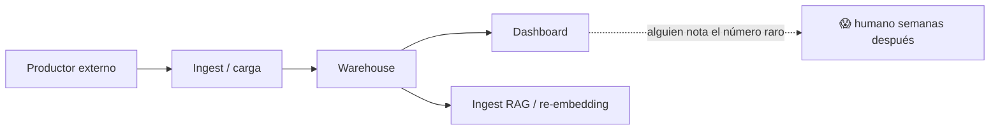
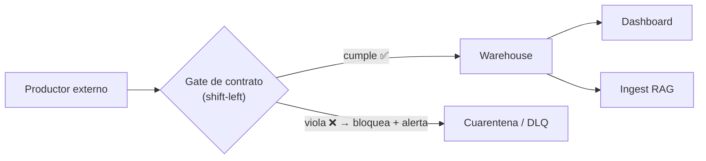

import Reto from "@components/Reto.astro";
import Solucion from "@components/Solucion.astro";
import Quiz from "@components/Quiz.astro";
import CheckDominio from "@components/CheckDominio.astro";
import Nivel from "@components/Nivel.astro";

<Nivel nivel="intermedio" />

En [7.5b](/fase-7-automatizacion/7-5b-dbt/) aprendiste a ponerle tests a tus datos *dentro* de tu warehouse con dbt, y en [7.5c](/fase-7-automatizacion/7-5c-orquestador/) a hacer que un orquestador dispare esos tests de forma confiable. Esta lección cierra el sub-track de data engineering con la pregunta que separa al que "limpia datos cuando se rompen" del que "construye sistemas de datos confiables": **¿cómo evitas que un dato malo entre al sistema en primer lugar, y cómo te enteras —en minutos, no en semanas— cuando algo cambió aguas arriba?**

Esto tiene tres piezas que la mayoría confunde, y vas a aprender a distinguir con precisión:

- **Data contract** — el *acuerdo* formal y versionado entre quien produce un dato y quien lo consume. Es el "qué prometo entregarte" antes de que exista una sola fila.
- **Data quality testing** — las *aserciones* que verifican que un lote concreto de datos cumple el contrato (Great Expectations, dbt tests). Es el "¿este lote cumple lo prometido?".
- **Data observability** — la *vigilancia continua* de la salud de los datos en producción (OpenLineage, monitoreo de freshness/volume/schema). Es el "¿siguió cumpliéndose con el tiempo, y si no, quién depende de esto?".

Y el hilo que las une, robado de la ingeniería de software, es **shift-left**: mover la verificación lo más temprano posible —al borde de entrada del sistema, idealmente en CI— en vez de descubrir el problema cuando un ejecutivo ve un número absurdo (o cuando tu RAG responde con seguridad una respuesta inventada).

:::tip[Si ya tocaste calidad de datos (validaciones en un ETL, alertas de un dashboard)]
Quizás ya escribiste validaciones sueltas —un `if monto < 0: raise` en un script de carga, una alerta de Power BI cuando una tabla "se ve rara"—. Esa intuición sirve, pero es **reactiva y dispersa**: validas donde te acordaste, no donde el sistema lo necesita, y nadie sabe qué reglas existen ni quién las acordó. La diferencia de seniority es tratar la calidad como un **contrato versionado** (no un `if` perdido), aplicado en un **gate de entrada** (shift-left, no post-dashboard), y **observado en el tiempo** con lineage (no "me avisó un usuario"). La pregunta que te separa del resto: *cuando el equipo de upstream renombra una columna sin avisar, ¿tu pipeline falla ruidosamente en el borde, o produce datos sutilmente malos durante dos semanas?* Si es lo segundo, esta lección es para ti igual que para quien parte de cero. Lee el ejemplo resuelto (sección 4) para fijar el vocabulario y salta al ejercicio (sección 7): construirás el gate a mano.
:::

## 1. Qué vas a saber hacer

Al terminar, sin IA y sin notas, podrás:

- **O1 — Explicar y escribir un data contract**, distinguiéndolo de un test de datos y de la observabilidad: definir el esquema (campos + tipos), las garantías de calidad (validez, freshness, volumen) y la propiedad, y argumentar **por qué un contrato versionado en el borde productor↔consumidor previene el schema drift** que un test aislado no previene.
- **O2 — Implementar un gate de calidad shift-left**: dado un lote de datos y un contrato, detectar a mano las violaciones (campo faltante/extra, tipo incorrecto, nulo, duplicado, valor fuera de dominio, lote viejo o de volumen anómalo) y **bloquear el lote** cuando falla, con un reporte estructurado — el mismo modelo mental que automatizan Great Expectations y los tests de dbt.
- **O3 — Explicar la data observability y el rol de OpenLineage**: nombrar los pilares (freshness, volume, schema, distribution, lineage), explicar cómo se detecta cada drift, y **argumentar por qué los datos malos rompen igual la analítica y un RAG** (el ingest de [6.7](/fase-6-ai-engineering/) *es* data engineering), con la diferencia crítica de que en el RAG el fallo suele ser **silencioso**.

## 2. Por qué importa (el dinero está aquí)

> 💰 **Por qué importa:** "calidad de datos" suena a tarea aburrida de limpieza, y por eso casi nadie la sabe defender en una entrevista — lo que la convierte en tu palanca. En 2026 toda empresa que mueve datos a escala ya descubrió, por las malas, que **el costo de un dato malo no está en limpiarlo: está en las decisiones que se tomaron confiando en él**. Por eso "data quality", "data contracts" y "data observability" pasaron de buzzword a línea de presupuesto: surgieron plataformas (Monte Carlo, Soda, Great Expectations) cuyo único producto es *avisarte que tus datos se rompieron antes que tu jefe*. El semi-senior que cobra el premium no dice "valido datos"; dice "diseño contratos en el borde, corro gates shift-left en CI, y monitoreo freshness/volume/schema con lineage para saber el blast radius de cualquier cambio". Y el gancho que te vuelve doblemente contratable: **esto es exactamente lo que hace que un RAG no alucine**. Un ingeniero de IA que entiende calidad de datos —porque el ingest de un RAG es un pipeline de datos— resuelve el problema #1 de los sistemas LLM en producción (basura entra, alucinación sale) en vez de echarle la culpa al modelo.

Tres razones lo vuelven una bisagra de carrera:

1. **El schema drift es la causa #1 de pipelines rotos, y un contrato lo convierte en un fallo ruidoso.** Un equipo upstream renombra `customer_id` a `cust_id`, o cambia un monto de centavos a pesos, o empieza a mandar `null` donde nunca había. Sin contrato, tu pipeline "funciona" —no lanza excepción— y produce datos sutilmente malos durante semanas. Con un contrato verificado en el borde, falla **el día que rompen el acuerdo**, con un mensaje que dice exactamente qué cambió. Esa diferencia —fallar temprano y fuerte vs. degradar en silencio— es la tesis entera.
2. **Shift-left es el mismo instinto del TDD, aplicado a los datos.** En Fase 2 aprendiste que un test que corre tarde (en producción) es 100× más caro que uno que corre temprano (en tu máquina). Lo mismo con datos: una validación en el ingest cuesta minutos; el mismo error descubierto en un board ejecutivo cuesta reuniones, confianza y, a veces, plata real. Saber *dónde* poner la verificación (lo más a la izquierda posible) es criterio de ingeniería, no de herramienta.
3. **Es el puente explícito entre data engineering e IA.** El mercado trata "AI Engineer" y "Data Engineer" como tribus separadas; tú vas a ser el que entiende que **son el mismo problema en dos disfraces**. El ingest de documentos de un RAG necesita las mismas garantías —esquema estable, sin duplicados, datos frescos— que un warehouse analítico. Quien sabe esto construye RAGs que se mantienen frescos y confiables; quien no, construye demos que funcionan el día de la presentación y mienten el martes siguiente.

## 3. Lo que ya traes (actívalo)

Esta lección ensambla hilos que ya tienes. Recupéralos antes de seguir:

- **De dbt ([7.5b](/fase-7-automatizacion/7-5b-dbt/)):** el modelo mental "un test es una query que cuenta las filas que NO deberían existir; cero filas = verde". Hoy generalizas eso: un test de datos —en dbt, en Great Expectations, o escrito a mano— es siempre **un predicado que cuenta las filas que violan una regla**. La herramienta cambia; el modelo mental no.
- **De TDD (Fase 2):** "el test corre temprano o cuesta caro". Shift-left es esa frase, aplicada al lote de datos en vez de al código.
- **De confiabilidad de integración ([7.2](/fase-7-automatizacion/7-2-integracion-confiabilidad/)):** validar el payload de un webhook antes de procesarlo, idempotencia, no confiar en lo que entra. El gate de calidad es ese reflejo, formalizado y versionado.
- **De RAG ([6.7](/fase-6-ai-engineering/)):** el pipeline de ingest (cargar → chunkear → embeddear → indexar). Hoy le pones encima la lente de "esto es un pipeline de datos y merece las mismas garantías".

Antes de seguir, responde de memoria:

<Quiz
  question="Tu pipeline analítico carga una tabla `pagos` cada hora desde un sistema externo. Hoy el equipo dueño de ese sistema cambió, sin avisar, el campo `amount` (que venía en centavos) para que ahora venga en pesos. Tu pipeline no lanza ningún error y el dashboard sigue 'funcionando'. ¿Cuál es el problema MÁS grave y qué lo habría atrapado?"
  options={[
    "El problema es de performance; un índice en `amount` lo habría resuelto",
    "El problema es schema drift semántico (cambió el significado/escala del dato, no su tipo): los montos se ven 100× más chicos. Un dashboard que 'funciona' es lo peligroso. Lo habría atrapado un data contract verificado en el borde (un test de rango/distribución sobre `amount`), que falla ruidosamente cuando se rompe el acuerdo",
    "No es un problema real: mientras el tipo de dato (número) no cambie, el pipeline es correcto",
  ]}
  answer={1}
  explanation="El tipo no cambió (sigue siendo número), por eso ningún error 'de programa' salta — y por eso es tan peligroso. Cambió el contrato semántico: la unidad. Sin un acuerdo verificado, el dato malo fluye en silencio y contamina cada decisión aguas arriba. Un data contract con una expectativa de distribución/rango sobre `amount` (o un monitor de observabilidad que detecta el salto de magnitud) convierte ese cambio invisible en un fallo visible el mismo día."
/>

## 4. Ejemplo resuelto, pensado en voz alta

Te voy a llevar por las tres piezas —contrato, tests, observabilidad— sobre un caso concreto, **razonando cada decisión como me oirías al lado tuyo**. El caso: un sistema externo te manda eventos de pago, tú los cargas a un warehouse y, además, los usas para mantener fresco un índice de RAG de soporte. Un dato malo rompe ambos.

### 4.1 Qué es (y qué no es) un data contract

Un **data contract** es un acuerdo **formal, versionado y verificable** entre un **productor** de datos y sus **consumidores**. No es código de validación: es la *especificación* (el "spec-driven" de Fase 2, aplicado a datos) de la que luego se derivan las validaciones. Un contrato decente declara cuatro cosas:

1. **Esquema** — qué campos hay y de qué tipo. (`evento_id: string`, `monto: number`, ...)
2. **Garantías de calidad / SLAs** — invariantes que el productor promete: `monto >= 0`, `estado` solo toma 3 valores, los datos llegan **frescos** (menos de 24 h de antigüedad), el **volumen** diario está entre tales cotas.
3. **Semántica** — qué *significa* cada campo y en qué unidad (`monto` en CLP, no en centavos). Esto es lo que el quiz de arriba mostró que un tipo no captura.
4. **Propiedad y versión** — quién es dueño (a quién reclamas) y qué versión es. Cambiar el contrato es un **cambio versionado y negociado**, no un renombre silencioso.

Lo escribes en un formato legible por máquina (YAML/JSON), justo al lado del código, en Git:

```yaml
# contrato: eventos_pago, v1
nombre: eventos_pago
version: 1
propietario: equipo-pagos
campos:
  evento_id:  { tipo: string,  requerido: true,  unico: true }
  usuario_id: { tipo: string,  requerido: true }
  monto:      { tipo: number,  requerido: true,  min: 0, unidad: CLP }
  estado:     { tipo: string,  requerido: true,  valores: [creado, pagado, anulado] }
  ts:         { tipo: datetime, requerido: true, formato: iso8601 }
garantias:
  frescura_horas: 24      # el evento más nuevo no puede tener más de 24 h
  volumen_min: 1          # bandas esperadas de tamaño del lote
  volumen_max: 10000
```

> **La idea de un solo golpe:** un contrato es a un pipeline de datos lo que un *type hint + un test de aceptación* son a una función. Define la forma **y** el comportamiento esperado en el borde, y obliga a que cualquier cambio sea explícito. Sin contrato, "lo que entra" es lo que el upstream tenga ganas de mandar hoy.

**El contraste que debes poder defender:**

| Pieza | Pregunta que responde | Cuándo | Analogía de software |
|---|---|---|---|
| **Data contract** | "¿Qué prometemos entregar?" | Antes de cualquier fila (diseño) | La *spec* / la firma de tipos |
| **Data quality test** | "¿Este lote cumple lo prometido?" | En cada carga (ingest/CI) | El *test* unitario/de aceptación |
| **Data observability** | "¿Se sigue cumpliendo en el tiempo? ¿quién depende?" | Continuo (producción) | El *monitoreo* / las trazas (OTel) |

### 4.2 Shift-left: dónde poner la verificación

Esta es la decisión de arquitectura, y donde casi todos se equivocan. El pipeline ingenuo verifica tarde (o nunca):



El dato malo llega al dashboard **y** al RAG antes de que nadie lo note. Shift-left mueve el gate al borde de entrada, **antes** de que el dato contamine nada aguas arriba:



*Razono en voz alta:* el gate decide **antes** de escribir al warehouse. Si el lote viola el contrato, no entra: va a una **cuarentena** (la misma idea de la *dead-letter queue* de [7.2](/fase-7-automatizacion/7-2-integracion-confiabilidad/)) y se dispara una alerta al dueño. Así, ni el dashboard ni el índice del RAG ven jamás el dato malo. "Lo más a la izquierda posible" significa: idealmente el propio productor corre el gate en su CI antes de publicar; si no puedes obligarlo, lo corres tú en el ingest. Pero nunca después del warehouse.

### 4.3 Data quality testing con Great Expectations (worked example)

dbt ya te dejó testear datos **dentro** del warehouse (en SQL). Pero el gate shift-left vive **antes** del warehouse, sobre datos en vuelo (un DataFrame, un lote de JSON). Para eso, la herramienta estándar es **Great Expectations** (GX): una librería de Python que expresa "expectativas" (aserciones declarativas) sobre un lote y las verifica, con documentación automática.

El modelo mental es idéntico al de dbt: **una expectativa es un predicado que cuenta filas que la violan; cero filas = verde**. Solo cambia que se escribe en Python y corre sobre un DataFrame, no en SQL sobre una tabla. Para instalarlo (tú, no yo): `pip install great_expectations`. El flujo en GX Core 1.x:

```python
import great_expectations as gx
import pandas as pd

# El lote que llegó del productor (aquí, un DataFrame).
df = pd.DataFrame({
    "evento_id":  ["e1", "e2", "e2"],          # e2 duplicado (viola unicidad)
    "monto":      [1990, 2990, -50],           # -50 viola monto >= 0
    "estado":     ["pagado", "creado", "x"],   # "x" no está en el dominio
})

# 1. Punto de entrada de GX.
context = gx.get_context()

# 2. Conectar el DataFrame como un "batch" (la unidad que se valida).
data_source = context.data_sources.add_pandas("eventos")
data_asset = data_source.add_dataframe_asset(name="eventos_pago")
batch_definition = data_asset.add_batch_definition_whole_dataframe("lote_actual")
batch = batch_definition.get_batch(batch_parameters={"dataframe": df})

# 3. Declarar expectativas: la traducción 1:1 del contrato a aserciones.
suite = context.suites.add(gx.ExpectationSuite(name="contrato_eventos_pago_v1"))
suite.add_expectation(gx.expectations.ExpectColumnValuesToBeUnique(column="evento_id"))
suite.add_expectation(gx.expectations.ExpectColumnValuesToNotBeNull(column="monto"))
suite.add_expectation(gx.expectations.ExpectColumnValuesToBeBetween(column="monto", min_value=0))
suite.add_expectation(
    gx.expectations.ExpectColumnValuesToBeInSet(
        column="estado", value_set=["creado", "pagado", "anulado"]
    )
)

# 4. Validar el lote contra la suite (el "gate").
validation_definition = context.validation_definitions.add(
    gx.ValidationDefinition(name="gate_ingest", data=batch_definition, suite=suite)
)
resultados = validation_definition.run(batch_parameters={"dataframe": df})

print("¿pasó el lote?", resultados.success)   # -> False: 3 expectativas fallan
```

*Razono cada decisión:*

- **Cada expectativa es una línea del contrato hecha aserción.** `ExpectColumnValuesToBeUnique` ↔ `evento_id.unico: true`. `ExpectColumnValuesToBeInSet` ↔ `estado.valores`. El contrato (el "qué") y la suite (el "cómo se verifica") quedan acoplados a propósito: si cambia el contrato, cambia la suite, y eso es un commit versionado.
- **`resultados.success` es el gate.** `False` ⇒ el lote no entra. GX además te dice *qué* expectativa falló y *cuántas* filas la violaron — el mismo "3 filas" rojo de dbt, ahora sobre el lote en vuelo.
- **Esto es lo que automatizas en CI.** El productor (o tú) corre esta suite en cada lote; si falla, el pipeline se detiene y alerta. Ese es el shift-left hecho código.

> **Por qué GX *y* dbt, no GX *o* dbt:** se complementan por *dónde* corren. **GX** valida en el borde, sobre datos en vuelo, **antes** del warehouse (atrapa al dato malo en la puerta). **dbt tests** validan **dentro** del warehouse, sobre tablas ya cargadas (atrapan errores de tu propia transformación). Un pipeline maduro tiene ambos: contrato en la entrada (GX), invariantes de transformación adentro (dbt). No compiten; cubren tramos distintos del recorrido.

### 4.4 Data observability: vigilar la salud en el tiempo

Tests y contratos verifican **un lote, ahora**. La **observabilidad** vigila la salud de los datos **a lo largo del tiempo** y te avisa de anomalías que ninguna regla fija atraparía. Son cinco pilares (los "pillars of data observability" del mercado), y conviene saberlos de memoria:

| Pilar | Qué vigila | Drift típico que detecta |
|---|---|---|
| **Freshness** | ¿Qué tan recientes son los datos? | El pipeline upstream se cayó; los datos llevan 9 h sin actualizarse. |
| **Volume** | ¿Cuántas filas llegaron? | Hoy llegaron 12 filas donde siempre llegan ~5000 (carga parcial/rota). |
| **Schema** | ¿Cambió la forma? | Apareció/desapareció una columna; cambió un tipo (*schema drift*). |
| **Distribution** | ¿Los valores se ven normales? | El `monto` promedio saltó 100× (el caso del quiz: cambio de unidad). |
| **Lineage** | ¿Qué depende de qué? | Mapa de quién se rompe si cambias una tabla (*blast radius*). |

Los tres primeros (freshness, volume, schema) son **alertas baratas y altísimo retorno**: se calculan con metadata, sin mirar fila por fila, y atrapan la mayoría de los incidentes reales. El cuarto (distribution) necesita estadística. El quinto (lineage) es el que conecta todo: es el linaje que ya viste en dbt, pero como **estándar abierto** que cruza herramientas.

**OpenLineage** es ese estándar abierto: un modelo genérico de `Run` (una ejecución), `Job` (qué corrió) y `Dataset` (qué leyó/escribió), con *facets* extensibles que cargan metadata rica (esquema, estadísticas, calidad). En vez de que cada herramienta tenga su propio formato de linaje incompatible, todas emiten eventos OpenLineage a un colector (p. ej. Marquez). Así, cuando algo se rompe, ves el grafo completo **cruzando herramientas** (Airflow → dbt → tu RAG), no solo dentro de una.

Emitir un evento de linaje desde Python es directo (worked example, API verificada):

```python
from openlineage.client import OpenLineageClient
from openlineage.client.event_v2 import Job, Run, RunEvent, RunState, OutputDataset
from openlineage.client.uuid import generate_new_uuid
from datetime import datetime, timezone

client = OpenLineageClient.from_environment()   # destino: Marquez u otro colector
PRODUCER = "https://github.com/donpelusa/pipeline-pagos"

run = Run(runId=str(generate_new_uuid()))
job = Job(namespace="pagos", name="ingest_eventos_pago")
ahora = datetime.now(timezone.utc).isoformat()

# START: el job arrancó.
client.emit(RunEvent(eventType=RunState.START, eventTime=ahora,
                     run=run, job=job, producer=PRODUCER))

# COMPLETE: el job terminó y escribió un dataset (con su volumen como metadata).
client.emit(RunEvent(
    eventType=RunState.COMPLETE,
    eventTime=datetime.now(timezone.utc).isoformat(),
    run=run, job=job, producer=PRODUCER,
    outputs=[OutputDataset(namespace="warehouse", name="raw.eventos_pago")],
))
```

*Razono:* emito un par de eventos **START** y **COMPLETE** con el mismo `runId`. El colector reconstruye, evento a evento, el grafo de linaje y la línea de tiempo: cuándo corrió cada job, qué leyó, qué escribió, cuántas filas (en un *facet*). Con eso, la herramienta de observabilidad calcula freshness ("hace cuánto fue el último COMPLETE de este dataset") y volume ("cuántas filas trae el facet de estadísticas") **sin que yo escriba esos monitores a mano**. El evento, ya serializado, lleva los facets como JSON —así se ve un facet de esquema que viaja con el evento:

```json
{
  "eventType": "START",
  "job": { "namespace": "pagos", "name": "ingest_eventos_pago" },
  "inputs": [{
    "namespace": "sistema_externo",
    "name": "eventos_pago",
    "facets": {
      "schema": {
        "fields": [
          { "name": "evento_id", "type": "VARCHAR" },
          { "name": "monto", "type": "BIGINT" },
          { "name": "estado", "type": "VARCHAR" }
        ]
      }
    }
  }]
}
```

Si mañana el productor borra `monto` o cambia su tipo, el `schema` facet del evento cambia, y la plataforma de observabilidad lo detecta como **schema drift** comparando contra el evento anterior. Eso es observabilidad: no una regla que tú escribiste, sino el sistema notando que *algo cambió* respecto de su historia.

### 4.5 Por qué los datos malos rompen igual la analítica y el RAG

Aquí está el cierre del sub-track, y tu diferenciador como AI/Automation Engineer. El ingest de un RAG **es un pipeline de datos**: cargas documentos, los chunkeas, los embeddeas, los indexas. Las mismas tres patologías de datos lo rompen — pero con una asimetría brutal:

| Patología | Síntoma en analítica | Síntoma en RAG |
|---|---|---|
| **Schema drift** | El dashboard tira un error o una columna sale vacía (**visible**). | El chunker espera un campo que ya no existe → chunks vacíos o basura entran al índice (**silencioso**). |
| **Datos viejos (freshness)** | El reporte dice "actualizado hace 1 h" cuando son 9 h (detectable). | El RAG responde con confianza datos de la semana pasada como si fueran de hoy (**indetectable para el usuario**). |
| **Duplicados / basura** | Una métrica se infla; se nota al cuadrar. | El retrieval devuelve el mismo chunk basura 5 veces → el LLM lo toma como "muy relevante" y alucina sobre él. |

> **La asimetría que debes poder explicar:** en analítica, un dato malo casi siempre produce un **error o un número obviamente raro** — el sistema te grita. En un RAG, un dato malo produce una **respuesta fluida, segura y equivocada** — el sistema te miente con una sonrisa. *Garbage in, garbage out* aplica el doble en IA porque el fallo es **silencioso**: no hay excepción, solo una alucinación bien redactada. Por eso un contrato sobre la fuente del RAG + monitoreo de freshness/volume **no es opcional**: es lo único que mantiene un RAG honesto en producción. El que entiende esto resuelve el problema #1 de los LLMs en prod; el que no, culpa al modelo.

## 5. Errores y malentendidos frecuentes

:::caution[Podrías pensar... pero está mal]
**"Un data contract es lo mismo que un test de datos."**
No. El contrato es el **acuerdo/spec** (versionado, negociado, con dueño); el test es **una verificación** de que un lote concreto cumple ese acuerdo. El contrato vive aunque no haya datos; el test corre cuando llega un lote. Confundirlos lleva a "tengo validaciones, luego tengo contratos" — falso: tienes `if`s dispersos sin acuerdo ni propiedad. El contrato es lo que obliga a que el cambio sea **explícito y negociado**, no un test más.
:::

:::caution[Podrías pensar... pero está mal]
**"Si el tipo de dato no cambió, el dato está bien."**
El error del quiz. El cambio más peligroso es **semántico**: la misma columna `number` pasa de centavos a pesos, o de UTC a hora local. Ningún chequeo de *tipo* lo atrapa; lo atrapa un chequeo de **rango/distribución** (el `monto` promedio saltó 100×) o una **garantía de unidad** declarada en el contrato. El tipo es el piso de la validación, no el techo.
:::

:::caution[Podrías pensar... pero está mal]
**"Valido al final, justo antes del dashboard, que es donde se ve el problema."**
Eso es shift-**right**, y es carísimo: para cuando el dato malo llega al dashboard, ya contaminó el warehouse, el RAG y cualquier otro consumidor. Shift-**left** = verificar en el **borde de entrada**, antes de escribir nada aguas arriba. La regla: el gate va lo más cerca posible del productor (idealmente, en *su* CI). Validar tarde es validar caro.
:::

:::caution[Podrías pensar... pero está mal]
**"Más expectativas = mejor calidad."**
Mismo antipatrón que perseguir % de coverage (Fase 2). Cien expectativas triviales que nadie entiende son peores que cinco que protegen invariantes reales del negocio. Cada regla debe responder "¿qué decisión protejo si esto se rompe?". Una expectativa de `not_null` sobre una columna que nadie usa es ruido; una de rango sobre `monto` evita un reporte de ingresos falso. Calidad de las aserciones, no cantidad.
:::

:::caution[Podrías pensar... pero está mal]
**"Observabilidad es solo tener logs/alertas de mis pipelines."**
Esos son los logs de *ejecución* (¿corrió el job?). La data observability vigila la **salud del dato en sí** (¿está fresco? ¿el volumen es normal? ¿cambió el esquema? ¿qué depende de esto?). Un job puede terminar "OK" (exit 0) y aun así haber cargado 12 filas donde van 5000. El job está sano; **el dato no**. Esa distinción —observar el dato, no solo el proceso— es la que separa a quien dice "observabilidad" de quien la entiende.
:::

## 6. Práctica con andamiaje (que se desvanece)

Antes del ejercicio grande, una micro-práctica de predicción. El contrato y los tests son nuevos en *forma*, pero el modelo mental ("un test cuenta filas malas") ya lo traes de dbt — así que vamos directo a predecir, que es pensar primero.

### 6.1 Predict (sin ejecutar)

Dado este contrato y este lote, **predice qué reglas se violan y en qué filas (0-based)**, antes de leer la respuesta.

```yaml
# contrato eventos_pago v1 (resumido)
campos:
  evento_id: { tipo: string, requerido: true, unico: true }
  monto:     { tipo: number, requerido: true, min: 0 }
  estado:    { tipo: string, requerido: true, valores: [creado, pagado, anulado] }
garantias:
  volumen_min: 2
  volumen_max: 100
```

```text
Lote (3 filas):
fila  evento_id  monto   estado
0     e1         1990    pagado
1     e2         None    creado
2     e1         -50     reembolsado
```

<Solucion title="Ver qué reglas se violan (ábrelo solo tras predecir)">

Se violan **cuatro** reglas:

1. **`unico` en `evento_id`**: `e1` aparece en filas 0 y 2 → duplicado.
2. **`not_null`/requerido en `monto`**: fila 1 tiene `None`.
3. **`min: 0` en `monto`**: fila 2 tiene `-50` (negativo). *(Nota: la fila 1 no se evalúa para `min` porque ya es nula — una fila puede disparar una regla pero no otra.)*
4. **`valores` en `estado`**: fila 2 tiene `reembolsado`, que no está en el dominio.

El **volumen** (3 filas) está dentro de `[2, 100]`, así que **no** se viola. Lección: un solo lote puede romper varias reglas, y cada violación apunta a una promesa distinta del contrato — exactamente como un dato malo dispara varios tests de dbt a la vez.

</Solucion>

## 7. Ejercicio Primero-Sin-IA

Ahora construyes **el gate a mano**. No vas a usar Great Expectations: vas a *implementar el motor que hay detrás de él*, en Python puro, para que el modelo mental quede en tus dedos y no en una librería. Esa es la diferencia entre saber llamar a `gx.expectations...` y entender qué hace por debajo (lo que te preguntan en una entrevista). La carpeta `ejercicios/fase-7/data-contracts-quality/` de tu repo trae el esqueleto: el contrato ya definido, las dataclasses del reporte, la función a completar y una suite de tests que debe pasar en verde.

<Reto title="Gate de calidad shift-left: valida un lote contra un data contract" timebox="45 min">

**Contexto.** Un sistema externo te manda lotes de eventos de pago. Debes implementar el **gate** que decide, en el borde de entrada, si un lote cumple el contrato `eventos_pago v1` (sección 4.1). Si lo cumple, entra; si no, se bloquea con un reporte de qué reglas violó y en qué filas.

**Parte obligatoria (nivel "competente"):** completa la función `validar_lote(filas, contrato)` en `gate.py` para que detecte, sobre la lista de filas (cada fila es un `dict`):

1. **Schema — campo faltante:** una fila a la que le falta un campo `requerido`.
2. **Schema — campo extra:** una fila con un campo que el contrato **no** declara (señal de schema drift).
3. **Tipo incorrecto:** un valor cuyo tipo no calza con el contrato (`string`/`number`).
4. **Nulo:** un campo requerido presente pero con valor `None`.
5. **Duplicado:** un campo marcado `unico: true` con valores repetidos en el lote.
6. **Valor fuera de dominio:** un campo con `valores` que trae algo fuera de la lista.
7. **Fuera de rango:** un campo numérico con `min`/`max` que se sale.

La función devuelve un `Reporte` con la lista de `Violacion` (cada una con `regla`, `campo` y los índices de `filas` afectadas). El gate pasa (`reporte.ok == True`) si y solo si **no hay violaciones**. Deja **todos los tests en verde**:

```bash
pip install pytest        # si no lo tienes
pytest -v
```

**Parte de profundización (nivel "excelente" — aplica los hilos transversales):**

8. **Freshness:** si el contrato trae `garantias.frescura_horas`, valida que el evento más nuevo (campo `ts`, ISO 8601) no sea más viejo que ese umbral respecto de un parámetro `ahora`. (Pista: `datetime.fromisoformat` parsea ISO 8601 con zona horaria en Python moderno.)
9. **Volumen:** si el contrato trae `garantias.volumen_min`/`volumen_max`, valida que `len(filas)` caiga en la banda.
10. **Observabilidad mínima:** que el reporte exponga un resumen tipo métrica (`filas_totales`, `filas_rechazadas`, reglas violadas) — la base de lo que emitirías como evento de lineage/observabilidad.
11. **WRITEUP.md (4–6 líneas):** ¿por qué el gate va en el *borde* y no antes del dashboard? Y conecta con RAG: ¿qué patología de datos de tu gate, si se colara, produciría una **alucinación silenciosa** en un RAG, y por qué no saltaría ningún error?

**Criterios de "hecho" (Definition of Done del ejercicio):**

- [ ] `pytest -v` en verde (todos los casos de violación + el caso feliz).
- [ ] El gate **bloquea** (`ok == False`) cualquier lote con ≥1 violación y **pasa** (`ok == True`) un lote limpio.
- [ ] Cada `Violacion` identifica la `regla`, el `campo` y los **índices de filas** afectadas (no solo "falló algo").
- [ ] Agregaste **al menos un test propio** con un caso borde que se te ocurra (p. ej. lote vacío).
- [ ] Puedes **explicar sin notas**: la diferencia entre contract / test / observability, y por qué shift-left es más barato.

**Primero-Sin-IA:** resuélvelo solo, a mano (timebox arriba). Está bien que sea lento. Solo después consulta la [documentación oficial de Great Expectations](https://docs.greatexpectations.io/docs/core/introduction/) para ver cómo lo hace una librería real. **Solo al final**, usa IA para *revisar y explicar* tu solución — nunca para generarla. Mañana, reescribe `validar_lote` de memoria: si no puedes, no lo aprendiste todavía.

</Reto>

<Solucion title="Pista inline (ábrela solo si superaste el timebox)">

No es la solución de referencia — es una pista para destrabarte:

- **Recorre el contrato, no el dato.** Para cada campo declarado en `contrato["campos"]`, recorre las filas verificando *esa* regla. Eso te da naturalmente el `campo` y los `filas` de cada violación.
- **Una regla a la vez, acumulando.** No cortes en la primera violación: junta **todas** (un reporte parcial es inútil para el productor). Cada chequeo agrega 0 o 1 `Violacion` con la lista de índices que la rompen.
- **El orden importa para no falsear.** Si un campo es `None`, no evalúes su `min`/`max` ni su tipo numérico (ya es una violación de nulo; evita un `TypeError`). Igual que en la micro-práctica.
- **Duplicados:** recolecta los valores del campo `unico`, cuenta con un `dict`/`Counter`, y marca los índices cuyo valor aparece más de una vez.
- **Campo extra:** compara las claves de cada fila contra `set(contrato["campos"])`. Lo que sobra es drift.
- **Freshness (profundización):** parsea cada `ts` con `datetime.fromisoformat`, toma el `max`, y compara `ahora - max_ts` contra `timedelta(hours=...)`.

Revisa la sección 4 de esta lección antes de mirar nada más.

</Solucion>

## 8. Check de dominio (active recall)

Cierra la lección y responde **sin volver atrás**. Si no puedes explicar uno, vuelve a su sección.

<CheckDominio items={[
  "Distinguir, sin notas, data contract vs data quality test vs data observability: qué pregunta responde cada uno y cuándo corre.",
  "Explicar qué es shift-left en datos y por qué validar en el borde de entrada es más barato que validar antes del dashboard.",
  "Traducir una línea de un contrato (p. ej. estado.valores) a la expectativa de Great Expectations equivalente, y decir el modelo mental (predicado que cuenta filas malas; cero = verde).",
  "Nombrar los 5 pilares de data observability (freshness, volume, schema, distribution, lineage) y qué drift detecta cada uno.",
  "Explicar qué es OpenLineage y por qué un estándar abierto de lineage importa (cruza herramientas vs. linaje encerrado en una).",
  "Explicar por qué un dato malo en un RAG es MÁS peligroso que en analítica (la asimetría del fallo silencioso) y dar un ejemplo concreto.",
]} />

<Quiz
  question="Un job de ingest termina con exit 0 (sin errores) y emite su evento OpenLineage COMPLETE. Tu plataforma de observabilidad igual dispara una alerta. ¿Qué pudo detectar, si el job 'corrió bien'?"
  options={[
    "Nada útil; si el job terminó en 0, los datos están bien por definición",
    "Una anomalía en el DATO, no en el proceso: p. ej. volume drift (llegaron 12 filas donde van ~5000) o freshness (el dataset no se actualizaba hace 9 h). El job está sano; el dato no",
    "Que el código del job tiene un bug de performance",
  ]}
  answer={1}
  explanation="Esta es la distinción clave entre observabilidad de proceso y de datos. Exit 0 solo dice que el programa no se cayó. La data observability mira la SALUD DEL DATO: volumen anómalo, datos viejos, esquema cambiado, distribución rara. Un job puede ejecutarse perfecto y cargar un lote vacío o parcial. Observar el dato (no solo el proceso) es lo que atrapa el incidente que el exit code no ve."
/>

## 9. Recursos (oficial primero)

- [Great Expectations — Introduction / Try GX](https://docs.greatexpectations.io/docs/core/introduction/) · el flujo Core 1.x (context, data source, suite, validation).
- [Great Expectations — Expectations gallery](https://greatexpectations.io/expectations/) · catálogo de expectativas disponibles.
- [OpenLineage — Docs](https://openlineage.io/docs/) · el estándar abierto de lineage (modelo Run/Job/Dataset + facets).
- [OpenLineage — Python client](https://openlineage.io/docs/client/python/) · emitir eventos desde Python.
- [Marquez](https://marquezproject.ai/) · colector/visor de referencia de eventos OpenLineage.
- [dbt — source freshness](https://docs.getdbt.com/docs/build/sources#snapshotting-source-data-freshness) · el chequeo de freshness que ya rozaste en 7.5b.
- [PyData — "Data Contracts" (concepto)](https://www.datacontract.com/) · especificación abierta de data contracts.

:::note[El paisaje de herramientas en 2026 (no te cases con una)]
El **concepto** —contrato en el borde, tests de calidad, observabilidad de 5 pilares— es estable y portable; las **herramientas** rotan. Hoy verás Great Expectations y **Soda** (con su lenguaje SodaCL) para calidad; **OpenLineage** como estándar de lineage con **Marquez** o DataHub como colectores; **Monte Carlo** y **Bigeye** como plataformas comerciales de observabilidad "llave en mano"; y dbt cubriendo los tests *dentro* del warehouse. No memorices APIs de todas: domina el modelo mental (qué pregunta responde cada pieza, dónde va el gate) y cualquier herramienta se vuelve "¿dónde escribo la misma idea aquí?".
:::

## 10. Conexión con el capstone de la fase

El [capstone de la Fase 7](/fase-7-automatizacion/proyecto/) es una automatización end-to-end agéntica: entra un documento/evento, la IA clasifica y extrae, se decide y se ejecuta en sistemas externos. Tu gate de calidad es **la primera línea de defensa** de ese sistema:

- Lo que el agente extrae **es un lote de datos**: antes de que aterrice en el warehouse o alimente una decisión, pasa por un gate de contrato. Un campo faltante o un valor fuera de dominio se **bloquea y va a cuarentena**, no contamina una acción ejecutada en un sistema externo (que podría ser irreversible).
- Ese gate **es parte del eval-gate** del capstone (el DoD §5/§6): igual que el eval del agente decide si una salida es lo bastante buena para ejecutar, el gate de datos decide si un lote es lo bastante limpio para entrar. Misma filosofía de *ship-gate*, distinto dominio.
- El monitoreo de **freshness/volume** sobre las fuentes que alimentan tu RAG (si el capstone lo usa) es lo que evita que el agente decida sobre datos viejos — la diferencia entre un sistema confiable y una demo.

Con esto cierras el sub-track de data engineering (7.5a→7.5d). Lo siguiente, [7.6](/fase-7-automatizacion/7-6-cdc-streaming/), lleva esta idea al tiempo real: CDC y streaming que re-embeddean tu índice **en cuanto el dato cambia** — donde freshness deja de medirse en horas y pasa a medirse en segundos.

## 11. Reflexión + spaced repetition

Escribe 4–6 líneas en tu `RETROSPECTIVA.md`:

- Antes de esta lección, ¿cómo habrías "validado datos"? ¿En qué se diferencia de un contrato + gate shift-left?
- ¿Cuál de las tres piezas (contract / test / observability) te costó más distinguir, y por qué? Explícalas como si se las contaras a alguien que solo conoce tests de código.
- Piensa en un sistema de IA que conozcas (o tu capstone): ¿qué patología de datos, si se colara, lo haría **alucinar en silencio**? ¿Dónde pondrías el gate?

**Gancho de repaso espaciado:**

- **Mañana (24 h):** reescribe de memoria la función `validar_lote` para las reglas obligatorias (schema, tipo, nulo, duplicado, dominio, rango). Corre los tests. Donde falles a la primera, ahí está el hueco real.
- **En 7 días:** toma el ejemplo de Great Expectations de la sección 4.3 y reescríbelo de memoria: las 4 expectativas que mapean al contrato y cómo se lee `resultados.success`. Luego di en voz alta qué tramo cubre GX que dbt no, y viceversa.
- **Interleaving:** la próxima vez que toques un pipeline de ingest de RAG (Fase 6) o un webhook ([7.2](/fase-7-automatizacion/7-2-integracion-confiabilidad/)), pregúntate: "¿dónde está mi gate de contrato, y qué pasaría aguas arriba si lo quito?". El instinto de poner la verificación en el borde —no después— es lo que se queda.
