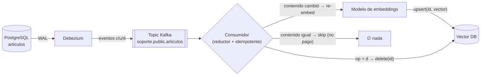
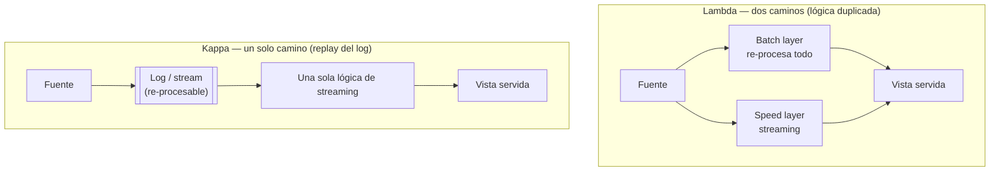

import Reto from "@components/Reto.astro";
import Solucion from "@components/Solucion.astro";
import Quiz from "@components/Quiz.astro";
import CheckDominio from "@components/CheckDominio.astro";
import Nivel from "@components/Nivel.astro";

<Nivel nivel="avanzado" />

:::note[Esta sub-unidad es profundización opcional]
No está en la ruta crítica: puedes ser empleable en IA/Automatización sin dominar streaming en tiempo real. Está aquí porque **cierra el círculo datos→IA** —cómo mantener un RAG fresco *en cuanto el dato cambia*— y porque "CDC" y "kappa" son palabras que aparecen en JDs de gama alta. Trátala como el postre: deliciosa, no obligatoria. Si vas con el tiempo justo, salta a [7.7](/fase-7-automatizacion/7-7-agentes-automatizacion-ia/) y vuelve aquí cuando tu capstone necesite frescura real.
:::

En [7.5d](/fase-7-automatizacion/7-5d-data-contracts-quality/) cerraste el sub-track de data engineering vigilando la **freshness** de tus datos —medida en horas— con observabilidad. Y en [6.7 (RAG)](/fase-6-ai-engineering/) construiste un sistema que carga documentos, los chunkea, los embeddea y los indexa para que un LLM responda sobre ellos. Esta lección une las dos puntas con la pregunta que casi nadie conecta: **cuando el dato fuente cambia, ¿cómo se entera tu índice de RAG —en segundos, no en la próxima corrida nocturna— sin re-embeddear el corpus entero cada noche?**

La respuesta es **CDC (Change Data Capture)**: en vez de preguntarle a la base de datos "¿qué cambió?" cada cierto tiempo (polling), lees el **log de transacciones** de la propia base —el mismo registro que usa para replicarse— y reaccionas a cada cambio en cuanto ocurre. Cada `INSERT`/`UPDATE`/`DELETE` se vuelve un **evento** que viaja por un stream y dispara el re-embedding de *solo lo que cambió*. Eso transforma un RAG que miente el martes (porque su data es del lunes) en uno que está fresco al segundo.

:::tip[Si ya tocaste integraciones o pipelines (n8n, un cron de sync, un webhook)]
Quizás ya sincronizaste dos sistemas con un cron que corre `SELECT ... WHERE updated_at > :ultima_vez` cada 5 minutos, o con un webhook que avisa "algo cambió". Esa intuición sirve, pero tiene **tres agujeros** que CDC tapa y que te van a preguntar: el polling **no ve los DELETE** (una fila borrada no aparece en un `WHERE updated_at`), **pierde estados intermedios** (si una fila cambió 3 veces entre dos corridas, solo ves la última), y **carga la base** con queries repetidas. CDC lee el log —donde *todo* cambio queda registrado, incluidos los borrados, en orden— sin tocar las tablas. La pregunta que te separa del resto: *si en tu RAG borras un documento de la fuente, ¿sigue siendo recuperable y citado por el LLM una semana después?* Si no sabes responder, esta lección es para ti igual que para quien parte de cero. Lee el ejemplo resuelto (sección 4) y salta al ejercicio (sección 7): construirás el reductor de eventos a mano.
:::

## 1. Qué vas a saber hacer

Al terminar, sin IA y sin notas, podrás:

- **O1 — Explicar qué es CDC y por qué lee el log (no hace polling)**: contrastar CDC *log-based* (leer el WAL/binlog) contra polling/diff, nombrar sus tres ventajas (ve los DELETE, no pierde estados intermedios, no carga la fuente), y **leer un change event de Debezium** (`op` c/u/d/r, `before`, `after`, `source`) para decidir qué hacer con el índice de un RAG.
- **O2 — Diseñar el pipeline CDC → re-embedding que mantiene un RAG fresco**: mapear cada operación (insert/update/delete) a una acción en el vector DB (upsert / delete), garantizando **idempotencia** (el mismo evento dos veces no rompe nada), **debounce/dedup** (colapsar cambios redundantes) y **borrado real** (propagar el delete), y argumentar el trade-off **frescura vs costo/latencia** (no re-embeddear lo que no cambió).
- **O3 — Explicar el trade-off arquitectónico de streaming**: distinguir **kappa vs lambda**, ubicar dónde encaja la arquitectura **medallion** y un **table format** (Iceberg/Delta) en un pipeline de streaming, y **argumentar cuándo CDC+streaming NO vale la pena** (el criterio honesto de "profundización opcional").

## 2. Por qué importa (el dinero está aquí)

> 💰 **Por qué importa:** el problema #1 de un RAG en producción no es el modelo: es que **su data envejece**. El demo funciona el día de la presentación —el corpus está fresco— y dos semanas después el sistema responde, con total seguridad, precios viejos, políticas derogadas o documentos ya borrados. El ingeniero junior le echa la culpa al LLM ("alucina"); el semi-senior dice "mi pipeline de ingest tiene freshness de 24 h porque re-indexo por cron de madrugada". El que cobra el premium dice algo distinto: *"capturo los cambios de la fuente con CDC y re-embeddeo solo lo que cambió, así el índice está fresco en segundos y pago embeddings proporcionales a los cambios, no al tamaño del corpus"*. Esa frase —que conecta data engineering (CDC, streaming) con AI engineering (RAG, embeddings, costo de tokens)— es exactamente el cruce de los dos pilares del curso, y es un nicho con poca gente que lo sepa explicar bien. En 2026, con la **arquitectura kappa** ganando terreno como base de la IA agéntica en tiempo real, "mantener el contexto de la IA fresco con streaming" pasó de exótico a requisito en los roles que pagan en USD.

Tres razones lo vuelven una palanca de carrera (aunque sea opcional):

1. **Es el puente más vendible entre data e IA.** El mercado separa "Data Engineer" (mueve datos) y "AI Engineer" (llama LLMs) como tribus. CDC→re-embedding es el lugar donde se tocan: el *ingest fresco* de un RAG **es** un problema de streaming de datos. Quien lo domina resuelve el envejecimiento del RAG, que es la causa raíz de la mitad de las "alucinaciones" en producción.
2. **El polling te delata como junior; CDC te marca como senior.** Cualquiera escribe un cron con `WHERE updated_at > x`. Saber *por qué eso no basta* —que no ve borrados, que pierde estados intermedios, que escala mal— y elegir CDC (o justificar por qué *no* lo necesitas) es criterio de ingeniería, no de herramienta. Es una pregunta de entrevista directa.
3. **Costo y latencia, medibles.** Re-embeddear un corpus de 100k chunks cada noche cuesta tokens (plata) y deja freshness de hasta 24 h. CDC re-embeddea *solo lo que cambió* —decenas, no cientos de miles— en segundos. Saber poner número a ese trade-off (USD/día batch vs USD/día CDC, freshness en horas vs segundos) es la conversación de un semi-senior, no de un tutorial.

## 3. Lo que ya traes (actívalo)

Esta lección ensambla hilos que ya tienes. Recupéralos antes de seguir:

- **De observabilidad de datos ([7.5d](/fase-7-automatizacion/7-5d-data-contracts-quality/)):** el pilar **freshness** ("¿qué tan recientes son los datos?"). Hoy bajas esa aguja de horas a segundos, y aprendes el mecanismo que lo permite.
- **De confiabilidad de integración ([7.2](/fase-7-automatizacion/7-2-integracion-confiabilidad/)):** **at-least-once, idempotency keys, DLQ y replay**. CDC entrega *at-least-once* (el mismo cambio puede llegarte dos veces tras un reinicio), así que tu consumidor **debe ser idempotente** — exactamente el reflejo que entrenaste ahí.
- **De RAG ([6.7](/fase-6-ai-engineering/)):** el pipeline de ingest (cargar → chunkear → embeddear → indexar) y el `upsert`/`delete` por id en el vector DB. Hoy le pones un **disparador en tiempo real** delante: ya no ingieres "todo cada noche", sino "lo que cambió, cuando cambió".
- **De ELT y medallion ([7.5a](/fase-7-automatizacion/7-5a-elt-modelado-analitico/)):** las capas bronze/silver/gold. Hoy descubres que medallion es **ortogonal** al modo (batch o streaming): puedes refinar en capas *dentro* de un stream.

Antes de seguir, responde de memoria:

<Quiz
  question="Tienes un RAG sobre el catálogo de productos de una tienda. Hoy lo mantienes fresco con un cron que cada noche re-embeddea TODO el catálogo (80.000 productos). Un producto se descontinúa y se borra de la base a las 9:00 AM. ¿Cuál es el problema más grave de tu enfoque actual, además del costo?"
  options={[
    "Ninguno: re-embeddear todo cada noche garantiza que el índice siempre esté correcto",
    "Hasta la corrida nocturna (hasta ~15 h después), el RAG sigue recomendando y citando un producto que ya no existe; y dependiendo de cómo re-indexes, un borrado podría no propagarse nunca al vector DB si solo haces upsert de lo que SÍ está",
    "El problema es solo de performance de la query nocturna; un índice en la tabla lo resuelve",
  ]}
  answer={1}
  explanation="Dos males. (1) Freshness: el dato malo (producto fantasma) vive en el índice hasta la próxima corrida —hasta 15 h de un RAG mintiendo con seguridad—. (2) El borrado: si tu re-index hace 'upsert de cada fila que existe', una fila BORRADA nunca aparece en ese SELECT, así que jamás se quita del vector DB y queda recuperable para siempre. CDC ve el DELETE en el log y propaga la baja en segundos. El costo (re-embeddear 80k cada noche) es el tercer mal, pero la freshness y el borrado fantasma son los que rompen la confianza del usuario."
/>

## 4. Ejemplo resuelto, pensado en voz alta

Voy a llevarte por todo el camino —qué es CDC, cómo se lee un evento, cómo se arma el pipeline y qué arquitectura lo sostiene— sobre un caso concreto, **razonando cada decisión como me oirías al lado tuyo**. El caso: una tabla `articulos` en PostgreSQL alimenta un RAG de soporte. Cuando un artículo cambia o se borra, el índice del RAG debe enterarse al toque.

### 4.1 Qué es CDC (y por qué lee el log, no hace polling)

**Change Data Capture** es la técnica de **capturar los cambios de una base de datos a medida que ocurren** y exponerlos como un stream de eventos. La variante que importa es **log-based CDC**: en vez de consultar las tablas, **lees el log de transacciones** que la base ya escribe para sí misma —el **WAL** (Write-Ahead Log) en PostgreSQL, el **binlog** en MySQL, el oplog en MongoDB—. Ese log es la fuente de verdad de *todo* lo que pasó, en orden.

Compáralo con el polling ingenuo, que es lo que casi todos hacen primero:

| | **Polling / diff** (`WHERE updated_at > x`) | **CDC log-based** (leer el WAL/binlog) |
|---|---|---|
| ¿Ve los `DELETE`? | **No** — una fila borrada no aparece en ningún `SELECT` | **Sí** — el borrado queda en el log como evento `d` |
| ¿Pierde estados intermedios? | **Sí** — si cambió 3 veces entre corridas, ves solo la última | **No** — cada cambio es un evento (puedes colapsarlos *tú*, a propósito) |
| Carga sobre la fuente | Query repetida cada N segundos sobre tablas vivas | Casi nula — lee un log que ya se escribe |
| Latencia (freshness) | = intervalo de polling (minutos) | Sub-segundo a segundos |
| Requiere columna `updated_at` confiable | Sí (y aun así no ve borrados) | No |

*Razono en voz alta:* el agujero que mata es el **DELETE**. Un RAG que solo "sincroniza lo que existe" (upsert de cada fila del `SELECT`) **nunca** se entera de una baja, y el documento fantasma queda recuperable para siempre. CDC lee el log, donde el borrado es un evento de primera clase. Por eso, para mantener un RAG honesto, CDC no es un lujo: es lo que cierra ese agujero.

> **La idea de un solo golpe:** el polling le *pregunta* a la base "¿qué hay ahora?"; CDC *escucha* el diario donde la base anota "qué hizo". El primero infiere cambios comparando fotos; el segundo lee la película.

### 4.2 Leer un change event de Debezium

La herramienta de referencia para log-based CDC es **Debezium**: un conjunto de conectores (PostgreSQL, MySQL, MongoDB, SQL Server...) que leen el log y publican cada cambio como un evento. Cada evento trae un **envelope** con una forma estable que debes saber leer. Así se ve un `UPDATE` sobre `articulos` (recortado a lo esencial):

```json
{
  "op": "u",
  "before": { "id": 42, "titulo": "Política de envíos", "contenido": "Enviamos en 5 días.", "version": 7 },
  "after":  { "id": 42, "titulo": "Política de envíos", "contenido": "Enviamos en 2 días.", "version": 8 },
  "source": { "db": "soporte", "table": "articulos", "lsn": 240118934, "ts_ms": 1782305012345 },
  "ts_ms": 1782305012410
}
```

Las piezas que importan:

- **`op`** — la operación. Los códigos son: **`c`** create (insert), **`u`** update, **`d`** delete, **`r`** read (una fila leída durante el *snapshot* inicial, cuando Debezium arranca y fotografía el estado actual antes de seguir el log), y los menos usados `t` (truncate) y `m` (logical message). Para tu pipeline, `c`/`r` y `u` son "upsert"; `d` es "delete".
- **`before` / `after`** — el estado de la fila **antes** y **después**. En un `c`, `before` es `null`. En un `d`, **`after` es `null`** (la fila ya no existe; usas `before` para saber qué se fue). Tener *ambos* es oro: puedes comparar y decidir si el campo que te importa (`contenido`) realmente cambió.
- **`source`** — de dónde vino: base, tabla, **`lsn`** (Log Sequence Number: la posición en el WAL, que te da el **orden** total de los cambios) y `ts_ms` del commit en la fuente.
- **`ts_ms`** (raíz) — cuándo Debezium *procesó* el evento (distinto del `source.ts_ms`, que es cuándo *ocurrió* en la base).

*Razono:* el `op` me dice *qué acción* tomar; comparar `before.contenido` vs `after.contenido` me dice *si vale la pena re-embeddear* (si solo cambió `version` y el `contenido` es idéntico, **no pago una llamada de embedding**); y el `lsn` me da el orden para colapsar varios eventos de la misma fila en una sola intención.

:::caution[Tras un DELETE, Debezium suele emitir un "tombstone"]
Después de un evento `d`, Debezium publica por defecto un segundo mensaje con la misma *key* y **valor `null`**: el **tombstone**. Sirve para que la *log compaction* de Kafka pueda borrar físicamente esa key. Tu consumidor debe **ignorar el tombstone** (o tratarlo como confirmación del delete), no confundirlo con un evento de datos. Es un detalle que delata a quien nunca consumió CDC de verdad.
:::

### 4.3 Las herramientas (qué es cada una)

No te cases con una; entiende qué rol juega cada pieza:

- **Debezium** — el *motor* de log-based CDC. Lee el WAL/binlog y produce los eventos. No vive solo: corre como un **conector dentro de Kafka Connect** (o embebido como librería Java, o vía Debezium Server hacia otros sinks).
- **Kafka Connect** — el *runtime* de conectores: un proceso que aloja "source connectors" (Debezium mete datos a Kafka) y "sink connectors" (sacan de Kafka a otro sistema). Le das config en JSON por su API REST. Así se ve la config de un conector Debezium para Postgres (claves verificadas, 2026):

```json
{
  "name": "articulos-cdc",
  "config": {
    "connector.class": "io.debezium.connector.postgresql.PostgresConnector",
    "plugin.name": "pgoutput",
    "database.hostname": "db",
    "database.port": "5432",
    "database.user": "cdc_user",
    "database.dbname": "soporte",
    "topic.prefix": "soporte",
    "slot.name": "debezium_articulos",
    "publication.name": "dbz_articulos",
    "table.include.list": "public.articulos"
  }
}
```

  - `plugin.name: pgoutput` es el plugin de *logical decoding* estándar de Postgres 10+ (no requiere instalar nada extra).
  - `slot.name` es el *replication slot*: el marcador que recuerda hasta dónde leíste el WAL (para no perder cambios tras un reinicio). **Ojo operativo:** un slot abandonado hace que Postgres **retenga WAL indefinidamente** y llene el disco — un clásico pie en la trampa de CDC en producción.
  - `table.include.list` restringe qué tablas capturas. Cada tabla se publica en su propio *topic* de Kafka (`soporte.public.articulos`).
- **Airbyte** — plataforma de **EL** (extract-load) que *usa Debezium por debajo* para sus fuentes con CDC, pero te lo presenta como conectores administrados (UI/API), sin que armes Kafka tú mismo. Es el camino de **menor fricción** si quieres CDC hacia un warehouse/destino sin operar infraestructura de streaming. El trade-off: menos control de la latencia y del stream que Debezium+Kafka crudos (Airbyte sincroniza en *batches* frecuentes, no evento-a-evento real).

> **Cómo elegir (regla práctica):** ¿necesitas reacción **evento-a-evento sub-segundo** y ya tienes (o toleras) Kafka? → **Debezium + Kafka Connect**. ¿Quieres CDC hacia un destino con **mínima operación** y toleras latencia de minutos? → **Airbyte**. ¿Tu corpus cambia pocas veces al día y la freshness de horas te sirve? → **ni CDC**: un job incremental programado (lo de [7.5c](/fase-7-automatizacion/7-5c-orquestador/)) es más simple y barato. Esa última opción es la honesta, y la que más gente olvida.

### 4.4 El pipeline CDC → re-embedding (el corazón de la lección)

Ahora ensamblamos: de un cambio en la base a un índice de RAG fresco. El flujo:



*Razono cada decisión del consumidor:*

1. **`c`/`r`/`u` con `after`** → la fila existe. Pero **antes de re-embeddear, comparo `before.contenido` vs `after.contenido`** (o contra lo ya indexado). Si el texto que se embeddea **no cambió** (solo cambió `version`, `updated_at`, un campo irrelevante), **no llamo al modelo de embeddings**: hacer un upsert del mismo vector es pagar tokens por nada. Esto es el hilo **costo/latencia** hecho código.
2. **`d`** → `delete(id)` en el vector DB. Es el paso que el polling nunca da. Sin esto, el documento fantasma queda recuperable.
3. **Idempotencia.** CDC es **at-least-once**: tras un reinicio del consumidor, el mismo evento puede llegar dos veces. Por eso uso el **id de la fila como clave de upsert/delete**: aplicar el mismo evento N veces deja el índice idéntico. (Mismo reflejo de las *idempotency keys* de [7.2](/fase-7-automatizacion/7-2-integracion-confiabilidad/).)
4. **Debounce / colapso.** Si una fila cambió 5 veces en 2 segundos (`c, u, u, u, u`), no quiero 5 re-embeddings: colapso a la **última intención** por clave dentro de la ventana y re-embeddeo **una vez**. Frescura sí, pero sin quemar tokens en estados intermedios que nadie verá.
5. **Eventos venenosos → DLQ.** Si un evento llega corrupto o el embedding falla de forma irrecuperable, va a una *dead-letter queue* (otra vez [7.2](/fase-7-automatizacion/7-2-integracion-confiabilidad/)), no bloquea el stream entero.

> **El insight que conecta todo:** re-embeddear con CDC es **O(cambios)**; re-indexar por cron nocturno es **O(corpus)**. Si tu corpus tiene 100k chunks y cambian 200 al día, el cron paga 100k embeddings/noche con freshness de 24 h; CDC paga 200 con freshness de segundos. La diferencia de costo *y* de calidad apunta en la misma dirección — cuando el corpus es grande y cambia poco respecto de su tamaño. (Cuando cambia *todo* todo el rato, la cuenta cambia: ver 4.5.)

### 4.5 La arquitectura: kappa vs lambda, medallion y table formats

Para sostener esto a escala hay decisiones de arquitectura. Tres conceptos que debes poder defender:

**Lambda vs Kappa.** Son dos formas de estructurar un sistema de datos:

- **Lambda** = **dos caminos**: una *batch layer* (re-procesa todo, lento pero correcto/completo) **más** una *speed layer* (streaming, rápido pero aproximado), y luego fusionas ambas. Problema: **mantienes la misma lógica escrita dos veces** (en el motor batch y en el de streaming), con el riesgo de que diverjan.
- **Kappa** = **un solo camino**: *todo* es un stream. Si necesitas re-procesar el histórico, **reproduces (replay) el log desde el inicio** por el mismo código de streaming. Una sola lógica, una sola fuente de verdad (el log). En 2026, con los table formats abaratando el replay, kappa dejó de ser nicho y es base común de pipelines en tiempo real y de IA agéntica.



*Razono:* para CDC→RAG, **kappa es el ajuste natural**: el log de CDC *ya es* tu stream re-procesable. ¿Cambiaste el modelo de chunking o de embeddings y quieres re-indexar todo? **Replay del topic** desde el inicio por el mismo consumidor. No mantienes un "job batch" aparte con lógica gemela que se desincroniza.

**Medallion es ortogonal al modo.** En [7.5a](/fase-7-automatizacion/7-5a-elt-modelado-analitico/) viste bronze/silver/gold como capas de refinamiento. Error común: creer que medallion = batch. **No**: puedes tener bronze (eventos CDC crudos), silver (limpios/deduplicados), gold (chunks listos para embeddear) **dentro de un stream**. Medallion responde "¿qué tan refinado está el dato?"; kappa/lambda responde "¿por cuántos caminos fluye?". Son ejes distintos.

**Table formats (Iceberg / Delta).** Un *table format* le da a archivos en un data lake (Parquet) las garantías de una tabla de base de datos: **transacciones ACID, upserts/deletes, evolución de esquema, time-travel**. En 2026 el panorama:

| Formato | Fortaleza | Cuándo |
|---|---|---|
| **Apache Iceberg** | Estándar de facto: gobernanza vendor-neutral, soporte multi-motor amplio, partition evolution | Lakehouse abierto, varios motores (Flink/Spark/Trino) |
| **Delta Lake** | Operacionalmente simple, integración profunda con Spark/Databricks | Si vives en el ecosistema Databricks |
| **Apache Paimon** | Optimizado para CDC y streaming en tiempo real | Upserts de altísima frecuencia desde un stream |

Lo relevante para esta lección: como estos formatos soportan **ACID + upsert/delete eficientes**, el *lake* puede actuar a la vez como **sink y source de streaming** — el patrón que el mercado llama **"Kappa Plus" / streamhouse**. Es lo que hace barato el replay que kappa necesita: tu histórico de cambios vive en una tabla Iceberg/Delta que puedes re-leer como stream.

> **La honestidad de "opcional":** todo esto (Kafka, Debezium, slots, table formats) es **operacionalmente pesado**. Para un corpus que cambia un puñado de veces al día, montar streaming es *over-engineering* caro: un job incremental programado te da freshness de minutos con una fracción de la complejidad. CDC+streaming gana cuando (a) la freshness importa de verdad en segundos, **y** (b) el volumen de cambios justifica la infraestructura. Saber decir *"aquí no vale la pena CDC"* es tan senior como saber montarlo.

## 5. Errores y malentendidos frecuentes

:::caution[Podrías pensar... pero está mal]
**"Hacer polling cada minuto con `WHERE updated_at > :ultima_vez` es básicamente CDC."**
No. El polling **no ve los DELETE** (una fila borrada no sale en ningún `SELECT`), **pierde estados intermedios** (si cambió 3 veces, ves 1), **carga la base** con queries repetidas, y depende de que *toda* escritura toque `updated_at` confiablemente (un `UPDATE` que olvida esa columna se vuelve invisible). CDC lee el log, donde todo cambio —incluido el borrado— queda registrado en orden. El polling es una aproximación; CDC es la película completa.
:::

:::caution[Podrías pensar... pero está mal]
**"Re-embeddeo el corpus entero cada noche y listo, siempre está correcto."**
Funciona a escala chica, pero tiene dos costos que escalan mal: **freshness de hasta 24 h** (el RAG miente entre corridas) y **costo O(corpus)** (pagas embeddings por 100k chunks aunque cambien 50). Y un tercer riesgo silencioso: si tu re-index hace "upsert de cada fila existente", **los borrados nunca se propagan** (una fila borrada no aparece en el SELECT) y quedan fantasmas en el índice. CDC re-embeddea O(cambios) en segundos y ve los borrados.
:::

:::caution[Podrías pensar... pero está mal]
**"Cada evento CDC = un re-embedding."**
Caro y casi siempre innecesario. Un `UPDATE` puede tocar `version`, `updated_at` o un campo que **no entra al embedding**. Re-embeddear porque "cambió la fila" es pagar tokens por un vector idéntico. La regla: **re-embeddea solo si el *texto que se embeddea* cambió** (compara `before.contenido` vs `after.contenido`, o un hash del contenido). El resto: a lo sumo un upsert de metadata, sin tocar el modelo.
:::

:::caution[Podrías pensar... pero está mal]
**"CDC entrega cada cambio exactamente una vez, así que no necesito idempotencia."**
Falso y peligroso. CDC (y Kafka) son **at-least-once**: tras un reinicio del consumidor o un rebalanceo, el mismo evento **puede reprocesarse**. Si tu manejo no es idempotente, podrías duplicar chunks, re-embeddear de más o aplicar un delete sobre algo ya borrado y romper. Usa el **id de la fila como clave** de upsert/delete: aplicar el mismo evento N veces deja el índice idéntico. *Exactly-once* end-to-end existe pero es caro y frágil; idempotencia + at-least-once es el patrón sano.
:::

:::caution[Podrías pensar... pero está mal]
**"Kappa y lambda son 'lo viejo vs lo nuevo', y medallion es otra forma de decir batch."**
Dos confusiones. (1) Lambda no es "malo": es batch+streaming en paralelo, válido cuando necesitas re-procesamiento batch garantizado *y* baja latencia, al costo de **lógica duplicada**. Kappa simplifica a un camino con replay, pero no siempre es viable. (2) **Medallion es ortogonal**: bronze/silver/gold describe *cuán refinado* está el dato y puede vivir dentro de un stream (kappa) o de un batch. No es sinónimo de batch.
:::

## 6. Práctica con andamiaje (que se desvanece)

Antes del ejercicio grande, una micro-predicción. El reductor de eventos es el núcleo del pipeline; la idea ("colapsa varios eventos de una fila a su intención final, idempotente, sin re-embeddear lo que no cambió") es nueva, así que vamos a *predecir* antes de implementar — que es pensar primero.

### 6.1 Predict (sin ejecutar)

El consumidor recibe, **en orden**, esta tanda de eventos CDC para el RAG. El índice ya tiene indexado `{ "a": "Hola", "b": "Mundo" }` (clave → contenido embeddeado). Cada evento es `(op, key, contenido_after)`. **Predice la lista mínima, idempotente y debounced de tareas** (`UPSERT(key, contenido)` o `DELETE(key)`) que un consumidor correcto debería emitir — antes de leer la respuesta.

```text
indexado previo: { "a": "Hola", "b": "Mundo" }

eventos (en orden):
1. (u, "a", "Hola, qué tal")     # a cambia de contenido
2. (u, "a", "Hola de nuevo")     # a vuelve a cambiar (mismo lote)
3. (d, "b", None)                # b se borra
4. (c, "c", "Soy nuevo")         # c nace
5. (d, "c", None)                # ...y muere en el mismo lote
6. (u, "a", "Hola de nuevo")     # a "cambia" pero al MISMO valor que el evento 2
```

<Solucion title="Ver las tareas correctas (ábrelo solo tras predecir)">

Resultado mínimo (3 cosas que decidir bien):

1. **`UPSERT("a", "Hola de nuevo")`** — los eventos 1, 2 y 6 colapsan a **una** intención: la última (`"Hola de nuevo"`). No emites 3 upserts: **debounce** a la final. Y como `"Hola de nuevo"` **difiere** del indexado previo (`"Hola"`), sí hay que re-embeddear. (El evento 6 no agrega nada: el estado final ya era ese valor — idempotencia.)
2. **`DELETE("b")`** — `b` estaba indexado y se borró. **Hay que propagar el delete** (si no, queda fantasma).
3. **Nada para `c`** — nació (evento 4) y murió (evento 5) **dentro del mismo lote**, y **no estaba indexado antes**. Su estado final es "borrado" y nunca llegó al índice → **ninguna tarea** (ni upsert ni delete). Emitir un `DELETE("c")` sería un delete sobre algo que no existe: inofensivo si tu vector DB lo ignora, pero ruido innecesario.

Lista final (ordenada por clave para que sea determinista — `"a"` antes que `"b"`): `[UPSERT("a", "Hola de nuevo"), DELETE("b")]`.

**Lección:** colapsar a la intención final (debounce) + propagar borrados + no re-embeddear lo ya indexado igual + ignorar las filas que nacen y mueren dentro del lote. Eso es exactamente lo que vas a implementar.

</Solucion>

## 7. Ejercicios Primero-Sin-IA

Dos ejercicios. El primero (código) construye el corazón del pipeline; el segundo (diseño) entrena el criterio arquitectónico que separa "monto Kafka porque suena bien" de "elijo la herramienta por la restricción".

### 7.1 — El reductor CDC → re-embedding (código)

Construyes **a mano** el reductor que viste predecir: de una tanda de eventos CDC a la lista mínima de tareas para el vector DB. Sin Kafka, sin Debezium real: implementas la *lógica* que vive en cualquier consumidor, en Python puro. La carpeta `ejercicios/fase-7/cdc-reductor-reembedding/` de tu repo trae el esqueleto (dataclasses, contrato de la función y una suite de tests que debe quedar en verde).

<Reto title="Reductor CDC: de eventos de cambio a tareas mínimas de re-embedding" timebox="45 min">

**Contexto.** Un stream CDC te entrega eventos de cambio de la tabla `articulos`, **en orden** (por `lsn`). Cada artículo, si existe, tiene un campo `contenido` que es **lo que se embeddea**. Tu reductor recibe la tanda de eventos y el estado **ya indexado** en el vector DB (`{id: contenido_embeddeado}`), y produce la lista **mínima, idempotente y debounced** de tareas.

**Parte obligatoria (nivel "competente"):** completa `reducir(eventos, indexado)` en `reductor.py` para que devuelva una lista de `Tarea(accion, key, contenido)` donde `accion ∈ {"upsert", "delete"}`, cumpliendo:

1. **Colapso/debounce:** varios eventos de la misma `key` se reducen a **su intención final** (la última por orden). Una sola tarea por key, como máximo.
2. **Mapeo de op:** `c`/`r`/`u` → la fila existe con su `contenido` final; `d` → la fila se borró.
3. **Propagar delete:** si una key terminó **borrada** y **estaba en `indexado`** → `DELETE(key)`.
4. **Nace y muere en el lote:** si una key terminó borrada pero **no estaba en `indexado`** → **ninguna tarea**.
5. **No re-embeddear lo igual (costo):** si una key existe con `contenido` final **idéntico** al de `indexado` → **ninguna tarea** (no pagues un embedding por un vector idéntico).
6. **Upsert cuando corresponde:** si una key existe con `contenido` **distinto** del indexado (o no estaba indexada) → `UPSERT(key, contenido)`.
7. **Determinismo:** la lista sale **ordenada por `key`** (para que el mismo input dé siempre el mismo output — clave para tests e idempotencia).

Deja **todos los tests en verde**:

```bash
pip install pytest        # si no lo tienes
pytest -v
```

**Parte de profundización (nivel "excelente" — aplica los hilos transversales):**

8. **Idempotencia explícita:** agrega un test que pase **la misma tanda dos veces** (concatenada) y verifique que el resultado es idéntico a pasarla una vez — porque CDC es at-least-once.
9. **Ignorar tombstones:** acepta eventos con `op == "d"` y `after == None` sin reventar, y (si quieres) un evento *tombstone* puro (valor nulo) que se ignora.
10. **Observabilidad mínima:** que el resultado o un helper exponga un resumen tipo métrica (`upserts`, `deletes`, `skips_por_contenido_igual`) — la base de lo que emitirías como traza del pipeline.
11. **`WRITEUP.md` (4–6 líneas):** ¿por qué el reductor debe ser idempotente (qué garantiza CDC)? Y conecta con costo: ¿qué regla de tu reductor evita quemar tokens de embedding, y cuánto ahorra frente a "re-embeddear cada evento"?

**Criterios de "hecho" (Definition of Done del ejercicio):**

- [ ] `pytest -v` en verde (colapso, delete propagado, nace-y-muere, contenido igual, upsert, orden).
- [ ] Un mismo evento aplicado dos veces deja el índice **idéntico** (idempotencia).
- [ ] Un artículo **borrado** que estaba indexado produce `DELETE`; uno borrado que **no** estaba indexado no produce nada.
- [ ] Un `UPDATE` cuyo `contenido` **no cambió** respecto del índice **no** produce tarea (ahorro de costo).
- [ ] Agregaste **al menos un test propio** con un caso borde (tanda vacía, key que solo cambia metadata, etc.).
- [ ] Puedes **explicar sin notas:** por qué idempotencia + debounce + propagar deletes son obligatorios, y el trade-off costo/freshness.

**Primero-Sin-IA:** resuélvelo solo, a mano (timebox arriba). Solo después consulta la [documentación de Debezium sobre eventos de cambio](https://debezium.io/documentation/reference/stable/connectors/postgresql.html#postgresql-events) para ver el envelope real. **Solo al final**, usa IA para *revisar y explicar* tu solución — nunca para generarla. Mañana, reescribe `reducir` de memoria: si no puedes, no lo aprendiste todavía.

</Reto>

<Solucion title="Pista inline (ábrela solo si superaste el timebox)">

No es la solución de referencia — es una pista para destrabarte:

- **Dos pasadas, no una.** Primera pasada: recorre los eventos *en orden* y construye el **estado final por key** (un `dict`): para `c`/`r`/`u` guarda `("vivo", contenido_after)`; para `d` guarda `("muerto", None)`. El último evento de cada key gana — eso *es* el debounce.
- **Segunda pasada: decide la tarea** comparando el estado final con `indexado`:
  - `muerto` + estaba en `indexado` → `DELETE`. `muerto` + no estaba → nada.
  - `vivo` + contenido == `indexado.get(key)` → nada (no re-embeddees lo igual).
  - `vivo` + contenido distinto (o key nueva) → `UPSERT`.
- **El `contenido` para `c`/`u`/`r`** sale de `evento.after["contenido"]`. Para `d`, `after` es `None` — no lo necesitas (solo te importa la key).
- **Determinismo:** itera las keys con `sorted(estado_final)` al construir la lista.
- **Idempotencia gratis:** como reduces al *estado final*, repetir eventos no cambia el resultado. Verifícalo con el test del punto 8.

Revisa la sección 4.4 de esta lección antes de mirar nada más.

</Solucion>

### 7.2 — Diseña la arquitectura de frescura de IA (a mano, sin código)

<Reto title="¿CDC o batch? Diseña la frescura de dos RAGs y justifica por la causa" timebox="35 min">

**Modalidad: a mano (sin código, sin IA).** Se mide tu **criterio de arquitectura**, no la prosa. Entrega `diseno.md`.

Carpeta del ejercicio: `ejercicios/fase-7/cdc-arquitectura-frescura/`

**Dos escenarios, decisiones opuestas (esa es la gracia):**

- **Escenario A — RAG legal.** Corpus de ~3.000 documentos de políticas internas. Cambian **~5 veces al día**. Requisito de compliance: si una política se deroga, el RAG **no puede** seguir citándola; pero una latencia de **minutos** es aceptable.
- **Escenario B — RAG de catálogo.** ~80.000 SKUs. Precios y stock cambian **miles de veces por minuto**. Un agente de ventas consulta el RAG en vivo: una respuesta con precio viejo **cuesta plata** y la freshness importa en **segundos**.

**Tu tarea — `diseno.md` con cuatro secciones:**

1. **Decisión por escenario.** Para A y para B, elige **batch incremental programado** (estilo [7.5c](/fase-7-automatizacion/7-5c-orquestador/)) **vs CDC+streaming** (Debezium/Kafka). Justifica **por la causa** (volumen de cambios, requisito de freshness, costo operativo), no por la moda. Pista honesta: las respuestas no son la misma.
2. **kappa vs lambda.** Para el escenario donde elegiste streaming, ¿armarías kappa (un camino + replay) o lambda (batch+speed)? ¿Por qué? ¿Cómo re-indexarías todo el corpus si cambias el modelo de embeddings?
3. **Table format.** ¿Un table format (Iceberg/Delta) **gana su sitio** en alguno de los dos? Di en qué caso sí y en cuál es over-engineering, y por qué (replay barato vs complejidad).
4. **Modos de falla.** Para tu diseño de streaming, nombra cómo manejas: (a) un evento **fuera de orden**, (b) un **DELETE** (que no quede fantasma), (c) un **backfill/reproceso** del histórico, (d) un **evento venenoso**. Conecta cada uno con un concepto de [7.2](/fase-7-automatizacion/7-2-integracion-confiabilidad/) cuando aplique.

**Criterios de "hecho" (Definition of Done del ejercicio):**

- [ ] A y B tienen decisiones **distintas**, cada una justificada por su **causa** (no "CDC porque es mejor").
- [ ] La elección kappa/lambda está argumentada, incluido **cómo re-indexarías** (replay).
- [ ] La sección de table format distingue **cuándo sí / cuándo es over-engineering**.
- [ ] Los 4 modos de falla tienen un manejo concreto (deletes propagados, DLQ, idempotencia, replay).
- [ ] Puedes **explicar sin notas** por qué *no* siempre conviene CDC.

**Primero-Sin-IA:** decídelo solo (timebox arriba). Solo después contrasta con docs (Debezium, kappa). **Solo al final**, usa IA para *cuestionar* tu diseño, no para generarlo. Mañana, reconstruye de memoria la regla "cuándo CDC vale la pena".

</Reto>

<Solucion title="Pista inline (ábrela solo si superaste el timebox)">

- **Empieza por las dos preguntas que deciden todo:** ¿cuánto importa la freshness (minutos vs segundos)? y ¿cuánto cambia el dato respecto de su tamaño (poco vs mucho)? Cruza ambas: freshness laxa + pocos cambios → batch; freshness estricta + muchos cambios → streaming.
- **Escenario A:** corpus chico, pocos cambios/día, latencia de minutos OK → un job incremental que detecta cambios (incluido el borrado, con cuidado) cada pocos minutos basta; montar Kafka es over-engineering. El delete sí debes resolverlo explícito.
- **Escenario B:** volumen altísimo + freshness en segundos + plata en juego → CDC+streaming se justifica; aquí kappa + un table format para replay barato tienen sentido.
- **Modos de falla:** orden → usa `lsn`/offset; delete → propaga (no quede fantasma); backfill → replay del log o snapshot; venenoso → DLQ. No reinventes: son los reflejos de 7.2.

Revisa la sección 4.5 antes de mirar la solución de referencia.

</Solucion>

## 8. Check de dominio (active recall)

Cierra la lección y responde **sin volver atrás**. Si no puedes explicar uno, vuelve a su sección.

<CheckDominio items={[
  "Explicar, sin notas, qué es CDC log-based y sus tres ventajas sobre el polling (ve los DELETE, no pierde estados intermedios, no carga la fuente).",
  "Leer un change event de Debezium: qué significan op (c/u/d/r), before, after y source; y por qué after es null en un delete.",
  "Describir el pipeline CDC → re-embedding y las cuatro reglas del consumidor: mapear op, idempotencia, debounce, propagar deletes.",
  "Explicar por qué NO se debe re-embeddear en cada evento (costo) y cómo se decide cuándo sí (cambió el texto que se embeddea).",
  "Distinguir kappa de lambda (un camino + replay vs batch+speed con lógica duplicada) y por qué kappa encaja con CDC→RAG.",
  "Explicar por qué medallion es ortogonal al modo (batch/streaming) y qué aporta un table format (Iceberg/Delta) al replay de kappa.",
  "Argumentar, con un caso, cuándo CDC+streaming es over-engineering frente a un job incremental.",
]} />

<Quiz
  question="Tu consumidor CDC reinicia por un deploy y, al volver, Kafka le re-entrega los últimos 200 eventos que ya había procesado (at-least-once). Tu reductor hace upsert/delete por id de fila. ¿Qué pasa con tu índice de RAG?"
  options={[
    "Se corrompe: cada evento duplicado crea un chunk duplicado en el vector DB",
    "Nada malo: como upsert/delete usan el id de la fila como clave, aplicar los mismos eventos otra vez deja el índice idéntico. Eso es idempotencia, y es exactamente por qué CDC at-least-once es seguro si tu consumidor está bien diseñado",
    "El índice queda viejo: hay que re-embeddear todo el corpus tras cada reinicio",
  ]}
  answer={1}
  explanation="At-least-once significa que tras un reinicio/rebalanceo verás eventos repetidos — es la norma, no la excepción. La defensa NO es perseguir exactly-once (caro y frágil); es hacer el consumidor idempotente: upsert/delete por id de fila. Reprocesar el mismo evento converge al mismo estado. Por eso idempotencia + at-least-once es el patrón sano, y por qué el ejercicio te hace verificarlo pasando la tanda dos veces."
/>

## 9. Recursos (oficial primero)

- [Debezium — Connector for PostgreSQL](https://debezium.io/documentation/reference/stable/connectors/postgresql.html) · el conector, el envelope de eventos, `pgoutput`, slots y publications.
- [Debezium — Tutorial](https://debezium.io/documentation/reference/stable/tutorial.html) · levantar CDC end-to-end con Kafka Connect.
- [Kafka Connect — Documentación](https://kafka.apache.org/documentation/#connect) · el runtime de conectores source/sink.
- [Airbyte — Change Data Capture (CDC)](https://docs.airbyte.com/understanding-airbyte/cdc) · CDC administrado (usa Debezium por debajo).
- [Apache Iceberg — Docs](https://iceberg.apache.org/docs/latest/) · el table format estándar (ACID, time-travel, evolución de esquema).
- [Delta Lake — Docs](https://docs.delta.io/latest/index.html) · table format del ecosistema Spark/Databricks.
- [Kafka — "Streams and Tables" / log compaction](https://kafka.apache.org/documentation/#compaction) · por qué existen los tombstones tras un delete.

:::note[El paisaje de herramientas en 2026 (no te cases con una)]
El **concepto** —leer el log en vez de hacer polling, mapear cambios a upsert/delete, idempotencia, debounce, replay— es estable y portable; las **herramientas** rotan. Hoy verás **Debezium** como motor de CDC (sobre **Kafka Connect**, o vía Debezium Server), **Airbyte** como CDC administrado de menor fricción, **Apache Iceberg** consolidado como table format estándar (con **Delta Lake** fuerte en Databricks y **Paimon** subiendo en streaming/CDC), y motores como **Flink** o **RisingWave** para la capa de streaming. No memorices APIs de todas: domina el modelo mental (qué ve CDC que el polling no; las cuatro reglas del consumidor; kappa vs lambda) y cualquier stack se vuelve "¿dónde escribo la misma idea aquí?".
:::

## 10. Conexión con el capstone de la fase

El [capstone de la Fase 7](/fase-7-automatizacion/proyecto/) es una automatización end-to-end agéntica. Esta lección es **profundización opcional** sobre él, pero te da una mejora de altísimo nivel si la integras:

- Si tu capstone usa un **RAG** para dar contexto al agente, CDC sobre la fuente de ese RAG es lo que lo mantiene **fresco en producción** — la diferencia entre un agente que decide sobre datos de hoy y uno que decide sobre datos de la semana pasada. Es la versión en tiempo real del gate de calidad de [7.5d](/fase-7-automatizacion/7-5d-data-contracts-quality/).
- El **reductor idempotente** que construyes aquí es el mismo reflejo del consumidor confiable de [7.2](/fase-7-automatizacion/7-2-integracion-confiabilidad/): at-least-once + idempotencia + DLQ. Lo que el capstone exige en su Definition of Done (idempotente, observable, con DLQ) aplica idéntico a un consumidor CDC.
- Si lo integras, **menciónalo en tu write-up de trade-offs** (DoD §8): "elegí CDC porque la freshness en segundos importaba y el volumen lo justificaba" — o, igual de valioso, "**no** usé CDC porque el corpus cambia 5 veces al día y un job incremental bastaba". Esa decisión defendida es señal de seniority.

Con esto cierras el sub-track de data engineering de la fase llevándolo a su frontera: de la freshness en horas ([7.5d](/fase-7-automatizacion/7-5d-data-contracts-quality/)) a la freshness en segundos. Lo siguiente, [7.7](/fase-7-automatizacion/7-7-agentes-automatizacion-ia/), pone el LLM en el centro del workflow de automatización.

## 11. Reflexión + spaced repetition

Escribe 4–6 líneas en tu `RETROSPECTIVA.md`:

- Antes de esta lección, ¿cómo habrías mantenido fresco un RAG? ¿Qué agujero (deletes, estados intermedios, costo) no habías considerado?
- ¿Cuál de las cuatro reglas del consumidor (mapeo, idempotencia, debounce, propagar deletes) te costó más entender, y por qué?
- Piensa en un sistema que conozcas (o tu capstone): ¿la freshness importa en segundos o en horas? ¿El volumen de cambios justifica CDC, o estarías sobre-ingenierizando?

**Gancho de repaso espaciado:**

- **Mañana (24 h):** reescribe de memoria la función `reducir` (las dos pasadas: estado final por key → decisión vs indexado). Corre los tests. Donde falles a la primera, ahí está el hueco real.
- **En 7 días:** dibuja de memoria el pipeline CDC → re-embedding (sección 4.4) con las cuatro reglas del consumidor, y di en voz alta la diferencia kappa vs lambda y cuándo medallion vive dentro de un stream.
- **Interleaving:** la próxima vez que toques un RAG (Fase 6) o un sync entre sistemas, pregúntate: "¿cómo se entera mi índice de un **borrado** en la fuente, y cuánto tarda?". El instinto de pensar en freshness y deletes —no solo en upserts— es lo que se queda.
