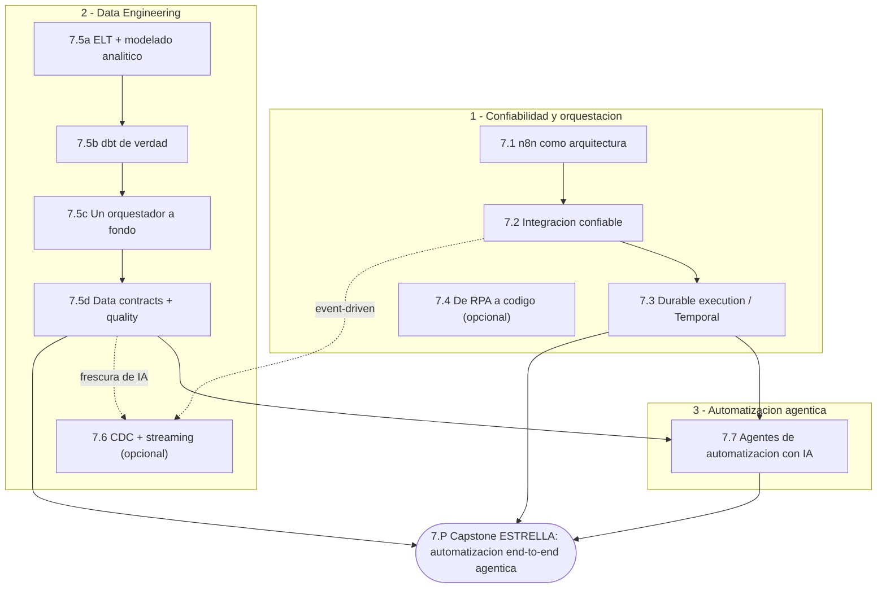
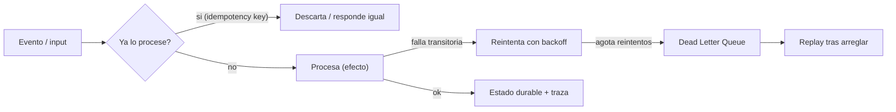

import Reto from "@components/Reto.astro";
import Solucion from "@components/Solucion.astro";
import CheckDominio from "@components/CheckDominio.astro";
import Nivel from "@components/Nivel.astro";

<Nivel nivel="avanzado" />

Esta es **la otra mitad de tu título**. La Fase 6 te hizo AI Engineer; la Fase 7
te hace **Automation Engineer** —y juntas te ponen en un nicho que en LATAM tiene
mucha demanda y poca competencia real. Pero ojo: "automatización" no es arrastrar
nodos hasta que un flujo corre **una vez** en la demo. Es diseñar sistemas que tu
empresa usa para mover dinero, datos y decisiones, y que **siguen funcionando** a
las 3 AM cuando el webhook llega dos veces, la API externa devuelve 503 y alguien
editó el flujo el viernes sin avisar.

El arco de la fase va en tres movimientos:

1. **Automatización confiable y orquestación** — empiezas en n8n y aprendes a
   tratarlo como software (idempotencia, reintentos, versionado), subes a
   **ingeniería de integración** (webhooks firmados, DLQ, outbox, replay) y
   coronas con **durable execution** (Temporal): workflows que sobreviven caídas y
   se reanudan exactos.
2. **Data Engineering de verdad** — el gap individual más grande del roadmap. ELT
   moderno y modelado analítico, **dbt** (modelos, `ref()`, tests, lineage), **un
   orquestador a fondo** (Dagster/Airflow) y **data contracts + calidad/observabilidad**
   de datos. Profundidad vía **un** pipeline de portafolio, no cinco herramientas
   sueltas.
3. **Automatización agéntica** — donde tus dos pilares chocan: workflows que usan
   un LLM para **clasificar, extraer, decidir y ejecutar** acciones en sistemas
   externos, con eval gate de agente, guardrails de entrada/salida, HITL y techo
   de costo. Aquí vive el **capstone estrella** de tu portafolio.

No es una fase de "conocer herramientas". Es donde demuestras que sabes construir
**sistemas que la gente confía en producción** —el salto que el mercado paga.

## Objetivos de la fase

Al cerrar la Fase 7 sabrás **hacer** esto (no solo "haber oído de ello"):

- **Diseñar** una integración **confiable**: idempotente, con manejo de fallos
  (reintentos con backoff, DLQ, outbox), webhooks verificados (HMAC + anti-replay)
  y reconciliación —y **explicar** por qué "corrió una vez" no es "corre confiable".
- **Decidir** la tecnología por la **restricción dominante**: cuándo un flujo se
  queda en n8n, cuándo se gradúa a código y cuándo necesita **durable execution**
  (Temporal), justificando con límites reales y no con gusto personal.
- **Construir** un pipeline de datos analítico end-to-end: ELT → modelado
  (star schema / medallion) → **dbt** con tests y lineage → orquestado, con
  **data contracts** y chequeos de calidad que fallan *antes* de contaminar el dato.
- **Ensamblar** una automatización **agéntica** segura: input → IA clasifica/extrae
  → decide → ejecuta, con **eval gate de agente**, guardrails I/O, HITL para
  acciones sensibles y techo de costo —y **defender** sus trade-offs con números.

:::tip[Por qué importa (relevancia de mercado)]
> 💰 La automatización es **la otra mitad de tu título** ("AI/Automation Engineer"),
y combinada con IA te pone en un nicho con poca competencia y alta demanda
corporativa en LATAM. Pero la honestidad de mercado importa: el 90% de quienes
ponen "n8n" o "automatizo procesos" en el CV entregan **flujos frágiles de happy
path**. El semi-senior que cobra el premium entrega automatizaciones
**idempotentes, observables, versionadas** y —lo más raro y valioso— **sabe
argumentar cuándo NO usar la herramienta de moda**. Y el Data Engineering formal
(dbt + orquestador + data contracts) es un skill **examinable y escaso** que casi
nadie del lado "IA" tiene. Tu palanca de sueldo no es saber más frameworks: es
construir lo que la gente confía en producción.
:::

## ¿Para quién es esta fase? (y qué necesitas antes)

Está escrita para **cero real** en automatización y data engineering: cada
concepto se enseña desde la intuición, con un ejemplo resuelto antes de pedirte
que lo hagas tú. Pero la Fase 7 **se apoya en las fases anteriores**. Antes de
entrar conviene que tengas:

- **Idempotencia y resiliencia** (reintentos con backoff, timeouts, idempotency
  keys) — [`3.14`](/fase-3-backend/3-14-idempotencia-resiliencia/). Es el cimiento
  de toda la primera mitad de esta fase.
- **APIs y auth (OAuth2)** — [Fase 3](/fase-3-backend/). Las integraciones que vas
  a endurecer hablan HTTP, llevan tokens y firman payloads.
- **Agentes, evals y seguridad LLM** — [Fase 6](/fase-6-ai-engineering/): el
  [agent loop a mano](/fase-6-ai-engineering/6-8-ai-agents/), el
  [eval-driven development](/fase-6-ai-engineering/6-9-eval-driven-development/) y
  [OWASP LLM/Agentic](/fase-6-ai-engineering/6-14-seguridad-llm/). El 7.7 los
  **aplica** a automatización; no los reenseña.

:::tip[Si ya lo tocaste]
Si vienes con experiencia (armaste flujos en n8n/Make/Zapier, moviste datos con
algún ETL, levantaste un agente), **no saltes en seco: valida**. La trampa del que
"ya lo usa" es haber construido **siempre el happy path** —el flujo que asume que
el webhook llega una vez, que la API nunca falla, que nadie edita en producción.
Haz el diagnóstico del final de esta página y resuelve un ejercicio Primero-Sin-IA
de las sub-unidades que crees dominar. Si lo cierras sin notas y puedes defender,
por ejemplo, **por qué reintentar sin idempotencia duplica facturas** o **por qué
un test de dbt no reemplaza un data contract**, marca la casilla y avanza. Si te
trabas, quédate: el "ya lo sé" era el happy path. La experiencia previa es un
**atajo de validación**, nunca un permiso para saltar a ciegas.
:::

## Mapa de la fase

La Fase 7 son **10 sub-unidades** de contenido más el capstone. No es una lista
plana: es un arco con dependencias. Primero confiabilidad y orquestación, luego
data engineering, y la **automatización agéntica** como convergencia de tus dos
pilares.

| # | Sub-unidad | Qué construyes / entiendes ahí |
|---|---|---|
| 7.1 | [n8n: de tool a arquitectura](/fase-7-automatizacion/7-1-n8n-arquitectura/) | Idempotencia/reintentos/error workflows; version control de flujos con Git, dev/prod, testing; **criterio de salida** del low-code. |
| 7.2 | [Ingeniería de integración + confiabilidad](/fase-7-automatizacion/7-2-integracion-confiabilidad/) | Webhooks/polling/eventos; at-least-once, idempotency keys, **DLQ, outbox, replay**, reconciliación; **HMAC + anti-replay**; OAuth2 flows. |
| 7.3 | [Durable execution / Temporal](/fase-7-automatizacion/7-3-durable-execution-temporal/) | Sagas, **replay determinista**, workers, versionado de workflows; agentes durables (backbone agentic 2026). |
| 7.4 | [De RPA a código](/fase-7-automatizacion/7-4-rpa-a-codigo/) 🔵 | Código vs low-code vs RPA; migración de legados; BPMN/UML al mínimo. **Profundización.** |
| 7.5a | [ELT moderno + modelado analítico](/fase-7-automatizacion/7-5a-elt-modelado-analitico/) | ELT vs ETL y por qué cambió; **star schema** / arquitectura **medallion** (bronze-silver-gold). |
| 7.5b | [dbt de verdad](/fase-7-automatizacion/7-5b-dbt/) | Modelos, `ref()`, tests (unique/not_null/relationships), sources, exposures, docs/**lineage**. |
| 7.5c | [Un orquestador a fondo](/fase-7-automatizacion/7-5c-orquestador/) | Dagster (asset-centric) o Airflow; el orquestador dispara dbt tras la ingesta; retries/backfills/schedules. |
| 7.5d | [Data contracts + data quality](/fase-7-automatizacion/7-5d-data-contracts-quality/) | Shift-left de calidad; Great Expectations / dbt tests; OpenLineage; freshness/volume/schema drift. |
| 7.6 | [CDC y streaming → frescura de IA](/fase-7-automatizacion/7-6-cdc-streaming/) 🔵 | Debezium/Kafka Connect/Airbyte → vector DB; re-embedding por cambios; Iceberg/Delta nociones. **Profundización.** |
| 7.7 | [Agentes de automatización con IA ★](/fase-7-automatizacion/7-7-agentes-automatizacion-ia/) | Workflows + LLMs: clasificación/extracción/routing; IDP agéntico; con **eval gate + guardrails + techo de costo + HITL**. |
| 7.P | [🛠️ Capstone — Automatización end-to-end agéntica ★](/fase-7-automatizacion/proyecto/) | **La estrella de tu CV.** Input → IA clasifica/extrae → decide → ejecuta en sistemas externos: idempotente, DLQ, observable, versionado, eval gate, guardrail I/O, techo de costo, HITL, durable. |

> 🔵 = **opcional / profundización**. Las sub-unidades **7.4** (RPA a código) y
> **7.6** (CDC/streaming) no son ruta crítica: puedes diferirlas sin romper el
> arco. Son la columna ancha que retomas según el rol objetivo (RPA si heredas
> legados; CDC si necesitas frescura de datos en tiempo real para IA). El resto
> son ruta crítica.

## El hilo que define la fase: confiabilidad + agéntico

Si te llevas **una** idea de la Fase 7, que sea esta: **el trabajo de ingeniería
empieza donde termina el happy path.** Un flujo que corre una vez en la demo no
está "casi listo"; está roto y todavía no te enteras. El semi-senior diseña para
el mundo real, donde los mensajes llegan **dos veces**, las dependencias **fallan**
y los procesos **se caen a mitad de camino**:

Ese mismo principio escala: **idempotencia** en 7.1/7.2, **replay determinista**
en Temporal (7.3), **tests + data contracts** que frenan el dato malo en
7.5b/7.5d, y **eval gate + guardrails** que frenan al agente que alucina en 7.7.
Es el mismo músculo —"no confíes; verifica antes de ejecutar"— aplicado a
workflows, datos y agentes.

:::caution[Misconception común]
"Si el flujo corrió en mi prueba, está listo para producción." Está mal: una
prueba feliz no toca el caso que rompe en producción —el evento duplicado, el 503
a las 3 AM, el proceso que muere a mitad de la saga. Y del lado de IA: "si el
agente respondió bien en tres ejemplos, ya está". También mal: el agente es no
determinista y degrada en silencio. **Sin idempotencia, sin DLQ, sin eval gate y
sin techo de costo, no tienes un sistema: tienes una demo con suerte.** Esta fase
te enseña a no confundir las dos cosas.
:::

## Checklist de avance

Marca una sub-unidad como completa **solo** cuando cumplas las tres condiciones
(criterio del roadmap): (a) entiendes el concepto **sin notas**, (b) hiciste el
ejercicio **sin IA**, y (c) lo **aplicaste** en el capstone.

- [ ] 7.1 — n8n: de tool a arquitectura + criterio de salida
- [ ] 7.2 — Ingeniería de integración + confiabilidad
- [ ] 7.3 — Durable execution / Temporal
- [ ] 7.5a — ELT moderno + modelado analítico
- [ ] 7.5b — dbt de verdad
- [ ] 7.5c — Un orquestador a fondo
- [ ] 7.5d — Data contracts + data quality/observability
- [ ] 7.7 — Agentes de automatización con IA ★
- [ ] 7.4 — De RPA a código *(opcional)*
- [ ] 7.6 — CDC y streaming → frescura de IA *(opcional)*
- [ ] 7.P — Capstone: automatización end-to-end agéntica (cumple el Definition of Done de abajo)
- [ ] `RETROSPECTIVA.md` de la fase escrita (qué aprendí, qué me costó, qué proyecto lo demuestra)

<CheckDominio
  title="Antes de dar la Fase 7 por cerrada, ¿puedes…?"
  items={[
    "Explicar por qué un consumidor at-least-once exige idempotencia, y nombrar dos formas de lograrla, sin notas",
    "Decidir ante un caso concreto si un workflow se queda en n8n, pasa a código o necesita Temporal, y justificar con la restricción dominante",
    "Describir el flujo ELT → dbt (con ref() y tests) → orquestador → data contract, y qué frena cada capa de calidad",
    "Defender por qué un agente que ejecuta acciones necesita eval gate + guardrail de salida + HITL + techo de costo, no solo un buen prompt",
    "Dibujar de memoria el patrón idempotencia → reintento → DLQ → replay que atraviesa toda la fase",
  ]}
/>

## Definition of Done (la vara del capstone)

Todos los capstones del curso comparten **un único** Definition of Done. En la
Fase 7 aplica **completo** y con el máximo rigor —es el proyecto donde convergen
endpoint, datos, IA y acciones sobre sistemas externos. Tu automatización está
**terminada** solo si cumple **todo**:

:::caution[Lo que aplica al Capstone F7 (automatización end-to-end agéntica)]
1. **Spec** inicial + **ADRs** de las decisiones clave (qué se queda en n8n vs código vs Temporal; modelo de IA; esquema de datos).
2. **Tests verdes** + lint en CI; calidad por aserciones reales (no % de cobertura); **tests de datos** (dbt/Great Expectations) si hay pipeline.
3. **Seguridad aplicada:** OWASP web (hay endpoints/webhooks: **HMAC + anti-replay**) + **OWASP LLM/Agentic** (Improper Output Handling, Excessive Agency); secret-scanning + dependency-scanning en el pipeline.
4. **Observabilidad instrumentada:** structured logs + correlation IDs + **trazas del call-chain** (incluido el del LLM) con tokens/latencia/costo por paso.
5. **(Toca IA) eval harness versionado del *agente*** (tool-call accuracy, trajectory, task completion) + número + **gate de regresión** + **budget de costo/latencia**. *(Gate central.)*
6. **(El agente ejecuta acciones)** validación de salida **antes** de ejecutar + *least-privilege* de tools + **HITL** para acciones sensibles + **techo de costo**.
7. **Confiabilidad de integración:** idempotente, **DLQ/replay**, reintentos con backoff; **durable** (sobrevive caídas) si la lógica tiene estado largo.
8. **Demo en vivo que CORRE** + **README en inglés** + **write-up público de trade-offs** (qué elegí, qué medí, qué falló).
9. **Conventional Commits** en todo el historial.
:::

:::note[Nota de portafolio (honesta) — esta es tu ESTRELLA]
El RAG-sobre-tus-docs de la [Fase 6](/fase-6-ai-engineering/proyecto/) es el
capstone **clásico** de IA, y por eso el 80% de los portafolios se parecen. Es
valioso y lo construiste allá —pero el proyecto que de verdad te diferencia es
**este**: el agéntico end-to-end con manejo de fallas. Hiring managers y
automation engineers coinciden: el agéntico con DLQ, eval gate y recuperación es
**el nicho menos copiado** y la narrativa de semi-senior que el homelab genérico
no tiene. Plan recomendado: ten el RAG de F6 sólido como base, y reserva tu
**estrella de CV** para este capstone. Lo confirmas explícitamente en el ejercicio
de abajo, y lo lleva a tu portafolio en [Track-0](/track-0-empleabilidad/).
:::

## Conexión con el capstone

Cada sub-unidad es una pieza de la **automatización agéntica end-to-end**:
7.1–7.2 te dan la confiabilidad de integración (idempotencia, DLQ, webhooks
firmados); 7.3 la durabilidad (sobrevivir caídas); 7.5a–7.5d el músculo de datos
si tu automatización alimenta o consume un pipeline analítico; **7.7 es donde la
IA entra a clasificar, decidir y ejecutar** con sus gates de seguridad y costo.
No estudias temas sueltos: ensamblas, pieza a pieza, el **proyecto estrella de tu
CV** —el que demuestra tus dos pilares (IA + Automatización) a la vez.

## Ejercicio de entrada: diagnóstico, plan y decisión de portafolio

Antes de la primera lección, orientarte. Como en toda portada, este ejercicio no
se corrige "bien o mal": se corrige por **honestidad, concreción y un trade-off
defendible**. Es tu *placement* y tu contrato para una fase densa que mezcla tres
mundos (integración, datos, agentes).

<Reto title="Diagnóstico de Fase 7 + decisión de capstone estrella" timebox="40 min">

Sin IA, deja **tres archivos markdown** en `ejercicios/fase-7/fase-7-index/`:

1. **`diagnostico.md`** — dos tablas:
   - **Prerrequisitos:** idempotencia/resiliencia (`3.14`), APIs+OAuth2 (Fase 3),
     agentes+evals+seguridad LLM (Fase 6). Para cada uno: `listo` · `a medias` ·
     `me falta`, y una línea de por qué (si algo falta, a qué fase/sub-unidad vuelves).
   - **Las 10 sub-unidades** (7.1, 7.2, 7.3, 7.4, 7.5a–d, 7.6, 7.7): tu nivel honesto
     `nuevo` · `lo reconozco` · `lo sé hacer sin notas`. La prueba para "lo sé
     hacer": ¿podrías, ahora, resolver un ejercicio del tema sin notas ni IA?
2. **`plan-fase-7.md`** — bloques semanales **concretos** (día/hora/duración), tu
   **ritual de repaso** (cuándo reescribes de memoria), y **qué difieres**: marca
   explícitamente si dejas 7.4 (RPA) y/o 7.6 (CDC) para después y por qué. Protege
   tiempo extra para lo que marcaste `nuevo`, sobre todo el bloque de Data
   Engineering (7.5a–d) si nunca tocaste dbt.
3. **`decision-capstone.md`** — confirma tu **estrella de portafolio**. El curso
   recomienda el agéntico de F7 por encima del RAG de F6: ¿lo adoptas o eliges
   distinto? Escribe **un trade-off defendible** (saturación del mercado, tu nicho,
   complejidad, tiempo) y nombra **tres puntos del Definition of Done** que prevés
   más difíciles (p. ej. eval gate de agente, HITL + techo de costo, DLQ/replay
   durable).

**Hecho significa:** los prerrequisitos están autoevaluados con plan de remediación
si falta alguno; las 10 sub-unidades tienen nivel defendible (no todo en "lo sé
hacer"); el plan tiene bloques reales y dice qué difieres; la decisión de capstone
trae **un trade-off**, no solo una preferencia, y nombra tres gates del DoD.

</Reto>

<Solucion title="Pista (ábrela solo si te trabas, no es la solución)">

No optimices por "parecer avanzado": optimiza por honestidad. Si nunca montaste un
pipeline con dbt o un eval de **agente** (no de RAG), esas filas son `nuevo` —y es
justo donde más valor vas a extraer, así que dales tiempo. Para el plan, busca lo
**sostenible**, no lo perfecto. Para la decisión de capstone: el curso te
recomienda el agéntico como estrella, pero la nota que vale es **por qué**, no
copiar la recomendación. Pregúntate qué pierdes al no elegir la otra opción: eso
es el trade-off. Una decisión `competente` hacia cualquiera de los dos vale lo
mismo si nombras el trade-off; una `de moda` sin argumento, no.

</Solucion>

### Cómo pedir la corrección

Cuando termines, pídele a tu IA:

> "Corrige `ejercicios/fase-7/fase-7-index/` usando el framework de `.ai/`. Sigue
> `INSTRUCCIONES-CORRECTOR.md`."

El corrector revisa la **honestidad** de tu autoevaluación, el **realismo** de tu
plan y si tu decisión de capstone trae un **trade-off**, no si "acertaste". No
existe una respuesta única correcta. Trabaja primero en `ejercicios/fase-7/fase-7-index/`
(la carpeta de tu repo); la solución de referencia es material del corrector y no
debes mirarla antes de intentarlo.

## Recursos

Prefiere siempre **documentación oficial** sobre tutoriales sueltos. Mantén una
lista viva en `articulos.md` dentro de cada sub-unidad.

- [n8n — documentación](https://docs.n8n.io/) — nodos, error workflows, source control y entornos (para 7.1).
- [Temporal — documentación](https://docs.temporal.io/) — durable execution, workflows, activities, workers (para 7.3).
- [dbt — documentación](https://docs.getdbt.com/) — modelos, `ref()`, tests, sources, exposures, lineage (para 7.5b).
- [Dagster — documentación](https://docs.dagster.io/) — orquestación asset-centric (para 7.5c; alternativa: [Apache Airflow](https://airflow.apache.org/docs/)).
- [Great Expectations](https://docs.greatexpectations.io/) y [OpenLineage](https://openlineage.io/docs/) — calidad y linaje de datos (para 7.5d).
- [Debezium](https://debezium.io/documentation/) — change data capture (para 7.6, opcional).
- [OWASP Top 10 for LLM Applications](https://genai.owasp.org/) — base de los guardrails del agente (para 7.7).

## Reflexión + repaso

:::note[Para tu RETROSPECTIVA.md]
¿Cuántos de los flujos que "ya sabías hacer" resultaron ser **happy path** sin
idempotencia, sin DLQ, sin manejo de fallas? Escribe dos. Esa brecha entre *que
corra una vez* y *que la empresa confíe en él* es exactamente el salto de
seniority que esta fase te enseña a dar.
:::

**Gancho de repaso:** vuelve a esta portada al cerrar **cada** sub-unidad y marca
su casilla. Al terminar 7.7 (agentes de automatización), reescribe **de memoria**
—sin abrir esta página— el patrón `idempotencia → reintento → DLQ → replay` y los
seis gates de IA/confiabilidad del Definition of Done (eval gate, validación de
salida, least-privilege, HITL, techo de costo, durabilidad). Si te falta alguno,
ahí tienes tu próximo repaso.
