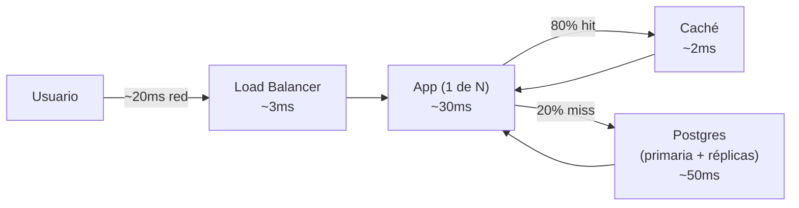
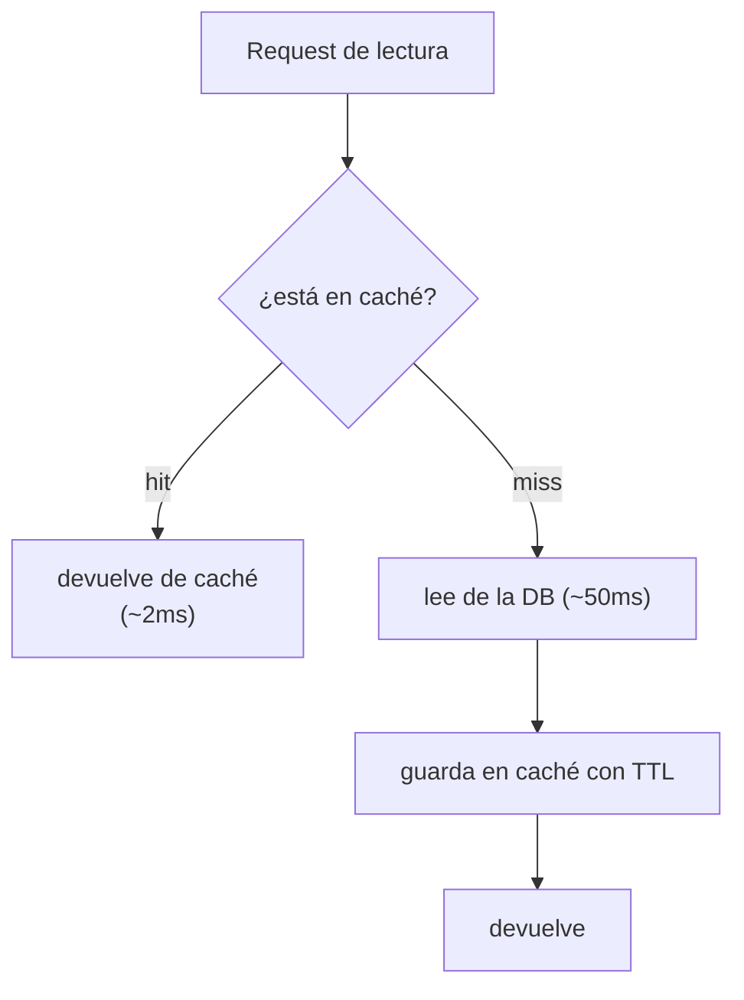
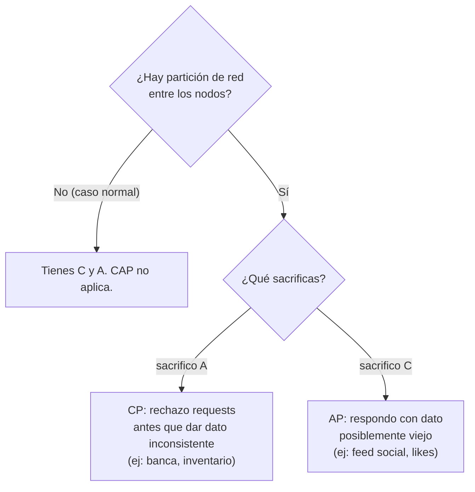

import Nivel from "@components/Nivel.astro";
import Reto from "@components/Reto.astro";
import Solucion from "@components/Solucion.astro";
import Quiz from "@components/Quiz.astro";
import CheckDominio from "@components/CheckDominio.astro";

<Nivel nivel="intermedio" />

Hasta aquí construiste *features*: una API que responde, un frontend que se ve bien, una
automatización que corre. **System design** es el escalón siguiente: pensar el sistema **completo**
cuando deja de tener un usuario y pasa a tener miles. ¿Qué se rompe primero? ¿Por qué? ¿Cómo lo
arreglas *antes* de que se rompa? Esta lección te da el vocabulario y —más importante— la **forma de
razonar** que separa a quien "hizo que funcione en su máquina" de quien "diseñó algo que aguanta
producción". No vas a memorizar diagramas: vas a aprender a **estimar capacidad y cazar cuellos de
botella**, que es exactamente lo que se evalúa en una entrevista de system design.

## Objetivos de esta lección

Al terminar deberías ser capaz de:

- **O1 — Estimar** la capacidad de un sistema con un cálculo de servilleta (usuarios → QPS →
  concurrencia → ¿aguanta un servidor?) e **identificar el cuello de botella** que se satura primero.
- **O2 — Explicar el trade-off** central de cada técnica de escala (vertical vs horizontal,
  caching, réplicas vs sharding) y **el del teorema CAP**: por qué ante una partición de red tienes
  que elegir entre consistencia y disponibilidad.
- **O3 — Implementar** un mecanismo de **rate limiting** correcto y testeable, y explicar por qué la
  **idempotencia** es obligatoria cuando un sistema reintenta a escala.

## Por qué esto importa (y paga)

El "💰" de la Fase 8 es directo: **arquitectura y system design son el techo salarial**. Es lo que
separa al semi-senior del senior, y lo que se pregunta en las entrevistas de los roles mejor pagados
(remoto-USD, casi siempre con una ronda dedicada de "diséñame Twitter / un acortador de URLs / un
RAG multi-tenant" en 40 minutos). Tres razones de mercado, sin adornos:

- **Es la ronda que filtra hacia arriba.** Cualquiera con un bootcamp sabe escribir un endpoint. Muy
  pocos saben responder "¿y si te llegan 10.000 requests por segundo?" sin congelarse. Esa pregunta
  *es* la entrevista de system design, y se contesta con la forma de razonar de esta lección, no con
  datos memorizados.
- **Es lo que evita el incidente caro.** El sistema que se cae el día que sale en las noticias no se
  cae por un bug: se cae porque nadie estimó la capacidad ni supo dónde estaba el cuello de botella.
  Diseñar para que **no exista** ese momento es skill de quien cobra más.
- **Para ti, que vas a IA/automatización, es doble.** Un sistema RAG o un agente en producción tiene
  los mismos cuellos de botella que cualquier sistema (DB, latencia, costo) **más** los suyos
  (tokens, llamadas al LLM caras y lentas). El [capstone de esta fase](/fase-8-system-design/proyecto/)
  te pide diseñar tres sistemas en papel; [8.5](/fase-8-system-design/8-5-arquitectura-ia-escala/)
  lleva esto al terreno de IA a escala. Sin los fundamentos de hoy, esos diseños son dibujos bonitos
  sin números detrás.

> [!tip] En la práctica
> En cualquier sistema con muchas piezas funcionando en paralelo, el cuello de botella casi nunca es
> el que la gente cree. Siempre asumen "necesitamos más
> potencia" y el problema real era una cola saturada en un punto tonto. Vas a aprender a mirar el
> sistema y señalar *dónde* se atasca, en vez de comprar servidores al azar y rezar. Es más barato. Y
> lo barato, bien hecho, gana.

:::tip[Si ya tocaste system design, AWS o entrevistas de arquitectura]
Valida y salta: ¿sabes hacer un cálculo de capacidad de servilleta (DAU → QPS pico → concurrencia
con la ley de Little) y decir qué recurso se satura primero? ¿Explicar **por qué** el escalado
horizontal exige servicios *stateless*? ¿Enunciar CAP como "ante una **partición**, eliges C o A" y
no como el mito de "elige 2 de 3"? ¿La diferencia exacta entre una **réplica de lectura** y un
**shard**? Si las cuatro salen sin dudar, ve directo a los [ejercicios](#ejercicios-primero-sin-ia).
Si alguna te hace dudar, la lección te la cierra.
:::

## Lo que ya traes (activación)

Recupera **de memoria**, sin abrir las notas, estas ideas previas. El tirón mental es parte del
aprendizaje:

1. De [3.3 · PostgreSQL a fondo](/fase-3-backend/3-3-postgresql-a-fondo/): el **connection pooling**.
   ¿Por qué una base de datos no puede aceptar conexiones infinitas? Guarda esa idea: el pool es un
   límite de capacidad, y los límites de capacidad son el corazón de hoy.
2. De [3.14 · Idempotencia y resiliencia](/fase-3-backend/3-14-idempotencia-resiliencia/): una
   operación es **idempotente** si ejecutarla dos veces da el mismo resultado que una. ¿Por qué era
   indispensable para los reintentos? Hoy verás que a escala **siempre** se reintenta, así que la
   idempotencia deja de ser un lujo.
3. De [5.10 · Observabilidad](/fase-5-devops/5-10-observabilidad/): las métricas **RED** (Rate,
   Errors, Duration) y **USE** (Utilization, Saturation, Errors). ¿Por qué medías la *saturación* de
   cada recurso? Porque la saturación es la firma de un cuello de botella. Sin observabilidad,
   "encontrar el cuello de botella" es adivinar.
4. De [5.8 · Costos cloud](/fase-5-devops/5-8-costos-cloud/) y la idea de **latencia**: cada técnica
   de escala que veas hoy tiene un precio en dinero **y** en milisegundos. No hay almuerzo gratis.

La idea-puente de hoy: **ya sabes hacer rápido y confiable un componente; system design es decidir
cuántos de cada componente necesitas, cómo se reparten la carga, y qué se sacrifica cuando la red
falla.** Pasas de pensar "esta función" a pensar "este sistema bajo carga".

## Worked example 1: estima la capacidad y encuentra el cuello de botella

Esto es lo más importante de la lección, así que lo hago **yo primero, razonando en voz alta**, paso
a paso. El caso: te piden dimensionar el backend de una API SaaS. Te dan tres datos y nada más —como
en una entrevista real.

> **Datos:** 1.000.000 de usuarios registrados · ~10% activos al día · cada usuario activo hace
> ~50 requests al día · el 90% de los requests son lecturas · objetivo de latencia: p99 menor que
> 300 ms.

> _Pienso en voz alta:_ no necesito un número perfecto. Necesito el **orden de magnitud** y, sobre
> todo, **qué recurso se satura primero**. Voy por pasos.
>
> **Paso 1 — De usuarios a requests por segundo (QPS).** Activos al día (DAU) =
> 1.000.000 × 10% = 100.000. Cada uno hace 50 requests → 5.000.000 requests/día. Un día tiene
> 86.400 segundos. QPS **promedio** ≈ 5.000.000 / 86.400 ≈ **58 req/s**. Parece poco. **Trampa:** el
> tráfico no es uniforme. La gente usa la app a ciertas horas. Regla de servilleta: el **pico** suele
> ser **3 a 5 veces** el promedio. Diseño para el pico: ≈ **250 req/s**.
>
> **Paso 2 — ¿Aguanta un solo servidor?** Supongamos que cada request consume ~50 ms de trabajo en un
> núcleo. Un núcleo hace 1000 ms / 50 ms = **20 req/s**. Un servidor de 8 núcleos ≈ **160 req/s** en
> el mejor caso. Mi pico es 250 req/s **mayor que** 160. **Un servidor no alcanza.** Necesito escalar.
>
> **Paso 3 — ¿Cuánta concurrencia tengo en vuelo?** La **ley de Little** (intuición, no demostración):
> peticiones simultáneas ≈ tasa de llegada × latencia. 250 req/s × 0,3 s ≈ **75 requests vivos a la
> vez**. Eso me dice el tamaño de los pools (de conexiones, de workers). Si mi pool de conexiones a
> Postgres es de 20, **ese** es el cuello de botella antes que la CPU.
>
> **Paso 4 — ¿Dónde está el cuello de botella REAL?** Tengo dos o tres servidores de app detrás de un
> balanceador. Pero **todos** pegan a **una sola** base de datos. 90% de lecturas, 225 lecturas/s
> contra un Postgres con un pool limitado. La DB se satura mucho antes que la capa de app. **El cuello
> de botella casi nunca es donde la gente mira primero (la CPU de la app); casi siempre es el recurso
> compartido que no se puede clonar fácil: la base de datos.**
>
> **Paso 5 — ¿Cómo lo destrabo, en orden de costo/beneficio?**
> 1. **Caché de lecturas** (cache-aside): si el 80% de las lecturas son a datos "calientes" que casi
>    no cambian, una caché se come el 80% de la carga de lectura de la DB. De 225 lecturas/s a la DB
>    bajo a ~45. Barato y enorme.
> 2. **Réplicas de lectura:** las lecturas restantes van a 1-2 réplicas; la primaria queda para
>    escrituras. (Ojo: aparece *replication lag*, lo vemos abajo.)
> 3. **Escalar la capa de app horizontalmente** detrás del load balancer, que ya estaba.
>
> **Resultado:** no compré "un servidor más grande". Identifiqué que la DB era el cuello, le quité
> el 80% de la carga con una caché casi gratis, y solo entonces repartí lo que quedaba.

El presupuesto de latencia, desglosado, cierra el razonamiento (cada salto suma; el p99 es la suma
de los peores casos, no el promedio):



Lo que acabas de ver es **el** método. Tres datos, cinco pasos, y sale un diseño defendible con
números. No memorices el resultado; memoriza los pasos.

## Las piezas del catálogo (el vocabulario que usaste arriba)

### Escalar: vertical vs horizontal

- **Vertical (scale up):** un servidor más grande (más CPU/RAM). Simple, cero cambios de código.
  Pero tiene **techo físico** (no existe la máquina infinita), es caro en el extremo alto, y deja un
  **único punto de falla**: si esa máquina muere, todo muere.
- **Horizontal (scale out):** más servidores iguales, repartiendo carga. **No tiene techo** (agregas
  máquinas), tolera fallos (si una cae, las otras siguen). El precio: tu app **debe ser stateless**
  —no puede guardar estado en memoria local, porque el siguiente request puede caer en otra máquina.
  (Aquí conecta el **12-factor** de [5.2](/fase-5-devops/5-2-12-factor/): "procesos sin estado".)

> La regla de la industria: escala **horizontal** para producción seria. El escalado vertical es el
> primer parche barato, no la estrategia.

### Load balancing

El **load balancer** (LB) reparte los requests entre tus N servidores y deja de mandar tráfico a los
que están caídos (vía *health checks*). Cosas que debes saber nombrar:

- **L4 vs L7:** un LB de capa 4 reparte por IP/puerto (rápido, tonto); uno de capa 7 entiende HTTP y
  puede rutear por path, header o cookie (más flexible, base de los API gateways).
- **Algoritmos:** round-robin (turnos), least-connections (al menos ocupado), hashing (mismo cliente
  → mismo servidor).
- **Sticky sessions:** "pega" un usuario a un servidor. Suena cómodo, pero **rompe el stateless** y
  te devuelve el punto único de falla. Casi siempre es un *code smell*: la solución correcta es sacar
  el estado de sesión a una caché compartida (Redis), no pegar al usuario a una máquina.

### Caching y CDN

Una **caché** guarda el resultado de una operación cara (una query, un cómputo, una respuesta de LLM)
para servir el siguiente request idéntico sin repetir el trabajo. El patrón más común es
**cache-aside**:



Lo que importa de verdad:

- **Cache hit ratio:** el % de requests servidos desde caché. Es la métrica que decide si la caché
  vale la pena. Un 80% de hit ratio quita el 80% de la carga del recurso de atrás.
- **Invalidación:** *"hay solo dos problemas difíciles en informática: invalidación de caché y poner
  nombres"* (Phil Karlton). Una caché sirve datos **viejos** (stale) hasta que expira (TTL) o la
  invalidas. Elegir el TTL es elegir cuánta obsolescencia toleras a cambio de cuánta carga quitas.
- **CDN (Content Delivery Network):** una caché **geográficamente distribuida** en el "borde" (edge),
  cerca del usuario. Sirve assets estáticos (imágenes, JS, CSS) y a veces respuestas dinámicas desde
  la ciudad del usuario en vez de tu único datacenter. Mata latencia de red (los ~20 ms del worked
  example pueden ser 100 ms si tu servidor está en otro continente).

### Réplicas vs sharding (nociones)

Dos formas de que la base de datos deje de ser el cuello —**no son lo mismo y se confunden siempre**:

| | **Réplicas (replication)** | **Sharding (partitioning)** |
|---|---|---|
| Qué hace | **Copia** los mismos datos a varios nodos | **Parte** los datos por una clave entre nodos |
| Para qué | Escalar **lecturas** (y tolerancia a fallos) | Escalar **escrituras** y volumen que no cabe en un nodo |
| Cada nodo tiene | **Todos** los datos | **Un trozo** de los datos |
| Problema típico | **Replication lag**: la réplica va atrasada → lees algo viejo | **Hot shard**: una clave recibe demasiado tráfico; rebalancear es doloroso |

Réplicas primero (más simple, resuelve el caso común de "muchas lecturas"). Sharding es el recurso
**pesado**: lo necesitas cuando ni las escrituras ni el volumen caben en un solo nodo, y trae
complejidad real (¿cómo haces un JOIN entre shards? Mal). Por eso en F8 es **nociones**: saber qué
es, cuándo, y por qué se evita mientras se pueda.

### El teorema CAP (intuición, no demostración)

Tres propiedades de un sistema de datos distribuido:

- **C**onsistency: toda lectura ve la última escritura (todos los nodos coinciden).
- **A**vailability: todo request recibe respuesta (no errores), aunque sea de un nodo.
- **P**artition tolerance: el sistema sigue funcionando aunque la red entre nodos se corte.

El teorema, en una frase honesta: **en un sistema distribuido la partición de red (P) no es opcional
—las redes fallan—, así que el dilema real es: cuando ocurre una partición, ¿eliges C o A?**



El ejemplo que lo fija: un **cajero/banco** prefiere **CP** —mejor decir "servicio no disponible" que
dejarte sacar dinero dos veces desde dos sucursales que no se hablan. Un **contador de likes**
prefiere **AP** —mejor mostrarte un número un poco viejo que dar error. La decisión CAP es una
**decisión de negocio disfrazada de decisión técnica**, y por eso va en un [ADR](/fase-2-ingenieria/2-13-colaboracion-spec-driven-adrs/).

### Rate limiting e idempotencia a escala

Dos defensas que dejan de ser opcionales cuando hay carga real:

- **Rate limiting:** poner un techo a cuántos requests aceptas por cliente/ventana de tiempo.
  Protege tu capacidad (un cliente no puede tumbar el sistema para todos), da equidad, controla
  **costo** (clave en APIs de LLM: un cliente en loop puede quemarte miles de dólares) y es defensa
  contra abuso/DoS (hilo de **seguridad**, OWASP API Security). El algoritmo canónico es el **token
  bucket** —lo implementas tú en el [Reto 2](#ejercicios-primero-sin-ia).
- **Idempotencia a escala:** ya la viste con reintentos individuales. A escala, **todo se reintenta**
  —el cliente, el LB, la cola, el motor de durable execution de
  [7.3](/fase-7-automatizacion/7-3-durable-execution-temporal/)— y la entrega es *at-least-once*. Si
  "crear pago" no es idempotente, un reintento cobra dos veces. La solución estándar: una
  **idempotency key** (el cliente manda un ID único por operación; el servidor guarda el resultado de
  esa key y, si llega de nuevo, **devuelve el resultado guardado en vez de re-ejecutar**).

## Non-examples y misconceptions (lee esto: aquí caen casi todos)

:::caution[Errores que delatan a quien no entendió los fundamentos]
- **"Escalar = comprar un servidor más grande."** Eso es escalado vertical, tiene techo y es punto
  único de falla. A escala real, escalas horizontal. La pregunta no es "¿qué tan grande?" sino
  "¿cuántos y cómo reparto?".
- **"Una caché siempre ayuda."** Falso. Una caché con baja *hit ratio* añade complejidad (e
  invalidación, que es difícil) sin quitar carga. Y sirve datos **viejos**: en un dato que debe ser
  exacto al instante (saldo bancario), cachear es un bug. La caché es un trade-off
  obsolescencia↔carga, no magia.
- **"Más servidores = más rápido."** No. Escalar horizontal sube el **throughput** (cuántos requests
  por segundo aguantas), no baja la **latencia** de un request individual. Si tu p99 es alto por una
  query lenta, agregar servidores no la arregla: la query sigue lenta en cada uno.
- **"CAP = elige 2 de las 3."** El mito más repetido. P no es negociable (las redes fallan). El
  teorema dice: **ante una partición**, eliges C **o** A. En operación normal tienes las dos.
- **"Réplicas y shards son lo mismo."** No. Réplica = copia completa (escala lecturas). Shard = trozo
  de los datos (escala escrituras/volumen). Confundirlos en una entrevista es una bandera roja.
- **"El cuello de botella es la CPU de mi app."** Casi nunca. Suele ser el recurso **compartido que
  no se clona fácil**: la base de datos, un pool de conexiones, una API externa con su propio rate
  limit. Mide (RED/USE) antes de asumir.
- **"Rate limiting es solo contra hackers."** También protege contra tu propio cliente con un bug en
  loop, contra picos legítimos, y —en IA— contra una factura de LLM que se dispara. Es control de
  capacidad y de **costo**, no solo de seguridad.
:::

## Práctica con andamiaje (faded)

### Mini-reto A — Predice el cuello de botella

Un sistema tiene: load balancer → 10 servidores de app stateless → **1** base de datos primaria sin
réplicas ni caché. Lecturas y escrituras pegan a la primaria. El tráfico se **triplica** de la noche
a la mañana.

**Predice (sin leer la solución):** ¿qué se satura primero —los 10 servidores de app o la base de
datos? ¿Por qué? ¿Y cuál es la **primera** intervención de mayor impacto/menor costo?

<Solucion title="Ver pista (no la solución completa)">

Pregúntate qué recurso es **clonable** y cuál es **compartido y único**. Los 10 servidores de app son
stateless: si se saturan, agregas un onceavo y listo (el LB ya reparte). La base de datos primaria es
**una** y la pegan los 10. Ese recurso compartido es el que no escala con "agregar otro igual". Sobre
la intervención: ¿qué fracción del tráfico son lecturas, y qué técnica del catálogo quita carga de
lecturas casi gratis antes de tocar la DB? Justifica **por qué** esa va primero y no "comprar una DB
más grande".

</Solucion>

### Mini-reto B — Parsons: ordena el token bucket

Estas líneas son el corazón de un rate limiter **token bucket**, pero están **desordenadas**.
Reordénalas mentalmente (o en papel) para que: primero se **recarguen** los tokens según el tiempo
transcurrido (sin pasar de la capacidad), y solo entonces se decida si hay tokens suficientes para
aceptar el request.

```text
A)    self.tokens = min(self.capacity, self.tokens + transcurrido * self.refill_rate)
B)    if self.tokens >= cost:
C)    transcurrido = ahora - self.ultima_recarga
D)        self.tokens -= cost
E)    self.ultima_recarga = ahora
F)        return True
G)    return False
```

Piensa: ¿la recarga va **antes** o **después** de evaluar si hay tokens? ¿Por qué `min(...)` y no una
suma libre? ¿El `return False` está dentro o fuera del `if`? (El orden correcto lo valida el
corrector; lo importante es que **justifiques** por qué hay que recargar antes de decidir.)

## Ejercicios Primero-Sin-IA

> Trabaja **a mano primero**, sin IA, dentro del timebox. Cuando termines, pídele a tu IA que
> corrija con el framework de `.ai/` (que **revise** tu intento, no que lo resuelva por ti). Las
> carpetas viven en tu repo; ábrelas en tu editor.

<Reto title="Estimación de capacidad y diagnóstico de cuello de botella" timebox="40 min">

Te entregamos la especificación de un sistema (`sistema.md`): un servicio de comentarios para un
medio digital, con sus números de tráfico. **Sin escribir código**, produce un análisis escrito
(`capacidad.md`) que aplique el método del Worked Example 1:

1. **Estimación:** de DAU a QPS promedio y **pico** (declara tu factor de pico y por qué). Calcula la
   **concurrencia** con la ley de Little. Muestra la aritmética.
2. **Cuello de botella:** identifica qué recurso se satura **primero** y justifícalo (no asumas la
   CPU). Conéctalo a una métrica de saturación (RED/USE) que lo confirmaría en producción.
3. **Plan de escala ordenado por costo/beneficio:** al menos 3 intervenciones (de la más barata y de
   mayor impacto hacia abajo), cada una con su **trade-off** explícito (incluida la obsolescencia de
   la caché y el *replication lag* si usas réplicas).
4. **Una decisión CAP:** señala **un** punto del sistema donde aparece el dilema C vs A y di qué
   eligirías **y por qué** (es una decisión de negocio).
5. **Diagrama Mermaid** del sistema resultante con el presupuesto de latencia anotado por salto.

Carpeta del ejercicio: `ejercicios/fase-8/estimacion-capacidad-cuello-botella/`

**Hecho significa:** las 5 secciones presentes; la aritmética de QPS y concurrencia es coherente y
está mostrada; el cuello de botella señalado es el recurso compartido correcto (no "la CPU") con su
justificación; ≥3 intervenciones ordenadas, cada una con su trade-off nombrado; una decisión CAP
defendida como decisión de negocio; el diagrama Mermaid renderiza y refleja el plan.

</Reto>

<Reto title="Rate limiter token bucket (testeable y determinista)" timebox="45 min">

Implementa un rate limiter **token bucket** en Python puro, partiendo de un esqueleto con `TODO`s
(`rate_limiter.py`). La clave de ingeniería: el reloj se **inyecta** como parámetro (`ahora: float`),
nunca se llama a `time.monotonic()` dentro de la clase. Así los tests son **deterministas** (mismo
input → mismo output, sin `sleep` ni flakiness) —exactamente la disciplina de testabilidad que viste
en [2.8](/fase-2-ingenieria/2-8-diseno-de-tests/) y el determinismo de
[7.3](/fase-7-automatizacion/7-3-durable-execution-temporal/).

Tu trabajo es completar `TokenBucket`:

- `allow(ahora, cost=1.0) -> bool`: primero **recarga** tokens según el tiempo transcurrido (sin
  superar la capacidad), luego consume `cost` si hay suficientes y devuelve `True`, o devuelve
  `False` sin consumir.
- Los tokens **nunca** superan la capacidad por más que pase el tiempo.
- El reloj no retrocede: si `ahora` no avanza, no se recarga nada.

Carpeta del ejercicio: `ejercicios/fase-8/rate-limiter-token-bucket/`

**Hecho significa:** `uv run pytest` (o `pytest`) en verde —los tests cubren el agotamiento del
bucket, la recarga por tiempo transcurrido, el tope en la capacidad, el parámetro `cost` y la
recarga fraccionaria. Cero llamadas a un reloj real dentro de la clase. Agregaste **al menos un test
propio** (por ejemplo: que `cost` mayor que la capacidad nunca se concede, o que `allow` repetido en
el mismo instante no recarga).

</Reto>

## Check de dominio (active recall)

<CheckDominio items={[
  "Estimar, de memoria, QPS pico y concurrencia (ley de Little) a partir de DAU, requests/usuario y un factor de pico",
  "Explicar por qué el escalado horizontal exige servicios stateless y qué rompe una sticky session",
  "Diferenciar réplica de lectura y shard, y decir qué problema trae cada uno (replication lag vs hot shard)",
  "Enunciar CAP correctamente: ante una partición, eliges C o A; y dar un ejemplo de negocio de cada lado",
  "Explicar por qué una caché con bajo hit ratio no ayuda, y qué se sacrifica al cachear (obsolescencia)",
  "Justificar por qué la idempotencia es obligatoria cuando un sistema reintenta at-least-once a escala",
]} />

<Quiz
  question="Tu API recibe 600 req/s promedio. El tráfico pico es 4x el promedio y la latencia objetivo es 0,25 s. ¿Cuántos requests hay 'en vuelo' a la vez en el pico, según la ley de Little?"
  options={[
    "150 (600 x 0,25)",
    "600 (la tasa promedio)",
    "600 (2400 x 0,25, el pico por la latencia)",
    "2400 (solo el pico)",
  ]}
  answer={2}
  explanation="Concurrencia = tasa de llegada x latencia. En el pico la tasa es 600 x 4 = 2400 req/s; 2400 x 0,25 s = 600 requests en vuelo. Ese número dimensiona tus pools (conexiones, workers). Calcular concurrencia sobre el promedio en vez del pico subdimensiona el sistema."
/>

<Quiz
  question="Un sistema de inventario de e-commerce sufre una partición de red entre sus nodos. Según CAP, ¿qué es lo correcto para no vender el mismo último artículo dos veces?"
  options={[
    "Elegir A: responder siempre, aunque dos nodos vendan el mismo stock",
    "Elegir C: rechazar la venta (no disponible) antes que arriesgar un dato inconsistente",
    "Elegir las 3: C, A y P a la vez",
    "Desactivar P para que no haya particiones",
  ]}
  answer={1}
  explanation="P no se puede desactivar: las redes fallan. Ante la partición, vender el mismo artículo dos veces (inconsistencia) es peor que un error temporal. Eliges C (CP): rechazas antes que dar un dato inconsistente. Un contador de likes elegiría lo contrario (AP)."
/>

## Recursos

Documentación y fuentes de autoridad primero:

- [AWS Well-Architected Framework](https://docs.aws.amazon.com/wellarchitected/latest/framework/welcome.html)
  — los pilares de fiabilidad, rendimiento y costo, con el lenguaje que usan las nubes.
- [Cloudflare Learning Center: What is a CDN / load balancing](https://www.cloudflare.com/learning/cdn/what-is-a-cdn/)
  — explicaciones claras y neutrales de CDN, load balancing y caching de borde.
- [Google SRE Book — Addressing Cascading Failures / Handling Overload](https://sre.google/sre-book/addressing-cascading-failures/)
  — saturación, rate limiting y degradación elegante por quienes operan a escala planetaria.
- [PostgreSQL docs — Replication](https://www.postgresql.org/docs/current/high-availability.html) y
  [Partitioning](https://www.postgresql.org/docs/current/ddl-partitioning.html) — réplicas y sharding
  en la base de datos que ya usas.
- [Redis docs — Caching patterns](https://redis.io/docs/latest/develop/use-cases/caching/) — el
  patrón cache-aside y TTL en la práctica.
- [MDN — HTTP caching](https://developer.mozilla.org/en-US/docs/Web/HTTP/Caching) — `Cache-Control`,
  TTL y validación a nivel HTTP/CDN.
- _Designing Data-Intensive Applications_ (Martin Kleppmann) — el libro de referencia para
  replicación, particionamiento y consistencia. Lectura de fondo, no oficial pero canónica.

## Conexión con el capstone de la fase

El [ejercicio capstone de la Fase 8](/fase-8-system-design/proyecto/) te pide **diseñar tres sistemas
en papel** (un RAG multi-tenant, una automatización de tickets con IA, un pipeline de datos para IA),
con diagramas Mermaid y ADRs. Esta lección es la **caja de herramientas** de ese ejercicio:

- La **estimación de capacidad** del Worked Example 1 es lo primero que debe aparecer en cada uno de
  los tres diseños: sin números, un diagrama es decoración.
- El **catálogo** (escala horizontal, LB, caché/CDN, réplicas/sharding) es el vocabulario con que
  justificas cada caja del diagrama.
- Cada **decisión CAP** y cada **trade-off** (caché↔obsolescencia, réplica↔lag) va en un **ADR**: es
  exactamente lo que un revisor senior busca para distinguir un diseño pensado de uno copiado.
- El **rate limiting** y la **idempotencia** que practicaste reaparecen como requisitos de los dos
  sistemas que tocan IA (proteger el costo del LLM) y el de tickets (no procesar el mismo ticket dos
  veces). [8.5](/fase-8-system-design/8-5-arquitectura-ia-escala/) lo lleva al detalle de IA a escala.

## Reflexión + spaced repetition

Escribe 3–4 frases respondiendo: **¿cuál idea chocó más con tu intuición previa —que "más servidores"
no baja la latencia, que el cuello de botella casi nunca es la CPU de tu app, o que CAP no es "elige
2 de 3"— y por qué tu modelo anterior te empujaba a lo contrario?** Nombrar ese choque es lo que fija
el aprendizaje.

> [!tip] Gancho de spaced repetition
> - **Mañana:** reescribe de memoria, sin mirar, los **5 pasos** del cálculo de capacidad (DAU → QPS
>   promedio → QPS pico → concurrencia con Little → cuello de botella). Si no te sale, no lo
>   aprendiste todavía.
> - **En 3 días:** explica en voz alta (como en una entrevista, en inglés si puedes) la frase "ante
>   una partición de red, CAP te obliga a elegir consistencia o disponibilidad". Si tropiezas, vuelve
>   al diagrama de CAP.
> - **En 1 semana:** toma una app que uses a diario y haz su cálculo de capacidad de servilleta. ¿Qué
>   recurso crees que es su cuello de botella?
> - **Antes del capstone:** convierte una de tus decisiones de escala (¿caché? ¿réplicas? ¿CP o AP?)
>   en un **ADR** corto (contexto, decisión, consecuencias). Es el artefacto que el capstone exige.
