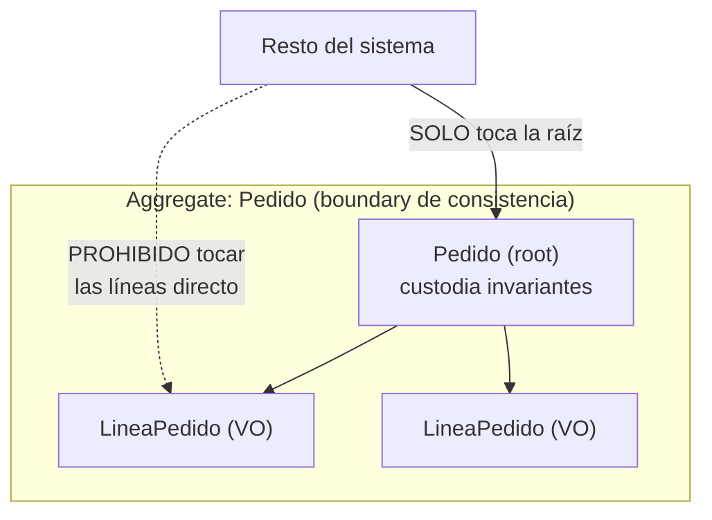
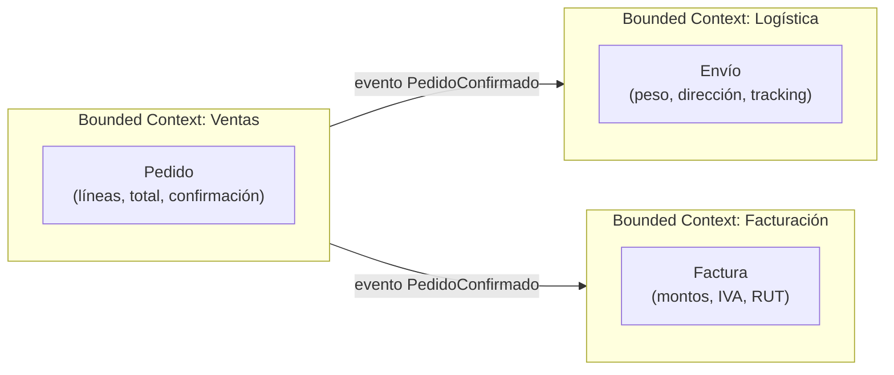
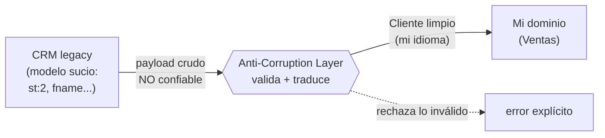

import Reto from "@components/Reto.astro";
import Solucion from "@components/Solucion.astro";
import Quiz from "@components/Quiz.astro";
import CheckDominio from "@components/CheckDominio.astro";
import Nivel from "@components/Nivel.astro";

<Nivel nivel="avanzado" />

En Fase 3 metiste tu lógica de negocio en el centro y empujaste la base de datos y el framework web a los bordes (ports & adapters). Funcionó: pudiste testear sin levantar Postgres. Pero a medida que el sistema crece aparece un problema más sutil que "¿dónde pongo el código?": **el código de negocio se diluye**. La regla "un pedido confirmado no admite más líneas" termina copiada en tres servicios, el `total` se desincroniza de las líneas que supuestamente suma, y `precio: float` provoca un bug de redondeo que nadie atrapa hasta que un cliente reclama. **DDD táctico** es el conjunto de piezas —value objects, entities, aggregates, domain events— que evita exactamente eso: que las reglas vivan *dentro* de los objetos que las dueñan, y que un objeto no pueda existir en un estado inválido. Y cuando tu sistema tiene que hablar con otro sistema (el CRM legacy, la API del proveedor, el modelo sucio de un tercero), el **anti-corruption layer** es la aduana que traduce su mundo al tuyo sin dejar que su desorden te infecte. Esta lección es hands-on: vas a refactorizar un modelo anémico a uno que protege sus invariantes, y a diseñar fronteras (bounded contexts) y una aduana (ACL) para una integración real.

:::tip[Si ya tocaste DDD o Clean Architecture en tu trabajo]
¿Ya escuchaste "entity", "value object", "aggregate root", "bounded context"? Bien: tienes el vocabulario. La trampa del que "ya hace DDD" es hacerlo **como decoración**: carpetas llamadas `domain/` y `infrastructure/` pero con clases que son bolsas de getters/setters (modelo anémico) donde la lógica sigue viviendo en "servicios"; un `OrderService` de 800 líneas; o el extremo opuesto, **DDD-itis**: un aggregate y un domain event para un CRUD de catálogo que no tiene una sola invariante que proteger. Salta a los **ejercicios Primero-Sin-IA** (sección 7): el primero te hace refactorizar un modelo anémico a un aggregate que **no se deja poner en estado inválido** y emite un domain event; el segundo te hace diseñar **bounded contexts + un ACL** para una integración (la del agente de tickets de Fase 7) y **defender dónde DDD paga y dónde es over-engineering**. Si los cierras limpio y puedes argumentar el trade-off sin recitar el libro de Evans, valida con el check de dominio (sección 8). Si te descubres poniendo aggregates en todos lados "por consistencia", el problema está en la sección 5.
:::

## 1. Qué vas a saber hacer

Al terminar, sin IA y sin notas, podrás:

- **O1 — Implementar las piezas tácticas de DDD** sobre un dominio real: un **value object** inmutable que encapsula una invariante (p. ej. `Dinero`), una **entity** con identidad, y un **aggregate root** que protege una invariante de consistencia (un objeto que **no puede existir en estado inválido**) y emite un **domain event**.
- **O2 — Diseñar fronteras: bounded contexts y un anti-corruption layer** que traduzca el modelo de un sistema externo al tuyo, explicando qué deja entrar y qué bloquea (y por qué es además una frontera de **seguridad**, no solo de modelado).
- **O3 — Decidir cuándo DDD táctico paga y cuándo es over-engineering**, defendiendo el trade-off para un sistema concreto (qué partes merecen aggregates y cuáles son un CRUD honesto que no los necesita).

## 2. Por qué importa (el dinero está aquí)

> 💰 **Por qué importa:** la arquitectura es **el techo salarial**. Es lo que separa a un semi-senior (resuelve la feature que le toca) de un senior (diseña el sistema donde esa feature encaja sin romper otras). En entrevistas de los roles mejor pagados, system design y "modela este dominio" son rondas explícitas; en el día a día, es la diferencia entre un código que envejece bien y una bola de barro que todos temen tocar. DDD táctico en particular es subvalorado y por eso paga: la mayoría sabe "poner las clases en carpetas", pero pocos saben hacer que **un objeto sea imposible de corromper** —y ese es justo el skill que evita los bugs caros (dinero mal calculado, pedidos en estado imposible, datos de un tercero que te contaminan el dominio). En sistemas de IA y automatización —tu nicho— el ACL es doblemente crítico: integras con CRMs, ERPs y APIs de terceros todo el tiempo, y la salida no confiable de un LLM es exactamente el tipo de input sucio que una aduana de dominio debe validar antes de dejar entrar.

Tres razones lo vuelven una bisagra de carrera:

1. **El modelo anémico es el antipatrón #1 que nadie te corrige.** Clases con solo datos + "servicios" con toda la lógica se *siente* organizado (¡separación de responsabilidades!), pero no lo es: la regla de negocio se dispersa y se duplica. El día que cambia, la cambias en tres lugares y olvidas el cuarto. DDD táctico mete la regla *donde vive el dato* y la hace imposible de saltarse.
2. **Las invariantes son dinero.** "El total siempre es la suma de las líneas", "no se confirma un pedido vacío", "un monto nunca es negativo": cuando estas reglas viven dentro del aggregate, ningún camino del código puede violarlas. Cuando viven en validaciones sueltas, *alguna ruta* eventualmente las viola. En finanzas, logística o pagos, esa ruta es un incidente.
3. **Integrar sin ACL es cómo se pudren los dominios.** El modelo del sistema externo (sus nombres raros, sus nulls, sus enums numéricos sin sentido) **siempre** quiere filtrarse al tuyo. Sin una aduana que traduzca, en seis meses tu dominio habla el idioma del CRM legacy, y cuando cambies de proveedor, tienes que reescribir medio sistema. El ACL es el seguro contra ese acoplamiento.

## 3. Lo que ya traes (actívalo)

Esta lección formaliza piezas que ya rozaste. Recupéralas antes de seguir:

- De **[8.1 Fundamentos de System Design](/fase-8-system-design/8-1-fundamentos-system-design/)**: pensaste en escala, idempotencia y límites del sistema. Aquí bajamos un nivel: cómo se estructura *el código* dentro de cada servicio para que esos límites no se erosionen.
- De **[3.9 Ports & adapters / hexagonal light](/fase-3-backend/3-9-ports-adapters-hexagonal/)**: empujaste DB y framework a los bordes y dejaste el dominio en el centro. DDD táctico es **qué poner en ese centro**: no funciones sueltas, sino objetos ricos que protegen sus reglas.
- De **Fase 7 (`7.2` integración + confiabilidad)**: webhooks, OAuth y datos de sistemas externos. El ACL de esta lección es **dónde** esos datos externos se traducen a tu modelo antes de tocar tu lógica. Conecta directo.
- De **Fase 2 (SOLID, TDD, ADRs)**: el aggregate es el "Single Responsibility" llevado al dominio; sus invariantes se testean con TDD; la decisión "ACL vs conformist" se registra en un ADR.

Antes de seguir, responde de memoria:

<Quiz
  question="En Fase 3 aplicaste ports & adapters: el dominio en el centro, la base de datos y el framework en los bordes. ¿Qué problema, que esa arquitectura por sí sola NO resuelve, ataca DDD táctico?"
  options={[
    "Que el dominio dependa de la base de datos (eso ya lo resolvió hexagonal con las interfaces)",
    "Que la lógica de negocio, aun estando 'en el centro', se disperse en funciones y servicios anémicos en vez de vivir dentro de objetos que protegen sus propias reglas e invariantes",
    "Que la app no escale horizontalmente bajo carga",
  ]}
  answer={1}
  explanation="Hexagonal te dice DÓNDE va el dominio (en el centro, sin depender de infraestructura), pero no QUÉ forma tiene ese dominio. Puedes tener una arquitectura hexagonal impecable y, dentro del centro, un modelo anémico: clases-bolsa-de-datos y servicios gigantes con toda la lógica. DDD táctico ataca eso: mete la regla dentro del objeto dueño del dato (value object/entity/aggregate) para que el estado inválido sea imposible de construir. Son capas distintas del mismo problema: hexagonal organiza las dependencias; DDD táctico organiza el dominio en sí."
/>

## 4. Ejemplo resuelto, pensado en voz alta

Te llevo por dos refactors, razonando como me oirías al lado tuyo. **No lo leas como un resultado: léelo como un proceso de decisiones.** Primero el modelo táctico (value object → aggregate → domain event); después, las fronteras (bounded contexts + ACL).

### 4.1 El punto de partida: un modelo anémico

Este es el código que el 80% de los proyectos tiene. Parece ordenado. No lo está.

```python
# modelo anémico: las clases son bolsas de datos; la lógica vive "afuera"
class Pedido:
    def __init__(self, id):
        self.id = id
        self.lineas = []        # lista de dicts sueltos
        self.estado = "abierto"
        self.total = 0          # int de "pesos"... ¿o centavos? nadie sabe

# las reglas de negocio viven en un "servicio", lejos del dato:
def agregar_linea(pedido, producto, precio, cantidad):
    pedido.lineas.append({"producto": producto, "precio": precio, "cantidad": cantidad})
    pedido.total += precio * cantidad      # el total se mantiene A MANO

def confirmar(pedido):
    pedido.estado = "confirmado"           # nada impide confirmar un pedido VACÍO
```

Razono en voz alta: *"Cuento los agujeros. (1) `pedido.total` es un campo que se actualiza a mano —el día que alguien haga `pedido.lineas.append(...)` directo, el total queda mintiendo. Eso es una **invariante rota esperando a pasar**. (2) `precio` es un número pelado: ¿pesos o centavos? `float` me daría bugs de redondeo en dinero. (3) `pedido.estado = 'confirmado'` lo puede hacer cualquiera, en cualquier momento, sobre un pedido sin líneas. La regla 'no confirmar vacío' no existe en ningún lado. (4) Las reglas viven en funciones sueltas: cuando agregue 'no agregar líneas a un pedido confirmado', ¿dónde la pongo? En otra función que alguien puede olvidar llamar. **El modelo anémico no es malo por feo: es malo porque permite estados imposibles.**"*

### 4.2 Pieza 1 — Value Object: `Dinero` (inmutable, sin identidad)

Empiezo por lo más pequeño y reusable: el dinero. Un **value object** es un objeto que se define por *su valor*, no por una identidad: dos billetes de $1000 son intercambiables. Reglas de un VO: **inmutable**, **igualdad por valor**, y **se autovalida** (no puede existir un `Dinero` negativo si mi dominio no lo permite).

```python
from dataclasses import dataclass

@dataclass(frozen=True)   # frozen=True -> inmutable + __eq__/__hash__ por valor
class Dinero:
    centavos: int
    moneda: str = "CLP"

    def __post_init__(self) -> None:
        if self.centavos < 0:
            raise ValueError("Dinero no puede ser negativo")

    def __add__(self, otro: "Dinero") -> "Dinero":
        if self.moneda != otro.moneda:
            raise ValueError("No se suman monedas distintas")
        return Dinero(self.centavos + otro.centavos, self.moneda)

    def por(self, factor: int) -> "Dinero":
        return Dinero(self.centavos * factor, self.moneda)
```

Razono: *"`frozen=True` me da tres cosas gratis: inmutabilidad (no puedo mutar un `Dinero`, solo crear otro), igualdad por valor (`Dinero(1000) == Dinero(1000)` es `True`) y hashabilidad. Modelo dinero en **centavos enteros**, nunca `float` —regla de oro: dinero y `float` = bugs de redondeo silenciosos. El `__post_init__` hace que un `Dinero` negativo sea **imposible de construir**: la invariante 'el dinero no es negativo' ya no es una validación que alguien deba recordar, es una propiedad del tipo. Y `__add__` me protege de sumar pesos con dólares. Esto es lo que distingue un VO de un simple `int`: **el tipo carga la regla.**"*

> **Value object vs entity, en una frase:** un **value object** no tiene identidad (importa *qué* es: `Dinero(1000)`); una **entity** sí tiene identidad que persiste aunque cambien sus atributos (importa *quién* es: el `Pedido #87` sigue siendo el mismo pedido aunque le agregues líneas). Regla práctica: si preguntarías "¿son el mismo?" → entity; si preguntarías "¿valen lo mismo?" → value object.

### 4.3 Pieza 2 — Aggregate root: `Pedido` (protege la invariante)

El **aggregate** es un grupo de objetos que se trata como **una sola unidad de consistencia**, con una raíz (el *aggregate root*) que es la **única puerta de entrada**. Toda modificación pasa por la raíz, y la raíz garantiza que el grupo nunca quede inconsistente. Aquí: un `Pedido` con sus `LineaPedido`. La regla de oro del aggregate: **desde afuera solo se toca la raíz; la raíz custodia las invariantes.**

```python
from dataclasses import dataclass, field
from enum import Enum

class EstadoPedido(Enum):
    ABIERTO = "abierto"
    CONFIRMADO = "confirmado"

class PedidoYaConfirmado(Exception):
    """No se modifican las líneas de un pedido ya confirmado."""

class PedidoVacio(Exception):
    """No se confirma un pedido sin líneas."""

@dataclass(frozen=True)
class LineaPedido:                       # value object: sin identidad propia
    producto_id: str
    precio_unitario: Dinero
    cantidad: int

    def subtotal(self) -> Dinero:
        return self.precio_unitario.por(self.cantidad)


class Pedido:                            # aggregate root
    def __init__(self, id: str) -> None:
        self._id = id
        self._lineas: list[LineaPedido] = []
        self._estado = EstadoPedido.ABIERTO
        self._eventos: list[object] = []

    def agregar_linea(self, linea: LineaPedido) -> None:
        if self._estado is EstadoPedido.CONFIRMADO:
            raise PedidoYaConfirmado(self._id)
        self._lineas.append(linea)

    def total(self) -> Dinero:
        # invariante GARANTIZADA por construcción: el total no es un campo que
        # se desincroniza, es una FUNCIÓN de las líneas. No hay otra fuente de verdad.
        total = Dinero(0)
        for linea in self._lineas:
            total = total + linea.subtotal()
        return total

    def confirmar(self) -> None:
        if not self._lineas:
            raise PedidoVacio(self._id)
        self._estado = EstadoPedido.CONFIRMADO
        self._eventos.append(PedidoConfirmado(pedido_id=self._id, total=self.total()))

    def eventos_no_publicados(self) -> list[object]:
        return list(self._eventos)
```

Razono: *"Mira qué cambió respecto al anémico. (1) Los atributos son `_privados`: desde afuera **no puedes** hacer `pedido.estado = 'confirmado'` ni `pedido.lineas.append(...)`. La única forma de mutar el pedido es por sus métodos, y cada método **defiende una invariante**: `agregar_linea` rechaza si está confirmado, `confirmar` rechaza si está vacío. (2) `total()` ya no es un campo que mantengo a mano —es una **función de las líneas**, así que es *imposible* que mienta. Eliminé toda una clase de bug borrando el campo. (3) `confirmar()` no solo cambia el estado: registra un **domain event** (`PedidoConfirmado`). Esto es clave para lo que viene."*



### 4.4 Pieza 3 — Domain event: `PedidoConfirmado`

Un **domain event** es un hecho del negocio que ya ocurrió, nombrado en pasado (`PedidoConfirmado`, no `ConfirmarPedido`). Sirve para **desacoplar efectos secundarios**: el pedido no necesita saber que confirmar dispara "enviar email", "descontar stock" y "registrar en analytics". Emite el hecho; otros reaccionan.

```python
@dataclass(frozen=True)
class PedidoConfirmado:           # hecho en pasado, inmutable
    pedido_id: str
    total: Dinero
```

Razono: *"El evento es un value object: inmutable y nombrado en pasado. ¿Por qué importa? Porque sin él, `confirmar()` tendría que llamar al servicio de email, al de stock, al de analytics —y de golpe mi aggregate de dominio conoce media infraestructura (adiós, hexagonal). Con el evento, `confirmar()` solo declara *'esto pasó'*; un publisher fuera del dominio lo entrega a quien le interese. Bonus de **observabilidad**: la lista de domain events es la semilla de un audit log y de las trazas del negocio —cada evento es un punto del call-chain que puedes loguear con su correlation ID."*

### 4.5 Las fronteras: bounded contexts

Hasta aquí, un solo modelo. Pero "Pedido" no significa lo mismo en todo el sistema: en **Ventas** un pedido es líneas + total + confirmación; en **Logística** es peso + dirección + estado de envío; en **Facturación** es montos + impuestos + RUT. Forzar *un* modelo de `Pedido` que sirva a los tres produce un monstruo con 40 campos donde cada equipo usa 10. Un **bounded context** es una frontera explícita dentro de la cual un término (`Pedido`) tiene **un solo significado**.



Razono: *"El mismo `PedidoConfirmado` cruza la frontera y cada contexto lo interpreta a su manera: Logística crea un `Envío`, Facturación crea una `Factura`. Ninguno comparte la clase `Pedido` de Ventas —comparten el **evento**, que es un contrato mínimo. Esto es DDD **estratégico** (las fronteras) sosteniendo el DDD **táctico** (las piezas dentro de cada frontera)."*

### 4.6 La aduana: anti-corruption layer (ACL)

Ahora integro un sistema externo: un **CRM legacy** del que debo importar clientes (esto es justo la integración del agente de tickets de Fase 7). Su modelo es horrible —y no puedo cambiarlo. Si dejo que sus nombres y sus formas entren a mi dominio, lo infecto.

```python
# lo que escupe el CRM externo (NO lo controlo): nombres crípticos, enums numéricos,
# nulls, fechas como string. Es "su" idioma, no el mío.
payload_crm = {
    "cust_id": "X-99281",
    "fname": "  alvaro ",
    "lname": "CORTES",
    "st": 2,                 # 1=prospecto, 2=activo, 3=baja  (mágico, sin documentar)
    "email_addr": None,
}

# --- ANTI-CORRUPTION LAYER: la aduana que traduce SU modelo al MÍO ---
class ClienteInvalidoExterno(Exception):
    ...

ESTADOS_CRM = {1: "prospecto", 2: "activo", 3: "baja"}

def traducir_cliente(payload: dict) -> "Cliente":
    # 1. VALIDA lo no confiable (frontera de SEGURIDAD, no solo de modelado)
    estado_raw = payload.get("st")
    if estado_raw not in ESTADOS_CRM:
        raise ClienteInvalidoExterno(f"estado CRM desconocido: {estado_raw!r}")

    # 2. TRADUCE al lenguaje de MI dominio (limpia, mapea, normaliza)
    return Cliente(
        id=payload["cust_id"],
        nombre=f'{payload["fname"].strip().title()} {payload["lname"].strip().title()}',
        estado=ESTADOS_CRM[estado_raw],
        email=payload.get("email_addr") or None,   # null del CRM -> None explícito
    )
```

Razono: *"El ACL hace dos trabajos. (1) **Traduce**: `fname`/`lname`/`st` entran; sale un `Cliente` que habla *mi* idioma (`nombre`, `estado='activo'`). Mi dominio nunca ve `st: 2`. (2) **Valida**: es una **frontera de confianza**. Todo lo que viene de afuera —un CRM, una API, o la salida de un LLM— es input no confiable hasta que la aduana lo aprueba. El `estado_raw not in ESTADOS_CRM` evita que un `4` mágico se cuele como estado inválido. Esto conecta directo con seguridad (OWASP: valida en la frontera) y con Fase 7: cuando un agente extrae datos de un sistema externo, el ACL es donde esa extracción se valida antes de tocar tu lógica. El día que cambie de CRM, reescribo `traducir_cliente` y **nada más**: el resto del sistema ni se entera."*



## 5. Errores que vas a tener (y por qué)

:::caution[Podrías pensar que tener carpetas `domain/`, `application/`, `infrastructure/` ya es DDD]
La estructura de carpetas es lo más fácil y lo menos importante. Puedes tener la estructura perfecta y, dentro de `domain/`, clases que son **bolsas de getters/setters** (modelo anémico) con toda la lógica en un `PedidoService` de 800 líneas. Eso **no** es DDD: es un modelo anémico con disfraz. La prueba ácida: ¿puedes poner tu objeto en un estado inválido desde afuera (`pedido.estado = "confirmado"` con cero líneas)? Si sí, no protege sus invariantes, y entonces no es un aggregate, es una struct. DDD táctico se mide por **comportamiento que protege reglas**, no por nombres de carpetas.
:::

:::caution[Podrías pensar que un value object es lo mismo que un DTO]
Se parecen (ambos son "datos"), pero su propósito es opuesto. Un **DTO** es un saco de transporte: cruza una frontera (HTTP, cola) y **no tiene reglas** —es deliberadamente tonto. Un **value object** **carga invariantes**: `Dinero` se niega a ser negativo y se niega a sumar monedas distintas. Confundirlos lleva a dos males: o metes lógica de negocio en tus DTOs (que entonces no puedes reusar para transporte), o tratas tus VOs como sacos pasivos (y vuelves a validar el dinero en cada servicio). Regla: DTO en el borde (adapters), value object en el centro (dominio); el ACL es justo donde un DTO externo se convierte en value objects internos.
:::

:::caution[Podrías pensar que "todo es un aggregate" y mientras más, mejor]
Al revés. Un aggregate es una **frontera de consistencia transaccional**, y debe ser **lo más pequeño posible**. El error clásico es hacer aggregates gigantes ("`Cliente` contiene todos sus `Pedidos` que contienen todas sus `Líneas`...") porque "están relacionados". Eso te obliga a cargar y bloquear medio sistema para cambiar una línea, y mata la concurrencia. Regla de Vaughn Vernon: **un aggregate por transacción**; entre aggregates, referencia por **id**, no por objeto, y comunícalos con **domain events**, no con llamadas directas. Pequeño y muchos le gana a grande y pocos.
:::

:::caution[Podrías pensar que un ACL es "solo un mapper" que renombra campos]
Mapear `fname` → `nombre` es la parte trivial. El ACL es además una **frontera de confianza**: valida que lo externo cumpla *tus* reglas antes de dejarlo entrar (el `st: 4` mágico que rechazas), y absorbe el cambio cuando el sistema externo cambia. Tratarlo como "un mapper" lleva a que la validación se escape a otro lado (o no exista) y a que un cambio del proveedor se filtre a tu dominio. En sistemas de IA esto es crítico: la salida de un LLM es input no confiable, y el ACL/validación de salida (Output Handling, OWASP LLM05) es donde se la valida **antes** de ejecutar acciones. El ACL no es plomería: es la aduana y el control de pasaportes.
:::

:::caution[Podrías pensar que DDD es siempre la respuesta correcta y "más profesional"]
DDD táctico cuesta: más clases, más indirección, más código. **Solo paga donde hay complejidad de dominio real** —invariantes que proteger, reglas que cambian, un lenguaje de negocio rico. Para un **CRUD honesto** (un catálogo de productos que solo se crea/lee/edita/borra, sin reglas), montar aggregates y domain events es **over-engineering**: agregas ceremonia sin ganar nada. La marca del senior no es "siempre DDD", es **saber dónde**: el subsistema de pagos o de pedidos merece DDD táctico; el panel de administración de tags, no. Aplicar DDD a un CRUD es tan error como dejar anémico un dominio complejo.
:::

## 6. Práctica con andamiaje (que se desvanece)

Tres pasos, de más apoyo a menos. Como esto mezcla repaso (hexagonal de F3) con conceptos nuevos (las piezas tácticas), el worked example de arriba va primero; aquí lo consolidas antes del Primero-Sin-IA. Hazlos **a mano** (decide antes de "ejecutar"): en modelado, "ejecutar" es escribir la clase o el límite.

### 6.1 PREDICT — ¿value object, entity o aggregate root?

Sin escribir código, clasifica cada concepto como **value object** (sin identidad, inmutable), **entity** (con identidad que persiste) o **aggregate root** (entity que es puerta de entrada y custodia invariantes de un grupo):

```text
A. Un color en formato hex "#FF8800" usado en un editor de temas.
B. Un Usuario del sistema, con su historial de logins.
C. Una Cuenta bancaria que contiene sus Movimientos y garantiza "el saldo nunca queda negativo".
D. Una dirección de envío (calle, ciudad, código postal).
E. Un Movimiento individual de la cuenta del punto C.
```

<Solucion title="Ver la respuesta (solo después de predecir)">
- **A** → **value object**. Dos `#FF8800` son intercambiables; no tiene identidad, es inmutable.
- **B** → **entity** (probablemente aggregate root de su propio contexto). Importa *quién* es; el mismo usuario persiste aunque cambie su email.
- **C** → **aggregate root**. Es una entity (la cuenta #123 es la cuenta #123) que **custodia una invariante** ("saldo ≥ 0") sobre un grupo (sus movimientos). Toda modificación pasa por la cuenta.
- **D** → **value object**. Importa *qué* es, no quién; dos direcciones con los mismos campos son iguales. (Matiz: si el negocio le diera un id propio y ciclo de vida, sería entity —depende del contexto.)
- **E** → entity **dentro** del aggregate Cuenta, pero **no** es aggregate root: no se accede directo, se accede *a través de* la Cuenta. Referenciarlo desde fuera por id, nunca mutarlo salteándose la cuenta.

La trampa es **C vs E**: ambos son entities, pero solo la Cuenta es la **raíz** (puerta de entrada + custodia de la invariante). El Movimiento es interno al aggregate.
</Solucion>

### 6.2 Spot the leak — encuentra la invariante desprotegida

Este aggregate tiene un agujero: existe un camino para dejarlo en estado inválido. Encuéntralo **leyendo, sin ejecutar**:

```python
class CarritoCompra:
    MAX_ITEMS = 20
    def __init__(self):
        self._items: list[str] = []

    def agregar(self, producto_id: str) -> None:
        if len(self._items) >= self.MAX_ITEMS:
            raise ValueError("carrito lleno")
        self._items.append(producto_id)

    @property
    def items(self) -> list[str]:
        return self._items          # <-- mira bien esto
```

<Solucion title="Ver el agujero (solo después de buscarlo)">
La invariante es "máximo 20 items". `agregar()` la protege bien. Pero `items` **devuelve la lista interna por referencia**, así que cualquiera puede hacer:

```python
c = CarritoCompra()
c.items.append("p1")   # ... y otra vez 30 veces. agregar() jamás se llamó.
```

Y se salta el límite por completo. El aggregate **no custodia** su invariante porque **regaló acceso mutable a su interior**. La regla rota: *desde afuera solo se toca la raíz, por sus métodos.* Arreglo: devolver una copia o una vista inmutable (`return tuple(self._items)` o `return list(self._items)`). Esta fuga —exponer la colección interna— es uno de los errores más comunes y silenciosos al construir aggregates.
</Solucion>

### 6.3 MODIFY — pon la aduana en su lugar

Este código deja entrar el modelo del proveedor directo al dominio. Di **qué está mal** y **dónde** insertarías un ACL (en palabras, no escribas la clase completa):

```python
def importar_factura(payload_proveedor: dict):
    factura = Factura()
    factura.monto = payload_proveedor["amt"]          # float del proveedor
    factura.estado = payload_proveedor["status_code"] # 0/1/2 sin traducir
    factura.fecha = payload_proveedor["dt"]           # string "2026-06-27"
    db.guardar(factura)
    return factura
```

<Solucion title="Ver el diagnóstico">
Está mal porque **el modelo del proveedor entró crudo al dominio**: `Factura.monto` quedó como `float` (bug de dinero), `estado` como un código numérico sin significado en *tu* idioma, `fecha` como string sin parsear, y **nada se validó** (¿y si `status_code` es `9`?). El proveedor ahora vive dentro de tu `Factura`; el día que cambie sus códigos, te rompe el dominio.

Dónde va el ACL: **entre el payload crudo y la construcción de `Factura`**. Una función `traducir_factura(payload) -> Factura` que: (1) valide (`status_code` en el conjunto conocido, `amt` presente y ≥ 0), (2) traduzca (`amt` → `Dinero` en centavos, `status_code` → tu enum de estado, `dt` → `date` parseada), y (3) devuelva una `Factura` que ya habla tu idioma. `importar_factura` queda: `factura = traducir_factura(payload); db.guardar(factura)`. El dominio nunca ve `amt` ni `status_code`. Misma idea que el `traducir_cliente` de la sección 4.6.
</Solucion>

## 7. Ejercicios Primero-Sin-IA

Ahora sin andamiaje. Resuélvelos **a mano, sin IA** dentro del timebox. El primero se corrige con tests verdes *y* con la calidad del modelo; el segundo, con la solidez de tu diseño y tu razonamiento —exactamente lo que ninguna IA tiene por ti.

<Reto title="Refactoriza un modelo anémico a un aggregate que protege su invariante" timebox="40–45 min">

Te entregamos en la carpeta del ejercicio un modelo **anémico** de una cuenta de pre-pago (estilo Copec Pay / billetera): una clase-bolsa-de-datos con la lógica dispersa en funciones, y un saldo que se mantiene a mano. Tu trabajo es refactorizarlo a DDD táctico **sin cambiar el comportamiento observable correcto**, pero **cerrando los agujeros**.

Construye, test-driven:

1. Un **value object `Dinero`** (inmutable, en centavos, igualdad por valor, se niega a ser negativo y a operar entre monedas distintas).
2. Un **aggregate root `Billetera`** que protege la invariante **"el saldo nunca queda negativo"** y **"el saldo es siempre la suma de los movimientos"** (no un campo que se mantiene a mano). Operaciones: `cargar(monto)` (recargar) y `pagar(monto)` (rechaza si no hay saldo suficiente, con una excepción de dominio).
3. Un **domain event `PagoRealizado`** (inmutable, en pasado) que `pagar()` registra al ejecutarse con éxito.

No expongas la lista interna de movimientos por referencia (recuerda 6.2). El saldo debe ser una **función** de los movimientos, no un campo.

Entregable: `billetera.py` (tu modelo) + `test_billetera.py` (tus tests) + `bitacora.md` (el log red→green→refactor de cada invariante).

**Hecho significa:**
- [ ] `Dinero` es inmutable (`frozen`), compara por valor, y **es imposible** construir uno negativo o sumar monedas distintas (test que lo prueba con `pytest.raises`).
- [ ] Es **imposible** dejar la `Billetera` en saldo negativo desde afuera: `pagar()` de más lanza una excepción de dominio, no deja el saldo en rojo.
- [ ] El saldo se **calcula** de los movimientos; no existe un campo `saldo` que pueda desincronizarse.
- [ ] No se puede mutar la colección interna desde fuera (devuelves copia/tupla).
- [ ] `pagar()` exitoso registra un `PagoRealizado`; un pago rechazado **no** registra evento.
- [ ] `bitacora.md` muestra el 🔴 antes del 🟢 en cada invariante; puedes **explicar sin notas** por qué calcular el saldo elimina una clase entera de bug.

Enunciado completo y starter: `ejercicios/fase-8/modelar-aggregate-y-value-object/` (carpeta del repo).

<Solucion title="Pista (ábrela solo si superaste el timebox)">
El value object es el de la sección 4.2 casi tal cual —cópialo de tu memoria, no de la lección. Para la `Billetera`: guarda una **lista de movimientos** (cada uno un VO con tipo `CARGA`/`PAGO` y un `Dinero`), y haz `saldo()` que sume las cargas y reste los pagos, devolviendo `Dinero`. La invariante "no negativo" se protege en `pagar()`: calcula `saldo()` *antes* de registrar el pago; si `monto.centavos > saldo().centavos`, lanza `SaldoInsuficiente` y **no** agregues nada. El orden importa: valida → registra movimiento → registra evento. Si registras el evento antes de validar, emites un hecho que no ocurrió. Pista, no solución.
</Solucion>

</Reto>

<Reto title="Diseña bounded contexts + un anti-corruption layer (sin código)" timebox="35–45 min">

Diseño puro, en papel/markdown. Escenario (el del agente de tickets de **Fase 7**): tu empresa construye un **sistema de soporte con IA** que recibe tickets, los clasifica con un LLM, y para los de "facturación" debe consultar un **ERP externo legacy** (que no controlas) para traer el estado de pago del cliente. El ERP expone un endpoint que devuelve JSON crudo con nombres crípticos, enums numéricos y nulls (te damos un ejemplo del payload en la carpeta del ejercicio).

Tu trabajo (no escribes implementación; diseñas):

1. **Mapa de bounded contexts** (`context-map.md` con un diagrama **Mermaid**): identifica **2-3 bounded contexts** (p. ej. *Soporte*, *Facturación/ERP*, quizá *Clasificación-IA*), nómbralos, y marca la **relación** entre ellos (¿partnership? ¿customer-supplier? ¿conformist? ¿ACL?). Justifica por qué la frontera con el ERP externo **exige un ACL**.
2. **Diseño del ACL** (`acl-diseno.md`): muestra el modelo **sucio** del ERP (el payload) y el modelo **limpio** de tu dominio (qué campos, qué tipos, qué value objects), y describe la **traducción** campo por campo. Marca explícitamente **qué valida la aduana** (qué inputs externos rechaza) y por qué eso es una frontera de **seguridad**, no solo de modelado.
3. **ADR de la decisión** (`adr-0001-acl.md`, formato completo): "¿ACL propio vs conformist (adoptar el modelo del ERP tal cual)?" con **≥2 opciones, pro/contra, decisión justificada y un gatillo** de revisión. Y un **párrafo de juicio**: ¿qué parte de este sistema merece DDD táctico (aggregates/VOs) y qué parte es un CRUD honesto que **no** lo necesita? Defiéndelo.

Entregable: `context-map.md` + `acl-diseno.md` + `adr-0001-acl.md`.

**Hecho significa:**
- [ ] El mapa tiene **2-3 contexts** con fronteras claras y la **relación** entre ellos nombrada (no solo cajas conectadas).
- [ ] Argumentas por qué el límite con el ERP externo **necesita ACL** (no controlas su modelo, no quieres acoplarte a él).
- [ ] El diseño del ACL muestra **modelo sucio → modelo limpio** con la traducción campo a campo, e identifica **qué valida** (inputs externos que rechaza) como frontera de seguridad.
- [ ] El ADR tiene **≥2 opciones reales** con pro/contra, decisión atada al contexto y un **gatillo**.
- [ ] El párrafo de juicio nombra **una parte que merece DDD y una que no**, con razón defendible (no "todo DDD por consistencia").
- [ ] Puedes **defender en voz alta** dónde DDD paga y dónde sería over-engineering en *este* sistema.

Enunciado completo y material (payload del ERP): `ejercicios/fase-8/disenar-bounded-contexts-y-acl/` (carpeta del repo).

<Solucion title="Pista (ábrela solo si superaste el timebox)">
Para el mapa: *Soporte* (tu core, donde vive el ticket) es **downstream** del *ERP* (upstream, no lo controlas) → esa relación upstream-que-no-cambia + downstream-que-debe-protegerse es la definición de libro de "necesito un ACL". *Clasificación-IA* puede ser un context aparte o un servicio dentro de Soporte —defiende tu elección. Para el ACL: el payload sucio del ERP (algo como `{"cli":"...", "pay_st": 3, "bal": null}`) entra; sale un `EstadoPagoCliente` de tu dominio con un enum legible y un `Dinero`. Valida que `pay_st` esté en tu conjunto conocido (rechaza lo demás) y que `bal` null no reviente. Para el juicio: el **estado de pago + las reglas de qué hacer con un cliente moroso** probablemente merecen modelado rico; el **CRUD de categorías de tickets** casi seguro no —es admin plano. Pista, no solución.
</Solucion>

</Reto>

## 8. Check de dominio

Sin mirar la lección, en voz alta o por escrito:

<CheckDominio
  items={[
    "Distinguir value object, entity y aggregate root, con un ejemplo propio de cada uno y la pregunta que los separa ('¿valen lo mismo?' vs '¿son el mismo?').",
    "Explicar qué hace un aggregate root y por qué 'desde afuera solo se toca la raíz' protege las invariantes.",
    "Dar un ejemplo de invariante de dominio y mostrar dos formas de implementarla: una desprotegida (anémica) y una que la vuelve imposible de violar.",
    "Explicar qué es un domain event, por qué se nombra en pasado, y qué desacopla.",
    "Definir bounded context y dar un caso donde el mismo término significa cosas distintas en dos contexts.",
    "Explicar qué hace un anti-corruption layer (traduce + valida) y por qué es también una frontera de seguridad, no solo de modelado.",
    "Argumentar cuándo DDD táctico paga y cuándo es over-engineering, con un ejemplo de cada uno.",
    "Explicar por qué un aggregate debe ser pequeño y por qué entre aggregates se referencia por id y se comunica con eventos.",
  ]}
/>

Si marcaste menos de seis, vuelve a la sección correspondiente **antes** de avanzar. No es un examen: es honestidad contigo.

<Quiz
  question="Tu equipo modela una plataforma de pagos. Alguien propone: una sola clase Cliente que contiene la lista de todos sus Pedidos, cada uno con todas sus Líneas y su historial de pagos, todo como un solo aggregate 'porque están relacionados'. ¿Cuál es el problema principal?"
  options={[
    "Ninguno: tener todo junto en un aggregate garantiza consistencia y es lo que DDD recomienda",
    "El aggregate es demasiado grande: para cambiar una línea tendrías que cargar y bloquear todo el grafo del cliente, matando la concurrencia. Los aggregates deben ser pequeños; entre ellos se referencia por id y se comunican con domain events",
    "El problema es solo de nombres: debería llamarse ClienteAggregate para seguir la convención",
  ]}
  answer={1}
  explanation="Un aggregate es una frontera de consistencia transaccional y debe ser lo MÁS PEQUEÑO posible. Meter Cliente + Pedidos + Líneas + Pagos en uno solo te obliga a cargar y bloquear un grafo enorme para cualquier cambio mínimo, destruye la concurrencia y acopla todo. La regla (Vaughn Vernon) es: un aggregate por transacción; entre aggregates, referencia por id (no por objeto) y comunicación por domain events. Cliente, Pedido y cuenta de Pagos deberían ser aggregates separados."
/>

<Quiz
  question="Estás construyendo un panel de administración interno que solo lista, crea, edita y borra etiquetas (tags) de un blog. Sin reglas de negocio, sin invariantes. Un compañero insiste en modelarlo con aggregates, value objects y domain events 'para que sea DDD de verdad'. ¿Cuál es la respuesta con criterio?"
  options={[
    "Tiene razón: aplicar DDD siempre es la práctica más profesional y consistente",
    "Es over-engineering: un CRUD sin invariantes no gana nada con aggregates/VOs/eventos, solo suma ceremonia. DDD táctico paga donde hay complejidad de dominio real (reglas, invariantes); aquí un CRUD honesto es la respuesta correcta",
    "Da igual; el costo de DDD es cero, así que conviene aplicarlo por las dudas",
  ]}
  answer={1}
  explanation="DDD táctico cuesta (más clases, más indirección) y solo paga donde hay invariantes que proteger y un dominio rico. Un CRUD plano de tags no tiene ninguna regla que un aggregate proteja: aplicarle DDD es agregar ceremonia sin valor. La marca del criterio senior no es 'siempre DDD' ni 'nunca DDD', es saber DÓNDE: el subsistema de pagos sí, el panel de tags no. Aplicar DDD a un CRUD es tan error como dejar anémico un dominio complejo."
/>

## 9. Recursos (documentación oficial primero)

- **Python `dataclasses` (docs oficiales):** [docs.python.org/3/library/dataclasses.html](https://docs.python.org/3/library/dataclasses.html) — `frozen=True`, `field`, `__post_init__`; la base técnica de los value objects en Python.
- **Martin Fowler — "AnemicDomainModel":** [martinfowler.com/bliki/AnemicDomainModel.html](https://martinfowler.com/bliki/AnemicDomainModel.html) — el antipatrón que esta lección ataca, explicado por quien lo nombró.
- **Martin Fowler — "BoundedContext" + "DomainDrivenDesign":** [martinfowler.com/bliki/BoundedContext.html](https://martinfowler.com/bliki/BoundedContext.html) — la frontera estratégica, en una página.
- **Martin Fowler — "AntiCorruptionLayer" (en el catálogo de patrones):** [martinfowler.com/bliki/AnticorruptionLayer.html](https://martinfowler.com/bliki/AnticorruptionLayer.html) — qué es y por qué la aduana protege tu modelo.
- **Microsoft — Tactical DDD / patrones de microservicios:** [learn.microsoft.com/azure/architecture/microservices/model/tactical-ddd](https://learn.microsoft.com/en-us/azure/architecture/microservices/model/tactical-ddd) — entities, value objects, aggregates y domain events, con criterio de diseño aplicado.
- **Microsoft — Anti-corruption layer pattern:** [learn.microsoft.com/azure/architecture/patterns/anti-corruption-layer](https://learn.microsoft.com/en-us/azure/architecture/patterns/anti-corruption-layer) — el patrón ACL como pieza de arquitectura, con diagramas.

## 10. Conexión con el capstone de la fase

El **[Ejercicio Fase 8 — Diseña 3 sistemas en papel](/fase-8-system-design/proyecto/)** usa esto directamente. De los tres sistemas que vas a diseñar (RAG multi-tenant, automatización de tickets con IA, pipeline de datos para IA), **al menos dos** necesitan lo de esta lección:

- **Identificar los bounded contexts** de cada sistema y dibujar el **context map** en Mermaid (el músculo de las secciones 4.5 y del ejercicio 2).
- **Marcar dónde va un ACL**: la automatización de tickets integra sistemas externos (CRM/ERP) y consume salida de un LLM —ambas son fronteras de confianza que exigen una aduana (sección 4.6).
- **Decidir dónde modelas rico y dónde un CRUD basta**, y registrarlo en los **ADRs** que el capstone pide (el juicio de la sección 5).

Y se proyecta más allá de Fase 8: en **[8.5 Arquitectura de sistemas de IA a escala](/fase-8-system-design/8-5-arquitectura-ia-escala/)**, el ACL es donde validas la salida del LLM y los datos externos antes de que toquen tu dominio —la misma aduana, ahora en un sistema de IA. Lo que modelas aquí es el esqueleto sobre el que cuelga todo lo demás.

## 11. Reflexión y repaso espaciado

Cierra escribiendo dos o tres frases respondiendo: **en el ejercicio 1, ¿cuántos estados inválidos podía tener el modelo anémico que tu aggregate ahora vuelve imposibles?** Cuéntalos (saldo negativo, saldo desincronizado, dinero negativo...). Ese número es, literalmente, la cantidad de bugs que tu refactor eliminó *por construcción* —no por un test que los atrape, sino haciéndolos inexpresables.

Gancho de **spaced repetition**:

- **Mañana:** toma cualquier clase de un proyecto tuyo (este curso o tu trabajo) y pregúntate: *¿puedo ponerla en un estado inválido desde afuera?* Si sí, escribe en una línea **cuál** es la invariante desprotegida. No la arregles aún —solo nombrarla es el ejercicio.
- **En 3 días:** reescribe de memoria el value object `Dinero` (inmutable, no negativo, no suma monedas distintas) y un aggregate mínimo que proteja una invariante. Si no te sale sin mirar, no lo aprendiste: vuelve a la sección 4.
- **En 1 semana:** dibuja de memoria el context map de un sistema que conozcas (HomeHub, tu trabajo) con sus 2-3 bounded contexts y marca dónde pondrías un ACL. Si todo te queda en "un solo context", pregúntate si de verdad un término significa lo mismo en todas partes —o si estás forzando un modelo único (sección 4.5).
