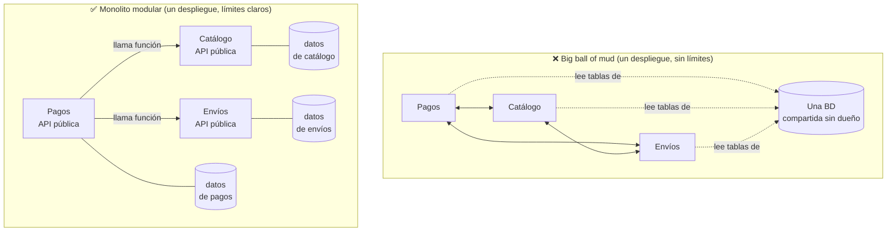
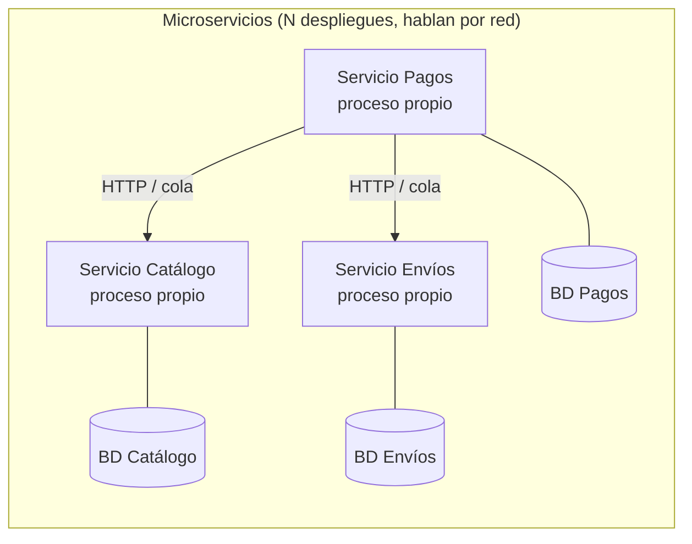
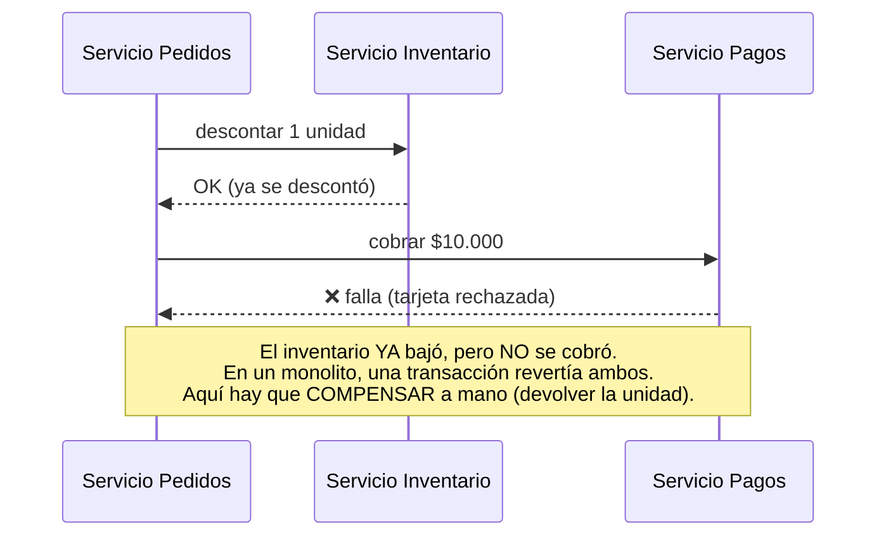
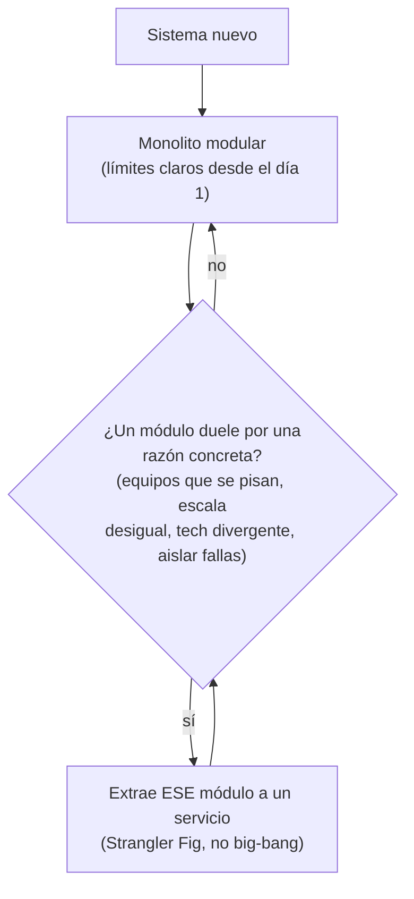

import Nivel from "@components/Nivel.astro";
import Reto from "@components/Reto.astro";
import Solucion from "@components/Solucion.astro";
import Quiz from "@components/Quiz.astro";
import CheckDominio from "@components/CheckDominio.astro";

<Nivel nivel="profundización" />

:::note[Lección opcional / profundización]
Esta sub-unidad **no está en la ruta crítica**. "Microservicios" es una de esas palabras que suena
en toda entrevista de arquitectura, así que vale la pena tener el criterio claro —pero el aprendizaje
central aquí no es montar un clúster de servicios, es **saber cuándo NO hacerlo**. Si vas con el
tiempo justo, lee la lección, haz el ejercicio de decisión (`monolito-vs-microservicios-decision`) y
sigue. Volverás cuando alguien en una reunión proponga "partamos esto en microservicios" y tú seas la
persona que pregunta "¿por qué?".
:::

Hay una pregunta que aparece en casi toda entrevista de system design y en casi toda reunión de
arquitectura: **"¿esto debería ser un monolito o microservicios?"**. La respuesta que delata a quien
sabe del que repite lo que leyó en un blog es casi siempre la misma —**empieza con un monolito
modular**— y, más importante, **por qué**. Esta lección te enseña los tres términos desde cero
(monolito, monolito modular, microservicios), los **costos reales** que casi nadie menciona cuando
vende microservicios, y el criterio para decidir con argumentos en vez de con moda.

## 1. Qué vas a saber hacer

Al terminar, sin notas, deberías poder:

- **O1 — Explicar el trade-off** entre **monolito modular** y **microservicios**, nombrando al menos
  tres **costos concretos** que los microservicios imponen (latencia/falla de red, consistencia
  distribuida, carga operacional) y qué problema —casi siempre **organizacional**, no técnico—
  justifica pagarlos.
- **O2 — Decidir**, ante un escenario, qué arquitectura conviene y articular la **restricción
  dominante** que manda la decisión (tamaño del equipo, necesidad real de escalar por separado,
  aislamiento de fallas), reconociendo cuándo los microservicios son **prematuros**.
- **O3 — Diseñar** los **límites de módulo** de un monolito modular (qué módulo posee qué datos, cómo
  se hablan entre sí) e identificar la **primera costura** que extraerías a un servicio el día que el
  dolor lo justifique.

## 2. Por qué importa (y dónde está el dinero)

> 💰 **Por qué importa:** la Fase 8 enmarca arquitectura y microservicios como **techo salarial** —es
> lo que separa al semi-senior del senior y lo que se evalúa en las entrevistas mejor pagadas. Pero el
> mercado no paga por *saber montar* microservicios; paga por el **juicio** de cuándo valen la pena.

Tres razones, sin adornos:

- **"Microservicios" aparece en las ofertas, pero el juicio aparece en las contrataciones.** Un junior
  dice "microservicios escalan mejor". Un semi-senior dice "los microservicios escalan la
  *organización*; el costo es operación y consistencia distribuida; para un equipo de tres, un monolito
  modular es más rápido y se parte después si duele". Esa segunda frase es la que pasa una entrevista
  de system design.
- **La industria ya escarmentó.** Hubo una década (2014–2020) de "microservicios para todo" que dejó a
  muchas empresas con **monolitos distribuidos**: lo peor de ambos mundos. Hoy hay un péndulo de vuelta
  hacia el **monolito modular**, y casos públicos de equipos que **volvieron** de microservicios a
  monolito reduciendo costos drásticamente. Conocer ambos lados te hace creíble.
- **Es la decisión arquitectónica que más plata quema si se toma mal.** Elegir microservicios
  demasiado pronto multiplica el costo de infraestructura, frena el desarrollo (cada feature toca
  varios servicios) e introduce bugs de consistencia que no existían. Saber posponer esa decisión es,
  literalmente, ahorrar meses de trabajo.

:::tip[Si ya tocaste esto antes]
¿Ya trabajaste en un sistema con varios servicios, o partiste un monolito? No te saltes la lección:
úsala como **diagnóstico**. ¿Puedes nombrar de memoria **tres** costos concretos de microservicios y
decir cuál es el problema que de verdad resuelven (pista: no es técnico)? ¿Distingues un **monolito
modular** de un **big ball of mud** y de un **monolito distribuido**? ¿Sabes por qué refactorizar un
límite *dentro* de un monolito es barato y *entre* servicios es caro? Si las tres salen sin dudar, haz
solo el **ejercicio de decisión** y sigue. Si alguna te hace dudar, la lección te la cierra.
:::

## 3. Lo que ya traes (actívalo)

Recupera **de memoria**, sin abrir las notas, tres ideas que esta lección va a usar:

1. De [8.1 · Fundamentos de System Design](/fase-8-system-design/8-1-fundamentos-system-design/): la
   diferencia entre **escalar vertical** (máquina más grande) y **escalar horizontal** (más copias del
   mismo proceso detrás de un load balancer), y la intuición de **CAP** (en un sistema distribuido, ante
   una partición de red tienes que elegir entre consistencia y disponibilidad). Guarda esa idea: los
   microservicios son, por definición, un sistema distribuido, así que **heredan CAP**.
2. De [8.2 · Arquitectura + DDD táctico](/fase-8-system-design/8-2-arquitectura-ddd/): el **bounded
   context** (un límite donde un modelo del dominio tiene sentido y un lenguaje es consistente) y el
   **anti-corruption layer**. Hoy vas a ver que **los bounded contexts son los candidatos naturales** a
   convertirse en módulos —y, eventualmente, en servicios.
3. De [7.2 · Integración y confiabilidad](/fase-7-automatizacion/7-2-integracion-confiabilidad/):
   **idempotencia**, **reintentos** y el hecho de que **una llamada por red puede fallar o llegar dos
   veces**. Esa fragilidad, que en F7 era de integraciones externas, en microservicios pasa a ser tu
   **comunicación interna de cada día**.

La idea-puente de hoy, en una frase: **un monolito habla por llamadas a función en memoria; los
microservicios hablan por la red.** Casi todo el costo de los microservicios se deriva de esa única
diferencia. Si la entiendes de verdad, el resto de la lección es consecuencia.

## 4. Los tres términos, desde cero (worked example con think-aloud)

Voy a definir los tres términos despacio y razonar en voz alta sobre un caso concreto. No los memorices
como fichas; sígueme el razonamiento.

### 4.1 — Qué es un monolito (y qué NO)

Un **monolito** es una aplicación que se **construye y despliega como una sola unidad**: un solo
artefacto (un contenedor, un proceso) que contiene todo el código. Cuando el módulo de "pagos" necesita
algo del módulo de "catálogo", lo pide con una **llamada a función normal**, en memoria, dentro del
mismo proceso.

*Pienso en voz alta: la palabra "monolito" carga mala fama, pero esa fama mezcla dos cosas muy
distintas.* Hay que separarlas:

- **Big ball of mud** (el monolito que todos odian): un solo despliegue **sin límites internos**. El
  código de pagos lee directo las tablas de catálogo, los módulos se importan en cualquier dirección,
  todo depende de todo. Cambiar una cosa rompe otra a tres archivos de distancia. *Esto* es lo que la
  gente describe cuando dice "los monolitos no escalan". El problema no es que sea un solo despliegue:
  es que **no tiene estructura interna**.
- **Monolito modular** (el monolito bien hecho): un solo despliegue, pero por dentro está dividido en
  **módulos con límites claros**. Cada módulo expone una **API interna** (un conjunto de funciones
  públicas), **posee sus propios datos** (los demás módulos no tocan sus tablas directamente) y se
  comunica con los otros solo a través de esas APIs. Sigue siendo un proceso, sigue hablando por
  llamadas en memoria —pero **disciplinadas**.



*El punto clave: el monolito modular ya tiene la mitad de los beneficios que la gente cree exclusivos de
los microservicios —ownership claro, módulos independientes, límites— sin pagar el costo de la red. Y no
es lo mismo "una sola base de datos física" que "una sola base de datos sin dueño": puedes tener un solo
Postgres con un esquema por módulo y la regla "nadie lee las tablas del vecino".*

### 4.2 — Qué es un microservicio

Un **microservicio** toma cada uno de esos módulos y lo convierte en un **servicio independiente**: su
**propio proceso**, su **propio despliegue**, su **propia base de datos**. Cuando pagos necesita algo de
catálogo, ya no hace una llamada a función: **hace una llamada por la red** (HTTP, gRPC o un mensaje en
una cola).



*Pienso en voz alta: a primera vista esto se ve "más ordenado" —cajas separadas, líneas claras. Pero
fíjate en lo que cambió: cada flecha que antes era una llamada a función en memoria ahora es una
**llamada por red a otro proceso**. Y ahí, en esas flechas, vive casi todo el costo. Vamos a contarlo.*

### 4.3 — El costo que casi nadie menciona

Las tres consecuencias de "hablar por la red en vez de por memoria". Son las que tienes que poder
recitar en una entrevista.

**Costo 1 — Latencia y falla de red.** Una llamada a función en memoria tarda **nanosegundos** y nunca
"falla" (si el proceso vive, la función responde). Una llamada por red dentro del mismo datacenter tarda
del orden de **medio milisegundo a varios milisegundos** —es decir, **decenas a cientos de miles de
veces más lenta**— y, peor, **puede fallar**: timeout, el otro servicio está caído, la red se particiona,
la respuesta llega duplicada. Lo que en un monolito era una línea de código, en microservicios necesita
timeouts, reintentos con backoff, circuit breakers e idempotencia (justo lo de
[7.2](/fase-7-automatizacion/7-2-integracion-confiabilidad/)) **en cada llamada interna**.

> Las "8 falacias del cómputo distribuido" (L. Peter Deutsch y otros, Sun Microsystems) resumen las
> suposiciones falsas que mata moverse a la red: "la red es confiable", "la latencia es cero", "el ancho
> de banda es infinito", "la topología no cambia"... Cada microservicio que agregas firma un contrato
> con esas falacias.

**Costo 2 — Consistencia distribuida.** Este es el más subestimado. En un monolito, una operación que
toca dos módulos puede envolverse en **una transacción de base de datos**: o se completan los dos
cambios, o ninguno (atomicidad ACID). Es gratis y a prueba de balas.

En microservicios con una BD por servicio, **esa transacción ya no existe**: no puedes hacer un
`COMMIT` atómico a través de dos bases de datos de dos procesos distintos. Si "confirmar pedido" debe
descontar inventario (servicio Catálogo) **y** cobrar (servicio Pagos), tienes un problema nuevo: ¿qué
pasa si el inventario se descontó pero el cobro falló?



La solución se llama **saga**: una secuencia de pasos donde cada uno tiene una **acción
compensatoria** que deshace lo hecho si un paso posterior falla. Funciona, pero es **mucho** más código,
más casos borde y consistencia **eventual** (hay un instante en que el sistema está "a medias"). Pasaste
de "una transacción de tres líneas" a "una máquina de estados con compensaciones". Ese salto de
complejidad es real y es caro.

**Costo 3 — Carga operacional y cognitiva.** Con un monolito despliegas **una** cosa, lees **un** log,
debuggeas **un** proceso. Con N microservicios tienes: N pipelines de CI/CD, N despliegues que versionar
y coordinar, **service discovery** (¿en qué dirección vive Pagos hoy?), **versionado de contratos**
(si Catálogo cambia su respuesta, ¿se rompe Pagos?), y la pesadilla del debugging distribuido: una sola
petición de usuario cruza cinco servicios, así que **necesitas trazas distribuidas y correlation IDs**
(lo de [5.10 · observabilidad](/fase-5-devops/5-10-observabilidad/)) solo para responder "¿dónde se
rompió?". Y nadie tiene el sistema completo en la cabeza.

| Dimensión | Monolito modular | Microservicios |
|---|---|---|
| Comunicación interna | llamada a función (ns, no falla) | llamada por red (ms, **puede fallar**) |
| Transacción entre módulos | transacción ACID, gratis | saga + compensaciones, consistencia eventual |
| Despliegue | 1 unidad | N unidades coordinadas |
| Observabilidad para "¿dónde falló?" | 1 stack trace | trazas distribuidas + correlation IDs |
| Refactorizar un límite mal puesto | mover código (barato) | cambiar contrato de red + migrar datos (caro) |
| Escalar un componente caliente | escalas **todo** el proceso | escalas **solo** ese servicio |
| Equipos que pueden trabajar sin pisarse | limitado (un despliegue) | alto (despliegue independiente) |

### 4.4 — Entonces, ¿cuándo SÍ valen los microservicios?

Lee la última fila de la tabla al revés: los microservicios **resuelven** las dos últimas filas. Es
decir, valen la pena cuando tu restricción dominante es una de estas —y todas son, en el fondo,
**organizacionales o de escala**, no "el código es más limpio":

1. **Muchos equipos pisándose en el mismo despliegue** (Ley de Conway). Si tienes 8 equipos y un solo
   monolito, cada release es una negociación. Servicios independientes = despliegues independientes =
   equipos que avanzan sin coordinar. **Este es el motivo número uno real.**
2. **Necesidad genuina de escalar componentes por separado.** Si el módulo de "búsqueda" recibe 100x el
   tráfico del resto, en un monolito tienes que escalar **todo** el proceso (caro). Como servicio,
   escalas solo búsqueda.
3. **Requisitos tecnológicos divergentes.** Un módulo necesita GPU y Python; otro, baja latencia y Rust.
   Difícil de convivir en un proceso.
4. **Aislamiento de fallas (blast radius).** Si un módulo no crítico (recomendaciones) se cae, no quieres
   que tumbe el checkout. Servicios aislados contienen el incendio.

*Pienso en voz alta sobre el caso concreto —una tienda con un equipo de tres personas, catálogo, carrito,
pagos, envíos, notificaciones: ¿cuál de esas cuatro razones aplica? Ninguna. Un equipo, tráfico modesto,
mismo stack, nada que aislar todavía. Entonces la respuesta es **monolito modular**. No porque "los
microservicios sean malos", sino porque estaría pagando latencia de red, sagas y cinco pipelines para
resolver problemas que **no tengo**.*

### 4.5 — Por qué "monolito primero" es el default sensato

Hay un argumento más, y es el que cierra la decisión: **los límites correctos son difíciles de encontrar
al principio.** Cuando arrancas, todavía no entiendes el dominio lo suficiente para saber dónde cortar.
Si cortas mal:

- **Dentro de un monolito modular**, mover una responsabilidad de un módulo a otro es **mover código y
  refactorizar imports**: lo hace tu IDE en una tarde, con los tests de red.
- **Entre microservicios**, mover una responsabilidad es **cambiar un contrato de red, versionarlo,
  coordinar el despliegue de dos servicios y migrar datos de una BD a otra**: semanas, con riesgo.

Por eso la recomendación de Martin Fowler ("Monolith First") y de Sam Newman: **empieza con un monolito
modular bien hecho; cuando un módulo concreto te duela por una razón concreta** (uno de los cuatro
motivos de arriba), **extráelo a un servicio** —y solo ese. Es exactamente el patrón **Strangler Fig**
que viste en [7.4](/fase-7-automatizacion/7-4-rpa-a-codigo/): migración incremental, no big-bang. Un
módulo con límites limpios es **fácil de extraer** el día que toque; un big ball of mud es imposible. El
monolito modular es, entre otras cosas, **una inversión en poder partir después**.



## 5. Errores que vas a tener (misconceptions explícitas)

:::caution[Podrías pensar que "microservicios escalan mejor que un monolito"]
Impreciso. Un **monolito escala horizontalmente** perfectamente bien: corres N copias del mismo proceso
detrás de un load balancer (lo de [8.1](/fase-8-system-design/8-1-fundamentos-system-design/)). Lo que
los microservicios permiten es **escalar componentes por separado** —solo el módulo caliente. Si todo tu
sistema recibe tráfico parejo, un monolito replicado escala igual de bien y es más barato de operar. El
caso público de Amazon Prime Video (2023), que **volvió** de una arquitectura de microservicios a un
monolito y redujo costos ~90%, existe justamente porque "microservicios = más escalable" es un mito sin
contexto.
:::

:::caution[Podrías pensar que un monolito es lo mismo que un "big ball of mud"]
No. Esa es la confusión que envenena toda la discusión. Un monolito **puede** ser un desastre sin
estructura (big ball of mud) **o** un sistema modular impecable. La modularidad —límites, ownership de
datos, APIs internas— es **ortogonal** a si despliegas una o N unidades. Puedes tener microservicios que
son un desastre acoplado, y un monolito que es un ejemplo de diseño limpio.
:::

:::caution[Podrías pensar que partir en microservicios "te obliga a tener buenos límites"]
Es la trampa más cara. Si no sabes dibujar buenos límites en un monolito (donde reordenar es barato),
**no vas a dibujarlos mejor en microservicios** (donde reordenar es carísimo). Lo que obtienes es un
**monolito distribuido**: servicios que tienen que desplegarse juntos, que comparten base de datos, que
se llaman en cadena para una sola operación. Es **lo peor de ambos mundos**: el acoplamiento del
monolito *más* la latencia, la falla y la operación de los microservicios. La modularidad es un
prerrequisito de los microservicios, no un regalo que vienen incluido.
:::

:::caution[Podrías pensar que "una base de datos compartida" es siempre el problema]
Matiz. El antipatrón es que **varios módulos lean y escriban las mismas tablas sin dueño** (nadie puede
cambiar el esquema sin romper a otro). Pero un solo Postgres físico con **un esquema por módulo** y la
regla "cada módulo solo toca lo suyo" es un monolito modular perfectamente sano —y mucho más simple que
N bases de datos. Lo que importa no es cuántos servidores de BD tienes, sino **quién es dueño de qué
datos**.
:::

:::caution[Podrías pensar que esta es una decisión que se toma una vez y para siempre]
No. Es una decisión **reversible y evolutiva**. El monolito modular no es "la versión barata mientras
junto plata para los microservicios de verdad": es una arquitectura legítima y final para la enorme
mayoría de los sistemas. Y si algún día un módulo justifica salir, sale —de a uno, cuando duela. La
arquitectura sigue al dolor, no al revés.
:::

## 6. Práctica con andamiaje (que se desvanece)

Esta es una lección de **criterio**, así que la práctica entrena el razonamiento, no la sintaxis. Hazlo
**a mano primero**, sin IA: predice tu respuesta antes de abrir cada pista.

### 6.1 RECONOCER — ¿qué arquitectura, y por qué?

Para cada escenario, **predice** en una línea: monolito modular o microservicios, y la **restricción
dominante** que lo decide. Escríbelo antes de abrir la pista.

1. Una startup de tres ingenieros lanza un MVP de e-commerce. Tráfico bajo, dominio aún incierto.
2. Una empresa con 200 ingenieros en 15 equipos; cada release del monolito actual tarda dos semanas de
   coordinación.
3. Un sistema donde el módulo de "transcodificación de video" satura CPU y necesita 50 máquinas, mientras
   el resto corre feliz en una.
4. Un equipo de cuatro propone "partamos en microservicios desde el día 1 para que quede bien
   arquitecturado".

<Solucion title="Ver pista (no la respuesta completa)">
Recorre las cuatro razones de la sección 4.4 y pregúntate cuál está **presente de verdad** en cada caso.
Caso 1: ¿hay equipos pisándose? ¿escala desigual? ¿dominio claro? Caso 2: cuenta los equipos y mide el
dolor de despliegue —¿qué razón grita? Caso 3: ¿el costo es parejo o concentrado en un componente? Caso
4: ojo, "para que quede bien arquitecturado" no es ninguna de las cuatro razones reales —¿qué te dice eso
sobre si la abstracción está justificada o es especulativa (como la pattern-itis de
[2.5](/fase-2-ingenieria/2-5-patrones-diseno/))? Justifica con la restricción que manda, no con la moda.
</Solucion>

### 6.2 CAZA EL COSTO — del monolito a la red

Mira esta función de un monolito modular. Es una sola transacción ACID:

```python
def confirmar_pedido(pedido_id: int) -> None:
    with db.transaction():                 # atómico: todo o nada
        inventario.descontar(pedido_id)    # llamada a función, en memoria
        pagos.cobrar(pedido_id)            # llamada a función, en memoria
        pedidos.marcar_confirmado(pedido_id)
```

**Predice, sin escribir código:** si `inventario`, `pagos` y `pedidos` fueran tres microservicios con
tres bases de datos, ¿qué garantía pierdes y qué dos cosas nuevas tendrías que construir? Nómbralas antes
de abrir la pista.

<Solucion title="Ver pista">
Pierdes la **atomicidad**: el `with db.transaction()` no puede abarcar tres bases de datos de tres
procesos. Si `pagos.cobrar` falla por red **después** de que `inventario.descontar` ya respondió OK, el
inventario quedó descontado sin venta. Las dos cosas que aparecen: (1) una **saga** con **acciones
compensatorias** (un "reponer inventario" que se dispara si el cobro falla), y (2) **idempotencia +
reintentos** en cada llamada, porque ahora cada una puede fallar o duplicarse por red. Pista, no
solución: piensa también qué pasa si la compensación *también* falla.
</Solucion>

### 6.3 DISEÑA UN LÍMITE — ¿de quién son los datos?

Sin escribir código aún. Toma este monolito modular de una tienda con módulos `catalogo`, `pedidos`,
`pagos`, `envios`, `notificaciones`. Para **dos** de esos módulos, escribe en una línea: (a) qué datos
**posee** (sus tablas), y (b) una función de su **API interna** que otro módulo llamaría —en vez de leer
sus tablas directamente.

<Solucion title="Ver un ejemplo (no el único)">
- `catalogo`: **posee** las tablas `producto`, `precio`, `stock`. **API interna:**
  `catalogo.hay_stock(producto_id, cantidad) -> bool`. El módulo `pedidos` pregunta por esta función,
  **nunca** hace `SELECT ... FROM stock`. Así, el día que extraigas `catalogo` a un servicio, solo
  cambias la *implementación* de `hay_stock` (de llamada en memoria a llamada HTTP) y nadie más se entera.
- `notificaciones`: **posee** las tablas `plantilla`, `envio_log`. **API interna:**
  `notificaciones.enviar(usuario_id, plantilla, datos)`. `pedidos` la llama tras confirmar; no arma
  correos a mano. (Y nota: `notificaciones` casi no tiene transacciones compartidas con el resto → suele
  ser **la primera costura** que conviene extraer.)
</Solucion>

## 7. Ejercicios Primero-Sin-IA

> Trabaja **a mano primero**, sin IA, dentro del timebox. Cuando termines, pídele a tu IA que **corrija**
> con el framework de `.ai/` (no que lo resuelva por ti). Las carpetas viven en tu repo; ábrelas en tu
> editor.

<Reto title="Decisor: ¿monolito modular o microservicios?" timebox="30–40 min">

Sin escribir código de producción. Te damos **cinco escenarios**; para cada uno decides **monolito
modular** o **microservicios**, nombras la **restricción dominante** y al menos **un costo** que tu
elección asume. Si eliges monolito modular, además nombras **qué evento futuro** te haría reconsiderar
(el gatillo de extracción).

Escenarios (en el README del ejercicio): un MVP de un equipo chico; una empresa grande con equipos que se
pisan; un componente que escala 100x distinto al resto; un "partamos en microservicios para que quede
bien"; y un caso ambiguo donde dos fuerzas tiran en direcciones opuestas (decídelo y defiéndelo).

Carpeta del ejercicio: `ejercicios/fase-8/monolito-vs-microservicios-decision/`

**Hecho significa:**
- [ ] Cada decisión nombra la **restricción dominante** (no "es más limpio" ni "está de moda").
- [ ] Cada decisión de microservicios nombra al menos **un costo** que asume (red, saga, operación).
- [ ] Cada decisión de monolito incluye un **gatillo concreto y observable** de extracción futura.
- [ ] El caso ambiguo se resuelve **con un trade-off explícito**, no esquivándolo.

<Solucion title="Pista (ábrela solo si superaste el timebox)">
No hay una sola respuesta correcta en el caso ambiguo, pero hay decisiones mejor y peor defendidas.
Dirección, no respuesta: las cuatro razones reales de la sección 4.4 son tu checklist; si **ninguna**
está presente, microservicios es prematuro (especulación, como la pattern-itis de 2.5). En el caso
ambiguo, pregúntate si la fuerza que empuja a microservicios es **real y presente hoy** o **especulada
para algún día** —ése suele ser el desempate.
</Solucion>

</Reto>

<Reto title="Diseña los módulos de un monolito modular (+ ADR + primera costura)" timebox="40–45 min">

Te damos el enunciado de un sistema: una plataforma de soporte con tickets (recepción de tickets,
clasificación, base de conocimiento, notificaciones, reportes). **Sin escribir código de aplicación**,
produce un documento `diseno.md` con cuatro partes:

1. **Mapa de módulos:** los módulos del monolito modular, y para **cada uno**, qué **datos posee** y
   **una o dos funciones** de su API interna (cómo lo llaman los demás, sin tocar sus tablas).
2. **Diagrama:** un Mermaid del monolito modular mostrando los módulos y quién llama a quién por su API.
3. **ADR corto** (contexto, decisión, alternativas, trade-off honesto) titulado "Monolito modular, no
   microservicios" para este sistema y este equipo. El trade-off debe nombrar qué **renuncias** al elegir
   monolito (no vendas la decisión: defiéndela con sus costos).
4. **Primera costura:** identifica **qué módulo extraerías primero** a un servicio si el sistema creciera,
   **qué evento concreto** dispararía esa extracción, y por qué ese módulo es el candidato más fácil
   (pista: mira sus dependencias transaccionales con el resto).

Carpeta del ejercicio: `ejercicios/fase-8/monolito-vs-microservicios-diseno/`

**Hecho significa:**
- [ ] Cada módulo declara **qué datos posee**; ningún módulo lee las tablas de otro (solo su API).
- [ ] El diagrama Mermaid renderiza y muestra las llamadas **entre APIs**, no accesos cruzados a datos.
- [ ] El ADR nombra al menos **una renuncia real** del monolito modular (no solo sus ventajas).
- [ ] La "primera costura" justifica el candidato por su **bajo acoplamiento transaccional**, y define un
      **gatillo** observable, no un "cuando sea grande".

<Solucion title="Pista (ábrela solo si superaste el timebox)">
Dirección, no solución: el candidato más fácil a extraer suele ser el módulo que **no participa en
transacciones compartidas** con el resto y al que los demás solo le **avisan** (fire-and-forget) —
`notificaciones` o `reportes` clásicamente, no `tickets`, que está en el corazón transaccional. El ADR:
no escribas "microservicios son malos"; escribe "para 1 equipo y este tráfico, el costo de red + saga +
N despliegues no compra nada hoy; renuncio a escala independiente y a aislamiento de fallas, y registro
el gatillo que me haría cambiar".
</Solucion>

</Reto>

## 8. Check de dominio (active recall)

Sin mirar la lección, en voz alta o por escrito:

<CheckDominio
  items={[
    "Definir monolito, monolito modular y big ball of mud, y decir por qué los dos últimos NO son lo mismo.",
    "Nombrar los tres costos de los microservicios (latencia/falla de red, consistencia distribuida, operación) y explicar cada uno en una frase.",
    "Explicar por qué una transacción ACID entre dos módulos desaparece al convertirlos en dos servicios, y qué la reemplaza (saga + compensaciones).",
    "Listar las cuatro razones reales que justifican microservicios y reconocer que todas son organizacionales o de escala, no 'código más limpio'.",
    "Explicar por qué 'empieza con un monolito modular' es el default, ligándolo al costo de mover un límite mal puesto dentro vs entre servicios.",
    "Definir 'monolito distribuido' y por qué es lo peor de ambos mundos.",
    "Decidir, ante un escenario, qué arquitectura usar nombrando la restricción dominante.",
  ]}
/>

Si marcaste menos de seis, vuelve a la sección correspondiente **antes** de avanzar. No es examen: es
honestidad contigo.

<Quiz
  question="Un equipo de cuatro personas arranca un sistema nuevo. El dominio todavía no está claro y el tráfico es modesto. Un miembro propone microservicios 'para que quede bien arquitecturado desde el día 1'. ¿Cuál es la objeción técnica más sólida?"
  options={[
    "Ninguna: microservicios siempre son mejor arquitectura, hay que aprobarlo",
    "Microservicios resuelven problemas organizacionales y de escala que este equipo NO tiene hoy; pagarían latencia de red, sagas y N despliegues por nada, y los límites mal puestos (probable, con el dominio incierto) son carísimos de mover entre servicios. Un monolito modular da los límites ahora y se parte después si duele",
    "El único problema es que cuatro personas son pocas para mantener microservicios; con seis estaría bien",
  ]}
  answer={1}
  explanation="La decisión sigue al dolor, no a la moda. Con un equipo chico, dominio incierto y tráfico modesto, ninguna de las cuatro razones reales (equipos que se pisan, escala desigual, tech divergente, aislar fallas) está presente. Los microservicios introducirían consistencia distribuida y carga operacional sin beneficio, y como los límites correctos aún no se conocen, reordenarlos entre servicios costaría semanas en vez de una tarde. Monolito modular = los beneficios de los límites hoy, con la opción de extraer mañana."
/>

<Quiz
  question="¿Por qué un 'monolito distribuido' se considera lo peor de ambos mundos?"
  options={[
    "Porque usa demasiada memoria al cargar todos los módulos en un proceso",
    "Porque combina el acoplamiento de un monolito (servicios que deben desplegarse juntos, BD compartida, llamadas en cadena) con los costos de los microservicios (latencia y falla de red, operación de N servicios), sin obtener la independencia que justifica los microservicios",
    "Porque es imposible de escalar horizontalmente",
  ]}
  answer={1}
  explanation="Si partes en servicios sin lograr límites limpios, terminas con piezas que siguen acopladas (se despliegan juntas, comparten datos, se llaman en cadena) pero que ahora hablan por la red. Pagas latencia, falla y operación distribuida y NO ganas el despliegue independiente ni el aislamiento que eran el punto. Por eso la modularidad es prerrequisito, no consecuencia, de los microservicios."
/>

## 9. Recursos (documentación oficial / fuentes primarias)

- **Martin Fowler — "MonolithFirst":** [martinfowler.com/bliki/MonolithFirst.html](https://martinfowler.com/bliki/MonolithFirst.html)
  — el argumento canónico de por qué empezar con monolito; léelo entero, es corto.
- **Martin Fowler — "MicroservicePremium":** [martinfowler.com/bliki/MicroservicePremium.html](https://martinfowler.com/bliki/MicroservicePremium.html)
  — la "prima" (el costo) que pagas por microservicios y cuándo vale la pena.
- **Martin Fowler — "Microservices" (artículo base):** [martinfowler.com/articles/microservices.html](https://martinfowler.com/articles/microservices.html)
  — definición rigurosa de las características de un microservicio.
- **Chris Richardson — microservices.io · patrón Saga:** [microservices.io/patterns/data/saga.html](https://microservices.io/patterns/data/saga.html)
  — cómo se reemplaza una transacción ACID entre servicios; catálogo de patrones de referencia.
- **Chris Richardson — patrón Database per Service:** [microservices.io/patterns/data/database-per-service.html](https://microservices.io/patterns/data/database-per-service.html)
  — por qué cada servicio posee sus datos, y el problema que crea.
- **Sam Newman — *Monolith to Microservices* / *Building Microservices*:** [samnewman.io/books](https://samnewman.io/books/)
  — la referencia de cómo extraer servicios de a uno (Strangler Fig aplicado a arquitectura).
- **Las "Fallacies of Distributed Computing":** búscalas y memoriza las 8; son el guión de por qué la red
  lo cambia todo.

## 10. Conexión con el ejercicio de la fase

El [ejercicio capstone de la Fase 8](/fase-8-system-design/proyecto/) te pide **diseñar tres sistemas en
papel** (RAG multi-tenant, automatización de tickets con IA, pipeline de datos) con diagramas Mermaid y
ADRs. Esta lección es exactamente la herramienta de decisión que vas a usar ahí:

- Para **cada** uno de los tres sistemas, la primera pregunta de arquitectura es "¿monolito modular o
  servicios separados?". Vas a responderla **con la restricción dominante**, no por reflejo —y a dejarlo
  escrito en un **ADR**, que es justo lo que el Definition of Done de la fase exige (spec + ADRs de las
  decisiones clave).
- El **mapa de módulos con ownership de datos** que practicaste en el segundo ejercicio es el esqueleto
  de cada diagrama del capstone.
- Cuando en [8.5 · arquitectura de IA a escala](/fase-8-system-design/8-5-arquitectura-ia-escala/)
  diseñes el sistema RAG, este criterio decide si el ingest, el retrieval y la generación viven juntos o
  se separan —y por qué.

## 11. Reflexión y repaso espaciado

Cierra escribiendo dos o tres frases: **¿conoces algún sistema (un trabajo, HomeHub, un proyecto) que sea
un monolito —modular o big ball of mud— o un conjunto de servicios? Si tuvieras que defender su
arquitectura en una entrevista, ¿qué restricción dominante la justifica, y qué costo está pagando?**
Anclar la teoría a un sistema que tocaste es lo que la vuelve criterio y no vocabulario prestado.

Gancho de **spaced repetition**:

- **Mañana:** recita de memoria los **tres costos** de los microservicios y las **cuatro razones** que los
  justifican. Si recuerdas las razones pero no los costos (o al revés), no lo aprendiste: lo memorizaste a
  medias.
- **En 3 días:** explica en voz alta (como en entrevista, en inglés si puedes) por qué una transacción
  ACID desaparece al partir un monolito y qué la reemplaza. Si tropiezas, vuelve a la sección 4.3.
- **En 1 semana:** toma cualquier sistema que conozcas y dibuja, sin mirar, su mapa de módulos con
  ownership de datos; luego marca la primera costura que extraerías y el gatillo que lo justificaría.
- **Antes del capstone:** convierte tu decisión "monolito modular vs servicios" para uno de los tres
  sistemas en un **ADR** de cinco líneas. Es el artefacto que separa "lo hice porque sí" de "lo decidí con
  criterio".
