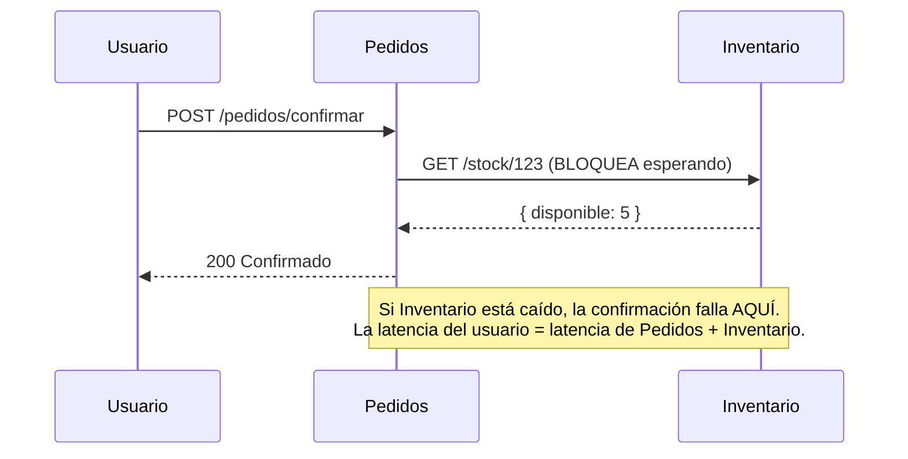
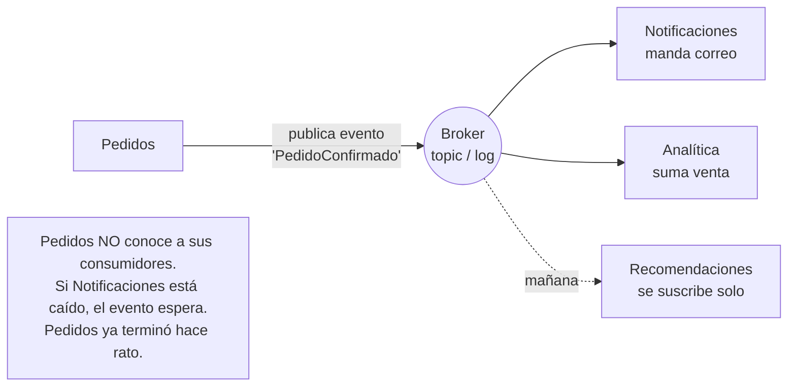
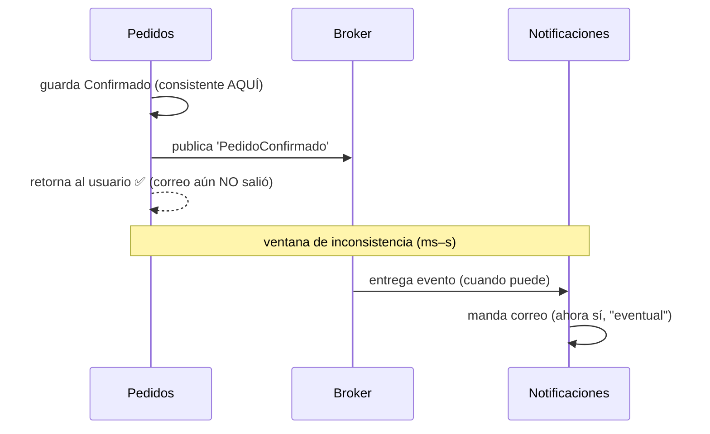
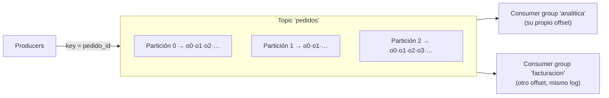
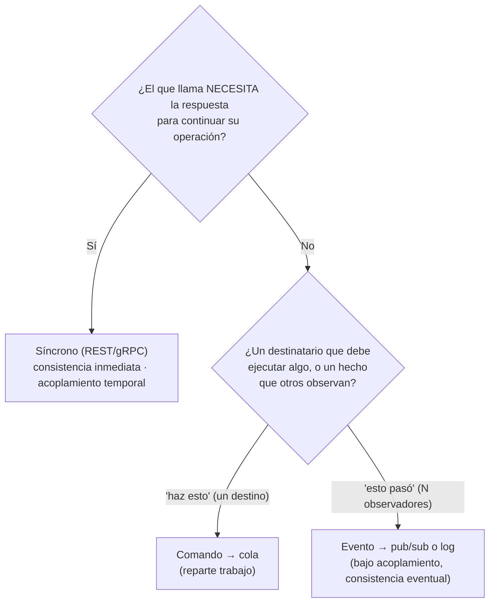

import Nivel from "@components/Nivel.astro";
import Reto from "@components/Reto.astro";
import Solucion from "@components/Solucion.astro";
import Quiz from "@components/Quiz.astro";
import CheckDominio from "@components/CheckDominio.astro";

<Nivel nivel="profundización" />

:::note[Lección opcional / profundización]
Esta sub-unidad **no está en la ruta crítica**. "Kafka", "event-driven" y "consistencia eventual" son
palabras que aparecen en toda entrevista de arquitectura, así que conviene tener la intuición clara —pero
el aprendizaje central aquí **no** es montar un clúster de Kafka, es **saber cuándo dos servicios deben
hablar por una llamada síncrona y cuándo por un mensaje asíncrono**, y qué cuesta cada opción. Si vas con
el tiempo justo, lee la lección, haz el **ejercicio de decisión**
(`comunicacion-sincrono-vs-asincrono`) y sigue. Volverás el día que alguien proponga "metamos Kafka aquí"
y tú seas quien pregunta "¿por qué, y qué garantía pierdes?".
:::

En [8.3](/fase-8-system-design/8-3-monolito-vs-microservicios/) vimos que la diferencia entre un monolito
y los microservicios se reduce a una frase: **un monolito habla por llamadas a función en memoria; los
servicios hablan por la red**. Esta lección abre esa segunda mitad. Una vez que dos piezas hablan por la
red, hay **dos formas radicalmente distintas** de hacerlo —**síncrona** (te llamo y espero la respuesta) y
**asíncrona** (te dejo un mensaje y sigo)— y la elección decide la **resiliencia**, el **acoplamiento** y,
sobre todo, el **modelo de consistencia** de todo el sistema. Vas a aprender las dos desde cero, la
diferencia entre **comando** y **evento**, las nociones de **Kafka** que te van a preguntar, y el criterio
para elegir con argumentos en vez de con moda.

## 1. Qué vas a saber hacer

Al terminar, sin notas, deberías poder:

- **O1 — Explicar el trade-off** entre comunicación **síncrona** (REST/request-response) y **asíncrona**
  (colas/eventos), nombrando al menos tres dimensiones que cambian (acoplamiento temporal, resiliencia ante
  caídas, y modelo de consistencia) y qué gana y qué pierde cada lado.
- **O2 — Decidir**, ante un flujo concreto entre servicios, si esa comunicación debe ser síncrona o
  event-driven, articulando la **pregunta que manda** ("¿el que llama *necesita* la respuesta para
  continuar?") y el **modelo de consistencia** que tu elección implica (inmediata vs eventual).
- **O3 — Explicar las nociones de Kafka** (log distribuido, topic, partición, offset, consumer group) y por
  qué un **log que retiene y se puede releer** es distinto de una cola tradicional que borra al consumir.

## 2. Por qué importa (y dónde está el dinero)

> 💰 **Por qué importa:** la Fase 8 enmarca arquitectura como **techo salarial** —lo que separa al
> semi-senior del senior y se evalúa en las entrevistas mejor pagadas. "Diseñar comunicación entre
> servicios" es una de las preguntas más frecuentes de system design, y la que más rápido delata si
> entiendes los sistemas distribuidos o solo repites palabras de moda.

Tres razones, sin adornos:

- **"Event-driven" y "Kafka" están en las ofertas, pero el criterio está en las contrataciones.** Un
  junior dice "usemos Kafka, es más escalable". Un semi-senior dice "esta llamada es una *consulta* que el
  usuario necesita ahora → síncrona; esta *notificación* no la necesita nadie en línea y no quiero que una
  caída del servicio de correo tumbe el checkout → evento asíncrono, asumiendo consistencia eventual". Esa
  segunda frase pasa la entrevista.
- **La consistencia eventual es la trampa que más bugs de producción genera.** El 80% de los bugs raros de
  un sistema distribuido ("el pedido aparece pero el inventario no bajó todavía", "le llegó el correo dos
  veces") son malentendidos de consistencia eventual y de entrega *at-least-once*. Quien la entiende los
  previene; quien no, los persigue en producción a las 3 a.m.
- **Elegir mal el estilo de comunicación es caro y difícil de revertir.** Hacer síncrono lo que debía ser
  un evento acopla servicios que deberían ser independientes (vuelves al monolito distribuido de
  [8.3](/fase-8-system-design/8-3-monolito-vs-microservicios/)). Hacer asíncrono lo que el usuario necesita
  ya, complica el sistema sin beneficio. Saber cuál es cuál es un skill examinable y concreto.

:::tip[Si ya tocaste esto antes]
¿Ya integraste sistemas con webhooks, colas o un broker (en n8n, en producción, en un homelab)? No te
saltes la lección: úsala como **diagnóstico**. ¿Puedes explicar de memoria la diferencia entre un
**comando** y un **evento** (y por qué importa quién conoce a quién)? ¿Sabes por qué Kafka **no borra** el
mensaje cuando lo consumes y qué te habilita eso? ¿Puedes nombrar **tres** anomalías que introduce la
**consistencia eventual** y cómo se mitigan (idempotencia, compensación)? ¿Sabes por qué Kafka solo
garantiza orden **dentro de una partición** y no entre particiones? Si las cuatro salen sin dudar, haz solo
el **ejercicio de rediseño** (`comunicacion-rediseno-event-driven`) y sigue. Si alguna te hace dudar, la
lección te la cierra.
:::

## 3. Lo que ya traes (actívalo)

Recupera **de memoria**, sin abrir las notas, cuatro ideas que esta lección va a usar:

1. De [8.1 · Fundamentos de System Design](/fase-8-system-design/8-1-fundamentos-system-design/): la
   intuición de **CAP** —en un sistema distribuido, ante una partición de red tienes que elegir entre
   **consistencia** y **disponibilidad**. Guárdala: la comunicación asíncrona es, en el fondo, una apuesta
   por la **disponibilidad** a cambio de **consistencia eventual**.
2. De [8.2 · Arquitectura + DDD táctico](/fase-8-system-design/8-2-arquitectura-ddd/): el **domain event**
   (un hecho del dominio que ya ocurrió: `PedidoConfirmado`). Hoy ese mismo concepto pasa de ser un objeto
   dentro de un proceso a ser un **mensaje que viaja por la red** a otros servicios.
3. De [8.3 · Monolito vs microservicios](/fase-8-system-design/8-3-monolito-vs-microservicios/): que una
   transacción ACID entre dos servicios **no existe**, y que se reemplaza por una **saga** con
   compensaciones. La saga se coordina, casi siempre, con **eventos asíncronos**: hoy ves el mecanismo.
4. De [7.2 · Integración y confiabilidad](/fase-7-automatizacion/7-2-integracion-confiabilidad/):
   **idempotencia**, entrega **at-least-once**, **DLQ** (dead-letter queue) y **outbox**. Eso que en F7 era
   "integraciones con terceros" es, en arquitectura interna, **exactamente** el toolkit que hace segura la
   comunicación asíncrona entre tus propios servicios.

La idea-puente de hoy, en una frase: **una llamada síncrona pregunta "¿está listo?" y espera; un mensaje
asíncrono afirma "esto pasó" (o pide "haz esto") y sigue.** Casi todo el resto se deriva de esa diferencia.

## 4. Las dos formas de hablar, desde cero (worked example con think-aloud)

Voy a usar un caso concreto a lo largo de toda la sección: una tienda con servicios separados
—`Pedidos`, `Inventario`, `Pagos`, `Notificaciones`, `Analítica`— y la operación "confirmar un pedido".
Sígueme el razonamiento; no memorices fichas.

### 4.1 — Comunicación síncrona (request/response)

**Síncrono** significa que el que llama **se queda esperando la respuesta** antes de continuar. Es el
modelo de una llamada HTTP/REST normal (o gRPC): `Pedidos` le hace `GET /inventario/123` a `Inventario` y
**bloquea** ese flujo hasta que llega la respuesta o se vence el timeout.

```python
# Síncrono: Pedidos llama a Inventario y ESPERA la respuesta para decidir.
def confirmar_pedido(pedido):
    resp = http.get(f"http://inventario/stock/{pedido.producto_id}")  # bloquea aquí
    if resp.json()["disponible"] < pedido.cantidad:                    # necesito la respuesta YA
        raise SinStock()
    # ... solo puedo seguir porque ya tengo el dato
```

*Pienso en voz alta: ¿por qué aquí síncrono es lo correcto? Porque `Pedidos` **necesita la respuesta para
decidir**. No puede confirmar un pedido sin saber si hay stock. La pregunta "¿hay stock?" es una
**consulta**: quiero el dato ahora, en esta misma operación.* Las propiedades de este estilo:

- **Acoplamiento temporal:** `Inventario` **tiene que estar arriba** en el instante de la llamada. Si está
  caído, la operación falla aquí y ahora.
- **Resultado inmediato y consistencia fuerte:** obtienes la respuesta actual; sabes el resultado al
  terminar la llamada.
- **Simple de razonar:** es una función que devuelve un valor —solo que puede tardar y puede fallar.
- **La falla y la latencia se propagan en cadena:** si `Pedidos` llama a `Inventario`, que llama a
  `Precios`, que llama a `Impuestos`, la latencia **se suma** y **cualquier eslabón caído rompe toda la
  cadena**. Esto se llama *coupling de disponibilidad*: tu disponibilidad es el producto de la de todos.



### 4.2 — Comunicación asíncrona (colas y eventos)

**Asíncrono** significa que el que produce el mensaje **lo deja en un intermediario** (un *message broker*:
una cola o un log) y **sigue su vida sin esperar** a que alguien lo procese. Otro proceso lo consumirá
"cuando pueda".

*Pienso en voz alta: en el mismo flujo de "confirmar pedido", después de confirmar quiero (a) mandar un
correo de confirmación y (b) actualizar la analítica de ventas. ¿`Pedidos` necesita la respuesta de
`Notificaciones` o de `Analítica` para terminar? **No.** Al usuario no le importa —ni debería esperar— a
que el correo salga. Y no quiero que una caída del servidor de correo **impida confirmar el pedido**. Esto
grita asíncrono.*

```python
# Asíncrono: Pedidos PUBLICA un hecho y sigue. No espera a nadie.
def confirmar_pedido(pedido):
    db.guardar_confirmado(pedido)
    broker.publish("pedido.confirmado", {"pedido_id": pedido.id, "total": pedido.total})
    return "Confirmado"   # retorna YA; correo y analítica pasan "después", en otro proceso
```

Hay dos sabores de mensajería que **debes** distinguir en una entrevista —se diferencian por **quién
conoce a quién**:

- **Comando (command) → típicamente una cola (point-to-point).** Un mensaje que dice **"haz esto"**
  (`EnviarCorreo`). Tiene **un** destinatario lógico que debe ejecutarlo. El que envía **sabe** que espera
  que algo ocurra. Modelo de una cola: el mensaje lo consume **un** worker, y al confirmarlo (*ack*) la cola
  **lo borra**. Sirve para **repartir trabajo** entre varios workers.
- **Evento (event) → típicamente pub/sub.** Un mensaje que dice **"esto pasó"** (`PedidoConfirmado`). Es un
  **hecho**, en pasado. El que publica **no sabe ni le importa** quién reacciona —puede haber cero, uno o
  diez suscriptores. `Notificaciones` reacciona mandando un correo; `Analítica` reacciona sumando una venta;
  mañana entra `Recomendaciones` y se suscribe **sin tocar** a `Pedidos`. Eso es **bajo acoplamiento**.



*La distinción comando/evento es la que más puntos da en una entrevista: "comando = imperativo, un
destinatario, el emisor espera un efecto; evento = hecho en pasado, broadcast, el emisor no conoce a los
consumidores". Si la dices así, ya estás sobre la media.*

Propiedades del estilo asíncrono (el espejo del síncrono):

- **Desacoplamiento temporal:** el consumidor **puede estar caído**; el mensaje **espera** en el broker.
  Cuando vuelve, lo procesa. La caída de `Notificaciones` ya **no** tumba el checkout.
- **Buffering / nivelado de carga:** si llega un pico de 10.000 pedidos, el broker los **amortigua** y los
  consumidores los procesan a su ritmo, en vez de saturarse y caer.
- **Escalado independiente:** ¿la cola de correos crece? Agregas más workers de `Notificaciones`, sin tocar
  nada más.
- **El precio:** **consistencia eventual** (sección 4.3), **complejidad** (un broker que operar, monitorear,
  dimensionar), **debugging más difícil** ("¿dónde está mi mensaje?" necesita trazas, como en
  [5.10](/fase-5-devops/5-10-observabilidad/)), y la necesidad de **idempotencia** porque casi todos los
  brokers entregan *at-least-once* (un mensaje puede llegar **dos veces** —lo de
  [7.2](/fase-7-automatizacion/7-2-integracion-confiabilidad/)).

### 4.3 — La consecuencia central: consistencia eventual

Este es el concepto que tienes que entender de verdad, porque es el que genera los bugs raros.

En el flujo síncrono, cuando `confirmar_pedido` retorna, **todo lo que debía pasar, pasó**: revisaste el
stock, lo descontaste, todo en orden. Eso es **consistencia inmediata (fuerte)**.

En el flujo asíncrono, cuando `confirmar_pedido` retorna, **solo el pedido está confirmado**. El correo
**todavía no salió**, la analítica **todavía no sumó** la venta, el índice de búsqueda **todavía no se
actualizó**. Pasarán milisegundos o segundos hasta que los consumidores procesen el evento. Durante esa
ventana, el sistema está **inconsistente a propósito**: distintas partes ven distintas verdades.

**Consistencia eventual** = *si dejas de escribir, en algún momento todas las partes convergen al mismo
estado*. La palabra clave es "en algún momento" (eventually), no "ya". Las anomalías que verás —y que te
preguntarán cómo manejar:

- **"Read-your-writes":** el usuario confirma el pedido y entra a "mis pedidos", pero un servicio de lectura
  que aún no procesó el evento **no lo muestra**. El usuario cree que se perdió. Mitigación: leer del
  servicio dueño del dato para esa vista, o tolerar el retraso con UI honesta ("procesando…").
- **Duplicados (at-least-once):** el broker reentrega un evento por un reintento y al usuario **le llega el
  correo dos veces** o la venta se cuenta doble. Mitigación: **idempotencia** —el consumidor recuerda los
  IDs de evento ya procesados y descarta repetidos.
- **Orden:** dos eventos del mismo pedido (`Confirmado`, luego `Cancelado`) pueden procesarse **fuera de
  orden** si viajan por caminos distintos. Mitigación: garantizar orden por **clave** (sección 4.4) o
  diseñar consumidores que toleren desorden.



*Pienso en voz alta: la consistencia eventual no es un bug, es una **decisión de diseño**. La aceptas a
cambio de disponibilidad y desacoplamiento (CAP, de [8.1](/fase-8-system-design/8-1-fundamentos-system-design/)).
La regla práctica: lo que el usuario **necesita ver consistente al instante** (su saldo, si su pedido se
confirmó) va por el camino síncrono y transaccional; lo que puede converger en segundos (correo, analítica,
recomendaciones, índice de búsqueda) va por eventos.*

### 4.4 — Kafka, las nociones (no la operación)

Cuando una entrevista dice "Kafka", quiere ver si entiendes **qué es un log distribuido** y en qué se
diferencia de una cola tradicional. No necesitas haber operado un clúster. Esto es lo que sí debes poder
explicar:

**Kafka es un log distribuido de append-only.** Imagina un cuaderno donde solo puedes **escribir al final**
y **nunca borrar ni editar**. Los productores **agregan** registros (eventos) al final; los consumidores
**leen** desde la posición que quieran. Esa es la idea entera. No es una "cola inteligente": es un **registro
ordenado e inmutable de hechos**.

Los términos que te van a preguntar:

- **Topic:** un flujo con nombre de eventos del mismo tipo (p. ej. `pedidos`). Es "el cuaderno".
- **Partición:** cada topic se divide en N **particiones**, y **cada partición es un log ordenado e
  independiente**. Es el mecanismo de paralelismo de Kafka. **Clave de examen:** Kafka garantiza orden
  **dentro** de una partición, **no entre** particiones. Si necesitas que todos los eventos del pedido #42
  lleguen en orden, los mandas a la **misma** partición usando una **clave** (`key = pedido_id`): misma
  clave → misma partición → orden garantizado para ese pedido.
- **Offset:** la posición de un registro dentro de su partición (un número que solo crece). Cada consumidor
  **lleva su propio offset**: "voy leyendo por el registro 1.045". Avanzar el offset es "ya leí hasta aquí".
- **Producer / Consumer:** quien escribe y quien lee.
- **Consumer group:** un grupo de consumidores que se **reparten las particiones** de un topic para procesar
  en paralelo —cada partición la consume **exactamente un** miembro del grupo. **Y aquí está la magia:**
  **varios consumer groups distintos** pueden leer **el mismo topic de forma independiente**, cada uno con su
  propio offset. `Analítica` y `Facturación` leen los mismos eventos sin estorbarse.



**La diferencia que cierra el tema —Kafka (log) vs cola tradicional (RabbitMQ/SQS):**

| | Cola tradicional (RabbitMQ, SQS) | Kafka (log distribuido) |
|---|---|---|
| Al consumir un mensaje | se **borra** tras el *ack* | **se queda** (retención por tiempo/tamaño) |
| ¿Quién lee qué? | un mensaje → **un** consumidor | muchos consumer groups leen **el mismo** log |
| Releer el pasado (replay) | no (ya se borró) | **sí** —rebobinas el offset y reprocesas |
| Orden | por cola, con matices | estricto **dentro de la partición** |
| Caso típico | repartir **tareas** (comandos) | **stream de eventos** + replay + varios consumidores |

*Pienso en voz alta sobre por qué "el log no borra" lo cambia todo: como los eventos **se quedan**, puedes
(1) conectar un consumidor nuevo mañana y que **relea toda la historia** desde el offset 0 (rehacer la
analítica con una fórmula nueva), y (2) **reprocesar** tras un bug rebobinando el offset. Una cola
tradicional, al borrar tras consumir, no te da ninguna de las dos. Por eso Kafka es la columna de las
arquitecturas event-driven a escala: el log **es** la fuente de verdad de los hechos, no un buzón temporal.*

> Detalle técnico (no examinable, para honestidad): Kafka coordina sus brokers con un protocolo interno
> llamado **KRaft**; las versiones modernas (Kafka 4.x, 2025) eliminaron la vieja dependencia de ZooKeeper.
> Para esta lección basta la intuición de "log particionado y replicado entre varios brokers para no perder
> datos si uno cae".

### 4.5 — Entonces, ¿cuándo síncrono y cuándo event-driven?

Toda la decisión cabe en **una pregunta**: **¿el que llama necesita la respuesta para continuar su propia
operación?**

- **Sí la necesita → síncrono (REST/gRPC).** Consultas ("¿hay stock?", "¿es válido este token?"),
  validaciones, y cualquier cosa donde el usuario espera el resultado **ahora** y exige consistencia fuerte.
- **No la necesita → asíncrono (cola/evento).** Efectos secundarios (correos, analítica, índices de
  búsqueda, recomendaciones), trabajo largo, fan-out a varios reactores, y cualquier punto donde quieras
  **aislar fallas** (que la caída de un servicio no-crítico no tumbe el flujo principal) o **amortiguar
  picos**.



*Aplicado al caso: "¿hay stock?" → síncrono (lo necesito para decidir). "Pedido confirmado" → evento (es un
hecho; correo, analítica y futuros consumidores reaccionan, y ninguno debe bloquear el checkout). Misma
operación de negocio, **dos estilos de comunicación según la necesidad de cada salto**.*

## 5. Errores que vas a tener (misconceptions explícitas)

:::caution[Podrías pensar que "asíncrono = más rápido"]
Confundes dos cosas. Asíncrono no hace el trabajo más rápido; lo **mueve fuera del camino crítico**. El
correo tarda lo mismo en salir —pero el usuario ya no lo espera, así que **su** latencia baja. La latencia
total del trabajo puede incluso **subir** (pasa por un broker, espera su turno). Lo que ganas es
**desacoplamiento y resiliencia**, no velocidad de cómputo. Decir "usé una cola para que sea más rápido" sin
matizar es señal de no haberlo entendido.
:::

:::caution[Podrías pensar que un evento y un comando son lo mismo "porque ambos son mensajes"]
Es la distinción que más separa niveles. Un **comando** (`EnviarCorreo`) es imperativo, tiene **un**
destinatario y el emisor **espera** que se ejecute —si lo modelas como pub/sub, nadie es responsable de
hacerlo. Un **evento** (`PedidoConfirmado`) es un hecho en pasado, **broadcast**, y el emisor **no conoce**
a los consumidores —si lo modelas como una cola a un solo destino, pierdes la capacidad de que otros
reaccionen sin tocar al emisor. Elegir mal acopla lo que debía estar suelto, o deja sin dueño lo que debía
ejecutarse.
:::

:::caution[Podrías pensar que Kafka es "una cola, pero mejor"]
No: Kafka es un **log que retiene**, una cola tradicional es un **buzón que borra al consumir**. La
diferencia no es de calidad sino de **modelo**. Si tu caso es "repartir tareas entre workers y olvidarlas",
una cola (RabbitMQ/SQS) suele ser **más simple y más apropiada**. Kafka brilla cuando quieres **muchos
consumidores independientes** del mismo flujo, **replay** del pasado, o un stream de eventos como fuente de
verdad. Meter Kafka donde basta una cola es over-engineering (la *pattern-itis* de
[2.5](/fase-2-ingenieria/2-5-patrones-diseno/), versión infra).
:::

:::caution[Podrías pensar que la consistencia eventual es un defecto que hay que "arreglar"]
No es un bug, es un **trade-off elegido**: cambiaste consistencia inmediata por disponibilidad y
desacoplamiento (CAP). El error real es **no darte cuenta de que la elegiste** y diseñar como si todo fuera
inmediato —ahí nacen los duplicados y los "no aparece mi pedido". Lo correcto es **decidir, dato por dato,**
qué exige consistencia fuerte (va síncrono/transaccional) y qué tolera converger en segundos (va por
eventos), y blindar lo asíncrono con **idempotencia**.
:::

:::caution[Podrías pensar que "publicar el evento dentro de la transacción" es trivial]
Es la trampa del **dual write**. Si guardas el pedido en tu BD **y** publicas el evento al broker como dos
pasos separados, puede pasar que la BD haga commit y el publish falle (o al revés): quedas inconsistente. La
solución madura es el patrón **outbox** (escribes el evento en una tabla dentro de la **misma transacción**
que el dato, y un proceso aparte lo publica). Es exactamente el problema de confiabilidad de
[7.2](/fase-7-automatizacion/7-2-integracion-confiabilidad/) aplicado a tu comunicación interna.
:::

## 6. Práctica con andamiaje (que se desvanece)

Esta es una lección de **criterio**, así que la práctica entrena el razonamiento, no la sintaxis. Hazlo
**a mano primero**, sin IA: predice tu respuesta antes de abrir cada pista.

### 6.1 CLASIFICA — ¿síncrono o evento? ¿comando o evento?

Para cada salto de comunicación, **predice** en una línea: síncrono o asíncrono, y si es asíncrono, si es
**comando** o **evento**. Escríbelo antes de abrir la pista.

1. El checkout pregunta al servicio de fraude "¿apruebo esta transacción?" antes de cobrar.
2. Tras confirmar el pedido, hay que actualizar el dashboard de analítica de ventas.
3. El sistema debe generar y enviar la factura PDF por correo (puede tardar segundos).
4. Una página de producto necesita el precio actual para mostrarlo.
5. Cuando un usuario se registra, deben reaccionar: bienvenida por correo, alta en el CRM y un cupón.

<Solucion title="Ver pista (no la respuesta completa)">
Para cada uno, pregunta lo de 4.5: **¿el que llama necesita la respuesta para continuar?** Casos 1 y 4:
¿puede el checkout cobrar sin saber el veredicto de fraude? ¿puede la página mostrar precio sin el precio?
Caso 2: ¿alguien espera en línea a que la analítica sume? Caso 3: ¿el usuario debe esperar a que el PDF
salga, y quieres que una caída del correo bloquee algo? Caso 5: cuenta **cuántos** reaccionan al mismo hecho
y si el que registra **conoce** a todos —eso decide comando (un destino) vs evento (broadcast). Pista sobre
el 3 vs el 5: "generar la factura" tiene **un** responsable (¿comando?); "usuario se registró" es un
**hecho** que varios observan (¿evento?).
</Solucion>

### 6.2 CAZA LA ANOMALÍA — consistencia eventual

`Pedidos` publica el evento `PedidoConfirmado` y retorna al usuario de inmediato. `Notificaciones` y
`Búsqueda` lo consumen de forma asíncrona. El broker entrega **at-least-once**.

**Predice, sin escribir código:** nombra **dos** cosas que el usuario o el sistema podrían observar durante
o por la ventana de inconsistencia, y la **mitigación** de cada una.

<Solucion title="Ver pista">
Piensa en la **ventana** (entre el retorno y el procesamiento) y en el **at-least-once**. (1) El usuario
entra a "buscar mi pedido" y `Búsqueda` aún no lo indexó → no aparece (read-your-writes); mitigación: leer
del dueño del dato para esa vista, o UI honesta de "procesando". (2) El broker reentrega el evento por un
reintento → el correo sale **dos veces**; mitigación: **idempotencia** en `Notificaciones` (recordar el
`evento_id` ya procesado y descartar el repetido). Pista extra: ¿qué pasa con el **orden** si después llega
`PedidoCancelado`?
</Solucion>

### 6.3 DISEÑA UN SALTO — del bloqueo al evento

Sin escribir código de aplicación. Mira esta cadena **toda síncrona**:

```python
def confirmar(pedido):
    inventario.descontar(pedido)      # síncrono
    pagos.cobrar(pedido)              # síncrono
    notificaciones.enviar(pedido)     # síncrono  ← ¿debe serlo?
    analitica.registrar(pedido)       # síncrono  ← ¿debe serlo?
    busqueda.indexar(pedido)          # síncrono  ← ¿debe serlo?
```

**Decide, en una línea por salto:** ¿cuáles de esos cinco saltos deberían seguir síncronos y cuáles pasar a
**evento**? Para cada salto que muevas a evento, nombra **qué garantía cambias** (de inmediata a eventual) y
**qué falla aíslas**.

<Solucion title="Ver un ejemplo (no el único)">
`inventario.descontar` y `pagos.cobrar` son el **corazón transaccional**: el usuario necesita saber si su
pedido procede → quedan en el camino síncrono (idealmente coordinados como **saga**, de
[8.3](/fase-8-system-design/8-3-monolito-vs-microservicios/), no como transacción ACID distribuida).
`notificaciones`, `analitica` y `busqueda` son **reactores a un hecho**: nadie los espera en línea → pasan a
consumir el evento `PedidoConfirmado`. Cambias consistencia inmediata por **eventual** en correo/analítica/
índice (convergen en segundos) y **aíslas** sus fallas: si el servidor de correo se cae, el checkout
**igual confirma**. Bonus: para publicar el evento sin riesgo de *dual write*, piensa en **outbox**.
</Solucion>

## 7. Ejercicios Primero-Sin-IA

> Trabaja **a mano primero**, sin IA, dentro del timebox. Cuando termines, pídele a tu IA que **corrija**
> con el framework de `.ai/` (no que lo resuelva por ti). Las carpetas viven en tu repo; ábrelas en tu
> editor.

<Reto title="Decisor: ¿llamada síncrona o evento asíncrono?" timebox="30–40 min">

Sin escribir código de producción. Te damos **seis saltos de comunicación**; para cada uno decides
**síncrono** o **asíncrono**, y si es asíncrono, **comando** o **evento**. Nombras la **pregunta que manda**
("¿el que llama necesita la respuesta para continuar?") y, para los asíncronos, el **modelo de consistencia**
que asumes (eventual) más **una anomalía** que tendrías que mitigar. Uno de los casos es **ambiguo**:
decídelo y defiéndelo contra la alternativa.

Carpeta del ejercicio: `ejercicios/fase-8/comunicacion-sincrono-vs-asincrono/`

**Hecho significa:**
- [ ] Cada decisión nombra la **pregunta que manda**, no "es más moderno" ni "es más rápido".
- [ ] Cada salto asíncrono se clasifica como **comando** o **evento** con la justificación correcta (un
      destinatario que ejecuta vs un hecho que varios observan).
- [ ] Cada salto asíncrono nombra el **modelo de consistencia** (eventual) y **una anomalía** concreta a
      mitigar (duplicado / orden / read-your-writes) con su mitigación.
- [ ] El caso **ambiguo** se resuelve con un **trade-off explícito** (una fuerza a favor y una en contra).

<Solucion title="Pista (ábrela solo si superaste el timebox)">
Dirección, no respuesta: aplica la pregunta de 4.5 a cada salto y separa **consulta que necesito ahora**
(síncrono) de **efecto secundario / hecho que otros observan** (asíncrono). Para comando vs evento, cuenta
**cuántos** reaccionan y si el emisor **conoce** al receptor. Para el caso ambiguo, el desempate suele ser:
¿la consistencia inmediata es un **requisito real del usuario** o un **lujo** que estás imponiendo? Y si lo
haces evento, ¿el at-least-once te obliga a idempotencia? Nómbralo.
</Solucion>

</Reto>

<Reto title="Rediseña un flujo síncrono frágil a event-driven (+ ADR + consistencia)" timebox="40–45 min">

Te damos un flujo **todo síncrono** y frágil (un registro de usuario que, en una sola cadena de llamadas
HTTP, da de alta en la BD, manda correo de bienvenida, crea el contacto en el CRM, genera un cupón y
actualiza la analítica —y si **cualquiera** falla, el registro entero falla). **Sin escribir código de
aplicación**, produce un documento `diseno.md` con cuatro partes:

1. **Qué queda síncrono y qué pasa a evento:** por cada salto, la decisión y la **pregunta que manda**.
2. **Diagrama Mermaid** del flujo rediseñado: la parte síncrona (el alta) y el **evento** (`UsuarioRegistrado`)
   con sus consumidores (correo, CRM, cupón, analítica).
3. **ADR corto** (contexto, decisión, alternativas, trade-off honesto) titulado "Registro event-driven con
   consistencia eventual". El trade-off **debe** nombrar qué **renuncias** (qué deja de ser inmediato) y qué
   **riesgo nuevo** aceptas (duplicados, orden, dual write).
4. **Blindaje de lo asíncrono:** nombra cómo garantizas que el evento se publique sin *dual write* (pista:
   **outbox**) y cómo cada consumidor se vuelve **idempotente** ante el at-least-once.

Carpeta del ejercicio: `ejercicios/fase-8/comunicacion-rediseno-event-driven/`

**Hecho significa:**
- [ ] El alta (lo que el usuario necesita para que su cuenta "exista") queda **síncrona**; los reactores
      pasan a **consumir un evento**, no a bloquear el registro.
- [ ] El diagrama Mermaid renderiza y distingue el salto síncrono del **fan-out por evento**.
- [ ] El ADR nombra al menos **una renuncia real** (algo deja de ser inmediato) **y** un riesgo nuevo
      (duplicado / orden / dual write), no solo las ventajas.
- [ ] El diseño menciona **idempotencia** en los consumidores y una estrategia contra el **dual write**
      (outbox o equivalente), no "publico el evento y ya".

<Solucion title="Pista (ábrela solo si superaste el timebox)">
Dirección, no solución: el alta del usuario es el **corazón** (sin cuenta no hay nada que celebrar) → queda
síncrona y consistente. Correo, CRM, cupón y analítica son **reacciones a un hecho** ("UsuarioRegistrado")
→ uno solo evento, varios consumidores, cada uno aislado: si el CRM se cae, el registro **igual** funciona y
el evento espera. El ADR: no escribas "event-driven es mejor"; escribe "renuncio a que el correo/CRM/cupón
sean inmediatos (consistencia eventual, ~segundos); a cambio el registro deja de fallar por culpa de un
sistema secundario; y acepto el riesgo de duplicados → lo cubro con idempotencia por `evento_id`, y el dual
write → lo cubro con outbox".
</Solucion>

</Reto>

## 8. Check de dominio (active recall)

Sin mirar la lección, en voz alta o por escrito:

<CheckDominio
  items={[
    "Explicar la diferencia entre comunicación síncrona y asíncrona en términos de acoplamiento temporal (quién tiene que estar arriba cuándo).",
    "Distinguir un comando de un evento: imperativo/un destinatario/emisor espera efecto vs hecho-en-pasado/broadcast/emisor no conoce a los consumidores.",
    "Definir consistencia eventual y nombrar tres anomalías que introduce (read-your-writes, duplicados por at-least-once, desorden) con su mitigación.",
    "Explicar qué es un log distribuido y por qué Kafka NO borra el mensaje al consumirlo, y qué te habilita eso (replay, varios consumer groups).",
    "Explicar por qué Kafka solo garantiza orden dentro de una partición, y cómo se usa la clave para ordenar los eventos de una misma entidad.",
    "Decidir, ante un salto concreto, síncrono o asíncrono usando la pregunta '¿el que llama necesita la respuesta para continuar?'.",
    "Explicar el problema del dual write y por qué el patrón outbox lo resuelve.",
  ]}
/>

Si marcaste menos de seis, vuelve a la sección correspondiente **antes** de avanzar. No es examen: es
honestidad contigo.

<Quiz
  question="Tras confirmar un pedido hay que: (a) cobrar la tarjeta, (b) mandar un correo de confirmación, (c) actualizar la analítica de ventas. ¿Cómo modelas cada salto y por qué?"
  options={[
    "Los tres síncronos: así el sistema queda siempre consistente y es más simple de razonar",
    "(a) síncrono —el usuario necesita saber si el cobro procede para confirmar—; (b) y (c) por evento asíncrono —nadie los espera en línea y no quieres que una caída del correo o de analítica bloquee el checkout—, asumiendo consistencia eventual e idempotencia en los consumidores",
    "Los tres por evento asíncrono: event-driven siempre escala mejor y desacopla",
  ]}
  answer={1}
  explanation="La pregunta que manda es '¿el que llama necesita la respuesta para continuar?'. Para el cobro, sí: sin saber si la tarjeta pasó, el pedido no puede confirmarse → síncrono y consistencia fuerte. Para el correo y la analítica, no: son reacciones a un hecho, nadie las espera en línea, y hacerlas síncronas acoplaría el checkout a servicios secundarios (una caída del correo tumbaría la confirmación). Van por evento, aceptando consistencia eventual y blindando con idempotencia por el at-least-once. Ni 'todo síncrono' (acopla y fragiliza) ni 'todo asíncrono' (rompe la consistencia fuerte que el cobro exige)."
/>

<Quiz
  question="¿Cuál es la diferencia esencial entre Kafka y una cola tradicional como RabbitMQ o SQS?"
  options={[
    "Kafka es más rápido porque está escrito en un lenguaje compilado",
    "Kafka es un log que RETIENE los eventos (la lectura no los borra; cada consumer group lleva su propio offset y puede releer el pasado), mientras una cola tradicional BORRA el mensaje al confirmarlo (un mensaje → un consumidor, sin replay)",
    "Kafka solo sirve para comandos y RabbitMQ solo para eventos",
  ]}
  answer={1}
  explanation="No es velocidad: es el modelo. Kafka es un log append-only que retiene los registros por tiempo/tamaño; al consumir no se borra nada, cada consumer group avanza su propio offset, y eso habilita que múltiples consumidores independientes lean el mismo flujo y que puedas rebobinar para reprocesar (replay). Una cola tradicional es un buzón: el mensaje se entrega a un consumidor y se borra al hacer ack, sin replay. Por eso una cola sirve para repartir tareas (comandos) y Kafka brilla como stream de eventos con varios consumidores y replay."
/>

## 9. Recursos (documentación oficial / fuentes primarias)

- **Apache Kafka — Introduction (docs oficiales):** [kafka.apache.org/intro](https://kafka.apache.org/intro)
  — qué es el log, topics, particiones, offsets, consumer groups. Empieza aquí.
- **Apache Kafka — Design / Implementation:** [kafka.apache.org/documentation/#design](https://kafka.apache.org/documentation/#design)
  — por qué el log particionado y la retención; garantías de orden y entrega.
- **Martin Fowler — "What do you mean by Event-Driven?":** [martinfowler.com/articles/201701-event-driven.html](https://martinfowler.com/articles/201701-event-driven.html)
  — desambigua los estilos event-driven (event notification, event-carried state, event sourcing).
- **Microservices.io (Chris Richardson) — Messaging / Saga / Transactional Outbox:**
  [microservices.io/patterns/communication-style/messaging.html](https://microservices.io/patterns/communication-style/messaging.html)
  — comunicación asíncrona, saga y el patrón **outbox** contra el dual write.
- **AWS — Synchronous vs Asynchronous (Architecture):** [docs.aws.amazon.com/whitepapers](https://docs.aws.amazon.com/whitepapers/latest/microservices-on-aws/asynchronous-communication.html)
  — el trade-off de estilos de comunicación, vendor-neutral en lo conceptual.
- **"Designing Data-Intensive Applications" (Martin Kleppmann):** caps. de replicación y consistencia —la
  referencia de consistencia eventual y logs. Si solo lees un libro de sistemas distribuidos, este.
- **Las "Fallacies of Distributed Computing":** repásalas (las viste en
  [8.3](/fase-8-system-design/8-3-monolito-vs-microservicios/)); "la red es confiable" y "la latencia es
  cero" son justo lo que la comunicación asíncrona deja de asumir.

## 10. Conexión con el ejercicio de la fase

El [ejercicio capstone de la Fase 8](/fase-8-system-design/proyecto/) te pide **diseñar tres sistemas en
papel** (RAG multi-tenant, automatización de tickets con IA, pipeline de datos) con diagramas Mermaid y
ADRs. Esta lección es la herramienta de comunicación que vas a usar en los tres:

- En **automatización de tickets con IA**, el salto "llegó un ticket → clasifícalo con el LLM → notifica al
  equipo" es el ejemplo canónico de **síncrono vs evento**: la clasificación que el flujo necesita para
  rutear puede ser síncrona; la notificación y la indexación son **eventos**. Y la entrega *at-least-once*
  te obliga a la **idempotencia** que ya conoces de [7.2](/fase-7-automatizacion/7-2-integracion-confiabilidad/).
- En el **pipeline de datos para IA**, el **log de eventos** (estilo Kafka) suele ser la columna que conecta
  "algo cambió en la fuente" con "re-embeber para mantener el RAG fresco" —lo verás conceptualmente en
  [8.5 · arquitectura de IA a escala](/fase-8-system-design/8-5-arquitectura-ia-escala/).
- En **los tres**, cada decisión "síncrono vs evento" debe quedar **escrita en un ADR** con su modelo de
  consistencia —justo lo que el Definition of Done de la fase exige (spec + ADRs de las decisiones clave).

## 11. Reflexión y repaso espaciado

Cierra escribiendo dos o tres frases: **¿conoces un flujo (en un trabajo, en HomeHub, en una automatización
de n8n) que sea una cadena toda síncrona donde un servicio secundario podría tumbar el principal? ¿Qué salto
moverías a un evento, qué garantía cambiarías a eventual, y qué anomalía tendrías que blindar?** Anclar la
teoría a un sistema que tocaste es lo que la vuelve criterio y no vocabulario prestado.

Gancho de **spaced repetition**:

- **Mañana:** recita de memoria la diferencia **comando vs evento** y la **pregunta que manda** para elegir
  síncrono vs asíncrono. Si recuerdas una pero no la otra, no lo aprendiste: lo memorizaste a medias.
- **En 3 días:** explica en voz alta (como en entrevista, en inglés si puedes) qué es un **log distribuido**,
  por qué Kafka no borra al consumir, y por qué el orden es **por partición**. Si tropiezas, vuelve a 4.4.
- **En 1 semana:** toma un flujo síncrono que conozcas y rediséñalo en papel a event-driven, nombrando la
  ventana de **consistencia eventual** y las mitigaciones (idempotencia, outbox).
- **Antes del capstone:** convierte una de tus decisiones "síncrono vs evento" en un **ADR** de cinco líneas
  con su modelo de consistencia. Es el artefacto que separa "lo hice porque sí" de "lo decidí con criterio".
