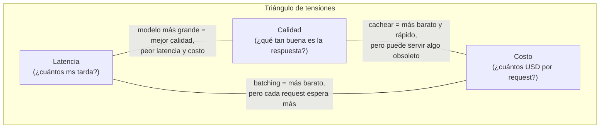
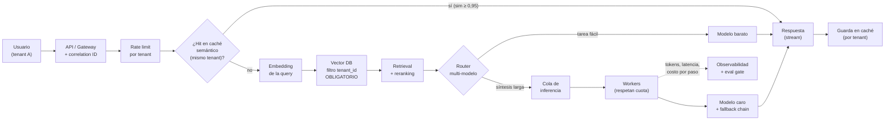

import Nivel from "@components/Nivel.astro";
import Reto from "@components/Reto.astro";
import Solucion from "@components/Solucion.astro";
import Quiz from "@components/Quiz.astro";
import CheckDominio from "@components/CheckDominio.astro";

<Nivel nivel="avanzado" />

En [8.1](/fase-8-system-design/8-1-fundamentos-system-design/) aprendiste a estimar capacidad y cazar
cuellos de botella en *cualquier* sistema. Aquí aplicas esa forma de razonar al sistema que tú vas a
construir: un asistente **RAG** o un **agente** en producción, con miles de usuarios y una factura de
tokens que crece sola. La pregunta de entrevista ya no es "diseña Twitter": es **"diseña un asistente
RAG multi-tenant"** o **"diseña un sistema de tickets con IA"** en 40 minutos. Esa pregunta tiene
cuellos de botella que ningún otro sistema tiene —el LLM es lento, caro y a veces se equivoca— y
quien sabe diseñarlos cobra más.

## Objetivos de esta lección

Al terminar deberías ser capaz de:

- **O1 — Diseñar** la arquitectura de un asistente RAG o agéntico **multi-tenant** pensada para
  **escala y costo**: dónde van las colas de inferencia, el caching (de prompt y semántico), el ruteo
  multi-modelo y los fallbacks, y por qué cada caja existe.
- **O2 — Explicar el trade-off** del triángulo **latencia / costo / calidad** en un sistema de IA, y
  defender una decisión concreta (qué modelo en qué ruta, qué se cachea, qué se degrada bajo carga)
  con un número detrás, no con una intuición.
- **O3 — Implementar y depurar** los dos mecanismos que más bajan la factura sin tocar la calidad: un
  **caché semántico** con umbral de similitud y un **router** multi-modelo con **cadena de fallback**,
  ambos testeables y deterministas.

## Por qué esto importa (y paga)

El "💰" de la Fase 8 es el techo salarial; en esta sub-unidad ese techo tiene nombre propio. Tres
razones de mercado, sin adornos:

- **Es la ronda que te separa del 80% de los portafolios.** Casi todo el mundo puede pegar un
  `retrieval + generación` y mostrar un demo. Muy pocos pueden responder "¿y si te llegan 500
  preguntas por segundo de 40 clientes distintos, cada uno con sus propios documentos, y el modelo
  cuesta USD 5 por millón de tokens de entrada?". Esa pregunta *es* la entrevista de system design de
  un AI engineer, y se contesta con esta lección.
- **Es donde se gana o se quema la plata de verdad.** Un sistema de IA mal arquitecturado no se cae:
  **sangra dinero**. Una caché semántica que ahorra el 40% de las llamadas, un router que manda las
  tareas fáciles a un modelo 5x más barato, un fallback que evita que un pico de tráfico tumbe el
  servicio —cada uno es una decisión de arquitectura con impacto directo en la factura.
- **Es tu nicho.** Un RAG o un agente en producción tiene los cuellos de botella de *cualquier*
  sistema (DB, latencia, concurrencia) **más** los suyos (tokens caros, llamadas lentas de segundos,
  salidas no determinísticas). Saber diseñar ambos a la vez es escaso. El
  [capstone de la fase](/fase-8-system-design/proyecto/) te pide diseñar tres sistemas en papel, y dos
  de los tres son de IA: esta lección es su caja de herramientas.

> [!tip] En la práctica
> El secreto para no fundir el presupuesto en un sistema con muchas tareas: no mandes
> *todo* al recurso más caro. Lo trivial va a
> equipo barato; solo lo difícil escala al caro. Lo mismo aplica con modelos: no le pidas
> a Opus que clasifique un "hola". Es como contratar a un cirujano para abrir un frasco de mayonesa.
> Caro, lento, y un poco insultante para el cirujano.

:::tip[Si ya armaste un RAG o un agente que corre]
Valida y salta: ¿sabes por qué un sistema **multi-tenant** no puede mezclar los vectores de dos
clientes en el mismo índice sin un filtro de metadata obligatorio (y por qué eso es un riesgo de
seguridad, no solo de relevancia)? ¿La diferencia entre **prompt caching** y **caching semántico**, y
cuándo cada uno ahorra de verdad? ¿Por qué una **cola** delante de la inferencia te salva de un pico de
tráfico pero te cuesta latencia? ¿Qué eliges si el modelo primario está saturado: esperar, degradar a
un modelo más barato, o fallar rápido? Si las cuatro salen sin dudar, ve directo a los
[ejercicios](#ejercicios-primero-sin-ia). Si alguna te hace dudar, la lección te la cierra.
:::

## Lo que ya traes (activación)

Recupera **de memoria**, sin abrir las notas, estas ideas previas. El tirón mental es parte del
aprendizaje:

1. De [8.1 · Fundamentos de System Design](/fase-8-system-design/8-1-fundamentos-system-design/): el
   método de servilleta (DAU → QPS → concurrencia con la ley de Little → cuello de botella). Hoy lo
   aplicas, pero el recurso compartido y escaso ya no es solo la DB: es la **cuota de tokens del
   proveedor del LLM** y el **costo por request**.
2. De [6.7 · RAG a fondo](/fase-6-ai-engineering/6-7-rag-a-fondo/): el flujo
   `ingest → chunking → embeddings → vector DB → retrieval + reranking → generación`. Hoy no lo
   construyes —lo **escalas**: ¿cuál de esas etapas se satura primero cuando entran 40 clientes?
3. De [6.16 · Costo/latencia y LLMOps](/fase-6-ai-engineering/6-16-costo-latencia-llmops/): el
   **prompt caching**, el **caching semántico** y el **ruteo de modelos**. Ahí los conociste como
   técnicas; hoy los colocas en una arquitectura y decides *dónde* van.
4. De [3.14 · Idempotencia y resiliencia](/fase-3-backend/3-14-idempotencia-resiliencia/): backoff con
   jitter, circuit breaker, timeouts. El LLM es un servicio externo lento y con rate limits; toda esa
   resiliencia ahora protege tu cadena de llamadas.

## El triángulo: latencia, costo, calidad

Antes del diseño, el modelo mental que ordena **todas** las decisiones de esta lección. Un sistema de
IA en producción optimiza tres cosas que tiran en direcciones opuestas:



No puedes maximizar las tres. **Cada técnica de esta lección compra una a costa de otra**, y tu trabajo
de arquitecto es elegir *conscientemente* qué sacrificar en cada ruta. Tenlo a mano: cuando alguien
diga "usemos siempre el modelo más potente", la respuesta no es sí ni no —es *"¿en qué ruta, y qué
estás dispuesto a pagar en latencia y costo a cambio de esa calidad?"*.

| Técnica | Compra | Paga con |
|---|---|---|
| Modelo más grande (Opus vs Haiku) | calidad | latencia + costo |
| Caching (prompt o semántico) | latencia + costo | riesgo de servir algo obsoleto |
| Ruteo a modelo barato | costo + latencia | calidad en las tareas fáciles |
| Batching de inferencia | costo (throughput) | latencia por request |
| Streaming token-por-token | latencia *percibida* | nada material (gran ganancia de UX) |
| Cola delante de la inferencia | estabilidad bajo pico | latencia en la cola |

## Ejemplo resuelto: diseña un asistente RAG multi-tenant (think-aloud)

Te voy a mostrar cómo razono el diseño en voz alta, paso a paso, igual que en una entrevista. **El
enunciado:** un SaaS B2B donde 40 empresas-cliente (tenants) suben sus propios documentos y sus
empleados hacen preguntas sobre ellos vía chat. Pico de **50 preguntas por segundo** en total.
Diséñalo para escala y costo.

**Paso 1 — Números primero, como en 8.1.** 50 QPS de pico. Cada pregunta dispara, en el peor caso: 1
embedding de la query + 1 búsqueda vectorial + 1 llamada de generación al LLM. La generación es el paso
caro y lento: pongamos ~2 s de latencia y, digamos, 3.000 tokens de entrada (contexto recuperado +
prompt) y 500 de salida. A USD 5 / millón de entrada y USD 25 / millón de salida (tarifa de un modelo
tier-Opus), eso es ~USD 0,0275 por pregunta. **50 QPS × 0,0275 = USD 1,37 por segundo ≈ USD 4.950 por
hora si todo va al modelo caro y nada se cachea.** Ese número es el que hay que atacar. *Sin* este
cálculo, el resto del diseño es decoración.

**Paso 2 — Aislamiento de tenants (esto es lo primero, y es de seguridad).** 40 clientes comparten la
misma vector DB. La pregunta crítica: ¿cómo evito que un empleado del cliente A reciba un fragmento de
un documento del cliente B? Tengo dos opciones:

- **Un índice por tenant** (aislamiento físico). Más caro de operar, pero el blast radius de un bug es
  un solo cliente.
- **Un índice compartido con filtro de metadata `tenant_id` obligatorio** en cada query. Más barato y
  simple, pero el aislamiento depende de que *nunca* se te olvide el filtro.

Pienso en voz alta: con 40 tenants y datos de empresas distintas, una fuga cruzada es un incidente de
seguridad grave (recuerda **OWASP LLM** y las *vector/embedding weaknesses* de
[6.6](/fase-6-ai-engineering/6-6-vector-databases/)). Elijo **índice compartido con filtro
obligatorio**, pero blindo el filtro: no es un parámetro opcional de la función de retrieval, es parte
de la *firma* —no se puede llamar sin `tenant_id`. Y lo testeo con un caso que intenta consultar sin
filtro y debe fallar cerrado. Si fueran 4 tenants enormes y muy regulados (banca, salud), reconsidero
el índice por tenant. *El trade-off es aislamiento vs costo operacional, y la respuesta depende del
número y el perfil de riesgo de los tenants —eso va en un ADR.*

**Paso 3 — Ataco el costo con dos cuchillos: caché y ruteo.**

- **Caché semántico.** En un SaaS B2B mucha gente del mismo cliente pregunta lo mismo ("¿cómo pido
  vacaciones?", "¿cuál es la política de gastos?"). Si guardo respuestas indexadas por el *embedding de
  la pregunta* y, ante una nueva pregunta, encuentro una previa con similitud coseno ≥ 0,95 **del mismo
  tenant**, devuelvo la respuesta cacheada sin llamar al LLM. Si el 40% de las preguntas son
  semánticamente repetidas, acabo de borrar el 40% de esos USD 4.950/hora. El trade-off: puedo servir
  una respuesta levemente obsoleta si el documento cambió —por eso la caché es **por tenant** y se
  **invalida** cuando ese tenant re-sube documentos.
- **Ruteo multi-modelo.** No todas las preguntas necesitan el modelo caro. Una clasificación ("¿esto es
  una pregunta de RRHH o de finanzas?") o un saludo los manda a un modelo barato y rápido
  (tier-Haiku). Solo la síntesis larga sobre varios documentos va al caro. El router es una decisión
  *antes* de la generación.

**Paso 4 — Colas de inferencia para sobrevivir al pico.** 50 QPS de pico no es 50 QPS sostenido. Si
mando todo directo al proveedor del LLM, un pico me revienta el rate limit y el proveedor me devuelve
429. Pongo una **cola** entre la API y la generación: la API encola el trabajo, responde al usuario
"procesando" (o mantiene un stream abierto), y un pool de *workers* consume la cola a un ritmo que
respeta mi cuota de tokens. Esto convierte un pico que tumbaría el servicio en una cola que solo añade
latencia. El trade-off es claro —cambio latencia por estabilidad— y aplica sobre todo a tareas que no
son chat interactivo (resúmenes, procesamiento batch). Para el chat en vivo, en cambio, prefiero
**fallback** rápido sobre cola larga (nadie espera 30 s mirando un spinner).

**Paso 5 — Fallbacks: qué hago cuando el primario falla.** El proveedor del LLM *va* a fallar a veces
(429 por rate limit, 529 por sobrecarga, 500). Mi cadena: intento el modelo primario; si me da 429/5xx,
reintento con **backoff + jitter** (de [3.14](/fase-3-backend/3-14-idempotencia-resiliencia/)) una o
dos veces; si sigue cayendo, **degrado a un modelo alternativo** (otro proveedor, o el mismo modelo en
otra región/tier). Solo si todo cae, fallo con un mensaje honesto. La regla: **degradar la calidad es
mejor que caerse**, salvo que el negocio diga lo contrario.

**Paso 6 — Lo no-negociable que ya es hábito tuyo.** Observabilidad: cada llamada al LLM lleva un
**correlation ID** y registra **tokens, latencia y costo por paso** (la traza del call-chain de
[5.10](/fase-5-devops/5-10-observabilidad/)). Evals: un **gate de regresión**
([6.9](/fase-6-ai-engineering/6-9-eval-driven-development/)) corre antes de cambiar de modelo o de
prompt, porque "es más barato" no sirve de nada si la calidad se cae. Sin estos dos, no sabes si tu
caché está sirviendo basura ni si el modelo barato arruinó las respuestas.

El diagrama del sistema resultante:



Fíjate en el orden de mis decisiones: **números → seguridad (aislamiento) → costo (caché + ruteo) →
estabilidad (cola + fallback) → instrumentación**. Ese orden no es casual: la seguridad y los números
mandan, el costo es el problema central de un sistema de IA, y la resiliencia y la observabilidad son
el cinturón de seguridad. En una entrevista, recorrer ese orden en voz alta *es* la respuesta correcta.

## Caching semántico vs prompt caching (no son lo mismo)

Esta confusión cae en entrevistas, así que clávala:

- **Prompt caching** (proveedor): cacheas el **prefijo** de tu prompt (system prompt grande, documentos
  fijos, ejemplos few-shot) para no pagar el reprocesamiento de esos tokens en cada request. Es un
  *match exacto de bytes* del prefijo; lo gestiona el proveedor y ahorra en el **costo de entrada** de
  requests que comparten preámbulo. No evita la llamada —la abarata.
- **Caching semántico** (tuyo): guardas **respuestas completas** indexadas por el embedding de la
  pregunta, y ante una pregunta *parecida* (no idéntica) devuelves la respuesta guardada **sin llamar
  al LLM**. Es un *match por similitud* (coseno ≥ umbral) y evita la llamada por completo.

Se combinan: el prompt caching abarata las llamadas que sí haces; el semántico elimina las que puedes
reusar. Pero el semántico tiene un filo: si el umbral es muy bajo, sirves la respuesta equivocada a una
pregunta solo *parecida*. Un umbral de 0,95 es estricto; 0,80 es temerario. Y debe ser **por tenant e
invalidable**, o servirás datos viejos o cruzados.

## Un router con cadena de fallback (código mínimo y correcto)

El router decide el modelo *antes* de generar; la cadena de fallback decide qué hacer *cuando el modelo
elegido falla*. Aquí en Python con el SDK de Anthropic, sin adornos:

```python
import anthropic

client = anthropic.Anthropic()

# Ruteo: la tarea fácil al modelo barato y rápido; la difícil al caro.
def elegir_modelo(tipo_tarea: str) -> str:
    if tipo_tarea in ("clasificacion", "saludo", "extraccion_simple"):
        return "claude-haiku-4-5"      # barato, rápido, suficiente
    if tipo_tarea == "sintesis_larga":
        return "claude-opus-4-8"       # caro, pero la calidad importa
    return "claude-sonnet-4-6"         # balance por defecto

# Fallback: si el modelo elegido se satura o cae, degrada al siguiente.
def responder(messages, tipo_tarea: str):
    primario = elegir_modelo(tipo_tarea)
    cadena = [primario, "claude-haiku-4-5"]   # degradar es mejor que caerse
    for modelo in dict.fromkeys(cadena):       # sin duplicados, en orden
        try:
            return client.messages.create(
                model=modelo,
                max_tokens=1024,
                messages=messages,
            )
        except (anthropic.RateLimitError, anthropic.InternalServerError):
            continue   # 429 o 5xx: el modelo está saturado/caído, prueba el siguiente
    raise RuntimeError("todos los modelos de la cadena fallaron")
```

Dos cosas que un revisor senior mira: (1) el fallback solo reintenta en **429/5xx** (saturación/caída),
no en un **400** —un 400 es un error tuyo en el request y reintentarlo en otro modelo solo esconde el
bug; (2) la cadena degrada *hacia abajo* en costo y calidad, nunca hacia arriba —no tiene sentido que
el fallback de Haiku sea Opus.

> [!warning] Atención: el fallback "server-side" no es para esto
> El SDK de Anthropic tiene un parámetro `fallbacks` que reintenta dentro de la misma llamada, pero ese
> mecanismo dispara **solo ante rechazos de política de seguridad** (`stop_reason: "refusal"`), **no**
> ante rate limits ni errores 5xx. Para resiliencia operacional (saturación/caída) el patrón correcto
> es el `try/except` de arriba con reintento en otro modelo. Confundir los dos es un error que se nota
> en una review.

## Non-examples y misconceptions

:::caution[Podrías pensar... y por qué está mal]
**"Para que sea de calidad, mando todo al modelo más potente."**
Mal: la calidad de una clasificación trivial es idéntica en Haiku y en Opus, pero Opus cuesta ~5x y
tarda más. Mandar todo al caro es quemar plata sin ganar calidad donde no hace falta. El ruteo existe
justo para esto.

**"El caching semántico es como un caché normal: si la pregunta no es idéntica, no hay hit."**
Mal: ese es un caché de *match exacto*. El semántico hace match por **similitud de embeddings**, así que
"¿cómo pido mis vacaciones?" y "¿cuál es el proceso para tomarme días libres?" pueden ser el mismo hit.
Ese es justamente su poder —y su riesgo si el umbral es bajo.

**"Multi-tenant = pongo un `WHERE tenant_id = ?` y listo."**
Incompleto y peligroso: si ese filtro es *opcional* en tu función de retrieval, tarde o temprano alguien
hace una query sin él y filtras datos entre clientes. El filtro debe ser obligatorio en la firma y
testeado con un caso que falle cerrado. Es seguridad (OWASP LLM, vector weaknesses), no solo relevancia.

**"Una cola delante de la inferencia siempre mejora el sistema."**
Mal en el caso interactivo: una cola cambia latencia por estabilidad, lo cual es excelente para batch y
resúmenes asíncronos, pero veneno para un chat en vivo donde el usuario mira el spinner. Ahí prefieres
fallback rápido y degradación, no encolar.

**"Si el modelo barato responde bien en mis pruebas, ya está, ahorré."**
Mal sin un eval gate: "responde bien" en 3 ejemplos a mano no es evidencia. Cambiar de modelo sin correr
el eval harness ([6.9](/fase-6-ai-engineering/6-9-eval-driven-development/)) es cómo se cae la calidad en
silencio mientras celebras el ahorro.
:::

## Práctica con andamiaje (faded)

### Mini-reto A — ¿Qué se satura primero?

Tu RAG multi-tenant tiene: API stateless (escala horizontal fácil) → vector DB compartida con réplicas
de lectura → **una sola cuota de tokens** del proveedor del LLM (digamos 1 millón de tokens de salida
por minuto). El tráfico se **duplica** porque entran 20 tenants nuevos.

**Predice (sin leer la pista):** ¿qué se satura primero —la API, la vector DB o la cuota del LLM? ¿Por
qué? ¿Y cuál es la primera intervención de mayor impacto y menor costo?

<Solucion title="Ver pista (no la solución completa)">

Pregúntate cuál de los tres recursos es **clonable por ti** y cuál es un **límite externo y fijo** que
no controlas. La API es stateless: agregas instancias y el LB reparte. La vector DB escala lecturas con
réplicas. Pero la **cuota de tokens del proveedor** es un techo que tú no subes con un clic —es el
recurso compartido y escaso del sistema (igual que la DB primaria era el cuello en 8.1, aquí lo es la
cuota). Sobre la intervención: ¿qué técnica de esta lección **elimina llamadas enteras** (no solo las
abarata) y por tanto libera cuota casi gratis? Justifica por qué esa va antes de "pedir más cuota al
proveedor".

</Solucion>

### Mini-reto B — Parsons: ordena el caché semántico

Estas líneas son el corazón de un caché semántico, pero están **desordenadas**. Reordénalas mentalmente
(o en papel) para que: primero se calcule el embedding de la pregunta, luego se busque la entrada más
parecida **del mismo tenant**, y solo se devuelva el hit si la similitud supera el umbral.

```text
A)    emb = embed(pregunta)
B)        return entrada.respuesta            # HIT: reusa sin llamar al LLM
C)    mejor, sim = vecino_mas_cercano(emb, tenant_id)
D)    if sim >= UMBRAL:                        # p. ej. 0,95
E)    return None                              # MISS: hay que llamar al LLM
F)    # entra: pregunta, tenant_id
```

Piensa: ¿el cálculo del embedding va antes o después de la búsqueda? ¿Por qué el vecino más cercano se
restringe al `tenant_id`? ¿El `return None` está dentro o fuera del `if`? (El orden correcto lo valida
el corrector; lo importante es que **justifiques** por qué el filtro por tenant es obligatorio y no
opcional.)

## Ejercicios Primero-Sin-IA

> Trabaja **a mano primero**, sin IA, dentro del timebox. Cuando termines, pídele a tu IA que corrija
> con el framework de `.ai/` (que **revise** tu intento, no que lo resuelva por ti). Las carpetas viven
> en tu repo; ábrelas en tu editor.

<Reto title="Diseña un RAG multi-tenant para escala y costo" timebox="45 min">

Te entregamos la especificación de un sistema (`sistema.md`): un asistente RAG B2B con sus números de
tráfico, número de tenants y tarifas del modelo. **Sin escribir código**, produce un documento de
diseño (`diseno.md`) que aplique el método del ejemplo resuelto:

1. **Números primero:** de QPS de pico a costo por hora si todo va al modelo caro y nada se cachea.
   Muestra la aritmética (tokens × tarifa × QPS).
2. **Aislamiento de tenants:** decide entre índice-por-tenant e índice-compartido-con-filtro, nombra el
   **trade-off** (aislamiento vs costo operacional) y cómo blindas el filtro contra fugas cruzadas.
3. **Plan de costo ordenado por impacto:** al menos 2 intervenciones (caché semántico, ruteo
   multi-modelo) con el **ahorro estimado** y el **trade-off** de cada una (incluida la obsolescencia
   de la caché).
4. **Resiliencia bajo pico:** decide dónde va una **cola de inferencia** y dónde va **fallback** rápido,
   y justifica por qué (interactivo vs batch).
5. **Una decisión del triángulo:** señala **un** punto donde sacrificas conscientemente calidad por
   costo (o latencia por estabilidad) y di **por qué** es la decisión correcta para este negocio.
6. **Diagrama Mermaid** del sistema resultante + **un ADR** (contexto, decisión, consecuencias) para la
   decisión de aislamiento de tenants.

Carpeta del ejercicio: `ejercicios/fase-8/disenar-rag-multitenant-escala/`

**Hecho significa:** las 6 secciones presentes; la aritmética de costo es coherente y está mostrada; la
decisión de aislamiento nombra su trade-off y su blindaje; ≥2 intervenciones con ahorro y trade-off; la
cola y el fallback están ubicados con justificación interactivo/batch; una decisión del triángulo
defendida como decisión de negocio; el diagrama Mermaid renderiza y el ADR tiene las tres partes.

</Reto>

<Reto title="Caché semántico + router con fallback (testeable y determinista)" timebox="45 min">

Implementa en Python puro, partiendo de un esqueleto con `TODO`s (`cache_router.py`), dos piezas que
**no llaman a ningún LLM real** —la función de embedding y la de llamada al modelo se **inyectan**, así
los tests son deterministas (mismo input → mismo output, sin red, sin flakiness):

- `SemanticCache.get(pregunta, tenant_id)`: calcula el embedding (con la `embed_fn` inyectada), busca el
  vecino más cercano **del mismo tenant** por similitud coseno y devuelve la respuesta cacheada solo si
  la similitud **≥ umbral**; si no, devuelve `None`. `SemanticCache.put(...)` guarda una entrada por
  tenant.
- `elegir_modelo(tipo_tarea)`: rutea la tarea fácil al modelo barato y la difícil al caro.
- `responder_con_fallback(call_fn, cadena, ...)`: recorre la cadena de modelos; si `call_fn` lanza un
  error **reintentable** (saturación/caída), pasa al siguiente; si lanza uno **no reintentable** (error
  del request), lo deja propagar sin enmascararlo.

Carpeta del ejercicio: `ejercicios/fase-8/cache-semantico-router-fallback/`

**Hecho significa:** `uv run pytest` (o `pytest`) en verde —los tests cubren el hit por similitud, el
miss bajo umbral, el **aislamiento por tenant** (un tenant nunca recibe el hit de otro), el ruteo
barato/caro, el fallback que degrada en 429/5xx y la **no-degradación** ante un error del request (se
propaga). Cero llamadas a un LLM real. Agregaste **al menos un test propio** (por ejemplo: que dos
preguntas idénticas de tenants distintos no comparten caché, o que un umbral más alto convierte un hit
en miss).

</Reto>

## Check de dominio (active recall)

<CheckDominio items={[
  "Explicar, de memoria, por qué la cuota de tokens del proveedor (no la DB ni la API) suele ser el cuello de botella de un sistema de IA a escala",
  "Diferenciar prompt caching y caching semántico: qué cachea cada uno, cómo hace match (bytes vs similitud) y qué ahorra (abaratar vs eliminar la llamada)",
  "Defender por qué el filtro tenant_id en un RAG multi-tenant es seguridad y no solo relevancia, y cómo lo blindas contra fugas",
  "Recorrer el triángulo latencia/costo/calidad y dar un ejemplo de cada técnica que compra una a costa de otra",
  "Explicar cuándo una cola de inferencia ayuda (batch) y cuándo estorba (chat interactivo), y qué pones en su lugar",
  "Explicar por qué un fallback chain solo reintenta en 429/5xx y nunca en un 400, y por qué degrada hacia abajo en costo",
]} />

<Quiz
  question="Tu asistente RAG procesa 20 preguntas/s. El 50% son semánticamente repetidas (mismas preguntas frecuentes por tenant). Cada llamada al LLM cuesta USD 0,02. Si añades un caché semántico que captura ese 50%, ¿cuánto bajas el costo por hora de generación?"
  options={[
    "De ~USD 1.440/h a ~USD 720/h (eliminas la mitad de las llamadas)",
    "No baja: el caché semántico abarata cada llamada pero no la elimina",
    "Baja solo un 10%, porque el embedding de la query también cuesta",
    "De ~USD 1.440/h a ~USD 0 (el caché sirve todo)",
  ]}
  answer={0}
  explanation="20 req/s x 0,02 x 3600 = USD 1.440/h si todo va al LLM. El caché semántico ELIMINA la llamada en un hit (no la abarata: eso es prompt caching), así que capturar el 50% de las preguntas reduce el costo de generación a la mitad, ~USD 720/h. El embedding de la query es órdenes de magnitud más barato que la generación, así que no mueve la aguja."
/>

<Quiz
  question="El proveedor de tu modelo primario devuelve 429 (rate limit) en un pico de tráfico de chat interactivo. ¿Cuál es la respuesta de arquitectura más adecuada?"
  options={[
    "Encolar todas las preguntas y procesarlas cuando baje el pico",
    "Reintentar con backoff+jitter una o dos veces y, si sigue, degradar a un modelo alternativo más barato",
    "Devolver 500 al usuario para que reintente él",
    "Subir max_tokens para que cada llamada rinda más",
  ]}
  answer={1}
  explanation="En chat interactivo el usuario está esperando: una cola larga es veneno (cambiarías estabilidad por una latencia que nadie tolera mirando un spinner). Lo correcto es reintentar con backoff+jitter ante el 429 y, si persiste, degradar a un modelo alternativo: degradar la calidad es mejor que caerse. La cola es la respuesta correcta para tareas batch/asíncronas, no para chat en vivo."
/>

## Recursos

Documentación y fuentes de autoridad primero:

- [Anthropic — Prompt caching](https://platform.claude.com/docs/en/build-with-claude/prompt-caching)
  — qué cachea, cómo es el match de prefijo y qué ahorra en costo de entrada.
- [Anthropic — Errors & rate limits](https://platform.claude.com/docs/en/api/errors) — los códigos
  429/5xx que disparan tu fallback chain y cuáles (400) nunca debes reintentar.
- [OpenAI — Production best practices](https://platform.openai.com/docs/guides/production-best-practices)
  — latencia, costo, rate limits y caching desde la perspectiva del otro gran proveedor.
- [Pinecone — Multitenancy in vector databases](https://docs.pinecone.io/guides/index-data/implement-multitenancy)
  — namespaces, índice-por-tenant vs filtro de metadata, con el lenguaje de producción.
- [ragas](https://docs.ragas.io/) y [Langfuse](https://langfuse.com/docs) — el eval gate y la traza de
  costo/latencia/tokens por paso que hacen seguro cambiar de modelo o de prompt.
- _Designing Data-Intensive Applications_ (Martin Kleppmann) — colas, backpressure y particionamiento;
  el fondo no-IA de la mitad de este diseño. Canónico, no oficial.

## Conexión con el capstone de la fase

El [ejercicio capstone de la Fase 8](/fase-8-system-design/proyecto/) te pide **diseñar tres sistemas
en papel**, y **dos de los tres son exactamente lo de esta lección**: un RAG multi-tenant y un sistema
de automatización de tickets con IA (un agente que clasifica, decide y ejecuta —ver
[7.7](/fase-7-automatizacion/7-7-agentes-automatizacion-ia/)). Esta sub-unidad es su caja de
herramientas directa:

- El **cálculo de costo por hora** del ejemplo resuelto es lo primero que debe aparecer en cada diseño
  de IA del capstone: sin el número, el diagrama es decoración.
- El **aislamiento de tenants**, el **caché semántico**, el **ruteo multi-modelo** y la **cola de
  inferencia** son las cajas con las que llenas el diagrama y que justificas en un **ADR**.
- Cada decisión del **triángulo latencia/costo/calidad** va a un ADR: es lo que un revisor senior busca
  para distinguir un diseño pensado de uno copiado del primer tutorial de RAG.
- El **eval gate** y la **traza de costo** que aquí marcamos como no-negociables son parte del
  Definition of Done de cualquier capstone que toque IA.

## Reflexión + spaced repetition

Escribe 3–4 frases respondiendo: **¿cuál idea chocó más con tu intuición previa —que el cuello de
botella de un sistema de IA casi nunca es tu código sino la cuota del proveedor, que "usar siempre el
mejor modelo" es un anti-patrón de costo, o que el caching semántico puede servir la respuesta
equivocada— y por qué tu modelo anterior te empujaba a lo contrario?** Nombrar ese choque fija el
aprendizaje.

> [!tip] Gancho de spaced repetition
> - **Mañana:** reescribe de memoria, sin mirar, el **orden de las 6 decisiones** del ejemplo resuelto
>   (números → aislamiento → costo → estabilidad → instrumentación... y la sexta). Si no te sale, no lo
>   aprendiste todavía.
> - **En 3 días:** explica en voz alta (como en una entrevista, en inglés si puedes) la diferencia
>   entre **prompt caching** y **caching semántico** en 30 segundos. Si tropiezas, vuelve a esa sección.
> - **En 1 semana:** toma un producto de IA que uses (un chatbot, un asistente de código) e imagina su
>   ruteo multi-modelo: ¿qué preguntas tuyas irían al modelo barato y cuáles al caro?
> - **Antes del capstone:** convierte tu decisión de aislamiento de tenants en un **ADR** corto
>   (contexto, decisión, consecuencias). Es el artefacto que el capstone exige para cada sistema.

> [!info] Contexto
> Tu demo será gratis; esta factura de tokens no. Diséñala bien y ahorrarás miles. Diséñala
> mal y descubrirás, como muchos antes que tú, que un demo bonito y un sistema en producción son dos
> animales muy distintos. Uno de ellos muerde la billetera.
