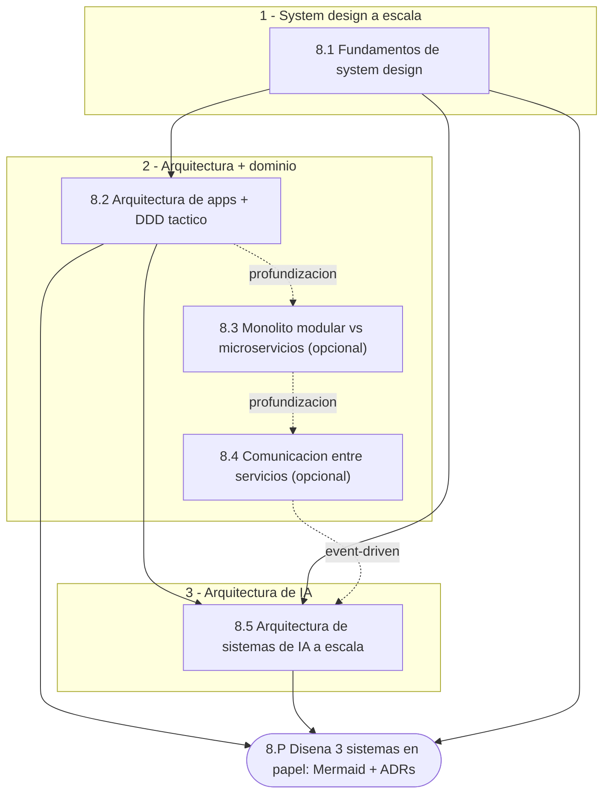
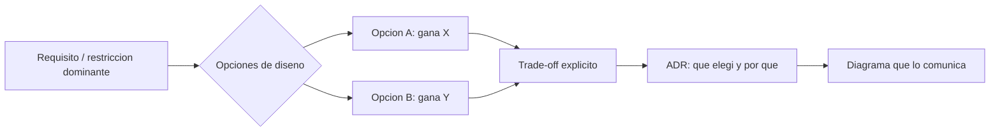

import Reto from "@components/Reto.astro";
import Solucion from "@components/Solucion.astro";
import Quiz from "@components/Quiz.astro";
import CheckDominio from "@components/CheckDominio.astro";
import Nivel from "@components/Nivel.astro";

<Nivel nivel="avanzado" />

Hasta aquí construiste **features**: un endpoint, un componente, un agente, un
pipeline. La Fase 8 te enseña a subir un nivel de zoom y pensar el **sistema
completo**: qué pasa cuando ese endpoint recibe mil veces más tráfico, cuándo un
modelo del dominio empieza a pudrirse, cómo hablan dos servicios sin acoplarse, y
cómo se diseña una plataforma de IA para que sea rápida, barata y buena **a la
vez** (spoiler: no se puede tener las tres al máximo). Es el salto de "sé que esto
funciona en mi máquina" a "sé por qué este diseño aguanta —y dónde se va a romper
primero".

Esta fase es deliberadamente **distinta** a las anteriores. Casi no escribirás
código: la mayor parte del trabajo es **pensar, diagramar y decidir con
argumentos**. Esa es exactamente la habilidad que se examina en las entrevistas de
los roles mejor pagados, donde te ponen frente a una pizarra (real o digital) y te
dicen "diséñame X". El que solo sabe codear features se queda mudo; el que sabe
razonar a nivel de sistema dirige la conversación.

El arco de la fase va en tres movimientos:

1. **System design a escala** ([8.1](/fase-8-system-design/8-1-fundamentos-system-design/)) —
   el vocabulario y la aritmética de los sistemas grandes: escalado horizontal vs
   vertical, load balancing, caching y CDN, réplicas y sharding, el teorema CAP con
   intuición, y rate limiting + idempotencia a escala. Aprendes a **estimar
   capacidad** y a encontrar el cuello de botella antes de que lo encuentre
   producción.
2. **Arquitectura de aplicaciones + DDD táctico**
   ([8.2](/fase-8-system-design/8-2-arquitectura-ddd/)) — el cimiento de
   ports & adapters que aplicaste *light* en la
   [Fase 3](/fase-3-backend/3-9-ports-adapters-hexagonal/) crece a escala, y le
   sumas **DDD táctico hands-on**: value objects, entities, aggregates y domain
   events que protegen las invariantes del negocio; **bounded contexts** y
   **anti-corruption layer** para integrar sistemas externos sin que su modelo
   sucio te contamine. Aquí también viven, como **profundización**, las decisiones
   de [monolito modular vs microservicios](/fase-8-system-design/8-3-monolito-vs-microservicios/)
   y de [comunicación entre servicios](/fase-8-system-design/8-4-comunicacion-servicios/).
3. **Arquitectura de IA a escala** ([8.5](/fase-8-system-design/8-5-arquitectura-ia-escala/))
   — tu especialización. System design aplicado a IA: diseñar un RAG o un sistema
   agéntico para escala y costo, con fallbacks de modelo, caching semántico, ruteo
   multi-modelo y colas de inferencia, navegando el **triángulo
   latencia/costo/calidad**. Es la pregunta de system design que distingue al AI
   engineer del que "solo llama a una API".

El cierre no es código que corre: es el ejercicio
[**diseña 3 sistemas en papel**](/fase-8-system-design/proyecto/) —RAG multi-tenant,
automatización de tickets con IA y pipeline de datos para IA— documentado con
**Mermaid + ADRs**. Diseñar bien en papel es la prueba más honesta de que entiendes
el sistema: no te puedes esconder detrás de un framework que "ya lo resuelve".

## Objetivos de la fase

Al cerrar la Fase 8 sabrás **hacer** esto (no solo "haber oído de ello"):

- **Estimar** la capacidad de un sistema (de usuarios diarios a requests/segundo a
  concurrencia) y **diagnosticar** qué recurso se satura primero, proponiendo un
  plan de escala donde cada intervención (réplica, caché, sharding) trae su
  trade-off explícito.
- **Modelar** un dominio con DDD táctico —value objects, aggregates que protegen
  invariantes, domain events— y **defender** dónde DDD paga y dónde es
  over-engineering; diseñar un **anti-corruption layer** que aísle tu modelo de un
  sistema externo sucio.
- **Decidir** la arquitectura por la **restricción dominante**: monolito modular vs
  microservicios, comunicación síncrona vs event-driven, y justificar con costos
  reales (latencia de red, consistencia distribuida, operación), no con modas.
- **Diseñar** un sistema de IA a escala que navegue el triángulo
  **latencia/costo/calidad** —fallbacks, caching semántico, ruteo multi-modelo— y
  **comunicar** el diseño con un diagrama claro y un set de **ADRs** que registren
  por qué elegiste cada cosa.

:::tip[Por qué importa (relevancia de mercado)]
> 💰 Arquitectura y system design son **el techo salarial**: es lo que separa al
semi-senior del senior y lo que se evalúa en las entrevistas de los roles
remoto-USD y mid+ que mejor pagan. La habilidad escasa no es saber *qué* es un load
balancer —eso lo googlea cualquiera— sino **razonar trade-offs bajo presión** y
**defender una decisión con números** frente a una pizarra. El AI engineer que
además sabe diseñar una plataforma de IA para escala y costo (no solo "llamar a la
API de un modelo") está en una intersección que casi nadie ocupa. Empieza ahora
aunque vayas a dominarlo de verdad recién con el próximo rol: el músculo de pensar
en sistemas se construye lento, y es el que más rinde a largo plazo.
:::

## ¿Para quién es esta fase? (y qué necesitas antes)

Está escrita para **cero real** en system design: cada concepto —load balancer,
sharding, aggregate, bounded context, caching semántico— se enseña desde la
intuición, con un ejemplo resuelto y un diagrama antes de pedirte que diseñes tú.
Pero la Fase 8 **integra** casi todo lo anterior; antes de entrar conviene que
tengas:

- **Arquitectura *light* (ports & adapters)** —
  [`3.9`](/fase-3-backend/3-9-ports-adapters-hexagonal/). Aquí esa misma idea crece
  a escala; si no separaste dominio de infraestructura en la Fase 3, 8.2 te costará.
- **Bases de datos a fondo** — [Fase 3](/fase-3-backend/): transacciones, índices,
  el problema N+1, connection pooling. El escalado de datos (réplicas, sharding) de
  8.1 se apoya en esto.
- **Sistemas de IA** — [Fase 6](/fase-6-ai-engineering/): RAG, agentes, evals,
  costo/latencia y seguridad LLM. La sub-unidad 8.5 **diseña a escala** lo que en
  F6 construiste a pequeña escala; no reenseña RAG, lo arquitecta.
- **Automatización e integración** — [Fase 7](/fase-7-automatizacion/):
  idempotencia, DLQ, event-driven, el agente que ejecuta acciones. La comunicación
  entre servicios (8.4) y el sistema de tickets del capstone heredan ese músculo.

:::tip[Si ya lo tocaste]
Si vienes con experiencia (diseñaste sistemas, dibujaste arquitecturas, discutiste
microservicios), **no saltes en seco: valida**. La trampa del que "ya hace system
design" es haber dibujado **diagramas decorativos** —cajas y flechas bonitas— sin
una sola decisión defendida con números ni un trade-off nombrado. Haz el
diagnóstico del final de esta página e intenta el ejercicio de la sub-unidad que
crees dominar (p. ej. la estimación de capacidad de 8.1 o el modelado de aggregate
de 8.2). Si lo cierras sin notas y puedes defender, por ejemplo, **por qué eliges C
sobre A ante una partición de red** o **por qué un anti-corruption layer no es
over-engineering aquí**, marca la casilla y avanza. Si te trabas, quédate: el "ya
lo sé" era el diagrama bonito sin el razonamiento. La experiencia previa es un
**atajo de validación**, nunca un permiso para saltar a ciegas.
:::

## Mapa de la fase

La Fase 8 son **5 sub-unidades** de contenido más el ejercicio de cierre. Primero
el vocabulario y la aritmética del sistema (8.1), luego la arquitectura interna y
táctica del dominio (8.2, con 8.3 y 8.4 como profundización de servicios
distribuidos), y al final tu especialización: **arquitectura de IA a escala** (8.5).

| # | Sub-unidad | Qué construyes / entiendes ahí |
|---|---|---|
| 8.1 | [Fundamentos de System Design](/fase-8-system-design/8-1-fundamentos-system-design/) | Escalado horizontal/vertical, load balancing, caching/CDN, réplicas/sharding, **CAP con intuición**, rate limiting + idempotencia a escala; **estimar capacidad** y hallar el cuello de botella. |
| 8.2 | [Arquitectura de aplicaciones + DDD táctico](/fase-8-system-design/8-2-arquitectura-ddd/) | Clean/hexagonal a escala; **DDD hands-on** (value objects, entities, aggregates, domain events); **bounded contexts** + **anti-corruption layer**; cuándo DDD paga y cuándo sobra. |
| 8.3 | [Monolito modular vs microservicios](/fase-8-system-design/8-3-monolito-vs-microservicios/) 🔵 | Cuándo cada uno; el costo real de microservicios (latencia de red, consistencia, operación); el **monolito modular** como punto medio. **Profundización / vocabulario de entrevista.** |
| 8.4 | [Comunicación entre servicios](/fase-8-system-design/8-4-comunicacion-servicios/) 🔵 | REST síncrono vs colas/eventos; comando vs evento; nociones de **Kafka** (log, topics, particiones, offsets, consumer groups); consistencia eventual y sus trampas. **Profundización.** |
| 8.5 | [Arquitectura de sistemas de IA a escala](/fase-8-system-design/8-5-arquitectura-ia-escala/) | Diseñar RAG/agente para escala y costo; **fallbacks**, **caching semántico**, **ruteo multi-modelo**, colas de inferencia; el **triángulo latencia/costo/calidad**. Tu especialización. |
| 8.P | [🛠️ Ejercicio — Diseña 3 sistemas en papel](/fase-8-system-design/proyecto/) | RAG multi-tenant, automatización de tickets con IA, y pipeline de datos para IA; **Mermaid + ADRs**, sin código. La prueba de que piensas en sistemas. |

> 🔵 = **opcional / profundización**. Las sub-unidades **8.3** (monolito vs
> microservicios) y **8.4** (comunicación entre servicios) no son ruta crítica:
> son **vocabulario de entrevista** valioso, pero puedes diferirlas sin romper el
> arco que va de fundamentos (8.1) a tu especialización en IA (8.5). El resto es
> ruta crítica.

## El hilo que define la fase: no hay arquitectura sin trade-off

Si te llevas **una** idea de la Fase 8, que sea esta: **toda decisión de
arquitectura compra algo a cambio de otra cosa.** No existe "la mejor arquitectura";
existe la que mejor calza con la restricción que domina tu caso. Una réplica de
lectura compra throughput de lectura y paga *replication lag*. Microservicios
compran despliegue independiente y pagan latencia de red y consistencia
distribuida. El caching semántico compra latencia y costo y paga riesgo de
servir una respuesta obsoleta. El ingeniero junior pregunta "¿cuál es la mejor?";
el semi-senior responde "depende, y aquí está mi razón".

Ese mismo patrón se repite en cada sub-unidad. En 8.1 lo ves en CAP: ante una
partición de red, **eliges** consistencia o disponibilidad, no las dos. En 8.5
lo ves en el triángulo de la IA: subir calidad (un modelo más grande) sube costo
y latencia; bajarlos arriesga calidad. Aprender system design es, en el fondo,
aprender a **nombrar el trade-off y elegir con argumento**:

Por eso el método de esta fase es **ADRs + diagramas**: cada decisión se registra
con su porqué (un *Architecture Decision Record*) y se comunica con un diagrama
limpio. No es burocracia: es la diferencia entre "lo diseñé" y "puedo defender por
qué lo diseñé así" —que es justo lo que te preguntan en la entrevista.

:::caution[Misconception común]
"System design es dibujar cajas y flechas bonitas." Está mal: el diagrama es el
**resultado** de una cadena de decisiones, no el trabajo. Un diagrama sin un solo
trade-off nombrado, sin una estimación de capacidad y sin un ADR que diga *por qué*
no es arquitectura: es decoración. Otra trampa frecuente: **diseñar para una escala
que no tienes**. Meter microservicios, Kafka y sharding en un sistema con 100
usuarios no te hace senior —te hace alguien que paga complejidad sin comprar nada.
El semi-senior empieza con lo simple (monolito modular) y **justifica** cada salto
de complejidad con una restricción real. Diseñar de más es tan error como diseñar
de menos.
:::

<Quiz
  question="Tu sistema de inventario sufre una partición de red entre dos nodos y un cliente intenta comprar el último artículo en stock. Según el teorema CAP, ¿qué decisión de diseño evita vender el mismo artículo dos veces?"
  options={[
    "Elegir A (disponibilidad): que ambos nodos respondan 'comprado', aunque sea el mismo stock",
    "Elegir C (consistencia): rechazar la venta (no disponible) antes que arriesgar un dato inconsistente",
    "Elegir P (tolerancia a particiones): desactivar la red entre nodos",
    "Elegir las tres a la vez: C, A y P",
  ]}
  answer={1}
  explanation="P no se elige ni se apaga: las redes fallan, la partición ocurre. Ante ella, eliges entre C y A. Vender el último artículo dos veces (inconsistencia) es peor que un error temporal, así que eliges C (sistema CP): rechazas la venta antes que dar un dato inconsistente. Un contador de 'me gusta' elegiría lo contrario (AP), porque ahí un número momentáneamente inexacto no hace daño. CAP no es 'elige 2 de 3': es 'cuando hay partición, eliges C o A'."
/>

## Checklist de avance

Marca una sub-unidad como completa **solo** cuando cumplas las tres condiciones
(criterio del roadmap): (a) entiendes el concepto **sin notas**, (b) hiciste el
ejercicio **sin IA**, y (c) lo **aplicaste** en alguno de los 3 diseños del
ejercicio de cierre.

- [ ] 8.1 — Fundamentos de System Design
- [ ] 8.2 — Arquitectura de aplicaciones + DDD táctico
- [ ] 8.5 — Arquitectura de sistemas de IA a escala
- [ ] 8.3 — Monolito modular vs microservicios *(opcional)*
- [ ] 8.4 — Comunicación entre servicios *(opcional)*
- [ ] 8.P — Ejercicio: diseña 3 sistemas en papel (Mermaid + ADRs; cumple el Definition of Done aplicable de abajo)
- [ ] `RETROSPECTIVA.md` de la fase escrita (qué aprendí, qué trade-off me costó nombrar, qué diseño lo demuestra)

<CheckDominio
  title="Antes de dar la Fase 8 por cerrada, ¿puedes…?"
  items={[
    "Estimar la concurrencia de un sistema a partir de sus usuarios diarios y la latencia objetivo, y decir qué recurso se satura primero, sin notas",
    "Explicar el teorema CAP con un ejemplo propio y justificar cuándo elegirías C y cuándo A ante una partición",
    "Modelar un dominio con un aggregate que proteja una invariante y explicar por qué un anti-corruption layer aísla tu modelo de un sistema externo sucio",
    "Decidir ante un caso concreto si conviene un monolito modular o microservicios, y nombrar el costo real que pagas al distribuir",
    "Diseñar un RAG o agente a escala explicando cómo navegas el triángulo latencia/costo/calidad (fallback, caching semántico, ruteo multi-modelo)",
    "Defender cualquiera de tus decisiones con un ADR y un diagrama, no con 'porque sí'",
  ]}
/>

## Definition of Done (la vara del ejercicio de cierre)

Todos los capstones del curso comparten **un único** Definition of Done. La Fase 8
es especial: su entregable es un **diseño en papel**, no código que corre. Por eso
algunos puntos del DoD aplican **directamente** y otros se cumplen **a nivel de
diseño** (los registras como decisiones de arquitectura, no como código
instrumentado). La honestidad importa: un diseño que *ignora* seguridad u
observabilidad no es "incompleto por ser papel", es un mal diseño.

:::caution[Lo que aplica al Ejercicio F8 (diseña 3 sistemas en papel)]
**Aplica directamente (entregables de primera clase):**
1. **Spec** breve de cada sistema (qué resuelve, restricciones, escala objetivo) +
   **ADRs** de cada decisión clave (punto 1 del DoD). *Es el corazón de esta fase.*
2. **Diagramas Mermaid** claros por sistema (el "demo que CORRE" del punto 8 se
   reemplaza por **el diagrama que comunica**) + **write-up de trade-offs** (qué
   elegí, qué descarté, qué medí o estimé) + **README en inglés**.
3. **Conventional Commits** en el historial del repo de diseño (punto 9).

**Aplica a nivel de diseño (decisiones, no código instrumentado):**
4. **Seguridad por diseño** (punto 3): en el RAG multi-tenant, **aislamiento de
   datos entre tenants** y filtrado por metadata; OWASP LLM/Agentic en el sistema
   de tickets (validación de salida antes de ejecutar, least-privilege).
5. **Observabilidad por diseño** (punto 4): dónde van logs, trazas y correlation
   IDs; para IA, la traza del call-chain con tokens/latencia/costo por paso.
6. **Eval gate + budget de costo/latencia por diseño** (punto 5): el RAG y el
   sistema de tickets declaran *dónde* viven el eval harness y el techo de costo,
   aunque no se ejecuten aquí.
7. **HITL y least-privilege por diseño** (punto 6) en el sistema de tickets que
   ejecuta acciones.

> Tests, observabilidad instrumentada y eval harness ejecutado (puntos 2, 4 y 5
> *corriendo*) no aplican porque no hay código —pero el diseño debe **dejar el
> hueco listo** para ellos. Un diseño que no dice *dónde* irían está incompleto.
:::

## Conexión con el ejercicio de cierre

Cada sub-unidad es una pieza de los **3 sistemas en papel**:

- **8.1** te da la estimación de capacidad, el caching, las réplicas y el rate
  limiting que dimensionan el **pipeline de datos para IA** y el RAG multi-tenant.
- **8.2** te da los bounded contexts y el anti-corruption layer para separar
  tenants y para integrar el sistema externo de tickets sin contaminar tu dominio.
- **8.3 / 8.4** (si las haces) te dan el criterio para decidir si esos 3 sistemas
  son un monolito modular o se parten, y cómo se comunican sus piezas.
- **8.5** es el corazón del RAG multi-tenant y de la automatización de tickets:
  fallbacks, caching semántico, ruteo multi-modelo y el triángulo
  latencia/costo/calidad.

No estudias temas sueltos: ensamblas el criterio para **diseñar y defender
sistemas completos** —la habilidad que la entrevista de los roles mejor pagados
examina, y que reaparece en
[Track-0](/track-0-empleabilidad/) como "system design RAG en 40 minutos".

## Ejercicio de entrada: diagnóstico, plan y contrato de método

Antes de la primera lección, orientarte. Como en toda portada, este ejercicio no se
corrige "bien o mal": se corrige por **honestidad, concreción y un trade-off
defendible**. Es tu *placement* y tu contrato de método para una fase que se evalúa
por cómo **piensas**, no por cuánto código produces.

<Reto title="Diagnóstico de Fase 8 + contrato de método de diseño" timebox="40 min">

Sin IA, deja **tres archivos markdown** en `ejercicios/fase-8/fase-8-index/`:

1. **`diagnostico.md`** — dos tablas:
   - **Prerrequisitos:** arquitectura *light* / ports & adapters (`3.9`), bases de
     datos a fondo (Fase 3), sistemas de IA (Fase 6), automatización e integración
     (Fase 7). Para cada uno: `listo` · `a medias` · `me falta`, y una línea de por
     qué (si algo falta, a qué fase/sub-unidad vuelves).
   - **Las 5 sub-unidades** (8.1, 8.2, 8.3, 8.4, 8.5): tu nivel honesto `nuevo` ·
     `lo reconozco` · `lo sé explicar/diseñar sin notas`. La prueba para el nivel
     más alto: ¿podrías, ahora, **diseñar en una pizarra** ese tema y defender un
     trade-off, sin notas ni IA?
2. **`plan-fase-8.md`** — bloques semanales **concretos** (día/hora/duración), tu
   **ritual de repaso** (cuándo reescribes de memoria un diagrama o un ADR), y **qué
   difieres**: marca explícitamente si dejas 8.3 (monolito vs micro) y/o 8.4
   (comunicación) para después, y por qué. Protege tiempo para 8.5 (tu
   especialización) y para el ejercicio de cierre, que es largo (3 diseños).
3. **`contrato-metodo.md`** — tu compromiso con el método de la fase:
   - Te comprometes a que **cada decisión de diseño sea un ADR** y **cada
     arquitectura tenga un diagrama Mermaid**. Escribe en 2–3 frases por qué un
     diagrama sin ADR es "decoración".
   - De los **3 sistemas** del ejercicio de cierre (RAG multi-tenant, automatización
     de tickets con IA, pipeline de datos para IA), nombra **cuál crees que te
     costará más** y **cuál menos**, y para cada uno **una restricción dominante**
     que anticipas (p. ej. aislamiento entre tenants, latencia del agente, frescura
     del dato).
   - Nombra **el triángulo latencia/costo/calidad** y da un ejemplo propio de una
     decisión donde subir una arista baja otra.

**Hecho significa:** los prerrequisitos están autoevaluados con plan de remediación
si falta alguno; las 5 sub-unidades tienen nivel defendible (no todo en "lo sé
diseñar"); el plan tiene bloques reales y dice qué difieres; el contrato de método
adopta ADRs + diagramas con una razón, pre-clasifica los 3 sistemas por dificultad
con una restricción dominante cada uno, y articula el triángulo con un ejemplo
propio.

</Reto>

<Solucion title="Pista (ábrela solo si te trabas, no es la solución)">

No optimices por "parecer arquitecto": optimiza por honestidad. Si nunca diseñaste
un sistema completo en una pizarra ni escribiste un ADR, varias filas son `nuevo` o
`lo reconozco` —y está perfecto, es justo el músculo que esta fase construye. Para
el nivel "lo sé diseñar sin notas", la prueba es brutal: imagina la entrevista, te
dan 40 minutos y una pizarra. ¿Lo dirigirías? Si dudas, no es ese nivel. Para el
contrato de método, la clave del triángulo latencia/costo/calidad es que **no
puedes maximizar las tres**: un modelo más grande sube calidad pero también costo y
latencia; un caché las baja pero arriesga servir algo obsoleto. Tu ejemplo propio
vale más que repetir la teoría. Y al pre-clasificar los 3 sistemas, lo que se
evalúa no es si "aciertas" cuál es más difícil, sino que nombres una **restricción
dominante** plausible para cada uno.

</Solucion>

### Cómo pedir la corrección

Cuando termines, pídele a tu IA:

> "Corrige `ejercicios/fase-8/fase-8-index/` usando el framework de `.ai/`. Sigue
> `INSTRUCCIONES-CORRECTOR.md`."

El corrector revisa la **honestidad** de tu autoevaluación, el **realismo** de tu
plan y si tu contrato de método adopta ADRs + diagramas **con razón** y articula el
triángulo de trade-offs, no si "acertaste": no hay una respuesta única. Trabaja
primero en `ejercicios/fase-8/fase-8-index/` (la carpeta de tu repo); la solución de
referencia es material del corrector y no debes mirarla antes de intentarlo.

## Recursos

Prefiere siempre **documentación oficial** y fuentes primarias sobre tutoriales
sueltos. Mantén una lista viva en `articulos.md` dentro de cada sub-unidad.

- [System Design Primer](https://github.com/donnemartin/system-design-primer) — el repositorio de referencia abierto para fundamentos (escalado, caching, CAP); base de 8.1.
- ["Designing Data-Intensive Applications"](https://dataintensive.net/) (Martin Kleppmann) — el libro de cabecera de system design a escala (réplicas, particiones, consistencia).
- [Domain-Driven Design Reference](https://www.domainlanguage.com/ddd/reference/) (Eric Evans) — el glosario oficial gratuito de DDD táctico (entities, value objects, aggregates); base de 8.2.
- [Architecture Decision Records (adr.github.io)](https://adr.github.io/) — el formato estándar para registrar decisiones; el método central de esta fase.
- [martinfowler.com — Microservices](https://martinfowler.com/articles/microservices.html) y [Monolith First](https://martinfowler.com/bliki/MonolithFirst.html) — para 8.3 (cuándo distribuir y cuándo no).
- [Mermaid — documentación](https://mermaid.js.org/intro/) — para diagramar tus 3 sistemas (ya lo usas en este curso).

## Reflexión + repaso

:::note[Para tu RETROSPECTIVA.md]
¿Cuántos diagramas que dibujaste en el pasado eran **decorativos** —cajas y flechas
sin un solo trade-off defendido ni una estimación de capacidad detrás? Escribe uno.
Esa brecha entre *dibujar un sistema* y *poder defender por qué se diseña así* es
exactamente el salto de seniority que esta fase te enseña a dar.
:::

**Gancho de repaso:** vuelve a esta portada al cerrar **cada** sub-unidad y marca su
casilla. Al terminar 8.5 (arquitectura de IA a escala), reescribe **de memoria**
—sin abrir esta página— el patrón `restricción dominante → opciones → trade-off
explícito → ADR → diagrama` y el **triángulo latencia/costo/calidad**. Si te falta
alguna pieza, ahí tienes tu próximo repaso. Y antes de cualquier entrevista de
system design, relee tus 3 diseños en papel: son tu mejor guion.
