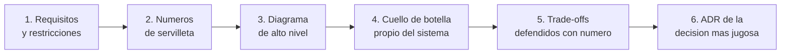
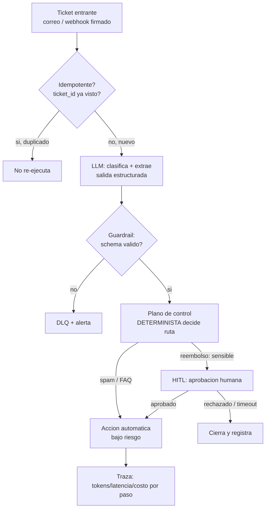

import Nivel from "@components/Nivel.astro";
import Reto from "@components/Reto.astro";
import Solucion from "@components/Solucion.astro";
import Quiz from "@components/Quiz.astro";
import CheckDominio from "@components/CheckDominio.astro";

<Nivel nivel="avanzado" />

Este capstone es distinto a todos los anteriores: **no se programa, se diseña**. No hay `docker compose up` ni tests verdes. Hay tres pizarras en blanco, un reloj, y la pregunta que define tu banda salarial: *"diséñame un sistema RAG multi-tenant"*, *"diséñame una automatización de tickets con IA"*, *"diséñame el pipeline de datos que alimenta tu IA"*. Vas a producir un documento de diseño por cada uno —requisitos, diagrama Mermaid, trade-offs defendidos con números, y un ADR por la decisión más jugosa— exactamente como lo harías frente a un entrevistador en 40 minutos.

Toda la Fase 8 te dio el vocabulario: capacidad y cuellos de botella ([8.1](/fase-8-system-design/8-1-fundamentos-system-design/)), DDD y límites ([8.2](/fase-8-system-design/8-2-arquitectura-ddd/)), arquitectura de IA a escala ([8.5](/fase-8-system-design/8-5-arquitectura-ia-escala/)). Aquí dejan de ser temas sueltos y se vuelven **un método repetible** para atacar cualquier pregunta de system design, aplicado a los tres arquetipos de tu nicho.

:::tip[Si ya pasaste rondas de system design o diseñaste sistemas de IA en producción]
Conoces el formato: aclarar requisitos, estimar, dibujar, defender trade-offs. La trampa del que ya lo hizo es dibujar **cajas bonitas sin un solo número detrás** —el error #1 de esta ronda— y confundir "lo que conozco" con "lo que puedo defender bajo repregunta". Valida saltando a los tres sistemas: ¿puedes derivar el **costo por hora** de un RAG a 50 QPS de servilleta? ¿blindar el aislamiento de tenants como problema de **seguridad** y no de relevancia? ¿defender por qué un reembolso pasa por **HITL aunque el modelo esté 99% seguro**? ¿elegir entre **re-embedding incremental por CDC** y un rebuild nocturno completo con un número de frescura vs costo? Si las cuatro salen sin titubear, este capstone es tu pieza de portafolio lista; si alguna te hace dudar, ese es justo el sistema por el que debes empezar.
:::

## 1. Objetivos observables

Al terminar este capstone podrás —y podrás **defenderlo en una entrevista, en voz alta, sin notas**:

- **O1 — Diseñar tres sistemas de IA/datos a escala en papel**, cada uno con requisitos explícitos, un diagrama Mermaid que renderiza, y las decisiones de arquitectura que el sistema exige (aislamiento, caché, ruteo, HITL, frescura). Sabrás dibujar el sistema entero y justificar por qué cada caja existe.
- **O2 — Defender cada decisión con un número o un trade-off explícito**, no con una intuición: el costo por hora de servilleta, el ahorro estimado de una caché, la latencia que sacrificas por estabilidad, la frescura que cambias por costo. Donde haya una bifurcación, nombrarás la alternativa descartada y la consecuencia que aceptas.
- **O3 — Registrar las decisiones clave como ADRs** (Architecture Decision Record: Contexto / Decisión / Consecuencias) y comunicar los tres diseños como lo haría un ingeniero senior: claros, honestos sobre sus límites, y resistentes a la repregunta.

## 2. Por qué importa (el dinero está aquí)

> 💰 **Por qué importa:** la ronda de system design es **el techo salarial de la entrevista**. El council fue unánime: pensar a nivel de *sistema* —no de *feature*— es lo que separa semi-senior de senior y lo que evalúan los roles mejor pagados, especialmente los remotos en USD. Y dentro de esa ronda, los tres arquetipos que diseñas aquí son **tu nicho exacto**: el RAG multi-tenant, la automatización agéntica y el pipeline de datos para IA son las preguntas que casi nadie sabe responder bien porque mezclan los cuellos de botella de cualquier sistema (DB, latencia, concurrencia) con los de la IA (tokens caros, llamadas lentas de segundos, salidas no determinísticas).

Tres razones lo vuelven una pieza estrella, aunque no tenga una sola línea de código:

1. **Es la ronda que el 80% reprueba dibujando cajas sin números.** Cualquiera dibuja `usuario → API → LLM → respuesta`. Muy pocos contestan *"¿y si te llegan 50 preguntas por segundo de 40 clientes distintos y el modelo cuesta USD 5 por millón de tokens de entrada?"* con una aritmética de servilleta y una decisión priorizada. Esa diferencia es literal y medible: la primera respuesta es junior, la segunda sube de banda.
2. **Diseñar bien antes de construir es lo que evita sangrar dinero después.** Un sistema de IA mal arquitecturado no se cae —**sangra**. Una caché semántica que no pusiste, un ruteo multi-modelo que ignoraste, una frescura que nadie definió: cada omisión es un costo recurrente o un incidente. Diseñar en papel es la intervención más barata que existe, y es donde se nota quién entiende el sistema.
3. **Es tu ensayo de entrevista, no un trámite académico.** La ronda de system design de Track-0 (mock interviews semanales en inglés, system design RAG en 40 min) se prepara *aquí*. Cada uno de estos tres documentos es un guion que puedes contar, grabar y pulir hasta que salga fluido bajo presión. Vale tanto como un repo: es la narrativa que convierte conocimiento en oferta.

> [!tip] GLaDOS dice
> Yo no construí cada cámara de prueba antes de saber qué medía. Primero diseñaba el experimento en papel: qué entra, qué sale, dónde está el peligro, qué hago cuando el sujeto se sale del guion. Tú harás lo mismo con tres sistemas. La diferencia entre tú y el otro candidato no será quién sabe más frameworks —será quién puede dibujar el flujo de un duplicado-que-además-es-un-reembolso sin titubear. Eso, querido, no se improvisa. Se ensaya. Como todo lo que vale la pena.

## 3. Lo que ya traes (actívalo antes de empezar)

Este capstone **no introduce piezas nuevas: las ensambla**. Recupera de memoria, sin abrir las notas, cada una de estas ideas. Si no puedes explicarla sin mirar, vuelve a su sub-unidad antes de diseñar:

- De [8.1 · Fundamentos de System Design](/fase-8-system-design/8-1-fundamentos-system-design/): el **método de servilleta** (usuarios → QPS → concurrencia → cuello de botella) y rate limiting/idempotencia a escala. Es el paso 2 de tu método para los tres.
- De [8.2 · Arquitectura + DDD táctico](/fase-8-system-design/8-2-arquitectura-ddd/): los **bounded contexts** y el **anti-corruption layer**. El pipeline de datos y la automatización de tickets cruzan límites de dominio; ahí vive el ACL.
- De [8.5 · Arquitectura de sistemas de IA a escala](/fase-8-system-design/8-5-arquitectura-ia-escala/): el **triángulo latencia/costo/calidad**, el **caché semántico** vs prompt caching, el **ruteo multi-modelo**, las **colas de inferencia** y los **fallbacks**. Es la caja de herramientas del sistema 1 y parte del 2.
- De [6.7 · RAG a fondo](/fase-6-ai-engineering/6-7-rag-a-fondo/) y [6.6 · Vector databases](/fase-6-ai-engineering/6-6-vector-databases/): el flujo `ingest → chunking → embeddings → vector DB → retrieval + rerank → generación` y el filtrado por metadata. Es la columna de los sistemas 1 y 3.
- De [7.7 · Agentes de automatización con IA](/fase-7-automatizacion/7-7-agentes-automatizacion-ia/) y [7.2 · Integración + confiabilidad](/fase-7-automatizacion/7-2-integracion-confiabilidad/): el reparto **"el LLM propone, el código dispone"**, el plano de control determinista, **idempotency keys, DLQ, HITL** y el **eval gate** del agente. Es el sistema 2 completo.
- De [7.5c · Orquestador](/fase-7-automatizacion/7-5c-orquestador/), [7.5d · Data contracts + quality](/fase-7-automatizacion/7-5d-data-contracts-quality/) y [7.6 · CDC y streaming → frescura de IA](/fase-7-automatizacion/7-6-cdc-streaming/): ELT, medallion bronze/silver/gold, dbt, data contracts y **re-embedding por cambios**. Es el sistema 3.

Antes de seguir, responde de memoria:

<Quiz
  question="En una ronda de system design de 40 minutos te dicen 'diseña un asistente RAG multi-tenant'. ¿Cuál es el PRIMER movimiento de un buen candidato?"
  options={[
    "Empezar a dibujar la arquitectura completa de inmediato para mostrar que sabe",
    "Aclarar requisitos y restricciones, y derivar un número de servilleta (QPS, costo/hora) que guíe TODAS las decisiones siguientes",
    "Nombrar todas las herramientas que conoce (Qdrant, pgvector, LangGraph, Kafka) para demostrar amplitud",
  ]}
  answer={1}
  explanation="Dibujar sin aclarar requisitos produce un sistema que resuelve el problema equivocado; listar herramientas sin justificarlas es 'pattern-itis'. El movimiento senior es acotar el problema (¿cuántos tenants? ¿QPS de pico? ¿qué no puede pasar?) y derivar un número que ancle el resto: el costo por hora a QPS de pico te dice qué optimizar primero. El número manda el diseño, no al revés."
/>

## 4. Ejemplo resuelto: el método de los 6 pasos, pensado en voz alta

No te voy a dar los tres diseños resueltos —ese es tu trabajo, y la solución de referencia es del corrector, no tuya todavía. Te voy a dar algo más valioso: **el método repetible** con el que un senior ataca *cualquier* pregunta de system design, y lo aplico parcialmente al sistema 2 (tickets) para que veas la mecánica. Tú lo aplicas completo a los tres.

### 4.1 Los 6 pasos (memorízalos: son tu guion de entrevista)

1. **Requisitos y restricciones.** Antes de dibujar: ¿qué *debe* hacer y qué *no puede* pasar nunca? Funcionales (clasificar, responder) y no funcionales (latencia, costo, aislamiento). **Aquí se gana o se pierde la ronda**: el candidato que dibuja sin preguntar resuelve el problema equivocado.
2. **Números de servilleta.** Traduce la escala a un número que guíe todo: QPS de pico, costo por hora, throughput de ingesta. Sin un número, no sabes qué optimizar.
3. **Diagrama de alto nivel.** El flujo entero en una imagen. Si no lo puedes dibujar, no lo entiendes todavía.
4. **El cuello de botella propio.** Cada sistema tiene UNO que lo define: en el RAG es la **cuota de tokens y el costo**; en los tickets es la **acción irreversible que el LLM podría disparar mal**; en el pipeline es la **frescura** (qué tan viejo puede estar un dato y aun así servir).
5. **Trade-offs defendidos con número.** Cada decisión clave nombra qué sacrificas y por qué. "Uso el modelo barato para las preguntas fáciles porque cuesta 5x menos y la calidad de un saludo es idéntica" es defendible; "uso el mejor modelo" no.
6. **ADR de la decisión más jugosa.** La decisión con más consecuencias se documenta: Contexto / Decisión / Consecuencias, nombrando la **alternativa descartada** y el **costo aceptado**. Un ADR sin alternativa descartada no es una decisión, es una preferencia.

### 4.2 Aplicando el método al sistema 2 (te muestro pasos 1–3, el resto es tuyo)

**Paso 1 — Requisitos (think-aloud).** "Entra un ticket de soporte por correo o webhook. El sistema lo **clasifica** (reembolso / consulta / queja / spam), **rutea** según la categoría, y **ejecuta** una acción. Pregunto lo que no me dijeron: ¿qué acciones son **irreversibles**? Un reembolso lo es; responder un FAQ no. Eso cambia todo el diseño. ¿Qué *no puede pasar nunca*? Reembolsar dos veces el mismo ticket, y reembolsar por una instrucción inyectada en el texto del ticket. Esos dos 'nunca' son mis restricciones duras."

**Paso 2 — Números (think-aloud).** "Digamos 5.000 tickets/día, pico de 2/segundo. No es un problema de QPS —es bajo. El número que importa aquí no es el costo de tokens (es chico), es **cuántas acciones sensibles por día** y **cuántas pasan por humano**: si el 10% son reembolsos y todos van a HITL, eso son ~500 aprobaciones humanas/día. Ese número dimensiona la cola de revisión y me dice si el HITL es viable o se vuelve un cuello humano."

**Paso 3 — Diagrama de alto nivel (think-aloud).** "Dibujo el reparto cerebro/código de [7.7](/fase-7-automatizacion/7-7-agentes-automatizacion-ia/). El LLM **propone**; un plano de control determinista **dispone**. Marco dónde está la idempotencia (primero), el guardrail de schema, el HITL y la DLQ."

**Y aquí paro.** Los pasos 4 (cuál es el cuello de botella y cómo lo contienes), 5 (los trade-offs con su número: ¿umbral de confianza? ¿techo de costo? ¿qué mide el eval gate?) y 6 (el ADR de "por qué un plano de control determinista y no confiar en el LLM") **son tu entrega**. Ese es el patrón: yo te di el esqueleto y el método; tú pones los números y defiendes las decisiones. Repítelo para los tres sistemas.

## 5. Errores y misconceptions que hunden esta ronda

:::caution[Podrías pensar X… y está mal]
- **"Mientras más cajas y herramientas dibuje, más senior parezco."** Al revés. Un diagrama con 15 servicios y cero números grita junior. El senior dibuja lo mínimo y **cada caja tiene un número o un trade-off detrás**. La sofisticación es justificar, no acumular.
- **"El filtro `tenant_id` es para que cada cliente vea sus documentos."** Incompleto y peligroso. Es un problema de **seguridad**, no de relevancia: una fuga cruzada entre tenants es un incidente grave (clientes regulados). El filtro debe ser **obligatorio y fail-closed** —imposible consultar sin él— no un `WHERE` opcional que alguien puede olvidar.
- **"Si el modelo está 99% seguro, que ejecute el reembolso solo."** Mal. La confianza auto-reportada **no es una probabilidad calibrada**, y la acción es **irreversible**. Una acción sensible va a HITL **siempre**, sin importar la confianza (OWASP LLM06, Excessive Agency). La autonomía sobre lo irreversible es un riesgo, no una feature.
- **"La parte nueva es la IA, así que la idempotencia y la confiabilidad no aplican."** Mal. Un sistema de tickets hereda el problema *at-least-once* de cualquier integración: si el webhook llega dos veces, no debes actuar dos veces. La idempotencia es el **primer** chequeo, antes que cualquier cosa de IA.
- **"El pipeline de datos termina cuando los embeddings están en la vector DB."** Mal. Termina cuando defines la **frescura**: qué tan viejo puede estar un dato y aun así servirse, y qué pasa cuando el documento fuente cambia (re-embedding) o cuando cambias el **modelo de embeddings** (re-embedding total, versionado). Un RAG que responde con datos rancios es un bug silencioso.
- **"Un ADR es documentar la decisión que tomé."** Incompleto. Un ADR sin la **alternativa descartada** ni la **consecuencia negativa que aceptas** no es una decisión: es una preferencia disfrazada. El valor del ADR está en lo que dejaste fuera y por qué.
- **"Diseño los tres y luego pido que una IA me lo revise para ahorrar tiempo."** Te saltaste el punto entero. El músculo se construye **diseñando a mano primero**; la IA revisa al final. Si la IA diseña, el día de la entrevista no tienes nada que defender.
:::

## 6. Plan con andamiaje que se desvanece

No diseñes los tres en una sentada ni empieces por el que menos dominas. El andamiaje se desvanece: el sistema 1 ya lo practicaste en [8.5](/fase-8-system-design/8-5-arquitectura-ia-escala/) (andamiaje alto, casi hecho); el 3 es el más nuevo (andamiaje bajo, solo el método).

- **Sistema 1 — RAG multi-tenant (andamiaje alto).** Ya lo trabajaste como ejercicio en 8.5. Aquí lo **pules** a calidad de portafolio: revisa que el número de costo esté, que el aislamiento esté blindado como seguridad, y reescribe el ADR. **Hecho cuando:** podrías presentarlo en una entrevista en 8 minutos.
- **Sistema 2 — Automatización de tickets con IA (andamiaje medio).** Tienes el esqueleto del §4.2 y el método de 7.7. Completa los pasos 4–6: el cuello de botella (acción irreversible), los trade-offs con número (umbral de confianza, techo de costo, qué mide el eval gate) y el ADR del plano de control. **Hecho cuando:** puedes predecir la ruta de un ticket que es duplicado *y* reembolso, y decir cuál barrera gana.
- **Sistema 3 — Pipeline de datos para IA (andamiaje bajo: solo el método).** Sin esqueleto regalado. Aplica los 6 pasos desde cero: ingesta de documentos → transformación (limpieza, chunking) → embeddings → vector DB, con la **frescura** como cuello de botella. Decide medallion vs flat, orquestador, data contracts, y la estrategia de re-embedding (incremental por CDC vs rebuild nocturno). **Hecho cuando:** tu diseño nombra qué pasa cuando (a) un documento fuente cambia y (b) cambias el modelo de embeddings.

> [!tip] GLaDOS dice
> Primero-Sin-IA aplica al **diseño**, no solo al código. Antes de pedirle a una IA que te "revise" el diagrama, dibújalo entero a mano y defiéndelo en voz alta frente a la pared. Si la pared no te convence, el entrevistador tampoco. Y la pared, créeme, es una audiencia mucho más amable.

## 7. El capstone

<Reto title="Diseña 3 sistemas en papel — el ensayo de tu ronda de system design" timebox="proyecto multi-sesión: ~45 min de diseño Primero-Sin-IA por sistema (135 min en total), más el pulido">

Diseña **en papel** (sin código de producción) los tres sistemas. El enunciado detallado, las tres especificaciones (`sistema-1`, `sistema-2`, `sistema-3`) y el contrato de "hecho" están en la carpeta del repo:

`ejercicios/fase-8/capstone-disena-3-sistemas/`

Por **cada uno** de los tres sistemas, produce un documento de diseño (`diseno-N.md`) con:

1. **Requisitos y restricciones** — funcionales y no funcionales; al menos un "esto no puede pasar nunca".
2. **Números de servilleta** — el número que guía el diseño, con la aritmética mostrada (no solo el resultado).
3. **Diagrama Mermaid** — el sistema completo, que **renderiza** (pruébalo).
4. **El cuello de botella propio** — cuál es y cómo lo contienes.
5. **Trade-offs defendidos con número** — mínimo **2 por sistema**, cada uno nombrando qué sacrificas y por qué (incluida la alternativa descartada).
6. **Un ADR** — por la decisión más jugosa de ese sistema: Contexto / Decisión / Consecuencias, con la alternativa descartada y el costo aceptado.

Los tres sistemas, en una frase cada uno:
- **Sistema 1 — RAG multi-tenant:** aislamiento de datos entre clientes + costo por tenant.
- **Sistema 2 — Automatización de tickets con IA:** clasificación → ruteo → acción, con HITL y eval gate.
- **Sistema 3 — Pipeline de datos para IA:** ingesta → transformación → vector, con la frescura como restricción dura.

**Primero-Sin-IA (innegociable):** diseña cada sistema **solo, a mano, dentro del timebox de 45 min**. Está bien que el primer diagrama sea feo. Solo entonces consulta las lecciones. **Solo al final** usa IA para *revisar y repreguntar* tu razonamiento —nunca para *generarlo*. Mañana, reescribe de memoria los 6 pasos del método.

**"Hecho" significa** que cumples el Definition of Done de diseño del §10 sobre los tres sistemas, y que puedes **defender cada diseño en voz alta, sin notas, contra una repregunta** (ese es el examen real, no el documento).

<Solucion title="Pista de arranque (ábrela solo si no sabes por dónde empezar)">
Empieza por el sistema 1: ya lo diseñaste en el ejercicio de 8.5, así que es pulir, no crear. Para cualquiera de los tres, el primer movimiento SIEMPRE es el paso 2: deriva un número antes de dibujar. RAG → costo/hora a QPS de pico. Tickets → acciones sensibles/día y aprobaciones HITL/día. Pipeline → throughput de ingesta y, sobre todo, la **ventana de frescura** (¿el dato puede tener 1 hora? ¿24 horas? eso decide entre CDC incremental y rebuild nocturno). El número te dice qué optimizar; sin él, todo diagrama es decoración. Esto es una pista de arranque, no la solución.
</Solucion>

</Reto>

## 8. Check de dominio

Sin mirar el brief, en voz alta o por escrito —y prepárate para responder esto en una entrevista en inglés:

<CheckDominio
  items={[
    "Recitar los 6 pasos del método de system design y aplicarlos a un sistema que NO está en este capstone (p. ej. 'diseña un acortador de URLs con analítica').",
    "Derivar el costo por hora de un RAG a QPS de pico con aritmética de servilleta, y usar ese número para priorizar la primera intervención de ahorro.",
    "Explicar por qué el aislamiento de tenants es seguridad y no relevancia, y cómo se blinda un filtro para que una fuga sea imposible, no solo improbable.",
    "Predecir la ruta de un ticket que es a la vez un duplicado y un reembolso, y decir cuál barrera del plano de control gana y por qué.",
    "Explicar por qué una acción irreversible va a HITL aunque la confianza del modelo sea 0.99 (LLM06 + confianza no calibrada).",
    "Defender la elección entre re-embedding incremental por CDC y un rebuild nocturno completo, con la ventana de frescura como criterio.",
    "Escribir de memoria un ADR de tres partes para una de las decisiones, nombrando la alternativa descartada y la consecuencia aceptada.",
    "Contar el trade-off del triángulo latencia/costo/calidad que elegiste en cada sistema, y por qué es una decisión de negocio y no 'porque es mejor'.",
  ]}
/>

Si no puedes hacer seis de estos sin notas, tus diseños todavía no están listos para enseñar. No es un examen: es el ensayo de tu entrevista.

## 9. Recursos (documentación oficial primero)

- **Mermaid — sintaxis de flowchart:** [mermaid.js.org/syntax/flowchart.html](https://mermaid.js.org/syntax/flowchart.html) — para que tus tres diagramas rendericen sin errores.
- **OWASP Top 10 for LLM Applications (2025):** [genai.owasp.org/llm-top-10](https://genai.owasp.org/llm-top-10/) — LLM01 (Prompt Injection), LLM05 (Improper Output Handling), LLM06 (Excessive Agency) y vector/embedding weaknesses; el vocabulario de seguridad de los sistemas 1 y 2.
- **Architecture Decision Records (ADR) — repositorio de Michael Nygard:** [github.com/joelparkerhenderson/architecture-decision-record](https://github.com/joelparkerhenderson/architecture-decision-record) — el formato Contexto / Decisión / Consecuencias y por qué importa.
- **The Twelve-Factor App:** [12factor.net](https://12factor.net/) — config, estado y procesos; útil para defender por qué tus servicios escalan horizontalmente.
- **dbt — documentación oficial:** [docs.getdbt.com](https://docs.getdbt.com/) — modelos, `ref()`, tests y sources del sistema 3 (transformación + data contracts).
- **Designing Data-Intensive Applications (Kleppmann):** el libro de referencia de system design a escala (replicación, particionado, consistencia). Lectura larga, no para esta sesión, sí para tu carrera.

## 10. Definition of Done — "hecho significa…" (capstone de DISEÑO)

> ⚠️ **Nota honesta:** el [Definition of Done único](/fase-8-system-design/) del curso (§B) está pensado para capstones de **software** (demo que corre, tests verdes, deploy con usuarios reales). Este capstone es la **excepción deliberada**: es un artefacto de **diseño en papel**, el ensayo de la ronda de entrevista. Por eso su "hecho" adapta el espíritu del DoD —spec, ADRs, seguridad, observabilidad y eval *pensadas en el diseño*— sin exigir un sistema desplegado. La vara es: **¿defendería esto frente a un entrevistador senior sin que me desarme con una repregunta?**

| # | Criterio de "hecho" (los tres sistemas) | Cómo se ve |
|---|---|---|
| **1** | **Spec + ADRs** | Cada `diseno-N.md` parte de los requisitos y restricciones del sistema y cierra con **un ADR** (Contexto/Decisión/Consecuencias) con alternativa descartada y costo aceptado |
| **2** | **Un número que manda** | Cada diseño muestra la **aritmética de servilleta** (costo/hora, aprobaciones HITL/día, frescura/throughput) y la usa para priorizar, no de adorno |
| **3** | **Diagrama que renderiza** | Cada sistema tiene **un diagrama Mermaid** que compila y refleja el flujo real, no una caricatura |
| **4** | **Seguridad en el diseño** | Aislamiento de tenants como **seguridad** (fail-closed) en S1; guardrail de salida + HITL + least-privilege (OWASP LLM01/05/06) en S2; validación de datos en la frontera en S3 |
| **5** | **Observabilidad y eval pensadas** | Dónde van las trazas (tokens/latencia/costo por paso) en S1/S2; el **eval gate** (qué mide, de dónde sale el golden set) en S2; los **data quality tests** (frescura/volumen/schema drift) en S3 |
| **6** | **Costo/latencia/frescura como trade-off explícito** | Mínimo **2 trade-offs defendidos con número por sistema**, nombrando qué se sacrifica y la alternativa descartada |
| **7** | **Comunicación senior** | Los tres documentos son claros, honestos sobre sus límites, y **defendibles en voz alta sin notas** ante una repregunta |
| **8** | **Conventional Commits** | Si versionas tus diseños en el repo, el historial usa Conventional Commits |

Criterios de evaluación y rúbrica analítica completa: la usa el corrector desde `.ai/rubricas/fase-8/capstone-disena-3-sistemas.md`. La regla de oro del corrector: **no se mide si tu diagrama es idéntico a una solución única —hay varias arquitecturas defendibles— sino si cada decisión tiene un número o un trade-off detrás.**

## 11. Reflexión y repaso espaciado

Cierra escribiendo dos o tres frases: **¿cuál de los tres sistemas te costó más diseñar, y qué te reveló eso sobre el hueco real en tu entendimiento?** Casi siempre el que más cuesta es el pipeline de datos (sistema 3), porque la frescura es un eje que la mayoría nunca pensó. Nombrar dónde se te trabó *es* el diagnóstico de qué repasar —y, dicho frente a un entrevistador, es la diferencia entre "sé de RAG" y "sé diseñar sistemas de IA".

Gancho de **spaced repetition**:

- **Al día siguiente:** reescribe de memoria, sin abrir esta página, los **6 pasos del método** y el **cuello de botella propio** de cada uno de los tres sistemas. Si te falta alguno, ese es el sistema que aún no interiorizaste.
- **En 1 semana:** toma un sistema que NO está aquí —"diseña un feed de noticias", "diseña un sistema de notificaciones", "diseña el backend de Uber"— y aplícale los 6 pasos en 40 minutos cronometrados, en voz alta y grabándote. Esa grabación es material directo de tu mock interview de Track-0.
- **En 1 mes:** vuelve a tus tres diseños y atácalos como un entrevistador hostil: por cada caja, pregúntate "¿y si esto se cae? ¿y si el tráfico se multiplica por 10? ¿y si un tenant es 100x más grande que el resto?". Anota dónde tu diseño no aguanta. Ese estrés-test es exactamente lo que separa una respuesta de junior de una de senior.

> [!tip] GLaDOS dice
> "Sé usar un RAG" es lo que dice todo el mundo. "Te diseño un RAG multi-tenant, una automatización de tickets que no reembolsa dos veces ni actúa sobre basura, y el pipeline que los mantiene frescos —con números, trade-offs y ADRs— en cuarenta minutos y en inglés" es lo que te contrata. No construiste nada esta vez. Construiste algo mejor: la capacidad de explicar **por qué** lo construirías así. Ahora ve a defenderlo frente a la pared. Y después, frente a alguien que pague por escucharlo."
