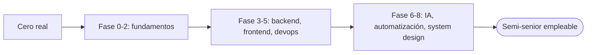

import Reto from "@components/Reto.astro";
import Solucion from "@components/Solucion.astro";
import Quiz from "@components/Quiz.astro";
import CheckDominio from "@components/CheckDominio.astro";
import Nivel from "@components/Nivel.astro";

<Nivel nivel="básico" />

Página de verificación. Si ves el diagrama renderizado abajo y los componentes
con estilo, el scaffold está sano.

## Diagrama Mermaid

Los bloques ` ```mermaid ` se transforman a SVG en el cliente (sin browser ni
playwright en build):



## Componentes del curso

<Reto title="Predice la salida" timebox="10 min">
  Antes de ejecutar, escribe en papel qué imprime `print(sum(range(5)))`.
</Reto>

<Solucion title="Ver solución de referencia">
  `sum(range(5))` suma `0+1+2+3+4 = 10`. Imprime `10`.
</Solucion>

<Quiz
  question="¿Qué hace `range(5)` en Python?"
  options={[
    "Genera 1, 2, 3, 4, 5",
    "Genera 0, 1, 2, 3, 4",
    "Genera 0, 1, 2, 3, 4, 5",
  ]}
  answer={1}
  explanation="range(n) va de 0 hasta n-1, por eso 0..4."
/>

<CheckDominio
  items={[
    "Explicar qué es un range sin mirar apuntes",
    "Predecir la salida de un bucle simple a mano",
  ]}
/>
