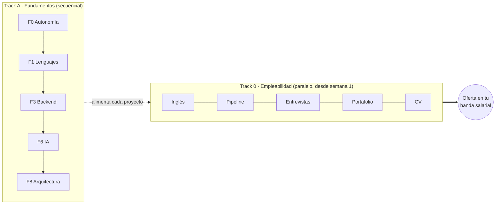

import Nivel from "@components/Nivel.astro";
import CheckDominio from "@components/CheckDominio.astro";

<Nivel nivel="básico" />

Bienvenido al **Track 0**. Antes de una sola línea de código, una decisión de
diseño del curso que vale más que cualquier framework: **esto no es una fase, es un
carril paralelo.**

## Qué es un "track" (y por qué importa la palabra)

En este curso hay dos cosas distintas:

- Una **fase** es secuencial. La Fase 3 (bases de datos) asume que ya hiciste la
  Fase 1 (lenguajes). Avanzas en orden, una después de otra.
- Un **track** (carril) corre **en paralelo** a todo lo demás. No esperas a
  terminarlo para empezar otra cosa: lo trabajas un poco cada semana, _al mismo
  tiempo_ que estudias Python, APIs o IA.

El Track 0 —empleabilidad, marca personal e inglés técnico— es exactamente eso: un
carril que arranca **la semana 1** y no se detiene. No es "lo último que ves antes de
buscar trabajo". Es la columna que convierte cada cosa que aprendes en algo que el
mercado puede ver, medir y pagar.

## El error más caro del roadmap

La mayoría de los cursos —y casi todos los autodidactas— hacen esto: "primero
aprendo a programar bien, **después** ya veré cómo conseguir trabajo". Suena
responsable. Es el error más caro que puedes cometer.

El problema es de **feedback**. Si estudias 8 meses encerrado y _recién_ entonces
postulas, son 8 meses sin saber qué pide el mercado real, qué falla en tus
entrevistas, qué proyecto impresiona y cuál aburre. Descubres todos tus puntos
ciegos al final, cuando corregirlos cuesta más. En cambio, si postulas "de práctica"
desde el **mes 2** —aunque no estés listo— cada rechazo es información gratis que
calibra el resto de tu estudio.

:::caution[La trampa de "todavía no estoy listo"]
Podrías pensar: "voy a postular cuando sea bueno, así no hago el ridículo". Está mal
por dos razones. (1) El mercado, no tú, define "bueno"; sin postular nunca obtienes
esa definición. (2) Postular es una **habilidad** (escribir un CV, leer una oferta,
sostener una entrevista) que también se entrena con repetición. Esperar a estar listo
para empezar a practicar es como esperar a saber nadar para entrar al agua.
:::

## Por qué este track existe (el 💰)

Sin rodeos: **el mejor stack del mundo no sirve si no sabes mostrarlo, y no puedes
mejorar lo que no estás midiendo.** Aquí están los multiplicadores de sueldo reales,
los que casi nadie trabaja en paralelo:

- El **inglés técnico** es un _gate_ binario: decide si el mercado remoto-USD te
  considera o ni te mira. No es un "+35% opcional" — es la puerta.
- El **portafolio** es la prueba física de que construyes (no de que viste tutoriales).
- El **CV** traduce tu trabajo a impacto medible, no a una lista de tareas.
- Las **entrevistas** se entrenan como un músculo, con cadencia y grabación.

Nada de esto se improvisa la semana antes de postular. Se construye en paralelo, con
feedback real del mercado desde el mes 2.

## Objetivos del track

Al recorrer el Track 0 deberías ser capaz de:

- **Tratar el inglés técnico como un gate** que abres con práctica deliberada (READMEs,
  explicar tu arquitectura en voz alta, PRs async), no como un porcentaje abstracto.
- **Operar tu búsqueda de empleo como un sistema medible**: un pipeline de postulación
  vivo, instrumentado por funnel, que se ajusta con el feedback de los rechazos.
- **Construir un portafolio que diferencia** (2-3 proyectos profundos con demo que
  corre, README en inglés y write-up de trade-offs), no el "80% idéntico" que ya
  inunda el mercado.
- **Presentarte como AI/Automation Engineer** en CV, GitHub y entrevistas, con lenguaje
  de impacto y capacidad de defender tus decisiones en vivo, en inglés.

## Antes de empezar: diagnóstico de entrada

Este track se escribe para **quien parte de cero** en búsqueda de empleo técnico. No
asume que ya tengas CV, GitHub ni experiencia postulando. Cada sub-unidad enseña desde
la primera piedra.

:::tip[Si ya lo tocaste, valida y salta]
¿Ya tienes experiencia laboral, un CV, o un GitHub con proyectos? Entonces usa estas
sub-unidades como **checklist de validación**, no como tutorial: abre cada una, lee los
criterios de "hecho", y si tu material ya los cumple, sigue de largo. Lo más probable
es que igual te falten dos cosas que casi nadie trae bien resueltas: el **inglés bajo
presión** (T0.1, T0.3) y la **historia de falla en producción** (T0.4). Front-loadea
esas dos aunque saltes el resto.
:::

## Mapa de las 10 sub-unidades

Recórrelas en orden la primera vez; después vuelve a cualquiera como referencia. Todas
son ruta-crítica salvo una, marcada como profundización.

| # | Sub-unidad | Qué resuelve |
|---|---|---|
| T0.1 | [Inglés técnico como GATE](/track-0-empleabilidad/t0-1-ingles-tecnico/) | El idioma como compuerta del mercado remoto-USD |
| T0.2 | [Empleabilidad como track-0](/track-0-empleabilidad/t0-2-empleabilidad-track0/) | Tu pipeline de postulación vivo, medible por funnel |
| T0.3 | [Práctica de entrevista con cadencia](/track-0-empleabilidad/t0-3-practica-entrevista/) | Mocks semanales: coding hablado, system design, STAR |
| T0.4 | [Historia de falla en producción](/track-0-empleabilidad/t0-4-historia-falla-produccion/) | La narrativa de seniority que el homelab no da |
| T0.5 | [Portafolio diferenciado](/track-0-empleabilidad/t0-5-portafolio-diferenciado/) | 2-3 proyectos curados con demo, README y trade-offs |
| T0.6 | [GitHub profesional](/track-0-empleabilidad/t0-6-github-profesional/) | Perfil README, repos limpios, capstones pinneados |
| T0.7 | [CV y posicionamiento](/track-0-empleabilidad/t0-7-cv-posicionamiento/) | Logros medibles (XYZ), no lista de tareas |
| T0.8 | [Lane Forward-Deployed / cliente-facing](/track-0-empleabilidad/t0-8-forward-deployed/) 🔵 _profundización_ | Scoping de problema vago, demo a no-ingenieros |
| T0.9 | [Vender el skill AI-augmented](/track-0-empleabilidad/t0-9-skill-ai-augmented/) | Orquestar IA con fluidez como diferenciador |
| T0.10 | [Estrategia de postulación + negociación USD](/track-0-empleabilidad/t0-10-postulacion-negociacion/) | Dos mercados honestos; piso de negociación |

## Cadencia sugerida (cómo se siente "en paralelo")

No haces las 10 sub-unidades de una. Las distribuyes así mientras avanzas el Track A:

| Cuándo | Qué del Track 0 trabajas |
|---|---|
| **Semana 1** | T0.1 (inglés): primer README en inglés de tu primer proyecto, por pequeño que sea. |
| **Mes 1** | T0.6 (GitHub limpio) + T0.7 (primer borrador de CV, aunque tengas poco que poner). |
| **Mes 2** | T0.2 (abre tu pipeline) + empiezas a **postular stretch** + T0.3 (primer mock semanal). |
| **Mes 3+** | T0.4 (historia de falla), T0.5 (curas portafolio), T0.9 (narrativa AI-augmented), iterando. |
| **Al postular en serio** | T0.10 (estrategia + negociación) y T0.8 si apuntas al lane cliente-facing. |

> [!tip] Regla del track
> Postular en el mes 2 sin estar "listo" no es vergüenza: es tu instrumento de medición.
> El rechazo temprano es el dato más barato que vas a conseguir.

## Checklist del track

Vuelve a esta lista cada mes. No es para completarla rápido — es para ver qué carril
quedó parado mientras avanzabas el resto.

- [ ] Tengo un pipeline de postulación vivo (T0.2) y postulo a roles _stretch_ desde el mes 2 para calibrar.
- [ ] Practico entrevistas con cadencia semanal (T0.3) y construyo un banco de 8-10 historias STAR.
- [ ] Tengo al menos una historia de falla en producción real, con post-mortem público (T0.4).
- [ ] Mi portafolio tiene 2-3 proyectos curados (T0.5), cada uno con demo que corre, README en inglés y write-up de trade-offs.
- [ ] Mi GitHub está limpio y los capstones pinneados (T0.6); mi CV habla en lenguaje de impacto medible (T0.7).
- [ ] Practico inglés técnico de forma deliberada (T0.1) y sé articular mi valor como AI-augmented (T0.9).
- [ ] Tengo una estrategia de postulación y un piso de negociación USD claros (T0.10).

## El "capstone" de este track

El Track 0 **no tiene un capstone tradicional con código**. Su capstone es directo:
**conseguir el trabajo.** El pipeline de postulación vivo (T0.2) es la espina dorsal, y
el resto de las sub-unidades se enchufa en él.

Pero ojo: los **proyectos que muestras** en ese pipeline sí se miden con la misma vara
que todo el curso. Cada capstone de cada fase comparte un único **Definition of Done**
(la lista de "hecho" que se repite en todas las fases). Sus puntos, resumidos:

1. **Spec** inicial + **ADRs** de las decisiones clave.
2. **Tests verdes** + lint en CI; calidad por aserciones reales (no porcentaje de cobertura).
3. **Seguridad aplicada:** OWASP web si hay endpoint; OWASP LLM/Agentic si hay IA; secret y dependency scanning.
4. **Observabilidad instrumentada:** logs estructurados + correlation IDs + trazas.
5. **(Si toca IA)** eval harness versionado + número + gate de regresión + budget de costo/latencia.
6. **(Si toca un agente que ejecuta acciones)** validación de salida + least-privilege de tools + HITL + techo de costo.
7. **a11y mínima** (WCAG 2.2) si tiene UI; estados completos (empty/loading/error/success).
8. **Demo en vivo que CORRE + README en inglés + write-up público de trade-offs.**
9. **Conventional Commits** en todo el historial.

> El Track 0 enfatiza especialmente el **punto 8**: en empleabilidad, un proyecto que no
> corre en vivo, sin README en inglés y sin trade-offs explicados, _no cuenta_ como
> evidencia, por bueno que sea el código por dentro.

## Plazos honestos (sin sobrevender)

Este curso es autoguiado: el contenido no caduca por el reloj. Pero merece honestidad
sobre cuánto toma, a 10-15 horas por semana:

- **Si partes de cero real:** unos **18 a 30 meses** hasta "semi-senior empleable". La
  cifra de "9-12 meses" que circula asume a alguien que ya programaba y solo se está
  reactivando. No es tu caso si empiezas desde cero — y está bien.
- **Si estás oxidado pero con experiencia previa** (programaste antes, te alejaste): unos
  **4 a 9 meses** si _front-loadeas_ este track —portafolio, inglés y entrevistas— en vez
  de dejarlo para el final.

Sobre el sueldo, la verdad de dos mercados: tu banda objetivo mapea a **semi-senior local
chileno** _o_ **remoto-USD de entrada**. Los remotos jugosos (USD 4-8k/mes) son
mayormente senior, con inglés _required_ y sistemas en producción. Decir "remoto-USD" a
secas, sin inglés fluido, es venderte humo. El inglés es el _gate_ del pricing; el premium
puramente IA/ML es modesto (~12-15%). Por eso este track abre con el idioma.

## Cómo recorrer este track

1. **Empieza hoy** por [T0.1 · Inglés técnico](/track-0-empleabilidad/t0-1-ingles-tecnico/):
   el README en inglés de tu primer proyecto, esta semana.
2. **En el mes 1**, monta tu base con [T0.6 · GitHub](/track-0-empleabilidad/t0-6-github-profesional/)
   y [T0.7 · CV](/track-0-empleabilidad/t0-7-cv-posicionamiento/).
3. **En el mes 2**, abre tu [T0.2 · pipeline de postulación](/track-0-empleabilidad/t0-2-empleabilidad-track0/)
   y empieza a postular _stretch_ para calibrar.

<CheckDominio title="Antes de cerrar esta portada, ¿puedes explicarlo sin volver a leer?" items={[
  "Por qué la empleabilidad es un track paralelo y no la fase final del curso.",
  "Cuál es el 'error más caro del roadmap' y cómo lo evita el feedback temprano.",
  "Por qué el inglés es un gate binario y no un '+35% opcional'.",
  "Qué exige el punto 8 del Definition of Done a cada proyecto de tu portafolio.",
]} />

## Reflexión + spaced repetition

Antes de saltar a T0.1, anota en una nota personal (en español está bien): **¿qué carril
de este track es el que más miedo me da, y por qué?** Casi siempre es el inglés hablado o
postular antes de sentirse listo — justo los dos que más rinden.

- **Repasa esta portada en 1 semana:** confirma que ya empezaste el carril del inglés.
- **Vuelve en 1 mes:** revisa la checklist y detecta qué carril quedó parado.
- **Vuelve cada mes después:** este track no se "termina" — se mantiene vivo hasta la oferta.
