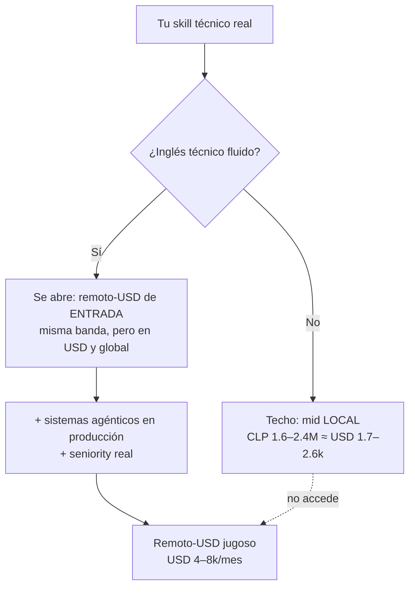

import Nivel from "@components/Nivel.astro";
import Reto from "@components/Reto.astro";
import Solucion from "@components/Solucion.astro";
import Quiz from "@components/Quiz.astro";
import CheckDominio from "@components/CheckDominio.astro";

<Nivel nivel="básico" />

Esta es la primera lección del **Track 0**, el carril que corre _en paralelo_ a todo
el curso desde la semana 1. No trata de un framework ni de un algoritmo: trata del
**idioma** en el que vas a escribir, leer y hablar tu ingeniería. Suena lateral, pero
es probablemente la decisión de mayor impacto económico de todo el roadmap. Por eso
abre el Track 0.

## Objetivos de esta lección

Al terminar deberías ser capaz de:

- **O1 — Explicar el trade-off** de mercado del inglés técnico: por qué funciona como
  un **GATE binario** del _pricing_ (entra o no entra al remoto-USD) y no como un
  "+35% opcional", y qué techo real tiene un perfil sin inglés fluido.
- **O2 — Producir** un artefacto técnico en inglés correcto y claro (un **README** de
  uno de tus proyectos), distinguiendo el inglés "de traductor" del inglés técnico
  idiomático que usa la industria.
- **O3 — Explicar en voz alta**, en inglés y **bajo un timer**, la arquitectura de un
  proyecto propio; y **diagnosticar** tus propios puntos débiles a partir de la
  grabación.

## Por qué esto importa (y por qué tan temprano)

Aquí va la verdad sin azúcar, porque este curso es honesto sobre el mercado.

El roadmap original decía que el inglés "suma ~35–45% al sueldo". Esa cifra
**subvende el problema**. El inglés técnico no es un porcentaje que se _añade_ a tu
banda: es la **compuerta** que decide en qué banda juegas. Es binario.



Lee el diagrama con cuidado, porque corrige dos mentiras cómodas:

- **Sin inglés fluido, tu techo es _mid local_.** No importa cuán bueno sea tu código:
  si no puedes sostener una entrevista técnica, un _standup_ y una revisión de código
  en inglés, el mercado remoto-USD **no te considera**. La puerta está cerrada antes de
  que muestres nada.
- **Con inglés, no apareces mágicamente en los $8k.** Los remotos jugosos son
  _mayormente senior + inglés required + sistemas en producción_. El inglés **abre la
  puerta de entrada** al remoto-USD; lo que cobras adentro lo deciden tu seniority y tu
  portafolio (el resto del curso). El premium puramente "IA/ML" es modesto (~12–15%);
  el verdadero multiplicador de _pricing_ es el idioma que te mueve de un mercado a otro.

:::note[La tesis honesta de los dos mercados]
"Semi-senior local chileno **o** remoto-USD de entrada" es una afirmación honesta.
"Remoto-USD" a secas, sin inglés, **es venderte humo**. El inglés es el gate del
_pricing_, no un adorno del CV.
:::

¿Y por qué desde la **semana 1** y no al final? Porque el inglés técnico **no se
estudia, se acumula**. Es un músculo de horas de uso, igual que el código. Si lo dejas
para el mes 18 "cuando ya sepa programar", llegas a las entrevistas con ocho meses de
inglés en vez de dieciocho, y se nota en los primeros treinta segundos hablados. La
jugada ganadora es trivial y poderosa: **haz tu ingeniería en inglés desde hoy**. Cada
README, cada commit, cada explicación que ibas a escribir igual — hazla en inglés. Sale
casi gratis y compone como interés.

## Lo que ya traes (activación)

De [**0.1 · Mentalidad y método**](/fase-0-fundamentos/0-1-mentalidad-y-metodo/) traes
la regla del **Primero-Sin-IA** y el **active recall**. Aplican idénticos aquí, y este es
el punto clave de toda la lección:

> El traductor automático y el LLM son a tu inglés lo que el autocompletado es a tu
> código. Si dejas que **piensen el idioma por ti**, nunca desarrollas el músculo.
> Primero escribes/hablas tú —feo y lento— y _después_ la IA corrige. Igual que con el
> código.

Antes de seguir, recupera de memoria, sin volver a leer:

1. ¿Qué significa exactamente "Primero-Sin-IA"? (lo vas a aplicar al idioma)
2. ¿Por qué reescribir de memoria al día siguiente detecta la comprensión ilusoria?

Si no te salieron con fluidez, vuelve un momento a 0.1. El método es el mismo; solo
cambia el objeto: hoy el músculo es el **inglés técnico**.

Dos artefactos que vamos a usar y que quizá aún no conoces (los formalizas más adelante,
pero aquí basta la idea):

- **README**: el archivo `README.md` en la raíz de un repo. Es la **portada** del
  proyecto: qué hace, cómo se instala, cómo se usa. Es lo primero que lee un reclutador
  o un colega. (Lo conectarás con Git en [0.6](/fase-0-fundamentos/0-6-git-y-github/).)
- **ADR** (_Architecture Decision Record_): una nota corta que registra **una decisión**
  técnica y _por qué_ la tomaste. (Lo formalizas en
  [0.8 · Spec-first](/fase-0-fundamentos/0-8-spec-first-y-stack-traces/) y más adelante.)
- **PR** (_Pull Request_) / **RFC** (_Request For Comments_): la descripción escrita de
  un cambio que propones, donde explicas el _qué_ y el _por qué_ para que otros lo
  revisen de forma asíncrona. Es comunicación técnica escrita pura.

Los tres son, en el fondo, **inglés técnico escrito**. Si los haces en inglés desde el
día 1, practicas sin gastar tiempo extra.

## Worked example: del inglés "de traductor" al inglés técnico

Como esto es nuevo, no te lanzo a escribir en seco: primero te muestro el razonamiento
de un experto, en voz alta. Hay dos sub-habilidades distintas — **escribir** (async, con
tiempo) y **hablar** (real-time, bajo presión) — y las modelo por separado.

### Parte A — Escribir un README (think-aloud)

Supongamos un proyecto mínimo: un script de Python que cuenta cuántas veces aparece cada
palabra en un archivo de texto. Un principiante que "traduce del español" suele producir
esto:

```markdown
# Word Counter

This project is a program that count the words of a text file and say
how many times appears each word. Is very useful for analyze texts.

## How to use

For use the program you need have Python installed. Then execute:
python wordcount.py myfile.txt

The program will show you the result in the screen.
```

> _Razono en voz alta:_ se entiende, pero **grita "no-nativo"** y, peor, grita
> "junior descuidado". Tres clases de problema: (1) **gramática** — `count` →
> `counts`, `say` → `tells`, `appears each word` → `each word appears`, `Is` →
> `It is`/`It's`, `for analyze` → `for analyzing`/`to analyze`. (2) **Vocabulario no
> idiomático** — en inglés técnico no decimos "show in the screen" sino
> "print to stdout" o "display on screen"; no "execute" coloquial sino el imperativo
> directo "run". (3) **Estructura** — un README profesional sigue un orden esperado y
> usa secciones predecibles, no prosa corrida.

Reescrito como lo escribiría la industria:

```markdown
# wordcount

A small CLI tool that counts word frequencies in a text file.

## Requirements

- Python 3.11+

## Usage

Run the script with the path to a text file:

    python wordcount.py path/to/file.txt

It prints each word and its frequency to stdout, sorted by count.

## Example

    $ python wordcount.py article.txt
    the    42
    data   18
    model  11
```

> _Razono en voz alta:_ qué cambió y **por qué importa**: título corto en minúsculas
> (convención de paquetes); una frase de **descripción** en tercera persona del singular
> bien conjugada ("counts", no "count"); secciones estándar (**Requirements / Usage /
> Example**) que el lector ya espera; **imperativos directos** ("Run", "It prints");
> vocabulario técnico real ("stdout", "frequency", "sorted by count"); y un **ejemplo
> ejecutable** que vale más que tres párrafos. Nada de esto requiere inglés avanzado —
> requiere inglés **técnico**, que es un set acotado y aprendible de patrones.

:::note[El inglés técnico es un dominio acotado]
Buenas noticias para un cero real: el inglés de un README o un ADR usa un vocabulario
**pequeño y repetitivo** (run, build, install, returns, raises, expects, by default,
note that, in order to…). No necesitas C1 conversacional para escribir un README
excelente. Necesitas **dominar ~200 patrones técnicos** y usarlos a diario. Eso se logra
en semanas, no en años — _si empiezas ya_.
:::

### Parte B — Explicar arquitectura en voz alta, bajo presión (think-aloud)

Hablar es otra bestia: no hay tiempo para buscar palabras. En una entrevista te dirán
algo como _"Walk me through the architecture of one of your projects"_ y tendrás que
producir 60–120 segundos coherentes **en vivo**. La técnica que funciona es tener una
**estructura mental de 4 movimientos** que puedas recitar bajo estrés:

1. **What it does** (una frase): _"It's a CLI tool that counts word frequencies in a text file."_
2. **The flow** (entrada → proceso → salida): _"It reads the file, splits it into words,
   counts them with a dictionary, and prints the result sorted by frequency."_
3. **One decision + why** (un trade-off): _"I used a dictionary instead of sorting first
   because counting is O(n) and I only sort once at the end."_
4. **What I'd improve** (honestidad): _"If the file were huge, I'd stream it line by line
   instead of loading it all into memory."_

> _Razono en voz alta:_ fíjate que NO improviso. Tengo cuatro casillas y las relleno.
> Bajo presión, la estructura es la que te salva: aunque tu inglés tropiece, si los
> cuatro movimientos están, **suenas como ingeniero**. Y el movimiento 4 ("what I'd
> improve") es oro: demuestra criterio y honestidad, exactamente lo que separa a un
> semi-senior de un junior que cree que su código es perfecto.

El secreto operativo: **grábate**. Te vas a odiar la primera vez (todos lo hacen). Pero
el audio es tu espejo: descubres las muletillas ("ehhh", "como que"), las palabras que
no te salen, y los momentos donde el inglés se te cae. Sin grabación, no hay feedback;
sin feedback, el _floundering_ fija los errores (igual que en 0.1).

## Lo que parece cierto pero no lo es

:::caution[Misconception 1 — "Primero programo, y el inglés lo veo al final"]
Es el error más caro del roadmap, y por eso el inglés es Track 0 y no Fase 9. El inglés
se **acumula por horas de uso**, no se estudia en un sprint. Postergarlo significa
llegar a las entrevistas con meses _menos_ de práctica hablada, justo donde más se nota.
Hazlo en paralelo desde hoy: tu ingeniería, en inglés.
:::

:::caution[Misconception 2 — "Con Google Translate / un LLM escribo mis READMEs y listo"]
Falso, y por dos razones. Una **estratégica**: si la IA escribe tu inglés, tu inglés no
crece — y en la entrevista _hablada_ no hay IA que te rescate. Otra **táctica**: la
traducción literal produce inglés que suena raro ("show in the screen") y delata falta
de oficio. La IA es para **corregir lo que ya escribiste**, no para escribir por ti
(Primero-Sin-IA aplicado al idioma).
:::

:::caution[Misconception 3 — "Necesito inglés C1 perfecto antes de escribir nada"]
Falso, y es una excusa para no empezar. El inglés técnico escrito es un sub-dominio
acotado y muy tolerante: nadie espera prosa literaria en un README, esperan **claridad
y convenciones**. Puedes escribir un README excelente con un inglés B1 sólido si dominas
los patrones técnicos. Empieza imperfecto **hoy**; la perfección llega usándolo.
:::

:::caution[Misconception 4 — "Hablar inglés fluido en lo social = poder explicar arquitectura"]
No son lo mismo. Puedes pedir comida en inglés sin problema y **congelarte** al explicar
por qué elegiste pgvector sobre Qdrant. El inglés técnico _hablado bajo presión_ es una
habilidad específica que se entrena con su propia práctica: estructura de 4 movimientos +
grabarte + repetir. No se hereda del inglés conversacional.
:::

:::caution[Misconception 5 — "El inglés suma ~35% al sueldo"]
Subvende el problema. No es un porcentaje aditivo sobre tu banda local: es la **compuerta
binaria** que decide si accedes al mercado remoto-USD. Sin él, ese mercado simplemente no
existe para ti, por bueno que seas. Con él, se abre la puerta de entrada (lo de adentro
lo decide tu seniority).
:::

## Práctica con andamiaje (se desvanece)

Vamos de lo guiado a lo independiente antes de los ejercicios entregables.

### Parte 1 — Parsons: ordena las secciones de un README (andamiaje alto)

Estas secciones de un README están **desordenadas**. Sin mirar el worked example,
escribe el orden convencional (solo las letras):

```text
(a) ## Usage  — cómo se ejecuta
(b) # project-name  — título + una frase de qué hace
(c) ## Requirements  — qué necesitas instalado
(d) ## Example  — una corrida de ejemplo con salida real
```

<Solucion title="Ver el orden correcto (ábrelo solo después de intentarlo)">
El orden convencional es **(b) → (c) → (a) → (d)**: primero quién/qué es el proyecto,
luego qué necesitas para correrlo, luego cómo se usa, y al final un ejemplo concreto que
lo demuestra. La lógica es la del lector: "¿qué es esto?" → "¿puedo correrlo?" → "¿cómo?"
→ "muéstrame". Si pusiste `Usage` antes que `Requirements`, piensa en alguien que aún no
tiene Python instalado: se traba antes de llegar a tu comando.
</Solucion>

### Parte 2 — Faded: arregla el inglés de traductor (andamiaje medio)

Cada frase está en "inglés de traductor". Reescríbela en inglés técnico idiomático
**a mano** (la corrección está colapsada abajo). Pista: piensa en conjugación, en el
verbo técnico correcto y en el imperativo directo.

```text
1. "This function return the sum of the list."
2. "For install the dependencies execute: pip install -r requirements.txt"
3. "The program show an error if the file not exists."
4. "This endpoint receive a JSON and give back the user data."
```

<Solucion title="Ver versión idiomática (intenta las 4 primero)">

1. `This function **returns** the sum of the list.` (3ª persona singular: returns)
2. `**To install** the dependencies, **run**: pip install -r requirements.txt`
   ("to install", no "for install"; "run", no "execute")
3. `The program **raises**/**shows** an error if the file **does not exist**.`
   (negación con "does not"; "raises" es el verbo técnico para excepciones)
4. `This endpoint **accepts**/**takes** a JSON **payload** and **returns** the user data.`
   ("accepts/takes" + "payload"; "returns", no "give back")

Si acertaste 3 de 4, vas bien: estos cuatro patrones (conjugación 3ª persona,
"to + verbo" para propósito, negación correcta, verbos técnicos run/raise/return/accept)
cubren la mitad de los errores de un README de principiante.
</Solucion>

### Parte 3 — Predice: ¿qué falta en esta explicación hablada? (andamiaje que se va)

Un candidato responde _"Walk me through your project"_ así:

> _"So, eh, it's a tool, written in Python, that, um, processes files. It uses a
> dictionary. Yeah. That's basically it."_

Sin mirar el worked example, di **qué dos movimientos de los cuatro le faltan** y por qué
eso lo hace sonar junior.

<Solucion title="Ver análisis">
Tiene a medias el movimiento 1 (_what it does_, pero vago: "processes files" no dice qué)
y menciona una pieza del 2 (_the flow_: "uses a dictionary"), pero **le faltan el
movimiento 3 (una decisión + por qué)** y el **movimiento 4 (qué mejoraría)**. Sin el 3
no demuestra criterio; sin el 4 no demuestra honestidad ni visión. Resultado: suena como
alguien que escribió código sin entender sus trade-offs. Las muletillas ("eh", "um",
"yeah") confirman que improvisó en vez de tener la estructura lista.
</Solucion>

## Ejercicios Primero-Sin-IA

Dos entregables, uno por cada sub-habilidad. **Primero a mano, sin IA**; la IA solo
corrige al final.

<Reto title="Escribe un README técnico en inglés" timebox="35 min">

Elige **un proyecto real tuyo, por pequeño que sea**: tu repo de estudio, un script de
10 líneas, o incluso el plan de tu futura CLI de la Fase 0. Escribe su `README.md`
**en inglés**, a mano, sin traductor ni LLM (timebox 35 min).

Trabaja en la carpeta `ejercicios/track-0/readme-tecnico-en-ingles/`. Ahí tienes una
plantilla con la estructura. Deja dos entregables:

1. `MI-README.md` — el README en inglés, con al menos estas secciones: **título + una
   frase** de qué hace, **Requirements**, **Usage** (con el comando exacto), y un
   **Example** con salida real (aunque sea inventada pero realista).
2. `glosario.md` — una tabla de **8 términos técnicos** que usaste o necesitaste, con la
   forma en español y la forma en inglés idiomático (ej: "ejecutar el script" →
   "run the script"; "lanza una excepción" → "raises an exception").

**Criterios de "hecho":**
- [ ] El README tiene las 4 secciones y un ejemplo **ejecutable y realista**.
- [ ] No hay traducción literal evidente ("show in the screen", "for install").
- [ ] Los verbos técnicos están bien (run/build/install/returns/raises) y la 3ª persona
      del singular está bien conjugada.
- [ ] El glosario tiene 8 entradas reales (las que _a ti_ te costaron, no genéricas).
- [ ] Puedes **leer tu README en voz alta** sin trabarte (pre-test del próximo reto).
- [ ] (Hilo transversal) Guardas el README con un commit `docs: add english readme`
      — tu inglés técnico empieza en el commit #1.

Cuando termines, pídele a tu IA que lo corrija con el framework de `.ai/`. La IA **no**
escribe tu README: corrige el que ya escribiste y te marca los patrones a mejorar.

</Reto>

<Solucion title="Pista (NO la solución): si te trabas escribiendo el README">
No empieces por la prosa. Empieza por la **estructura**: escribe primero los cuatro
encabezados (`#`, `## Requirements`, `## Usage`, `## Example`) y luego rellena cada uno
con la **frase mínima**. Para la descripción, usa la fórmula
_"A [tipo] that [verbo en 3ª persona] [objeto]"_ — por ejemplo
_"A CLI tool that counts words in a file"_. Si una frase te sale en español en la
cabeza, escríbela en español al margen y tradúcela tú frase por frase (no la pegues en un
traductor): ese esfuerzo manual **es** el ejercicio.
</Solucion>

<Reto title="Explica tu arquitectura en voz alta, en inglés, bajo timer" timebox="30 min">

Vas a grabarte explicando, **en inglés y en 60–120 segundos**, la arquitectura del mismo
proyecto del reto anterior. Bajo presión de tiempo, como en una entrevista real.

Trabaja en `ejercicios/track-0/explicar-arquitectura-en-voz-alta/`. Pasos:

1. Usa la estructura de **4 movimientos** (what it does → the flow → one decision + why →
   what I'd improve). Prepara solo **bullets**, no un guion palabra por palabra (en una
   entrevista no puedes leer).
2. Pon un **timer de 90 segundos**, presiona grabar (el dictáfono del celular sirve) y
   **habla**. Una sola toma, sin parar a buscar palabras: si te trabas, sigue.
3. Escucha la grabación. Transcríbela **tal cual la dijiste** (con muletillas y errores)
   en `transcript.md`.
4. En `autoevaluacion.md`: marca cuáles de los 4 movimientos lograste, lista **3 frases o
   palabras** donde el inglés se te cayó, y escribe la **versión corregida** de cada una.

**Criterios de "hecho":**
- [ ] Hay una grabación real (no leíste un guion) y su transcripción honesta.
- [ ] Los 4 movimientos están identificados (logrados o no — la honestidad cuenta).
- [ ] Al menos una **decisión técnica con su porqué** (movimiento 3) aparece.
- [ ] Listaste 3 puntos débiles reales **con su corrección en inglés**.
- [ ] Puedes repetir la explicación una 2ª vez **más fluida** que la primera.

Pídele a tu IA que corrija con `.ai/`. Ojo: la IA evalúa tu **proceso de auto-diagnóstico**
(¿detectaste tus errores reales?), no te da un guion perfecto para memorizar.

</Reto>

<Solucion title="Pista (NO la solución): si te congelas al hablar">
Es normal congelarse la primera vez — por eso grabamos en privado, no en la entrevista.
Truco: **escribe los 4 bullets en una nota** y míralos de reojo en la primera toma (es un
andamiaje que quitarás después). Y empieza siempre por la frase 1 ya armada
_"It's a [tipo] that [verbo] [objeto]"_: arrancar con una frase sólida calma los nervios y
te da impulso. Si una palabra no te sale en inglés, **descríbela** ("the thing that stores
the data") en vez de quedarte mudo — eso también es una habilidad de entrevista.
</Solucion>

## Check de dominio

<CheckDominio
  title="Marca solo lo que puedes EXPLICAR sin notas"
  items={[
    "Explicar por qué el inglés es un GATE binario del pricing y no un +35% aditivo.",
    "Decir qué techo salarial real tiene un perfil técnico fuerte SIN inglés fluido.",
    "Nombrar las secciones estándar de un README y por qué van en ese orden.",
    "Recitar la estructura de 4 movimientos para explicar arquitectura en voz alta.",
    "Justificar por qué dejar que un LLM escriba tu inglés sabotea tu empleabilidad.",
  ]}
/>

Y dos preguntas rápidas de recuperación:

<Quiz
  question="¿Cuál es la afirmación HONESTA sobre el inglés y el sueldo?"
  options={[
    "El inglés suma un 35% fijo a tu banda salarial local.",
    "El inglés es el gate binario que abre el mercado remoto-USD de entrada; sin él, el techo es mid local.",
    "Con inglés fluido entras directo a los puestos remotos de USD 4–8k.",
  ]}
  answer={1}
  explanation="No es aditivo ni mágico: es una compuerta. Sin inglés, el remoto-USD no existe para ti. Con inglés, se abre la puerta de ENTRADA; lo de adentro lo decide tu seniority y portafolio."
/>

<Quiz
  question="Empiezas el curso hoy. ¿Cuándo deberías empezar a escribir tus READMEs en inglés?"
  options={[
    "En la Fase 9, cuando ya domines la programación.",
    "Desde la semana 1: cada README/commit/explicación que harías igual, hazla en inglés.",
    "Solo cuando alcances nivel C1 conversacional.",
  ]}
  answer={1}
  explanation="El inglés técnico se acumula por horas de uso. Hacerlo en paralelo desde el día 1 sale casi gratis y compone como interés. Postergarlo es el error más caro del roadmap."
/>

:::tip[Si ya tienes inglés fluido]
Quizá ya lees documentación y ves charlas técnicas en inglés sin esfuerzo. **Valida y
salta lo escrito, pero NO saltes lo hablado-bajo-presión**: leer/escuchar en inglés es
_input_ pasivo; explicar tu arquitectura en vivo, sin trabarte, conjugando bien y con
estructura, es _output_ bajo estrés — una habilidad distinta que casi nadie practica. Haz
igual el segundo reto (grabarte) aunque te saltes el primero: te va a sorprender lo que
descubres al escucharte. Y empieza ya a llevar tus READMEs/ADRs/commits en inglés si aún
no lo haces.
:::

## Recursos

Fuentes primero; nada de "cursos de inglés para programadores" de dudosa procedencia.

- **Convenciones de README:** la guía de [Make a README](https://www.makeareadme.com/)
  (estructura estándar, en inglés — léela en inglés a propósito).
- **Conventional Commits** (tus commits, en inglés desde el día 1):
  [conventionalcommits.org](https://www.conventionalcommits.org/en/v1.0.0/).
- **Architecture Decision Records (ADR):** el repo de referencia
  [adr.github.io](https://adr.github.io/) y la plantilla original de Michael Nygard.
- **Google Technical Writing** (gratis, oficial, en inglés):
  [Technical Writing Courses](https://developers.google.com/tech-writing) — el mejor
  recurso para escribir documentación técnica clara.
- **Práctica de _input_ técnico:** charlas de conferencias en YouTube (PyCon, etc.) con
  subtítulos en inglés; documentación oficial de cualquier librería que uses, **leída en
  inglés**, nunca traducida.

> Mantén un `articulos.md` y, mejor aún, un archivo `english-log.md` donde anotes las
> frases técnicas nuevas que aprendiste cada semana. Es tu spaced repetition de idioma.

## Conexión con el proyecto de la fase

El Track 0 no tiene un capstone propio: **se inyecta en el capstone de cada fase**. El
**Definition of Done único** de _todo_ proyecto del curso exige, en su punto 8, una
**demo en vivo que corre + README en inglés + write-up público de trade-offs**. Es decir:
los dos retos de hoy no son un ejercicio aislado, son el **ensayo del entregable real** que
repetirás en cada fase.

- El README en inglés que escribes hoy es el molde de los READMEs de tus capstones (la
  CLI de F0, la API de F3, el RAG de F6, la automatización agéntica de F7).
- La explicación hablada de 4 movimientos es exactamente lo que harás en las **mock
  interviews** de [T0.3](/track-0-empleabilidad/t0-3-practica-entrevista/) y en el
  **write-up de trade-offs** que pide [T0.5 · Portafolio](/track-0-empleabilidad/t0-5-portafolio-diferenciado/).
- El hábito se enlaza con [T0.6 · GitHub profesional](/track-0-empleabilidad/t0-6-github-profesional/):
  un perfil con READMEs en inglés impecable es lo que ve un reclutador remoto.

## Reflexión y repaso espaciado

Antes de cerrar, responde en tu `english-log.md` o cuaderno:

- ¿Cuál de las 5 misconceptions te describía mejor _a ti_ hace 10 minutos?
- Al escucharte en la grabación, ¿qué te sorprendió más: la gramática, las muletillas, o
  lo que tardabas en encontrar palabras? ¿Cuál atacas primero?

**Gancho de spaced repetition** — agéndalos (son parte del método, no extra):

- **Mañana (+1 día):** sin mirar esta lección, escribe las 4 secciones del README y los 4
  movimientos de la explicación hablada, de memoria. ¿Te salieron?
- **En 3 días:** graba una **segunda toma** de la explicación de arquitectura. Compárala
  con la primera: ¿menos muletillas? Esa mejora medible es tu progreso.
- **En 1 semana:** escribe el README de _otro_ proyecto en inglés, en menos tiempo. La
  fluidez se mide en velocidad, no solo en corrección.

Siguiente parada: [**T0.2 · Empleabilidad como Track-0**](/track-0-empleabilidad/t0-2-empleabilidad-track0/),
donde montas el pipeline de postulación que vas a alimentar —en inglés— desde el mes 2.
