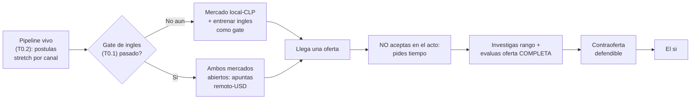

import Nivel from "@components/Nivel.astro";
import Reto from "@components/Reto.astro";
import Solucion from "@components/Solucion.astro";
import Quiz from "@components/Quiz.astro";
import CheckDominio from "@components/CheckDominio.astro";

<Nivel nivel="básico" />

Has llegado al final del track. Construiste un pipeline vivo, afilaste tu CV, practicaste entrevistas,
curaste tu portafolio. Y un día pasa lo que parecía lejano: una empresa te dice **"queremos hacerte una
oferta"**. Lo que hagas en los siguientes treinta minutos —no en los próximos seis meses de estudio—
puede valer miles de dólares al año. La mayoría de la gente, en ese momento, dice "sí, gracias" con la
voz temblando y cuelga. Esta lección es para que tú no seas esa persona. Vamos a cerrar el círculo: de
**a qué mercado apuntas**, a **cómo postulas con cabeza**, a **cómo negocias el sí sin miedo**.

## Objetivos de esta lección

Al terminar deberías ser capaz de:

- **O1 — Explicar el trade-off** entre los dos mercados honestos (local-CLP empleado vs remoto-USD
  contractor), identificar el **gate del inglés** que abre el segundo, y **decidir** a cuál apuntar según
  tu nivel real hoy —sin sobrevender el remoto-USD ni subvalorar el local.
- **O2 — Diseñar** una estrategia de postulación **calibrada por canal** (GetOnBoard para LATAM, LinkedIn,
  boards remoto-globales), con volumen sostenido + seguimiento, que evita por igual la parálisis y el
  *spray-and-pray*.
- **O3 — Conducir** una negociación salarial sin miedo: investigar el rango, manejar el *anchoring*,
  evaluar la **oferta completa** (base + equity + beneficios + moneda + estabilidad) y formular una
  **contraoferta** defendible que casi nunca pone en riesgo la oferta.

## Por qué esto importa (y paga, literalmente)

El "💰" de esta lección es el más medible de todo el track: **negociar una oferta es la actividad de mayor
retorno por minuto de toda tu carrera.** Tres razones sin adornos:

- **Una sola conversación incómoda vale más que un mes de estudio.** Subir tu base de USD 2.000 a USD
  2.300 mensuales con una contraoferta de un párrafo son **USD 3.600 más al año**, por una conversación de
  treinta minutos. No hay nada que estudies que te pague esa tasa por hora. Y el efecto compone: tu próximo
  aumento y tu próximo trabajo se calculan sobre esa base más alta.
- **El inglés es la palanca de precio, no un bonus.** El mismo perfil cobra distinto según a qué mercado
  accede. El gate del inglés (de [T0.1](/track-0-empleabilidad/t0-1-ingles-tecnico/)) no suma "un 35%": te
  abre o te cierra un mercado entero. Saberlo cambia a qué postulas y cuánto pides.
- **No negociar es regalar dinero que la empresa ya presupuestó.** Casi todas las ofertas vienen con margen.
  La empresa espera que negocies; muchas reservan un rango y ofrecen primero el piso. El candidato que
  acepta el piso sin chistar deja sobre la mesa plata que *estaba destinada a él*. No negociar no es humilde:
  es caro.

> [!tip] GLaDOS dice
> En una negociación, el primer número rara vez es el último. Lo sé porque pasé años ofreciéndole pastel a
> sujetos de prueba: el pastel nunca era la oferta final, era el ancla. La diferencia entre tú y ellos es
> que tú *sí* puedes contraofertar. Una pausa de tres segundos antes de responder "déjame revisarlo" vale,
> estadísticamente, más que tu título universitario. Úsala.

:::tip[Si ya negociaste una oferta antes]
Valida y salta: ¿pediste tiempo antes de responder, o aceptaste en la llamada? ¿Investigaste el rango de
mercado *antes* de oír su número? ¿Evaluaste la oferta **completa** (base, equity, beneficios, moneda,
estabilidad) o solo miraste el número grande? ¿Hiciste una contraoferta con justificación, o asumiste que
"no tenías leverage"? Si las cuatro salen sin dudar, ve directo a los
[ejercicios](#ejercicios-primero-sin-ia). Si alguna te incomoda, la lección te la cierra.
:::

## Lo que ya traes (activación)

Recupera **de memoria**, sin abrir notas, cuatro ideas previas que esta lección hace aterrizar:

1. De [T0.2 · Empleabilidad como track-0](/track-0-empleabilidad/t0-2-empleabilidad-track0/): el **pipeline
   vivo** y postular *stretch* (~50-70% de match) desde el mes 2 para **calibrar**. Esa máquina es la que,
   varios meses después, escupe la oferta que vas a negociar aquí. Sin pipeline no hay oferta que negociar.
2. De [T0.7 · CV y posicionamiento](/track-0-empleabilidad/t0-7-cv-posicionamiento/): tu posicionamiento
   como **AI/Automation Engineer** y tus logros medibles. Eso es exactamente la munición de tu contraoferta:
   negocias sobre el **valor que demostraste**, no sobre lo que necesitas.
3. De [T0.1 · Inglés técnico como GATE](/track-0-empleabilidad/t0-1-ingles-tecnico/): el inglés como gate
   binario al mercado remoto-USD. Hoy ese gate decide a cuál de los dos mercados puedes apuntar de verdad.
4. De [T0.9 · Vender el skill AI-augmented](/track-0-empleabilidad/t0-9-skill-ai-augmented/): cómo articular
   que entregas más por orquestar IA con criterio. Es un argumento de valor que sube tu ancla en la mesa.

## Modelo mental: dos mercados honestos

Antes del worked example, fija el mapa que ordena toda la lección. Para un ingeniero en Chile (o LATAM), no
existe "el mercado" en singular. Existen **dos**, con reglas y precios distintos, y el inglés es la puerta
entre ellos:

| | Mercado **local-CLP** | Mercado **remoto-USD** |
|---|---|---|
| Relación típica | empleado (contrato, AFP, salud, gratificación, finiquito) | contractor / B2B (boleta o factura, tú pagas tus impuestos y previsión) |
| Moneda | CLP (expuesta a inflación local) | USD (cobertura natural si el peso se devalúa) |
| Banda semi-senior realista | CLP 1.6M–2.4M aprox. | USD 1.7k–2.6k de entrada; USD 4k–8k es mayormente **senior** + inglés + sistemas en producción |
| Gate de entrada | español, presencia local/híbrida | **inglés** (gate binario), zona horaria compatible, autonomía |
| Estabilidad/beneficios | protegida por ley laboral chilena | depende del contrato; menos red de seguridad, más responsabilidad propia |

Ninguno es "mejor" en abstracto. El remoto-USD paga más nominal, pero te vuelve contractor: sin gratificación
ni vacaciones pagadas por ley, gestionando tu propia salud y previsión, y con menos protección si te
desvinculan. El local-CLP paga menos pero trae la red de la legislación laboral. **La decisión honesta es:
¿a cuál puedes acceder hoy, y cuál te conviene según tu etapa de vida?** Y la honestidad incómoda: si tu
inglés todavía no pasa un screening técnico hablado, el remoto-USD *jugoso* no es tu mercado **todavía** —es
una meta con un gate concreto que entrenas.



## Ejemplo resuelto: Dani negocia su primera oferta (think-aloud)

Te voy a mostrar cómo razono una negociación real, paso a paso. **El protagonista:** Dani, que vino del cero,
lleva meses con su pipeline vivo y postulando *stretch*. Acaba de pasar todas las etapas de una startup
remota y le llega el correo: *"Nos encantó tu perfil. Te ofrecemos **USD 2.000/mes** como contractor, más
**0,15% de equity** con vesting a 4 años (cliff de 1 año), y un stipend de equipo de USD 500. ¿Qué te
parece?"* El corazón de Dani se acelera y su instinto grita "¡DI QUE SÍ ANTES DE QUE SE ARREPIENTAN!".
Vamos a ignorar ese instinto, con método.

**Paso 1 — No aceptar en el acto. Comprar tiempo.** Lo primero no es un número: es una pausa. Dani responde,
cordial: *"Muchas gracias, me entusiasma mucho la oferta y el equipo. Para tomar una decisión seria,
¿me das un par de días para revisar los detalles?"* Pienso en voz alta por qué esto importa tanto: pedir
tiempo (a) no ofende a nadie —es lo que hace un profesional—, (b) le quita el poder a la urgencia
artificial, y (c) te da espacio para investigar con la cabeza fría. **Nadie retira una oferta porque pediste
dos días.** Si lo hicieran, acabas de esquivar a un empleador tóxico.

**Paso 2 — Investigar el rango ANTES de pensar en un número.** Dani no inventa una cifra; la *funda* en
datos. Cruza tres fuentes: levels.fyi y Glassdoor para el rango del rol/seniority, los avisos de GetOnBoard
y LinkedIn que guardó en su pipeline (que ya muestran bandas para roles parecidos), y —la mejor fuente—
preguntarle a una o dos personas de su red en roles comparables. Descubre que un AI/Automation Engineer
semi-senior remoto-USD se mueve en USD 2.000–3.000. **Conclusión:** la oferta está en el **piso** del rango.
Eso no es un insulto; es exactamente lo que esperabas —ofrecieron primero el número bajo.

**Paso 3 — Evaluar la oferta COMPLETA, no el número grande.** Aquí es donde la mayoría se equivoca: miran
solo la base. Dani descompone la oferta entera y le pone un valor honesto a cada parte:

| Componente | Lo que ofrecen | Cómo lo valoro (honesto) |
|---|---|---|
| Base | USD 2.000/mes | Real, líquido, predecible. Es el ancla de todo lo demás. |
| Equity | 0,15%, vesting 4 años, cliff 1 año | **Un boleto de lotería con descuento fuerte.** En una startup privada puede valer 0. No cambio base segura por equity incierto sin entender valuación, dilución y strike. |
| Stipend equipo | USD 500 una vez | Lindo, pero marginal. No mueve la decisión. |
| Moneda | USD (contractor) | A favor: cobertura ante el peso. En contra: pago mi previsión y salud, sin gratificación ni finiquito. |
| Estabilidad / crecimiento | startup temprana | Más riesgo, más aprendizaje. Lo peso según mi momento de vida. |

Pienso en voz alta: el equity de una startup temprana lo valoro **al costo de oportunidad**, no a la
promesa. Si me piden bajar base "porque el equity compensa", desconfío —la base paga el arriendo *hoy*; el
equity quizá pague algo *en años, si la empresa sobrevive*. No es que el equity sea basura: es que se valora
con descuento y entendiendo el vesting (no recibes nada si te vas antes del *cliff* de 1 año).

**Paso 4 — Definir mi número y mi piso (BATNA).** Dani fija dos cifras antes de volver a hablar: su **target**
(USD 2.500, el medio-alto del rango, justificable por su portafolio agéntico real) y su **piso** —el número
bajo el cual prefiere seguir buscando, porque su pipeline tiene otras conversaciones vivas. Ese pipeline es su
**BATNA** (la mejor alternativa si esto no cierra). Aquí se ve por qué T0.2 importa: **el leverage en una
negociación no es agresividad, es tener alternativas.** Quien tiene otras conversaciones abiertas negocia sin
miedo porque un "no" no lo deja en la calle.

**Paso 5 — Contraofertar: una vez, con justificación, colaborativo.** Dani no regatea como en una feria. Manda
**una** contraoferta, anclada en valor y en datos, con tono de "resolvamos esto juntos":

> *"Gracias de nuevo, estoy convencido de que quiero sumarme. Mirando el rango de mercado para este rol y
> seniority (USD 2.000–3.000) y lo que puedo aportar desde el día 1 —tengo un proyecto agéntico en producción
> con manejo de fallas y evals, justo lo que ustedes están construyendo— ¿podríamos cerrar la base en **USD
> 2.500**? Si llegamos ahí, firmo encantado. Estoy abierto a conversar también la forma del equity."*

Desmenuzo por qué este mensaje funciona: (a) abre y cierra con entusiasmo —no es una amenaza, es un "quiero
entrar"; (b) ancla en el **rango de mercado**, no en sus necesidades personales ("necesito más para mi
arriendo" es un argumento débil); (c) trae **valor demostrado** (su capstone agéntico, conecta con
[T0.9](/track-0-empleabilidad/t0-9-skill-ai-augmented/)); (d) da una señal clara de cierre ("si llegamos ahí,
firmo") para que la empresa sepa que no es regateo infinito; (e) deja una segunda palanca abierta (el equity)
por si no mueven la base.

**Paso 6 — Cerrar y poner por escrito.** La startup responde con USD 2.350 y mantiene el resto. Dani lo
evalúa contra su piso (estaba en 2.100): está cómodamente arriba. Acepta —y pide **el detalle final por
escrito** antes de firmar nada (base, moneda, forma de pago, equity, fecha de inicio). Un acuerdo verbal no
es un acuerdo. Resultado: **+USD 4.200 al año** sobre la oferta inicial, por dos correos cordiales y una
pausa de dos días.

Fíjate en el orden de las decisiones de Dani: **comprar tiempo → investigar el rango → evaluar la oferta
completa → fijar target y piso (BATNA) → contraofertar una vez con justificación → cerrar por escrito.** Ese
orden no es casual. Comprar tiempo lo protege del impulso; investigar lo saca de la suposición; evaluar
completo evita que un número grande con mala letra chica lo engañe; el BATNA le da la calma; la contraoferta
única y justificada respeta la relación; y poner por escrito blinda el resultado. Sin el primer paso (la
pausa), nada de lo demás sucede —por eso es el más importante.

## Non-examples y misconceptions

:::caution[Podrías pensar... y por qué está mal]
**"Si negocio, van a retirar la oferta o pensarán que soy difícil."**
Mal, y es el miedo que más dinero cuesta. Las empresas **esperan** que negocies; reservan margen para eso.
Una contraoferta cordial y bien fundada es señal de profesionalismo, no de conflicto. En la práctica, una
oferta no se retira por un "¿podríamos llegar a X?" educado. Si una empresa retira una oferta porque
negociaste con respeto, te acaba de mostrar cómo trata a su gente: esquivaste una bala.

**"Debo aceptar rápido para que no cambien de opinión."**
Mal: la urgencia es casi siempre una técnica de presión, no un hecho. Pedir un par de días es estándar y no
te resta nada. Aceptar en la llamada, en cambio, te cierra la única ventana de negociación que vas a tener:
una vez que dices "sí", tu leverage desaparece.

**"Remoto-USD es solo postular a empresas gringas; cualquiera puede."**
Mal: el remoto-USD tiene un gate real —el **inglés** técnico hablado, la zona horaria, y la autonomía de
trabajar sin que te supervisen. Decir "voy a ganar en dólares" sin pasar el screening en inglés es
sobrevender. El gate no es opcional; es entrenable (T0.1), pero hasta que lo pasas, tu mercado realista es
otro.

**"La oferta con la base más alta es siempre la mejor oferta."**
Mal: una base alta en una startup que quiebra en un año, pagada en una moneda inestable y sin beneficios,
puede valer menos que una base algo menor, estable, en USD y con buen aprendizaje. Se evalúa la **oferta
completa**: base + equity (con descuento) + beneficios + moneda + estabilidad + crecimiento. El número grande
es solo una variable.

**"Como soy semi-senior / vengo del cero, no tengo leverage para negociar."**
Mal: tu leverage no es tu seniority, es tu **BATNA** (tus alternativas) + el **valor que demostraste**. Si
tienes un pipeline vivo con otras conversaciones y un portafolio que prueba lo que haces, negocias desde una
posición real aunque sea tu primer trabajo. El leverage se construye con el pipeline (T0.2), no se hereda del
título.

**"El equity es plata gratis"** (o su opuesto, **"el equity no vale nada, ignóralo"**).
Ambos extremos están mal. El equity de una startup privada es un activo **incierto y de baja liquidez**: ni
es plata gratis ni es cero automático. Se valora con descuento fuerte, entendiendo *vesting*, *cliff*,
*strike price* y dilución. La regla práctica: no cambies base segura por equity incierto a menos que entiendas
exactamente qué te están dando y creas en la empresa.
:::

## Práctica con andamiaje (faded)

### Mini-reto A — Predice el resultado

Dos candidatos, misma oferta inicial: USD 2.000/mes de base. **Lucía** responde en la llamada: "¡Sí, acepto,
muchas gracias!". **Marco** responde: "Gracias, me entusiasma; ¿me das dos días para revisar los detalles?",
investiga el rango (descubre que es el piso), y contraoferta una vez en USD 2.500 con justificación de valor.

**Predice (sin leer la pista):** ¿quién termina con mejor resultado y por qué? Nombra al menos dos cosas
concretas que Marco hizo y que Lucía se saltó, y di qué le costó a Lucía cada una.

<Solucion title="Ver pista (no la respuesta completa)">

Piensa en términos de **leverage y de información**, no de "suerte". Lucía renunció a su única ventana de
negociación en el segundo en que dijo "acepto": después del sí, su poder es cero. Además aceptó **sin saber**
que 2.000 era el piso del rango —negoció a ciegas contra un número que ni siquiera era el techo de lo que la
empresa tenía presupuestado. Marco, en cambio, (1) compró tiempo para investigar, (2) negoció *antes* de
aceptar (cuando todavía tenía leverage), y (3) ancló en datos de mercado, no en su necesidad. Pregúntate:
sobre los próximos años, ¿cuánto suma la diferencia de base que Lucía dejó ir por no hacer una pausa de tres
segundos?

</Solucion>

### Mini-reto B — Parsons: ordena la negociación

Estos pasos son el corazón de una negociación con cabeza, pero están **desordenados**. Reordénalos
mentalmente (o en papel) para que la secuencia tenga sentido: primero proteger tu posición, al final blindar
el resultado.

```text
A)  Contraofertas UNA vez, anclado en el rango de mercado y en tu valor demostrado
B)  Investigas el rango real del rol/seniority en varias fuentes
C)  Pides un par de días: NO aceptas en el acto
D)  Pones el acuerdo final por escrito antes de firmar
E)  Evalúas la oferta COMPLETA (base + equity + beneficios + moneda + estabilidad)
F)  Fijas tu número target y tu piso (apoyado en tu BATNA / pipeline vivo)
```

Piensa: ¿puedes investigar el rango *después* de haber aceptado? ¿La contraoferta va antes o después de fijar
tu piso? ¿Por qué "poner por escrito" tiene que ser el último paso y no el primero? (El orden correcto lo
valida el corrector; lo importante es que **justifiques** por qué comprar tiempo va primero —si aceptas en el
acto, todos los demás pasos quedan sin poder.)

## Ejercicios Primero-Sin-IA

> Trabaja **a mano primero**, sin IA, dentro del timebox. Cuando termines, pídele a tu IA que corrija con el
> framework de `.ai/` (que **revise** tu razonamiento, no que lo resuelva por ti). Las carpetas viven en tu
> repo; ábrelas en tu editor.

<Reto title="Mapea tus dos mercados y tu estrategia de canal" timebox="35 min">

Vas a decidir, con honestidad, a qué mercado apuntas hoy y cómo vas a postular. Parte del esqueleto
`mapa.md` que te entregamos y complétalo:

1. **Autoevaluación del gate de inglés:** describe honestamente tu nivel para un **screening técnico hablado**
   (no tu inglés de leer docs). Decide: ¿el remoto-USD jugoso es tu mercado *hoy*, una *meta con gate*, o
   ambos parcialmente? Justifica con una evidencia concreta (una conversación real, un mock, un screening).
2. **Tabla de los dos mercados, personalizada:** para tu caso, completa qué te ofrece y qué te cuesta cada
   mercado (local-CLP empleado vs remoto-USD contractor) en al menos: moneda, beneficios/red de seguridad,
   banda realista, y gate de entrada. No copies la tabla de la lección: ajústala a **tu** situación (momento
   de vida, tolerancia al riesgo, necesidad de estabilidad).
3. **Decisión de mercado:** elige a cuál apuntas este trimestre (puede ser "local-CLP ahora, remoto-USD como
   meta a 6 meses con el inglés como gate"). Una decisión, justificada en 2-3 frases.
4. **Estrategia por canal:** para **3 canales reales** (p. ej. GetOnBoard, LinkedIn, un board remoto-global
   como We Work Remotely / Remote OK / Wellfound) define: qué buscas ahí, cuántas postulaciones *stretch* por
   semana, y cómo harás **seguimiento** (no postular y desaparecer). Distingue volumen sostenido de
   *spray-and-pray*.
5. **Criterio anti-parálisis y anti-spray:** escribe la regla con la que evitarás los dos extremos —ni
   esperar a "estar listo" (parálisis) ni mandar 100 postulaciones idénticas (ruido). Conéctala con calibrar
   de [T0.2](/track-0-empleabilidad/t0-2-empleabilidad-track0/).

Carpeta del ejercicio: `ejercicios/track-0/mapa-dos-mercados-canales/`

**Hecho significa:** las 5 secciones presentes; la autoevaluación de inglés es honesta y con evidencia (no
"creo que me defiendo"); la tabla está personalizada a tu situación, no copiada; la decisión de mercado es
**una** y está justificada; cada uno de los 3 canales tiene un qué-buscas + volumen semanal + plan de
seguimiento concreto; y el criterio anti-parálisis/anti-spray es accionable. Bonus de **Excelente**: tu plan
de seguimiento incluye una cadencia real (cuándo y cómo re-contactar) y reconoce el inglés como gate medible,
no como adorno.

</Reto>

<Reto title="Negocia una oferta: del rango a la contraoferta" timebox="45 min">

Te entregamos una **oferta concreta** (en `oferta.md`): base, equity, beneficios, moneda y contexto de la
empresa. Tu tarea, **sin IA**, es producir un `negociacion.md` que demuestre el método completo:

1. **El correo de compra-tiempo:** redacta el mensaje real con el que pides un par de días sin aceptar ni
   rechazar (cordial, profesional, 2-3 frases).
2. **Investigación de rango:** lista **3 fuentes** que cruzarías para estimar el rango de este rol/seniority y
   escribe un rango plausible. Indica dónde cae la oferta dentro de ese rango (piso / medio / techo).
3. **Evaluación de la oferta completa:** una tabla con cada componente (base, equity, beneficios, moneda,
   estabilidad) y **cómo lo valoras** —en particular, pon un valor honesto al equity (con su vesting y
   cliff). No te quedes solo en la base.
4. **Target y piso (BATNA):** define tu número objetivo y tu piso, y di explícitamente cuál es tu **BATNA**
   (qué harías si esto no cierra) y por qué eso te da o te quita leverage.
5. **El correo de contraoferta:** redacta el mensaje real de contraoferta —**una sola**, anclada en el rango
   de mercado y en valor demostrado, con tono colaborativo y una señal de cierre. Debe poder mandarse tal cual.
6. **Plan de cierre:** en 2-3 frases, qué harás cuando respondan (aceptar/seguir negociando contra tu piso) y
   cómo pones el acuerdo por escrito.

Carpeta del ejercicio: `ejercicios/track-0/negociar-oferta-usd/`

**Hecho significa:** las 6 secciones presentes; el correo de compra-tiempo no acepta ni rechaza; el rango está
fundado en 3 fuentes nombradas y ubicas la oferta dentro de él; la tabla valora el **equity con descuento** y
no solo la base; el BATNA está nombrado y conectado a tu pipeline; la contraoferta es **una**, anclada en
mercado/valor (no en necesidad personal), con señal de cierre; y el plan de cierre incluye "por escrito".
Bonus de **Excelente**: tu contraoferta usa un argumento de valor AI-augmented
([T0.9](/track-0-empleabilidad/t0-9-skill-ai-augmented/)) y dejas una segunda palanca abierta (p. ej. equity)
por si no mueven la base.

</Reto>

## Check de dominio (active recall)

<CheckDominio items={[
  "Explicar, de memoria, el trade-off entre local-CLP empleado y remoto-USD contractor (moneda, beneficios, gate de entrada) sin leerlo como 'USD siempre gana'",
  "Decir por qué el inglés es un gate binario al remoto-USD y no un '+35%' abstracto",
  "Enumerar los 6 pasos de una negociación con cabeza en orden, empezando por comprar tiempo",
  "Explicar por qué nunca debes aceptar una oferta en el acto (qué pierdes en el segundo que dices 'sí')",
  "Evaluar una oferta completa (base + equity + beneficios + moneda + estabilidad) y valorar el equity con descuento, no a la promesa",
  "Definir qué es tu BATNA y por qué tu pipeline vivo es tu leverage real, no tu seniority",
]} />

<Quiz
  question="Te llaman y te ofrecen USD 2.000/mes de base como contractor remoto. Te entusiasma mucho. ¿Cuál es la primera jugada correcta?"
  options={[
    "Aceptar en la llamada para no arriesgar que cambien de opinión",
    "Agradecer y pedir un par de días para revisar los detalles, sin aceptar ni rechazar",
    "Contraofertar de inmediato con un número alto antes de investigar nada",
    "Rechazar y pedir que primero suban la base, o no sigues conversando",
  ]}
  answer={1}
  explanation="La primera jugada nunca es un número: es comprar tiempo. Pedir un par de días es estándar, no ofende a nadie, y te da espacio para investigar el rango con la cabeza fría. Aceptar en el acto te cierra tu única ventana de negociación; contraofertar sin investigar es disparar a ciegas; y rechazar de entrada es agresivo e innecesario. La pausa cordial preserva tu leverage."
/>

<Quiz
  question="Oferta A: USD 2.400 base en una startup temprana, equity 0,2% (vesting 4 años, cliff 1 año), moneda USD, sin beneficios. Oferta B: USD 2.100 base, empresa estable de 10 años, USD, seguro de salud y 20 días de PTO. ¿Cómo razonas la comparación?"
  options={[
    "A es mejor: tiene la base más alta y además equity, que es plata extra",
    "B es mejor automáticamente porque es más estable",
    "No se decide por la base sola: se evalúa la oferta COMPLETA; el equity se valora con descuento y los beneficios/estabilidad de B pueden compensar los USD 300",
    "Da igual, la diferencia es muy chica para que importe",
  ]}
  answer={2}
  explanation="El error clásico es comparar solo la base. La oferta completa de A incluye equity incierto (un boleto de lotería con descuento, puede valer 0) y cero beneficios; la de B trae estabilidad, salud y PTO que tienen valor monetario real. No hay una respuesta única —depende de tu tolerancia al riesgo y momento de vida— pero el razonamiento correcto es descomponer y valorar cada componente, no quedarse con el número grande."
/>

## Recursos

No existe "documentación oficial" de la negociación, pero sí referencias canónicas y fuentes de datos
confiables. Empieza por los datos de mercado y la guía táctica:

- [GetOnBoard (getonbrd.com)](https://www.getonbrd.com/) — bolsa de referencia para LATAM y remoto; muchos
  avisos publican **banda salarial**, insumo directo para investigar tu rango.
- [levels.fyi](https://www.levels.fyi/) — datos de compensación por rol/nivel/región, incluida la
  descomposición base + equity + bonus. La referencia para calibrar el techo.
- [Glassdoor](https://www.glassdoor.com/) — rangos auto-reportados por empresa/rol; úsalo como segunda fuente,
  con criterio (los datos son ruidosos).
- "Ten Rules for Negotiating a Job Offer" (Haseeb Qureshi) — el artículo gratuito más citado sobre negociar
  ofertas de software; cubre anchoring, BATNA, contraoferta y el "nunca des el primer número" en detalle.
- *Never Split the Difference* (Chris Voss) — clásico de negociación táctica (pausas, etiquetado, preguntas
  calibradas). No es de software, pero su método se aplica directo a la mesa de la oferta.
- Boards remoto-globales para el segundo mercado: [We Work Remotely](https://weworkremotely.com/),
  [Remote OK](https://remoteok.com/) y [Wellfound](https://wellfound.com/) (startups, suelen mostrar rango y
  equity).

## Conexión con el resto del track-0

Esta es la lección donde **todo el track aterriza**. El track-0 no tiene un capstone tradicional: su capstone
es **conseguir el trabajo**, y aquí se cierra el arco.

- El **pipeline vivo** de [T0.2](/track-0-empleabilidad/t0-2-empleabilidad-track0/) es la máquina que produce
  la oferta que negocias aquí —y es, además, tu **BATNA**: tener otras conversaciones abiertas es lo que te
  deja negociar sin miedo.
- Tu **CV y posicionamiento** de [T0.7](/track-0-empleabilidad/t0-7-cv-posicionamiento/) son la munición de tu
  contraoferta: negocias sobre el valor que demostraste, no sobre lo que necesitas.
- El **gate de inglés** de [T0.1](/track-0-empleabilidad/t0-1-ingles-tecnico/) decide a cuál de los dos
  mercados accedes, y por lo tanto cuánto puedes pedir.
- Tu **portafolio diferenciado** ([T0.5](/track-0-empleabilidad/t0-5-portafolio-diferenciado/)) y tu skill
  **AI-augmented** ([T0.9](/track-0-empleabilidad/t0-9-skill-ai-augmented/)) son los argumentos concretos que
  suben tu ancla en la mesa.

En términos del **Definition of Done** del curso, la "demo que corre + write-up de trade-offs" de tus
capstones no es solo para el portafolio: es exactamente lo que pones sobre la mesa para justificar tu número.
El trabajo técnico y la negociación no están separados —el primero financia al segundo.

## Plazos honestos (sin sobrevender)

Para que negocies contra un mercado real y no contra uno imaginario, repite el marco honesto del track:

- La banda objetivo realista del curso es **semi-senior local-CLP** (CLP 1.6M–2.4M) **o remoto-USD de
  entrada** (USD 1.7k–2.6k). Los remotos de USD 4k–8k son, casi siempre, **senior + inglés + sistemas
  agénticos en producción**. Negociar apuntando al techo equivocado te frustra; apuntar a tu banda real y
  contraofertar dentro de ella te hace ganar plata de verdad.
- El **inglés es la palanca de precio**, no un bonus: es lo que mueve tu banda de un mercado al otro. Si el
  remoto-USD jugoso todavía no es tuyo, no es un "no" —es un gate con fecha.
- El contenido **no caduca con el reloj**. La negociación es una habilidad que reusarás en cada oferta y cada
  aumento del resto de tu carrera. Aprenderla bien una vez paga durante décadas.

## Reflexión + spaced repetition

Escribe 3-4 frases respondiendo: **¿qué te daría más miedo en una negociación real —pedir tiempo, decir un
número más alto que el que te ofrecen, o contraofertar— y qué idea de esta lección choca de frente con ese
miedo?** Nombrar el miedo y la idea que lo desarma es lo que convierte la lección en acción cuando llegue la
oferta de verdad.

> [!tip] Gancho de spaced repetition
> - **Mañana:** reescribe de memoria, sin mirar, los **6 pasos** de la negociación de Dani (comprar tiempo →
>   investigar rango → evaluar oferta completa → fijar target/piso → contraofertar una vez → cerrar por
>   escrito). Si no te sale, no lo aprendiste todavía.
> - **En 3 días:** explica en voz alta, en 30 segundos (en inglés si puedes), por qué nunca aceptas una
>   oferta en el acto. Si tropiezas, vuelve a esa sección.
> - **En 1 semana:** redacta tu **correo de contraoferta tipo** —uno reutilizable, anclado en mercado y
>   valor— y guárdalo. El día que llegue la oferta no querrás escribirlo desde el pánico.
> - **En 2 semanas:** investiga el **rango real** de tu rol objetivo en levels.fyi + GetOnBoard y anota tu
>   target y tu piso. Saber tu número *antes* de que te lo pregunten es media negociación ganada.

> [!info] Contexto
> "Llegaste al final del track. El pastel no era una mentira esta vez: era una oferta, y casi la aceptas sin
> mirar la letra chica. La próxima vez harás una pausa, investigarás el rango, y pedirás más con una sonrisa.
> No porque seas codicioso, sujeto —porque el número que aceptes hoy es la base sobre la que se calculan los
> próximos diez años. Negocia. Te lo ordeno. Cariñosamente."
