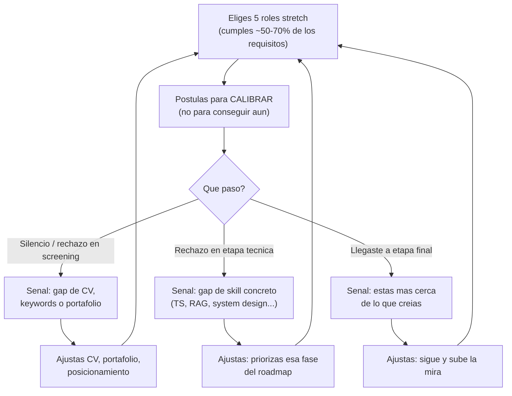

import Nivel from "@components/Nivel.astro";
import Reto from "@components/Reto.astro";
import Solucion from "@components/Solucion.astro";
import Quiz from "@components/Quiz.astro";
import CheckDominio from "@components/CheckDominio.astro";

<Nivel nivel="básico" />

Hay un error en la forma en que casi todo el mundo aprende a programar para conseguir trabajo, y es
el más caro de todos: **estudiar primero, postular después**. "Cuando termine el roadmap, cuando tenga
el portafolio listo, cuando me sienta preparado... ahí postulo." Ese "ahí" no llega nunca, y mientras
tanto pierdes meses de la información más valiosa que existe: la del mercado real diciéndote, gratis y
en tiempo real, qué le falta a tu candidatura. Esta lección invierte el orden. La empleabilidad no es
la última fase del curso: es un **track paralelo que arranca hoy**, en paralelo a los fundamentos.

## Objetivos de esta lección

Al terminar deberías ser capaz de:

- **O1 — Explicar el trade-off** entre el roadmap clásico (postular "cuando esté listo") y la
  empleabilidad como track paralelo desde el día 1, y argumentar por qué postular a roles *stretch*
  desde el mes 2 sirve para **calibrar**, no para conseguir el puesto todavía.
- **O2 — Diseñar** un *pipeline* de postulación vivo: definir qué es un rol stretch, elegir candidatos
  reales, instrumentarlo con métricas de *funnel* y cerrar un **loop de calibración** que realimenta tu
  plan de estudio.
- **O3 — Interpretar** las señales de un rechazo o un silencio (separar la **señal accionable** del
  **ruido**) y convertirlas en ajustes concretos de tu plan, sin leerlas como un veredicto sobre tu
  valor como persona.

## Por qué esto importa (y paga)

El "💰" de este track es directo: **el mejor stack del mundo no sirve si no sabes mostrarlo, y no
puedes mejorar lo que no estás midiendo.** Tres razones de mercado, sin adornos:

- **Postular tarde te cuesta meses de feedback que no recuperas.** Si estudias 8 meses y *recién* ahí
  mandas tu primera postulación, son 8 meses sin saber si tu CV pasa el primer filtro, si tu stack es
  el que piden, si tu inglés alcanza. El mercado es el único examen que importa, y lo estás evitando
  justo cuando más barato es equivocarse (nadie recuerda la postulación de un junior anónimo).
- **Las ofertas de trabajo (job descriptions) son el mejor temario que existe, y es gratis.** Cinco
  avisos de "AI/Automation Engineer" leídos en serie te dicen, mejor que cualquier roadmap, qué
  herramientas se repiten, qué nivel de inglés exigen y qué proyectos esperan ver. Leer el mercado *es*
  estudiar.
- **Calibrar temprano cambia tu trayectoria, no solo tu CV.** Cuando una postulación te muestra un gap
  concreto ("piden Docker y no sé Docker", "el screening era en inglés y me trabé"), ese hallazgo
  reordena tu plan de estudio con datos reales en vez de con suposiciones. Estudias lo que el mercado
  pide, en el orden en que lo pide.

> [!tip] GLaDOS dice
> Yo no esperé a tener la instalación "perfecta" para empezar a hacer pruebas. Habría esperado para
> siempre. Probaba, medía el resultado, ajustaba la cámara, volvía a probar. Tu carrera es exactamente
> eso: un sujeto de prueba (tú) atravesando cámaras (postulaciones), y cada puerta que no se abre te
> dice *exactamente* qué te falta para la siguiente. Negarte a entrar a la cámara "hasta estar listo"
> no es prudencia. Es miedo con un disfraz muy convincente.

:::tip[Si ya postulaste a algún trabajo técnico]
Valida y salta: ¿tienes ahora mismo un registro vivo de a qué postulaste, en qué etapa quedaste cada
una y qué gap detectaste? ¿Sabes distinguir un rechazo que es **señal accionable** (te falta un skill
concreto) de uno que es **ruido** (la vacante se cerró, el cupo se llenó)? ¿Estás postulando a roles
donde cumples ~50-70% de los requisitos, o solo a los "seguros" donde cumples casi todo? Si las tres
salen sin dudar, ve directo a los [ejercicios](#ejercicios-primero-sin-ia). Si alguna te hace dudar,
la lección te la cierra.
:::

## Lo que ya traes (activación)

Recupera **de memoria**, sin abrir notas, dos ideas previas que esta lección reutiliza:

1. De [T0.1 · Inglés técnico como GATE](/track-0-empleabilidad/t0-1-ingles-tecnico/): el inglés no es
   un "+35% al sueldo", es un **gate binario** que abre o cierra el mercado remoto-USD. Hoy ese gate
   aparece como un requisito concreto que vas a *leer* en las ofertas y *medir* en tus screenings.
2. De la **Regla del Primero-Sin-IA** (Fase 0): primero lo intentas tú, mides el resultado, y solo
   entonces ajustas. La empleabilidad funciona igual: postulas (intento), lees el resultado (medición),
   ajustas el plan (corrección). Es el mismo loop, aplicado a tu carrera en vez de a tu código.

## El reencuadre que lo cambia todo: postular para calibrar

Antes del worked example, fija el modelo mental que ordena toda la lección. Hay dos formas de entender
una postulación temprana, y solo una te sirve:

| | Postular para **conseguir** | Postular para **calibrar** |
|---|---|---|
| Objetivo | que te contraten *ya* | obtener señal del mercado |
| Si te rechazan | fracaso, "no sirvo" | dato útil, "esto me falta" |
| A qué roles | solo los "seguros" | roles **stretch** (~50-70%) |
| Cuándo | "cuando esté listo" | desde el **mes 2** |
| Resultado | parálisis | un plan de estudio guiado por datos |

**Postular para calibrar** significa que el éxito de la postulación **no es** que te contraten: es que
aprendas algo accionable sobre tu candidatura. Con ese marco, un rechazo no es un fracaso —es
exactamente el producto que fuiste a buscar. Esto desbloquea algo que la mentalidad de "conseguir"
mantiene cerrado: la libertad de postular a roles para los que *todavía no estás listo*, que son justo
los que más te enseñan.



## Ejemplo resuelto: Sofía monta su pipeline en el mes 2 (think-aloud)

Te voy a mostrar cómo razono el armado de un pipeline vivo, paso a paso. **La protagonista:** Sofía,
cero real, lleva dos meses en el curso. Terminó los fundamentos (Fase 0) y arrancó Python (Fase 1). No
tiene experiencia laboral en software. Quiere ser AI/Automation Engineer. Su instinto le grita "no
estás lista, no postules". Vamos a ignorar ese instinto, con método.

**Paso 1 — Reencuadro primero.** Sofía escribe, literalmente, arriba de su hoja de tracking: *"Postulo
este mes para calibrar, no para que me contraten."* Suena trivial, pero es la decisión más importante.
Sin ella, el primer silencio la va a hundir. Con ella, ese silencio es un dato que anotó.

**Paso 2 — Definir qué es "stretch" para ella.** Un rol stretch es donde cumple **~50-70% de los
requisitos**, no el 100% (eso es un rol seguro, da poca señal) ni el 5% (eso es ruido, da señal falsa:
te rechazan por todo a la vez y no aprendes nada puntual). Pienso en voz alta: ¿cómo mide ese
porcentaje sin engañarse? Cuenta los requisitos "duros" del aviso (lenguajes, frameworks, años, nivel
de inglés) y marca cuáles cumple hoy. Si cumple más de la mitad pero le faltan piezas claras, es
stretch. Justo ahí está el aprendizaje.

**Paso 3 — Leer 5 ofertas como temario, no como veredicto.** Sofía abre GetOnBoard y LinkedIn, busca
"AI Engineer", "Automation Engineer", "Python Developer" y elige 5 avisos stretch. **No** los lee
preguntándose "¿me aceptarían?". Los lee preguntándose "¿qué se repite?". Anota: Python (5/5),
FastAPI (3/5), Docker (4/5), "experiencia con LLMs/RAG" (3/5), inglés B2+ (4/5), SQL (3/5). Ese
conteo *es* su currículo personalizado por el mercado, más afilado que cualquier roadmap genérico.

**Paso 4 — Instrumentar el pipeline (tratarlo como un proyecto, no como una libreta).** Igual que un
servicio en producción se mide por su *funnel*, una búsqueda de empleo se mide por sus etapas. Sofía
arma una tabla viva —en una planilla, Notion, o un simple `pipeline.md`— con estas columnas:

| Rol | Empresa | Fuente | Fecha | % match | Etapa actual | Gap detectado | Ajuste |
|---|---|---|---|---|---|---|---|
| AI Eng Jr | Acme | GetOnBoard | 2026-03-04 | 55% | Screening | piden Docker | Fase 5 antes |
| Automation Eng | Beta | LinkedIn | 2026-03-06 | 60% | Rechazo screening | CV no dice "RAG" | reescribir CV |

La columna **Etapa actual** es la clave: convierte cada postulación en un punto de un funnel
(postulé → respondieron → screening → técnica → final), y el funnel se mide. Si de 10 postulaciones
**0** pasan del screening, el problema está arriba (CV, keywords, posicionamiento). Si pasan el
screening pero caen en la técnica, el problema es un skill concreto. **La etapa donde te caes te dice
qué arreglar.**

**Paso 5 — Postular y esperar el resultado (que casi siempre será rechazo o silencio).** Sofía manda
las 5. Sabe que lo más probable es que la mayoría no respondan. Eso **no** es el fracaso del
experimento: es el dato. El silencio masivo en el screening es una señal clarísima —su CV o su
posicionamiento no están conectando— y es accionable.

**Paso 6 — Cerrar el loop: el mercado reordena tu plan de estudio.** Aquí está el premio. Sofía mira
su tabla después de dos semanas: "Docker" apareció en 4 de 5 avisos y fue el gap que más se repitió.
Su roadmap tenía Docker en la Fase 5, lejos. Decisión: **adelanta una introducción a Docker** porque
el mercado se lo pidió cuatro veces. No reescribe todo el plan por un capricho; lo ajusta por una
señal repetida. Eso es calibrar: el plan deja de ser una suposición y pasa a ser una respuesta a datos.

Fíjate en el orden de las decisiones de Sofía: **reencuadro → definir stretch → leer el mercado →
instrumentar → postular → cerrar el loop**. Ese orden no es casual. El reencuadro la protege del golpe
emocional; instrumentar la convierte en alguien que *mide* en vez de *sufre*; cerrar el loop es lo que
transforma un rechazo en una mejora concreta. Sin el último paso, postular temprano sería solo
coleccionar "no". Con él, es un sistema de aprendizaje.

## Non-examples y misconceptions

:::caution[Podrías pensar... y por qué está mal]
**"Postular sin estar listo es perder el tiempo y quemar empresas."**
Mal por dos motivos. Primero, no estás perdiendo el tiempo: estás *comprando información* sobre tu
candidatura al precio más barato (un rechazo anónimo no cuesta nada). Segundo, no quemas a nadie: una
empresa recibe cientos de postulaciones, nadie lleva una lista negra del junior que postuló temprano, y
puedes volver a postular en seis meses con un perfil mejor. El miedo a "quemar la oportunidad" asume
una memoria del reclutador que no existe.

**"Si me rechazan, significa que no sirvo para esto."**
Mal: confundes señal con veredicto. Un rechazo en el screening es señal sobre tu **CV o tus keywords**,
no sobre tu valor. Un rechazo en la técnica es señal sobre un **skill puntual**, no sobre tu capacidad
de aprenderlo. Y un silencio muchas veces es **ruido** (la vacante se congeló, el cupo se llenó
internamente). Leer un rechazo como "no sirvo" es el error que te saca del juego justo cuando el juego
te estaba enseñando.

**"Espero a tener el portafolio completo y el roadmap terminado, y ahí postulo en serio."**
Este es *el error más caro del roadmap clásico*. Cada mes que esperas es un mes de feedback perdido. Si
postulas en el mes 2 (para calibrar) y otra vez en el mes 8 (más en serio), llegas al mes 8 ya sabiendo
cómo es un screening, qué te preguntan, dónde te trabas. Si esperas hasta el mes 8 para tu *primera*
postulación, recién ahí empiezas a aprender lo que pudiste haber aprendido seis meses antes.

**"Pipeline activo = postular a 100 vacantes con el mismo CV (spray and pray)."**
Mal: 100 postulaciones idénticas a roles random no dan señal, dan ruido. Te rechazan en bloque y no
sabes por qué. Cinco roles stretch bien elegidos, con la etapa de cada uno registrada, te enseñan
muchísimo más que cien disparos al aire. Calidad de señal sobre volumen.

**"Un rol stretch es uno donde cumplo el 100% de los requisitos menos uno."**
Mal: eso es un rol **seguro**, y da poca señal (probablemente te vaya bien y no aprendas tu gap real).
Stretch es ~50-70%: cumples más de la mitad pero te faltan piezas visibles. Ahí es donde el rechazo te
señala algo útil y concreto.
:::

## Práctica con andamiaje (faded)

### Mini-reto A — Predice el resultado

Dos personas, mismo punto de partida (cero real, mes 2). **Ana** decide: "no postulo hasta terminar el
roadmap completo". **Beto** decide: "postulo a 5 roles stretch este mes para calibrar, registro cada
etapa y ajusto mi plan según lo que se repita". Avanza el reloj 6 meses.

**Predice (sin leer la pista):** ¿quién llega al mes 8 en mejor posición para conseguir trabajo, y por
qué? Nombra al menos dos ventajas concretas que acumuló esa persona que la otra no.

<Solucion title="Ver pista (no la respuesta completa)">

Piensa en términos de **información acumulada**, no de "esfuerzo". Ana estudió 6 meses a ciegas: no sabe
si su CV pasa filtros, no ha vivido un screening, no sabe cuáles de sus skills el mercado valora de
verdad. Beto estudió los mismos 6 meses, pero *además* tiene: un registro de en qué etapa se cae, una
lista de los gaps que más se repiten (que reordenó su estudio), y la experiencia de haber pasado por
varios screenings (menos nervios la próxima vez). Pregúntate: cuando ambos hagan su "postulación en
serio" en el mes 8, ¿quién parte de cero y quién parte de la sexta iteración de un loop?

</Solucion>

### Mini-reto B — Parsons: ordena el loop de calibración

Estos pasos son el corazón del loop de calibración, pero están **desordenados**. Reordénalos
mentalmente (o en papel) para que el ciclo tenga sentido: primero el reencuadro, y que el último paso
realimente al primero.

```text
A)  Postulas a los 5 roles y registras la etapa de cada uno
B)  Identificas el gap que MÁS se repite en los rechazos/silencios
C)  Escribes "postulo para calibrar, no para conseguir"
D)  Eliges 5 roles stretch (~50-70% de match) leyendo las ofertas como temario
E)  Ajustas tu plan de estudio para atacar ese gap, y vuelves a empezar
F)  Clasificas cada resultado como señal accionable o ruido
```

Piensa: ¿el reencuadro va antes o después de elegir los roles? ¿Puedes "identificar el gap que más se
repite" antes de clasificar señal vs ruido? ¿Por qué el último paso tiene que volver al primero? (El
orden correcto lo valida el corrector; lo importante es que **justifiques** por qué clasificar señal vs
ruido va *antes* de ajustar el plan —si confundes ruido con señal, ajustas por la razón equivocada.)

## Ejercicios Primero-Sin-IA

> Trabaja **a mano primero**, sin IA, dentro del timebox. Cuando termines, pídele a tu IA que corrija
> con el framework de `.ai/` (que **revise** tu intento, no que lo resuelva por ti). Las carpetas viven
> en tu repo; ábrelas en tu editor.

<Reto title="Monta tu pipeline de postulación vivo" timebox="45 min">

Vas a construir tu propio pipeline, real, con roles reales del mercado de hoy (no inventados). Parte del
esqueleto `pipeline.md` que te entregamos y complétalo:

1. **Reencuadro explícito:** escribe en una línea, con tus palabras, por qué postulas este ciclo para
   *calibrar* y no para *conseguir*. (Si no lo crees, el ejercicio no funciona —convéncete primero.)
2. **Tu definición de stretch:** define con qué criterio medirás el "% de match" de un rol, y por qué
   apuntas a ~50-70% y no al 100% ni al 5%.
3. **5 roles stretch reales:** busca en GetOnBoard / LinkedIn / la bolsa que uses, elige 5 avisos
   stretch y para cada uno anota empresa, fuente, link, y tu % de match estimado con el conteo de
   requisitos que cumples vs los que faltan.
4. **El temario que te dio el mercado:** lista los requisitos que **más se repiten** entre los 5 avisos
   (ordénalos por frecuencia). Ese es tu syllabus personalizado.
5. **La tabla de tracking instrumentada:** una fila por rol con, al menos, las columnas
   `Rol | Empresa | Fuente | Fecha | % match | Etapa actual | Gap detectado | Ajuste`. La columna
   **Etapa actual** debe permitir ubicar en qué punto del funnel (postulé → respondieron → screening →
   técnica → final) está cada postulación.
6. **El loop de calibración:** describe en 3-4 frases cómo vas a leer el funnel completo (no caso por
   caso) para decidir tu próximo ajuste de estudio. Ejemplo de la pregunta que debes poder responder:
   "si 0 de 5 pasan el screening, ¿qué ajusto, y por qué eso y no otra cosa?".

Carpeta del ejercicio: `ejercicios/track-0/pipeline-postulacion-vivo/`

**Hecho significa:** las 6 secciones presentes; el reencuadro está escrito con tus palabras; la
definición de stretch justifica el rango ~50-70%; los 5 roles son reales y con % de match calculado (no
inventado); el temario está ordenado por frecuencia; la tabla tiene la columna de etapa del funnel; y el
loop describe una lectura **agregada** del funnel (no "veré qué pasa con cada uno"). Bonus de
**Excelente**: al menos uno de los avisos exige inglés y tú lo registras como gap medible (conecta con
el gate de [T0.1](/track-0-empleabilidad/t0-1-ingles-tecnico/)).

</Reto>

<Reto title="Lee el feedback: señal vs ruido" timebox="30 min">

Te entregamos 6 desenlaces de postulaciones (en `casos.md`): rechazos, silencios y avances. Para cada
uno, **sin IA**, produce un `diagnostico.md` que para cada caso:

- **Clasifique** el desenlace como **señal accionable** (te dice algo concreto que puedes mejorar) o
  **ruido** (no depende de ti / no informa sobre tu candidatura).
- Si es señal, **nombre el gap concreto** (¿CV/keywords? ¿un skill puntual? ¿inglés? ¿posicionamiento?)
  y en **qué etapa del funnel** ocurrió.
- Proponga **un ajuste concreto** mapeado a una acción real (reescribir el CV, adelantar una fase del
  roadmap, practicar screening en inglés, subir/bajar la mira de los roles).
- Al final, escriba **2-3 frases** sobre cómo evitarías leer estos rechazos como un veredicto sobre tu
  valor.

Carpeta del ejercicio: `ejercicios/track-0/leer-feedback-rechazo/`

**Hecho significa:** los 6 casos clasificados como señal o ruido con justificación; cada señal con su
gap, su etapa del funnel y un ajuste concreto y accionable; los casos de ruido identificados como tales
sin inventarles un gap (clasificar ruido como señal es el error que se penaliza); y la reflexión final
distingue explícitamente "señal sobre mi candidatura" de "veredicto sobre mi valor".

</Reto>

## Check de dominio (active recall)

<CheckDominio items={[
  "Explicar, de memoria, por qué postular tarde es el error más caro del roadmap clásico (en términos de feedback perdido, no de esfuerzo)",
  "Definir qué es un rol stretch y por qué ~50-70% de match da más señal que un rol seguro o uno imposible",
  "Diferenciar 'postular para calibrar' de 'postular para conseguir', y qué cambia en cómo lees un rechazo",
  "Explicar por qué la etapa del funnel donde te caes (screening vs técnica vs final) te dice qué arreglar",
  "Distinguir una señal accionable de ruido en un rechazo, y dar un ejemplo de cada uno",
  "Describir el loop de calibración completo y por qué su último paso debe realimentar tu plan de estudio",
]} />

<Quiz
  question="Eres cero real, llevas 2 meses en el curso (Fase 1, Python básico). Encuentras una oferta de 'AI Engineer Jr' donde cumples ~55% de los requisitos. ¿Cuál es la jugada correcta y por qué?"
  options={[
    "No postular: sería perder el tiempo y quemar la oportunidad hasta tener el portafolio completo",
    "Postular para calibrar: registras la etapa donde te caes y usas el gap que se repita para ajustar tu plan",
    "Postular solo si primero terminas un proyecto que cubra el 100% de los requisitos",
    "Postular a 100 ofertas iguales con el mismo CV para maximizar las chances",
  ]}
  answer={1}
  explanation="55% de match es exactamente un rol stretch. Postular ahora no es para que te contraten (probablemente no, todavía): es para obtener señal. Registras en qué etapa del funnel te caes y, si un gap se repite entre varias ofertas, ajustas tu plan de estudio con datos reales. Esperar a cubrir el 100% es el error más caro (meses de feedback perdido); y 100 disparos idénticos dan ruido, no señal."
/>

<Quiz
  question="De 10 postulaciones a roles stretch, 0 pasan del screening (ni una llega a la entrevista técnica). ¿Qué te dice esa señal y dónde NO está el problema?"
  options={[
    "El problema es tu nivel técnico; debes estudiar más algoritmos antes de volver a postular",
    "Es ruido: el mercado está malo, no hay nada que ajustar",
    "El problema está arriba del funnel (CV, keywords, posicionamiento), no en tu skill técnico: aún no te evaluaron técnicamente",
    "Significa que no sirves para el rubro y deberías apuntar más bajo",
  ]}
  answer={2}
  explanation="Si te caes en el screening, todavía nadie evaluó tu código: el filtro es de CV, keywords y posicionamiento. La señal apunta arriba del funnel. Estudiar más algoritmos no ayuda a un problema que ocurre antes de la etapa técnica. La etapa donde te caes te dice qué arreglar; aquí, el CV y cómo te presentas (conecta con T0.7)."
/>

## Recursos

Fuentes para leer el mercado y montar el pipeline. La fuente más autoritativa, recuérdalo, son **las
ofertas mismas**:

- [GetOnBoard (getonbrd.com)](https://www.getonbrd.com/) — la bolsa de referencia para roles tech en
  LATAM y remotos; ideal para encontrar avisos stretch reales de AI/Automation Engineer.
- [LinkedIn Jobs](https://www.linkedin.com/jobs/) — volumen de ofertas + el lenguaje exacto que usan los
  reclutadores (úsalo también para extraer keywords para tu CV, conecta con T0.7).
- [levels.fyi](https://www.levels.fyi/) — datos de bandas salariales por rol/nivel/región; calibra
  expectativas honestas antes de leer la sección de plazos.
- [Teal](https://www.tealhq.com/) o [Huntr](https://huntr.co/) — trackers de postulación si prefieres
  una herramienta dedicada a la tabla del pipeline (una planilla o un `pipeline.md` también bastan).
- *What Color Is Your Parachute?* (Richard N. Bolles) — el clásico canónico sobre búsqueda de empleo
  como proceso medible y no como lotería. No es documentación oficial, pero es la referencia de fondo.

## Conexión con el resto del track-0

Este track no tiene un capstone tradicional: **su capstone es conseguir el trabajo**, y el pipeline
vivo que armas aquí es la espina dorsal donde el resto de las sub-unidades se enchufa.

- El **funnel** que instrumentas en esta lección es lo que [T0.3 · Práctica de entrevista](/track-0-empleabilidad/t0-3-practica-entrevista/)
  alimenta: cada screening real es un mock interview con apuestas de verdad, y cada técnica fallida te
  dice qué practicar en los mocks.
- Los **gaps que detectas** en los rechazos de screening reordenan tu [T0.5 · Portafolio diferenciado](/track-0-empleabilidad/t0-5-portafolio-diferenciado/)
  y tu [T0.7 · CV y posicionamiento](/track-0-empleabilidad/t0-7-cv-posicionamiento/): el mercado te
  dice qué proyecto destacar y qué keywords te faltan.
- El **gate de inglés** de [T0.1](/track-0-empleabilidad/t0-1-ingles-tecnico/) deja de ser abstracto en
  cuanto un screening en inglés te frena: ahí se vuelve un gap medible en tu tabla.
- Y cuando el pipeline madure y empieces a recibir respuestas serias,
  [T0.10 · Estrategia de postulación y negociación USD](/track-0-empleabilidad/t0-10-postulacion-negociacion/)
  convierte ese flujo en ofertas concretas y en una negociación con datos.

## Plazos honestos (sin sobrevender)

Para que tu calibración tenga una vara realista, los plazos a 10-15 h/semana:

- **Cero real** (sin experiencia previa en software): ~**18-30 meses** a "semi-senior empleable". No son
  9-12; esa cifra asumía un perfil con base previa. Esto **no es desánimo**: es justamente por eso que
  postulas desde el mes 2 —para acortar la curva con feedback real, no para conseguir en el mes 2.
- **Oxidado-con-experiencia** (ya programaste antes, estás retomando): **4-9 meses** si pones por
  delante el portafolio, el inglés y las entrevistas desde temprano.
- El contenido **no caduca con el reloj**: es autoguiado. El plazo es informativo, no un corte. Y sobre
  el sueldo: la banda objetivo realista es **mid local o remoto-USD de entrada**; los remotos de
  $4-8k mensuales son, casi siempre, senior + inglés + sistemas en producción. Decirlo claro evita que
  calibres contra un mercado que no es el tuyo todavía.

## Reflexión + spaced repetition

Escribe 3-4 frases respondiendo: **¿qué te frena más a postular hoy —el miedo a "no estar listo", el
miedo al rechazo, o creer que es perder el tiempo— y qué afirmación de esta lección choca de frente con
ese freno?** Nombrar el freno y la idea que lo desarma es lo que convierte la lección en acción.

> [!tip] Gancho de spaced repetition
> - **Mañana:** reescribe de memoria, sin mirar, el **orden de los 6 pasos** del pipeline de Sofía
>   (reencuadro → definir stretch → leer el mercado → instrumentar → postular → cerrar el loop). Si no
>   te sale, no lo aprendiste todavía.
> - **En 3 días:** explica en voz alta, en 30 segundos (en inglés si puedes), la diferencia entre
>   "postular para calibrar" y "postular para conseguir". Si tropiezas, vuelve a esa sección.
> - **En 1 semana:** abre tu `pipeline.md` y manda **una** postulación stretch real. Una. El objetivo
>   no es conseguir: es estrenar el loop con un caso de verdad.
> - **En 2 semanas:** revisa tu funnel agregado: ¿en qué etapa se cayeron tus postulaciones? Ajusta una
>   sola cosa de tu plan de estudio según lo que se repita.

> [!info] Contexto
> "El cake es una mentira. Tu 'todavía no estoy listo' también. Nadie está listo —los que consiguen
> trabajo son los que entran a la cámara de prueba antes de sentirse listos, miden lo que sale mal, y
> ajustan. Empieza a probar, sujeto. El reloj corre, y el mejor momento para montar el pipeline fue el
> mes pasado. El segundo mejor es ahora."
