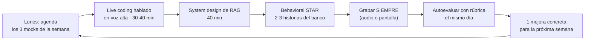

import Nivel from "@components/Nivel.astro";
import Reto from "@components/Reto.astro";
import Solucion from "@components/Solucion.astro";
import Quiz from "@components/Quiz.astro";
import CheckDominio from "@components/CheckDominio.astro";

<Nivel nivel="intermedio" />

La entrevista técnica no es un examen que apruebas con suerte: es una **habilidad
entrenable**, y como toda habilidad, se entrena con repetición deliberada, no con
buenas intenciones. Esta lección te da el sistema para entrenarla _antes_ de que
la necesites de verdad. No esperas a sentirte listo. Practicas en cadencia, te
grabas, te corriges con rúbrica, y llegas a la entrevista real habiendo hecho ya
veinte ensayos.

## Objetivos de esta lección

Al terminar deberías ser capaz de:

- **O1 — Diseñar e implementar** una **cadencia semanal** de mock interviews
  (live coding hablado, system design y behavioral) desde el mes 2, con
  grabación y autoevaluación por rúbrica — no "cuando me sienta preparado".
- **O2 — Demostrar** el _thinking out loud_ en un live coding y la estructura de
  un system design de RAG en 40 min, y **diagnosticar** tu propio desempeño con
  una rúbrica.
- **O3 — Construir** un banco de **8-10 historias STAR** reutilizables a partir
  de tu experiencia, mapeadas a las preguntas behavioral más frecuentes, y
  contarlas en inglés.

## Por qué esto importa (y por qué AHORA)

Aquí está el dato incómodo de 2026: entre julio de 2025 y enero de 2026, **el
38,5% de los candidatos técnicos mostró señales de uso de IA para hacer trampa**
en entrevistas; en roles puramente técnicos sube al **48%**. La consecuencia
directa es que las empresas dejaron de confiar en el _resultado_ que escribes y
empezaron a verificar tu _proceso de pensamiento_. La técnica que adoptaron es
brutalmente simple: **te preguntan "¿por qué?" una y otra vez**, fuerzan rondas
de clarificación que un asistente de IA no puede preparar, y analizan tu cadencia
al hablar (alguien que _lee_ una respuesta soplada por IA suena distinto a alguien
que _piensa_ en voz alta).

Traducción para ti: el _gate_ real de 2026 ya no es "llegar a la respuesta
correcta". Es **poder pensar en voz alta, defender tus trade-offs bajo
interrogación, y comunicar en inglés mientras lo haces**. Y eso es exactamente lo
que la IA no puede hacer por ti — pero que casi nadie practica.

:::note[La diferencia que te contrata]
El 90% de los candidatos practica resolviendo problemas _en silencio_. El mercado
2026 evalúa lo contrario: si puedes **narrar tu razonamiento** y sostenerlo cuando
te aprietan. Practicar en voz alta, grabado y en cadencia, es la ventaja menos
saturada que existe ahora mismo.
:::

## Lo que ya traes (activación)

Esta sub-unidad se apoya en dos anteriores del track. Recupéralas de memoria
**sin volver a abrirlas**:

- De [**T0.1 · Inglés técnico como GATE**](/track-0-empleabilidad/t0-1-ingles-tecnico/):
  ¿por qué el inglés es un _gate binario_ y no un "+35%"? (Pista: define a qué
  mercado puedes postular.) Las mocks de esta lección se hacen **en inglés** por
  esa razón.
- De [**T0.2 · Empleabilidad como track-0**](/track-0-empleabilidad/t0-2-empleabilidad-track0/):
  postular a roles "stretch" desde el **mes 2** para calibrar. Las entrevistas
  reales que eso genera son tu mejor mock — pero no puedes depender del azar de
  que te llamen. La práctica en cadencia es lo que te prepara para que, cuando
  te llamen, no quemes la oportunidad.

Si no te salieron con fluidez, ese tirón mental es _active recall_ — el mismo
motor de [0.1 · Mentalidad y método](/fase-0-fundamentos/0-1-mentalidad-y-metodo/).
La cadencia semanal de mocks **es** spaced practice aplicada a entrevistar.

## Worked example: cómo un experto convierte experiencia cruda en una historia STAR

Antes de pedirte que lo hagas, te muestro el razonamiento completo, en voz alta.
Empecemos por lo behavioral, porque es donde más gente improvisa y peor le va.

**STAR** es una estructura de cuatro partes para responder preguntas de
comportamiento ("cuéntame de una vez que...") sin irte por las ramas:

- **S**ituation — el contexto, en 1-2 frases. Dónde, cuándo, qué estaba en juego.
- **T**ask — _tu_ responsabilidad concreta en esa situación.
- **A**ction — qué hiciste **tú** (no "el equipo"), paso a paso. Es el 60% de la respuesta.
- **R**esult — el desenlace, **con un número** siempre que puedas.

Veamos la transformación. Materia prima cruda (como la recordarías tú):

> _"Una vez un proceso de automatización en n8n se caía y nadie sabía por qué,
> lo arreglé."_

Eso, en una entrevista, es un cero. No hay contexto, no hay tu rol, no hay
impacto. Pienso en voz alta cómo lo levanto a STAR, **en inglés** (porque así se
contará):

> _Razono:_ ¿cuál era el riesgo real? El workflow procesaba enrolamientos y se
> caía sin alerta → datos perdidos en silencio. Eso es la **Situation** y le da
> peso. ¿Cuál era _mi_ tarea? Diagnosticar y dejarlo confiable, no solo "que
> deje de caerse". Esa es la **Task**. La **Action** tiene que mostrar *cómo
> pienso*: reproduje el fallo, leí los logs, encontré que un reintento sin
> idempotencia duplicaba registros... → eso demuestra criterio de ingeniería.
> Y el **Result** necesita un número: ¿cuánto bajó la tasa de fallo? ¿cuántas
> horas/semana se ahorraron?

Resultado pulido (la historia reutilizable):

> **S** — "At my job, an n8n workflow that enrolled new clients was failing
> silently a few times a week. No alert fired, so we'd find out days later, with
> duplicated records already in the downstream system."
> **T** — "I owned making it reliable, not just patching the crash."
> **A** — "First I reproduced the failure instead of guessing. I read the
> execution logs and found a retry step that wasn't idempotent, so every retry
> re-inserted the record. I added an idempotency key on the external call, a
> dead-letter path for the cases that still failed, and a Slack alert on failure."
> **R** — "Failures dropped from about three a week to zero in the next two
> months, and we stopped losing roughly four hours a week reconciling
> duplicates by hand."

¿Ves lo que pasó? La misma experiencia, contada con estructura, **demuestra**
idempotencia, observabilidad y manejo de errores (los hilos transversales del
curso) sin que yo dijera "soy bueno en eso". Lo mostré con una historia.

Y lo mejor: esta **misma** historia responde a cinco preguntas distintas —
"cuéntame de un bug difícil", "de una vez que mejoraste un proceso", "de cuando
tomaste ownership", "de un fallo en producción", "de cuando trabajaste con datos
poco confiables". Por eso construyes un **banco de 8-10**: cada historia cubre
varias preguntas, y entras a la entrevista sin improvisar nada.

### El otro músculo: pensar en voz alta en live coding

El live coding hablado se siente raro al principio (estás solo, narrando como
loco). Aquí va un micro-ejemplo de cómo suena un experto resolviendo "encuentra
el primer carácter que no se repite en un string", **narrando**:

> "Ok, antes de escribir nada — clarifico. ¿El string puede venir vacío? ¿Hay
> mayúsculas y minúsculas, cuentan como distintas? Voy a asumir que sí y que
> vacío devuelve `None`; lo confirmo contigo. — Mi primera idea es contar
> frecuencias: recorro una vez y cuento cada carácter en un diccionario. Luego
> recorro de nuevo y devuelvo el primero con frecuencia 1. Eso es O(n) en
> tiempo, O(k) en espacio donde k es el alfabeto. — Podría hacerlo con dos
> bucles anidados sin diccionario, pero eso sería O(n²); prefiero el cambio de
> espacio por tiempo. — Voy a escribirlo... y mientras escribo te voy diciendo
> qué hace cada línea."

Nadie te pidió la respuesta más rápida del mundo. Te pidieron que **clarifiques,
propongas, compares un trade-off y narres**. Eso es lo que el anti-cheat no puede
falsear y lo que te separa del 48%.



## El system design de un RAG en 40 min (el formato que más te van a pedir)

Como AI/Automation Engineer, tu pregunta de system design estrella será del tipo
"diseña un asistente que responda preguntas sobre los documentos internos de una
empresa" — un **RAG**. No se trata de dibujar todo lo que sabes. Se trata de
seguir un guion bajo presión de tiempo. Estructura de 40 min que demuestra
seniority:

| Min | Fase | Qué demuestras |
|---|---|---|
| 0-7 | **Clarificar requisitos** | Que no codeas a ciegas: ¿cuántos docs? ¿cuántas queries/día? ¿latencia tolerable? ¿presupuesto de costo? ¿qué tan grave es una alucinación? |
| 7-12 | **Estimar escala y restricciones** | Volumen de datos, queries por segundo, presupuesto de tokens/costo por query |
| 12-28 | **Diseño del happy path** | ingest → chunking → embeddings → vector DB → retrieval (+ reranking) → generación con citas → streaming |
| 28-35 | **Trade-offs y fallos** | hybrid search vs solo vector, cuándo rerankear, qué hacer cuando el retrieval no trae nada, evals como gate |
| 35-40 | **Costo, latencia, observabilidad** | caching semántico, ruteo de modelos, trazas del call-chain, USD por query |

El error mortal aquí es saltar directo a dibujar cajas. Los primeros 7 minutos
**clarificando** son los que más puntúan: muestran que entiendes que el diseño
correcto _depende_ de los requisitos.

## Lo que parece cierto pero no lo es

:::caution[Misconception 1 — "Practico entrevistas cuando me sienta listo"]
Nunca te vas a sentir listo: esa sensación llega _después_ de muchas reps, no
antes. La práctica va por **cadencia** (un día y hora fijos cada semana, desde el
mes 2), igual que el gimnasio. "Cuando me sienta listo" es la versión adulta de
no practicar nunca. El primer mock va a ser malo y vergonzoso — ese es justo el
punto de hacerlo solo, grabado, y no en la entrevista real.
:::

:::caution[Misconception 2 — "Live coding se trata de llegar a la respuesta óptima"]
Falso, y es el error que más descalifica. Se evalúa tu **proceso**: clarificar el
problema, proponer un enfoque, comparar al menos un trade-off, y **narrarlo**. Un
candidato que llega a una solución O(n²) explicando con claridad por qué y cómo la
mejoraría, supera a uno que escribe la solución óptima en silencio y no sabe
defenderla cuando le preguntan "¿por qué?".
:::

:::caution[Misconception 3 — "STAR es contar toda la historia con detalle"]
Falso. STAR es **estructura y brevedad**. La trampa típica es gastar el 80% del
tiempo en la _Situation_ (el contexto) y quedarte sin tiempo para la _Action_ y el
_Result_, que es lo único que importa. Regla: contexto en 1-2 frases, el 60% en lo
que **tú** hiciste, y siempre cierra con un **número**. "Cuéntame de un bug" no
pide una novela; pide ver cómo piensas y qué impacto tuviste.
:::

:::caution[Misconception 4 — "El system design es dibujar la arquitectura completa"]
Falso. Si empiezas a dibujar cajas en el minuto 1, ya perdiste. Los primeros
minutos son para **clarificar requisitos y estimar escala**. Un diseño sin
requisitos claros es adivinar. Demuestra más seniority preguntar "¿cuántas
queries por día y qué latencia es aceptable?" que dibujar el pipeline de RAG más
elegante del mundo para un problema que no entendiste.
:::

:::caution[Misconception 5 — "Grabarme es incómodo y no aporta"]
Es incómodo, sí — y por eso funciona. La grabación es tu **espejo**: vas a
descubrir que dices "eh..." cada cinco segundos, que no clarificas, que te quedas
en silencio 30 segundos pensando sin narrar. Nada de eso lo notas en el momento.
Sin grabación, repites los mismos errores entrevista tras entrevista sin saber
cuáles son. Es la misma lógica que la **observabilidad**: no puedes mejorar lo que
no mides.
:::

## Práctica con andamiaje (se desvanece)

Vamos de lo guiado a lo independiente. Esto es **nuevo** para ti, así que
empezamos con andamiaje alto.

### Parte 1 — Parsons: ordena el system design de RAG (andamiaje alto)

Estas seis fases de una entrevista de system design de RAG en 40 min están
**desordenadas**. Sin mirar la tabla de arriba, escribe el orden correcto (solo
las letras):

```text
(a) Diseñar el happy path: ingest → chunk → embed → store → retrieve → generate.
(b) Clarificar requisitos: volumen, latencia, costo, gravedad de alucinaciones.
(c) Discutir costo, latencia y observabilidad (caching, trazas, USD/query).
(d) Estimar escala: docs, queries/día, presupuesto de tokens.
(e) Discutir trade-offs y modos de fallo (hybrid search, reranking, evals).
```

<Solucion title="Ver el orden correcto (ábrelo solo después de intentarlo)">
El orden es **(b) → (d) → (a) → (e) → (c)**. Primero clarificas requisitos,
luego estimas escala, recién entonces dibujas el happy path, después discutes
trade-offs y fallos, y cierras con costo/latencia/observabilidad. Si empezaste
por (a) — dibujar la arquitectura — caíste justo en la Misconception 4. El
diseño se _deriva_ de los requisitos, no al revés.
</Solucion>

### Parte 2 — Faded: completa una historia STAR (andamiaje medio)

Aquí tienes una historia behavioral a medio escribir. Te doy **S** y **T**;
completa tú **A** y **R** (puedes inventar un caso plausible de tu experiencia
real). Recuerda: la _Action_ es el 60% y muestra _cómo piensas_; el _Result_
lleva número.

```text
S — "A frontend feature I shipped was loading slowly for users on mobile;
     some pages took over 6 seconds to become interactive."
T — "I was asked to find out why and bring it under 2 seconds."
A — [completa: ¿cómo lo diagnosticaste? ¿qué mediste primero? ¿qué cambiaste
     y por qué ESE cambio?]
R — [completa: el desenlace, CON un número medible]
```

<Solucion title="Pista (NO la solución): qué debe contener tu A y tu R">
La _Action_ debe mostrar **método, no suerte**: empezar por _medir_ (abrir las
dev tools, mirar el waterfall de red, identificar qué bloquea el render) antes
de "optimizar" a ciegas — exactamente el reflejo de _medir antes de tocar_ que
verás en observabilidad. Una buena _Action_ nombra la causa concreta (p. ej. un
bundle gigante sin code-splitting, o imágenes sin comprimir) y por qué tu cambio
la ataca. El _Result_ debe cerrar el loop con el número del objetivo: "interactive
time bajó de 6 s a 1,8 s, medido en mobile con throttling". Si tu R no tiene
número, no es un Result, es una opinión.
</Solucion>

### Parte 3 — Mapea preguntas a tu banco (andamiaje que se va)

Una sola historia STAR responde varias preguntas. Para estas cinco preguntas
behavioral frecuentes, decide **qué tipo de historia** de tu vida usarías para
cada una (no la escribas aún, solo el título):

1. "Tell me about a time you disagreed with a teammate."
2. "Tell me about a production failure and how you handled it."
3. "Tell me about a time you had to learn something fast."
4. "Tell me about a project you're proud of."
5. "Tell me about a time you took ownership of something outside your role."

(El ejercicio entregable de abajo convierte esto en tu banco real. Esta parte es
solo el calentamiento: nota cuántas preguntas puede cubrir **una** buena historia.)

## Ejercicio Primero-Sin-IA

<Reto title="Monta tu cadencia + arranca tu banco STAR + autoevalúa un mock" timebox="45 min">

Vas a producir la infraestructura de tu práctica de entrevistas. **Primero a
mano, sin IA** (timebox 45 min para los artefactos escritos; la grabación va
aparte). Tres entregables en una carpeta:

**1. `cadencia-entrevistas.md`** — tu plan de práctica como si fuera una _spec_:
   - Día y hora **fijos** cada semana (desde el mes 2) para los 3 formatos:
     live coding hablado (30-40 min), system design (40 min), behavioral (20 min).
   - Las **herramientas** que usarás para cada uno (editor + timer para solo;
     plataforma de peers; cómo vas a **grabar** — audio o pantalla).
   - Tu regla explícita: **siempre en inglés**, **siempre grabado**, **siempre
     autoevaluado el mismo día con la rúbrica**.

**2. `banco-star.md`** — **3 historias STAR** completas (semilla de las 8-10),
   escritas **en inglés**, cada una con las 4 partes etiquetadas (S/T/A/R), la
   _Action_ ocupando el grueso y el _Result_ **con un número**. Debajo de cada
   una, lista las **preguntas behavioral** que esa historia puede responder
   (apunta a ≥3 por historia).

**3. `autoevaluacion-mock.md`** — graba **un** mock de cualquiera de los 3
   formatos (mínimo 15 min, en inglés, en voz alta y solo) y autoevalúate
   **escuchándote**, usando la rúbrica del ejercicio. Anota: 2 cosas que hiciste
   bien y **1 mejora concreta** para la próxima semana.

**Criterios de "hecho":**
- [ ] La cadencia tiene día/hora **concretos** (no "cuando pueda") y cubre los 3 formatos.
- [ ] Las 3 historias STAR están en inglés, con las 4 partes, _Action_ dominante y _Result_ con número real o realista.
- [ ] Cada historia mapea a **≥3 preguntas** behavioral distintas.
- [ ] Grabaste y **te escuchaste**: la autoevaluación nombra 1 mejora concreta (no "hablar mejor", sino algo accionable como "clarificar antes de codear").
- [ ] (Hilo transversal) Tus historias **demuestran** al menos un hábito de ingeniería —testing, idempotencia, observabilidad, seguridad— sin que tengas que decir "soy bueno en eso".

Cuando termines, pídele a tu IA que lo corrija con el framework de `.ai/` (la
carpeta del ejercicio es `ejercicios/track-0/practica-entrevista/`). La IA **no**
ensaya por ti: evalúa tus artefactos y tu autoevaluación.

</Reto>

<Solucion title="Pista (NO la solución): si te trabas armando el banco STAR">
No inventes historias épicas. Las mejores salen de cosas pequeñas y reales: un
bug que perseguiste, un proceso lento que aceleraste, una vez que tuviste que
aprender algo bajo presión, una decisión técnica que defendiste. Haz una lista de
6-8 momentos de tu experiencia (laboral, proyectos personales, el HomeBase de
[T0.4](/track-0-empleabilidad/t0-4-historia-falla-produccion/)) y para cada uno
pregúntate: _¿cuál fue el número?_ Si no recuerdas el impacto, esa historia es
débil — elige otra o reconstrúyela hasta que tenga un Result medible. El truco no
es tener historias espectaculares; es tenerlas **estructuradas y listas** para no
improvisar.
</Solucion>

## Check de dominio

<CheckDominio
  title="Marca solo lo que puedes EXPLICAR sin notas"
  items={[
    "Decir por qué la práctica va por cadencia y no 'cuando me sienta listo'.",
    "Explicar qué se evalúa REALMENTE en un live coding 2026 (proceso, no respuesta óptima).",
    "Recitar las 4 partes de STAR y qué proporción debe ocupar cada una.",
    "Listar las 5 fases de un system design de RAG en 40 min, en orden.",
    "Explicar por qué grabarse es a la práctica lo que la observabilidad es al software.",
  ]}
/>

Y dos preguntas rápidas de recuperación:

<Quiz
  question="En un live coding de 2026, ¿qué es lo que MÁS evalúa el entrevistador?"
  options={[
    "Que llegues a la solución más eficiente lo más rápido posible.",
    "Tu proceso: clarificar, proponer un enfoque, comparar trade-offs y narrarlo en voz alta.",
    "Que escribas código sin errores de sintaxis al primer intento.",
  ]}
  answer={1}
  explanation="Tras el crackdown anti-cheat, las empresas verifican el proceso de pensamiento, no el output. Narrar tu razonamiento y defender trade-offs es justo lo que la IA no puede falsear."
/>

<Quiz
  question="Estás en un system design de RAG de 40 min. ¿Qué haces en los primeros 7 minutos?"
  options={[
    "Dibujar el pipeline completo: ingest, chunking, embeddings, vector DB, generación.",
    "Clarificar requisitos: volumen de docs, queries/día, latencia tolerable, costo, gravedad de alucinaciones.",
    "Empezar a escribir el código del retriever para ganar tiempo.",
  ]}
  answer={1}
  explanation="El diseño se deriva de los requisitos. Clarificar primero demuestra más seniority que dibujar la arquitectura más elegante para un problema que no entendiste."
/>

:::tip[Si ya hiciste entrevistas o mocks antes]
Quizá ya pasaste por algún proceso técnico o practicaste con un amigo. **Valida y
salta:** ¿tu práctica actual cumple las tres condiciones que separan ensayar de
mejorar — (1) **cadencia fija** (no esporádica), (2) **grabación** que después
revisas, y (3) **rúbrica** para autoevaluarte objetivamente? Si las tres están,
usa el ejercicio para auditar tu sistema y cerrar el hueco (la mayoría no se
graba). Si falta alguna —casi siempre la grabación o la rúbrica—, esta lección te
dice cuál y por qué.
:::

## Recursos

Documentación y fuentes primero; nada de "10 trucos para la entrevista".

- **Behavioral / STAR:** la guía oficial de preparación de entrevistas de
  [Amazon Jobs](https://www.amazon.jobs/content/en/how-we-hire/interviewing-at-amazon)
  (el método STAR aplicado a sus Leadership Principles es el estándar de facto del mercado tech).
- **System design:** [ByteByteGo](https://bytebytego.com/) y el libro
  _System Design Interview_ (Alex Xu) para el formato; tu propio system design de
  RAG se apoya en la Fase 6 (RAG) y la Fase 8 (arquitectura) del curso.
- **Mock interviews con personas reales:**
  [Pramp / Exponent](https://www.tryexponent.com/practice) (peers; capa gratuita
  limitada por créditos en 2026) e [interviewing.io](https://interviewing.io/)
  (ingenieros reales, de pago). Honesto: las opciones 100% gratis se
  estrecharon; para empezar gratis, **un peer del curso + grabarte tú mismo**
  cubre el 80%.
- **Grabar:** QuickTime (macOS) u [OBS Studio](https://obsproject.com/) (gratis,
  multiplataforma) para pantalla + audio.
- **Pizarra de system design:** [Excalidraw](https://excalidraw.com/) (gratis).
- **Inglés técnico:** vuelve a [T0.1](/track-0-empleabilidad/t0-1-ingles-tecnico/);
  las mocks son tu práctica de _hablar bajo presión_ en inglés.

> Mantén una lista viva de los links que uses en `articulos.md` dentro de la
> carpeta de esta sub-unidad. Prefiere la fuente oficial.

## Conexión con el proyecto de la fase

El "capstone" del Track-0 es tu **portafolio que consigue entrevistas**
([T0.5](/track-0-empleabilidad/t0-5-portafolio-diferenciado/)). Esta lección es
el otro lado de esa moneda: de nada sirve un portafolio brillante si te congelas
al explicarlo. Tus mejores historias STAR salen de **tus propios capstones** — el
RAG de la Fase 6, la automatización agéntica de la Fase 7, y especialmente la
**historia de falla en producción** de
[T0.4](/track-0-empleabilidad/t0-4-historia-falla-produccion/), que es la
narrativa de semi-senior que casi nadie tiene. El system design de RAG que
ensayas aquí es, literalmente, explicar la arquitectura del proyecto que vas a
construir. Practicar la entrevista y construir el portafolio se alimentan
mutuamente: cada capstone terminado es 2-3 historias STAR nuevas para tu banco.

## Reflexión y repaso espaciado

Antes de cerrar, responde en tu cuaderno o en `cadencia-entrevistas.md`:

- ¿Cuál de las cinco misconceptions te describía mejor _a ti_ ahora mismo?
- Cuando te escuchaste en la grabación, ¿qué te sorprendió? (Casi siempre hay algo.)

**Gancho de spaced repetition** — agenda estos repasos (son parte del método, no extra):

- **Mañana (+1 día):** sin mirar la lección, escribe las 5 fases del system
  design de RAG en orden y las 4 partes de STAR. ¿Te salieron?
- **En 3 días:** graba un segundo mock (otro formato) y compáralo con el primero.
  ¿La mejora concreta que te propusiste se nota?
- **Cada semana (la cadencia):** 3 mocks, grabados, autoevaluados. Esta no es una
  tarea que terminas — es un ritual que corre hasta que firmes contrato.

Siguiente parada:
[**T0.4 · Historia de falla en producción**](/track-0-empleabilidad/t0-4-historia-falla-produccion/),
donde construirás la historia STAR más potente de tu banco: romper algo real,
arreglarlo y escribir el post-mortem público.
