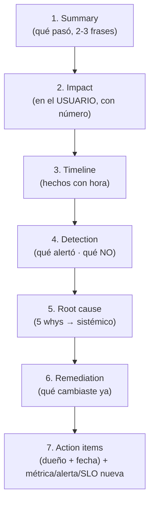

import Nivel from "@components/Nivel.astro";
import Reto from "@components/Reto.astro";
import Solucion from "@components/Solucion.astro";
import Quiz from "@components/Quiz.astro";
import CheckDominio from "@components/CheckDominio.astro";

<Nivel nivel="intermedio" />

Casi cualquier persona que estudia sola puede mostrar un proyecto que _corre en su
máquina_. Lo que casi nadie tiene es un proyecto que **alguien más usó de verdad**,
que **se rompió en producción**, y un documento honesto que explica **por qué se
rompió y qué cambiaste para que no vuelva a pasar**. Ese documento —el
_post-mortem_— es la pieza de portafolio más difícil de falsificar y la que más
grita "esta persona ya estuvo en producción". Esta lección te enseña a fabricar
esa pieza desde cero: qué instrumentar, cómo dejar que el fallo te encuentre, y
cómo escribir el post-mortem que te separa del 90% que solo tiene un homelab.

## Objetivos de esta lección

Al terminar deberías ser capaz de:

- **O1 — Instrumentar** una app con usuarios reales (logs estructurados +
  al menos una alerta) de modo que un fallo se **detecte por una señal**, no por
  la queja de un usuario.
- **O2 — Escribir** un post-mortem público y **blameless** de un incidente real:
  timeline, impacto en el usuario, detección, causa raíz con **5 whys**,
  remediación y _action items_ con dueño y fecha.
- **O3 — Derivar** del incidente una **métrica, alerta o SLO** concreta que cierre
  el loop (que el mismo fallo se detecte solo la próxima vez) y convertir el
  post-mortem en una historia STAR para tu banco.

## Por qué esto importa (y por qué te contrata)

Un _hiring manager_ con experiencia huele un proyecto de juguete en treinta
segundos. "RAG sobre mis PDFs" y "to-do app en React" están en el 80% de los
portafolios y no prueban nada sobre cómo te comportas **cuando algo se cae con
gente real esperando del otro lado**. Eso —operar bajo fallo— es justo lo que
distingue a un junior de un semi-senior, y es exactamente lo que un homelab sin
usuarios no puede demostrar.

El post-mortem público invierte la lógica del portafolio. En vez de presumir lo
que construiste, muestras que **mediste, fallaste, diagnosticaste sin culpar a
nadie y cerraste el hueco**. Es contraintuitivo, pero contar un fallo bien contado
genera más confianza que diez features que "nunca fallan" (mentira: todo lo que
está en producción falla; la pregunta es si lo notas y qué haces). En el mercado
2026, donde las empresas verifican tu _proceso_ y no tu _output_, un post-mortem
real es evidencia escrita de que tu proceso de ingeniería ya es de producción.

:::note[La narrativa de semi-senior que casi nadie tiene]
El 90% de quien aprende solo nunca pone su código frente a un usuario real. Tú sí
puedes: instrumenta tu app, dásela a usar a 3 personas reales (tu pareja, un
amigo, un familiar), y cuando algo se rompa —se va a romper— tendrás la única
historia que el _solo-homelab_ no puede contar. No necesitas mil usuarios.
Necesitas **tres reales** y un fallo **honesto**.
:::

## Lo que ya traes (activación)

Esta sub-unidad se apoya en dos piezas que ya viste. Recupéralas **de memoria,
sin volver a abrirlas**:

- De [**T0.3 · Práctica de entrevista con cadencia**](/track-0-empleabilidad/t0-3-practica-entrevista/):
  la historia STAR de ejemplo era, literalmente, un **fallo en producción** (un
  workflow de n8n que se caía en silencio y duplicaba registros). ¿Por qué esa
  historia funcionaba tan bien en una entrevista? Pista: demostraba idempotencia,
  observabilidad y manejo de errores sin que el candidato dijera "soy bueno en
  eso". Tu post-mortem de hoy es la **materia prima** de una historia así.
- De la **Fase 5 (Observabilidad)**: los tres pilares —logs, métricas y
  **trazas**— y la idea de _correlation IDs_. Sin instrumentación no hay detección;
  sin detección, el único que te avisa del fallo es el usuario enojado. Si aún no
  llegaste a la Fase 5, tranquilo: esta lección te da el mínimo de instrumentación
  que necesitas para tener una historia, y la Fase 5 lo formaliza.

Si recuperar eso te costó, ese tirón mental **es** _active recall_, y es deseable:
recordar con esfuerzo fija mejor que releer.

## Worked example: cómo escribo un post-mortem, pensando en voz alta

Antes de pedirte que escribas el tuyo, te muestro el razonamiento completo sobre un
incidente real y pequeño —del tipo que tendrás tú— y voy narrando **cada decisión**.

**El contexto.** Tengo una app, _HomeBase_, que un puñado de personas y yo usamos de verdad
todos los días: maneja la lista de compras compartida del supermercado. Dos
usuarios reales. La instrumenté con logs estructurados (cada request escribe una
línea JSON con un `request_id`) y una alerta básica: si la tasa de errores 5xx
pasa cierto umbral en 5 minutos, me llega un mensaje.

**El incidente.** Un sábado, una usuaria agrega tres productos a la lista desde su
teléfono. Más tarde, en el supermercado, la lista solo muestra uno: los otros dos
"desaparecieron". Vuelve sin comprar lo que faltaba. **Impacto humano real**, no
un gráfico rojo abstracto.

Ahora pienso en voz alta cómo lo convierto en post-mortem:

> _Razono:_ Lo primero NO es buscar al culpable (no hay becario, y "fui descuidado"
> no es una causa, es una excusa). Lo primero es el **timeline**: ¿cuándo agregó
> los productos, cuándo se perdieron, cuándo me enteré? Reviso los logs por su
> `request_id`. Y aquí aparece el primer hallazgo incómodo: **me enteré porque ella
> me dijo**, no por una alerta. Eso ya es un dato del post-mortem —la detección
> falló.

> _Razono la causa raíz con 5 whys, sin parar en el bug de la línea X:_
>
> 1. ¿Por qué se perdieron dos productos? → El POST que los guardaba devolvió 500.
> 2. ¿Por qué devolvió 500? → El contenedor se reinició a mitad del request porque
>    yo estaba haciendo un deploy en ese momento.
> 3. ¿Por qué un deploy tira requests en vuelo? → El deploy mata el contenedor sin
>    drenar las conexiones abiertas (no hay _graceful shutdown_).
> 4. ¿Por qué nadie lo notó hasta horas después? → No había alerta sobre errores de
>    escritura; la única alerta era de 5xx agregados y un pico de un request no la
>    disparó.
> 5. ¿Por qué la app perdió el dato en silencio en vez de avisar al usuario? → El
>    frontend no mostró el error: hizo "optimistic update" (pintó los productos como
>    guardados) y nunca confirmó contra el servidor.

> _Razono:_ Fíjate cómo el "bug" (un 500 puntual) era el **trigger**, pero la
> **causa raíz** es sistémica: deploy sin _graceful shutdown_ + frontend que miente
> sobre el estado + cero alertas sobre el camino crítico. Ninguna de esas tres es
> "una persona se equivocó". Eso es **blameless**: el sistema dejó que un humano
> (yo, desplegando) causara un daño que un buen sistema habría absorbido.

**El post-mortem que escribo** (estructura pública, en inglés porque va al
portafolio):

```markdown
# Post-mortem: Silent data loss in HomeBase shopping list — 2026-06-13

**Status:** resolved · **Author:** @tu-usuario · **Severity:** low (2 users, no PII)

## Summary
A deploy mid-request crashed an in-flight write. Two shopping-list items were
lost silently. A user found out at the supermarket, not from an
alert. No data was recoverable.

## Impact
- 2 real users affected; 1 directly (lost items, incomplete grocery run).
- Trust impact: the shared list became "unreliable" for ~2 days until fixed.
- Duration: ~6 hours from data loss to detection (by user report, not by alert).

## Timeline (UTC-4)
- 14:02 — User adds 3 items from mobile.
- 14:02 — Deploy starts; container is killed mid-request. POST returns 500.
- 14:02 — Frontend optimistic update keeps items "visible" but they were never saved.
- ~20:10 — User reports 2 items missing. Detection begins.
- 20:35 — Root cause found in logs (request_id correlates the 500 to the deploy).
- 21:10 — Hotfix: deploy now drains in-flight requests before stopping.

## Detection
What alerted: nothing. What SHOULD have: an alert on write-path 5xx and on the
"optimistic update not confirmed" client error. Detection by user = a gap.

## Root cause (5 whys)
[la cadena de arriba, resumida]

## Remediation
- Enabled graceful shutdown (drain in-flight requests on deploy).
- Frontend now reconciles optimistic updates against the server and surfaces
  a visible error on failure.

## Action items
| # | Action | Owner | Due | Status |
|---|--------|-------|-----|--------|
| 1 | Add alert on write-path 5xx rate | @tu-usuario | 2026-06-15 | done |
| 2 | Add a regression test that reproduces the lost write | @tu-usuario | 2026-06-16 | done |
| 3 | Define an SLO: 99.5% of writes succeed | @tu-usuario | 2026-06-20 | done |

## What we changed so it can't recur silently
SLO: 99.5% successful writes over 30 days, with an alert at the error-budget
burn. The same failure would now page me in minutes, not be reported hours later
by a frustrated user.
```

¿Ves lo que pasó? El documento es honesto, no culpa a nadie, y cierra con una
**alerta y un SLO nuevos** —el loop cerrado. Ese cierre es lo que lo vuelve creíble:
no dice "ya lo arreglé", dice "y ahora el sistema lo detecta solo".

## Anatomía de un post-mortem (las 7 secciones)



La regla de oro: cada sección responde una pregunta distinta y **ninguna nombra a
una persona como causa**. La causa siempre es algo del sistema que se puede
cambiar (un test que faltaba, una alerta que no existía, un deploy sin red de
seguridad).

## Lo que parece cierto pero no lo es

:::caution[Misconception 1 — "Un post-mortem sirve para encontrar al culpable"]
Falso, y es el error que arruina toda la cultura de incidentes. Un post-mortem
**blameless** parte de un supuesto: las personas no fallan por descuido, **los
sistemas permiten que el error humano cause daño**. Si tu causa raíz es "yo fui
descuidado" o "el dev no testeó", paraste demasiado pronto: pregunta _por qué_ el
sistema permitió que ese descuido llegara a producción sin que nada lo frenara.
Culpar a una persona garantiza que la próxima persona esconda el error en vez de
reportarlo. La meta es **aprender**, no castigar.
:::

:::caution[Misconception 2 — "Necesito un incidente grave y muchos usuarios"]
Falso. Tres usuarios reales (tu pareja, un amigo, un familiar usando tu app) y un
fallo pequeño y honesto valen **infinitamente más** que un incidente inventado con
"100k usuarios imaginarios". El valor está en que sea **real**: que alguien de
verdad se vio afectado y que tú lo viviste. Un reclutador detecta un incidente de
juguete al instante (no hay impacto humano, los números son redondos y falsos, no
hay rastro de logs). No fabriques un incidente. Instrumenta, consigue 3 usuarios, y
espera —algo se va a romper solo.
:::

:::caution[Misconception 3 — "Detección = el usuario me avisó"]
Que el usuario te avise **es una falla de detección**, no detección. Una parte
explícita del post-mortem es la sección _Detection_: ¿qué alerta saltó? Si la
respuesta es "ninguna, me enteré por la queja", eso es justo el hueco más valioso
del incidente. La buena detección es **tu instrumentación avisándote antes (o en
vez) del usuario**. Por eso el cierre del post-mortem siempre agrega la alerta/SLO
que faltaba: para que la _próxima_ vez la señal venga del sistema.
:::

:::caution[Misconception 4 — "La causa raíz es el bug de la línea X"]
El bug de código es el **trigger**, no la causa raíz. La causa raíz es **por qué
ese bug llegó a producción y se quedó sin que nada lo detectara**: faltó un test,
faltó una alerta, faltó un review, el deploy no tenía red de seguridad. Por eso los
_5 whys_: cada "por qué" te aleja del síntoma puntual y te acerca a lo sistémico.
Un post-mortem cuya causa raíz es "había un typo" no enseñó nada; uno cuya causa
raíz es "ningún test cubría el camino de escritura bajo reinicio" produce un
_action item_ que previene una familia entera de fallos.
:::

:::caution[Misconception 5 — "El post-mortem termina cuando arreglé el bug"]
Remediar (arreglar lo roto) **no es** prevenir (que no vuelva a pasar). Un
post-mortem sin _action items_ con **dueño y fecha** es un diario, no un documento
de ingeniería. Y el cierre obligatorio es la **métrica, alerta o SLO nueva**: la
prueba de que cerraste el loop. "Ya lo arreglé" es donde la mayoría se detiene; "y
ahora el sistema lo detecta solo en minutos" es donde empieza el nivel semi-senior.
:::

## Práctica con andamiaje (se desvanece)

Esto es **nuevo**, así que empezamos guiados y vamos soltando.

### Parte 1 — Parsons: ordena las secciones de un post-mortem (andamiaje alto)

Estas siete secciones están **desordenadas**. Sin mirar el diagrama de arriba,
escribe el orden correcto (solo las letras):

```text
(a) Root cause: la cadena de 5 whys hasta la causa sistémica.
(b) Impact: a cuántos usuarios reales afectó y cómo, con número.
(c) Action items con dueño y fecha + la métrica/alerta/SLO nueva.
(d) Summary: qué pasó, en 2-3 frases.
(e) Detection: qué alertó y, sobre todo, qué NO alertó.
(f) Remediation: qué cambiaste para dejar de sangrar.
(g) Timeline: los hechos con hora.
```

<Solucion title="Ver el orden correcto (ábrelo solo después de intentarlo)">
El orden es **(d) → (b) → (g) → (e) → (a) → (f) → (c)**. Summary primero (para
quien solo lee la primera línea), luego Impact (humaniza), Timeline (los hechos),
Detection (el hueco), Root cause (5 whys), Remediation (qué cambiaste) y Action
items + la métrica nueva (el cierre del loop). Si pusiste _Remediation_ o _Action
items_ antes de _Root cause_, ojo: no puedes remediar bien lo que aún no entiendes.
El orden **es** el método.
</Solucion>

### Parte 2 — Faded: completa la cadena de 5 whys (andamiaje medio)

Aquí tienes un incidente con los dos primeros "por qué" resueltos. **Completa los
tres restantes** hasta llegar a una causa **sistémica** (no "alguien se
equivocó"). El incidente: _un usuario de tu app subió una foto de perfil y la app
quedó congelada 40 segundos; otros dos usuarios no pudieron entrar en ese rato._

```text
1. ¿Por qué se congeló la app? → El endpoint de subida procesó la imagen de forma
   síncrona y bloqueó el proceso.
2. ¿Por qué bloqueó a OTROS usuarios? → El servidor corría un solo worker, así que
   una request lenta congeló a todas.
3. ¿Por qué ___? → [completa]
4. ¿Por qué ___? → [completa]
5. ¿Por qué ___? → [completa: cierra en algo SISTÉMICO y accionable]
```

<Solucion title="Pista (NO la solución): hacia dónde deben apuntar tus 3 whys">
Tus "por qué" deben moverse del síntoma (la app se congeló) hacia el sistema que
lo permitió. Pistas de dirección, no respuestas: ¿por qué un trabajo pesado
(procesar una imagen) corre en el camino de la request en vez de en segundo plano
(una cola)? ¿Por qué un solo worker —hubo una decisión de configuración o nadie la
tomó? ¿Por qué nada **alertó** sobre latencia alta (no había métrica de p95 ni
SLO de latencia)? Una buena cadena cierra en algo como "no teníamos alerta de
latencia ni separación entre trabajo pesado y el request path" —eso produce
_action items_ reales (mover a cola, alerta de p95), no "el dev debió pensarlo".
</Solucion>

### Parte 3 — Detección: convierte "me avisó el usuario" en una alerta (andamiaje que se va)

Para cada fallo, escribe **qué señal lo habría detectado solo** (la alerta/métrica
que agregarías). No escribas la solución del bug; escribe la **detección**:

1. Un pago se cobró dos veces porque un reintento no era idempotente.
2. La app respondía, pero todas las búsquedas devolvían vacío (un índice se cayó).
3. El costo de tu feature de IA se disparó 20x en una noche por un loop de retries.

<Solucion title="Pista (NO la solución): piensa en la SEÑAL, no en el arreglo">
Para cada uno, la pregunta es "¿qué número, mirado a tiempo, habría gritado?".
Pistas: (1) una métrica de **pagos duplicados** o una alerta sobre reintentos sin
clave de idempotencia; (2) una alerta de **tasa de resultados vacíos** o un
health-check del índice (responder 200 no significa estar sano —eso se llama
_gray failure_); (3) un **techo de costo** con alerta de presupuesto y una métrica
de USD/hora del feature de IA. En los tres, la señal es del **sistema**, no del
usuario. Eso es observabilidad: medir lo que importa para que el fallo se detecte
solo.
</Solucion>

## Ejercicio Primero-Sin-IA

<Reto title="Instrumenta, deja que falle, y escribe el post-mortem público" timebox="45 min">

Vas a producir la pieza de portafolio que el solo-homelab no tiene. **Primero a
mano, sin IA** (timebox 45 min para lo escrito; la instrumentación y conseguir
usuarios reales viven en el tiempo real de tu proyecto, no en estos 45 min). Tres
entregables en la carpeta `ejercicios/track-0/historia-falla-produccion/`:

**1. `instrumentacion.md`** — la evidencia de que tu app está **observada**:
   - Qué app es y **quiénes son tus usuarios reales** (mínimo 3; tu pareja/amigo/familiar cuenta).
   - El formato de tu **log estructurado** (una línea JSON de ejemplo con `request_id`/timestamp/nivel).
   - La **alerta** que tienes activa (qué condición la dispara y por dónde te llega).
   - Honesto: si aún NO tienes la alerta o los usuarios, escribe el **plan concreto** para tenerlos esta semana (no inventes que ya los tienes).

**2. `postmortem.md`** — el post-mortem **público y blameless** de un incidente
   **REAL** (de tu app con usuarios, o un incidente real que viviste en un trabajo/proyecto donde una persona real se vio afectada — nunca inventado). Con las **7 secciones**: Summary, Impact (con número y usuario real), Timeline (con horas), Detection (qué alertó y **qué no**), Root cause (cadena de **5 whys** hasta lo sistémico), Remediation, y Action items con **dueño y fecha** + la **métrica/alerta/SLO nueva** que cierra el loop. Escríbelo **en inglés** (va al portafolio).

**3. `star-falla.md`** — el mismo incidente destilado en **una** historia STAR en
   inglés (formato de [T0.3](/track-0-empleabilidad/t0-3-practica-entrevista/)),
   lista para contar en una entrevista, con el _Result_ apuntando a la alerta/SLO
   que agregaste. Lista debajo **≥3 preguntas behavioral** que esta historia cubre.

**Criterios de "hecho":**
- [ ] `instrumentacion.md` nombra **usuarios reales** (o un plan creíble para tenerlos) y muestra un **log estructurado** + una **alerta** concreta.
- [ ] El post-mortem es de un incidente **real** (no de juguete) y tiene las **7 secciones** completas.
- [ ] La sección _Detection_ dice explícitamente **qué NO alertó** (el hueco).
- [ ] La causa raíz es **sistémica** vía 5 whys, **no** "una persona se equivocó" (cero nombres como causa).
- [ ] Hay **action items con dueño y fecha** y una **métrica/alerta/SLO nueva** que cerraría el loop.
- [ ] (Hilo transversal — testing) Al menos un _action item_ es un **test de regresión** que reproduce el fallo.
- [ ] La historia STAR está en inglés, con _Result_ medible, y mapea a ≥3 preguntas.

Cuando termines, pídele a tu IA que lo corrija con el framework de `.ai/` (la
carpeta del ejercicio es `ejercicios/track-0/historia-falla-produccion/`). La IA
**no** escribe tu post-mortem: evalúa si tu incidente es real, si tu causa raíz es
blameless y sistémica, y si cerraste el loop con una señal nueva.

</Reto>

<Solucion title="Pista (NO la solución): si no tienes un incidente todavía">
Dos caminos honestos, ninguno inventa nada. **(A)** Si ya tienes una app que
alguien usa, el primer paso de los 45 min es la **instrumentación** (un log JSON
por request + una alerta de tasa de errores); el incidente llegará solo en días o
semanas —es paciencia, no ficción— y entonces escribes el post-mortem. **(B)** Si
no tienes app con usuarios aún, usa un incidente **real de tu pasado**: un bug que
una persona real (un cliente, un compañero, un usuario de un proyecto previo)
sufrió de verdad. Reconstruye su timeline y aplícale los 5 whys y la sección de
detección. Eso es real, no de juguete. Lo prohibido es inventar usuarios y números
que nunca existieron. Si dudas entre "esto es real" y "esto suena bien", elige lo
real aunque sea más modesto: un fallo pequeño y verdadero gana siempre.
</Solucion>

## Check de dominio

<CheckDominio
  title="Marca solo lo que puedes EXPLICAR sin notas"
  items={[
    "Explicar qué significa 'blameless' y por qué culpar a una persona arruina la cultura de incidentes.",
    "Diferenciar el trigger (el bug puntual) de la causa raíz (lo sistémico) usando 5 whys.",
    "Decir por qué 'me avisó el usuario' es una FALLA de detección, no detección.",
    "Listar las 7 secciones de un post-mortem en orden.",
    "Explicar por qué el post-mortem debe cerrar con una métrica/alerta/SLO nueva y no con 'ya lo arreglé'.",
  ]}
/>

Y dos preguntas rápidas de recuperación:

<Quiz
  question="En la sección 'Root cause' de un post-mortem, ¿cuál es una causa raíz BLAMELESS y útil?"
  options={[
    "El desarrollador fue descuidado y no probó su código antes de desplegar.",
    "Ningún test cubría el camino de escritura durante un reinicio, y el deploy no drenaba requests en vuelo.",
    "El usuario hizo algo raro que nadie podía haber previsto.",
  ]}
  answer={1}
  explanation="La causa raíz blameless apunta a lo sistémico y accionable (un test que faltaba, un deploy sin red de seguridad), no a la culpa de una persona ni del usuario. Eso produce action items que previenen una familia entera de fallos."
/>

<Quiz
  question="Tu app respondió 200 OK todo el día, pero un índice caído hacía que todas las búsquedas devolvieran vacío. ¿Qué dice esto sobre tu detección?"
  options={[
    "Todo bien: si responde 200, el sistema está sano.",
    "Es un 'gray failure': responder 200 no es estar sano. Faltaba una alerta sobre la tasa de resultados vacíos o un health-check real del índice.",
    "No es un incidente porque la app no se cayó del todo.",
  ]}
  answer={1}
  explanation="Responder 200 no garantiza salud. Medir solo 'está arriba' deja pasar fallos grises. La detección útil mide lo que le importa al usuario (¿las búsquedas devuelven algo?), no solo si el proceso responde."
/>

:::tip[Si ya trabajaste en producción o escribiste post-mortems]
Quizá ya viviste incidentes reales o redactaste algún post-mortem interno en un
trabajo. **Valida y salta:** ¿tienes uno **público** y **blameless**? Casi todos
los post-mortems internos nombran personas ("X desplegó sin avisar") o nunca
salieron de un canal privado —ninguno de los dos te sirve en el portafolio. Toma
**uno** de tus incidentes reales, reescríbelo sin un solo nombre como causa, lleva
la causa raíz a lo sistémico con 5 whys, y publícalo (blog, repo, GitHub). Eso, más
la historia STAR derivada, es el entregable. La mayoría tiene el incidente pero
nunca lo convirtió en activo de carrera.
:::

## Recursos

Documentación oficial y fuentes primarias primero; nada de "10 tips de post-mortem".

- **El estándar de facto:** capítulo
  [_Postmortem Culture: Learning from Failure_](https://sre.google/sre-book/postmortem-culture/)
  del Google SRE Book (gratis, online). Define la cultura blameless y por qué
  funciona. Léelo entero —es corto.
- **Plantilla de referencia:** el
  [_Example Postmortem_](https://sre.google/sre-book/example-postmortem/) del mismo
  libro. Cópialo como molde de las 7 secciones.
- **SLOs y error budgets:** el capítulo de
  [_Service Level Objectives_](https://sre.google/sre-book/service-level-objectives/)
  del SRE Book y el [SRE Workbook](https://sre.google/workbook/implementing-slos/)
  (cómo definir un SLO real, no aspiracional).
- **Manejo de incidentes:** el
  [Atlassian Incident Management Handbook](https://www.atlassian.com/incident-management/handbook)
  (gratis; severidades, roles, comunicación).
- **Instrumentación / trazas:** la documentación oficial de
  [OpenTelemetry](https://opentelemetry.io/docs/) para logs/métricas/trazas con
  _correlation IDs_ — esto conecta directo con la Fase 5.
- **Origen del blameless post-mortem:** el ensayo
  [_Blameless PostMortems and a Just Culture_](https://www.etsy.com/codeascraft/blameless-postmortems/)
  de John Allspaw (Etsy) — la pieza fundacional de la práctica.

> Mantén una lista viva de los links que uses en `articulos.md` dentro de la
> carpeta de esta sub-unidad. Prefiere la fuente oficial.

## Conexión con el proyecto de la fase

Esta lección produce **tres activos** que alimentan el resto del track y los
capstones:

- **Portafolio ([T0.5](/track-0-empleabilidad/t0-5-portafolio-diferenciado/)):** el
  post-mortem público es una pieza fijada (_pinned_) que prueba madurez de
  producción —más rara y más creíble que otro "RAG sobre mis docs".
- **Entrevistas ([T0.3](/track-0-empleabilidad/t0-3-practica-entrevista/)):** el
  incidente es tu historia STAR más potente; "cuéntame de un fallo en producción"
  es de las preguntas behavioral más frecuentes, y tú la tendrás lista y real.
- **Capstones (Fase 5 y Fase 7):** el _Definition of Done_ del curso exige
  **observabilidad instrumentada** (logs + correlation IDs + trazas) y un
  **write-up público de qué falló**. Este ejercicio es, literalmente, ese
  write-up. La Fase 5 te pide desplegar con **≥3 usuarios reales e instrumentado**:
  esa es la semilla exacta de tu post-mortem. Y un fallo de tu **agente** de la
  Fase 7 (que ejecutó una acción equivocada en producción) es la historia más
  impactante de todas, porque casi nadie ha operado agentes con responsabilidad.

Escribir post-mortems no es un extra de empleabilidad: es el hábito de
**observabilidad** del curso, contado en prosa.

## Reflexión y repaso espaciado

Antes de cerrar, responde en tu cuaderno o en `instrumentacion.md`:

- ¿Cuál de las cinco misconceptions te describía mejor _a ti_? (La 3 —"detección =
  el usuario me avisó"— atrapa a casi todos.)
- Tu app actual: si algo se rompiera ahora mismo, ¿te enterarías por una **señal**
  o por una **queja**? Si es por la queja, ya sabes cuál es tu primer _action item_.

**Gancho de spaced repetition** — agenda estos repasos (son parte del método):

- **Mañana (+1 día):** sin mirar la lección, escribe las 7 secciones del
  post-mortem en orden y explica por qué "fui descuidado" no es una causa raíz.
- **En 3 días:** verifica que la **alerta** que definiste en tu post-mortem **de
  verdad se dispara** (provócala a propósito en un entorno de prueba). Una alerta
  que nunca probaste es una alerta que no existe.
- **Cada incidente futuro:** mantén un `incidentes.md` y escribe un post-mortem
  corto por cada fallo real. Tu banco STAR crece solo, y tu portafolio acumula la
  evidencia que el solo-homelab nunca tendrá.

Siguiente parada:
[**T0.5 · Portafolio diferenciado**](/track-0-empleabilidad/t0-5-portafolio-diferenciado/),
donde este post-mortem se convierte en una de las piezas fijadas que consiguen
entrevistas.
