import Nivel from "@components/Nivel.astro";
import Reto from "@components/Reto.astro";
import Solucion from "@components/Solucion.astro";
import Quiz from "@components/Quiz.astro";
import CheckDominio from "@components/CheckDominio.astro";

<Nivel nivel="básico" />

Un reclutador técnico abre tu GitHub y le da diez segundos. No lee tu código: escanea. Y lo que casi
siempre encuentra es el mismo portafolio que ya vio cincuenta veces esta semana — una app de tareas, un
clon de Twitter, y "un chatbot que responde sobre un PDF". Todos idénticos, todos copiados del mismo
tutorial de YouTube. **El 80% de los portafolios junior son intercambiables**, y un portafolio
intercambiable no diferencia: te mete en la pila del montón, justo donde no quieres estar. Esta lección
es sobre lo contrario: construir un portafolio que, en esos diez segundos, diga "esta persona construye y
sostiene software de verdad, no sigue tutoriales".

## Objetivos de esta lección

Al terminar deberías ser capaz de:

- **O1 — Curar** un portafolio: seleccionar **2-3 proyectos profundos** y justificar por qué baten a diez
  tutoriales clonados, identificando explícitamente el patrón del "80% idéntico" y por qué el capstone
  **agéntico** (automatización end-to-end con manejo de fallas e impacto) es la estrella por encima del
  RAG-sobre-docs genérico.
- **O2 — Articular** cada proyecto con sus **tres requisitos no negociables** —demo que CORRE (link vivo
  o video real, no screenshot), README en inglés y write-up de trade-offs— y **mapear** cada proyecto a
  una *skill* concreta que un hiring manager busca.
- **O3 — Traducir** descripciones de tarea ("hice X") a **lenguaje de impacto** ("X redujo Y"), de forma
  defendible y sin inflar números.

## Por qué esto importa (y paga)

El "💰" aquí es el mismo de todo el track-0: **el mejor stack del mundo no sirve si no sabes mostrarlo.**
El portafolio es la *prueba de seniority* — el único lugar donde un desconocido puede verificar que sabes
construir, no solo que tomaste un curso. Tres razones de mercado, sin adornos:

- **El portafolio es lo que separa "tomó un curso" de "construye software".** Cualquiera puede listar
  "Python, FastAPI, LangChain" en un CV. El portafolio es donde lo *demuestras* o se cae. Un hiring
  manager confía en lo que puede abrir y correr, no en una lista de tecnologías.
- **El RAG-sobre-PDF genérico se volvió ruido, no señal.** En 2023 montar un chatbot sobre un documento
  era impresionante. Hoy es el "hola mundo" de la IA: lo hizo todo el mundo, el reclutador lo vio mil
  veces, y no distingue tu trabajo del de nadie. Lo que **sí** diferencia es un sistema que recibe input
  real, lo procesa, **decide**, ejecuta acciones en sistemas externos y **maneja sus propias fallas**. Eso
  es ingeniería de verdad, y casi nadie lo tiene en su portafolio.
- **Profundidad le gana a volumen, siempre.** Diez repos a medias gritan "sigo tutoriales". Dos o tres
  proyectos profundos —con tests, observabilidad, decisiones documentadas y una demo que corre— gritan
  "puedo sostener esto en producción". El hiring manager no cuenta repos: busca evidencia de juicio.

> [!tip] GLaDOS dice
> Tengo miles de horas de grabación de sujetos resolviendo cámaras de prueba. ¿Sabes cuáles miro? No las
> de quien hizo cien cámaras fáciles. Las de quien resolvió **una** cámara imposible y dejó anotado cómo,
> qué intentó, qué falló y por qué la solución final era la correcta. Eso es lo que mira un reclutador:
> no la cantidad de puertas que cruzaste, sino la profundidad con la que cruzaste las que importan. Diez
> tutoriales clonados son ruido de fondo. Un capstone que corre, falla con elegancia y explica sus
> decisiones es una señal que se oye desde la otra punta del laboratorio.

:::tip[Si ya tienes proyectos en GitHub]
Valida y salta: ¿puedes nombrar cuáles **2-3** de tus repos destacarías y por qué baten al resto? ¿Cada
uno tiene los **tres** no-negociables (demo que corre + README en inglés + write-up de trade-offs)?
¿Sabes, para cada proyecto, qué *skill* concreta de una oferta real demuestra, y puedes describir su
impacto como "X redujo Y" en vez de "hice X"? Si las tres salen sin dudar, ve directo a los
[ejercicios](#ejercicios-primero-sin-ia). Si alguna te hace dudar —sobre todo el write-up de trade-offs,
que casi nadie tiene— la lección te la cierra.
:::

## Lo que ya traes (activación)

Recupera **de memoria**, sin abrir notas, dos ideas previas que esta lección reutiliza:

1. De [T0.2 · Empleabilidad como track-0](/track-0-empleabilidad/t0-2-empleabilidad-track0/): los **gaps**
   que detectas en el funnel de postulación (las *skills* que se repiten en las ofertas) te dicen qué
   proyecto destacar. El portafolio no se cura en el vacío: se cura **contra lo que el mercado pide**.
2. De [T0.1 · Inglés técnico como GATE](/track-0-empleabilidad/t0-1-ingles-tecnico/): el inglés es un
   *gate* binario. Un README en español le cierra la puerta al reclutador remoto-USD antes de que lea una
   línea de código. Por eso el README en inglés es uno de los tres no-negociables, no un extra.

## El reencuadre: cura, no acumules

Antes del worked example, fija el modelo mental. Hay dos formas de pensar un portafolio, y solo una te
diferencia:

| | Portafolio como **vitrina de cantidad** | Portafolio como **prueba curada** |
|---|---|---|
| Métrica | número de repos | profundidad de 2-3 proyectos |
| Mensaje que envía | "tomé muchos tutoriales" | "construyo y sostengo software" |
| Proyecto estrella | el último que hiciste | el **capstone agéntico** (F7) |
| Cada proyecto tiene | un README de plantilla | demo que corre + README EN + write-up |
| Cómo describe el trabajo | "hice X" (tarea) | "X redujo Y" (impacto) |
| Qué hace el reclutador | lo saltea (lo vio mil veces) | lo abre y lo corre |

**Curar es decir que no.** Un portafolio fuerte tiene *menos* proyectos visibles que uno débil, porque
los tutoriales clonados y los experimentos a medias **se esconden o se borran** —no porque no existieran,
sino porque diluyen la señal. Tres proyectos profundos con un cuarto repo de "100 días de código" al lado
valen *menos* que esos mismos tres solos: el ruido baja el promedio que el reclutador percibe en sus diez
segundos.

### Por qué el capstone agéntico es la estrella

No todos los proyectos pesan igual. Esta es la jerarquía que un hiring manager de IA percibe (de menos a
más diferenciador):

```mermaid
flowchart TD
    A["Clon de tutorial\n(todo app, clon de Twitter)"] --> B["RAG sobre un PDF\n(el 'hola mundo' de la IA, 2023)"]
    B --> C["App RAG de produccion\n(retrieval + reranking + eval + observabilidad)"]
    C --> D["Capstone AGENTICO end-to-end\n(input real -> procesa -> DECIDE -> ejecuta -> maneja fallas)"]
    style A fill:#3a1f1f,stroke:#a33
    style B fill:#3a2f1f,stroke:#a83
    style C fill:#1f3a2f,stroke:#3a8
    style D fill:#1f2f3a,stroke:#38a
```



El capstone agéntico (tu **Proyecto Fase 7 — Automatización end-to-end con IA**) está arriba porque
demuestra lo que el RAG genérico no puede: que tu sistema **toma decisiones y actúa en el mundo**, y —lo
más importante— que **sabes qué hacer cuando falla**. Un agente que clasifica un ticket y ejecuta una
acción tiene riesgos reales (una decisión equivocada cuesta), así que demostrar que lo manejaste
(validación de salida antes de ejecutar, *least-privilege* de las herramientas, *human-in-the-loop* para
acciones sensibles, techo de costo) es exactamente la madurez de ingeniería que separa a un semi-senior
de alguien que solo pegó llamadas a una API.

## Ejemplo resuelto: Sofía cura su portafolio (think-aloud)

Te voy a mostrar cómo razono la curaduría de un portafolio, paso a paso. **La protagonista:** Sofía, la
misma del [pipeline de postulación](/track-0-empleabilidad/t0-2-empleabilidad-track0/). Avanzó varios
meses en el curso. Su GitHub tiene **ocho repos**: una todo-app de un tutorial, un clon de página de clima,
un "100-days-of-code", un starter de Next.js que tocó dos días, un RAG-sobre-PDF copiado de YouTube, y
tres proyectos reales que construyó ella: el **capstone agéntico de F7** (automatiza tickets de soporte),
la **plataforma RAG de F6** y **HomeHub** (fullstack con tests y CI/CD). Su instinto le dice "muestra
todo, más es mejor". Vamos a corregir ese instinto, con método.

**Paso 1 — Separar señal de ruido.** Primero clasifico cada repo: ¿es *evidencia de que construye* o
*ruido de tutorial*? Los cinco primeros (todo-app, clima, 100-days, starter, RAG-de-YouTube) son ruido:
cualquiera los tiene, no demuestran juicio propio. Los tres reales son señal. Decisión inmediata: los
cinco de ruido **se archivan o se vuelven privados**. No se borran necesariamente (a veces hay código
reutilizable), pero **salen de la vitrina**. Esto solo ya sube la señal percibida.

**Paso 2 — Elegir la estrella.** De los tres reales, ¿cuál va primero, pin #1 del perfil? Pienso en voz
alta: el RAG de F6 es sólido (retrieval, reranking, eval con ragas, observabilidad) — pero "RAG" es lo que
el reclutador ve en cada portafolio. El HomeHub es fullstack completo, buena prueba de amplitud. Pero el
**capstone agéntico** es el único que demuestra el *otro pilar* del rol ("Automation Engineer") y, sobre
todo, manejo de fallas en un sistema que *actúa*. Ese es el más raro y el más difícil de fakear.
**Decisión: el agéntico es la estrella (pin #1)**, el RAG segundo, HomeHub tercero.

**Paso 3 — Mapear cada proyecto a una skill que se pide en las ofertas.** Aquí uso lo que aprendió en
T0.2: las *skills* que más se repetían en sus avisos stretch. No describo los proyectos por lo que *son*,
sino por la *skill* que prueban:

| Proyecto | Skill del hiring manager que demuestra |
|---|---|
| Capstone agéntico (F7) | orquestación de LLMs + manejo de fallas + integración de sistemas |
| Plataforma RAG (F6) | retrieval, evaluación (ragas) y observabilidad de IA |
| HomeHub (fullstack) | fullstack TS + CI/CD + estados completos (a11y) |

Si un proyecto no mapea a ninguna *skill* que el mercado pide, es candidato a salir de la vitrina aunque a
ella le guste.

**Paso 4 — Verificar los tres no-negociables, proyecto por proyecto.** Para cada uno de los tres que
quedan, pregunto sin piedad:

1. **¿La demo CORRE?** No vale un screenshot. O hay un link vivo (desplegado) o hay un **video real** de 60-90 s
   mostrándolo funcionando con datos de verdad. El agéntico de Sofía no está desplegado (cuesta plata
   mantenerlo arriba), así que graba un video: llega un ticket, el sistema lo clasifica, valida, y ejecuta
   la acción. Eso CORRE.
2. **¿El README está en inglés?** Los tres, sí (lo trabajó en T0.1). Un README en español le cierra la
   puerta al mercado remoto-USD.
3. **¿Hay write-up de trade-offs?** Este es el que casi nadie tiene. Para el agéntico, Sofía escribe dos
   decisiones reales (lo veremos abajo). Para el RAG y HomeHub, una cada uno.

**Paso 5 — Escribir el write-up de trade-offs de la estrella.** Esto es lo que convierte un repo en
evidencia de *juicio*. No es "cómo lo hice", es "**qué decidí, qué descarté y por qué**". Sofía escribe,
para el capstone agéntico:

> **Decisión 1 — Validación de salida + human-in-the-loop antes de ejecutar.** Elegí que el agente *no*
> ejecute la acción directamente: primero valida su propia clasificación contra un esquema y, para
> acciones sensibles (cerrar un ticket de cliente), pide confirmación humana. **Descarté** el agente
> totalmente autónomo. **Por qué:** una clasificación errónea que cierra el ticket de un cliente real
> cuesta mucho más que el segundo de latencia de la validación. *Least-privilege* y HITL no son
> burocracia: son lo que hace que un agente sea seguro de poner en producción.
>
> **Decisión 2 — Ruteo de modelos + caché semántico por costo.** El 80% de los tickets son comunes y los
> resuelve un modelo barato; solo los ambiguos escalan a un modelo caro. **Descarté** usar el modelo caro
> siempre. **Por qué:** bajó el costo por ticket de forma medible sin perder calidad en los casos fáciles.
> El costo/latencia es un requisito de producción, no un detalle.

Fíjate: cada decisión nombra **la alternativa que descartó** y **por qué**. Eso es lo que un reclutador no
puede sacar de un README de plantilla — es la huella de que pensaste como ingeniero.

**Paso 6 — Traducir todo a lenguaje de impacto.** Lo último: reescribir las descripciones de "tarea" a
"impacto". La fórmula es **acción + métrica + resultado**:

| ❌ "Hice X" (tarea) | ✅ "X redujo Y" (impacto) |
|---|---|
| "Construí un agente que clasifica tickets" | "Automaticé el triage de tickets de soporte, bajando el tiempo de clasificación de ~15 min a menos de 1 min por ticket (90% menos)" |
| "Usé un modelo barato y uno caro" | "Reduje el costo por ticket ~60% ruteando el 80% de los casos comunes a un modelo barato y reservando el caro para los ambiguos" |
| "Le puse evaluación al RAG" | "Subí la faithfulness del RAG de 0.71 a 0.89 iterando contra un eval harness versionado antes de optimizar" |

Una advertencia que Sofía respeta: **los números tienen que ser reales o claramente estimados.** Si no
mediste, di "estimado" o usa un rango honesto. Un reclutador técnico huele un número inflado a un
kilómetro, y un número falso descubierto en la entrevista te hunde más que no tener número.

El orden de las decisiones de Sofía no es casual: **separar ruido → elegir la estrella → mapear a skills →
verificar los tres no-negociables → write-up de trade-offs → lenguaje de impacto**. Primero limpias la
vitrina, luego ordenas por valor, y solo entonces inviertes el esfuerzo de articulación en lo que de
verdad se va a ver.

## Non-examples y misconceptions

:::caution[Podrías pensar... y por qué está mal]
**"Más proyectos = mejor portafolio. Subo todo lo que hice."**
Mal: el portafolio se mide por su *señal*, no por su volumen. Diez repos donde ocho son tutoriales
**bajan** la calidad percibida de los dos buenos, porque el reclutador promedia en sus diez segundos de
escaneo. Curar es esconder lo que diluye. Menos repos visibles, más fuertes, gana siempre.

**"Un RAG sobre mis PDFs es un gran proyecto de portafolio."**
Era cierto en 2023. Hoy es el "hola mundo" de la IA: el reclutador lo vio cien veces y no distingue el
tuyo. No está *mal* tenerlo, pero no puede ser tu estrella. Lo que diferencia es un sistema que **decide y
actúa** (el capstone agéntico) y que demuestra **manejo de fallas**. El RAG, si lo muestras, que sea uno
*de producción* (con eval, reranking y observabilidad), no el del tutorial.

**"Un screenshot bonito en el README alcanza para mostrar el proyecto."**
Mal: un screenshot prueba que dibujaste una pantalla, no que el sistema funciona. El no-negociable es una
demo que **CORRE**: un link vivo desplegado o un **video real** mostrándolo con datos de verdad. La
diferencia entre "se ve bien" y "funciona" es exactamente lo que el reclutador necesita verificar, y un
screenshot no lo hace.

**"El README en inglés es un extra; con español basta para mostrar el código."**
Mal: el README en inglés es un *gate*, no un adorno (ver [T0.1](/track-0-empleabilidad/t0-1-ingles-tecnico/)).
Un reclutador de un rol remoto-USD que abre tu repo y encuentra todo en español asume —con razón o sin
ella— que tu inglés no alcanza para el rol, y cierra la pestaña antes de leer una línea de código.

**"El write-up de trade-offs es relleno; el código habla por sí solo."**
Mal, y es el error que más cuesta. El código muestra *qué* construiste; el write-up muestra que **decidiste
con criterio**. Decir "elegí HITL en vez de un agente autónomo porque una clasificación errónea cuesta más
que la latencia de validar" es lo que un README de plantilla no puede falsear. El write-up es justo lo que
casi nadie tiene —por eso es tu mayor diferenciador, no tu relleno.

**"Lenguaje de impacto significa inventar números que suenen impresionantes."**
Mal y peligroso. Lenguaje de impacto es traducir tarea a resultado *medido o honestamente estimado*. Un
número inflado que no puedes defender en la entrevista te hunde más que no tener número. Si no mediste,
di "estimado", usa un rango, o describe el resultado cualitativamente —pero nunca mientas con una métrica.
:::

## Práctica con andamiaje (faded)

### Mini-reto A — Predice el resultado

Dos candidatos, mismo nivel real, postulan al mismo rol de "AI/Automation Engineer". **Caro** tiene en su
GitHub **doce repos**: nueve tutoriales clonados (todo-app, clima, clon de Twitter, etc.) y tres proyectos
reales mezclados sin orden, todos con README de plantilla en español y un screenshot cada uno. **Dani**
tiene **tres repos visibles** (archivó el resto): un capstone agéntico pinneado #1, un RAG de producción y
un fullstack; cada uno con video-demo que corre, README en inglés y write-up de trade-offs; el agéntico
descrito como "automaticé el triage, -90% en tiempo de clasificación".

**Predice (sin leer la pista):** en los diez segundos de escaneo del reclutador, ¿a quién llama y por qué?
Nombra al menos dos razones concretas por las que el portafolio de Dani gana, aunque Caro tenga *más*
proyectos.

<Solucion title="Ver pista (no la respuesta completa)">

Piensa en términos de **señal percibida en diez segundos**, no de esfuerzo total. El reclutador no cuenta
repos: escanea para encontrar evidencia de que la persona construye y sostiene software. Los nueve
tutoriales de Caro no son neutrales —**bajan** el promedio que el reclutador percibe (ruido que diluye sus
tres proyectos buenos). Dani, en cambio, eliminó el ruido: lo primero que el reclutador ve es un capstone
agéntico con una demo que corre y una métrica de impacto. Pregúntate: ¿qué puede *verificar* el reclutador
en cada perfil sin abrir el código? En Dani, que el sistema funciona (video), que el inglés alcanza
(README), y que hubo decisiones (write-up). En Caro, solo screenshots y plantillas. ¿Cuál de los dos
demuestra juicio, y cuál demuestra que siguió tutoriales?

</Solucion>

### Mini-reto B — Parsons: ordena la curaduría

Estos seis pasos son el flujo de curaduría del worked example, pero están **desordenados**. Reordénalos
mentalmente (o en papel) para que el proceso tenga sentido: primero limpias, al final articulas lo que de
verdad se verá.

```text
A)  Mapea cada proyecto sobreviviente a una skill concreta que piden las ofertas
B)  Escribe el write-up de trade-offs de la estrella (decisiones + alternativas descartadas)
C)  Separa señal (proyectos reales) de ruido (tutoriales) y archiva el ruido
D)  Traduce las descripciones de "hice X" a "X redujo Y" (lenguaje de impacto)
E)  Elige la estrella (pin #1): el capstone agentico por encima del RAG generico
F)  Verifica los tres no-negociables en cada proyecto (demo que corre, README EN, write-up)
```

Piensa: ¿tiene sentido escribir el write-up de trade-offs **antes** de haber elegido la estrella? ¿Puedes
"mapear a skills" un proyecto que aún no decidiste si va a la vitrina? ¿Por qué la traducción a impacto va
al **final** y no al principio? (El orden correcto lo valida el corrector; lo importante es que
**justifiques** por qué separar ruido va primero —si no limpias la vitrina, gastas esfuerzo de
articulación en proyectos que ni deberían estar visibles.)

## Ejercicios Primero-Sin-IA

> Trabaja **a mano primero**, sin IA, dentro del timebox. Cuando termines, pídele a tu IA que corrija con
> el framework de `.ai/` (que **revise** tu intento, no que lo resuelva por ti). Las carpetas viven en tu
> repo; ábrelas en tu editor.

<Reto title="Cura el portafolio: mata el 80% idéntico" timebox="35 min">

Te entregamos en `repos.md` el GitHub de un candidato ficticio con **nueve repos** mezclados (tutoriales
clonados y proyectos reales, sin orden). Tu trabajo —sin IA— es curarlo y dejar tu decisión en
`curaduria.md`:

1. **Clasifica** cada uno de los nueve repos como **señal** (evidencia de que construye) o **ruido**
   (tutorial clonado / experimento a medias), con una línea de justificación por cada uno.
2. **Selecciona los 2-3** que quedan en la vitrina y di explícitamente cuáles **archivas/escondes** y por
   qué (curar es decir que no).
3. **Elige la estrella** (pin #1) y **justifica** por qué ese proyecto bate a los otros como cabeza del
   portafolio. Si el capstone agéntico está entre los reales, defiende por qué va por encima del RAG
   genérico.
4. **Mapea** cada proyecto sobreviviente a **una *skill* concreta** que un hiring manager pediría en una
   oferta real (no "Python" en abstracto: "orquestación de LLMs con manejo de fallas", "retrieval +
   evaluación", etc.).
5. En 2-3 frases, **nombra el patrón del "80% idéntico"**: ¿qué tienen en común los repos que descartaste
   y por qué hacen invisible a un candidato?

Carpeta del ejercicio: `ejercicios/track-0/curaduria-portafolio/`

**Hecho significa:** los 9 repos clasificados con justificación; 2-3 elegidos y el resto archivado de forma
explícita; la estrella elegida y defendida (con el argumento agéntico-vs-RAG si aplica); cada sobreviviente
mapeado a una *skill* del mercado; y el patrón del "80% idéntico" nombrado en tus palabras. Bonus de
**Excelente**: detectas un repo "trampa" que *parece* señal pero es ruido (un RAG-sobre-PDF de tutorial
disfrazado de proyecto serio) y explicas por qué no diferencia.

</Reto>

<Reto title="Del 'hice X' al 'X redujo Y' + write-up de trade-offs" timebox="40 min">

Toma **un** proyecto: idealmente el más fuerte que ya tengas, o —si aún no construiste el capstone— el
brief del **capstone agéntico de F7** que te damos en `brief.md` (un sistema que recibe tickets, los
clasifica con IA, valida y ejecuta una acción). Sin IA, produce `articulacion.md` con tres partes:

1. **Write-up de trade-offs:** al menos **dos** decisiones de diseño reales. Cada una con el formato
   **decisión → alternativa que descartaste → por qué**. Al menos una debe tocar un hilo de producción
   (seguridad/HITL, costo-latencia, u observabilidad). Ejemplo del molde: "Elegí validar la salida antes
   de ejecutar (descarté el agente autónomo) porque una acción errónea cuesta más que la latencia de
   validar".
2. **Tres bullets de impacto:** reescribe tres descripciones de tarea ("hice X") a lenguaje de impacto
   ("X redujo/subió Y") con la fórmula **acción + métrica + resultado**. Marca cada número como *medido* o
   *estimado* —nada inventado.
3. **Checklist de los tres no-negociables:** para ese proyecto, declara el estado de cada uno: ¿la demo
   CORRE (link vivo o video real, no screenshot)? ¿el README está/estaría en inglés? ¿este write-up
   existe? Si alguno falta, escribe la acción concreta para cerrarlo.

Carpeta del ejercicio: `ejercicios/track-0/writeup-impacto-tradeoffs/`

**Hecho significa:** ≥2 decisiones con su alternativa descartada y un "por qué" defendible (≥1 tocando un
hilo de producción); 3 bullets de impacto con métrica marcada como medida o estimada (ninguna inflada); y
el checklist de los tres no-negociables con estado real y acción de cierre para lo que falte. Bonus de
**Excelente**: una de tus decisiones cita explícitamente un punto del Definition of Done de la fase
(p. ej. "least-privilege de tools + HITL para acciones sensibles") y lo justifica con el costo real de la
falla que previene.

</Reto>

## Check de dominio (active recall)

<CheckDominio items={[
  "Explicar, de memoria, por qué 2-3 proyectos profundos baten a 10 tutoriales clonados (en términos de senal percibida, no de esfuerzo)",
  "Justificar por que el capstone agentico es la estrella por encima del RAG-sobre-docs generico",
  "Nombrar los tres no-negociables de cada proyecto (demo que corre, README en ingles, write-up de trade-offs) y por que un screenshot no cuenta como demo",
  "Mapear un proyecto a una skill concreta que un hiring manager pide, en vez de describirlo por lo que es",
  "Escribir un trade-off como 'decision -> alternativa descartada -> por que', y explicar por que eso demuestra juicio",
  "Traducir 'hice X' a 'X redujo Y' con metricas honestas, y explicar por que un numero inflado es peor que no tener numero",
]} />

<Quiz
  question="Tienes en GitHub: un capstone agentico que clasifica y actua sobre tickets (con HITL y manejo de fallas), una app RAG sobre un PDF copiada de un tutorial, y 6 tutoriales mas (todo-app, clima, etc.). ¿Cuál es la jugada de curaduría correcta?"
  options={[
    "Subir los 8 repos: mientras mas proyectos vea el reclutador, mejor",
    "Pinear el RAG-sobre-PDF primero porque 'IA' es lo que mas se busca",
    "Archivar los tutoriales (incluido el RAG-de-tutorial), dejar el agentico como estrella pin #1 y articularlo con los tres no-negociables",
    "Borrar todo y empezar un portafolio nuevo desde cero",
  ]}
  answer={2}
  explanation="Curar es decir que no. Los tutoriales (incluido el RAG-sobre-PDF copiado, que es el 'hola mundo' de la IA y no diferencia) se archivan para no diluir la senal. El capstone agentico va de estrella porque demuestra lo que el RAG generico no puede: decidir, actuar y manejar fallas. Y se articula con demo que corre + README en ingles + write-up de trade-offs. Mas repos no es mejor: mas senal lo es."
/>

<Quiz
  question="Construiste un agente que rutea el 80% de los tickets a un modelo barato y el resto a uno caro, y mediste que el costo por ticket bajó ~60%. ¿Cuál de estas descripciones pertenece a un portafolio diferenciado?"
  options={[
    "'Usé dos modelos de lenguaje, uno barato y uno caro, en el proyecto'",
    "'Reduje el costo por ticket ~60% ruteando el 80% de los casos comunes a un modelo barato y reservando el caro para los ambiguos'",
    "'Implementé un sistema de ruteo de modelos super optimizado que ahorra muchisima plata'",
    "'El proyecto usa LLMs de forma eficiente'",
  ]}
  answer={1}
  explanation="Es lenguaje de impacto con la formula accion + metrica + resultado, y el numero es medido (no inflado). La opcion 1 describe la tarea ('use dos modelos') sin el resultado. La 3 infla sin metrica defendible ('muchisima plata'). La 4 es vaga. El reclutador tecnico necesita el resultado medido y defendible: 'X redujo Y', no 'hice X'."
/>

## Recursos

Documentación oficial y referencias para construir y mostrar el portafolio. Lo más autoritativo es **lo
que el mercado pide** (las ofertas reales) y la **documentación de las herramientas** que uses:

- [GitHub Docs — About READMEs](https://docs.github.com/en/repositories/managing-your-repositorys-settings-and-features/customizing-your-repository/about-readmes)
  — cómo estructurar un README que se lea en diez segundos (oficial).
- [GitHub Docs — Pinning items to your profile](https://docs.github.com/en/account-and-profile/setting-up-and-managing-your-github-profile/customizing-your-profile/pinning-items-to-your-profile)
  — cómo fijar tus 2-3 capstones arriba del perfil (conecta con [T0.6](/track-0-empleabilidad/t0-6-github-profesional/)).
- [Architectural Decision Records (adr.github.io)](https://adr.github.io/) — el formato estándar para
  documentar decisiones; tu write-up de trade-offs es, en el fondo, un ADR legible para el portafolio.
- [The Twelve-Factor App](https://12factor.net/) — qué hace que un proyecto se vea "de producción" y no de
  tutorial (config, logs, procesos); útil como checklist de madurez.
- [README maturity / Make a README (makeareadme.com)](https://www.makeareadme.com/) — referencia práctica
  de qué secciones espera ver un lector técnico (recuerda: en inglés).

## Conexión con el resto del track-0

El track-0 no tiene un capstone tradicional: **su capstone es conseguir el trabajo**, y el portafolio es la
*prueba* que el resto de las sub-unidades alimenta o consume.

- Los **proyectos** que cures aquí salen de los capstones de las fases técnicas: el **agéntico** de la
  Fase 7 (tu estrella) y la **plataforma RAG** de la Fase 6. Esta lección no te dice cómo *construirlos* —
  te dice cómo *mostrarlos* para que diferencien.
- Lo que cures aquí se **pinea y se pule** en [T0.6 · GitHub profesional](/track-0-empleabilidad/t0-6-github-profesional/):
  el perfil README, los repos limpios y los pins son la vitrina física de esta curaduría.
- Los **bullets de impacto** que escribes aquí ("X redujo Y") son exactamente la materia prima de tu
  [T0.7 · CV y posicionamiento](/track-0-empleabilidad/t0-7-cv-posicionamiento/): un CV de logros medibles
  es este lenguaje de impacto aplicado a tu experiencia.
- El **write-up de trade-offs** es lo que defiendes en vivo en [T0.3 · Práctica de entrevista](/track-0-empleabilidad/t0-3-practica-entrevista/):
  cuando te pregunten "¿por qué elegiste X?", tu write-up ya tiene la respuesta. Y conecta con
  [T0.4 · Historia de falla en producción](/track-0-empleabilidad/t0-4-historia-falla-produccion/): el
  manejo de fallas del capstone agéntico es justo la historia que un reclutador quiere oír.
- Por último, el **gate de inglés** de [T0.1](/track-0-empleabilidad/t0-1-ingles-tecnico/) se materializa
  aquí en el README en inglés, uno de los tres no-negociables.

## Reflexión + spaced repetition

Escribe 3-4 frases respondiendo: **mira tu GitHub ahora mismo (o el que tendrás). ¿Cuántos de tus repos
son señal y cuántos son ruido? ¿Cuál sería tu estrella, y tiene hoy los tres no-negociables —o cuál le
falta?** Nombrar el gap concreto (casi siempre: el write-up de trade-offs) es lo que convierte esta
lección en una acción de esta semana.

> [!tip] Gancho de spaced repetition
> - **Mañana:** reescribe de memoria, sin mirar, los **tres no-negociables** de cada proyecto y los **seis
>   pasos** de la curaduría de Sofía (separar ruido → elegir estrella → mapear a skills → verificar
>   no-negociables → write-up → impacto). Si no te salen, no los aprendiste todavía.
> - **En 3 días:** toma **un** bullet de "hice X" de cualquier proyecto tuyo y tradúcelo a "X redujo Y" en
>   voz alta, en inglés si puedes, con un número honesto. Si no tienes el número, marca "estimado".
> - **En 1 semana:** archiva (privado) **un** repo de tutorial de tu GitHub. Uno. Estrena la disciplina de
>   curar diciendo que no.
> - **En 2 semanas:** escribe el **write-up de trade-offs** de tu proyecto más fuerte (≥2 decisiones con su
>   alternativa descartada). Es el no-negociable que casi nadie tiene: tenerlo te diferencia solo.

> [!info] Contexto
> "El cake es una mentira, y también lo es 'mientras más proyectos, mejor'. He visto mil portafolios
> idénticos cruzar esta cámara: la misma todo-app, el mismo chatbot sobre un PDF, el mismo silencio del
> reclutador. Diferenciarte no es hacer *más*. Es hacer *menos*, más profundo, y tener la decencia de
> explicar por qué tomaste cada decisión. Cura, sujeto. Esconde el ruido. Deja que se vea la única cámara
> que de verdad resolviste bien."
