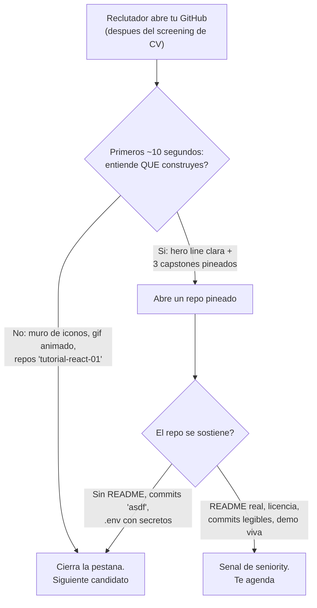

import Nivel from "@components/Nivel.astro";
import Reto from "@components/Reto.astro";
import Solucion from "@components/Solucion.astro";
import Quiz from "@components/Quiz.astro";
import CheckDominio from "@components/CheckDominio.astro";

<Nivel nivel="básico" />

Imagina que tu CV pasó el primer filtro y un reclutador técnico hace lo siguiente: copia el link de
tu GitHub y lo abre en una pestaña nueva. Tiene 30 segundos —probablemente menos— y otros 40 perfiles
en la cola. Lo que ve en esos segundos decide si sigue leyendo o cierra la pestaña. Tu GitHub **no es
un archivo de código**: es tu landing page, tu vitrina, lo que un reclutador abre **antes** que casi
cualquier otra cosa. Esta lección trata GitHub como exactamente eso —una página de marketing técnico
sobre ti— y te enseña a montarla desde cero bajo un handle de marca (por ejemplo, `acme`).

## Objetivos de esta lección

Al terminar deberías ser capaz de:

- **O1 — Diseñar** un perfil README que comunique en **menos de 10 segundos** quién eres, qué
  construyes y cómo contactarte, recortando sin piedad todo lo que tape esa señal.
- **O2 — Auditar y depurar** un repositorio de portafolio: detectar y corregir commits ruido
  ("wip"/"asdf"), secretos filtrados, README ausente y licencia faltante, dejando un historial con
  **Conventional Commits**.
- **O3 — Explicar el trade-off** entre green-squares honestos (contribución real) y el farmeo de
  commits vacíos, y argumentar por qué **una sola contribución OSS real** vale como señal social.

## Por qué esto importa (y paga)

El "💰" de este track lo viste en [T0.2](/track-0-empleabilidad/t0-2-empleabilidad-track0/): **el
mejor stack del mundo no sirve si no sabes mostrarlo.** GitHub es donde se materializa ese mostrar.
Tres razones de mercado, sin adornos:

- **Es lo que abren PRIMERO.** Para un rol de ingeniería, muchos reclutadores técnicos abren tu
  GitHub apenas tu CV pasa el screening —a veces antes de leer el CV completo. No es un anexo: es la
  prueba. Un CV dice "sé hacer X"; tu GitHub lo **demuestra** o lo **desmiente** en segundos.
- **La señal se evalúa en segundos, no en minutos.** Nadie clona tu repo y lee 2.000 líneas. Miran
  el perfil README, los repos pineados, si tienen README real, si los commits cuentan una historia o
  son "update / asdf / fix". La **densidad de señal** —cuánto comunicas por segundo de atención— es lo
  que se mide.
- **Un GitHub limpio es un diferenciador barato.** La mayoría de los juniors tiene un GitHub
  descuidado: 40 repos de tutoriales, sin pins, READMEs vacíos, un `.env` con una API key filtrada en
  el historial. Ordenar el tuyo cuesta un fin de semana y te separa del 80%. Es el retorno más alto por
  hora de toda tu búsqueda.

> [!tip] En la práctica
> Tener mucho material no significa mostrarlo todo. Los experimentos a medias, el "Hello World día 3",
> los tutoriales clonados... esos van
> tras una pared. Tu GitHub funciona igual: no es un diario de todo lo que tocaste, es la **selección
> curada** de lo que prueba que sabes construir. Mostrar todo es no mostrar nada —el ruido entierra la
> señal, y el reclutador no excava.

:::tip[Si ya tienes un GitHub con proyectos]
Valida y salta: ¿tu perfil README dice, en una línea, qué construyes y para qué rol apuntas (no
"apasionado por la tecnología")? ¿Tus pins son tus **mejores 3 capstones** o lo que GitHub pineó por
defecto? Si abres tu repo estrella, ¿tiene README real, licencia y commits legibles, o aparece un
`.env` con un secreto en el historial? Si las tres salen sin dudar, ve directo a los
[ejercicios](#ejercicios-primero-sin-ia). Si alguna te hace dudar, esta lección la cierra.
:::

## Lo que ya traes (activación)

Recupera **de memoria**, sin abrir notas, tres ideas previas que esta lección reúne:

1. De [0.6 · Git y GitHub a fondo](/fase-0-fundamentos/0-6-git-y-github/) (Fase 0): ya sabes `commit`, `branch`,
   `PR`, **Conventional Commits** y el `commit-msg` hook desde el commit #1. Aquí esos hábitos dejan de
   ser higiene privada y pasan a ser **señal pública** que un reclutador lee.
2. De [T0.5 · Portafolio diferenciado](/track-0-empleabilidad/t0-5-portafolio-diferenciado/): tienes
   (o vas a tener) capstones que **corren**, con README en inglés y un write-up de trade-offs. GitHub
   es el escaparate donde esos capstones se exhiben y se pinean.
3. De [T0.1 · Inglés técnico como GATE](/track-0-empleabilidad/t0-1-ingles-tecnico/): tus READMEs y
   ADRs van en inglés. El perfil README de tu vitrina también, si apuntas al mercado remoto-USD.

## El modelo mental: densidad de señal en una vitrina

Antes del ejemplo, fija el marco. Un reclutador que abre tu GitHub se mueve por un funnel —igual que
el de postulación de [T0.2](/track-0-empleabilidad/t0-2-empleabilidad-track0/)— y en cada paso decide
si avanza o cierra la pestaña:



La idea rectora: **maximizar señal por segundo de atención**. Todo lo que no ayude al reclutador a
entender *quién eres, qué construyes y cómo contactarte* es ruido, y el ruido no es neutro —**tapa** la
señal que sí importa. Curar tu GitHub es, sobre todo, un ejercicio de **borrar**.

## Ejemplo resuelto: reescribo el perfil de un junior anónimo (think-aloud)

Te voy a mostrar cómo razono el armado de un perfil README, paso a paso. **El caso:** `juanp-dev`,
cero real, recién armó su portafolio. Su perfil hoy es el de cualquiera. Vamos a convertirlo en una
vitrina.

**El antes (anti-vitrina):**

- Un GIF animado gigante de "Hi there 👋".
- Un muro de **35 badges** de tecnologías (incluidas tres que tocó una vez en un tutorial).
- Tres tarjetas de estadísticas: stats card, streak de rachas y un cuadro de trofeos.
- Pins por defecto: `tutorial-react`, `curso-python-dia3`, `test-repo`.
- Bio: *"Apasionado por la tecnología 🚀 | Siempre aprendiendo"*.

**Paso 1 — Pregunto qué tiene que entender el reclutador en 10 segundos.** La respuesta es siempre la
misma: *quién eres, qué construyes y cómo te contacta.* Todo lo demás compite por esos segundos y,
casi siempre, pierde. Con ese filtro, el GIF, los 35 badges y las tarjetas de trofeos ya están
condenados —no responden ninguna de las tres preguntas.

**Paso 2 — Reescribo la hero line.** *"Apasionado por la tecnología"* no dice nada: lo pone todo el
mundo, no es falsable, no menciona un nicho. Pienso en voz alta: ¿qué construye Juan, concretamente, y
para qué rol apunta? Reescribo:

> **AI / Automation Engineer.** Construyo automatizaciones agénticas que clasifican, deciden y
> ejecutan en sistemas reales — con evals, guardrails y manejo de fallas.

Eso sí responde "quién" y "qué", nombra el nicho (agéntico, el menos saturado) y usa **verbos
concretos** en vez de adjetivos vacíos.

**Paso 3 — "Qué construyo" = mis pins, no un muro de badges.** Borro los 35 íconos y dejo los 5-6
que de verdad uso a diario. Lo importante no son los logos: son los **3 capstones pineados**, cada uno
con una línea que vende y un link a la demo viva:

> - **agentic-invoice-pipeline** — recibe facturas, una IA las clasifica y extrae datos, decide y
>   registra en el ERP. Idempotente, con DLQ, eval gate del agente y techo de costo. ▶ demo · 📄 write-up
> - **rag-docs-platform** — RAG de producción con reranking, eval harness versionado y trazas en
>   Langfuse. ▶ demo
> - **homebase** — app fullstack con usuarios reales; incluye un post-mortem público de una
>   falla en producción. ▶ demo

**Paso 4 — Cómo contactarme.** Una línea: email + LinkedIn, en inglés si apunto a remoto-USD. Sin
formularios, sin "envíame un DM en cinco redes". Que el reclutador no tenga que buscar.

**Paso 5 — Recorto sin piedad (esto es lo que casi nadie hace).** Fuera el GIF, fuera las tarjetas de
stats/streak/trofeos. ¿Por qué? Porque **no son señal de ingeniería**: un "streak de 200 días" me dice
que hiciste algo cada día, no que sepas construir un sistema. Y peor: ocupan el espacio donde debería
estar lo que sí importa. Menos elementos, más señal por elemento.

**El después** queda más o menos así:

```markdown
# Juan Pérez — AI / Automation Engineer

Construyo automatizaciones agénticas que clasifican, deciden y ejecutan en sistemas
reales — con evals, guardrails y manejo de fallas.

## What I build
- **agentic-invoice-pipeline** — facturas → IA clasifica/extrae → decide → registra en ERP.
  Idempotente, DLQ, eval gate, techo de costo. [demo](…) · [write-up](…)
- **rag-docs-platform** — RAG de producción: reranking, eval harness versionado, trazas. [demo](…)
- **homebase** — fullstack con usuarios reales + post-mortem público de una falla. [demo](…)

## Stack
Python · TypeScript · FastAPI · PostgreSQL · Docker · LangGraph

## Reach me
[LinkedIn](…) · juan@example.com
```

Fíjate en el orden de mis decisiones: **definir qué importa en 10s → hero line → pins como prueba →
contacto → borrar el ruido.** El borrado va al final a propósito: primero decido qué es señal, y todo
lo que no cabe en esa definición se cae solo. Una vitrina no se llena, se **cura**.

## Non-examples y misconceptions

:::caution[Podrías pensar... y por qué está mal]
**"Más es mejor: lleno el perfil de badges, GIFs, stats cards y trofeos para que se vea activo."**
Mal: cada elemento extra **divide** la atención del reclutador, no la suma. Un muro de 35 tecnologías
no dice "sé mucho", dice "no sé priorizar" —y diluye los 5 skills que de verdad dominas. Las stats
cards y los streaks son *vanity metrics*: miden actividad, no capacidad de ingeniería. La vitrina de
un senior es **escasa y deliberada**, no un bazar.

**"Las green squares prueban dedicación; voy a farmear un commit diario (aunque sea vacío) para tener
el gráfico verde."** Mal, y es contraproducente. Un reclutador que ve un gráfico sospechosamente
parejo abre un repo y encuentra 300 commits "update" sin cambios reales —y eso te quema más que un
gráfico con huecos. Las green-squares **honestas** vienen de trabajo real: tus capstones, tus PRs, tus
contribuciones. Un gráfico con huecos pero con commits que cuentan una historia gana siempre. Además,
recuerda la mecánica real: un commit solo cuenta en tu gráfico si el **email del autor está conectado a
tu cuenta** y está en la **rama por defecto** (o `gh-pages`). Farmear es esfuerzo gastado en la métrica
equivocada.

**"Subí mi API key en un `.env`, pero la borro en el próximo commit y listo."** Mal, y es el error más
caro de esta lección. Git guarda **todo el historial**: el secreto sigue accesible en commits
anteriores aunque borres el archivo hoy. Cualquiera que clone el repo lo recupera con un comando.
La regla es: **una key commiteada es una key comprometida** → rótala YA (asume que ya la robaron),
añade `.env` al `.gitignore`, y si el repo es público limpia el historial (git filter-repo / BFG) o,
más simple, arranca un repo nuevo limpio. Un escáner de secretos (gitleaks/trufflehog) lo habría
atrapado antes de subirlo.

**"Un repo con código ya es portafolio; la licencia da igual."** Mal: **sin un archivo `LICENSE`,
tu repo es 'all rights reserved' por defecto** —legalmente, nadie puede usar, copiar ni adaptar tu
código, lo que contradice la idea de un portafolio abierto. Si quieres que tu trabajo sea OSS y
reutilizable, declara una licencia explícita (MIT es la opción simple y permisiva). La ausencia de
licencia también le dice al reclutador técnico que no conoces esta convención básica.

**"Pineo todos mis repos para que se vea que tengo muchos."** Mal: solo puedes pinear **hasta 6**, y
deberías usar menos. Pin tus **3 capstones estrella**, no tus 6 tutoriales seguidos. Un pin es un acto
de curaduría: dice "mira *esto*". Si pineas todo, no estás señalando nada.

**"Los commits 'wip', 'asdf', 'fix' no importan, es mi repo."** Mal en un repo de portafolio: el
historial es **parte de lo que se evalúa**. Commits legibles con Conventional Commits
(`feat:`, `fix:`, `refactor:`) son una señal directa de disciplina de ingeniería; "asdf x40" es la
señal opuesta. No se trata de perfección, se trata de que el historial **comunique**.
:::

## Práctica con andamiaje (faded)

### Mini-reto A — Predice cuál vitrina gana

Dos perfiles README, mismo candidato, mismo nivel real:

- **Perfil A:** GIF de "Hi there", 35 badges de tecnologías, tres stats cards (stats + streak +
  trofeos), bio "Apasionado por la tecnología 🚀". Sin repos pineados.
- **Perfil B:** una hero line ("AI/Automation Engineer. Construyo X."), 3 capstones pineados con una
  línea + demo cada uno, stack de 6 tecnologías, una línea de contacto.

**Predice (sin leer la pista):** un reclutador con 15 segundos, ¿con cuál entiende qué haces y por qué?
Nombra al menos **dos** elementos del Perfil A que, lejos de ayudar, **restan**.

<Solucion title="Ver pista (no la respuesta completa)">

Piensa en términos de **señal por segundo**, no de "esfuerzo invertido". El Perfil A invirtió más
trabajo (configurar stats, elegir 35 badges, montar el GIF), pero ¿cuál de esos elementos responde
"qué construye esta persona"? Ninguno. El muro de badges divide la atención y diluye los skills
reales; las stats cards miden actividad, no capacidad; el GIF ocupa el espacio más valioso (lo
primero que se ve) sin decir nada. El Perfil B usó ese mismo espacio para responder las tres preguntas
que importan. Pregúntate: si tapas todo menos los primeros tres renglones de cada perfil, ¿con cuál
sabes a qué rol apunta el candidato?

</Solucion>

### Mini-reto B — Parsons: ordena las secciones del perfil README

Estas son las secciones de un buen perfil README, pero están **desordenadas**. Reordénalas
mentalmente (o en papel) por **prioridad de lectura** —qué necesita ver el reclutador primero para
decidir en 10 segundos si sigue:

```text
A)  Stack principal (5-6 tecnologías que de verdad usas)
B)  Cómo contactarte (LinkedIn + email)
C)  Hero line: quién eres + qué construyes + el rol que apuntas
D)  "What I build": tus 3 capstones pineados, una línea + demo cada uno
E)  (Opcional) "Currently": en qué estás trabajando ahora
```

Piensa: ¿qué responde "qué construyes" más rápido, el stack o los capstones? ¿El contacto va arriba
(antes de convencer) o abajo (cuando ya quiere hablarte)? ¿Por qué la hero line **tiene** que ir
primera? (El orden correcto lo valida el corrector; lo importante es que **justifiques** por qué la
prueba —los capstones— pesa más que la lista de tecnologías sueltas.)

## Ejercicios Primero-Sin-IA

> Trabaja **a mano primero**, sin IA, dentro del timebox. Cuando termines, pídele a tu IA que corrija
> con el framework de `.ai/` (que **revise** tu intento, no que lo escriba por ti). Las carpetas viven
> en tu repo; ábrelas en tu editor.

<Reto title="Escribe tu perfil README que vende en 10 segundos" timebox="45 min">

Vas a escribir el perfil README real que irá en tu repo especial `<tu-usuario>/<tu-usuario>` (el repo
público con el mismo nombre que tu handle de GitHub, que muestra su `README.md` en tu perfil). Parte
del esqueleto `perfil.starter.md` y complétalo con **tu** información real:

1. **Hero line (1-2 líneas):** quién eres + qué construyes + el rol/nicho que apuntas. Prohibido
   "apasionado por la tecnología" y cualquier frase que sirva para cualquiera. Tiene que ser concreta y
   falsable.
2. **"What I build" — tus 3 mejores proyectos:** una línea que venda cada uno (qué hace + por qué es
   difícil) + un placeholder de link a demo y a write-up. Si aún no tienes 3 capstones, usa los
   proyectos reales que tengas y márcalos como "en progreso" —pero no inventes.
3. **Stack:** 5-6 tecnologías que **de verdad** usas. No un muro de 30.
4. **Cómo contactarte:** una línea, LinkedIn + email.
5. **Política de pins:** escribe (como comentario al final) **cuáles 3 repos pinearías y por qué cada
   uno** (máximo 6 pins disponibles; tú eliges 3 estrella).
6. **Justificación de recorte:** lista 3 cosas que **NO** pusiste a propósito (GIF, stats cards,
   badges de relleno…) y explica en una frase por qué cada una restaría señal.

Carpeta del ejercicio: `ejercicios/track-0/perfil-readme-vende-10s/`

**Hecho significa:** las 6 secciones presentes; la hero line es concreta y específica de un nicho (no
genérica); los 3 proyectos tienen cada uno una línea que comunica qué hace y su dificultad; el stack
no excede ~6 tecnologías reales; la política de pins justifica los 3 elegidos; y la sección de recorte
nombra al menos 3 elementos omitidos con su razón. Bonus de **Excelente**: el README está en **inglés**
correcto (conecta con el gate de [T0.1](/track-0-empleabilidad/t0-1-ingles-tecnico/)) y al menos un
proyecto menciona un hilo transversal real (evals, observabilidad, seguridad, manejo de fallas).

</Reto>

<Reto title="Audita y limpia un repo de portafolio" timebox="40 min">

Te entregamos `repo-a-auditar.md`: la "foto" de un repo de portafolio descuidado (su `git log`, su
árbol de archivos y algunos fragmentos). **Sin IA**, produce un `auditoria.md` que:

1. **Liste los problemas** que encuentres (apunta a **al menos 5**), clasificando cada uno por
   gravedad: 🔴 crítico (riesgo de seguridad/legal), 🟡 importante (daña la señal), ⚪ menor.
2. **Para cada problema, dé el fix concreto** —el comando o la acción, no una vaguedad. Para el secreto
   filtrado, el fix debe incluir el orden correcto de pasos (¿qué es lo PRIMERO que haces?).
3. **Reescriba 3 de los mensajes de commit** del log a **Conventional Commits** bien formados
   (`tipo(scope): descripción`), explicando en una frase qué tipo elegiste y por qué.
4. **Cierre con un veredicto:** en una frase, ¿este repo está listo para pinear en un perfil, o no, y
   qué falta como mínimo?

Carpeta del ejercicio: `ejercicios/track-0/auditoria-repo-limpio/`

**Hecho significa:** al menos 5 problemas detectados y clasificados por gravedad; **el secreto filtrado
está marcado como 🔴 crítico** y su fix empieza por **rotar la key** (no por "borrar el archivo");
la ausencia de `LICENSE` está identificada con su consecuencia legal (all rights reserved); 3 commits
reescritos como Conventional Commits válidos con su tipo justificado; y un veredicto claro. Bonus de
**Excelente**: mencionas que un escáner de secretos (gitleaks/trufflehog) en CI lo habría atrapado
antes (conecta con los gates de seguridad de la Fase 5).

</Reto>

## Check de dominio (active recall)

<CheckDominio items={[
  "Nombrar, de memoria, las tres cosas que un perfil README debe comunicar en menos de 10 segundos",
  "Explicar por qué un muro de 35 badges y las stats cards RESTAN señal en vez de sumarla",
  "Describir qué hace exactamente que un commit cuente en tu gráfico de contribuciones (email conectado + rama por defecto)",
  "Explicar el orden correcto de pasos al descubrir una API key commiteada, y por qué 'borrar el archivo' no basta",
  "Decir qué pasa legalmente con un repo sin archivo LICENSE y por qué eso importa para un portafolio",
  "Argumentar por qué una sola contribución OSS real vale más como señal social que 100 commits diarios a tu propio repo",
]} />

<Quiz
  question="Un reclutador abre tu GitHub. ¿Qué configuración comunica MÁS señal de ingeniería en los primeros 10 segundos?"
  options={[
    "Un GIF animado de bienvenida, 35 badges de tecnologías y tres tarjetas de stats/streak/trofeos",
    "Una hero line que dice qué construyes y a qué rol apuntas, más 3 capstones pineados con demo viva",
    "El gráfico de contribuciones completamente verde gracias a un commit diario durante 200 días",
    "Los 20 repos de tutoriales que seguiste, todos visibles para mostrar cuánto has practicado",
  ]}
  answer={1}
  explanation="La señal por segundo es lo que se mide. Una hero line concreta + 3 capstones pineados responde 'quién eres / qué construyes' al instante y la demo lo prueba. El muro de badges y las stats cards son vanity metrics que dividen la atención; el gráfico farmeado es deshonesto y detectable; 20 tutoriales son ruido que entierra tus mejores proyectos."
/>

<Quiz
  question="Descubres que subiste un commit con un archivo .env que contiene tu OPENAI_API_KEY. ¿Cuál es el PRIMER paso correcto?"
  options={[
    "Borrar el archivo .env en un nuevo commit; con eso el secreto deja de estar accesible",
    "Rotar (revocar y regenerar) la API key de inmediato, asumiendo que ya está comprometida",
    "Hacer el repo privado para que nadie vea el .env",
    "Añadir .env al .gitignore para que no se vuelva a subir, y seguir usando la misma key",
  ]}
  answer={1}
  explanation="Git conserva todo el historial: borrar el archivo hoy no quita el secreto de los commits anteriores, y hacer el repo privado no garantiza que nadie ya lo clonó. Una key commiteada es una key comprometida, así que lo PRIMERO es rotarla. Después: .env al .gitignore, usar .env.example, y limpiar el historial (filter-repo/BFG) o arrancar un repo nuevo. Un escáner de secretos lo habría atrapado antes de subirlo."
/>

## Recursos

Documentación **oficial** primero:

- [GitHub Docs — Managing your profile README](https://docs.github.com/en/account-and-profile/setting-up-and-managing-your-github-profile/customizing-your-profile/managing-your-profile-readme)
  — cómo se crea el repo especial `<usuario>/<usuario>` que renderiza tu perfil.
- [GitHub Docs — Pinning items to your profile](https://docs.github.com/en/account-and-profile/setting-up-and-managing-your-github-profile/customizing-your-profile/pinning-items-to-your-profile)
  — el mecanismo de pins (hasta 6) y cómo elegirlos.
- [GitHub Docs — Why are my contributions not showing up?](https://docs.github.com/en/account-and-profile/setting-up-and-managing-your-github-profile/managing-contribution-settings-on-your-profile/why-are-my-contributions-not-showing-up-on-my-profile)
  — qué hace que un commit cuente en tu gráfico (email conectado, rama por defecto, forks).
- [Conventional Commits 1.0.0](https://www.conventionalcommits.org/en/v1.0.0/) — la especificación
  exacta del formato `tipo(scope): descripción`.
- [Choose a License (choosealicense.com)](https://choosealicense.com/) — herramienta oficial de GitHub
  para elegir licencia; explica qué pasa sin `LICENSE`.
- [gitleaks](https://github.com/gitleaks/gitleaks) — escáner de secretos para detectar keys filtradas
  antes (y después) de commitearlas.
- [First Contributions](https://github.com/firstcontributions/first-contributions) y la búsqueda
  [good-first-issue (GitHub)](https://github.com/topics/good-first-issue) — para tu primera
  contribución OSS real (la señal social).

## Conexión con el resto del track-0

Este track no tiene un capstone tradicional: **su capstone es conseguir el trabajo**, y GitHub es el
escaparate donde se exhibe todo lo demás.

- Lo que pineas aquí **son** los proyectos de [T0.5 · Portafolio diferenciado](/track-0-empleabilidad/t0-5-portafolio-diferenciado/):
  el capstone agéntico (Fase 7) como estrella, no el RAG genérico que todos tienen.
- Tu [CV (T0.7)](/track-0-empleabilidad/t0-7-cv-posicionamiento/) **enlaza** a este GitHub; el header
  "AI / Automation Engineer" de tu CV y la hero line de tu perfil deben decir lo mismo. La coherencia
  entre ambos es parte de la señal.
- Cuando el [pipeline de postulación (T0.2)](/track-0-empleabilidad/t0-2-empleabilidad-track0/) avance
  al screening, este GitHub es lo que el reclutador abre. Un gap detectado ("mi repo estrella no tiene
  README") se arregla aquí.
- El README en inglés que escribes aquí materializa el gate de [T0.1](/track-0-empleabilidad/t0-1-ingles-tecnico/).

## Reflexión + spaced repetition

Escribe 3-4 frases respondiendo: **si un reclutador abriera tu GitHub ahora mismo y tuviera 15
segundos, ¿qué entendería de ti —y qué entendería mal o no entendería?** Nombrar el gap concreto entre
"lo que mi GitHub dice de mí" y "lo que quiero que diga" es lo que convierte esta lección en una lista
de tareas.

> [!tip] Gancho de spaced repetition
> - **Mañana:** reescribe de memoria, sin mirar, las **3 cosas** que un perfil README debe comunicar
>   en 10 segundos y el **orden de prioridad** de las secciones. Si no te sale, no lo aprendiste todavía.
> - **En 3 días:** abre tu repo de portafolio más reciente y córrele mentalmente la auditoría de 5
>   puntos (secreto, README, licencia, commits, pins). Arregla **uno**.
> - **En 1 semana:** crea (o reescribe) tu repo `<usuario>/<usuario>` con el perfil README del
>   ejercicio. Pinea tus 3 capstones. Que tu GitHub deje de ser un diario y sea una vitrina.
> - **En 2 semanas:** busca un `good-first-issue` real en un proyecto OSS que uses y abre **una** PR
>   honesta (corregir un typo de la doc cuenta). Esa green-square sí significa algo: es tu primera
>   señal social de que colaboras en código ajeno.

> [!info] Contexto
> Un gráfico de contribuciones farmeado no engaña a nadie. Nadie te contrata por 200
> commits 'update'. Te contratan porque abrieron tu vitrina, entendieron en diez segundos qué
> construyes, abrieron un repo y encontraron algo real, limpio y bien documentado. Curar tu GitHub no
> es vanidad: es la diferencia entre que el reclutador siga leyendo o cierre la pestaña. Borra
> el ruido. Deja la señal.
