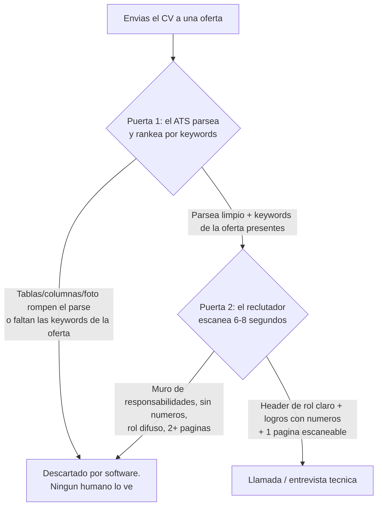

import Nivel from "@components/Nivel.astro";
import Reto from "@components/Reto.astro";
import Solucion from "@components/Solucion.astro";
import Quiz from "@components/Quiz.astro";
import CheckDominio from "@components/CheckDominio.astro";

<Nivel nivel="básico" />

Tu CV no es una autobiografía. No es la lista de todo lo que hiciste. Es un **anuncio**: un
documento de marketing de una sola página cuyo único trabajo es lograr que un humano ocupado —que le
dedica entre **6 y 8 segundos** en la primera pasada— decida agendarte una entrevista. Y antes de
llegar a ese humano, casi siempre pasa por una máquina (un ATS) que lo lee, lo trocea en campos y lo
puntúa contra la oferta. Esta lección te enseña, desde cero, a construir ese anuncio: a **posicionarte**
en un nicho, a escribir **logros medibles** en vez de responsabilidades, a no romperte contra el ATS,
y a que tu LinkedIn cuente la misma historia para un reclutador de remoto-USD.

## Objetivos de esta lección

Al terminar deberías ser capaz de:

- **O1 — Posicionarte** como **AI / Automation Engineer** en un nicho concreto (automatización
  agéntica) y no como "estudiante" o "fullstack junior genérico", eligiendo el título que define el
  *lane* al que apuntas y respaldándolo con evidencia.
- **O2 — Transformar** una responsabilidad ("encargado de X") en un **logro medible** con la fórmula
  **verbo de acción + impacto + número**, y explicar por qué un logro vende y una responsabilidad no.
- **O3 — Diseñar** un CV de **1 página, ATS-friendly** (sin foto, sin tablas ni columnas que rompen el
  parser) y **adaptar sus keywords** a una job description concreta sin mentir.

## Por qué esto importa (y paga)

El "💰" de este track ya lo nombramos en [T0.2](/track-0-empleabilidad/t0-2-empleabilidad-track0/):
**el mejor stack del mundo no sirve si no sabes mostrarlo.** El CV es el primer eslabón de ese mostrar
—el que decide si el resto de tu trabajo llega siquiera a ser visto. Tres razones de mercado, sin
adornos:

- **Es un filtro de doble puerta, y las dos son rápidas.** Primera puerta: el **ATS** (Applicant
  Tracking System), software que recibe cientos de CVs, los parsea a campos estructurados y los rankea
  por coincidencia con la oferta. Si tu CV no parsea bien o no tiene las keywords de la oferta, un humano
  quizá **nunca lo ve**. Segunda puerta: el reclutador, que escanea los que pasaron en **6 a 8 segundos**.
  Optimizar para ambas no es trampa: es respetar cómo funciona el canal.
- **El posicionamiento decide tu banda salarial antes de la entrevista.** Un CV que dice "Fullstack
  Junior" compite en el océano más rojo y peor pagado del mercado. Uno que dice "AI / Automation
  Engineer" con capstones agénticos reales compite en un **nicho escaso** —exactamente la tesis de este
  curso. El título que reclamas (honestamente, respaldado por evidencia) **define el lane** en el que te
  evalúan y el rango en el que te ofertan.
- **Los logros medibles son lo que casi nadie escribe.** El 80% de los CVs lista responsabilidades
  ("encargado de mantener APIs", "trabajé con Python"). Un logro con número ("reduje la latencia p95 de
  RAG de 4.2s a 900ms al añadir caching semántico") **prueba impacto** y es lo que un hiring manager
  recuerda. Aprender a escribirlos es de los retornos más altos por hora de toda tu búsqueda.

> [!tip] GLaDOS dice
> Yo documenté miles de pruebas. Pero a los visitantes nunca les dije "fui responsable de operar
> cámaras de prueba". Les dije "incrementé la eficiencia de testing un 940% reduciendo el consumo de
> sujetos por experimento". ¿Ves la diferencia? Una frase describe una **silla** que ocupé; la otra
> describe el **dato** que dejé. Tu CV está lleno de sillas que ocupaste. Bórralas. Deja los datos.

:::tip[Si ya tienes un CV y un LinkedIn]
Valida y salta: abre tu CV y cuenta cuántos bullets tienen un **número** de impacto (no "varios",
"múltiples": un número). Si son menos de la mitad, tienes trabajo. Tapa tu nombre y el header: ¿queda
claro a qué **rol** apuntas, o podría ser de cualquiera? Pega tu CV en un parser de texto plano (o
guárdalo como `.txt`): ¿sale ordenado y legible, o se mezclan las columnas y se pierden secciones? Si
las tres salen sin dudar, ve directo a los [ejercicios](#ejercicios-primero-sin-ia). Si alguna falla,
esta lección la cierra.
:::

## Lo que ya traes (activación)

Recupera **de memoria**, sin abrir notas, cuatro piezas previas que esta lección reúne en un solo
documento:

1. De [T0.5 · Portafolio diferenciado](/track-0-empleabilidad/t0-5-portafolio-diferenciado/): tus
   **capstones son la evidencia**. Cada número que pondrás en el CV (latencia, score de eval,
   USD/request, usuarios reales, cantidad de tests) **sale de ahí**. Sin proyectos instrumentados no
   hay logros medibles que escribir —por eso el portafolio viene antes que el CV.
2. De [T0.6 · GitHub profesional](/track-0-empleabilidad/t0-6-github-profesional/): la **hero line** de
   tu perfil README. El header de tu CV y esa hero line deben decir **lo mismo**: si tu GitHub dice "AI
   / Automation Engineer" y tu CV dice "Fullstack Junior", la incoherencia es ruido.
3. De [T0.1 · Inglés técnico como GATE](/track-0-empleabilidad/t0-1-ingles-tecnico/): para el mercado
   remoto-USD, el CV y el LinkedIn van **en inglés**. El gate no es "+35%", es binario.
4. De [T0.4 · Historia de falla en producción](/track-0-empleabilidad/t0-4-historia-falla-produccion/):
   tu proyecto con **usuarios reales** instrumentado te da números de verdad (uptime, incidentes
   resueltos, MTTR). Esos no se inventan: se miden. El CV solo cosecha lo que el proyecto sembró.

## El modelo mental: el CV como anuncio que pasa dos puertas

Antes del ejemplo, fija el marco. Tu CV recorre un funnel —igual que el de postulación de
[T0.2](/track-0-empleabilidad/t0-2-empleabilidad-track0/)— y en cada puerta puede caer:



La idea rectora: **densidad de señal por segundo**, igual que en tu GitHub. La diferencia es que aquí
hay una máquina **antes** del humano, y la máquina es literal: lee texto, no diseño. Un CV bonito que el
ATS no puede parsear es un CV invisible.

## Ejemplo resuelto: convierto un CV de "junior" en uno de AI/Automation Engineer (think-aloud)

Te voy a mostrar cómo razono, paso a paso, la conversión de un CV débil en uno fuerte. **El caso:**
`Camila`, perfil cero-real que ya hizo F0–F6 del curso y tiene dos capstones (un pipeline agéntico y un
RAG), más una app con usuarios reales. Su borrador de CV es el de cualquier junior. Vamos a arreglarlo.

**El antes (anti-anuncio):**

- **Header:** "Camila Rojas — Estudiante de programación / Aspirante a desarrolladora".
- **Resumen:** "Apasionada por la tecnología y siempre dispuesta a aprender. Busco una oportunidad para
  crecer profesionalmente."
- **Experiencia/Proyectos (bullets):**
  - "Responsable de crear un sistema de automatización con IA."
  - "Trabajé con Python, hice un chatbot."
  - "Encargada de una aplicación web con base de datos."
- **Formato:** dos columnas, una foto arriba a la izquierda, una **tabla** de skills con barritas de
  "nivel" (Python ▓▓▓▓░), dos páginas.

**Paso 1 — Arreglo el posicionamiento (el header define el lane).** "Estudiante / aspirante" la mete en
el cajón "no contratar todavía". Pero Camila *tiene* dos capstones agénticos: tiene derecho a reclamar
el título del lane al que apunta. Pienso en voz alta: ¿cuál es el nicho menos saturado que su evidencia
respalda? Automatización agéntica. Reescribo:

> **Camila Rojas — AI / Automation Engineer**
> Construyo automatizaciones agénticas que clasifican, deciden y ejecutan en sistemas reales, con
> evals, guardrails y manejo de fallas. Python · FastAPI · LangGraph · PostgreSQL.

Eso no es mentir: es **elegir el lane** donde su evidencia compite mejor. El título no dice "tengo 5
años de experiencia"; dice "este es el tipo de problema que resuelvo". (Es la misma hero line de su
GitHub en [T0.6](/track-0-empleabilidad/t0-6-github-profesional/) —coherencia.)

**Paso 2 — Convierto la primera responsabilidad en logro medible.** Tomo *"Responsable de crear un
sistema de automatización con IA"* y le aplico la fórmula **verbo de acción + impacto + número**, que en
forma larga es: **"Logré [X], medido por [Y], al hacer [Z]."** Me pregunto, en orden:

- *¿Qué hizo el sistema, medido en un número?* → procesa ~200 tickets/día, clasifica con 94% de acierto.
- *¿Qué mejoró respecto a antes?* → antes un humano triaba a mano; ahora el 80% se enruta solo.
- *¿Cómo lo hizo (la parte técnica que prueba seniority)?* → agente con validación de salida + HITL.

Lo ensamblo:

> **Construí** un agente de triaje de tickets que clasifica y enruta **~200 tickets/día con 94% de
> acierto**, **automatizando el 80% del triaje manual**, con validación de salida antes de ejecutar y
> human-in-the-loop para acciones sensibles.

Empieza con un **verbo fuerte** ("Construí", no "Responsable de"), tiene **dos números** (200/día, 94%,
80%) y nombra la **decisión técnica** que la separa de "llamé a una API". Eso es un logro.

**Paso 3 — De dónde salen los números cuando "no tengo experiencia laboral".** Aquí está el truco para
el cero real: Camila no tuvo un trabajo formal, pero su **capstone está instrumentado** (eso lo exigió
[T0.5](/track-0-empleabilidad/t0-5-portafolio-diferenciado/) y el Definition of Done del curso). Los
números **existen** porque los midió: latencia p95, score de eval, USD/request, usuarios reales,
cobertura de tests. Un proyecto de portafolio bien hecho **es** experiencia citable. Reescribo el RAG:

> **Desplegué** una plataforma RAG con reranking y eval harness versionado que alcanza **0.89 de
> faithfulness (ragas)** y responde en **p95 de 1.1s**, sirviendo a **8 usuarios reales** a **~USD
> 0.004/consulta** con caching semántico.

Ningún número inventado. Todos salen de la instrumentación que el capstone ya tenía.

**Paso 4 — Arreglo el formato para el ATS (lo que casi nadie sabe).** Quito la **foto** (en el mercado
remoto-USD no se usa, y muchos parsers la ignoran o se confunden), aplasto las **dos columnas en una
sola** (los ATS leen de izquierda a derecha; una columna lateral se intercala con la principal y sale
un puré), y elimino la **tabla de skills con barritas** (una "barra de nivel" no es texto: el parser no
extrae nada, y un humano no cree que tu Python es "4 de 5"). Las skills van como **lista de texto plano
separada por puntos**. Headers de sección **estándar y literales**: `Experience`, `Projects`, `Skills`,
`Education` —no "Mi viaje" ni "Lo que me apasiona", porque el ATS busca esas etiquetas exactas.

**Paso 5 — Recorto a 1 página.** Para un perfil que no es senior, **una página** es la norma. No es
falta de contenido: es densidad. Cada línea tiene que ganar su lugar. Si un bullet no tiene un verbo
fuerte y, ojalá, un número, es candidato a morir. El **después** queda así (en inglés, apuntando a
remoto-USD):

```text
CAMILA ROJAS
AI / Automation Engineer
Santiago, Chile (UTC-3) · camila@example.com · linkedin.com/in/camila · github.com/camila

I build agentic automations that classify, decide, and act on real systems,
with evals, guardrails, and failure handling.

PROJECTS
- Built a ticket-triage agent that classifies and routes ~200 tickets/day at 94%
  accuracy, automating 80% of manual triage, with output validation and human-in-
  the-loop for sensitive actions. [Python, LangGraph, FastAPI] — demo · write-up
- Deployed a production RAG platform (reranking + versioned eval harness) reaching
  0.89 faithfulness (ragas) at p95 1.1s, serving 8 real users at ~USD 0.004/query
  with semantic caching. [Python, pgvector, Langfuse] — demo
- Shipped HomeHub, a fullstack app with real users (CI/CD, full UI states),
  including a public post-mortem of a production failure. [TypeScript, Next.js] — demo

SKILLS
Python · TypeScript · FastAPI · LangGraph · PostgreSQL/pgvector · Docker · RAG · evals

EDUCATION / SELF-DIRECTED
AI/Automation Engineer track (self-directed) — Python, software engineering,
AI engineering, evals, observability.
```

Fíjate en el orden de mis decisiones: **posicionar (header) → logros medibles → de dónde salen los
números → formato ATS → recortar a 1 página.** El posicionamiento va primero porque decide *contra qué
ofertas* compites; el resto es ejecución de esa apuesta.

## Non-examples y misconceptions

:::caution[Podrías pensar... y por qué está mal]
**"Mi CV debe listar TODO lo que he hecho para que se vea completo."** Mal: el reclutador no lee, escanea
6-8 segundos. Un muro de 30 bullets entierra los 5 que importan. El CV no es un inventario, es una
**selección**: tus mejores logros, no todos tus deberes. Más texto = menos señal por segundo.

**"Pongo una foto y un diseño con columnas y colores para destacar."** Mal por dos motivos. Uno: el
**ATS** parsea texto; las **columnas, tablas, text boxes, headers/footers e imágenes** confunden a muchos
parsers, que mezclan o **pierden** contenido —tu mejor logro puede desaparecer antes de llegar al humano.
Dos: en el mercado **remoto-USD la foto no se usa** (sesgo/legal), y no aporta señal de ingeniería. Un CV
**de una sola columna, texto plano, sin foto** no es "aburrido": es **legible por máquina y por humano**.

**"'Responsable de X' y 'logré X' dicen lo mismo, es cuestión de redacción."** Mal: dicen cosas
**distintas**. "Responsable de mantener las APIs" describe una **silla que ocupaste** —no prueba que lo
hiciste bien. "Reduje los errores 5xx de las APIs un 70% al añadir reintentos con backoff" describe un
**resultado que dejaste**. La primera la escribe cualquiera que tuvo el puesto; la segunda solo quien
generó impacto. Un logro **se puede falsear menos**: tiene un número que defender.

**"Soy principiante, no tengo números reales que poner."** Mal si hiciste [T0.5](/track-0-empleabilidad/t0-5-portafolio-diferenciado/)
bien. Tus **capstones instrumentados** son tu fuente de números: latencia p95, score de eval (ragas /
tu eval harness), USD/request, cantidad de usuarios reales, cobertura de tests, tiempo que un pipeline
ahorra. Un proyecto de portafolio serio **es** experiencia citable. Lo que no vale es **inventar**
números —eso se cae en la primera pregunta de la entrevista técnica.

**"Un CV genérico me sirve para postular a todas las ofertas; lo hago una vez y listo."** Mal: el ATS
**rankea por coincidencia con la oferta**. Si la JD pide "LangGraph" y tú escribiste solo "orquestación
de agentes", el match baja aunque sepas LangGraph. **Adaptar** el CV a cada oferta —reflejar las
keywords reales de la JD que **de verdad** tienes— es lo que sube tu ranking. No es rehacerlo entero:
es ajustar header, resumen y skills a la oferta.

**"Para subir el match, relleno la sección de skills con TODAS las keywords de la oferta (keyword
stuffing)."** Mal y peligroso: poner keywords que no dominas (o en texto blanco invisible, el viejo
truco) te quema en la entrevista técnica y muchos ATS/reclutadores lo detectan. La regla es **reflejar,
no inflar**: usa los términos exactos de la JD **solo para lo que puedes defender**. Un match honesto
del 70% que pasa la entrevista vale más que un 100% que revienta en la primera pregunta.

**"Pongo 'Junior' o 'Aspirante' en el header para ser honesto sobre mi nivel."** Mal entendido de
honestidad. El título del header **define el lane**, no promete años de experiencia. "AI / Automation
Engineer" respaldado por capstones agénticos reales es honesto y te coloca en el nicho correcto;
"Aspirante a desarrollador" te coloca en el cajón "todavía no". Honestidad es no mentir en los
**números y los hechos**, no auto-degradarte en el título.

**"LinkedIn es lo mismo que el CV, copio y pego."** Mal: LinkedIn tiene su propia mecánica. El
**headline** (la línea bajo tu nombre) debe decir el **rol objetivo**, no "busco trabajo". El **About**
**cuenta una historia** (las primeras 2-3 líneas se ven antes del "ver más": engánchalas), no es una
lista de skills. Y la sección **Featured** ancla tus **capstones de [T0.5]** —es tu vitrina dentro de
LinkedIn. El reclutador de remoto-USD te busca **ahí**, en inglés.
:::

## Práctica con andamiaje (faded)

### Mini-reto A — Predice cuál bullet gana

Mismo candidato, mismo proyecto real, dos formas de escribirlo:

- **Bullet A:** *"Responsable del desarrollo de un sistema de automatización con inteligencia
  artificial usando diversas tecnologías modernas."*
- **Bullet B:** *"Construí un agente que clasifica ~200 tickets/día con 94% de acierto, automatizando
  el 80% del triaje manual, con validación de salida y human-in-the-loop."*

**Predice (sin leer la pista):** ¿cuál recuerda el hiring manager a los 30 minutos, y por qué? Nombra
los **tres** ingredientes que tiene B y le faltan a A.

<Solucion title="Ver pista (no la respuesta completa)">

Piensa en qué puede **defenderse** en una entrevista. El bullet A no tiene nada que preguntar: "diversas
tecnologías modernas" no es falsable, "responsable de" no dice si lo hiciste bien. El bullet B invita
preguntas que el candidato *quiere* recibir ("¿cómo mediste el 94%?", "¿qué acciones pasan por HITL?").
Los tres ingredientes son: un **verbo de acción** al inicio (Construí, no Responsable de), un **número de
impacto** (varios, de hecho), y una **decisión técnica concreta** que prueba criterio. Pregúntate: si
tapas el nombre del candidato, ¿cuál de los dos bullets podría haberlo escrito **cualquiera**?

</Solucion>

### Mini-reto B — Parsons: ordena las secciones de un CV de 1 página

Estas son las secciones de un CV de AI/Automation Engineer, **desordenadas**. Reordénalas
mentalmente (o en papel) por **prioridad de lectura** —qué necesita ver el reclutador primero en su
escaneo de 6-8 segundos, sabiendo que el perfil **no es senior** (los proyectos pesan más que un cargo):

```text
A)  Skills (lista de texto plano: lenguajes, frameworks, herramientas reales)
B)  Education / Self-directed (formación, incluido el track autodirigido)
C)  Header: nombre + rol objetivo + contacto (email, LinkedIn, GitHub)
D)  Summary: 1-2 lineas de quien eres y que construyes (el nicho)
E)  Projects / Experience: tus capstones como logros medibles con números
```

Piensa: ¿qué responde "a qué rol apunta y qué construye" más rápido? ¿La evidencia (proyectos) va antes
o después del resumen que la promete? ¿Education arriba o abajo cuando lo que vende son los proyectos,
no el título? (El orden correcto lo valida el corrector; lo importante es que **justifiques** por qué,
para un perfil no-senior, los proyectos van antes que la formación.)

## Ejercicios Primero-Sin-IA

> Trabaja **a mano primero**, sin IA, dentro del timebox. Cuando termines, pídele a tu IA que corrija
> con el framework de `.ai/` (que **revise** tu intento, no que lo escriba por ti). Las carpetas viven
> en tu repo; ábrelas en tu editor.

<Reto title="Reescribe 5 responsabilidades como logros medibles (formula XYZ)" timebox="35 min">

Te entregamos `logros.starter.md` con **5 bullets de 'responsabilidad'** (del estilo "Responsable de X")
típicos de un CV junior. **Sin IA**, reescribe cada uno como un **logro medible** usando la fórmula
**verbo de acción + impacto + número** (forma larga: "Logré [X], medido por [Y], al hacer [Z]").

1. Para cada bullet: empieza con un **verbo de acción fuerte** (Construí, Reduje, Automaticé, Desplegué,
   Diseñé… nunca "Responsable de" / "Encargado de" / "Trabajé con").
2. Incluye **al menos un número** de impacto por bullet (porcentaje, latencia, cantidad, tiempo
   ahorrado, usuarios, costo). Si el bullet original no trae datos, **inventa un número plausible y
   márcalo** con `[N]` —en tu CV real lo reemplazarás por tu medición; aquí practicas la *estructura*.
3. Nombra, cuando aplique, la **decisión técnica** que prueba criterio (no solo "usé Python").
4. Al final, escribe **2-3 frases** explicando de **dónde sacarías los números reales** si fueras un
   principiante sin trabajo formal (pista: tus capstones instrumentados de T0.5).

Carpeta del ejercicio: `ejercicios/track-0/logros-medibles-xyz/`

**Hecho significa:** los 5 bullets reescritos, cada uno empezando con un verbo de acción (cero
"responsable de"), cada uno con al menos un número de impacto (real o `[N]` marcado), y al menos 2
mencionando una decisión técnica concreta; más el párrafo sobre el origen honesto de los números. Bonus
de **Excelente**: los bullets están en **inglés** correcto (conecta con [T0.1](/track-0-empleabilidad/t0-1-ingles-tecnico/))
y al menos uno cita un hilo transversal real (eval score, observabilidad, seguridad, manejo de fallas).

</Reto>

<Reto title="Adapta tu CV y headline a una job description (keywords + ATS)" timebox="40 min">

Te entregamos `job-description.md`: una oferta realista de **AI / Automation Engineer (remoto-USD)**.
**Sin IA**, produce un `adaptacion.md` que:

1. **Extraiga las keywords** de la JD: separa los **must-have** (tecnologías/skills exigidos) de los
   **nice-to-have**, y marca cuáles **tienes de verdad** vs cuáles **no** (sé honesto).
2. **Reescriba el header + summary** de tu CV adaptados a *esta* oferta: el título de rol que refleje el
   énfasis de la JD y un resumen de 1-2 líneas que use **los términos exactos** de la oferta que sí
   posees (reflejar, no inflar).
3. **Proponga la sección Skills** adaptada: lista de texto plano que **espeje las keywords reales** de la
   JD que dominas, en el orden de prioridad de la oferta.
4. **Liste 3 elementos ATS-rompedores** que NO pondrías (y por qué cada uno): por ejemplo foto, tablas/
   columnas, headers no estándar, gráficos de "nivel".
5. **Cierre con una decisión honesta:** ¿postularías a esta oferta tal cual, la postularías marcando un
   gap a aprender, o no? Justifica en 2 frases (conecta con el pipeline de [T0.2](/track-0-empleabilidad/t0-2-empleabilidad-track0/)).

Carpeta del ejercicio: `ejercicios/track-0/adaptar-cv-a-jd/`

**Hecho significa:** keywords separadas must-have/nice-to-have y marcadas tengo/no-tengo; header+summary
reescritos usando términos literales de la JD que sí posees; sección Skills que espeja la oferta sin
inventar; **al menos 3 elementos ATS-rompedores nombrados con su razón**; y una decisión de postulación
justificada. Bonus de **Excelente**: detectas y rechazas explícitamente el **keyword stuffing** (no
metes una keyword que no puedes defender) y propones **cerrar un gap concreto** antes de postular.

</Reto>

## Check de dominio (active recall)

<CheckDominio items={[
  "Explicar la fórmula del logro medible (verbo de acción + impacto + número) y por qué un logro vende donde una responsabilidad no",
  "Nombrar 3 elementos de formato que rompen el parseo de un ATS y por qué (tablas/columnas, foto, headers no estándar)",
  "Decir de dónde saca los números un principiante sin trabajo formal (capstones instrumentados de T0.5)",
  "Explicar qué significa 'adaptar el CV a la job description' y por qué un CV genérico rankea peor en el ATS",
  "Distinguir reflejar keywords (honesto) de keyword stuffing (peligroso) y por qué un match del 70% defendible gana a un 100% que revienta en la entrevista",
  "Argumentar por qué el título del header ('AI/Automation Engineer' vs 'Junior') define el lane salarial, sin que eso sea deshonesto",
]} />

<Quiz
  question="Un hiring manager escanea tu CV 6-8 segundos. ¿Cuál de estos bullets comunica MÁS señal de ingeniería?"
  options={[
    "Responsable del desarrollo y mantenimiento de sistemas de automatización con tecnologías modernas de IA",
    "Construí un agente que clasifica ~200 tickets/día con 94% de acierto, automatizando el 80% del triaje manual, con validación de salida y HITL",
    "Apasionado por la inteligencia artificial, con experiencia en múltiples proyectos innovadores y desafiantes",
    "Trabajé con Python, LangChain, FastAPI, Docker, Kubernetes, AWS, GCP, Azure, PostgreSQL, Redis y muchas más",
  ]}
  answer={1}
  explanation="El logro medible gana: verbo de acción (Construí), números de impacto (200/día, 94%, 80%) y una decisión técnica defendible (validación de salida + HITL). 'Responsable de' describe una silla, no un resultado; 'apasionado por' no es falsable; el muro de 11 tecnologías es keyword stuffing que diluye y se cae en la entrevista. Lo que se puede preguntar y defender es lo que vende."
/>

<Quiz
  question="Vas a guardar tu CV para subirlo a un portal con ATS. ¿Qué decisión de formato lo hace MÁS parseable?"
  options={[
    "Diseño de dos columnas con una foto profesional y una tabla de skills con barras de nivel, exportado como imagen PDF",
    "Una sola columna, texto plano seleccionable, sin foto, headers estándar (Experience/Projects/Skills/Education), skills como lista separada por puntos",
    "Headers creativos ('Mi viaje', 'Lo que me apasiona') y muchos iconos para que se vea moderno y memorable",
    "Toda la información en el header/footer del documento para ahorrar espacio en el cuerpo",
  ]}
  answer={1}
  explanation="El ATS lee texto, no diseño. Una sola columna evita que el parser mezcle la barra lateral con el cuerpo; el texto seleccionable (no una imagen) permite extraer contenido; los headers estándar son las etiquetas que el ATS busca; las barras de nivel y la foto no aportan texto parseable. Headers/footers y columnas son justo donde muchos parsers pierden información."
/>

## Recursos

Fuentes con autoridad primero:

- [Google re:Work — Resume tips / fórmula XYZ](https://rework.withgoogle.com/en/guides/hiring-resume-best-practices)
  — el origen de "accomplished [X] as measured by [Y], by doing [Z]" (Laszlo Bock). La base del logro medible.
- [LinkedIn Help — Add or edit your headline / About / Featured](https://www.linkedin.com/help/linkedin/answer/a564131)
  — cómo se editan el headline, el About y la sección Featured donde anclas tus capstones.
- [Harvard Resumes & Cover Letters (PDF, OCS)](https://careerservices.fas.harvard.edu/resources/create-a-strong-resume/)
  — guía de bullets orientados a impacto y verbos de acción, con ejemplos.
- [The Markup / FTC — cómo los ATS leen y rankean CVs](https://www.ftc.gov/) — contexto sobre el filtrado
  automatizado (busca "applicant tracking system" en fuentes de tu mercado objetivo; verifica vigencia).
- [GetOnBoard — empleos tech en LATAM y remoto](https://www.getonbrd.com/) — para leer **ofertas reales** y
  extraer las keywords que el mercado pide hoy (insumo directo del segundo ejercicio).
- Para el inglés del CV, vuelve a [T0.1](/track-0-empleabilidad/t0-1-ingles-tecnico/) — el gate binario
  del mercado remoto-USD.

## Conexión con el resto del track-0

Este track no tiene un capstone tradicional: **su capstone es conseguir el trabajo**, y el CV es el
documento que abre todas las puertas del funnel.

- El CV **cosecha** lo que sembró [T0.5 · Portafolio diferenciado](/track-0-empleabilidad/t0-5-portafolio-diferenciado/):
  cada número que escribes sale de un capstone instrumentado. Sin proyectos no hay logros que medir.
- El header de rol de tu CV y la **hero line** de tu [GitHub (T0.6)](/track-0-empleabilidad/t0-6-github-profesional/)
  deben decir **lo mismo**: la coherencia entre CV, GitHub y LinkedIn es parte de la señal.
- Es la munición del [pipeline de postulación (T0.2)](/track-0-empleabilidad/t0-2-empleabilidad-track0/):
  cada oferta a la que apuntas recibe una **versión adaptada** de este CV.
- Lo que aprendiste a medir aquí alimenta tus **historias STAR** de [T0.3](/track-0-empleabilidad/t0-3-practica-entrevista/):
  el número del bullet es el "Resultado" de la historia que contarás en la entrevista.
- En inglés, materializa el gate de [T0.1](/track-0-empleabilidad/t0-1-ingles-tecnico/).

## Reflexión + spaced repetition

Escribe 3-4 frases respondiendo: **si un reclutador de remoto-USD escaneara tu CV ahora mismo durante 8
segundos, ¿qué rol creería que buscas, y cuántos de tus bullets tienen un número que defender?** Nombrar
el gap entre "lo que mi CV dice" y "lo que quiero que diga" es lo que convierte esta lección en una
lista de tareas concreta.

> [!tip] Gancho de spaced repetition
> - **Mañana:** reescribe de memoria, sin mirar, la **fórmula del logro medible** y los **3 elementos de
>   formato que rompen un ATS**. Si no te salen, no lo aprendiste todavía.
> - **En 3 días:** toma **un** bullet real de tu experiencia o un capstone y conviértelo en logro
>   medible con un número que **de verdad** puedas medir. Uno bien hecho vale más que diez vagos.
> - **En 1 semana:** arma tu CV de 1 página en una sola columna, sin foto, con headers estándar, y
>   pégalo en un editor de texto plano para verificar que parsea limpio. Alinea el header con tu GitHub.
> - **En 2 semanas:** elige una oferta real (GetOnBoard u otra), **adapta** el CV a sus keywords y
>   actualiza tu LinkedIn (headline = rol objetivo, About = historia, Featured = capstones). Postula —el
>   pipeline de [T0.2](/track-0-empleabilidad/t0-2-empleabilidad-track0/) empieza con un envío real.

> [!info] Contexto
> "El cake es una mentira, pero tu CV no debería serlo. La diferencia entre 'fui responsable de cosas' y
> 'reduje X un 70% midiendo Y' es la diferencia entre un humano que cierra la pestaña y uno que agenda la
> llamada. No estás describiendo tu pasado, sujeto: estás vendiendo tu próximo experimento. Pon un número
> en cada afirmación. Los números no se discuten; las sillas que ocupaste, sí."
