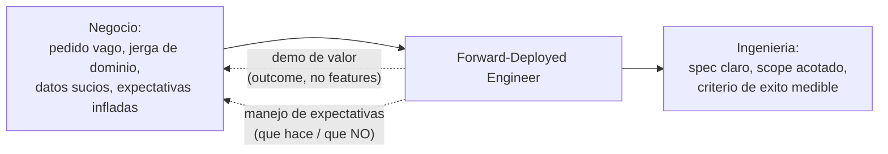

import Nivel from "@components/Nivel.astro";
import Reto from "@components/Reto.astro";
import Solucion from "@components/Solucion.astro";
import Quiz from "@components/Quiz.astro";
import CheckDominio from "@components/CheckDominio.astro";

<Nivel nivel="profundización" />

Hay un tipo de ingeniero que casi no aparece en los tutoriales pero que las empresas de IA se pelean por
contratar: el que **se sienta con el cliente**, escucha un problema de negocio descrito en palabras
vagas ("queremos usar IA para ser más eficientes"), y sale de esa reunión con un **spec técnico** y un
plan. Construye **en contexto**, demuestra el valor en el lenguaje del cliente —no en jerga— y maneja
las expectativas para que nadie se decepcione al entregar. Ese rol tiene un nombre que viene de Palantir
y que en 2026 adoptaron casi todas las startups de IA aplicada: **Forward-Deployed Engineer (FDE)**, a
veces llamado *Solutions Engineer* o *Applied AI Engineer*. Esta lección, marcada como profundización
pero de **altísimo ROI**, te enseña los cuatro músculos de ese lane desde cero —y cómo señalarlos aunque
hoy vengas de cero técnico.

## Objetivos de esta lección

Al terminar deberías ser capaz de:

- **O1 — Convertir** un problema de negocio vago en un **mini-spec técnico** aplicando un banco de
  **preguntas de discovery** *antes* de escribir código (outcome, usuario, proceso actual, costo de
  equivocarse, datos, restricciones, rebanada mínima de valor).
- **O2 — Traducir** una solución técnica a una **demo de valor para no-ingenieros** (outcome y "antes /
  después", no features ni jerga) y **manejar expectativas** de forma honesta (qué hace y qué NO hace la
  IA).
- **O3 — Explicar el trade-off** de por qué el lane Forward-Deployed paga bien y compite menos que el SWE
  puro, y **señalarlo** en CV/entrevista aunque vengas de un perfil no técnico.

## Por qué esto importa (y paga)

El "💰" de este track —que ya viste en [T0.2](/track-0-empleabilidad/t0-2-empleabilidad-track0/)— dice
que el mejor stack no sirve si no sabes mostrarlo. El lane Forward-Deployed lleva esa idea al extremo: es
literalmente **el rol cuyo producto es mostrar valor y adaptar la solución al cliente**. Tres razones de
mercado, sin adornos:

- **El cuello de botella de la IA no es el modelo: es el despliegue.** En 2026 cualquiera puede llamar a
  un LLM. Lo difícil —y lo que el cliente paga— es hacer que ese LLM resuelva *su* problema, con *sus*
  datos sucios, dentro de *su* flujo de trabajo real. Esa brecha entre "el demo funciona" y "funciona
  para este cliente" es el trabajo del FDE. Por eso las empresas de IA aplicada **se pelean** por
  perfiles que sepan cruzarla.
- **Compite menos porque el filtro es un combo raro, no LeetCode.** El SWE puro atrae a la mayor
  cantidad de candidatos y los filtros más duros (algoritmia, leetcode infinito). El lane FDE filtra por
  algo más escaso y **más difícil de fingir con IA**: técnica *más* comunicación *más* tolerancia a la
  ambigüedad *más* traducción negocio-a-código. Pocos se autoseleccionan ahí. Menos competencia, misma o
  mejor banda salarial.
- **Tu experiencia previa fuera de SWE deja de ser lastre y pasa a ser foso.** Si vienes de soporte,
  ventas, consultoría, atención a clientes o de un dominio específico (salud, finanzas, construcción), ya
  sabes hacer lo más difícil del rol: **hablar con humanos, entender un negocio y traducir**. La parte
  técnica la estás construyendo en este curso. El combo —no cada mitad por separado— es exactamente lo
  que este lane premia. Para un cambio de carrera, es la apuesta de mayor retorno.

> [!tip] En la práctica
> Se puede construir la mejor tecnología del mundo y aun así fallar en lo que de verdad importa:
> *explicarle a quien la usa* por qué vale la pena, antes de soltarla. "Va a ser genial" no es un
> spec: es una promesa vaga que genera *fricción* en la entrega. El Forward-
> Deployed Engineer es el que pregunta "¿qué problema resuelve esta persona, y cómo sé que lo
> resolví?" *antes* de escribir una línea. Aburrido. Y, molestamente, el que cobra mejor.

:::tip[Si ya tienes experiencia cliente-facing]
Si vienes de soporte, ventas, consultoría o un rol de dominio, **valida y salta**: toma la última vez
que un cliente o jefe te pidió algo vago ("necesito un reporte mejor", "esto tiene que ser más rápido").
¿Lograste, sin que te lo enseñaran, (a) preguntar hasta entender el problema real detrás del pedido, (b)
explicar la solución en el lenguaje de esa persona, y (c) decir "no" o "todavía no" sin romper la
relación? Si las tres te salen naturales, esta lección te da el **vocabulario** para venderlas como skill
de ingeniería (ve directo a los [ejercicios](#ejercicios-primero-sin-ia) y al apartado de [señalarlo en
CV/entrevista](#cómo-señalarlo-aunque-vengas-de-cero-técnico)). Si alguna te cuesta, aquí la construyes
desde cero. Lo que para un SWE puro es un skill nuevo, para ti es **traducir** uno que ya tienes.
:::

## Lo que ya traes (activación)

Recupera **de memoria**, sin abrir notas, tres piezas previas que esta lección conecta:

1. De **spec-driven development** (lo viste como hilo transversal: cada proyecto arranca con un mini-spec
   antes de codear): el FDE hace *exactamente eso*, pero el insumo no es un enunciado limpio —es un
   cliente confundido. Discovery es spec-driven dev aplicado a un humano que no sabe lo que quiere.
2. De [T0.5 · Portafolio diferenciado](/track-0-empleabilidad/t0-5-portafolio-diferenciado/): tus
   capstones cuentan una historia. La diferencia entre "construí un RAG" y "**scopée** un pedido vago de
   un usuario real y **entregué** un resultado medido" es justo el músculo de esta lección.
3. De [T0.3 · Práctica de entrevista](/track-0-empleabilidad/t0-3-practica-entrevista/): tus historias
   **STAR**. La narrativa "tomé ambigüedad, hice las preguntas correctas, manejé al stakeholder y
   entregué" es una de las STAR más fuertes que puedes contar —y casi nadie la tiene.

## El modelo mental: el FDE cruza la brecha demo→producción-del-cliente

Antes del ejemplo, fija el marco. Un producto de IA crea valor solo cuando se **adapta** al flujo real
del cliente. El FDE es el puente entre dos mundos que normalmente no se hablan:



Dos direcciones de tráfico, y el FDE las maneja **las dos**:

- **Hacia la ingeniería:** convierte el ruido del negocio en un spec accionable (discovery → scoping).
- **Hacia el negocio:** traduce lo que construyó en valor que el cliente entiende, y administra lo que el
  cliente *espera* para que la entrega no decepcione.

El error de carrera más común es creer que el trabajo es solo la flecha de ida (codear). El valor —y el
sueldo— está en que **manejas las cuatro flechas**.

## Los cuatro músculos (y el banco de preguntas de discovery)

### Músculo 1 — Discovery: preguntar antes de codear

El cliente nunca te describe un problema. Te describe **una solución que se imaginó**. "Queremos un
chatbot" no es el problema: es la solución que adivinó. Tu trabajo es **cavar hasta el problema real**.
La herramienta es un banco de 7 preguntas que aplicas *antes* de escribir una línea de código:

| # | Pregunta de discovery | Por qué importa |
|---|---|---|
| 1 | **Outcome:** ¿cómo se ve el éxito? ¿Qué número cambia si esto funciona? | Sin métrica de éxito, "terminado" es opinión. |
| 2 | **Usuario:** ¿quién lo usa, y cómo es su día *hoy* sin esto? | El usuario real rara vez es quien te contrata. |
| 3 | **Proceso actual:** ¿cómo lo hacen hoy, paso a paso, a mano? | El proceso manual revela el problema verdadero. |
| 4 | **Costo de equivocarse:** ¿qué pasa si el sistema falla o alucina? | Define cuánta precisión y cuánto human-in-the-loop necesitas. |
| 5 | **Datos:** ¿qué datos existen, dónde viven, en qué estado? | "Tenemos los datos" casi siempre significa "están sucios". |
| 6 | **Restricciones:** ¿presupuesto, plazo, privacidad, sistemas que tocar? | Una restricción temprana mata diseños inviables gratis. |
| 7 | **Rebanada mínima de valor:** ¿cuál es lo más pequeño que ya sirve? | Acotar el MVP es lo que hace el proyecto entregable. |

El producto de discovery es un **mini-spec**: *problem statement* → *métrica de éxito* → *en-scope* →
*fuera-de-scope* → *restricciones* → *rebanada mínima de valor* → *supuestos y preguntas abiertas*. Es
el mismo artefacto del spec-driven dev, pero **lo extraes de una conversación**, no de un enunciado.

### Músculo 2 — Demo de valor: outcome, no features

Cuando le muestras tu trabajo a un stakeholder de negocio, no le importa que usaste un reranker ni que
el embedding tiene 1536 dimensiones. Le importa **qué cambia en su semana**. La regla: traduce
**feature → valor → outcome** en su idioma.

- Jerga (mal): *"Implementé búsqueda vectorial con índice HNSW sobre pgvector y reranking cross-encoder."*
- Valor (bien): *"Escribes tu pregunta en lenguaje normal y te devuelve la respuesta con la fuente, en
  un par de segundos en vez de los 20 minutos que hoy pasas buscando en el drive."*

Y muestra el **antes / después** con un caso real del cliente, no un diagrama de arquitectura. La
arquitectura es para el ADR; la demo es para el humano que firma.

### Músculo 3 — Manejo de expectativas: honestidad calibrada

El FDE **sub-promete y sobre-entrega**, nunca al revés. Con IA esto es crítico porque el cliente llega
con expectativas infladas ("la IA nunca se equivoca"). Tu trabajo:

- Decir **qué hace y qué NO hace** el sistema, con números (precisión, casos que requieren un humano).
- Ser honesto sobre **alucinaciones y techo de precisión** *antes* de entregar, no después del incidente.
- Manejar el *scope creep* ("¿y de paso puede hacer también...?") con un "sí, en una fase 2" registrado
  por escrito, no con un sí reflejo que revienta el plazo.
- Cadencia de **demos pequeñas y frecuentes** sobre un único gran reveal. Show, don't tell.

Cada decisión y cada "no/todavía no" queda **por escrito** (un ADR, un correo de resumen). Eso conecta
directo con la disciplina de specs y ADRs del curso: el registro es lo que protege la relación cuando
alguien dice "pero yo pedí otra cosa".

### Músculo 4 — Traducción permanente

Discovery, demo y expectativas son la misma habilidad en tres momentos: **traducir entre el negocio y la
ingeniería**. Es lo que tu experiencia previa fuera de SWE ya entrenó, y lo que un perfil "solo técnico"
suele tener atrofiado. Ahí está tu ventaja.

## Ejemplo resuelto: scopeo un pedido vago en vivo (think-aloud)

Te muestro cómo razono, paso a paso, una sesión de discovery real. **El caso:** `Marta`, jefa de
operaciones de una distribuidora, te dice en una reunión:

> *"Queremos usar IA para manejar mejor los correos de los clientes. Recibimos un montón y se nos
> escapan cosas. ¿Pueden hacernos un chatbot con IA?"*

Un junior abre el editor y empieza a montar un chatbot. **Error.** Marta me dio una *solución
imaginada* ("chatbot"), no su problema. Pienso en voz alta y aplico el banco de preguntas:

**Outcome (¿qué número cambia?).** Le pregunto: *"Si esto funcionara perfecto, ¿qué medirías distinto en
un mes?"* Marta: *"Que no se nos escape ningún pedido urgente y que el equipo deje de pasar la mañana
clasificando correos."* Ya tengo dos outcomes medibles: **cero pedidos urgentes perdidos** y **horas de
clasificación manual reducidas**. Nota: ninguno requiere un chatbot.

**Proceso actual (¿cómo lo hacen hoy?).** *"Cuéntame el lunes en la mañana, paso a paso."* Marta: dos
personas leen ~300 correos, etiquetan a mano cuáles son pedidos, cuáles reclamos urgentes, cuáles spam, y
reenvían cada uno al área correcta. Ajá: el problema real no es "responder" (chatbot) sino **clasificar y
enrutar**. Acabo de ahorrarle construir el producto equivocado.

**Costo de equivocarse.** *"¿Qué pasa si el sistema marca un reclamo urgente como spam?"* Marta: *"Eso es
grave, perdemos un cliente."* Traducción técnica: la clase "urgente" necesita **alta sensibilidad** y
seguramente **human-in-the-loop** (un humano revisa lo dudoso). El costo de error define la arquitectura,
no mi gusto.

**Datos.** *"¿Tienen correos viejos ya clasificados?"* Marta: *"Sí, miles, en una carpeta por área."* Oro:
hay un dataset etiquetado gratis para evaluar la clasificación. Sin esa pregunta, habría asumido que no.

**Restricciones.** Privacidad (datos de clientes), el correo vive en Google Workspace, y quieren algo
"para este trimestre". Eso descarta soluciones que muevan los datos fuera o que tarden seis meses.

**Rebanada mínima de valor.** *"Si solo pudiéramos resolver UNA cosa primero, ¿cuál duele más?"* Marta:
*"Que no se escape lo urgente."* Perfecto: el MVP no es clasificar las 5 categorías —es **detectar
'urgente' y avisar**, con un humano confirmando. Lo demás es fase 2.

Ahora **escribo el mini-spec** —y fíjate que NO contiene la palabra "chatbot":

```text
PROBLEM STATEMENT
El equipo de ops pierde ~2 horas/dia clasificando ~300 correos a mano y, a veces,
se escapan reclamos urgentes (riesgo de perder clientes).

SUCCESS METRIC
- 0 reclamos urgentes no detectados en una semana de prueba (medido contra etiqueta humana).
- Reducir el tiempo de clasificacion manual (linea base: ~2 h/dia).

EN-SCOPE (MVP)
Detectar correos "urgentes" entrantes y notificar al area correcta, con un humano
confirmando antes de cerrar el caso (human-in-the-loop).

FUERA-DE-SCOPE (fase 2+)
Responder correos automaticamente; clasificar las 5 categorias completas; chatbot.

RESTRICCIONES
Datos de clientes (privacidad); correo en Google Workspace; entregable este trimestre.

REBANADA MINIMA DE VALOR
Un clasificador binario urgente/no-urgente evaluado contra los correos historicos ya
etiquetados; alerta + revision humana. Si funciona, se expande.

SUPUESTOS Y PREGUNTAS ABIERTAS
- Asumo que los correos historicos estan bien etiquetados (validar muestra).
- Pendiente: volumen real de "urgentes"/dia y a quien notificar.
```

Fíjate en el orden de mis decisiones: **outcome → proceso → costo de error → datos → restricciones →
rebanada mínima**, y *recién entonces* el spec. No escribí una línea de código y ya evité construir el
producto equivocado (chatbot), encontré un dataset de evaluación gratis, y acoté un MVP entregable este
trimestre. **Eso** es el trabajo del FDE, y por eso paga.

## Non-examples y misconceptions

:::caution[Podrías pensar... y por qué está mal]
**"El cliente me dijo qué construir, yo solo lo construyo."** Mal: el cliente te describió una **solución
que se imaginó** ("un chatbot"), no su problema. Si construyes lo que pidió literalmente, hay una alta
probabilidad de entregar algo que nadie usa. Tu valor está en **cavar hasta el problema** detrás del
pedido. Marta no necesitaba un chatbot; necesitaba no perder reclamos urgentes.

**"Discovery es perder tiempo; debería empezar a codear ya."** Mal, y es el error más caro que existe. El
código más costoso del mundo es **el que resuelve el problema equivocado**: se escribe entero, se entrega,
y se tira. Treinta minutos de preguntas correctas ahorran semanas de construir lo que no era. Pensar
primero es más barato que codear primero —es la misma lógica del Primero-Sin-IA, aplicada al producto.

**"Más features = más valor; mientras más haga el sistema, mejor."** Mal: el valor es **outcome en el
flujo del cliente**, no cantidad de funciones. Una cosa angosta que clava *un* trabajo doloroso (detectar
urgentes) y que el equipo **adopta** vale infinitamente más que una plataforma ancha de 10 features que
nadie usa porque no calza con cómo trabajan. Acotar es diseñar.

**"En la demo debo impresionar al stakeholder con la tecnología que usé."** Mal: la jerga **erosiona la
confianza** porque le recuerda al cliente que no entiende, y nadie compra lo que no entiende. "Implementé
HNSW + reranking" no significa nada para Marta. "Te avisa del reclamo urgente en segundos, y un humano lo
confirma antes de cerrar" sí. Vendes **outcomes**, no arquitectura. La arquitectura es para el ADR.

**"Para ganar el proyecto, prometo que la IA lo resuelve todo y nunca se equivoca."** Mal y autodestructivo:
sobre-prometer en IA (precisión perfecta, cero alucinaciones) **destruye la confianza en la entrega**,
cuando el sistema inevitablemente falla en un caso. El FDE **sub-promete y sobre-entrega**: dice qué hace
y qué NO hace, con números, *antes*. La honestidad calibrada es lo que sostiene la relación a largo plazo
—y los clientes a largo plazo son los que pagan bien.

**"El lane Forward-Deployed es un rol 'blando', menos serio que la ingeniería de verdad."** Mal en los
dos sentidos. Uno: es **más difícil de fingir** —no lo automatiza una IA ni lo aprueba un leetcode— y por
eso escasea. Dos: cruza el cuello de botella real de la IA aplicada (el despliegue), así que el negocio lo
**valora y paga**. No es ingeniería "menos": es ingeniería **más** comunicación, que es justo el combo
raro.

**"Necesito años de SWE puro antes de poder hacer algo cliente-facing."** Mal, y al revés: tu experiencia
previa **fuera** de SWE (soporte, ventas, dominio) es el **foso**, no el lastre. Lo más difícil del rol
—hablar con humanos, entender un negocio, traducir— ya lo entrenaste. La técnica la estás construyendo
ahora. Esperar "años de SWE" es esperar a perder tu única ventaja diferenciada.
:::

## Práctica con andamiaje (faded)

### Mini-reto A — Predice cuál es el movimiento FDE

Un cliente te escribe: *"Necesitamos un dashboard con IA para entender mejor a nuestros usuarios."* Dos
ingenieros responden:

- **Respuesta A:** *"Perfecto, te armo un dashboard con un panel de métricas y un resumen generado por
  LLM. Lo tengo la próxima semana."*
- **Respuesta B:** *"Antes de diseñarlo: si el dashboard funcionara perfecto, ¿qué decisión tomarías con
  él que hoy no puedes? ¿Quién lo miraría y cada cuánto? ¿Qué dato te falta hoy para esa decisión?"*

**Predice (sin leer la pista):** ¿cuál respuesta es la del Forward-Deployed Engineer, y qué tres cosas
está haciendo que la otra se salta?

<Solucion title="Ver pista (no la respuesta completa)">

Pregúntate qué pasa **una semana después** de cada respuesta. La A entrega *algo* rápido, pero ¿resuelve
una decisión real del cliente, o es un dashboard bonito que nadie abre al segundo día? Fíjate en qué
**no sabe** todavía quien dio la respuesta A: para quién es, qué decisión habilita, qué datos hay. La B
no escribió código aún, pero está extrayendo el **outcome** (la decisión que hoy no se puede tomar), el
**usuario** (quién y cada cuánto) y los **datos** (qué falta). ¿Cuál de las dos corre el riesgo de
construir el producto equivocado? ¿Cuál te deja con un mini-spec al final de la llamada?

</Solucion>

### Mini-reto B — Parsons: ordena la sesión de discovery

Estos son los pasos de una sesión de discovery, **desordenados**. Reordénalos (mentalmente o en papel)
en la secuencia que evita construir el producto equivocado:

```text
A)  Escribir el mini-spec: problem statement, metrica de exito, scope, MVP.
B)  Preguntar el OUTCOME: que numero cambia si esto funciona.
C)  Acotar la REBANADA MINIMA de valor (que es lo mas pequeno que ya sirve).
D)  Entender el PROCESO ACTUAL paso a paso (como lo hacen hoy a mano).
E)  Detectar la solucion imaginada del cliente ("queremos un chatbot") y NO codearla aun.
F)  Indagar COSTO de error, DATOS y RESTRICCIONES.
```

Piensa: ¿qué va primerísimo —reconocer que el pedido del cliente es una solución imaginada, o empezar a
preguntar? ¿La métrica de éxito viene antes o después de entender cómo trabajan hoy? ¿El spec se escribe
al principio o es el **producto** de las preguntas? (El orden correcto lo valida el corrector; lo que
importa es que **justifiques** por qué el mini-spec va al final y no al principio.)

## Ejercicios Primero-Sin-IA

> Trabaja **a mano primero**, sin IA, dentro del timebox. Cuando termines, pídele a tu IA que corrija con
> el framework de `.ai/` (que **revise** tu razonamiento, no que lo escriba por ti). Las carpetas viven
> en tu repo; ábrelas en tu editor.

<Reto title="Convierte un pedido vago en un mini-spec (discovery)" timebox="40 min">

Te entregamos `pedido-cliente.md`: el mensaje **vago** de un stakeholder de negocio (estilo "queremos
usar IA para X"). **Sin IA**, produce un `discovery.md` que:

1. **Detecte la solución imaginada:** nombra qué *solución* propuso el cliente y por qué NO debes
   construirla aún (cuál es el problema que podría haber detrás).
2. **Aplique el banco de 7 preguntas de discovery** (outcome, usuario, proceso actual, costo de error,
   datos, restricciones, rebanada mínima): escribe **la pregunta que harías** y la **respuesta que
   supones** (un supuesto razonable; márcalo como supuesto).
3. **Escriba el mini-spec** con la estructura: problem statement, métrica de éxito (con al menos un
   número), en-scope (MVP), fuera-de-scope, restricciones, rebanada mínima de valor, supuestos y
   preguntas abiertas.
4. **Cierre con una frase honesta** sobre qué pregunta es la que **más** cambiaría el diseño si la
   respuesta fuera distinta a tu supuesto (el riesgo número uno del scope).

Carpeta del ejercicio: `ejercicios/track-0/scoping-problema-vago/`

**Hecho significa:** la solución imaginada está nombrada y separada del problema; las 7 preguntas
aparecen con su respuesta-supuesto marcada; el mini-spec tiene métrica de éxito con un número y un
fuera-de-scope explícito (lo que NO harás en el MVP); y la pregunta de mayor riesgo está identificada.
Bonus de **Excelente:** el spec evita nombrar la solución imaginada del cliente (no "chatbot" si el
problema era clasificar), el MVP es una rebanada genuinamente pequeña y entregable, y el costo de error
se traduce a una decisión técnica concreta (p. ej. "necesita human-in-the-loop").

</Reto>

<Reto title="Demo de valor para no-ingenieros + manejo de expectativas" timebox="35 min">

Te entregamos `feature-tecnica.md`: la descripción de una feature que "construiste", escrita en **jerga
de ingeniería**. **Sin IA**, produce un `demo-y-expectativas.md` que:

1. **Guion de demo (máx. 6 frases), en lenguaje de negocio:** traduce la feature a **valor y outcome**
   ("escribes tu pregunta y..."), con un **antes / después** concreto. Cero jerga: si aparece una sola
   palabra técnica que un jefe de operaciones no entendería, la demo falló.
2. **Tabla "qué hace / qué NO hace":** al menos 3 cosas que el sistema **sí** hace y 3 que **no** (o que
   requieren un humano), de forma honesta. Aquí va el techo de precisión y el riesgo de alucinación
   dicho de frente.
3. **Maneja un scope creep:** el stakeholder pide en la demo "¿y de paso puede también [feature
   nueva]?". Escribe tu respuesta de FDE —ni un "sí" reflejo que revienta el plazo, ni un "no" seco—
   dejando registro por escrito.
4. **Una línea de cierre** explicando por qué sub-prometer y sobre-entregar protege la relación mejor que
   prometerlo todo.

Carpeta del ejercicio: `ejercicios/track-0/demo-valor-no-features/`

**Hecho significa:** el guion no contiene jerga técnica y muestra un antes/después de outcome; la tabla
tiene ≥3 "hace" y ≥3 "no hace" honestos (incluyendo límites de la IA); la respuesta al scope creep ni
promete a ciegas ni cierra la puerta, y queda registrada; y la línea de cierre conecta sub-prometer con
confianza. Bonus de **Excelente:** la demo usa un caso real del cliente (no genérico) y el manejo de
expectativas cita un número (precisión esperada, % que pasa por human-in-the-loop).

</Reto>

## Check de dominio (active recall)

<CheckDominio items={[
  "Explicar qué es un Forward-Deployed Engineer y por qué cruza el cuello de botella real de la IA aplicada (el despliegue, no el modelo)",
  "Recitar el banco de 7 preguntas de discovery y para qué sirve cada una (outcome, usuario, proceso actual, costo de error, datos, restricciones, rebanada mínima)",
  "Explicar por qué el pedido del cliente es una 'solución imaginada' y no el problema, con un ejemplo propio",
  "Traducir una feature técnica a una frase de valor para un no-ingeniero (outcome, no jerga)",
  "Argumentar por qué sub-prometer y sobre-entregar maneja mejor las expectativas que prometerlo todo, sobre todo con IA",
  "Explicar el trade-off de por qué este lane paga bien y compite menos que el SWE puro, y por qué la experiencia no técnica es un foso",
]} />

<Quiz
  question="Un cliente te dice: 'Queremos un chatbot con IA para nuestros correos, se nos escapan cosas.' ¿Cuál es el primer movimiento del Forward-Deployed Engineer?"
  options={[
    "Empezar a montar el chatbot esa misma tarde: el cliente ya dijo claramente qué quiere",
    "Preguntar por el outcome y el proceso actual paso a paso, para encontrar el problema real detrás del 'chatbot'",
    "Proponer la arquitectura técnica completa (RAG + reranking) para demostrar capacidad",
    "Pedir acceso a todos los sistemas para empezar a explorar los datos cuanto antes",
  ]}
  answer={1}
  explanation="'Chatbot' es la solución que el cliente se imaginó, no su problema. El movimiento FDE es discovery: preguntar el outcome (qué número cambia) y el proceso actual (cómo lo hacen hoy) para descubrir que el problema real podría ser clasificar/enrutar, no responder. Codear de inmediato arriesga construir el producto equivocado; volcar arquitectura es jerga que no aporta y no se entiende; pedir todos los accesos antes de entender el problema es ponerse a explorar sin pregunta."
/>

<Quiz
  question="Le demuestras tu sistema a una jefa de operaciones no técnica. ¿Cuál frase es la correcta para un FDE?"
  options={[
    "Implementé un clasificador con embeddings y un índice HNSW sobre pgvector, con reranking cross-encoder",
    "El sistema te avisa del reclamo urgente en segundos y un humano lo confirma antes de cerrarlo; hoy eso te toma 20 minutos de búsqueda",
    "Tiene 94% de F1-score en la clase positiva con validación cruzada de 5 folds",
    "Usé las mejores prácticas de la industria y un stack moderno de IA de última generación",
  ]}
  answer={1}
  explanation="La demo se hace en el lenguaje del stakeholder: valor y outcome ('te avisa en segundos', 'hoy te toma 20 minutos'), no features ni jerga. 'HNSW', 'F1-score' y 'cross-encoder' no significan nada para ella y erosionan la confianza. 'Mejores prácticas / stack moderno' es humo vacío. Vendes el cambio en su semana, no la arquitectura —esa va en el ADR."
/>

## Recursos

Fuentes con autoridad primero (verifica vigencia al usarlas):

- [Palantir — A Day in the Life of a Forward Deployed Software Engineer](https://blog.palantir.com/a-day-in-the-life-of-a-palantir-forward-deployed-software-engineer-45ef2de257b6)
  — el origen del rol, contado por quienes lo inventaron. Lectura base para entender el lane.
- [Y Combinator — How to talk to users / Customer discovery](https://www.ycombinator.com/library/6g-how-to-talk-to-users)
  — discovery y "The Mom Test" en versión startup: cómo preguntar sin que el cliente te diga lo que crees
  que quieres oír. El músculo 1 de esta lección.
- [The Mom Test (Rob Fitzpatrick) — sitio del libro](https://www.momtestbook.com/)
  — el manual canónico de cómo hacer preguntas de discovery que no se autoengañan. Si lees uno, este.
- [Atlassian — How to manage stakeholders](https://www.atlassian.com/work-management/project-management/stakeholder-management)
  — manejo de expectativas y stakeholders, en lenguaje práctico. El músculo 3.
- Para señalar el lane en CV/entrevista, vuelve a [T0.7 · CV y posicionamiento](/track-0-empleabilidad/t0-7-cv-posicionamiento/)
  y a [T0.3 · Práctica de entrevista](/track-0-empleabilidad/t0-3-practica-entrevista/) (la STAR de ambigüedad).

## Cómo señalarlo aunque vengas de cero técnico

El lane FDE es el único donde tu pasado **no técnico** se vende como activo. Cómo hacerlo visible:

- **En el CV** ([T0.7](/track-0-empleabilidad/t0-7-cv-posicionamiento/)): un bullet que muestre el arco
  completo. No "construí un agente", sino *"**Scopeé** un pedido vago de automatización de un usuario real
  en un mini-spec, **construí** el agente, lo **demostré** a un equipo no técnico y **entregué** una
  reducción del 80% del triaje manual."* Verbos de discovery + demo + entrega, no solo de codear.
- **En el posicionamiento:** "AI / Automation Engineer (Forward-Deployed)" o enfatizar el ángulo
  *client-facing / solutions* en tu LinkedIn. Es un nicho que los reclutadores de remoto-USD buscan por
  nombre.
- **En la entrevista** ([T0.3](/track-0-empleabilidad/t0-3-practica-entrevista/)): cuando te den un
  problema ambiguo, **no saltes a la solución**. Di en voz alta: *"Antes de diseñar esto, preguntaría..."*
  y recita tu banco de discovery. Demostrar el músculo en vivo vale más que cualquier línea del CV.
- **Tu STAR estrella:** una historia de "tomé ambigüedad → hice las preguntas correctas → manejé al
  stakeholder → entregué un resultado medido". Si vienes de soporte/ventas/dominio, **ya la viviste** en
  tu trabajo anterior; solo tienes que contarla con vocabulario de ingeniería.

## Conexión con el resto del track-0

Este lane es profundización, pero se enchufa en casi todo el track:

- Alimenta tu [portafolio (T0.5)](/track-0-empleabilidad/t0-5-portafolio-diferenciado/): el write-up de
  un capstone gana muchísimo si incluye el **discovery** (qué pediste vago, cómo lo scopeaste) y no solo
  el resultado técnico. Es lo que diferencia tu proyecto del "80% idéntico".
- Es munición para tu [CV (T0.7)](/track-0-empleabilidad/t0-7-cv-posicionamiento/) y tus
  [historias STAR (T0.3)](/track-0-empleabilidad/t0-3-practica-entrevista/): la narrativa de ambigüedad
  manejada es de las más fuertes y escasas.
- Refuerza [vender el skill AI-augmented (T0.9)](/track-0-empleabilidad/t0-9-skill-ai-augmented/): un FDE
  que además orquesta IA con fluidez para acelerar el discovery y el prototipado es justo el perfil de
  2026.
- En el mercado remoto-USD, todo esto es **cliente-facing en inglés** —el gate de
  [T0.1](/track-0-empleabilidad/t0-1-ingles-tecnico/) deja de ser opcional.

## Reflexión + spaced repetition

Escribe 3-4 frases respondiendo: **la última vez que alguien (cliente, jefe, profesor) te pidió algo
vago, ¿saltaste a la solución o cavaste hasta el problema? ¿Qué pregunta del banco de discovery te habría
ahorrado más trabajo si la hubieras hecho primero?** Nombrar tu reflejo —solucionador o indagador— es lo
que te deja cambiarlo.

> [!tip] Gancho de spaced repetition
> - **Mañana:** recita de memoria, sin mirar, las **7 preguntas de discovery**. Si no te salen todas, no
>   las interiorizaste todavía.
> - **En 3 días:** toma un pedido vago real de tu semana (del trabajo, de un familiar, de un proyecto) y
>   **conviértelo en un mini-spec** de 8 líneas. El músculo se entrena con casos reales, no inventados.
> - **En 1 semana:** agarra **uno** de tus capstones y reescribe su write-up empezando por el discovery:
>   qué pregunta vaga lo originó, cómo lo acotaste, qué dejaste fuera de scope. Pégalo en el README.
> - **En 2 semanas:** en tu próximo mock interview de [T0.3](/track-0-empleabilidad/t0-3-practica-entrevista/),
>   ante un problema ambiguo, **resiste** dar la solución por 60 segundos y haz preguntas de discovery en
>   voz alta. Grábate. Esa pausa es, literalmente, el lane.

> [!info] Contexto
> Imagina que un cliente te da un problema vago a propósito: 'maneja mejor los correos'. Un ingeniero promedio
> construye un chatbot que nadie usa y factura por el privilegio. El bueno pregunta qué número
> le importa al cliente, descubre que el problema era otro, y entrega algo que sí funciona.
> Resulta que la habilidad más rara no es escribir código —es **saber qué código no
> escribir**. No se lo digas a los demás candidatos. Que sigan resolviendo el problema equivocado, rápido.
