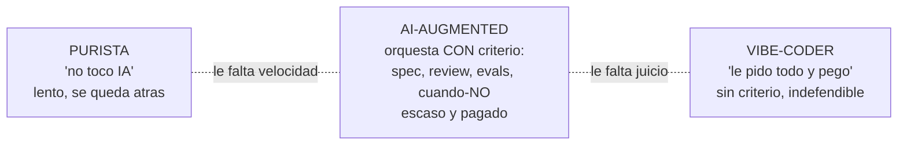
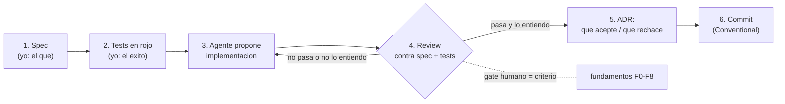

import Nivel from "@components/Nivel.astro";
import Reto from "@components/Reto.astro";
import Solucion from "@components/Solucion.astro";
import Quiz from "@components/Quiz.astro";
import CheckDominio from "@components/CheckDominio.astro";

<Nivel nivel="intermedio" />

Hay un skill que en 2026 vale dinero y que el mercado **todavía no sabe nombrar bien**. No es "usar
ChatGPT". No es "saber escribir prompts". Es **orquestar a la IA con criterio de ingeniería**: escribir
el spec antes de delegar, dirigir agentes de código en un loop con review disciplinado, medir sus salidas
con evals en vez de confiar en que "se ven bien", y —lo más raro y lo más valioso— **saber cuándo NO
usarla**. Casi todos los candidatos caen en uno de dos extremos: el purista que no la toca y se queda
lento, o el que le pide todo y pega el resultado sin entenderlo. El perfil que escasea —y que paga— está
en el medio: el que **dirige y verifica**. Esta lección te enseña a reconocer ese skill en lo que ya
estás haciendo en este curso, y a venderlo sin sobrevender. El framing honesto no es "uso una herramienta
de IA": es **"dirijo un equipo de agentes y respondo por su trabajo"**.

## Objetivos de esta lección

Al terminar deberías ser capaz de:

- **O1 — Explicar** el framing honesto del skill *AI-augmented* (orquestar IA con criterio de ingeniería:
  spec-driven, agentic coding con review, evals, y cuándo NO usarla) como **multiplicador que apalanca**
  tus fundamentos, no muleta que los reemplaza; y articular por qué "dirijo y verifico agentes" describe
  algo real y distinto de "uso ChatGPT".
- **O2 — Producir** evidencia **concreta y verificable** del skill (en commits, ADRs, write-ups y el
  propio repo del curso) que demuestre criterio de ingeniería sobre el output de la IA, no dependencia.
- **O3 — Defender** en entrevista, sin sobrevender, el **trade-off de cuándo usar y cuándo NO usar IA**
  (y qué cuesta cada decisión), conectándolo con la tesis Primero-Sin-IA del curso.

## Por qué esto importa (y paga)

El "💰" de este track repite una idea: el mejor stack no sirve si no sabes mostrarlo. Aquí va un paso más
allá: en 2026 hay un skill que casi nadie sabe **mostrar** porque casi nadie lo sabe **nombrar**. Tres
razones de mercado, sin adornos:

- **El crackdown anti-trampa en live coding volvió escaso saber dirigir IA *con* fundamentos.** Las
  empresas endurecieron las entrevistas (live coding sin IA, hablado en voz alta) justamente porque se
  llenaron de candidatos que pegan output que no entienden. Eso hizo *más valioso* —no menos— al que sabe
  usar IA **y** puede defender cada línea sin ella. La regla [Primero-Sin-IA](/track-0-empleabilidad/) del
  curso no es nostalgia: es exactamente el músculo que el mercado 2026 volvió a premiar. Tú lo estás
  entrenando mientras estudias.
- **El cuello de botella ya no es generar código: es confiar en él.** Cualquiera produce 100 líneas en
  segundos con un LLM. Lo difícil —y lo que el negocio paga— es saber si esas 100 líneas son correctas,
  seguras y mantenibles. Ese juicio (review, tests, evals, "esto NO lo delego") es el trabajo. El que solo
  genera es reemplazable por el siguiente que también genera; el que **verifica con criterio** es el que
  sostiene el sistema en producción.
- **Es un combo difícil de fingir, y por eso compite menos.** "Sé escribir prompts" lo dice todo el
  mundo y no filtra a nadie. "Dirijo agentes contra un spec, reviso su salida contra tests que yo escribí,
  y la gateo con evals" es una afirmación que **solo es cierta si de verdad sabes ingeniería** —y se cae
  en cinco minutos de entrevista si no. Pocos pueden sostenerla. Menos competencia, mejor banda.

> [!tip] En la práctica
> Dirigir muchas herramientas automáticas no te convierte en "alguien que usa herramientas". Te
> convierte en quien **diseña el protocolo, revisa cada resultado y responde
> cuando uno falla**. Esa es la diferencia entre dirigir y delegar a ciegas: el que dirige
> responde cuando algo se sale del guion. Cuando vendas tu skill, no digas "uso IA".
> Di qué verificas. El crédito —y la culpa— son de quien dirige. Asume los dos.

:::tip[Si ya orquestas IA en tu trabajo]
Si ya usas Copilot, Claude Code, n8n con LLMs o agentes a diario, **valida y salta**: toma tu último
output de IA que pasó a producción y pregúntate (a) ¿escribí un spec o un test *antes* de pedirlo?, (b)
¿revisé su salida contra algo objetivo, o la acepté porque "se veía bien"?, (c) ¿podría defender cada
decisión en una entrevista sin la IA al lado? Si las tres te salen con evidencia en el repo, esta lección
te da el **vocabulario** para venderlo como skill de ingeniería (ve directo a la [sección de
evidencia](#el-mapa-de-evidencia-el-skill-se-prueba-no-se-declara) y a los
[ejercicios](#ejercicios-primero-sin-ia)). Si alguna te incomoda, aquí está el hueco real que esta
lección cierra: el skill no es *usar* la IA, es el **criterio con que la diriges y verificas**.
:::

## Lo que ya traes (activación)

Recupera **de memoria**, sin abrir notas, cuatro piezas previas que esta lección conecta:

1. La **regla Primero-Sin-IA** ("no se trata de no usar IA; se trata de no *necesitarla* para pensar").
   Esta lección es su otra cara: una vez que no la necesitas para pensar, **sí** la usas —pero para
   multiplicar, dirigiendo y verificando. Primero-Sin-IA es el cimiento; AI-augmented es lo que construyes
   encima.
2. El hilo transversal de **spec-driven dev + ADRs + Conventional Commits** (cada proyecto arranca con un
   mini-spec; las decisiones quedan en ADRs). Ese hábito es *exactamente* lo que separa dirigir un agente
   de improvisar con uno.
3. De [T0.5 · Portafolio diferenciado](/track-0-empleabilidad/t0-5-portafolio-diferenciado/): el
   **write-up de trade-offs** de cada capstone. Ahí es donde demuestras —con evidencia, no con adjetivos—
   qué le delegaste a la IA, cómo lo verificaste y qué rechazaste.
4. De [T0.8 · Lane Forward-Deployed](/track-0-empleabilidad/t0-8-forward-deployed/): la idea del **combo
   raro** (técnica + algo escaso). AI-augmented es otro combo así: IA + criterio de ingeniería. Por
   separado no valen; juntos, sí.

## El modelo mental: muleta vs. multiplicador

Antes del ejemplo, fija el marco. La misma herramienta (un LLM, un agente de código) produce dos perfiles
opuestos según **dónde pones el criterio**:



- El **purista** tiene criterio pero renuncia al multiplicador. En 2026 entrega más lento que el resto y
  lo nota en cada sprint.
- El **vibe-coder** tiene el multiplicador pero no el criterio. Va rapidísimo… hasta el primer bug que no
  entiende, la primera vulnerabilidad que pegó sin ver, o la primera entrevista donde le piden defender su
  propio código.
- El **AI-augmented** es el del medio: usa el multiplicador **gobernado por** el criterio. La clave es que
  el criterio (los fundamentos de F0–F8) es lo que hace posible verificar el output. **Sin fundamentos no
  hay palanca: no puedes revisar lo que no entiendes.** Por eso este skill *apalanca* tus fundamentos —no
  los reemplaza. La IA es la palanca; tus fundamentos son el punto de apoyo. Una palanca sin punto de
  apoyo no levanta nada.

El error de framing más común al venderte es elegir el cuadro equivocado: o esconder que usas IA (te
disfrazas de purista y suenas lento) o presumir que la IA "lo hace todo" (suenas a vibe-coder). El framing
correcto nombra **el criterio**, que es lo único que no se puede fingir.

## Los cuatro músculos del skill AI-augmented

El skill no es un bloque: son cuatro músculos, cada uno con su versión-muleta (mal) y su
versión-multiplicador (bien). Vender el skill es demostrar el multiplicador en los cuatro.

### Músculo 1 — Spec-driven: el qué antes del cómo

El vibe-coder le tira a la IA un "hazme un endpoint de login" y acepta lo que salga. El AI-augmented
**escribe primero el spec** (entradas, salidas, casos borde, criterio de éxito) y *recién entonces*
delega la implementación. La diferencia: el agente ejecuta contra un contrato que tú definiste, no
improvisa el contrato por ti. Es el mismo hilo de spec-driven dev del curso, ahora como forma de dirigir
IA. Herramientas como [GitHub Spec Kit](https://github.com/github/spec-kit) formalizan justo este flujo
(spec → plan → tasks → implement), pero el músculo es independiente de la herramienta: **tú** decides qué
se construye; la IA, parte del cómo.

### Músculo 2 — Agentic coding con review disciplinado

Un agente de código moderno no es un chatbot: lee tus archivos, corre comandos, propone cambios. Dirigirlo
bien es un loop, no un deseo:



Las flechas 4→3 (rechazar y re-pedir) y el gate humano son el skill. El vibe-coder borra esas flechas:
acepta lo primero. El AI-augmented **revisa evidencia, no afirmaciones** —no acepta "ya está, los tests
pasan"; exige ver la salida real de los tests. Y cuando rechaza algo del agente, lo deja escrito en un ADR
("el agente propuso X; lo rechacé porque Y"). Ese ADR es oro de portafolio: prueba que **tú** dirigiste.

### Músculo 3 — Evals: confiar en el output con un número, no con una corazonada

Aquí está el músculo que casi nadie tiene. Cuando un LLM genera texto, una clasificación o una respuesta
de RAG, el vibe-coder mira un par de ejemplos, ve que "se ven bien" y lo manda a producción. El
AI-augmented **mide**: arma un set de casos etiquetados, corre un eval harness, obtiene un número
(precisión, faithfulness, tool-call accuracy) y pone un **gate de regresión** que no deja pasar el cambio
si el número baja. Es el hilo de evals del curso: *son los unit tests de la IA*. Decir "confío en este
prompt porque lo evalué con 60 casos y da 0,87 de faithfulness" es ingeniería; decir "el prompt funciona
bien" es una corazonada. Una de las dos te contratan.

### Músculo 4 — Saber cuándo NO usar IA (el más escaso)

El músculo que más diferencia y el que más cuesta fingir. Usar IA **siempre** no es ser AI-augmented: es
ser dependiente. El criterio incluye los momentos de **abstenerse a propósito**:

- **Cuando estás aprendiendo** (la regla Primero-Sin-IA): delegar el pensamiento atrofia el fundamento
  que necesitas para luego *poder* verificar. Pagas la deuda en la próxima entrevista.
- **Debugging que requiere modelo mental:** si no entiendes el sistema, pedirle el fix a la IA te da una
  corazonada disfrazada de respuesta. Primero el modelo mental; después, quizá, la IA.
- **Código crítico / de seguridad:** donde el costo de un error es alto (auth, manejo de dinero, borrado
  de datos), el costo de revisar a fondo el output de la IA suele superar el de escribirlo tú. Delegar ahí
  es trasladar el riesgo, no eliminarlo.
- **Cuando revisar cuesta más que hacer:** si vas a leer 200 líneas generadas con la misma atención con
  que las habrías escrito, no ganaste tiempo —solo moviste el trabajo y agregaste el riesgo de aceptar un
  error sutil.

Saber **defender** un "aquí NO la usé, y por esto" es lo que convierte tu uso de IA de sospechoso a
profesional. Conecta con la honestidad de [T0.4 · Historia de falla](/track-0-empleabilidad/t0-4-historia-falla-produccion/):
reconocer límites es señal de seniority, no de debilidad.

## El mapa de evidencia: el skill se prueba, no se declara

"Soy bueno orquestando IA" es una declaración vacía: cualquiera la dice. El skill AI-augmented se vende
con **evidencia verificable** que un reclutador puede abrir y revisar. La clave: cada músculo deja un
artefacto concreto. Tu trabajo es mapearlos.

| Músculo | Muleta (lo que NO es) | Multiplicador (lo que SÍ vendes) | Evidencia concreta y abrible |
|---|---|---|---|
| Spec-driven | "le pedí que lo hiciera" | "definí el contrato; el agente lo implementó" | el `spec.md` / mini-spec commiteado **antes** del código |
| Agentic + review | "acepté lo que salió" | "lo dirigí en un loop y revisé contra mis tests" | historial de commits: spec → tests rojos → implementación; un PR con tu review |
| Evals | "se veía bien" | "lo medí: 0,87 y un gate de regresión" | el `evals/` con dataset + número + el gate en CI |
| Cuándo-NO | "uso IA para todo" | "aquí NO la usé, y por esto" | un ADR que documenta una decisión de **no** delegar |
| El meta-skill | "sé prompts" | "todo mi curso corre sobre Primero-Sin-IA" | el propio repo del curso: commits a mano + write-ups honestos |

El repo del curso que estás construyendo es tu **Exhibit A**: un historial Primero-Sin-IA, con specs,
ADRs y write-ups que dicen la verdad sobre dónde usaste IA y dónde no, demuestra el skill *en vivo* mejor
que cualquier línea del CV.

## Ejemplo resuelto: defiendo el skill en una entrevista hostil (think-aloud)

Te muestro cómo razono, frase por frase, el momento más incómodo y más decisivo. **El caso:** estás en
una entrevista. La reclutadora técnica mira tu GitHub y dispara, escéptica:

> *"Veo muchísima actividad y mencionas que usas Claude Code y Copilot. Seamos honestos: ¿sabes programar
> sin IA, o la IA programa por ti?"*

Es una trampa con dos salidas malas. Pienso en voz alta:

**Primero, qué NO hacer.** Si digo *"la IA hace casi todo, soy súper productivo"*, acabo de declararme un
pasivo: alguien que no puede defender su propio código. Si digo *"no, yo programo todo a mano, jamás uso
IA"*, o miento (y mi GitHub me delata) o soy un purista lento. Las dos me descartan. **No me pongo a la
defensiva ni me disculpo:** la pregunta asume que usar IA y saber programar se excluyen, y mi trabajo es
**romper esa falsa dicotomía** mostrando el criterio.

**Reframing (la frase ancla).** *"Las dos cosas, y esa es justo la habilidad: dirijo IA, pero respondo por
cada línea. Te muestro con el repo."* Fíjate que no discuto en abstracto —ofrezco evidencia de inmediato.

**Anclo en el repo, músculo por músculo.** *"Mira este capstone. El spec lo escribí yo —aquí, commiteado
antes de la primera línea de implementación. Los tests también los escribí yo, en rojo, definiendo qué
significaba 'funciona'. Recién entonces dejé que el agente propusiera la implementación, y la revisé contra
esos tests. Aquí hay un ADR donde el agente sugirió cachear el token en memoria del proceso y lo rechacé,
porque con varios workers se rompía; lo anoté con el porqué."* Acabo de demostrar spec-driven, agentic +
review y cuándo-NO, **con artefactos que ella puede abrir**.

**Subo la apuesta con evals.** *"Y para la parte de IA del proyecto no confío en que 'se vea bien': tengo
un set de 60 casos etiquetados y un eval que corre en CI; si la precisión baja de mi umbral, el pipeline
falla. No mando a producción una salida de LLM que no medí."* Eso me separa del 90% que solo genera.

**Cierro con el cuándo-NO y la tesis.** *"De hecho, todo mi proceso de estudio corre sobre una regla:
resuelvo a mano primero, sin IA, sobre todo cuando estoy aprendiendo algo nuevo —porque si delego el
pensamiento, después no puedo revisar lo que la IA produce. La uso para multiplicar, no para pensar por
mí. Por eso puedo defender este código contigo ahora mismo, sin la IA al lado."*

Fíjate en la **estructura** de mi respuesta: rompí la dicotomía → ofrecí evidencia → demostré los cuatro
músculos con artefactos abribles → cerré conectando con Primero-Sin-IA. No sobrevendí ("la IA me hace
10x"); no me escondí ("no la uso"). Nombré **el criterio**, que es lo único que la reclutadora no puede
verificar en otro candidato. Y le di un repo para comprobarlo. **Eso** es vender el skill AI-augmented.

## Non-examples y misconceptions

:::caution[Podrías pensar... y por qué está mal]
**"Mejor escondo que uso IA; admitirlo me hace ver junior o flojo."** Mal, y al revés. Esconderlo es la
señal de quien *no puede defenderlo*. En 2026 todos saben que usas IA; lo que te diferencia es **el
criterio con que la diriges**. Ocultarlo desperdicia tu mejor carta y, si te pillan (tu GitHub habla),
pareces deshonesto. La fortaleza no es la abstinencia: es la **verificación**.

**"Decir 'dirijo agentes y verifico' es marketing inflado, casi mentira."** Mal —*si de verdad lo haces*.
Es una descripción **precisa** de un flujo real: escribes el spec, revisas la salida contra tus tests, la
gateas con evals. Lo que lo vuelve mentira no es la frase: es decirla **sin** los artefactos que la
respaldan. Por eso la frase obliga: solo la sostiene quien sabe ingeniería. Dila únicamente si puedes
abrir el repo y probarla.

**"Mientras más le delego a la IA, más AI-augmented soy."** Mal: delegar **sin** criterio es la
definición de muleta. El skill no se mide por cuánto delegas, sino por **cuán bien decides qué delegar y
cuán a fondo verificas lo delegado**. Un ingeniero que delega el 30% con review férreo es más
AI-augmented que uno que delega el 90% y pega sin mirar.

**"Este skill reemplaza los fundamentos; con IA ya no necesito saber programar a fondo."** Mal y
peligroso. Es exactamente lo contrario: **sin fundamentos no puedes verificar el output**, y sin
verificación no estás dirigiendo —estás obedeciendo a una máquina que alucina con confianza. La IA es la
palanca; tus fundamentos (F0–F8) son el punto de apoyo. Por eso el curso es Primero-Sin-IA: construye el
apoyo *antes* de darte la palanca.

**"Saber 'cuándo NO usar IA' es una excusa de quien no la domina."** Mal: es el músculo **más** avanzado.
Cualquiera puede prender el autocompletado siempre; pocos saben apagarlo a propósito cuando aprender,
depurar o un trozo crítico lo exige. Defender un "aquí NO la usé, por esto" demuestra más juicio que
cualquier demo de velocidad. Es la diferencia entre usar una herramienta y **gobernarla**.

**"Vender esto es traicionar la regla Primero-Sin-IA del curso."** Mal: son **las dos caras de la misma
moneda**. Primero-Sin-IA te asegura que no la *necesitas* para pensar; AI-augmented es lo que haces una
vez que eso es cierto: usarla para multiplicar, con el criterio que Primero-Sin-IA te dio. La regla nunca
fue "no uses IA". Fue "no dependas de ella para pensar". Vender el criterio **honra** la regla, no la
contradice.
:::

## Práctica con andamiaje (faded)

### Mini-reto A — Predice cuál respuesta vende el skill

A la pregunta *"¿usas IA para programar?"*, dos candidatos responden:

- **Respuesta A:** *"Sí, uso Copilot y Claude todo el día, me hacen como 5x más rápido. Casi no escribo
  código a mano ya, la IA es buenísima."*
- **Respuesta B:** *"Sí, pero la dirijo: escribo el spec y los tests yo, dejo que el agente proponga la
  implementación y la reviso contra esos tests. Aquí en el repo está un ADR donde rechacé lo que sugirió.
  Y para la parte de IA no confío en que se vea bien: la mido con evals que corren en CI."*

**Predice (sin leer la pista):** ¿cuál respuesta hace que el reclutador quiera ver el repo, y qué tres
cosas hace la B que la A no?

<Solucion title="Ver pista (no la respuesta completa)">

Pregúntate qué pasa **en los siguientes cinco minutos** de la entrevista tras cada respuesta. La A es una
afirmación de velocidad sin nada que verificar: ¿"5x" medido contra qué? ¿Qué puede defender ese candidato
si le piden explicar una línea sin la IA? Suena a vibe-coder. La B no presume velocidad: nombra **el
criterio** (spec propio, review contra tests, ADR de rechazo, evals con gate) y **ofrece evidencia
abrible**. Fíjate qué verbo domina en cada una: en A, "uso / me hace"; en B, "dirijo / escribo / reviso /
mido / rechacé". ¿Cuál suena a alguien que *gobierna* la herramienta y cuál a alguien *gobernado por*
ella? ¿Cuál podría sostener su respuesta con la IA apagada?

</Solucion>

### Mini-reto B — Parsons: ordena el loop de agentic coding disciplinado

Estos son los pasos de un ciclo de código dirigido por agente, **desordenados**. Reordénalos (mentalmente
o en papel) en la secuencia que mantiene el criterio de ingeniería en control:

```text
A)  Commitear con un mensaje Conventional que describa el cambio.
B)  Escribir los tests en rojo: yo defino que significa "funciona".
C)  Dejar que el agente proponga la implementacion.
D)  Escribir el mini-spec: entradas, salidas, casos borde, exito.
E)  Registrar en un ADR que acepte y que rechace del agente, y por que.
F)  Revisar la propuesta contra el spec y los tests; si no pasa o no la entiendo, re-pedir.
```

Piensa: ¿qué va **primerísimo** —escribir el spec o dejar que el agente proponga? ¿Los tests se escriben
antes o después de ver la implementación de la IA (pista: si los escribes después, ¿contra qué la
revisas)? ¿El ADR de la decisión va antes o después del review? (El orden correcto lo valida el corrector;
lo que importa es que **justifiques** por qué el spec y los tests van *antes* de que el agente toque nada.)

## Ejercicios Primero-Sin-IA

> Trabaja **a mano primero**, sin IA, dentro del timebox. Cuando termines, pídele a tu IA que corrija con
> el framework de `.ai/` (que **revise** tu razonamiento, no que lo escriba por ti). Las carpetas viven en
> tu repo; ábrelas en tu editor. Sí: vas a escribir *sin IA* un ejercicio sobre *vender que usas IA*. Es a
> propósito —es el músculo Primero-Sin-IA en acción.

<Reto title="Reframe + mapa de evidencia del skill AI-augmented" timebox="40 min">

Te entregamos `autodescripcion-junior.md`: cómo un candidato describe hoy su relación con la IA (estilo
"uso ChatGPT para todo, me ahorra un montón de tiempo"). **Sin IA**, produce un `reframe.md` que:

1. **Diagnostique el framing actual:** nombra en qué cuadro cae la autodescripción (purista / vibe-coder /
   AI-augmented) y por qué ese framing *le resta* en una entrevista 2026.
2. **Reescriba la narrativa** en el framing AI-augmented honesto: una versión de 4–6 frases que nombre
   **el criterio** (no la velocidad), apta para decir en una entrevista o poner en un README de perfil.
   Cero sobreventa ("10x", "la IA hace todo") y cero ocultamiento.
3. **Construya el mapa de evidencia:** una tabla que mapee cada uno de los **cuatro músculos** (spec-driven,
   agentic+review, evals, cuándo-NO) a un **artefacto concreto y abrible** que demostraría ese músculo en
   un repo real tuyo (p. ej. "un `spec.md` commiteado antes del código", "un ADR de una decisión de NO
   delegar"). Si aún no tienes el artefacto, anota cuál vas a producir y dónde.
4. **Cierre con una frase honesta** sobre el músculo que hoy te falta evidencia para demostrar (el más
   débil de tu mapa) y qué harás para tenerla.

Carpeta del ejercicio: `ejercicios/track-0/evidencia-ai-augmented/`

**Hecho significa:** el diagnóstico nombra el cuadro y por qué resta; la narrativa reescrita habla de
criterio (no de velocidad) y no sobrevende ni oculta; el mapa cubre los **4 músculos** con un artefacto
**concreto y abrible** cada uno (no "buen código", sino *qué archivo/commit*); y la frase final identifica
con honestidad tu músculo más débil. Bonus de **Excelente:** al menos un artefacto del mapa ya existe en
tu repo del curso (lo enlazas), y la narrativa conecta explícitamente con Primero-Sin-IA ("la uso para
multiplicar, no para pensar").

</Reto>

<Reto title="Defiende el cuándo-NO en una entrevista hostil" timebox="35 min">

Te entregamos `transcripcion-entrevista.md`: el fragmento de una entrevista donde el reclutador, escéptico,
cuestiona tu uso de IA. **Sin IA**, produce un `defensa.md` que:

1. **Tu respuesta hablada (máx. 8 frases):** la respuesta que darías en voz alta, que (a) rompa la falsa
   dicotomía "o sabes o usas IA", (b) ofrezca **evidencia** del repo, y (c) cierre conectando con
   Primero-Sin-IA. Escríbela como se *dice*, no como se redacta un ensayo.
2. **Tu lista cuándo-NO:** al menos **3 situaciones concretas** donde **NO** usarías IA, cada una con su
   **porqué de ingeniería** (no "porque sí" —un costo real: aprendizaje, modelo mental para debugging,
   código crítico, costo de revisar mayor que el de escribir).
3. **El trade-off por escrito:** para **una** de esas situaciones, explica qué *ganas* y qué *pierdes* al
   NO usar IA ahí (toda decisión cuesta algo; nómbralo).
4. **Una línea anti-sobreventa:** la frase que te prohíbes decir en la entrevista (la versión vibe-coder o
   la versión purista) y por qué te hundiría.

Carpeta del ejercicio: `ejercicios/track-0/cuando-no-usar-ia/`

**Hecho significa:** la respuesta hablada rompe la dicotomía, ancla en evidencia y cierra con
Primero-Sin-IA, sin sobrevender ni esconder; la lista tiene **≥3** situaciones cuándo-NO con un porqué de
ingeniería real cada una; el trade-off nombra explícitamente qué ganas y qué pierdes; y la línea
anti-sobreventa identifica una frase autodestructiva concreta. Bonus de **Excelente:** la respuesta usa un
artefacto específico ("este ADR", "estos tests") en vez de hablar en abstracto, y el trade-off cita el
costo en términos medibles (tiempo de revisión, riesgo de un bug en código crítico).

</Reto>

## Check de dominio (active recall)

<CheckDominio items={[
  "Explicar la diferencia entre muleta y multiplicador, y por qué el skill AI-augmented apalanca los fundamentos en vez de reemplazarlos (la palanca y el punto de apoyo)",
  "Recitar los cuatro músculos del skill (spec-driven, agentic coding con review, evals, cuándo-NO) y un artefacto concreto que prueba cada uno",
  "Defender la frase 'dirijo agentes y respondo por su trabajo' explicando por qué solo es cierta si sabes ingeniería",
  "Dar tres situaciones donde NO usarías IA, cada una con un porqué de ingeniería (no una excusa)",
  "Explicar por qué vender este skill HONRA la regla Primero-Sin-IA en vez de contradecirla",
  "Reframear, sin sobrevender ni esconder, una autodescripción 'uso ChatGPT para todo' en el framing AI-augmented",
]} />

<Quiz
  question="En una entrevista te preguntan: '¿Sabes programar sin IA o la IA programa por ti?'. ¿Cuál es la mejor respuesta para vender el skill AI-augmented?"
  options={[
    "'La IA hace casi todo, me deja como 10x más productivo; ya casi no escribo código a mano.'",
    "'No uso IA para programar; todo mi código lo escribo a mano, sin asistentes.'",
    "'Las dos: dirijo IA pero respondo por cada línea. Te muestro en el repo: el spec y los tests los escribí yo, reviso la salida del agente contra ellos, y la gateo con evals.'",
    "'Sé escribir muy buenos prompts, esa es mi ventaja sobre otros candidatos.'",
  ]}
  answer={2}
  explanation="La respuesta correcta rompe la falsa dicotomía y ancla en EVIDENCIA verificable (spec propio, review contra tests, evals), nombrando el criterio que no se puede fingir. La primera suena a vibe-coder (velocidad sin criterio, indefendible). La segunda es el purista que renuncia al multiplicador y suena lento. La cuarta ('sé prompts') no filtra a nadie y no demuestra ingeniería. El skill se prueba con artefactos, no se declara con adjetivos."
/>

<Quiz
  question="Un compañero dice: 'Soy AI-augmented: le delego el 90% de mi código a la IA y avanzo rapidísimo'. ¿Cuál es la objeción correcta?"
  options={[
    "Ninguna: delegar más siempre te hace más AI-augmented y más productivo.",
    "El skill no se mide por cuánto delegas, sino por cuán bien decides qué delegar y cuán a fondo verificas lo delegado; delegar sin review es la definición de muleta.",
    "Está mal porque un buen ingeniero nunca debería usar IA para más del 50% del código.",
    "El problema es solo de velocidad: debería delegar aún más para ir más rápido.",
  ]}
  answer={1}
  explanation="Ser AI-augmented no es maximizar la delegación: es el CRITERIO con que decides qué delegar y la disciplina con que verificas el output. Delegar el 90% sin review es vibe-coding, no orquestación. No existe un porcentaje 'correcto' fijo (la opción del 50% es arbitraria); lo que importa es la verificación. Y 'delegar aún más' empeora el problema: agrega output no verificado."
/>

## Recursos

Fuentes con autoridad primero (verifica vigencia al usarlas):

- [Anthropic — Building Effective AI Agents](https://www.anthropic.com/research/building-effective-agents)
  — la distinción entre *workflows* (orquestados por ti) y *agents* (que dirigen su propio proceso), y
  cuándo conviene cada uno. Base para entender qué significa "dirigir" un agente.
- [Anthropic — Best practices for Claude Code](https://code.claude.com/docs/en/best-practices)
  — el loop research → plan → execute → review, planear antes de ejecutar, y la idea de **verificar con
  evidencia** (ver la salida del test, no creer en "ya está"). El músculo 2 en su forma concreta.
- [GitHub Spec Kit](https://github.com/github/spec-kit)
  — toolkit de spec-driven development (spec → plan → tasks → implement) para dirigir agentes con un
  contrato en vez de prompts sueltos. El músculo 1 hecho herramienta.
- [Simon Willison — Here's how I use LLMs to help me write code](https://simonwillison.net/2025/Mar/11/using-llms-for-code/)
  — un practicante de referencia describe su flujo real con LLMs: el modelo mental del "par programmer
  sobreconfiado" al que hay que verificar. Honesto sobre los bordes filosos.
- [Addy Osmani — The 70% problem: hard truths about AI-assisted coding](https://addyo.substack.com/p/the-70-problem-hard-truths-about)
  — por qué la IA te lleva al 70% rápido pero el 30% final (casos borde, seguridad, integración) sigue
  siendo trabajo de ingeniería humano. Munición para el músculo 4 (cuándo-NO) y contra la sobreventa.
- La tesis del curso: vuelve a la regla [Primero-Sin-IA](/track-0-empleabilidad/) y al framework de
  corrección por IA en `.ai/` —tu propio repo es la evidencia viva de este skill.

## Cómo señalarlo en CV, perfil y entrevista

- **En el CV** ([T0.7](/track-0-empleabilidad/t0-7-cv-posicionamiento/)): no pongas "uso de IA / ChatGPT"
  como un skill suelto (suena a vibe-coder). Pon el **criterio**: *"Spec-driven development dirigiendo
  agentes de código con review disciplinado; evals con gate de regresión para salidas de LLM."* El verbo
  es dirigir y verificar, no usar.
- **En el perfil de GitHub** ([T0.6](/track-0-empleabilidad/t0-6-github-profesional/)): el repo del curso
  y tus capstones **son** la evidencia. Un README que muestre specs, ADRs (incluido uno de "no delegué
  esto") y un `evals/` con número vale más que cualquier frase. Pin del repo que mejor lo demuestre.
- **En la entrevista** ([T0.3](/track-0-empleabilidad/t0-3-practica-entrevista/)): cuando salga el tema de
  IA —y va a salir—, no improvises. Ten lista tu respuesta-ancla (rompe la dicotomía → ofrece evidencia →
  cierra con Primero-Sin-IA) y un repo abierto para mostrar. Practícala en voz alta en tus mocks.
- **En remoto-USD** ([T0.10](/track-0-empleabilidad/t0-10-postulacion-negociacion/)): este framing,
  dicho en **inglés** ([T0.1](/track-0-empleabilidad/t0-1-ingles-tecnico/)) y con evidencia, es justo el
  perfil que las empresas de IA aplicada buscan. "AI-augmented engineer" con criterio demostrable es un
  diferenciador de pricing, no un cliché.

## Conexión con el resto del track-0 y los capstones

Este skill no es una lección aislada: es la **lente** con que presentas todo lo demás.

- Alimenta tu [portafolio (T0.5)](/track-0-empleabilidad/t0-5-portafolio-diferenciado/): el write-up de
  trade-offs de cada capstone es donde demuestras el skill con evidencia ("le delegué X, lo verifiqué con
  Y, rechacé Z"). El [Definition of Done](/track-0-empleabilidad/) de todo capstone pide ese write-up
  honesto: aquí aprendes a escribirlo como prueba de criterio, no de velocidad.
- Refuerza el [lane Forward-Deployed (T0.8)](/track-0-empleabilidad/t0-8-forward-deployed/): un FDE que
  además orquesta IA con criterio para acelerar el discovery y el prototipado —sin perder el juicio— es el
  perfil de 2026.
- Es munición para [CV (T0.7)](/track-0-empleabilidad/t0-7-cv-posicionamiento/) y la
  [práctica de entrevista (T0.3)](/track-0-empleabilidad/t0-3-practica-entrevista/): la respuesta-ancla de
  este skill es una de las que más se preguntan y peor responde la mayoría.
- En los capstones con IA (la plataforma RAG de F6, la automatización agéntica de F7), el músculo de
  **evals con gate** y el de **cuándo-NO** dejan de ser teoría: son entregables del DoD. Esta lección te da
  el vocabulario para venderlos cuando los construyas.

## Reflexión + spaced repetition

Escribe 3–4 frases respondiendo: **de los cuatro músculos (spec-driven, agentic+review, evals,
cuándo-NO), ¿cuál tienes hoy más fuerte y cuál te falta evidencia para demostrar? Si te tocara la
entrevista hostil mañana, ¿qué artefacto concreto de tu repo abrirías para defenderte —y cuál ojalá ya
existiera?** Nombrar tu músculo más débil es el primer paso para producir la evidencia que te falta.

> [!tip] Gancho de spaced repetition
> - **Mañana:** recita de memoria, sin mirar, los **cuatro músculos** y un artefacto que prueba cada uno.
>   Si no te salen los cuatro, no los interiorizaste todavía.
> - **En 3 días:** abre tu repo del curso y haz **un** ADR real que documente una decisión de **NO**
>   delegar algo a la IA (o de rechazar algo que sugirió). Es el artefacto más escaso del mapa; tenlo.
> - **En 1 semana:** graba tu respuesta-ancla a "¿la IA programa por ti?" en voz alta, en menos de 60
>   segundos. Escúchate: ¿sonaste a vibe-coder, a purista, o nombraste el criterio con evidencia?
> - **En 2 semanas:** en tu próximo mock interview de [T0.3](/track-0-empleabilidad/t0-3-practica-entrevista/),
>   pide que te hagan la pregunta hostil sobre IA. Defiéndete con el repo abierto. Esa defensa, con
>   evidencia, **es** el skill que esta lección vende.

> [!info] Contexto
> Llegaste hasta acá resolviendo a mano primero, escribiendo specs que nadie te
> obligaba a escribir, y rechazando lo que la IA sugería cuando estaba mal. La
> mayoría habría pegado el output y declarado victoria. Tú insististe en *entenderlo*. Y ahora resulta que
> esa manía —dirigir en vez de obedecer, verificar en vez de confiar— es exactamente lo que el
> mercado decidió que vale dinero. Qué inconveniente para los que tomaron el atajo. No se los digas. Que
> sigan pegando código que no entienden, rápido.
